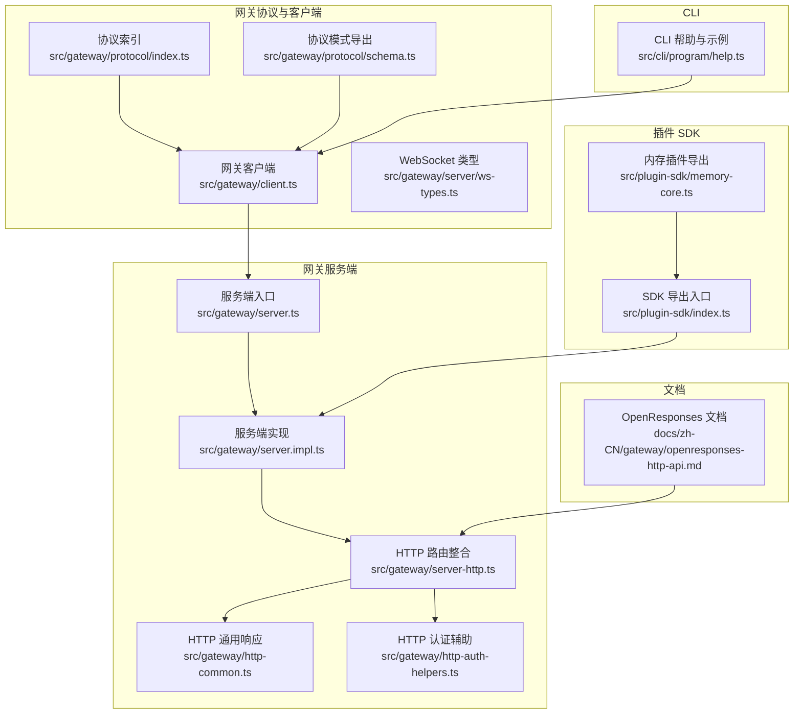
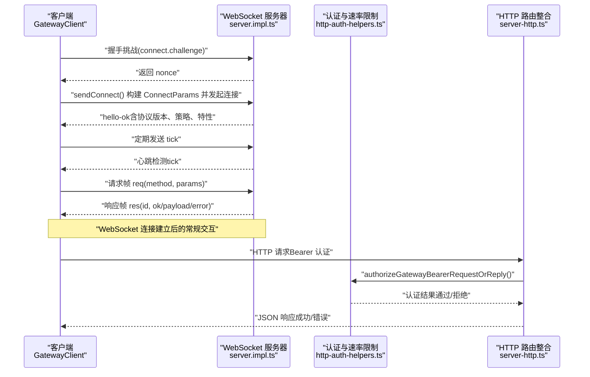
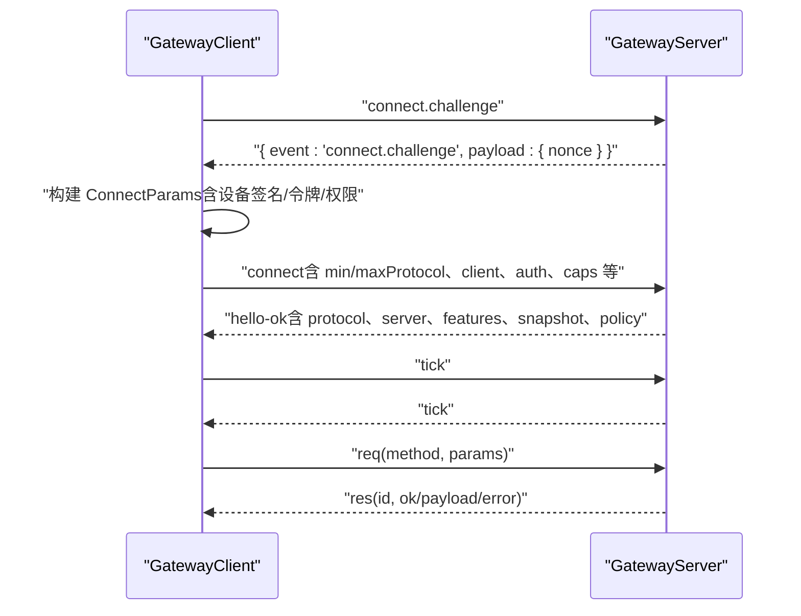
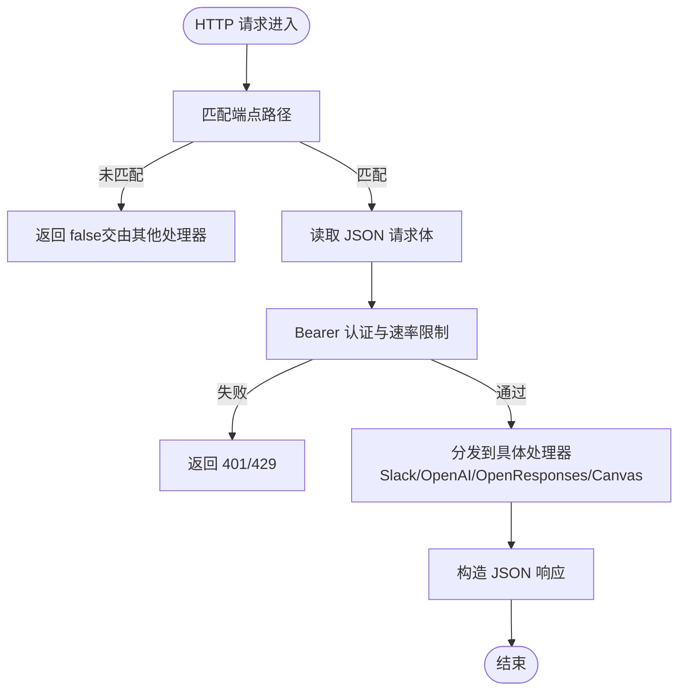
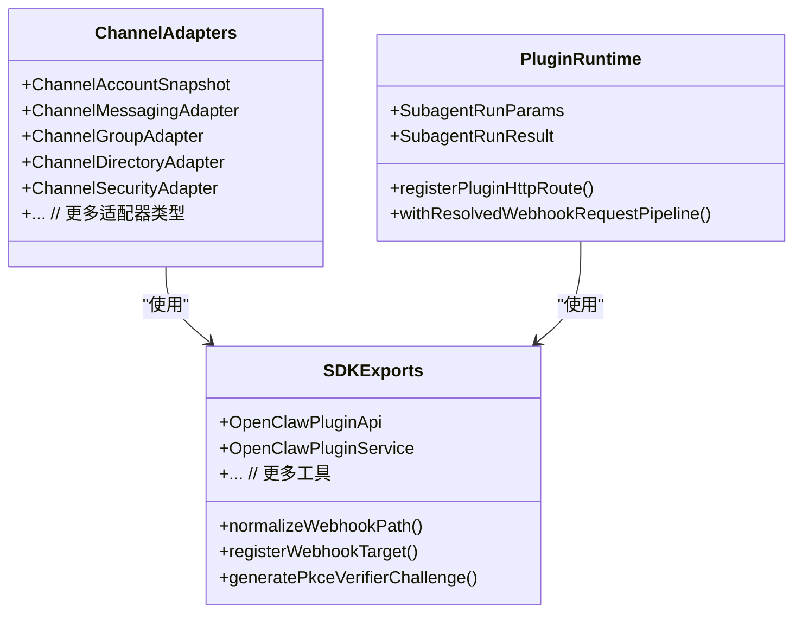
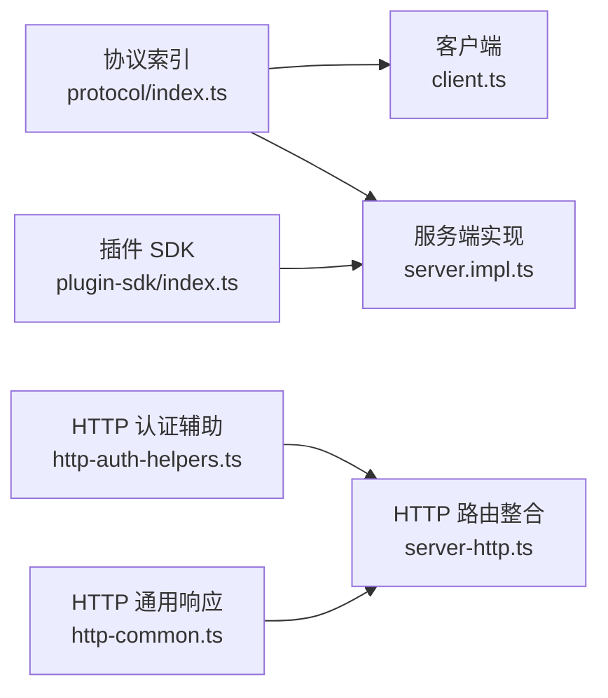

# API 参考

<cite>
**本文引用的文件**
- [src/gateway/protocol/index.ts](file://src/gateway/protocol/index.ts)
- [src/gateway/protocol/schema.ts](file://src/gateway/protocol/schema.ts)
- [src/gateway/client.ts](file://src/gateway/client.ts)
- [src/gateway/server.ts](file://src/gateway/server.ts)
- [src/gateway/server.impl.ts](file://src/gateway/server.impl.ts)
- [src/gateway/server-http.ts](file://src/gateway/server-http.ts)
- [src/gateway/http-common.ts](file://src/gateway/http-common.ts)
- [src/gateway/http-auth-helpers.ts](file://src/gateway/http-auth-helpers.ts)
- [src/gateway/server/ws-types.ts](file://src/gateway/server/ws-types.ts)
- [src/plugin-sdk/index.ts](file://src/plugin-sdk/index.ts)
- [src/plugin-sdk/memory-core.ts](file://src/plugin-sdk/memory-core.ts)
- [src/cli/program/help.ts](file://src/cli/program/help.ts)
- [docs/zh-CN/gateway/openresponses-http-api.md](file://docs/zh-CN/gateway/openresponses-http-api.md)
- [apps/shared/OpenClawKit/Tests/OpenClawKitTests/GatewayNodeSessionTests.swift](file://apps/shared/OpenClawKit/Tests/OpenClawKitTests/GatewayNodeSessionTests.swift)
- [src/agents/openai-ws-connection.test.ts](file://src/agents/openai-ws-connection.test.ts)
- [src/config/version.ts](file://src/config/version.ts)
- [src/infra/git-commit.ts](file://src/infra/git-commit.ts)
</cite>

## 目录
1. [简介](#简介)
2. [项目结构](#项目结构)
3. [核心组件](#核心组件)
4. [架构总览](#架构总览)
5. [详细组件分析](#详细组件分析)
6. [依赖关系分析](#依赖关系分析)
7. [性能考量](#性能考量)
8. [故障排查指南](#故障排查指南)
9. [结论](#结论)
10. [附录](#附录)

## 简介
本参考文档面向 OpenClaw 的 API 使用者与集成开发者，覆盖以下内容：
- WebSocket API：连接流程、帧格式、事件类型、序列号与心跳检测、错误处理与重连策略
- HTTP API：REST 端点、请求/响应模式、认证与速率限制
- 插件 SDK：接口规范、回调与数据结构、通道适配器与运行时
- CLI 命令：命令语法、参数选项与示例
- 协议与版本管理：协议版本、向后兼容性与变更策略
- 安全与调试：TLS 校验、指纹校验、错误码与诊断
- 常见用例与性能优化：典型交互模式、监控与排障

## 项目结构
OpenClaw 的 API 相关能力主要分布在以下模块：
- 网关协议与客户端：协议定义、验证器、客户端实现
- 网关服务端：WebSocket 与 HTTP 入口、认证与速率限制、方法分发
- 插件 SDK：通道适配器、运行时、Webhook 与注册机制
- CLI：命令行帮助与示例展示
- 文档：HTTP API 使用说明与配置示例

图表来源
- [src/gateway/protocol/index.ts:1-673](file://src/gateway/protocol/index.ts#L1-L673)
- [src/gateway/protocol/schema.ts:1-19](file://src/gateway/protocol/schema.ts#L1-L19)
- [src/gateway/client.ts:1-674](file://src/gateway/client.ts#L1-L674)
- [src/gateway/server.ts:1-4](file://src/gateway/server.ts#L1-L4)
- [src/gateway/server.impl.ts:1-200](file://src/gateway/server.impl.ts#L1-L200)
- [src/gateway/server-http.ts:655-700](file://src/gateway/server-http.ts#L655-L700)
- [src/gateway/http-common.ts:36-71](file://src/gateway/http-common.ts#L36-L71)
- [src/gateway/http-auth-helpers.ts:1-30](file://src/gateway/http-auth-helpers.ts#L1-L30)
- [src/plugin-sdk/index.ts:1-800](file://src/plugin-sdk/index.ts#L1-L800)
- [src/plugin-sdk/memory-core.ts:1-5](file://src/plugin-sdk/memory-core.ts#L1-L5)
- [src/cli/program/help.ts:129-140](file://src/cli/program/help.ts#L129-L140)
- [docs/zh-CN/gateway/openresponses-http-api.md:53-132](file://docs/zh-CN/gateway/openresponses-http-api.md#L53-L132)

章节来源
- [src/gateway/protocol/index.ts:1-673](file://src/gateway/protocol/index.ts#L1-L673)
- [src/gateway/client.ts:1-674](file://src/gateway/client.ts#L1-L674)
- [src/gateway/server.impl.ts:1-200](file://src/gateway/server.impl.ts#L1-L200)
- [src/gateway/server-http.ts:655-700](file://src/gateway/server-http.ts#L655-L700)
- [src/gateway/http-common.ts:36-71](file://src/gateway/http-common.ts#L36-L71)
- [src/gateway/http-auth-helpers.ts:1-30](file://src/gateway/http-auth-helpers.ts#L1-L30)
- [src/plugin-sdk/index.ts:1-800](file://src/plugin-sdk/index.ts#L1-L800)
- [src/plugin-sdk/memory-core.ts:1-5](file://src/plugin-sdk/memory-core.ts#L1-L5)
- [src/cli/program/help.ts:129-140](file://src/cli/program/help.ts#L129-L140)
- [docs/zh-CN/gateway/openresponses-http-api.md:53-132](file://docs/zh-CN/gateway/openresponses-http-api.md#L53-L132)

## 核心组件
- 协议与验证器：通过 AJV 编译的请求/响应/事件帧与各业务参数的校验器，统一错误格式化
- 网关客户端：负责握手挑战、连接参数构建、设备签名、序列号与心跳检测、断线重连与错误传播
- 网关服务端：WebSocket 与 HTTP 入口、认证与速率限制、方法分发与插件集成
- 插件 SDK：通道适配器、运行时、Webhook 注册与请求守卫、OAuth 工具等
- CLI：命令帮助文本与示例展示

章节来源
- [src/gateway/protocol/index.ts:253-458](file://src/gateway/protocol/index.ts#L253-L458)
- [src/gateway/client.ts:109-674](file://src/gateway/client.ts#L109-L674)
- [src/gateway/server.impl.ts:1-200](file://src/gateway/server.impl.ts#L1-L200)
- [src/plugin-sdk/index.ts:1-800](file://src/plugin-sdk/index.ts#L1-L800)

## 架构总览
下图展示了从客户端到服务端的典型交互路径，以及 HTTP 端点的认证与路由。

图表来源
- [src/gateway/client.ts:497-554](file://src/gateway/client.ts#L497-L554)
- [src/gateway/server.impl.ts:1-200](file://src/gateway/server.impl.ts#L1-L200)
- [src/gateway/http-auth-helpers.ts:7-29](file://src/gateway/http-auth-helpers.ts#L7-L29)
- [src/gateway/server-http.ts:655-700](file://src/gateway/server-http.ts#L655-L700)

## 详细组件分析

### WebSocket API
- 连接处理
  - 客户端在打开连接后等待服务端的“connect.challenge”事件，携带 nonce；随后发送 ConnectParams 完成握手
  - 支持设备签名与令牌组合认证，可持久化设备令牌并在后续连接中复用
  - 安全检查：禁止对非本地地址使用明文 ws://，远程需 wss://；可选 TLS 指纹校验
- 帧格式
  - 请求帧：type="req"，包含 id、method、params
  - 响应帧：type="res"，包含 id、ok、payload 或 error
  - 事件帧：type="event"，包含 event 名称与 payload
  - 所有帧均受 AJV 模式校验，错误统一格式化
- 序列号与事件
  - 客户端维护 lastSeq，检测丢包并触发 onGap 回调
  - 事件帧支持 "tick"，用于心跳检测；客户端据此判断连接是否静默停滞
- 实时交互模式
  - 客户端在收到 hello-ok 后启动心跳定时器，周期性检测 lastTick 与策略中的 tickIntervalMs
  - 断线自动指数退避重连，支持一次性设备令牌重试预算
- 错误处理与安全
  - 连接失败时根据错误详情码决定是否暂停重连（如认证失败、配对要求、设备身份缺失等）
  - TLS 指纹校验失败时主动关闭连接并报告错误
  - 客户端对解析异常与无效字段进行容错处理并记录日志

图表来源
- [src/gateway/client.ts:497-554](file://src/gateway/client.ts#L497-L554)
- [src/gateway/client.ts:369-414](file://src/gateway/client.ts#L369-L414)
- [src/gateway/server/ws-types.ts:4-13](file://src/gateway/server/ws-types.ts#L4-L13)
- [apps/shared/OpenClawKit/Tests/OpenClawKitTests/GatewayNodeSessionTests.swift:104-138](file://apps/shared/OpenClawKit/Tests/OpenClawKitTests/GatewayNodeSessionTests.swift#L104-L138)

章节来源
- [src/gateway/client.ts:109-674](file://src/gateway/client.ts#L109-L674)
- [src/gateway/protocol/index.ts:253-458](file://src/gateway/protocol/index.ts#L253-L458)
- [src/gateway/server/ws-types.ts:4-13](file://src/gateway/server/ws-types.ts#L4-L13)
- [apps/shared/OpenClawKit/Tests/OpenClawKitTests/GatewayNodeSessionTests.swift:104-138](file://apps/shared/OpenClawKit/Tests/OpenClawKitTests/GatewayNodeSessionTests.swift#L104-L138)
- [src/agents/openai-ws-connection.test.ts:617-648](file://src/agents/openai-ws-connection.test.ts#L617-L648)

### HTTP API
- 端点与路由
  - HTTP 入口按阶段链路处理请求，支持 Slack、OpenResponses、OpenAI Chat Completions 等子路由
  - Canvas 身份认证在匹配到特定路径时进行授权
- 认证与速率限制
  - Bearer Token 认证：从 Authorization 头提取 token，结合可信代理与真实 IP 回退策略
  - 速率限制：根据认证结果返回 429 并设置 Retry-After
- 请求/响应模式
  - 统一 JSON 响应体，错误包含 message 与 type 字段
  - 方法不被允许时返回 405，并在 Allow 头声明允许的方法
- OpenResponses 端点
  - 支持 input、instructions、tools、tool_choice、stream、max_output_tokens、user 等参数
  - 会话行为：默认无状态；当请求包含 user 时可派生稳定会话键

图表来源
- [src/gateway/server-http.ts:655-700](file://src/gateway/server-http.ts#L655-L700)
- [src/gateway/http-auth-helpers.ts:7-29](file://src/gateway/http-auth-helpers.ts#L7-L29)
- [src/gateway/http-common.ts:36-71](file://src/gateway/http-common.ts#L36-L71)
- [docs/zh-CN/gateway/openresponses-http-api.md:53-132](file://docs/zh-CN/gateway/openresponses-http-api.md#L53-L132)

章节来源
- [src/gateway/server-http.ts:655-700](file://src/gateway/server-http.ts#L655-L700)
- [src/gateway/http-auth-helpers.ts:1-30](file://src/gateway/http-auth-helpers.ts#L1-L30)
- [src/gateway/http-common.ts:36-71](file://src/gateway/http-common.ts#L36-L71)
- [docs/zh-CN/gateway/openresponses-http-api.md:53-132](file://docs/zh-CN/gateway/openresponses-http-api.md#L53-L132)

### 插件 SDK 接口规范
- 导出范围
  - 通道适配器类型（账户、消息、群组、目录、安全、心跳等）
  - 插件运行时类型（子代理运行、会话管理、Webhook 注册）
  - OAuth 工具、请求 URL 规范化、Webhook 目标解析与守卫
  - 配置模式、运行时环境、诊断事件等
- 关键类型与职责
  - Channel*Adapter：封装不同渠道（Discord、Slack、Telegram、WhatsApp 等）的适配逻辑
  - OpenClawPluginApi/OpenClawPluginService：插件对外暴露的服务与配置模式
  - Webhook 注册与守卫：提供注册、鉴权、限流与请求体读取的工具集
- 内存插件导出
  - 仅导出必要的符号，确保插件面窄且可维护

图表来源
- [src/plugin-sdk/index.ts:1-800](file://src/plugin-sdk/index.ts#L1-L800)
- [src/plugin-sdk/memory-core.ts:1-5](file://src/plugin-sdk/memory-core.ts#L1-L5)

章节来源
- [src/plugin-sdk/index.ts:1-800](file://src/plugin-sdk/index.ts#L1-L800)
- [src/plugin-sdk/memory-core.ts:1-5](file://src/plugin-sdk/memory-core.ts#L1-L5)

### CLI 命令参考
- 命令语法与帮助
  - CLI 提供统一的帮助文本与示例，示例以数组形式组织，展示常用命令与用途
  - 帮助文本在 afterAll 阶段追加，包含文档链接
- 示例
  - 包含多个命令示例，便于快速上手与参考

章节来源
- [src/cli/program/help.ts:129-140](file://src/cli/program/help.ts#L129-L140)

## 依赖关系分析
- 协议层
  - 协议索引导出所有模式与校验器，客户端与服务端均依赖该索引进行帧校验与错误格式化
- 客户端与服务端
  - 客户端依赖协议索引与网络工具，服务端实现依赖认证、速率限制与方法分发
- HTTP 层
  - HTTP 入口依赖认证辅助与通用响应工具，按配置启用不同子路由
- 插件 SDK
  - 与服务端插件注册、运行时、Webhook 管线紧密耦合

图表来源
- [src/gateway/protocol/index.ts:1-673](file://src/gateway/protocol/index.ts#L1-L673)
- [src/gateway/client.ts:1-674](file://src/gateway/client.ts#L1-L674)
- [src/gateway/server.impl.ts:1-200](file://src/gateway/server.impl.ts#L1-L200)
- [src/gateway/http-auth-helpers.ts:1-30](file://src/gateway/http-auth-helpers.ts#L1-L30)
- [src/gateway/http-common.ts:36-71](file://src/gateway/http-common.ts#L36-L71)
- [src/plugin-sdk/index.ts:1-800](file://src/plugin-sdk/index.ts#L1-L800)

章节来源
- [src/gateway/protocol/index.ts:1-673](file://src/gateway/protocol/index.ts#L1-L673)
- [src/gateway/client.ts:1-674](file://src/gateway/client.ts#L1-L674)
- [src/gateway/server.impl.ts:1-200](file://src/gateway/server.impl.ts#L1-L200)
- [src/gateway/http-auth-helpers.ts:1-30](file://src/gateway/http-auth-helpers.ts#L1-L30)
- [src/gateway/http-common.ts:36-71](file://src/gateway/http-common.ts#L36-L71)
- [src/plugin-sdk/index.ts:1-800](file://src/plugin-sdk/index.ts#L1-L800)

## 性能考量
- 心跳与保活
  - 客户端依据服务端策略 tickIntervalMs 定期发送 tick，避免被判定为静默停滞
  - 服务端健康状态与存在性版本更新，便于监控与排障
- 速率限制与重试
  - HTTP 认证采用速率限制器，失败时返回 Retry-After，避免暴力尝试
  - 客户端断线重连采用指数退避，降低风暴效应
- 负载与缓冲
  - 客户端 WebSocket maxPayload 设定较大值，满足屏幕快照等大响应场景
- 插件与并发
  - 服务端通过并发控制与队列管理，平衡插件与通道负载

章节来源
- [src/gateway/client.ts:124-125](file://src/gateway/client.ts#L124-L125)
- [src/gateway/server.impl.ts:104-109](file://src/gateway/server.impl.ts#L104-L109)
- [src/gateway/http-common.ts:47-57](file://src/gateway/http-common.ts#L47-L57)

## 故障排查指南
- WebSocket 连接问题
  - 明文 ws:// 非本地地址被阻断：请改用 wss:// 或通过 SSH 隧道/服务发现方式
  - TLS 指纹不匹配：确认指纹规范化与证书一致性
  - 连接挑战超时：检查服务端可达性与网络策略
  - 设备令牌不匹配：清理过期设备令牌缓存并重新配对
- HTTP 认证问题
  - 401 Unauthorized：检查 Bearer Token 是否正确传递
  - 429 Too Many Requests：遵守 Retry-After 并降低请求频率
- 事件与序列
  - 丢包检测：onGap 回调提供期望与实际序号，便于定位网络抖动
  - 心跳停滞：若 gap 超过阈值，服务端会主动关闭连接

章节来源
- [src/gateway/client.ts:144-168](file://src/gateway/client.ts#L144-L168)
- [src/gateway/client.ts:614-617](file://src/gateway/client.ts#L614-L617)
- [src/gateway/http-common.ts:41-71](file://src/gateway/http-common.ts#L41-L71)
- [src/agents/openai-ws-connection.test.ts:617-648](file://src/agents/openai-ws-connection.test.ts#L617-L648)

## 结论
OpenClaw 的 API 以协议为中心，围绕 WebSocket 与 HTTP 提供一致的认证、校验与错误处理机制。客户端具备完善的连接与保活策略，服务端支持灵活的插件生态与多渠道适配。通过严格的速率限制与安全检查，保障生产环境的稳定性与安全性。

## 附录

### 协议与版本管理
- 协议版本
  - 客户端与服务端通过 min/maxProtocol 协商，确保兼容性
- 版本比较
  - 提供版本解析与比较工具，便于运行时版本比对与迁移策略制定
- 提交信息
  - 支持从 Git、构建信息与包元数据解析提交哈希，便于追踪与审计

章节来源
- [src/gateway/protocol/index.ts:173-173](file://src/gateway/protocol/index.ts#L173-L173)
- [src/gateway/client.ts:344-347](file://src/gateway/client.ts#L344-L347)
- [src/config/version.ts:1-49](file://src/config/version.ts#L1-L49)
- [src/infra/git-commit.ts:184-233](file://src/infra/git-commit.ts#L184-L233)