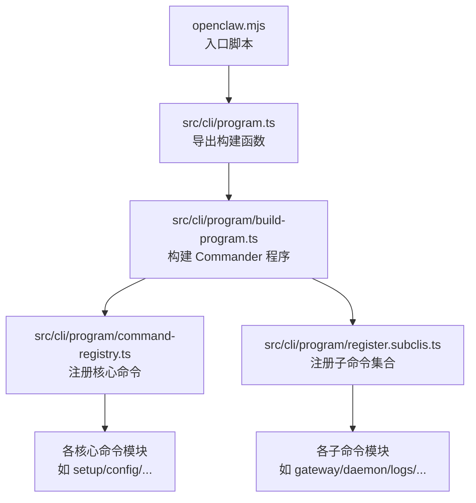
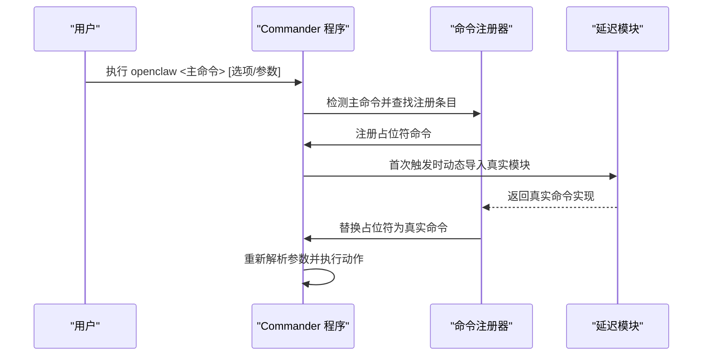
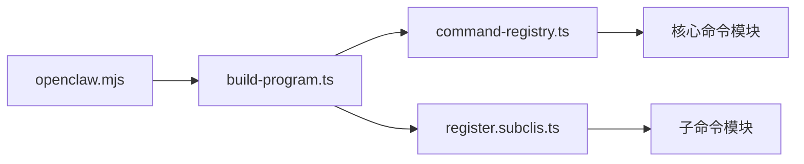

# CLI 命令参考

<cite>
**本文引用的文件**
- [openclaw.mjs](file://openclaw.mjs)
- [package.json](file://package.json)
- [src/cli/program.ts](file://src/cli/program.ts)
- [src/cli/program/build-program.ts](file://src/cli/program/build-program.ts)
- [src/cli/program/command-registry.ts](file://src/cli/program/command-registry.ts)
- [src/cli/program/register.subclis.ts](file://src/cli/program/register.subclis.ts)
- [src/cli/program/register.setup.ts](file://src/cli/program/register.setup.ts)
- [src/cli/program/register.configure.ts](file://src/cli/program/register.configure.ts)
- [src/cli/command-options.ts](file://src/cli/command-options.ts)
- [src/cli/log-level-option.ts](file://src/cli/log-level-option.ts)
- [src/cli/config-cli.ts](file://src/cli/config-cli.ts)
- [src/cli/backup-cli.ts](file://src/cli/backup-cli.ts)
- [src/cli/doctor-cli.ts](file://src/cli/doctor-cli.ts)
- [src/cli/dashboard-cli.ts](file://src/cli/dashboard-cli.ts)
- [src/cli/reset-cli.ts](file://src/cli/reset-cli.ts)
- [src/cli/uninstall-cli.ts](file://src/cli/uninstall-cli.ts)
- [src/cli/message-cli.ts](file://src/cli/message-cli.ts)
- [src/cli/memory-cli.ts](file://src/cli/memory-cli.ts)
- [src/cli/agent-cli.ts](file://src/cli/agent-cli.ts)
- [src/cli/agents-cli.ts](file://src/cli/agents-cli.ts)
- [src/cli/status-cli.ts](file://src/cli/status-cli.ts)
- [src/cli/health-cli.ts](file://src/cli/health-cli.ts)
- [src/cli/sessions-cli.ts](file://src/cli/sessions-cli.ts)
- [src/cli/browser-cli.ts](file://src/cli/browser-cli.ts)
- [src/cli/acp-cli.ts](file://src/cli/acp-cli.ts)
- [src/cli/gateway-cli.ts](file://src/cli/gateway-cli.ts)
- [src/cli/daemon-cli.ts](file://src/cli/daemon-cli.ts)
- [src/cli/logs-cli.ts](file://src/cli/logs-cli.ts)
- [src/cli/system-cli.ts](file://src/cli/system-cli.ts)
- [src/cli/models-cli.ts](file://src/cli/models-cli.ts)
- [src/cli/exec-approvals-cli.ts](file://src/cli/exec-approvals-cli.ts)
- [src/cli/nodes-cli.ts](file://src/cli/nodes-cli.ts)
- [src/cli/devices-cli.ts](file://src/cli/devices-cli.ts)
- [src/cli/node-cli.ts](file://src/cli/node-cli.ts)
- [src/cli/sandbox-cli.ts](file://src/cli/sandbox-cli.ts)
- [src/cli/tui-cli.ts](file://src/cli/tui-cli.ts)
- [src/cli/cron-cli.ts](file://src/cli/cron-cli.ts)
- [src/cli/dns-cli.ts](file://src/cli/dns-cli.ts)
- [src/cli/docs-cli.ts](file://src/cli/docs-cli.ts)
- [src/cli/hooks-cli.ts](file://src/cli/hooks-cli.ts)
- [src/cli/webhooks-cli.ts](file://src/cli/webhooks-cli.ts)
- [src/cli/qr-cli.ts](file://src/cli/qr-cli.ts)
- [src/cli/clawbot-cli.ts](file://src/cli/clawbot-cli.ts)
- [src/cli/pairing-cli.ts](file://src/cli/pairing-cli.ts)
- [src/cli/plugins-cli.ts](file://src/cli/plugins-cli.ts)
- [src/cli/channels-cli.ts](file://src/cli/channels-cli.ts)
- [src/cli/directory-cli.ts](file://src/cli/directory-cli.ts)
- [src/cli/security-cli.ts](file://src/cli/security-cli.ts)
- [src/cli/secrets-cli.ts](file://src/cli/secrets-cli.ts)
- [src/cli/skills-cli.ts](file://src/cli/skills-cli.ts)
- [src/cli/update-cli.ts](file://src/cli/update-cli.ts)
- [src/cli/completion-cli.ts](file://src/cli/completion-cli.ts)
</cite>

## 目录
1. [简介](#简介)
2. [项目结构](#项目结构)
3. [核心组件](#核心组件)
4. [架构总览](#架构总览)
5. [详细组件分析](#详细组件分析)
6. [依赖关系分析](#依赖关系分析)
7. [性能与启动特性](#性能与启动特性)
8. [配置与环境变量](#配置与环境变量)
9. [命令参考索引](#命令参考索引)
10. [常用工作流与组合示例](#常用工作流与组合示例)
11. [故障排除指南](#故障排除指南)
12. [结论](#结论)

## 简介
本文件为 OpenClaw CLI 工具的命令参考与使用指南，覆盖所有顶层命令及其子命令、参数选项、执行流程、配置加载与输出格式等。文档同时提供常见工作流、与外部工具的集成方式（如管道与脚本）以及故障排除建议。

## 项目结构
OpenClaw CLI 通过一个统一的程序入口加载运行时与命令注册器，按需延迟加载各子命令模块，以提升启动速度与可维护性。核心入口与程序构建逻辑如下：

图表来源
- [openclaw.mjs:1-90](file://openclaw.mjs#L1-L90)
- [src/cli/program.ts:1-3](file://src/cli/program.ts#L1-L3)
- [src/cli/program/build-program.ts:1-21](file://src/cli/program/build-program.ts#L1-L21)
- [src/cli/program/command-registry.ts:1-318](file://src/cli/program/command-registry.ts#L1-L318)
- [src/cli/program/register.subclis.ts:1-360](file://src/cli/program/register.subclis.ts#L1-L360)

章节来源
- [openclaw.mjs:1-90](file://openclaw.mjs#L1-L90)
- [package.json:16-18](file://package.json#L16-L18)
- [src/cli/program.ts:1-3](file://src/cli/program.ts#L1-L3)
- [src/cli/program/build-program.ts:1-21](file://src/cli/program/build-program.ts#L1-L21)
- [src/cli/program/command-registry.ts:1-318](file://src/cli/program/command-registry.ts#L1-L318)
- [src/cli/program/register.subclis.ts:1-360](file://src/cli/program/register.subclis.ts#L1-L360)

## 核心组件
- 程序入口与版本要求：入口脚本校验 Node.js 版本并启用编译缓存，随后尝试加载构建产物中的入口模块。
- 程序构建：创建 Commander 程序实例，设置上下文、帮助信息与预动作钩子，并注册命令。
- 延迟加载机制：核心命令与子命令均采用占位符命令，在首次触发时动态导入并替换为真实命令实现。
- 配置与运行时：命令在运行前通过统一的运行时包装器初始化，确保日志、配置与插件系统可用。

章节来源
- [openclaw.mjs:17-36](file://openclaw.mjs#L17-L36)
- [openclaw.mjs:39-45](file://openclaw.mjs#L39-L45)
- [src/cli/program/build-program.ts:8-20](file://src/cli/program/build-program.ts#L8-L20)
- [src/cli/program/command-registry.ts:254-286](file://src/cli/program/command-registry.ts#L254-L286)
- [src/cli/program/register.subclis.ts:330-359](file://src/cli/program/register.subclis.ts#L330-L359)

## 架构总览
下图展示 CLI 的命令树与注册流程，包括核心命令与子命令两大类，以及延迟加载策略：

```mermaid
graph TB
subgraph "核心命令"
S["setup"]
O["onboard"]
Cfg["configure"]
Conf["config"]
Bk["backup"]
DocDashRes["doctor/dashboard/reset/uninstall"]
Msg["message"]
Mem["memory"]
Ag["agent/agents"]
StHeSes["status/health/sessions"]
Br["browser"]
end
subgraph "子命令"
Acp["acp"]
Gw["gateway/daemon"]
Logs["logs"]
Sys["system"]
Mdl["models"]
App["approvals"]
Nds["nodes/devices/node"]
Sbx["sandbox"]
Tui["tui"]
Cron["cron"]
Dns["dns"]
Docs["docs"]
Hooks["hooks"]
Wh["webhooks"]
Qr["qr"]
Claw["clawbot"]
Pair["pairing"]
Plg["plugins"]
Ch["channels"]
Dir["directory"]
Sec["security"]
Secr["secrets"]
Sk["skills"]
Up["update"]
Comp["completion"]
end
Root["openclaw"] --> S & O & Cfg & Conf & Bk & DocDashRes & Msg & Mem & Ag & StHeSes & Br
Root --> Acp & Gw & Logs & Sys & Mdl & App & Nds & Sbx & Tui & Cron & Dns & Docs & Hooks & Wh & Qr & Claw & Pair & Plg & Ch & Dir & Sec & Secr & Sk & Up & Comp
```

图表来源
- [src/cli/program/command-registry.ts:40-218](file://src/cli/program/command-registry.ts#L40-L218)
- [src/cli/program/register.subclis.ts:44-310](file://src/cli/program/register.subclis.ts#L44-L310)

## 详细组件分析

### 命令注册与延迟加载机制
- 占位符命令：首次执行时移除占位符并动态导入真实模块，再重新解析参数并执行。
- 环境控制：可通过环境变量禁用延迟加载，直接全量注册。
- 主命令识别：根据首个非选项参数决定是否仅注册该主命令，以优化启动时间。

图表来源
- [src/cli/program/command-registry.ts:254-286](file://src/cli/program/command-registry.ts#L254-L286)
- [src/cli/program/register.subclis.ts:330-359](file://src/cli/program/register.subclis.ts#L330-L359)

章节来源
- [src/cli/program/command-registry.ts:254-286](file://src/cli/program/command-registry.ts#L254-L286)
- [src/cli/program/register.subclis.ts:330-359](file://src/cli/program/register.subclis.ts#L330-L359)

### 日志级别与通用选项
- 日志级别解析：支持从字符串解析日志级别，非法值会触发参数错误。
- 选项继承：支持从父命令或祖父命令继承未显式设置的选项，深度限制避免无界遍历。

章节来源
- [src/cli/log-level-option.ts:1-13](file://src/cli/log-level-option.ts#L1-L13)
- [src/cli/command-options.ts:17-44](file://src/cli/command-options.ts#L17-L44)

### 核心命令：setup
- 功能：初始化本地配置与代理工作区；可选交互式向导。
- 关键选项：
  - --workspace <dir>：指定代理工作区目录。
  - --wizard：启用交互式向导。
  - --non-interactive：非交互模式。
  - --mode <local|remote>：向导模式。
  - --remote-url <url>：远程网关 WebSocket 地址。
  - --remote-token <token>：远程网关访问令牌（可选）。
- 行为：若提供向导相关选项，则转交到 onboard 流程；否则执行基础 setup 初始化。

章节来源
- [src/cli/program/register.setup.ts:10-54](file://src/cli/program/register.setup.ts#L10-L54)

### 核心命令：configure
- 功能：交互式配置向导，支持选择配置分段。
- 关键选项：
  - --section <section>：可重复，限定配置分段。
- 行为：基于分段参数运行配置流程。

章节来源
- [src/cli/program/register.configure.ts:11-31](file://src/cli/program/register.configure.ts#L11-L31)

### 子命令：gateway/daemon
- 功能：运行、检查与查询 WebSocket 网关。
- 适用场景：诊断网关状态、发起网关内调用、管理网关生命周期。
- 注意：daemon 为 legacy 别名，推荐使用 gateway。

章节来源
- [src/cli/program/register.subclis.ts:54-71](file://src/cli/program/register.subclis.ts#L54-L71)
- [src/cli/gateway-cli.ts](file://src/cli/gateway-cli.ts)
- [src/cli/daemon-cli.ts](file://src/cli/daemon-cli.ts)

### 子命令：logs
- 功能：通过 RPC 实时跟踪网关文件日志。
- 适用场景：开发调试、生产排障。

章节来源
- [src/cli/program/register.subclis.ts:72-80](file://src/cli/program/register.subclis.ts#L72-L80)
- [src/cli/logs-cli.ts](file://src/cli/logs-cli.ts)

### 子命令：system
- 功能：系统事件、心跳与在线状态管理。
- 适用场景：监控系统健康与节点在线情况。

章节来源
- [src/cli/program/register.subclis.ts:81-89](file://src/cli/program/register.subclis.ts#L81-L89)
- [src/cli/system-cli.ts](file://src/cli/system-cli.ts)

### 子命令：models
- 功能：发现、扫描与配置模型。
- 适用场景：选择与切换推理模型、配置模型参数。

章节来源
- [src/cli/program/register.subclis.ts:90-98](file://src/cli/program/register.subclis.ts#L90-L98)
- [src/cli/models-cli.ts](file://src/cli/models-cli.ts)

### 子命令：approvals
- 功能：管理执行审批（网关或节点主机）。
- 适用场景：安全管控高风险执行任务。

章节来源
- [src/cli/program/register.subclis.ts:100-107](file://src/cli/program/register.subclis.ts#L100-L107)
- [src/cli/exec-approvals-cli.ts](file://src/cli/exec-approvals-cli.ts)

### 子命令：nodes/devices/node
- 功能：管理网关拥有的节点配对与节点命令；设备配对与令牌管理；运行与管理无头节点主机服务。
- 适用场景：多节点环境下的设备与节点管理。

章节来源
- [src/cli/program/register.subclis.ts:108-134](file://src/cli/program/register.subclis.ts#L108-L134)
- [src/cli/nodes-cli.ts](file://src/cli/nodes-cli.ts)
- [src/cli/devices-cli.ts](file://src/cli/devices-cli.ts)
- [src/cli/node-cli.ts](file://src/cli/node-cli.ts)

### 子命令：sandbox
- 功能：管理用于代理隔离的沙箱容器。
- 适用场景：隔离高风险任务、资源限制与权限收敛。

章节来源
- [src/cli/program/register.subclis.ts:135-143](file://src/cli/program/register.subclis.ts#L135-L143)
- [src/cli/sandbox-cli.ts](file://src/cli/sandbox-cli.ts)

### 子命令：tui
- 功能：打开与网关连接的终端界面。
- 适用场景：需要图形化但受限于环境的交互场景。

章节来源
- [src/cli/program/register.subclis.ts:144-152](file://src/cli/program/register.subclis.ts#L144-L152)
- [src/cli/tui-cli.ts](file://src/cli/tui-cli.ts)

### 子命令：cron
- 功能：通过网关调度器管理定时任务。
- 适用场景：周期性任务编排与执行。

章节来源
- [src/cli/program/register.subclis.ts:153-161](file://src/cli/program/register.subclis.ts#L153-L161)
- [src/cli/cron-cli.ts](file://src/cli/cron-cli.ts)

### 子命令：dns
- 功能：广域发现辅助（Tailscale 与 CoreDNS）。
- 适用场景：跨网络发现与解析。

章节来源
- [src/cli/program/register.subclis.ts:162-170](file://src/cli/program/register.subclis.ts#L162-L170)
- [src/cli/dns-cli.ts](file://src/cli/dns-cli.ts)

### 子命令：docs
- 功能：搜索在线 OpenClaw 文档。
- 适用场景：快速查阅官方文档。

章节来源
- [src/cli/program/register.subclis.ts:171-179](file://src/cli/program/register.subclis.ts#L171-L179)
- [src/cli/docs-cli.ts](file://src/cli/docs-cli.ts)

### 子命令：hooks
- 功能：管理内部代理钩子。
- 适用场景：扩展代理行为与拦截处理。

章节来源
- [src/cli/program/register.subclis.ts:180-188](file://src/cli/program/register.subclis.ts#L180-L188)
- [src/cli/hooks-cli.ts](file://src/cli/hooks-cli.ts)

### 子命令：webhooks
- 功能：Webhook 辅助与集成。
- 适用场景：外部系统回调与事件推送。

章节来源
- [src/cli/program/register.subclis.ts:189-197](file://src/cli/program/register.subclis.ts#L189-L197)
- [src/cli/webhooks-cli.ts](file://src/cli/webhooks-cli.ts)

### 子命令：qr
- 功能：生成 iOS 配对二维码/设置码。
- 适用场景：移动端快速配对。

章节来源
- [src/cli/program/register.subclis.ts:198-206](file://src/cli/program/register.subclis.ts#L198-L206)
- [src/cli/qr-cli.ts](file://src/cli/qr-cli.ts)

### 子命令：clawbot
- 功能：遗留 clawbot 命令别名。
- 适用场景：兼容旧脚本与迁移期。

章节来源
- [src/cli/program/register.subclis.ts:207-215](file://src/cli/program/register.subclis.ts#L207-L215)
- [src/cli/clawbot-cli.ts](file://src/cli/clawbot-cli.ts)

### 子命令：pairing
- 功能：安全端到端私聊配对（批准入站请求）。
- 适用场景：保护通信隐私与安全。
- 注意：注册时需先初始化插件，以便获取通道插件列表。

章节来源
- [src/cli/program/register.subclis.ts:216-232](file://src/cli/program/register.subclis.ts#L216-L232)
- [src/cli/pairing-cli.ts](file://src/cli/pairing-cli.ts)

### 子命令：plugins
- 功能：管理 OpenClaw 插件与扩展。
- 适用场景：安装、卸载与配置插件生态。
- 注意：注册时需先加载有效配置并初始化插件 CLI 命令。

章节来源
- [src/cli/program/register.subclis.ts:233-246](file://src/cli/program/register.subclis.ts#L233-L246)
- [src/cli/plugins-cli.ts](file://src/cli/plugins-cli.ts)

### 子命令：channels
- 功能：管理已连接聊天通道（Telegram、Discord 等）。
- 适用场景：通道配置、凭据管理与路由设置。

章节来源
- [src/cli/program/register.subclis.ts:247-255](file://src/cli/program/register.subclis.ts#L247-L255)
- [src/cli/channels-cli.ts](file://src/cli/channels-cli.ts)

### 子命令：directory
- 功能：查询受支持聊天通道中的联系人与群组 ID（自、对端、群组）。
- 适用场景：消息路由与目标解析。

章节来源
- [src/cli/program/register.subclis.ts:256-264](file://src/cli/program/register.subclis.ts#L256-L264)
- [src/cli/directory-cli.ts](file://src/cli/directory-cli.ts)

### 子命令：security
- 功能：安全工具与本地配置审计。
- 适用场景：合规检查与安全加固。

章节来源
- [src/cli/program/register.subclis.ts:265-273](file://src/cli/program/register.subclis.ts#L265-L273)
- [src/cli/security-cli.ts](file://src/cli/security-cli.ts)

### 子命令：secrets
- 功能：机密运行时重载控制。
- 适用场景：动态更新密钥与敏感配置。

章节来源
- [src/cli/program/register.subclis.ts:274-282](file://src/cli/program/register.subclis.ts#L274-L282)
- [src/cli/secrets-cli.ts](file://src/cli/secrets-cli.ts)

### 子命令：skills
- 功能：列出与检查可用技能。
- 适用场景：技能清单与能力验证。

章节来源
- [src/cli/program/register.subclis.ts:283-291](file://src/cli/program/register.subclis.ts#L283-L291)
- [src/cli/skills-cli.ts](file://src/cli/skills-cli.ts)

### 子命令：update
- 功能：更新 OpenClaw 并检查更新通道状态。
- 适用场景：版本升级与通道管理。

章节来源
- [src/cli/program/register.subclis.ts:292-300](file://src/cli/program/register.subclis.ts#L292-L300)
- [src/cli/update-cli.ts](file://src/cli/update-cli.ts)

### 子命令：completion
- 功能：生成 Shell 补全脚本。
- 适用场景：提升命令行效率。

章节来源
- [src/cli/program/register.subclis.ts:301-309](file://src/cli/program/register.subclis.ts#L301-L309)
- [src/cli/completion-cli.ts](file://src/cli/completion-cli.ts)

## 依赖关系分析
- 命令注册依赖：核心命令与子命令通过统一注册器集中管理，减少循环依赖风险。
- 运行时依赖：命令在执行前通过运行时包装器初始化，确保日志、配置与插件系统可用。
- 环境变量：可通过环境变量控制延迟加载行为与调试输出。

图表来源
- [openclaw.mjs:1-90](file://openclaw.mjs#L1-L90)
- [src/cli/program/build-program.ts:1-21](file://src/cli/program/build-program.ts#L1-L21)
- [src/cli/program/command-registry.ts:1-318](file://src/cli/program/command-registry.ts#L1-L318)
- [src/cli/program/register.subclis.ts:1-360](file://src/cli/program/register.subclis.ts#L1-L360)

章节来源
- [src/cli/program/build-program.ts:1-21](file://src/cli/program/build-program.ts#L1-L21)
- [src/cli/program/command-registry.ts:1-318](file://src/cli/program/command-registry.ts#L1-L318)
- [src/cli/program/register.subclis.ts:1-360](file://src/cli/program/register.subclis.ts#L1-L360)

## 性能与启动特性
- 延迟加载：仅在首次执行时动态导入命令模块，显著降低启动时间。
- 环境控制：可通过环境变量禁用延迟加载，适合需要立即可用命令列表的场景。
- 编译缓存：入口脚本尝试启用 Node.js 编译缓存以加速模块加载。

章节来源
- [src/cli/program/register.subclis.ts:17-29](file://src/cli/program/register.subclis.ts#L17-L29)
- [openclaw.mjs:39-45](file://openclaw.mjs#L39-L45)

## 配置与环境变量
- 全局配置：默认位于用户目录下的配置文件，命令在运行前加载并验证配置快照。
- 项目配置：部分命令支持在当前工作目录读取配置文件。
- 环境变量优先级：
  - 可通过环境变量控制延迟加载行为。
  - 日志级别可通过命令行选项设置，非法值会被拒绝。
- 插件注册：某些命令在注册时需要先加载有效配置并初始化插件 CLI 命令。

章节来源
- [src/cli/program/register.subclis.ts:31-39](file://src/cli/program/register.subclis.ts#L31-L39)
- [src/cli/log-level-option.ts:1-13](file://src/cli/log-level-option.ts#L1-L13)

## 命令参考索引
以下为所有顶层命令与子命令的简要索引，便于快速定位：

- 核心命令
  - setup：初始化本地配置与代理工作区
  - onboard：交互式引导
  - configure：交互式配置向导
  - config：非交互配置助手（get/set/unset/file/validate）
  - backup：备份与校验
  - doctor/dashboard/reset/uninstall：健康检查与维护
  - message：发送、读取与管理消息
  - memory：搜索与重建内存索引
  - agent/agents：单轮代理与代理管理
  - status/health/sessions：状态、健康与会话
  - browser：管理专用浏览器

- 子命令
  - acp：Agent Control Protocol 工具
  - gateway/daemon：运行与查询网关
  - logs：跟踪网关日志
  - system：系统事件与心跳
  - models：模型发现与配置
  - approvals：执行审批
  - nodes/devices/node：节点与设备管理
  - sandbox：沙箱容器
  - tui：终端界面
  - cron：定时任务
  - dns：广域发现
  - docs：文档搜索
  - hooks：内部钩子
  - webhooks：Webhook 集成
  - qr：iOS 配对二维码
  - clawbot：遗留别名
  - pairing：安全私聊配对
  - plugins：插件管理
  - channels：聊天通道
  - directory：联系人与群组 ID 查询
  - security：安全工具与审计
  - secrets：机密运行时重载
  - skills：技能清单与检查
  - update：更新与通道状态
  - completion：Shell 补全脚本

章节来源
- [src/cli/program/command-registry.ts:40-218](file://src/cli/program/command-registry.ts#L40-L218)
- [src/cli/program/register.subclis.ts:44-310](file://src/cli/program/register.subclis.ts#L44-L310)

## 常用工作流与组合示例
- 初始化与引导
  - 使用 setup 初始化配置与工作区，必要时附加 --wizard 或 --non-interactive 选项进入向导。
  - 使用 configure 选择特定配置分段进行非交互配置。
- 网关与通道
  - 使用 gateway 查看网关状态与执行查询；使用 channels 管理已连接通道。
  - 使用 pairing 安全批准入站私聊请求。
- 代理与消息
  - 使用 agent 发起一次代理对话回合；使用 agents 管理多个代理工作区。
  - 使用 message 发送与管理消息；使用 memory 搜索与重建索引。
- 维护与诊断
  - 使用 doctor 进行健康检查与快速修复；使用 logs 跟踪网关日志；使用 status/health/sessions 查看状态与会话。
- 自动化与集成
  - 使用 completion 生成补全脚本；结合 shell 脚本与管道进行批量操作；使用 qr 快速生成 iOS 配对码。

章节来源
- [src/cli/program/register.setup.ts:10-54](file://src/cli/program/register.setup.ts#L10-L54)
- [src/cli/program/register.configure.ts:11-31](file://src/cli/program/register.configure.ts#L11-L31)
- [src/cli/program/register.subclis.ts:54-71](file://src/cli/program/register.subclis.ts#L54-L71)
- [src/cli/program/register.subclis.ts:216-232](file://src/cli/program/register.subclis.ts#L216-L232)

## 故障排除指南
- Node.js 版本不满足要求
  - 现象：启动时报错提示需要更高版本。
  - 处理：使用版本管理工具安装并切换到满足要求的 Node.js 版本。
- 延迟加载导致命令不可见
  - 现象：首次执行命令时才出现帮助信息。
  - 处理：可通过环境变量禁用延迟加载；或直接执行具体命令。
- 日志级别无效
  - 现象：传入非法日志级别导致参数错误。
  - 处理：使用允许的日志级别值重新执行。
- 插件未初始化导致命令缺失
  - 现象：某些命令在注册时需要插件存在。
  - 处理：先加载有效配置并初始化插件 CLI 命令后再执行相关命令。

章节来源
- [openclaw.mjs:17-36](file://openclaw.mjs#L17-L36)
- [src/cli/program/register.subclis.ts:17-29](file://src/cli/program/register.subclis.ts#L17-L29)
- [src/cli/log-level-option.ts:6-12](file://src/cli/log-level-option.ts#L6-L12)
- [src/cli/program/register.subclis.ts:220-232](file://src/cli/program/register.subclis.ts#L220-L232)

## 结论
OpenClaw CLI 提供了完善的命令体系与灵活的延迟加载机制，既保证了启动性能，又便于扩展与维护。通过本文档的命令参考与工作流示例，用户可以高效地完成初始化、配置、维护与自动化任务，并在需要时进行深入诊断与集成。