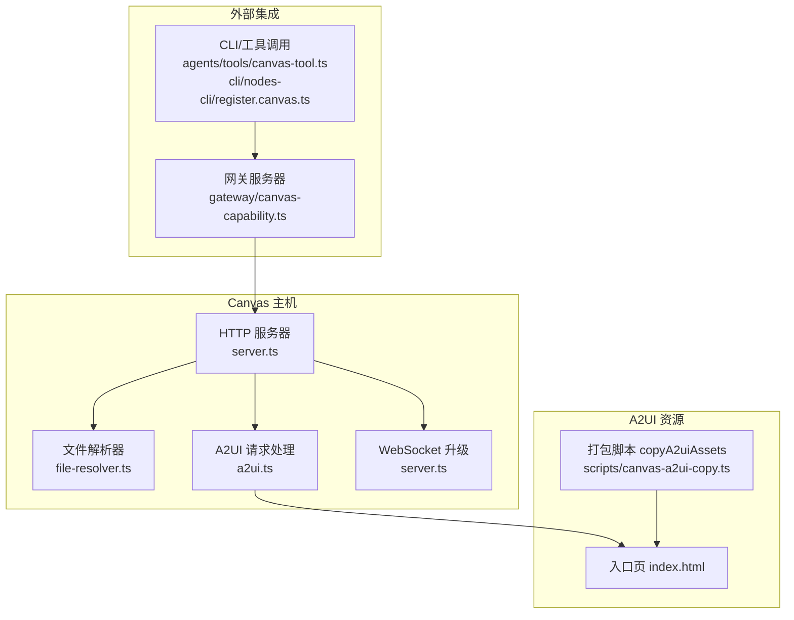
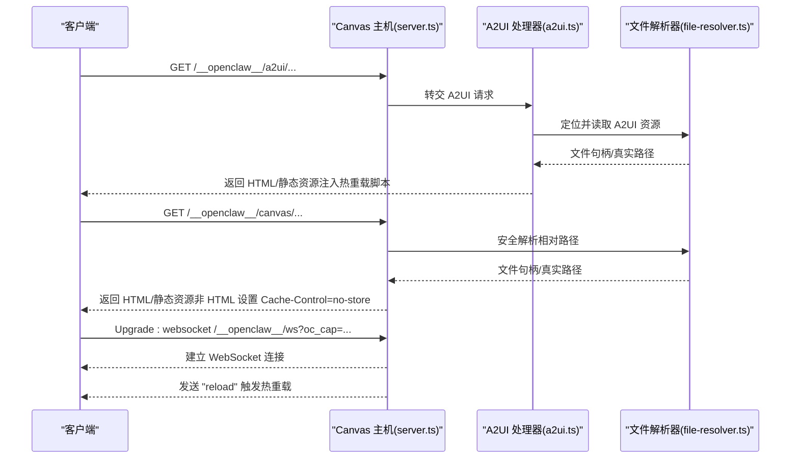
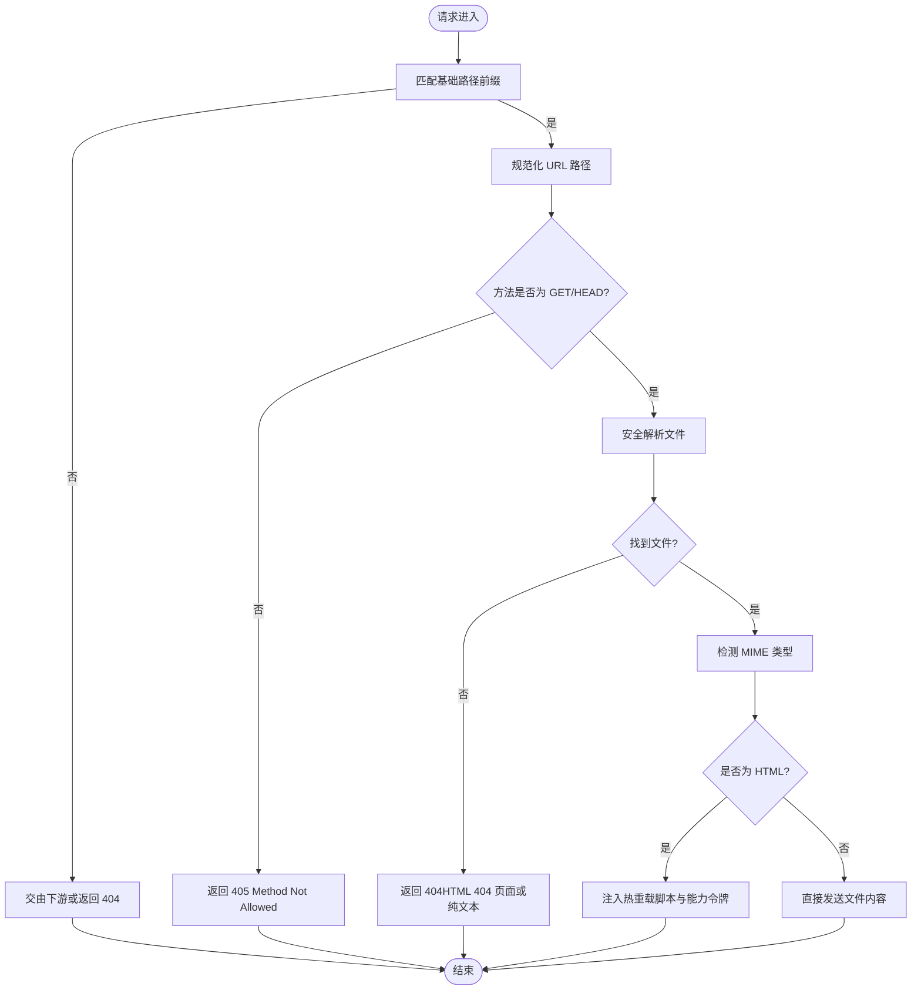
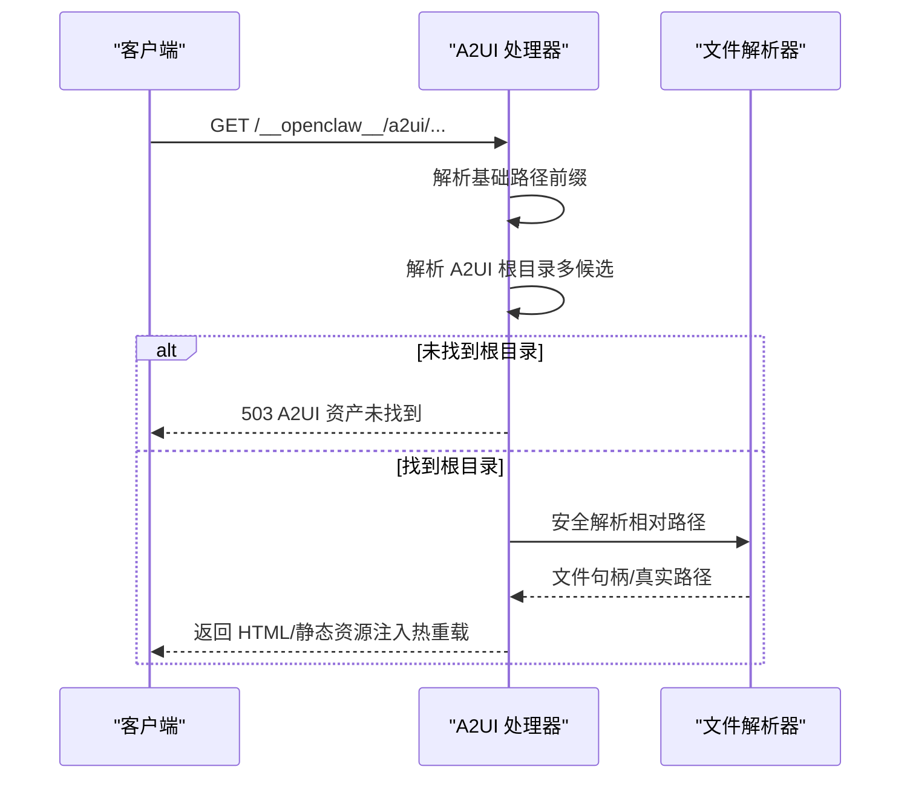
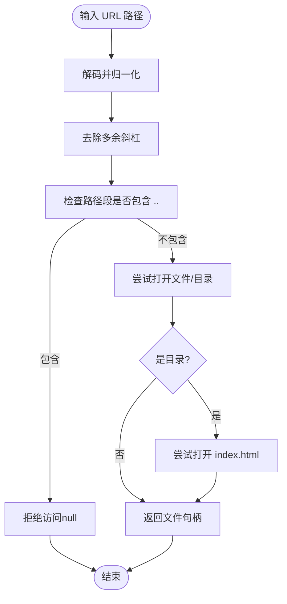
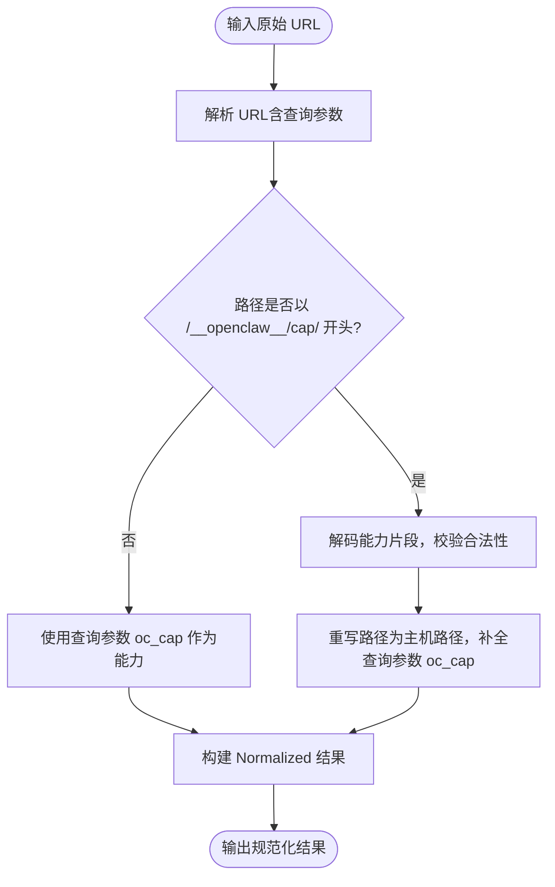
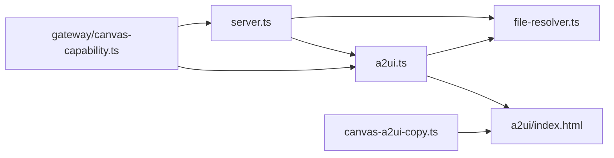

# Canvas API

<cite>
**本文引用的文件**
- [src/canvas-host/server.ts](file://src/canvas-host/server.ts)
- [src/canvas-host/a2ui.ts](file://src/canvas-host/a2ui.ts)
- [src/canvas-host/file-resolver.ts](file://src/canvas-host/file-resolver.ts)
- [src/canvas-host/a2ui/index.html](file://src/canvas-host/a2ui/index.html)
- [src/infra/canvas-host-url.ts](file://src/infra/canvas-host-url.ts)
- [src/gateway/canvas-capability.ts](file://src/gateway/canvas-capability.ts)
- [src/agents/tools/canvas-tool.ts](file://src/agents/tools/canvas-tool.ts)
- [src/cli/nodes-cli/register.canvas.ts](file://src/cli/nodes-cli/register.canvas.ts)
- [scripts/canvas-a2ui-copy.ts](file://scripts/canvas-a2ui-copy.ts)
</cite>

## 目录
1. [简介](#简介)
2. [项目结构](#项目结构)
3. [核心组件](#核心组件)
4. [架构总览](#架构总览)
5. [详细组件分析](#详细组件分析)
6. [依赖关系分析](#依赖关系分析)
7. [性能考虑](#性能考虑)
8. [故障排查指南](#故障排查指南)
9. [结论](#结论)
10. [附录：端点与使用规范](#附录端点与使用规范)

## 简介
本文件为 OpenClaw Canvas HTTP API 的权威参考文档，覆盖以下主题：
- Canvas 主机的 HTTP 接口与路径规则
- 可视化工作区的访问控制与内容服务
- Canvas 能力验证机制（作用域 URL 解析与访问权限控制）
- A2UI（Canvas Host）HTTP 处理（静态资源服务与动态内容注入）
- 完整 Canvas API 端点规范（路径、参数、响应）
- Canvas 与网关服务器的集成方式与安全边界
- 实际使用示例与前端集成指南
- 性能优化与缓存策略
- 开发与调试最佳实践

## 项目结构
Canvas HTTP 服务由“Canvas 主机”和“A2UI 静态资源服务”两部分组成：
- Canvas 主机：提供静态文件服务、WebSocket 实时刷新、基础路径前缀与安全校验
- A2UI 静态资源服务：提供 A2UI 前端页面与打包产物，支持能力令牌注入与热重载

图表来源
- [src/canvas-host/server.ts:1-479](file://src/canvas-host/server.ts#L1-L479)
- [src/canvas-host/a2ui.ts:1-210](file://src/canvas-host/a2ui.ts#L1-L210)
- [src/canvas-host/file-resolver.ts:1-51](file://src/canvas-host/file-resolver.ts#L1-L51)
- [src/canvas-host/a2ui/index.html:1-308](file://src/canvas-host/a2ui/index.html#L1-L308)
- [scripts/canvas-a2ui-copy.ts:1-41](file://scripts/canvas-a2ui-copy.ts#L1-L41)
- [src/gateway/canvas-capability.ts:1-88](file://src/gateway/canvas-capability.ts#L1-L88)
- [src/agents/tools/canvas-tool.ts:1-216](file://src/agents/tools/canvas-tool.ts#L1-L216)
- [src/cli/nodes-cli/register.canvas.ts:1-246](file://src/cli/nodes-cli/register.canvas.ts#L1-L246)

章节来源
- [src/canvas-host/server.ts:1-479](file://src/canvas-host/server.ts#L1-L479)
- [src/canvas-host/a2ui.ts:1-210](file://src/canvas-host/a2ui.ts#L1-L210)
- [src/canvas-host/file-resolver.ts:1-51](file://src/canvas-host/file-resolver.ts#L1-L51)
- [src/canvas-host/a2ui/index.html:1-308](file://src/canvas-host/a2ui/index.html#L1-L308)
- [scripts/canvas-a2ui-copy.ts:1-41](file://scripts/canvas-a2ui-copy.ts#L1-L41)

## 核心组件
- Canvas 主机 HTTP 服务器
  - 提供静态文件服务、基础路径前缀、方法限制、错误处理
  - 支持 WebSocket 升级用于热重载
- A2UI 请求处理器
  - 解析 A2UI 路径前缀，定位 A2UI 资源根目录
  - 注入能力令牌与 WebSocket 热重载脚本
- 文件解析器
  - 规范化 URL 路径，安全打开文件，避免目录穿越
- 能力令牌与作用域 URL
  - 生成能力令牌，构建带能力的 Scoped URL，解析并规范化
- CLI/工具集成
  - CLI 子命令与 Agent 工具封装 Canvas 操作（展示、隐藏、导航、执行脚本、快照、A2UI 推送/重置）

章节来源
- [src/canvas-host/server.ts:205-397](file://src/canvas-host/server.ts#L205-L397)
- [src/canvas-host/a2ui.ts:142-210](file://src/canvas-host/a2ui.ts#L142-L210)
- [src/canvas-host/file-resolver.ts:5-51](file://src/canvas-host/file-resolver.ts#L5-L51)
- [src/gateway/canvas-capability.ts:1-88](file://src/gateway/canvas-capability.ts#L1-L88)
- [src/agents/tools/canvas-tool.ts:80-216](file://src/agents/tools/canvas-tool.ts#L80-L216)
- [src/cli/nodes-cli/register.canvas.ts:28-246](file://src/cli/nodes-cli/register.canvas.ts#L28-L246)

## 架构总览
Canvas 主机在本地启动 HTTP 服务，对外暴露两类路径：
- A2UI 资源路径：/__openclaw__/a2ui/*
- Canvas 静态资源路径：/__openclaw__/canvas/*（默认基础路径），可配置

WebSocket 路径：/__openclaw__/ws，用于热重载推送。

图表来源
- [src/canvas-host/server.ts:301-379](file://src/canvas-host/server.ts#L301-L379)
- [src/canvas-host/a2ui.ts:142-210](file://src/canvas-host/a2ui.ts#L142-L210)
- [src/canvas-host/file-resolver.ts:11-50](file://src/canvas-host/file-resolver.ts#L11-L50)

## 详细组件分析

### 组件一：Canvas 主机 HTTP 服务器
职责与行为
- 基础路径前缀：默认 /__openclaw__/canvas，可通过配置调整
- 方法限制：仅允许 GET/HEAD；其他方法返回 405
- 路径解析：剥离基础路径，规范化 URL，安全打开文件
- HTML 注入：对 HTML 内容注入 WebSocket 热重载脚本与能力令牌
- 错误处理：404/500 状态码与简单文本响应
- WebSocket：升级路径 /__openclaw__/ws，支持 oc_cap 查询参数

图表来源
- [src/canvas-host/server.ts:301-379](file://src/canvas-host/server.ts#L301-L379)
- [src/canvas-host/a2ui.ts:81-140](file://src/canvas-host/a2ui.ts#L81-L140)
- [src/canvas-host/file-resolver.ts:5-51](file://src/canvas-host/file-resolver.ts#L5-L51)

章节来源
- [src/canvas-host/server.ts:205-397](file://src/canvas-host/server.ts#L205-L397)

### 组件二：A2UI 请求处理与静态资源服务
职责与行为
- 路径前缀：/__openclaw__/a2ui
- 自动定位 A2UI 资源根目录（多候选路径），若未找到返回 503
- HEAD/GET 支持，HTML 注入热重载脚本
- Cache-Control：no-store
- 能力令牌：从查询参数 oc_cap 注入到 WebSocket 连接

图表来源
- [src/canvas-host/a2ui.ts:142-210](file://src/canvas-host/a2ui.ts#L142-L210)
- [src/canvas-host/file-resolver.ts:11-50](file://src/canvas-host/file-resolver.ts#L11-L50)

章节来源
- [src/canvas-host/a2ui.ts:1-210](file://src/canvas-host/a2ui.ts#L1-L210)

### 组件三：文件解析器（安全路径解析）
职责与行为
- 规范化 URL 路径（解码、posix 归一化）
- 拒绝包含 “..” 的路径段，防止目录穿越
- 对目录自动尝试 index.html
- 使用安全打开接口，捕获安全异常并返回空结果

图表来源
- [src/canvas-host/file-resolver.ts:5-51](file://src/canvas-host/file-resolver.ts#L5-L51)

章节来源
- [src/canvas-host/file-resolver.ts:1-51](file://src/canvas-host/file-resolver.ts#L1-L51)

### 组件四：能力令牌与作用域 URL（Canvas Capability）
职责与行为
- 生成随机能力令牌（base64url 编码）
- 将能力嵌入到基础 URL 的路径中，形成 Scoped URL
- 解析并规范化 Scoped URL，提取能力参数，必要时重写 URL 并设置查询参数

图表来源
- [src/gateway/canvas-capability.ts:42-87](file://src/gateway/canvas-capability.ts#L42-L87)

章节来源
- [src/gateway/canvas-capability.ts:1-88](file://src/gateway/canvas-capability.ts#L1-L88)

### 组件五：A2UI 入口页与热重载注入
职责与行为
- 入口页 index.html 加载 a2ui.bundle.js
- 注入热重载脚本：建立 WebSocket 连接，接收 "reload" 后刷新页面
- 能力令牌通过查询参数 oc_cap 注入到 WebSocket 地址

章节来源
- [src/canvas-host/a2ui/index.html:1-308](file://src/canvas-host/a2ui/index.html#L1-L308)
- [src/canvas-host/a2ui.ts:81-140](file://src/canvas-host/a2ui.ts#L81-L140)

### 组件六：CLI 与工具集成（Agent 工具）
职责与行为
- CLI 子命令：canvas snapshot/present/hide/navigate/eval/a2ui(push/reset)
- Agent 工具：统一参数校验、节点解析、RPC 调用、超时控制、结果处理（如快照写入临时文件）

章节来源
- [src/cli/nodes-cli/register.canvas.ts:28-246](file://src/cli/nodes-cli/register.canvas.ts#L28-L246)
- [src/agents/tools/canvas-tool.ts:80-216](file://src/agents/tools/canvas-tool.ts#L80-L216)

## 依赖关系分析
- Canvas 主机依赖
  - 文件解析器：确保路径安全
  - A2UI 处理器：提供静态资源服务
  - WebSocket：用于热重载
- A2UI 资产复制
  - 构建后将 src/canvas-host/a2ui 复制到 dist/canvas-host/a2ui
- 能力令牌
  - 网关侧生成与解析，Canvas 主机注入到 HTML 与 WebSocket

图表来源
- [src/canvas-host/server.ts:1-479](file://src/canvas-host/server.ts#L1-L479)
- [src/canvas-host/a2ui.ts:1-210](file://src/canvas-host/a2ui.ts#L1-L210)
- [src/canvas-host/file-resolver.ts:1-51](file://src/canvas-host/file-resolver.ts#L1-L51)
- [src/canvas-host/a2ui/index.html:1-308](file://src/canvas-host/a2ui/index.html#L1-L308)
- [scripts/canvas-a2ui-copy.ts:1-41](file://scripts/canvas-a2ui-copy.ts#L1-L41)
- [src/gateway/canvas-capability.ts:1-88](file://src/gateway/canvas-capability.ts#L1-L88)

章节来源
- [src/canvas-host/server.ts:1-479](file://src/canvas-host/server.ts#L1-L479)
- [src/canvas-host/a2ui.ts:1-210](file://src/canvas-host/a2ui.ts#L1-L210)
- [src/canvas-host/file-resolver.ts:1-51](file://src/canvas-host/file-resolver.ts#L1-L51)
- [scripts/canvas-a2ui-copy.ts:1-41](file://scripts/canvas-a2ui-copy.ts#L1-L41)
- [src/gateway/canvas-capability.ts:1-88](file://src/gateway/canvas-capability.ts#L1-L88)

## 性能考虑
- 缓存策略
  - HTML 默认注入热重载脚本，非 HTML 资源设置 Cache-Control=no-store，适合开发环境
  - 生产部署建议在反向代理层开启静态资源缓存，并为版本化资源启用长缓存
- 热重载
  - WebSocket 推送“reload”，减少手动刷新成本
  - 监听器使用防抖与稳定性阈值，降低频繁写入导致的重复刷新
- 安全与路径解析
  - 严格禁止目录穿越，避免无效文件与符号链接
- 资源复制
  - A2UI 资产复制脚本确保分发目录存在打包产物，避免运行时缺失

章节来源
- [src/canvas-host/server.ts:361-370](file://src/canvas-host/server.ts#L361-L370)
- [src/canvas-host/a2ui.ts:188-194](file://src/canvas-host/a2ui.ts#L188-L194)
- [src/canvas-host/file-resolver.ts:17-19](file://src/canvas-host/file-resolver.ts#L17-L19)
- [scripts/canvas-a2ui-copy.ts:13-28](file://scripts/canvas-a2ui-copy.ts#L13-L28)

## 故障排查指南
常见问题与定位
- 访问 /__openclaw__/a2ui 返回 503
  - 原因：未找到 A2UI 资源根目录
  - 处理：确认已执行资产复制脚本，或设置 OPENCLAW_A2UI_SRC_DIR/OPENCLAW_A2UI_OUT_DIR
- 访问 /__openclaw__/canvas 返回 404
  - 原因：路径不在基础路径前缀内或文件不存在
  - 处理：检查基础路径配置与文件是否存在；目录访问会尝试 index.html
- WebSocket 升级失败
  - 原因：路径非 /__openclaw__/ws 或未携带 oc_cap
  - 处理：确认路径与查询参数；浏览器控制台检查 WebSocket 连接
- 能力令牌无效
  - 原因：Scoped URL 不合法或查询参数缺失
  - 处理：使用能力生成与构建函数，确保编码正确且路径前缀完整

章节来源
- [src/canvas-host/a2ui.ts:165-171](file://src/canvas-host/a2ui.ts#L165-L171)
- [src/canvas-host/server.ts:318-345](file://src/canvas-host/server.ts#L318-L345)
- [src/canvas-host/a2ui.ts:123-130](file://src/canvas-host/a2ui.ts#L123-L130)
- [src/gateway/canvas-capability.ts:42-87](file://src/gateway/canvas-capability.ts#L42-L87)

## 结论
Canvas HTTP API 通过清晰的路径前缀与严格的路径解析，提供了安全可控的可视化工作区内容服务；结合 A2UI 的静态资源与热重载机制，能够高效地进行开发与调试。能力令牌与作用域 URL 为访问控制提供了基础能力，配合网关侧的策略可实现细粒度的安全边界。CLI 与 Agent 工具进一步简化了 Canvas 的操作与集成。

## 附录：端点与使用规范

### 路径与前缀
- A2UI 资源路径：/__openclaw__/a2ui/*
- Canvas 静态资源路径：/__openclaw__/canvas/*（默认基础路径）
- WebSocket 路径：/__openclaw__/ws
- 能力令牌查询参数：oc_cap

章节来源
- [src/canvas-host/a2ui.ts:8-12](file://src/canvas-host/a2ui.ts#L8-L12)
- [src/canvas-host/server.ts:15-19](file://src/canvas-host/server.ts#L15-L19)

### 方法与状态码
- GET/HEAD：允许
- 其他方法：405 Method Not Allowed
- 资源不存在：
  - 目录末尾：404 HTML 页面
  - 普通文件：404 文本
- 服务器内部错误：500 文本
- A2UI 资源根目录缺失：503 文本

章节来源
- [src/canvas-host/server.ts:324-345](file://src/canvas-host/server.ts#L324-L345)
- [src/canvas-host/a2ui.ts:158-179](file://src/canvas-host/a2ui.ts#L158-L179)

### 能力令牌与作用域 URL
- 生成能力令牌：随机 base64url 字符串
- 构建 Scoped URL：将能力嵌入路径 /__openclaw__/cap/{能力}/...
- 规范化流程：解析路径前缀，解码能力，重写路径并补全查询参数
- 作用：在访问链路中标识受控作用域，便于网关侧鉴权与审计

章节来源
- [src/gateway/canvas-capability.ts:20-40](file://src/gateway/canvas-capability.ts#L20-L40)
- [src/gateway/canvas-capability.ts:42-87](file://src/gateway/canvas-capability.ts#L42-L87)

### A2UI 静态资源服务
- 入口页：/__openclaw__/a2ui/index.html
- 打包脚本：copyA2uiAssets，复制 src 到 dist
- 注入内容：热重载脚本（WebSocket）、能力令牌 oc_cap
- MIME 类型：HTML 注入后仍为 text/html；其他资源按扩展名检测

章节来源
- [src/canvas-host/a2ui.ts:19-79](file://src/canvas-host/a2ui.ts#L19-L79)
- [src/canvas-host/a2ui.ts:142-210](file://src/canvas-host/a2ui.ts#L142-L210)
- [src/canvas-host/a2ui/index.html:1-308](file://src/canvas-host/a2ui/index.html#L1-L308)
- [scripts/canvas-a2ui-copy.ts:13-28](file://scripts/canvas-a2ui-copy.ts#L13-L28)

### Canvas 主机静态资源服务
- 基础路径：默认 /__openclaw__/canvas，可配置
- 行为：剥离基础路径，规范化 URL，安全打开文件
- HTML 注入：热重载脚本与能力令牌
- 非 HTML：设置 Cache-Control=no-store

章节来源
- [src/canvas-host/server.ts:168-175](file://src/canvas-host/server.ts#L168-L175)
- [src/canvas-host/server.ts:301-379](file://src/canvas-host/server.ts#L301-L379)
- [src/canvas-host/a2ui.ts:81-140](file://src/canvas-host/a2ui.ts#L81-L140)

### WebSocket 热重载
- 升级路径：/__openclaw__/ws
- 查询参数：oc_cap（可选）
- 行为：服务端向连接推送 "reload"，客户端刷新页面

章节来源
- [src/canvas-host/server.ts:287-299](file://src/canvas-host/server.ts#L287-L299)
- [src/canvas-host/a2ui.ts:123-130](file://src/canvas-host/a2ui.ts#L123-L130)

### 与网关服务器的集成与安全边界
- 能力令牌：由网关侧生成并下发，Canvas 主机在 HTML 中注入，WebSocket 中传递
- 作用域 URL：将能力嵌入路径，网关侧可据此进行访问控制与审计
- 本地监听：Canvas 主机默认仅监听本地回环地址，避免外网直连

章节来源
- [src/gateway/canvas-capability.ts:1-88](file://src/gateway/canvas-capability.ts#L1-L88)
- [src/canvas-host/server.ts:415-420](file://src/canvas-host/server.ts#L415-L420)

### 使用示例与前端集成指南
- 在 Canvas 主机中托管 A2UI
  - 确保 A2UI 资产复制完成
  - 访问 /__openclaw__/a2ui/index.html
- 通过能力令牌访问 Scoped URL
  - 使用能力生成函数构建 Scoped URL
  - 在浏览器中打开，WebSocket 会携带 oc_cap
- 通过 CLI 控制 Canvas
  - 示例命令：canvas present/hide/navigate/eval/snapshot/a2ui(push/reset)
  - 参数：--node、--target/--url、--x/--y/--width/--height、--format/--max-width/--quality 等
- 通过 Agent 工具控制 Canvas
  - 动作：present/hide/navigate/eval/snapshot/a2ui_push/a2ui_reset
  - 参数：根据工具定义进行传入，工具负责节点解析与 RPC 调用

章节来源
- [scripts/canvas-a2ui-copy.ts:13-28](file://scripts/canvas-a2ui-copy.ts#L13-L28)
- [src/cli/nodes-cli/register.canvas.ts:28-246](file://src/cli/nodes-cli/register.canvas.ts#L28-L246)
- [src/agents/tools/canvas-tool.ts:80-216](file://src/agents/tools/canvas-tool.ts#L80-L216)

### 开发与调试最佳实践
- 开发模式
  - 启用热重载：访问 A2UI 入口页，确保 WebSocket 正常
  - 使用能力令牌：在调试时明确作用域边界
- 生产部署
  - 在反向代理层开启静态资源缓存与压缩
  - 限制基础路径前缀与来源 IP，避免直接暴露
- 日志与诊断
  - 关注 Canvas 主机日志中的错误信息与 watcher 错误提示
  - 使用 CLI 输出的 MEDIA: 路径查看快照文件

章节来源
- [src/canvas-host/server.ts:260-285](file://src/canvas-host/server.ts#L260-L285)
- [src/canvas-host/server.ts:462-464](file://src/canvas-host/server.ts#L462-L464)
- [src/cli/nodes-cli/register.canvas.ts:67-74](file://src/cli/nodes-cli/register.canvas.ts#L67-L74)