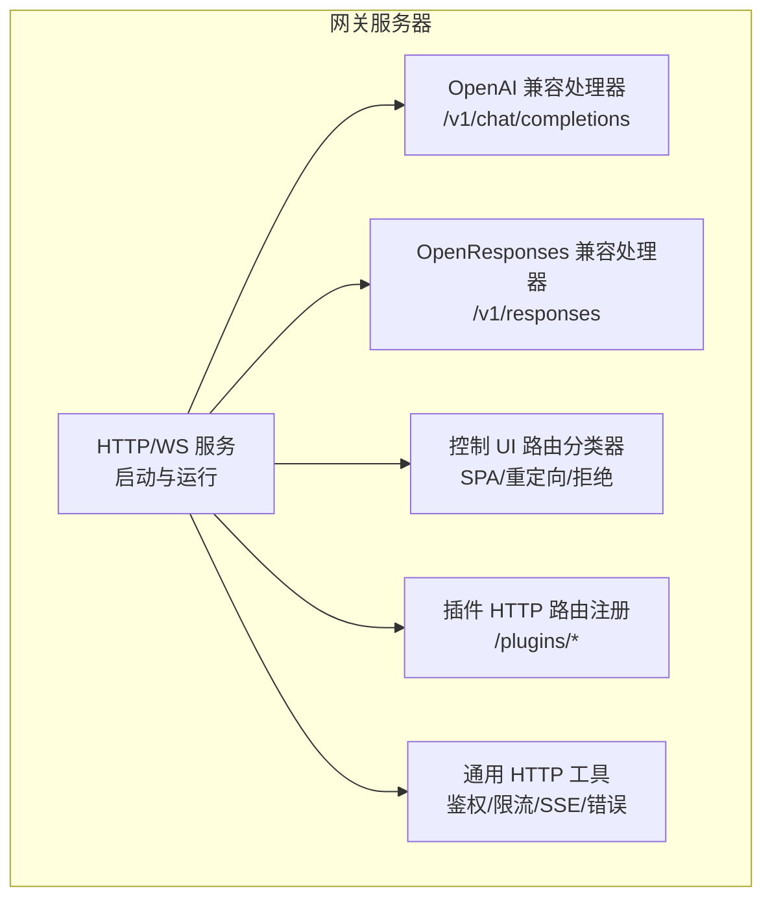
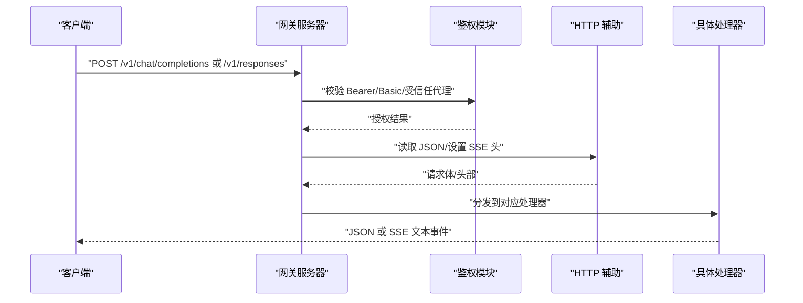
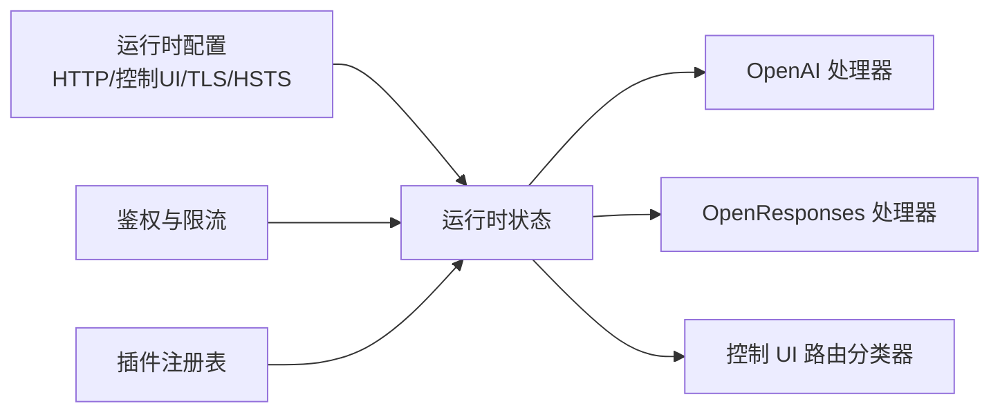

# HTTP API

<cite>
**本文引用的文件**
- [src/gateway/server.impl.ts](file://src/gateway/server.impl.ts)
- [src/gateway/openai-http.ts](file://src/gateway/openai-http.ts)
- [src/gateway/openresponses-http.ts](file://src/gateway/openresponses-http.ts)
- [src/gateway/open-responses.schema.ts](file://src/gateway/open-responses.schema.ts)
- [src/gateway/http-endpoint-helpers.ts](file://src/gateway/http-endpoint-helpers.ts)
- [src/gateway/http-common.ts](file://src/gateway/http-common.ts)
- [src/gateway/auth.ts](file://src/gateway/auth.ts)
- [src/gateway/control-ui-routing.ts](file://src/gateway/control-ui-routing.ts)
- [src/browser/http-auth.ts](file://src/browser/http-auth.ts)
- [src/commands/dashboard.ts](file://src/commands/dashboard.ts)
- [apps/macos/Sources/OpenClaw/GatewayEndpointStore.swift](file://apps/macos/Sources/OpenClaw/GatewayEndpointStore.swift)
- [src/config/schema.tags.ts](file://src/config/schema.tags.ts)
- [src/gateway/server-methods.ts](file://src/gateway/server-methods.ts)
- [docs/gateway/openai-http-api.md](file://docs/gateway/openai-http-api.md)
- [docs/zh-CN/gateway/openai-http-api.md](file://docs/zh-CN/gateway/openai-http-api.md)
- [scripts/check-no-register-http-handler.mjs](file://scripts/check-no-register-http-handler.mjs)
- [src/plugins/http-registry.ts](file://src/plugins/http-registry.ts)
- [src/plugins/http-registry.test.ts](file://src/plugins/http-registry.test.ts)
- [src/gateway/server-channels.ts](file://src/gateway/server-channels.ts)
- [src/gateway/server-plugins.ts](file://src/gateway/server-plugins.ts)
</cite>

## 目录
1. [简介](#简介)
2. [项目结构](#项目结构)
3. [核心组件](#核心组件)
4. [架构总览](#架构总览)
5. [详细组件分析](#详细组件分析)
6. [依赖关系分析](#依赖关系分析)
7. [性能考虑](#性能考虑)
8. [故障排查指南](#故障排查指南)
9. [结论](#结论)
10. [附录](#附录)

## 简介
本文件为 OpenClaw 的 HTTP API 参考文档，覆盖以下方面：
- 基于 HTTP 的 REST 接口与 OpenAI 兼容接口（/v1/chat/completions）
- OpenResponses 兼容接口（/v1/responses）
- 控制 UI 的 HTTP 接口与仪表盘访问
- 认证机制（Bearer Token、Basic Password、受信任代理、速率限制）
- CORS 与安全头策略
- 错误响应格式与状态码
- curl 示例与客户端调用要点
- 性能优化与最佳实践

## 项目结构
OpenClaw 的 HTTP 能力由“网关服务器”统一承载，支持：
- OpenAI 兼容聊天补全（/v1/chat/completions）
- OpenResponses 兼容响应（/v1/responses）
- 控制 UI（仪表盘）静态资源与 SPA 路由
- 插件动态注册的 HTTP Webhook 路由
- 通用 HTTP 辅助（鉴权、限流、SSE）

图表来源
- [src/gateway/server.impl.ts:266-800](file://src/gateway/server.impl.ts#L266-L800)
- [src/gateway/openai-http.ts:408-432](file://src/gateway/openai-http.ts#L408-L432)
- [src/gateway/openresponses-http.ts:265-300](file://src/gateway/openresponses-http.ts#L265-L300)
- [src/gateway/control-ui-routing.ts:11-51](file://src/gateway/control-ui-routing.ts#L11-L51)
- [src/plugins/http-registry.ts:12-92](file://src/plugins/http-registry.ts#L12-L92)
- [src/gateway/http-common.ts:1-109](file://src/gateway/http-common.ts#L1-L109)

章节来源
- [src/gateway/server.impl.ts:266-800](file://src/gateway/server.impl.ts#L266-L800)

## 核心组件
- 网关启动与运行：负责加载配置、初始化认证、构建 HTTP/WS 服务、挂载控制 UI、插件路由与方法处理器。
- OpenAI 兼容处理器：解析 /v1/chat/completions 请求，支持流式（SSE）与非流式响应。
- OpenResponses 兼容处理器：解析 /v1/responses 请求，支持图片/文件输入、工具选择、流式与非流式响应。
- 控制 UI 路由分类器：区分根挂载与子路径挂载下的 UI 与插件 Webhook，确保探针与安全边界。
- 插件 HTTP 路由注册：允许插件以明确的鉴权级别注册 /plugins/* 路由，避免冲突与越权。
- 通用 HTTP 工具：统一的安全头、JSON 读取、SSE 写入、错误响应与速率限制。

章节来源
- [src/gateway/server.impl.ts:266-800](file://src/gateway/server.impl.ts#L266-L800)
- [src/gateway/openai-http.ts:408-432](file://src/gateway/openai-http.ts#L408-L432)
- [src/gateway/openresponses-http.ts:265-300](file://src/gateway/openresponses-http.ts#L265-L300)
- [src/gateway/control-ui-routing.ts:11-51](file://src/gateway/control-ui-routing.ts#L11-L51)
- [src/plugins/http-registry.ts:12-92](file://src/plugins/http-registry.ts#L12-L92)
- [src/gateway/http-common.ts:1-109](file://src/gateway/http-common.ts#L1-L109)

## 架构总览
下图展示 HTTP 请求在网关中的处理链路，包括认证、路由与响应生成。

图表来源
- [src/gateway/server.impl.ts:580-630](file://src/gateway/server.impl.ts#L580-L630)
- [src/gateway/http-endpoint-helpers.ts:7-47](file://src/gateway/http-endpoint-helpers.ts#L7-L47)
- [src/gateway/auth.ts:378-494](file://src/gateway/auth.ts#L378-L494)
- [src/gateway/http-common.ts:24-109](file://src/gateway/http-common.ts#L24-L109)
- [src/gateway/openai-http.ts:408-432](file://src/gateway/openai-http.ts#L408-L432)
- [src/gateway/openresponses-http.ts:265-300](file://src/gateway/openresponses-http.ts#L265-L300)

## 详细组件分析

### OpenAI 兼容接口：/v1/chat/completions
- 方法与路径
  - POST /v1/chat/completions
- 功能
  - 将 OpenAI 风格的消息数组转换为内部智能体消息，支持流式（SSE）与非流式响应。
  - 支持通过请求头选择智能体与会话键。
- 请求体字段（节选）
  - model: 字符串；用于选择智能体（如 openclaw:main）
  - messages: 数组；OpenAI 风格消息
  - user: 字符串；用于派生稳定会话键
  - stream: 布尔；是否启用流式
  - temperature/top_p/max_tokens/tool_choice 等透传至内部运行参数
- 响应
  - 非流式：标准 JSON
  - 流式：text/event-stream，事件类型与数据结构遵循 OpenAI 风格
- 会话行为
  - 默认每次请求生成新会话键；若提供 user 则派生稳定会话键
- 启用方式
  - 在配置中开启 gateway.http.endpoints.chatCompletions.enabled

章节来源
- [src/gateway/openai-http.ts:408-432](file://src/gateway/openai-http.ts#L408-L432)
- [docs/gateway/openai-http-api.md:1-133](file://docs/gateway/openai-http-api.md#L1-L133)
- [docs/zh-CN/gateway/openai-http-api.md:1-126](file://docs/zh-CN/gateway/openai-http-api.md#L1-L126)

### OpenResponses 兼容接口：/v1/responses
- 方法与路径
  - POST /v1/responses
- 功能
  - 支持多模态输入（文本、图片、文件）、工具选择、流式与非流式响应。
  - 支持指令注入、文件上下文与工具调用返回。
- 请求体字段（节选）
  - model: 字符串；模型标识
  - input: 字符串或 ItemParam 数组；支持 message、function_call、function_call_output、reasoning、item_reference 等
  - instructions: 字符串；额外系统提示
  - tools: 工具定义数组
  - tool_choice: 自动/无/必须/函数选择
  - stream: 布尔；是否启用流式
  - max_output_tokens: 正整数；最大输出 token
  - user: 字符串；用户标识
  - 其他兼容字段：temperature、top_p、metadata、store、previous_response_id、reasoning、truncation 等（透传）
- 响应
  - 非流式：ResponseResource，包含 status、output、usage、可选 error
  - 流式：SSE 事件序列，包含 response.created/in_progress/completed/failed、output_item.added/done、content_part.added/done、output_text.delta/done
- 输入限制
  - URL 来源数量上限、文件/图片大小与 MIME 白名单、超时与重定向限制等
- 工具选择
  - none/required/function 名称；不满足条件时返回错误

章节来源
- [src/gateway/openresponses-http.ts:265-300](file://src/gateway/openresponses-http.ts#L265-L300)
- [src/gateway/open-responses.schema.ts:181-206](file://src/gateway/open-responses.schema.ts#L181-L206)
- [src/gateway/open-responses.schema.ts:264-281](file://src/gateway/open-responses.schema.ts#L264-L281)
- [src/gateway/open-responses.schema.ts:287-361](file://src/gateway/open-responses.schema.ts#L287-L361)

### 控制 UI 与仪表盘 HTTP 接口
- 路由分类
  - 根挂载（basePath="/"）：保留健康探针与插件路由不受 SPA 捕获；非 GET 方法直接视为非控制 UI
  - 子路径挂载（basePath="/openclaw"）：对非 GET 方法与非匹配路径同样视为非控制 UI
  - 根路径重定向：当访问 basePath 时重定向到 basePath+/
- 仪表盘访问
  - 通过命令行启动后，根据绑定模式与 basePath 生成链接；支持 token 认证
- 资源与安全
  - 控制 UI 资产构建与存在性检查；允许覆盖根目录与打包资产检测

章节来源
- [src/gateway/control-ui-routing.ts:11-51](file://src/gateway/control-ui-routing.ts#L11-L51)
- [src/gateway/server.impl.ts:521-560](file://src/gateway/server.impl.ts#L521-L560)
- [src/commands/dashboard.ts:50-61](file://src/commands/dashboard.ts#L50-L61)
- [apps/macos/Sources/OpenClaw/GatewayEndpointStore.swift:649-684](file://apps/macos/Sources/OpenClaw/GatewayEndpointStore.swift#L649-L684)

### 插件 HTTP Webhook 路由
- 注册方式
  - 使用 registerHttpRoute 或 registerPluginHttpRoute 显式声明 path、auth、match（默认 exact）
  - 不允许相同路径不同 auth 的重叠；exact/prefix 的 fallthrough 必须在同一 auth 层级
- 替换策略
  - replaceExisting=true 时可替换同路径旧路由；仅同插件 ID 可替换他人路由
- 过期路由清理
  - 插件卸载或失效时自动移除

章节来源
- [src/plugins/http-registry.ts:12-92](file://src/plugins/http-registry.ts#L12-L92)
- [src/plugins/http-registry.test.ts:40-126](file://src/plugins/http-registry.test.ts#L40-L126)
- [scripts/check-no-register-http-handler.mjs:1-38](file://scripts/check-no-register-http-handler.mjs#L1-L38)

### 通用 HTTP 工具与错误响应
- 安全头
  - 默认安全头（X-Content-Type-Options、Referrer-Policy、Permissions-Policy）
  - 可选 HSTS
- JSON 读取与错误
  - readJsonBodyOrError：统一处理超大负载、请求超时、无效 JSON
  - sendJson/sendText/sendMethodNotAllowed/sendUnauthorized/sendRateLimited/sendInvalidRequest
- SSE
  - setSseHeaders/writeDone：SSE 响应头与结束标记

章节来源
- [src/gateway/http-common.ts:1-109](file://src/gateway/http-common.ts#L1-L109)

### 认证与速率限制
- 认证模式
  - none/token/password/trusted-proxy；默认 token
  - 受信任代理：要求特定头与可选用户白名单
  - Tailscale：在 WS 控制 UI 场景下可启用头认证
- 速率限制
  - 对失败尝试进行限流与重试时间提示
- 浏览器请求
  - 支持 Bearer 与 Basic（密码）解析；与网关认证策略一致

章节来源
- [src/gateway/auth.ts:23-56](file://src/gateway/auth.ts#L23-L56)
- [src/gateway/auth.ts:378-494](file://src/gateway/auth.ts#L378-L494)
- [src/browser/http-auth.ts:37-48](file://src/browser/http-auth.ts#L37-L48)

## 依赖关系分析
- 网关启动阶段
  - 解析运行时配置（含 HTTP 端点开关、控制 UI basePath、TLS/HSTS）
  - 初始化认证与速率限制器
  - 加载插件并注册其 HTTP 路由
  - 构建 HTTP/WS 服务并挂载处理器
- 处理器依赖
  - OpenAI 处理器依赖通用 POST JSON 辅助与鉴权
  - OpenResponses 处理器依赖 Zod Schema、媒体输入解析、工具选择逻辑与 SSE 输出
- 控制 UI
  - 路由分类器与运行时 basePath 协作，决定 SPA 捕获范围与探针可见性

图表来源
- [src/gateway/server.impl.ts:488-526](file://src/gateway/server.impl.ts#L488-L526)
- [src/gateway/server.impl.ts:600-630](file://src/gateway/server.impl.ts#L600-L630)
- [src/plugins/http-registry.ts:12-92](file://src/plugins/http-registry.ts#L12-L92)

章节来源
- [src/gateway/server.impl.ts:488-526](file://src/gateway/server.impl.ts#L488-L526)
- [src/gateway/server.impl.ts:600-630](file://src/gateway/server.impl.ts#L600-L630)

## 性能考虑
- 速率限制
  - 对鉴权失败尝试进行限流，防止暴力破解；合理设置 retry-after
- 流式传输
  - SSE 下按事件增量推送，减少一次性大响应开销
- 输入限制
  - 对 URL 来源数量、文件/图片大小与 MIME 进行限制，降低资源消耗
- 并发与队列
  - 网关维护命令队列与待回复计数，避免过载
- TLS 与 HSTS
  - 在生产环境启用 TLS 与 HSTS，提升安全性与缓存友好性

章节来源
- [src/gateway/auth.ts:415-431](file://src/gateway/auth.ts#L415-L431)
- [src/gateway/openresponses-http.ts:73-98](file://src/gateway/openresponses-http.ts#L73-L98)
- [src/gateway/server.impl.ts:565-570](file://src/gateway/server.impl.ts#L565-L570)

## 故障排查指南
- 常见错误与状态码
  - 400：请求体过大、请求体超时、无效 JSON、无效请求参数
  - 401：未授权（缺少或错误的 Bearer/Basic）
  - 405：方法不允许（仅 POST）
  - 413：负载过大
  - 429：速率限制
  - 500：内部错误
- 常见问题定位
  - 确认已启用目标端点（chatCompletions/responses）
  - 检查认证配置（token/password/trusted-proxy）
  - 核对 basePath 与浏览器访问链接
  - 查看 SSE 是否正确设置 text/event-stream
- 日志与诊断
  - 启动日志包含密钥面活性诊断与秘密加载状态
  - 速率限制触发时返回 Retry-After

章节来源
- [src/gateway/http-common.ts:47-96](file://src/gateway/http-common.ts#L47-L96)
- [src/gateway/auth.ts:415-431](file://src/gateway/auth.ts#L415-L431)
- [src/gateway/server.impl.ts:333-397](file://src/gateway/server.impl.ts#L333-L397)

## 结论
OpenClaw 的 HTTP API 提供了两条主要路径：
- OpenAI 兼容接口：便于与现有生态集成
- OpenResponses 兼容接口：更丰富的多模态与工具能力
配合统一的认证、速率限制与安全头策略，以及灵活的插件路由与控制 UI，满足从开发测试到生产部署的多样化需求。

## 附录

### 端点一览与参数说明
- /v1/chat/completions（OpenAI 兼容）
  - 方法：POST
  - 认证：Bearer（或 Basic 密码）
  - 主要参数：model、messages、user、stream、temperature、top_p、max_tokens、tool_choice 等
  - 响应：JSON 或 SSE
  - 启用：gateway.http.endpoints.chatCompletions.enabled=true
- /v1/responses（OpenResponses 兼容）
  - 方法：POST
  - 认证：Bearer（或 Basic 密码）
  - 主要参数：model、input（字符串或 ItemParam[]）、instructions、tools、tool_choice、stream、max_output_tokens、user 等
  - 响应：JSON 或 SSE
  - 启用：gateway.http.endpoints.responses.enabled=true

章节来源
- [docs/gateway/openai-http-api.md:1-133](file://docs/gateway/openai-http-api.md#L1-L133)
- [docs/zh-CN/gateway/openai-http-api.md:1-126](file://docs/zh-CN/gateway/openai-http-api.md#L1-L126)
- [src/gateway/openai-http.ts:408-432](file://src/gateway/openai-http.ts#L408-L432)
- [src/gateway/openresponses-http.ts:265-300](file://src/gateway/openresponses-http.ts#L265-L300)

### 认证机制与配置要点
- 模式
  - none/token/password/trusted-proxy
- 受信任代理
  - 需要配置 userHeader 与可选 allowUsers
- Tailscale
  - WS 控制 UI 下可启用头认证
- 速率限制
  - 对失败尝试进行限流，返回 Retry-After
- 浏览器请求
  - 支持 Authorization: Bearer 与 Authorization: Basic

章节来源
- [src/gateway/auth.ts:23-56](file://src/gateway/auth.ts#L23-L56)
- [src/gateway/auth.ts:378-494](file://src/gateway/auth.ts#L378-L494)
- [src/browser/http-auth.ts:37-48](file://src/browser/http-auth.ts#L37-L48)

### CORS 与安全头
- 默认安全头：X-Content-Type-Options、Referrer-Policy、Permissions-Policy
- 可选 HSTS：通过运行时配置注入
- 控制 UI：SPA 路由与探针路由分离，避免非预期捕获

章节来源
- [src/gateway/http-common.ts:11-22](file://src/gateway/http-common.ts#L11-L22)
- [src/gateway/control-ui-routing.ts:11-51](file://src/gateway/control-ui-routing.ts#L11-L51)

### 实际调用示例（curl）
- OpenAI 兼容（非流式）
  - curl -sS http://127.0.0.1:18789/v1/chat/completions -H 'Authorization: Bearer YOUR_TOKEN' -H 'Content-Type: application/json' -d '{"model":"openclaw","messages":[{"role":"user","content":"hi"}]}'
- OpenAI 兼容（流式）
  - curl -N http://127.0.0.1:18789/v1/chat/completions -H 'Authorization: Bearer YOUR_TOKEN' -H 'Content-Type: application/json' -d '{"model":"openclaw","stream":true,"messages":[{"role":"user","content":"hi"}]}'
- OpenResponses（非流式）
  - curl -sS http://127.0.0.1:18789/v1/responses -H 'Authorization: Bearer YOUR_TOKEN' -H 'Content-Type: application/json' -d '{"model":"claude","input":[{"type":"message","role":"user","content":"hi"}],"stream":false}'
- OpenResponses（流式）
  - curl -N http://127.0.0.1:18789/v1/responses -H 'Authorization: Bearer YOUR_TOKEN' -H 'Content-Type: application/json' -d '{"model":"claude","input":[{"type":"message","role":"user","content":"hi"}],"stream":true}'

章节来源
- [docs/gateway/openai-http-api.md:100-132](file://docs/gateway/openai-http-api.md#L100-L132)
- [docs/zh-CN/gateway/openai-http-api.md:98-126](file://docs/zh-CN/gateway/openai-http-api.md#L98-L126)
- [src/gateway/openresponses-http.ts:265-300](file://src/gateway/openresponses-http.ts#L265-L300)

### 配置项参考（节选）
- gateway.http.endpoints.chatCompletions.enabled
- gateway.http.endpoints.responses.enabled
- gateway.auth.mode/token/password/trustedProxy
- gateway.controlUi.basePath
- gateway.controlUi.allowedOrigins
- gateway.tls.enabled/fingerprintSha256

章节来源
- [src/config/schema.tags.ts:41-53](file://src/config/schema.tags.ts#L41-L53)
- [src/gateway/server.impl.ts:498-512](file://src/gateway/server.impl.ts#L498-L512)