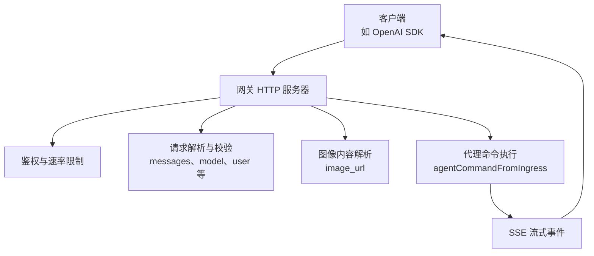
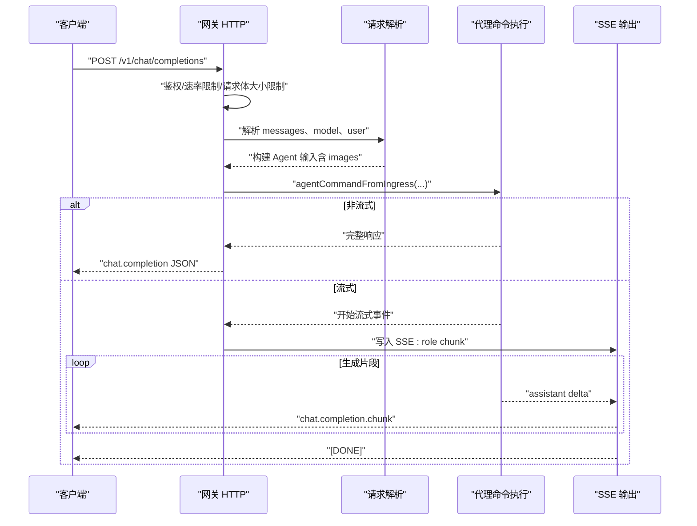
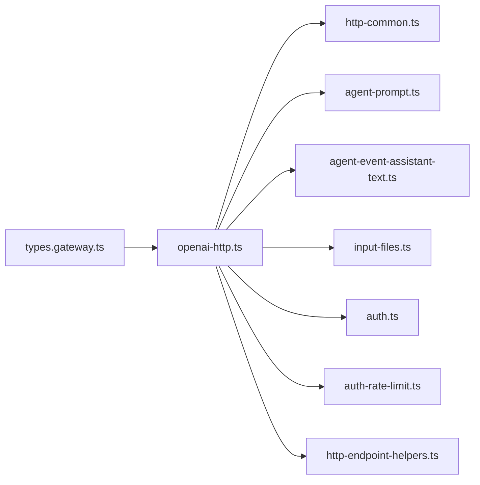
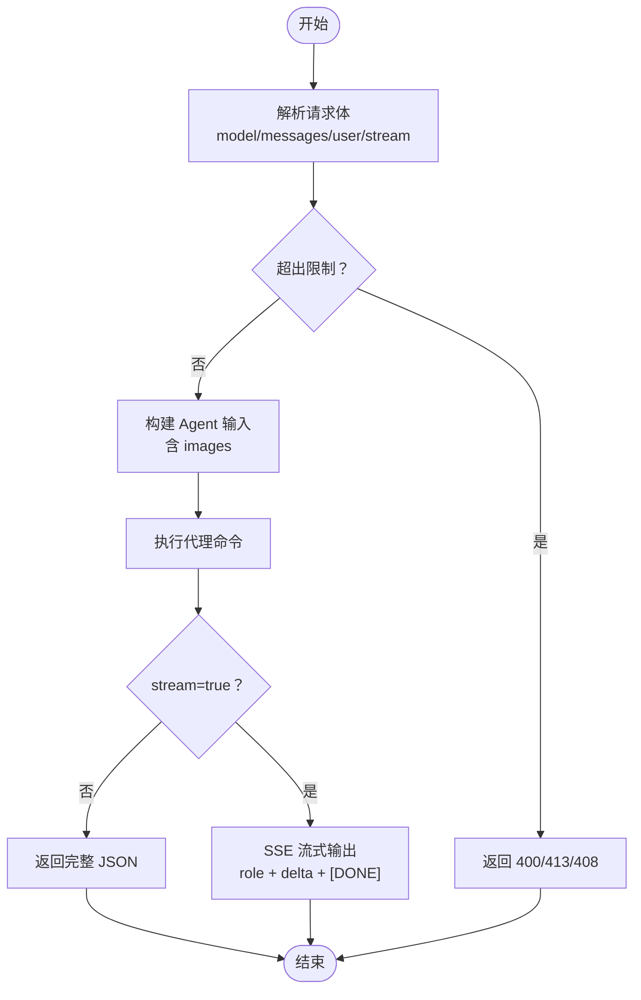

# OpenAI 兼容 API

<cite>
**本文引用的文件**
- [openai-http-api.md](file://docs/gateway/openai-http-api.md)
- [openai-http.ts](file://src/gateway/openai-http.ts)
- [http-common.ts](file://src/gateway/http-common.ts)
- [types.gateway.ts](file://src/config/types.gateway.ts)
- [model-compat.ts](file://src/agents/model-compat.ts)
- [openai-ws-stream.ts](file://src/agents/openai-ws-stream.ts)
- [openai-responses.reasoning-replay.test.ts](file://src/agents/openai-responses.reasoning-replay.test.ts)
- [openai-responses.reasoning-replay.ts](file://src/agents/openai-responses.reasoning-replay.ts)
- [openai-responses.reasoning-replay.ts](file://src/agents/openai-responses.reasoning-replay.ts)
- [openai-responses.reasoning-replay.ts](file://src/agents/openai-responses.reasoning-replay.ts)
- [openai-responses.reasoning-replay.ts](file://src/agents/openai-responses.reasoning-replay.ts)
- [openai-responses.reasoning-replay.ts](file://src/agents/openai-responses.reasoning-replay.ts)
- [openai-responses.reasoning-replay.ts](file://src/agents/openai-responses.reasoning-replay.ts)
- [openai-responses.reasoning-replay.ts](file://src/agents/openai-responses.reasoning-replay.ts)
- [openai-responses.reasoning-replay.ts](file://src/agents/openai-responses.reasoning-replay.ts)
- [openai-responses.reasoning-replay.ts](file://src/agents/openai-responses.reasoning-replay.ts)
- [openai-responses.reasoning-replay.ts](file://src/agents/openai-responses.reasoning-replay.ts)
- [openai-responses.reasoning-replay.ts](file://src/agents/openai-responses.reasoning-replay.ts)
- [openai-responses.reasoning-replay.ts](file://src/agents/openai-responses.reasoning-replay.ts)
- [openai-responses.reasoning-replay.ts](file://src/agents/openai-responses.reasoning-replay.ts)
- [openai-responses.reasoning-replay.ts](file://src/agents/openai-responses.reasoning-replay.ts)
- [openai-responses.reasoning-replay.ts](file://src/agents/openai-responses.reasoning-replay.ts)
- [openai-responses.reasoning-replay.ts](file://src/agents/openai-responses.reasoning-replay.ts)
- [openai-responses.reasoning-replay.ts](file://src/agents/openai-responses.reasoning-replay.ts)
- [openai-responses.reasoning-replay.ts](file://src/agents/openai-responses.reasoning-replay.ts)
- [openai-responses.reasoning-replay.ts](file://src/agents/openai-responses.reasoning-replay.ts)
- [openai-responses.reasoning-replay.ts](file://src/agents/openai-responses.reasoning......)
</cite>

## 目录
1. [简介](#简介)
2. [项目结构](#项目结构)
3. [核心组件](#核心组件)
4. [架构总览](#架构总览)
5. [详细组件分析](#详细组件分析)
6. [依赖关系分析](#依赖关系分析)
7. [性能考量](#性能考量)
8. [故障排查指南](#故障排查指南)
9. [结论](#结论)
10. [附录](#附录)

## 简介
本文件面向希望在 OpenClaw 上部署并使用 OpenAI 兼容 API 的开发者，聚焦于 /v1/chat/completions 端点的请求/响应规范、消息与图像内容解析、流式响应（SSE）处理、认证与安全边界、配置项与限制、错误与速率限制策略，以及与原生 OpenAI API 的差异与迁移建议。文档中的所有技术细节均来自仓库内的实现与文档。

## 项目结构
OpenClaw 的 OpenAI 兼容 API 由“网关 HTTP 层”和“代理命令执行层”协作完成：
- 网关 HTTP 层负责接收 /v1/chat/completions 请求、鉴权、参数校验、SSE 流式输出。
- 代理命令执行层将 OpenAI 风格的消息转换为内部 Agent 输入，触发一次智能体会话并回传结果。

图表来源
- [openai-http.ts:408-612](file://src/gateway/openai-http.ts#L408-L612)
- [http-common.ts:102-108](file://src/gateway/http-common.ts#L102-L108)

章节来源
- [openai-http-api.md:1-133](file://docs/gateway/openai-http-api.md#L1-L133)
- [openai-http.ts:1-613](file://src/gateway/openai-http.ts#L1-L613)

## 核心组件
- 网关 HTTP 端点：POST /v1/chat/completions，默认关闭，需在配置中启用。
- 鉴权与速率限制：支持 token/password/受信代理模式，并可配置失败次数上限。
- 请求解析：将 OpenAI 风格 messages 解析为内部 Agent 消息，支持 system/developer/user/assistant/tool 等角色，以及 image_url 文本块。
- 流式输出：SSE 协议，逐段推送 chat.completion.chunk，结束以 data: [DONE]。
- 代理执行：将消息与会话上下文转为 Agent 命令，触发一次智能体运行。
- 图像输入：对 user 最新消息中的 image_url 进行解析与大小限制控制。

章节来源
- [openai-http.ts:408-612](file://src/gateway/openai-http.ts#L408-L612)
- [http-common.ts:73-108](file://src/gateway/http-common.ts#L73-L108)
- [types.gateway.ts:214-255](file://src/config/types.gateway.ts#L214-L255)

## 架构总览
下图展示了从客户端到智能体执行再到流式返回的关键路径：

图表来源
- [openai-http.ts:408-612](file://src/gateway/openai-http.ts#L408-L612)
- [http-common.ts:98-108](file://src/gateway/http-common.ts#L98-L108)

## 详细组件分析

### 端点与启用方式
- 端点：POST /v1/chat/completions
- 默认关闭，需在配置中开启对应开关
- 端口与网关复用同一端口（HTTP + WS 复用）

章节来源
- [openai-http-api.md:14-15](file://docs/gateway/openai-http-api.md#L14-L15)
- [openai-http-api.md:61-89](file://docs/gateway/openai-http-api.md#L61-L89)

### 认证与安全边界
- 支持的鉴权模式：token/password/trusted-proxy
- 速率限制：失败次数过多返回 429 并带 Retry-After
- 安全边界：该端点被视为“全操作员权限”，应仅在内网/受控入口使用，避免直接暴露公网

章节来源
- [openai-http-api.md:19-42](file://docs/gateway/openai-http-api.md#L19-L42)

### 会话与消息路由
- model 字段用于选择 Agent：支持 openclaw:<agentId> 或 agent:<agentId>，或通过 x-openclaw-agent-id 指定
- user 字段用于派生稳定会话键，便于跨请求保持会话
- 默认消息通道为 webchat，可通过 x-openclaw-message-channel 保留调用方通道身份

章节来源
- [openai-http-api.md:44-58](file://docs/gateway/openai-http-api.md#L44-L58)

### 请求参数映射与兼容性
- model：用于选择 Agent；未指定时默认 openclaw
- messages：支持 role/system/developer/user/assistant/tool/function 等；developer 在非原生 OpenAI 端点会被强制兼容处理
- user：用于稳定会话键
- stream：true 时启用 SSE 流式输出
- temperature/max_tokens/top_p/tool_choice 等生成参数在内部流式场景中可透传，但 HTTP 路径不直接解析这些字段

章节来源
- [openai-http.ts:429-432](file://src/gateway/openai-http.ts#L429-L432)
- [openai-http.ts:389-394](file://src/gateway/openai-http.ts#L389-L394)
- [openai-ws-stream.ts:577-609](file://src/agents/openai-ws-stream.ts#L577-L609)
- [model-compat.ts:14-21](file://src/agents/model-compat.ts#L14-L21)

### 消息解析与图像内容
- messages 解析：将 text 与 input_text 合并为文本；忽略无效条目
- 图像解析：仅从最新用户消息中提取 image_url，支持 data URI 与 URL；有数量与总字节限制
- system/developer：拼接为额外系统提示；developer 在非原生 OpenAI 端点被强制关闭

章节来源
- [openai-http.ts:152-224](file://src/gateway/openai-http.ts#L152-L224)
- [openai-http.ts:258-314](file://src/gateway/openai-http.ts#L258-L314)
- [openai-http.ts:321-387](file://src/gateway/openai-http.ts#L321-L387)
- [model-compat.ts:51-79](file://src/agents/model-compat.ts#L51-L79)

### 流式响应（SSE）
- Content-Type: text/event-stream；每条事件为 data: <JSON>\n\n
- 首帧：包含 role: assistant 的 chunk
- 中间帧：delta: content 的增量
- 结束帧：data: [DONE]
- 错误时：发送包含错误内容的 chunk 并结束

章节来源
- [openai-http-api.md:97-103](file://docs/gateway/openai-http-api.md#L97-L103)
- [http-common.ts:98-108](file://src/gateway/http-common.ts#L98-L108)
- [openai-http.ts:99-150](file://src/gateway/openai-http.ts#L99-L150)
- [openai-http.ts:516-554](file://src/gateway/openai-http.ts#L516-L554)

### 非流式响应
- 返回 chat.completion JSON，包含 id/object/created/model/choices/usage
- usage 为占位 0

章节来源
- [openai-http.ts:481-507](file://src/gateway/openai-http.ts#L481-L507)

### 错误处理与状态码
- 400：请求体过大、请求体超时、无效 image_url、缺失用户消息等
- 401/403：未授权/权限不足
- 408：请求体超时
- 413：请求体过大
- 429：鉴权失败次数过多
- 500：内部错误

章节来源
- [http-common.ts:47-71](file://src/gateway/http-common.ts#L47-L71)
- [openai-http.ts:447-466](file://src/gateway/openai-http.ts#L447-L466)
- [openai-http.ts:501-506](file://src/gateway/openai-http.ts#L501-L506)
- [openai-http.ts:585-596](file://src/gateway/openai-http.ts#L585-L596)

### 配置项与限制
- 网关 HTTP 端点开关：gateway.http.endpoints.chatCompletions.enabled
- 请求体大小限制：maxBodyBytes（默认 20MB）
- 图像相关限制：maxImageParts（默认 8）、maxTotalImageBytes（默认 20MB），以及图像来源、MIME 白名单、URL 抓取限制等
- 速率限制：最大失败次数、窗口时间、封禁时长、是否豁免环回地址

章节来源
- [openai-http-api.md:61-89](file://docs/gateway/openai-http-api.md#L61-L89)
- [types.gateway.ts:214-255](file://src/config/types.gateway.ts#L214-L255)

### 与原生 OpenAI API 的差异
- developer 消息角色：仅在原生 OpenAI 基础设施上接受；其他兼容后端（如 Azure OpenAI、Qwen、GLM 等）会强制关闭
- usage 在流式中：非原生后端可能不返回 usage，OpenClaw 在流式中按 OpenAI 兼容行为输出占位
- 参数透传：HTTP 路径不直接解析 temperature/max_tokens 等，但在内部流式场景可透传

章节来源
- [model-compat.ts:51-79](file://src/agents/model-compat.ts#L51-L79)
- [openai-ws-stream.ts:577-609](file://src/agents/openai-ws-stream.ts#L577-L609)

### 请求/响应示例（基于文档）
- 非流式示例：使用 curl 发送 POST /v1/chat/completions，携带 Authorization、Content-Type、x-openclaw-agent-id，请求体包含 model 与 messages
- 流式示例：设置 stream: true，使用 -N 保持连接，逐条接收 data: <JSON>，最后一条 data: [DONE]

章节来源
- [openai-http-api.md:107-132](file://docs/gateway/openai-http-api.md#L107-L132)

## 依赖关系分析
- openai-http.ts 依赖：
  - http-common.ts：统一的 JSON/SSE/错误响应工具
  - agent-prompt.ts：将消息列表转换为内部提示
  - agent-event-assistant-text.ts：从事件中解析助手增量文本
  - input-files.ts：图像内容解析与大小限制
  - auth.ts / auth-rate-limit.ts：鉴权与速率限制
  - http-endpoint-helpers.ts：通用 POST JSON 端点处理
- 配置类型：
  - types.gateway.ts：定义 chatCompletions 端点配置与图像限制

图表来源
- [openai-http.ts:1-31](file://src/gateway/openai-http.ts#L1-L31)
- [types.gateway.ts:214-255](file://src/config/types.gateway.ts#L214-L255)

章节来源
- [openai-http.ts:1-31](file://src/gateway/openai-http.ts#L1-L31)
- [types.gateway.ts:214-255](file://src/config/types.gateway.ts#L214-L255)

## 性能考量
- 请求体大小限制：避免过大的请求导致内存压力
- 图像解析成本：对 data URI 与 URL 分别进行解码与抓取，注意总字节数与并发
- SSE 写入：频繁小包写入可能带来网络开销，建议客户端合理缓冲
- 会话稳定性：通过 user 字段派生稳定会话键，减少重复上下文重建

## 故障排查指南
- 400 错误
  - Payload too large：调整 gateway.http.endpoints.chatCompletions.maxBodyBytes
  - Request body timeout：检查网络与客户端超时设置
  - Invalid image_url content：确认 image_url 格式与大小限制
  - Missing user message：确保 messages 至少包含一条有效用户消息
- 401/403：核对鉴权模式与凭据
- 429：鉴权失败次数过多，等待 Retry-After 后重试
- 500：内部错误，查看网关日志定位具体环节

章节来源
- [http-common.ts:73-96](file://src/gateway/http-common.ts#L73-L96)
- [openai-http.ts:447-466](file://src/gateway/openai-http.ts#L447-L466)
- [openai-http.ts:501-506](file://src/gateway/openai-http.ts#L501-L506)
- [openai-http.ts:585-596](file://src/gateway/openai-http.ts#L585-L596)

## 结论
OpenClaw 的 /v1/chat/completions 端点提供了与 OpenAI Chat Completions API 高度兼容的 HTTP 接口，具备 SSE 流式能力、灵活的会话与消息路由、完善的鉴权与速率限制机制。在非原生 OpenAI 端点上，OpenClaw 会自动进行兼容性降级（如关闭 developer 角色与流式 usage），以保证客户端解析的稳定性。通过合理的配置与迁移策略，可在不修改业务代码的情况下平滑切换至 OpenClaw。

## 附录

### 端到端调用流程（类时序）

图表来源
- [openai-http.ts:408-612](file://src/gateway/openai-http.ts#L408-L612)
- [http-common.ts:98-108](file://src/gateway/http-common.ts#L98-L108)