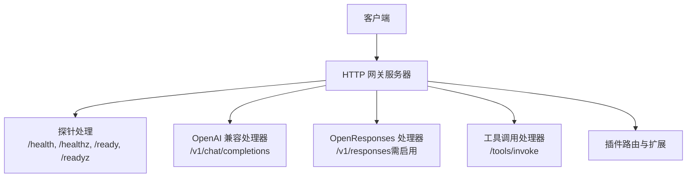
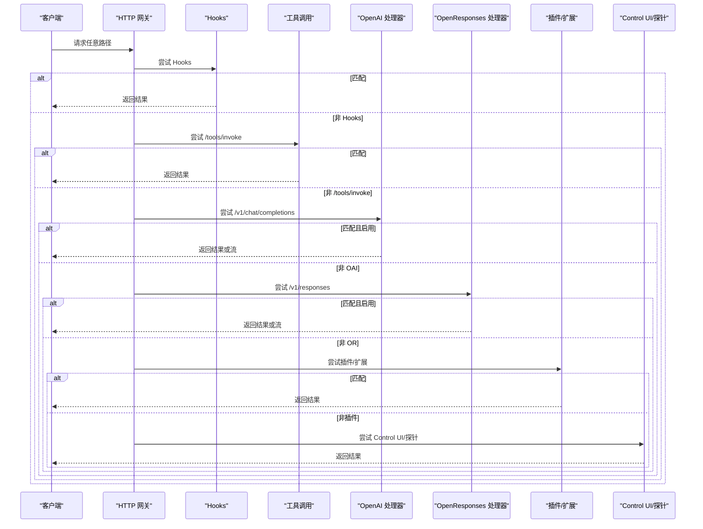
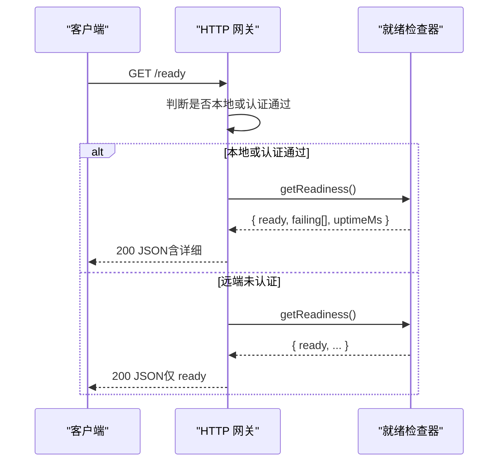
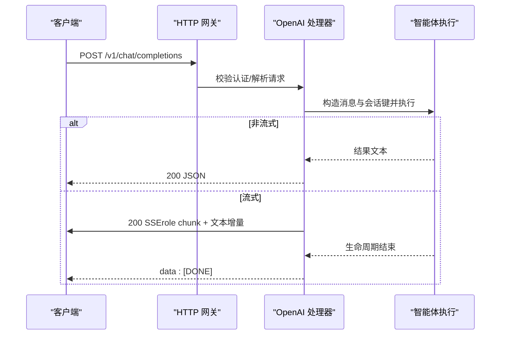
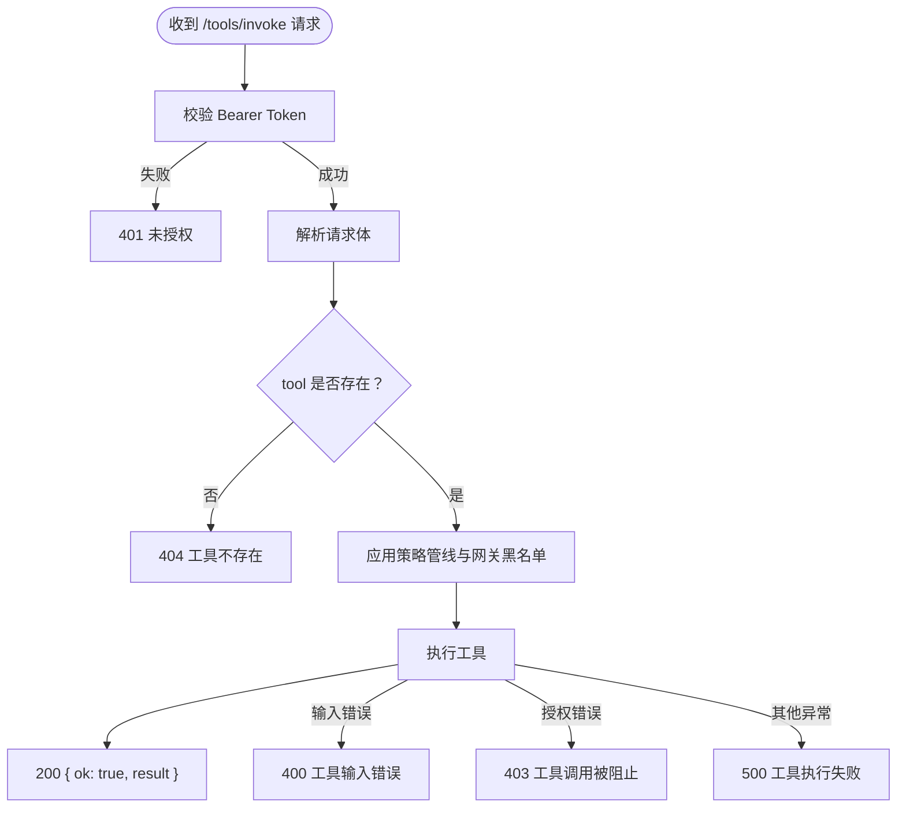
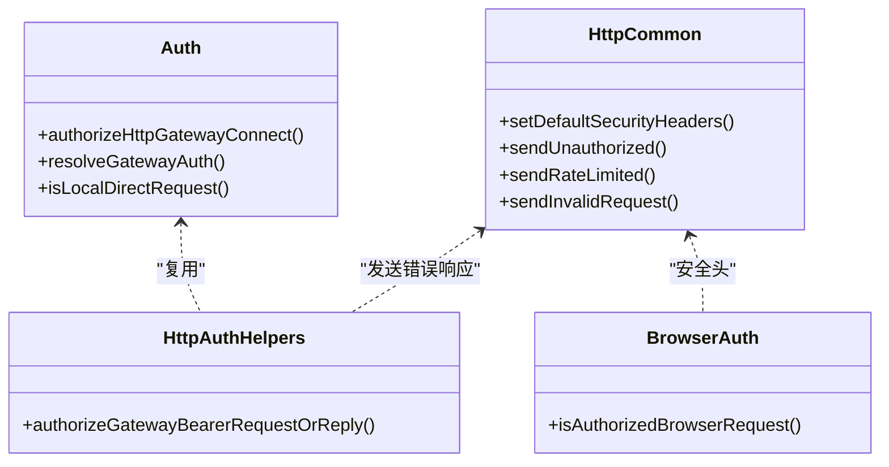
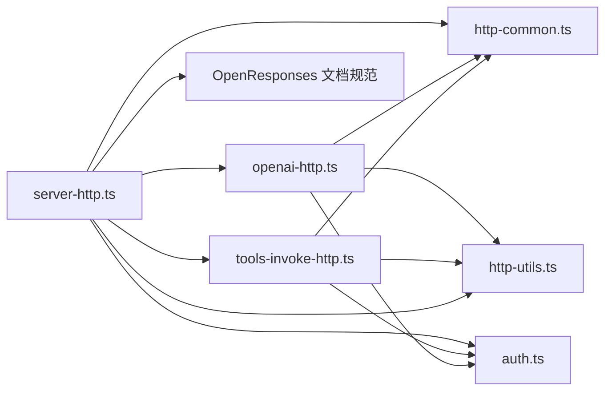

# REST API

<cite>
**本文引用的文件**
- [server-http.ts](file://src/gateway/server-http.ts)
- [http-common.ts](file://src/gateway/http-common.ts)
- [http-auth-helpers.ts](file://src/gateway/http-auth-helpers.ts)
- [auth.ts](file://src/gateway/auth.ts)
- [http-utils.ts](file://src/gateway/http-utils.ts)
- [openai-http.ts](file://src/gateway/openai-http.ts)
- [openresponses-http-api.md](file://docs/zh-CN/gateway/openresponses-http-api.md)
- [openai-http-api.md](file://docs/zh-CN/gateway/openai-http-api.md)
- [tools-invoke-http.ts](file://src/gateway/tools-invoke-http.ts)
- [server-http.probe.test.ts](file://src/gateway/server-http.probe.test.ts)
- [server.auth-token-gates-http.test.ts](file://src/browser/server.auth-token-gates-http.test.ts)
- [browser/http-auth.ts](file://src/browser/http-auth.ts)
</cite>

## 目录
1. [简介](#简介)
2. [项目结构](#项目结构)
3. [核心组件](#核心组件)
4. [架构总览](#架构总览)
5. [详细组件分析](#详细组件分析)
6. [依赖关系分析](#依赖关系分析)
7. [性能考量](#性能考量)
8. [故障排除指南](#故障排除指南)
9. [结论](#结论)
10. [附录](#附录)

## 简介
本文件为 OpenClaw 的通用 REST API 参考文档，聚焦于基于 HTTP 的 REST 接口规范，涵盖标准 HTTP 方法、URL 路径模式、请求/响应格式、认证与速率限制、探针端点健康检查机制、错误响应格式与状态码、CORS 与安全头设置等。同时提供 curl 示例与多语言客户端调用思路，并给出安全最佳实践。

## 项目结构
OpenClaw 的 HTTP 网关采用“多路复用”方式在同一端口上承载多种服务：
- 探针端点：/health、/healthz、/ready、/readyz
- OpenAI 兼容端点：/v1/chat/completions
- OpenResponses 兼容端点：/v1/responses（需在配置中启用）
- 工具调用端点：/tools/invoke
- 插件路由与 Canvas/A2UI 等扩展路由（按优先级与路径匹配）

图表来源
- [server-http.ts:612-786](file://src/gateway/server-http.ts#L612-L786)

章节来源
- [server-http.ts:88-93](file://src/gateway/server-http.ts#L88-L93)
- [server-http.ts:612-786](file://src/gateway/server-http.ts#L612-L786)

## 核心组件
- 探针端点：/health、/healthz、/ready、/readyz
  - 仅允许 GET/HEAD，返回健康/就绪状态
  - /ready 可根据远端请求与认证策略返回详细或简化状态
- OpenAI 兼容端点：/v1/chat/completions
  - POST，支持 JSON 请求体与 SSE 流式响应
  - 支持通过模型字段或自定义头选择智能体与会话
- OpenResponses 兼容端点：/v1/responses
  - POST，需在配置中启用
  - 支持 SSE 流式响应
- 工具调用端点：/tools/invoke
  - POST，执行受策略与权限控制的工具调用
- 安全与通用能力
  - 默认安全头设置、速率限制、认证辅助工具

章节来源
- [server-http.ts:184-236](file://src/gateway/server-http.ts#L184-L236)
- [openai-http.ts:408-612](file://src/gateway/openai-http.ts#L408-L612)
- [openresponses-http-api.md:16-318](file://docs/zh-CN/gateway/openresponses-http-api.md#L16-L318)
- [tools-invoke-http.ts:136-361](file://src/gateway/tools-invoke-http.ts#L136-L361)
- [http-common.ts:11-22](file://src/gateway/http-common.ts#L11-L22)

## 架构总览
HTTP 请求进入网关后，按优先级依次尝试以下处理阶段：
1) Hooks 请求处理
2) 工具调用 /tools/invoke
3) Slack 回调
4) OpenResponses（如启用）
5) OpenAI Chat Completions（如启用）
6) Canvas/A2UI/Canvas Host
7) 插件路由
8) Control UI（SPA 资源）
9) 探针端点

图表来源
- [server-http.ts:612-786](file://src/gateway/server-http.ts#L612-L786)

章节来源
- [server-http.ts:612-786](file://src/gateway/server-http.ts#L612-L786)

## 详细组件分析

### 探针端点（/health、/healthz、/ready、/readyz）
- 方法：仅 GET/HEAD
- 响应：
  - /health、/healthz：返回 { ok: true, status: "live"|"ready" }
  - /ready：若就绪检查失败返回 503；成功返回 200；根据请求来源与认证策略，可能返回详细信息（包含 failing、uptimeMs）或仅 { ready: boolean }
- 认证与来源：
  - 本地直连请求或具备有效 Bearer Token 的请求可获得详细信息
  - 远端未认证请求仅返回简化 ready 状态

图表来源
- [server-http.ts:184-236](file://src/gateway/server-http.ts#L184-L236)
- [server-http.probe.test.ts:12-40](file://src/gateway/server-http.probe.test.ts#L12-L40)

章节来源
- [server-http.ts:88-93](file://src/gateway/server-http.ts#L88-L93)
- [server-http.ts:160-236](file://src/gateway/server-http.ts#L160-L236)
- [server-http.probe.test.ts:12-40](file://src/gateway/server-http.probe.test.ts#L12-L40)

### OpenAI 兼容端点（/v1/chat/completions）
- 方法：POST
- 路径：/v1/chat/completions
- 认证：Bearer Token（与网关认证一致）
- 选择智能体：
  - model 字段：openclaw:<agentId> 或 agent:<agentId>
  - 自定义头：x-openclaw-agent-id
- 会话行为：
  - 默认每请求无状态（每次调用生成新会话键）
  - 若请求包含 user 字符串，派生稳定会话键
- 请求体字段（节选）：
  - model、messages（数组，支持 role、content）、user、stream
- 响应：
  - 非流式：200 JSON，包含 choices[0].message.content
  - 流式：SSE，Content-Type: text/event-stream，事件行 data: <json>，以 data: [DONE] 结束
- 示例（curl）：
  - 非流式：见文档示例
  - 流式：见文档示例

图表来源
- [openai-http.ts:408-612](file://src/gateway/openai-http.ts#L408-L612)
- [openai-http-api.md:15-126](file://docs/zh-CN/gateway/openai-http-api.md#L15-L126)

章节来源
- [openai-http.ts:408-612](file://src/gateway/openai-http.ts#L408-L612)
- [openai-http-api.md:15-126](file://docs/zh-CN/gateway/openai-http-api.md#L15-L126)
- [http-utils.ts:26-64](file://src/gateway/http-utils.ts#L26-L64)

### OpenResponses 兼容端点（/v1/responses）
- 方法：POST
- 路径：/v1/responses
- 启用方式：需在配置中开启 gateway.http.endpoints.responses.enabled
- 认证：Bearer Token（与网关认证一致）
- 选择智能体：
  - model 字段：openclaw:<agentId> 或 agent:<agentId>
  - 自定义头：x-openclaw-agent-id
- 会话行为：
  - 默认每请求无状态；若请求包含 user 字符串，派生稳定会话键
- 请求体字段（节选）：
  - input（字符串或 item 数组）、instructions、tools、tool_choice、stream、max_output_tokens、user
- 响应：
  - 非流式：200 JSON
  - 流式：SSE，事件类型包括 response.created、response.in_progress、response.completed、response.failed 等
- 示例（curl）：
  - 非流式：见文档示例
  - 流式：见文档示例

章节来源
- [openresponses-http-api.md:16-318](file://docs/zh-CN/gateway/openresponses-http-api.md#L16-L318)

### 工具调用端点（/tools/invoke）
- 方法：POST
- 路径：/tools/invoke
- 认证：Bearer Token（与网关认证一致）
- 请求体字段：
  - tool（必填）、action、args、sessionKey、dryRun
- 响应：
  - 200 JSON：{ ok: true, result }
  - 400/403/404/500：根据工具输入错误、授权错误、工具不存在或执行异常返回
- 会话与策略：
  - 支持通过 x-openclaw-message-channel、x-openclaw-account-id、x-openclaw-message-to、x-openclaw-thread-id 等头影响策略继承
  - 网关层面存在默认工具黑名单与可配置白/黑名单

图表来源
- [tools-invoke-http.ts:136-361](file://src/gateway/tools-invoke-http.ts#L136-L361)

章节来源
- [tools-invoke-http.ts:136-361](file://src/gateway/tools-invoke-http.ts#L136-L361)

### 认证与速率限制
- 认证方式
  - Bearer Token：Authorization: Bearer <token>
  - 网关支持多种认证模式（token/password/trusted-proxy/none），HTTP 层统一通过 authorizeHttpGatewayConnect 校验
  - 浏览器独立 HTTP 路由同样要求 Bearer Token
- 速率限制
  - 针对认证失败与钩子认证失败场景设置速率限制
  - 429 响应包含 Retry-After 头
- 安全头
  - 默认设置：X-Content-Type-Options: nosniff、Referrer-Policy: no-referrer、Permissions-Policy: camera=(), microphone=(), geolocation=()；可选设置 Strict-Transport-Security

图表来源
- [auth.ts:378-494](file://src/gateway/auth.ts#L378-L494)
- [http-common.ts:11-71](file://src/gateway/http-common.ts#L11-L71)
- [http-auth-helpers.ts:7-29](file://src/gateway/http-auth-helpers.ts#L7-L29)
- [browser/http-auth.ts:37-48](file://src/browser/http-auth.ts#L37-L48)

章节来源
- [auth.ts:23-56](file://src/gateway/auth.ts#L23-L56)
- [auth.ts:378-494](file://src/gateway/auth.ts#L378-L494)
- [http-common.ts:11-71](file://src/gateway/http-common.ts#L11-L71)
- [http-auth-helpers.ts:7-29](file://src/gateway/http-auth-helpers.ts#L7-L29)
- [browser/http-auth.ts:37-48](file://src/browser/http-auth.ts#L37-L48)

## 依赖关系分析
- 网关服务器按阶段顺序尝试处理，确保探针与核心端点优先级高于插件与 UI
- OpenAI 与 OpenResponses 处理器均依赖通用的 JSON 解析与 SSE 工具
- 工具调用端点依赖策略管线与插件工具元数据

图表来源
- [server-http.ts:612-786](file://src/gateway/server-http.ts#L612-L786)
- [openai-http.ts:408-612](file://src/gateway/openai-http.ts#L408-L612)
- [tools-invoke-http.ts:136-361](file://src/gateway/tools-invoke-http.ts#L136-L361)
- [http-common.ts:11-109](file://src/gateway/http-common.ts#L11-L109)
- [http-utils.ts:1-105](file://src/gateway/http-utils.ts#L1-L105)
- [auth.ts:1-504](file://src/gateway/auth.ts#L1-L504)

章节来源
- [server-http.ts:612-786](file://src/gateway/server-http.ts#L612-L786)

## 性能考量
- SSE 流式传输避免一次性大响应，适合长文本与逐步反馈
- 速率限制防止暴力破解与滥用，建议结合反向代理缓存与限流策略
- 会话键派生策略减少不必要的持久化开销（无 user 时每请求无状态）
- 图像/文件输入存在体积与数量限制，避免过大负载

## 故障排除指南
- 401 未授权
  - 检查 Authorization 头是否为 Bearer Token
  - 确认网关认证模式与配置（token/password/trusted-proxy/none）
- 403 工具调用被阻止
  - 检查工具策略、网关工具黑名单与会话上下文头
- 404 工具不存在
  - 确认工具名称与插件加载状态
- 429 速率限制
  - 检查 Retry-After 头，降低请求频率
- 400/405/500
  - 校验请求体结构、方法与路径；查看服务端日志定位具体错误

章节来源
- [http-common.ts:41-71](file://src/gateway/http-common.ts#L41-L71)
- [tools-invoke-http.ts:117-134](file://src/gateway/tools-invoke-http.ts#L117-L134)

## 结论
OpenClaw 的 HTTP 网关提供了标准化的 REST 接口，覆盖健康检查、对话补全、响应流式输出与工具调用等核心能力。通过统一的认证与速率限制机制、默认安全头与清晰的错误响应格式，便于在多语言环境中集成与调试。建议在生产部署中启用合适的 CORS 与安全头，并结合速率限制与探针监控保障稳定性。

## 附录

### 端点清单与规范要点
- /health, /healthz
  - 方法：GET/HEAD
  - 响应：{ ok: true, status: "live"|"ready" }
- /ready, /readyz
  - 方法：GET/HEAD
  - 响应：200 { ready: boolean } 或 503（就绪检查失败）
  - 本地或认证通过时可返回详细信息
- /v1/chat/completions
  - 方法：POST
  - 认证：Bearer Token
  - 请求体：model、messages、user、stream 等
  - 响应：JSON 或 SSE
- /v1/responses
  - 方法：POST
  - 认证：Bearer Token
  - 启用：需在配置中开启
  - 请求体：input、instructions、tools、tool_choice、stream、max_output_tokens、user 等
  - 响应：JSON 或 SSE
- /tools/invoke
  - 方法：POST
  - 认证：Bearer Token
  - 请求体：tool、action、args、sessionKey、dryRun
  - 响应：JSON，包含 ok 与 result 或错误对象

章节来源
- [server-http.ts:88-93](file://src/gateway/server-http.ts#L88-L93)
- [server-http.ts:184-236](file://src/gateway/server-http.ts#L184-L236)
- [openai-http.ts:408-612](file://src/gateway/openai-http.ts#L408-L612)
- [openresponses-http-api.md:16-318](file://docs/zh-CN/gateway/openresponses-http-api.md#L16-L318)
- [tools-invoke-http.ts:136-361](file://src/gateway/tools-invoke-http.ts#L136-L361)

### curl 示例与客户端调用思路
- /v1/chat/completions（非流式/流式）
  - 参考文档中的 curl 示例
- /v1/responses（非流式/流式）
  - 参考文档中的 curl 示例
- /tools/invoke
  - POST JSON，包含 tool、args 等字段
- 多语言客户端
  - 通用思路：设置 Authorization: Bearer <token>，Content-Type: application/json，按端点构造请求体，处理 2xx 成功与错误响应

章节来源
- [openai-http-api.md:98-126](file://docs/zh-CN/gateway/openai-http-api.md#L98-L126)
- [openresponses-http-api.md:290-318](file://docs/zh-CN/gateway/openresponses-http-api.md#L290-L318)
- [tools-invoke-http.ts:136-361](file://src/gateway/tools-invoke-http.ts#L136-L361)

### 错误响应格式与状态码
- 通用错误响应格式
  - { error: { message, type } }
- 常见状态码
  - 400：无效请求体/参数
  - 401：未授权
  - 403：工具调用被阻止
  - 404：资源不存在（如工具）
  - 405：方法不允许
  - 413：请求体过大
  - 429：速率限制
  - 500：内部错误
  - 503：就绪检查失败（/ready）

章节来源
- [http-common.ts:41-71](file://src/gateway/http-common.ts#L41-L71)
- [openai-http.ts:448-466](file://src/gateway/openai-http.ts#L448-L466)
- [tools-invoke-http.ts:117-134](file://src/gateway/tools-invoke-http.ts#L117-L134)

### 安全头与 CORS 配置建议
- 安全头（默认已设置）
  - X-Content-Type-Options: nosniff
  - Referrer-Policy: no-referrer
  - Permissions-Policy: camera=(), microphone=(), geolocation=()
  - 可选：Strict-Transport-Security（HSTS）
- CORS
  - 如需跨域访问，建议在反向代理层配置 Access-Control-Allow-* 头，并明确允许的 Origin/Methods/Headers
- 最佳实践
  - 使用 HTTPS 与 HSTS
  - 限制最小权限的 API 密钥与 Token
  - 启用速率限制与日志审计
  - 对外暴露的端点仅开放必要路径

章节来源
- [http-common.ts:11-22](file://src/gateway/http-common.ts#L11-L22)
- [server-http.ts:613-615](file://src/gateway/server-http.ts#L613-L615)