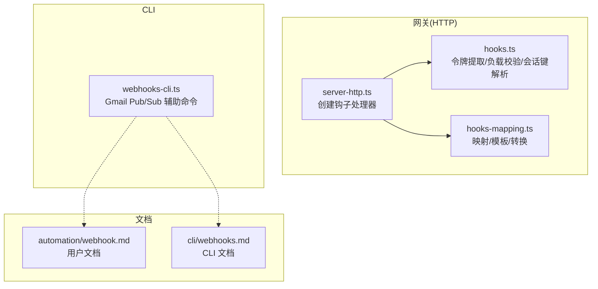
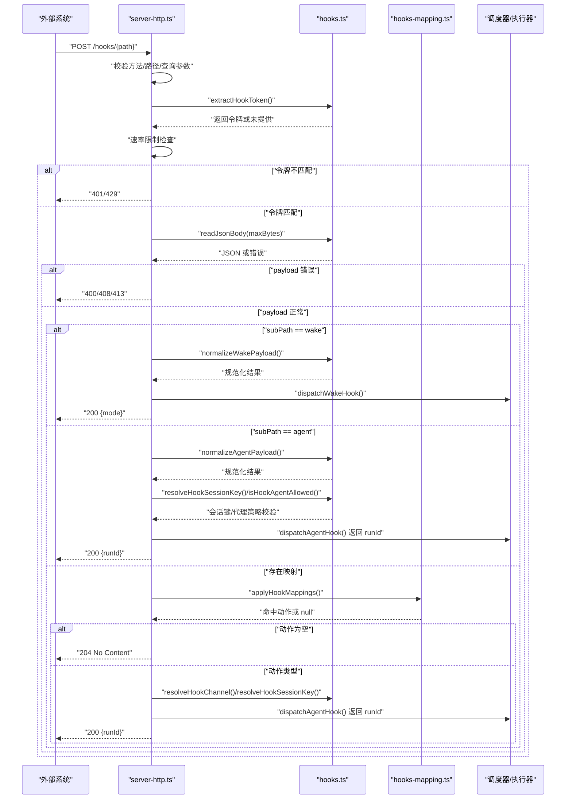
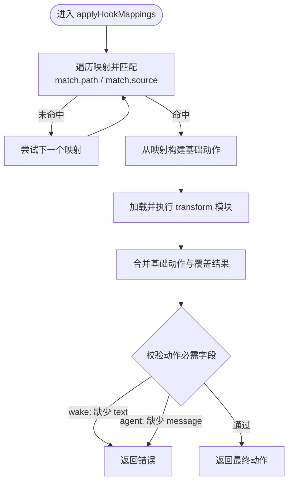
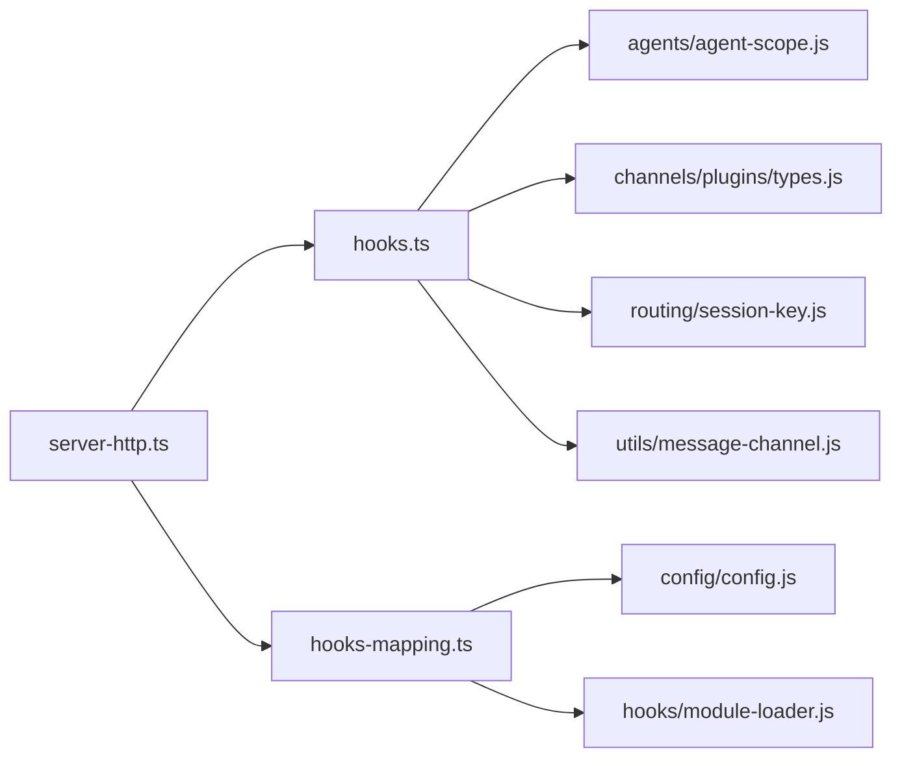

# Webhook 和 Hooks API

<cite>
**本文引用的文件**
- [src/gateway/hooks.ts](file://src/gateway/hooks.ts)
- [src/gateway/server-http.ts](file://src/gateway/server-http.ts)
- [src/gateway/hooks-mapping.ts](file://src/gateway/hooks-mapping.ts)
- [src/gateway/server.hooks.test.ts](file://src/gateway/server.hooks.test.ts)
- [src/gateway/server-http.hooks-request-timeout.test.ts](file://src/gateway/server-http.hooks-request-timeout.test.ts)
- [src/cli/webhooks-cli.ts](file://src/cli/webhooks-cli.ts)
- [docs/automation/webhook.md](file://docs/automation/webhook.md)
- [docs/cli/webhooks.md](file://docs/cli/webhooks.md)
</cite>

## 目录
1. [简介](#简介)
2. [项目结构](#项目结构)
3. [核心组件](#核心组件)
4. [架构总览](#架构总览)
5. [详细组件分析](#详细组件分析)
6. [依赖关系分析](#依赖关系分析)
7. [性能考量](#性能考量)
8. [故障排除指南](#故障排除指南)
9. [结论](#结论)
10. [附录](#附录)

## 简介
本文件为 OpenClaw 的 Webhook 与 Hooks HTTP API 提供权威参考，覆盖以下主题：
- 基于 POST 的钩子系统：/hooks/basePath/wake 与 /hooks/basePath/agent 端点
- 钩子令牌验证机制：支持 Authorization Bearer 与 X-OpenClaw-Token 头部校验
- 钩子映射系统：自定义路径映射、负载模板渲染、JS/TS 转换函数、动作执行
- 请求格式与参数结构：唤醒钩子与代理钩子的字段说明与约束
- 会话键解析、代理 ID 映射与传递目标解析
- 速率限制、错误处理与安全防护策略
- 实际集成示例与第三方服务对接指南
- 调试工具与故障排除方法

## 项目结构
OpenClaw 将钩子能力拆分为“配置解析”“HTTP 接入层”“映射与模板”“CLI 辅助工具”等模块，并在网关服务器中统一挂载。

图示来源
- [src/gateway/server-http.ts](file://src/gateway/server-http.ts)
- [src/gateway/hooks.ts](file://src/gateway/hooks.ts)
- [src/gateway/hooks-mapping.ts](file://src/gateway/hooks-mapping.ts)
- [src/cli/webhooks-cli.ts](file://src/cli/webhooks-cli.ts)
- [docs/automation/webhook.md](file://docs/automation/webhook.md)
- [docs/cli/webhooks.md](file://docs/cli/webhooks.md)

章节来源
- [src/gateway/server-http.ts](file://src/gateway/server-http.ts)
- [src/gateway/hooks.ts](file://src/gateway/hooks.ts)
- [src/gateway/hooks-mapping.ts](file://src/gateway/hooks-mapping.ts)
- [src/cli/webhooks-cli.ts](file://src/cli/webhooks-cli.ts)
- [docs/automation/webhook.md](file://docs/automation/webhook.md)
- [docs/cli/webhooks.md](file://docs/cli/webhooks.md)

## 核心组件
- 钩子配置解析与策略
  - basePath、token、最大请求体大小、映射列表、代理路由策略、会话键策略
- 钩子令牌提取与校验
  - 支持 Authorization: Bearer 与 X-OpenClaw-Token；拒绝查询字符串 token
- 负载规范化与校验
  - wake: text 必填，mode 可选
  - agent: message 必填，name/agentId/sessionKey/channel/to/model/thinking/timeoutSeconds 可选
- 会话键解析与前缀白名单
  - 默认生成 hook:<uuid>；可配置默认值与允许前缀；请求覆盖默认关闭
- 代理路由策略
  - allowedAgentIds 白名单控制显式 agentId 路由
- 映射系统
  - 匹配 path/source，模板渲染，可选 transform 函数，最终输出 wake/agent 动作
- 速率限制与安全
  - 钩子认证失败按客户端 IP 限流；429 返回 Retry-After；禁止 GET；拒绝 query token

章节来源
- [src/gateway/hooks.ts](file://src/gateway/hooks.ts)
- [src/gateway/server-http.ts](file://src/gateway/server-http.ts)
- [src/gateway/hooks-mapping.ts](file://src/gateway/hooks-mapping.ts)

## 架构总览
下图展示从 HTTP 请求到动作执行的关键调用链路与职责边界。

图示来源
- [src/gateway/server-http.ts](file://src/gateway/server-http.ts)
- [src/gateway/hooks.ts](file://src/gateway/hooks.ts)
- [src/gateway/hooks-mapping.ts](file://src/gateway/hooks-mapping.ts)

## 详细组件分析

### 端点与请求格式
- 基础路径
  - basePath 默认 “/hooks”，不可为 “/”
- 端点
  - POST /hooks/wake：唤醒系统事件
  - POST /hooks/agent：触发隔离代理运行
  - POST /hooks/<name>：通过映射将任意负载转为 wake/agent 动作
- 认证
  - Authorization: Bearer <token>（推荐）
  - X-OpenClaw-Token: <token>
  - 查询参数 ?token=... 禁止，返回 400
- 方法
  - 仅允许 POST；其他方法返回 405

章节来源
- [docs/automation/webhook.md](file://docs/automation/webhook.md)
- [src/gateway/server-http.ts](file://src/gateway/server-http.ts)

### 唤醒钩子 /hooks/wake
- 负载字段
  - text: 必填（去空白后非空）
  - mode: now | next-heartbeat，默认 now
- 行为
  - 入队系统事件至主会话
  - mode=now 时立即触发心跳

章节来源
- [src/gateway/hooks.ts](file://src/gateway/hooks.ts)
- [src/gateway/server-http.ts](file://src/gateway/server-http.ts)
- [docs/automation/webhook.md](file://docs/automation/webhook.md)

### 代理钩子 /hooks/agent
- 负载字段
  - message: 必填（去空白后非空）
  - name: 可选（人类可读名称）
  - agentId: 可选（显式路由），未知则回落默认代理
  - sessionKey: 可选（会话键），默认禁用请求覆盖；可通过策略开启并限定前缀
  - wakeMode: now | next-heartbeat，默认 now
  - deliver: 是否投递到消息通道，默认 true
  - channel: 目标通道（last 或具体插件通道），默认 last
  - to: 通道收件人标识（如电话号码、群组 ID 等）
  - model/thinking/timeoutSeconds: 可选覆盖
- 行为
  - 触发隔离代理回合（独立会话键）
  - 总会在主会话发布摘要
  - wakeMode=now 时立即触发心跳

章节来源
- [src/gateway/hooks.ts](file://src/gateway/hooks.ts)
- [src/gateway/server-http.ts](file://src/gateway/server-http.ts)
- [docs/automation/webhook.md](file://docs/automation/webhook.md)

### 钩子映射系统
- 映射匹配
  - match.path: 严格匹配 /hooks/<path>
  - match.source: payload.source 字段精确匹配
- 模板渲染
  - messageTemplate/textTemplate 支持 {{payload.*}}、{{headers.*}}、{{query.*}}、{{path}}、{{now}}
  - 模板表达式受控路径访问，避免原型链污染
- 转换函数
  - transform.module 指定模块路径（受限于 hooks.transformsDir 与安全校验）
  - 导出函数签名：(ctx) => Partial<Action> | null
  - 支持默认导出或指定导出名
- 动作合并
  - 基线动作来自映射配置，可被 transform 覆盖
  - 最终动作必须满足必需字段校验（wake 需 text，agent 需 message）

图示来源
- [src/gateway/hooks-mapping.ts](file://src/gateway/hooks-mapping.ts)

章节来源
- [src/gateway/hooks-mapping.ts](file://src/gateway/hooks-mapping.ts)

### 令牌验证与速率限制
- 令牌提取
  - Authorization: Bearer <token> 优先
  - 若无则尝试 X-OpenClaw-Token
  - 两者均缺失视为未认证
- 速率限制
  - 连续认证失败（401）按客户端 IP 计数
  - 达阈值（默认 20 次/分钟）返回 429 并带 Retry-After
  - 成功请求重置计数
- 安全策略
  - 禁止 GET；仅 POST
  - 禁止查询参数 token；必须使用头部
  - 钩子负载作为不受信输入，启用默认安全边界；可在映射中选择性放宽

章节来源
- [src/gateway/server-http.ts](file://src/gateway/server-http.ts)
- [src/gateway/hooks.ts](file://src/gateway/hooks.ts)

### 会话键解析与代理 ID 映射
- 会话键解析
  - 请求覆盖：默认关闭；开启后需配置 allowedSessionKeyPrefixes
  - 默认值：hooks.defaultSessionKey（若未设置则要求包含 "hook:" 前缀）
  - 生成：未提供且未配置默认时，生成 hook:<uuid>，并校验前缀白名单
  - 传递目标解析：若会话键以 agent:{agentId}: 开头，执行前缀归一化，仅保留 rest 部分
- 代理 ID 映射
  - 未知 agentId 回落至默认代理
  - allowedAgentIds 控制显式路由：未设置表示允许全部；包含 "*" 表示允许全部；设为空数组表示禁止显式路由

章节来源
- [src/gateway/hooks.ts](file://src/gateway/hooks.ts)
- [src/gateway/server-http.ts](file://src/gateway/server-http.ts)

### 错误处理与响应码
- 401 未授权：令牌不匹配或缺失
- 400 请求无效：JSON 解析失败、必填字段缺失、非法 channel、非法 agentId、非法 sessionKey 前缀
- 405 方法不允许：非 POST
- 413 请求体过大：超过 maxBodyBytes
- 408 请求体超时：读取超时
- 429 速率限制：重复认证失败
- 200 成功：wake 返回 mode；agent 返回 runId
- 204 映射动作为空：跳过执行

章节来源
- [src/gateway/server-http.ts](file://src/gateway/server-http.ts)
- [src/gateway/hooks.ts](file://src/gateway/hooks.ts)

## 依赖关系分析
- server-http.ts 依赖 hooks.ts（令牌、负载、会话键、通道解析）、hooks-mapping.ts（映射与模板）
- hooks.ts 依赖 agents/agents-scope、channels/plugins/types、routing/session-key、utils/message-channel
- hooks-mapping.ts 依赖 config/config、hooks/module-loader、hooks.ts 中的通道类型
- CLI webhooks-cli.ts 提供 Gmail Pub/Sub 集成辅助命令

图示来源
- [src/gateway/server-http.ts](file://src/gateway/server-http.ts)
- [src/gateway/hooks.ts](file://src/gateway/hooks.ts)
- [src/gateway/hooks-mapping.ts](file://src/gateway/hooks-mapping.ts)

章节来源
- [src/gateway/server-http.ts](file://src/gateway/server-http.ts)
- [src/gateway/hooks.ts](file://src/gateway/hooks.ts)
- [src/gateway/hooks-mapping.ts](file://src/gateway/hooks-mapping.ts)

## 性能考量
- 读取与解析
  - 采用带上限的 JSON 读取，避免内存膨胀
  - 模板渲染与转换函数按需加载，转换函数具备缓存
- 会话键与代理路由
  - 通过白名单与默认值减少动态解析成本
- 速率限制
  - 低开销的内存计数与重置，避免频繁 IO

[本节为通用指导，无需列出章节来源]

## 故障排除指南
- 401 未授权
  - 检查 Authorization 头是否为 Bearer，或是否使用 X-OpenClaw-Token
  - 确认未通过查询参数传 token
  - 查看是否被 429 限流（检查 Retry-After）
- 400 请求无效
  - wake：确认 text 非空
  - agent：确认 message 非空；检查 channel 是否合法；检查 agentId 是否在 allowedAgentIds
  - sessionKey：若启用了请求覆盖，确认前缀在 allowedSessionKeyPrefixes 中
- 405 方法不允许
  - 确保使用 POST
- 413/408
  - 减小请求体或提高 maxBodyBytes；检查网络稳定性
- 429 速率限制
  - 短时间内多次错误认证会被限流；稍后再试
- 映射未生效
  - 确认 match.path 或 match.source 与请求匹配
  - 检查 transform.module 路径是否在 hooks.transformsDir 下且未越权
- 集成 Gmail Pub/Sub
  - 使用 CLI 命令进行 setup 与 run，确保 topic/subscription/account/token 配置正确

章节来源
- [src/gateway/server-http.ts](file://src/gateway/server-http.ts)
- [src/gateway/server.hooks.test.ts](file://src/gateway/server.hooks.test.ts)
- [src/gateway/server-http.hooks-request-timeout.test.ts](file://src/gateway/server-http.hooks-request-timeout.test.ts)
- [src/cli/webhooks-cli.ts](file://src/cli/webhooks-cli.ts)
- [docs/automation/webhook.md](file://docs/automation/webhook.md)
- [docs/cli/webhooks.md](file://docs/cli/webhooks.md)

## 结论
OpenClaw 的 Webhook/Hooks API 以简洁的 POST 接口为核心，结合令牌校验、速率限制与安全边界，提供了灵活的唤醒与代理执行能力。通过映射系统，用户可将任意第三方事件转化为统一的动作模型；通过严格的会话键与代理路由策略，保障运行安全与可追踪性。建议在生产环境中：
- 使用专用钩子令牌，避免复用网关认证
- 限制 allowedAgentIds 与 allowedSessionKeyPrefixes
- 默认关闭请求覆盖的 sessionKey，必要时再开启并限定前缀
- 使用映射与模板实现幂等与可审计的事件处理

[本节为总结性内容，无需列出章节来源]

## 附录

### 请求与响应示例（路径引用）
- 唤醒钩子示例
  - [示例请求](file://docs/automation/webhook.md)
- 代理钩子示例
  - [示例请求](file://docs/automation/webhook.md)
- 使用不同模型示例
  - [示例请求](file://docs/automation/webhook.md)
- Gmail Pub/Sub 集成示例
  - [CLI 命令](file://docs/cli/webhooks.md)
  - [自动化文档](file://docs/automation/webhook.md)

### 配置要点（路径引用）
- 基本开关与令牌
  - [配置片段](file://docs/automation/webhook.md)
- 会话键策略（推荐与兼容）
  - [配置片段](file://docs/automation/webhook.md)
- 映射与转换
  - [映射与模板说明](file://docs/automation/webhook.md)
  - [映射实现细节](file://src/gateway/hooks-mapping.ts)