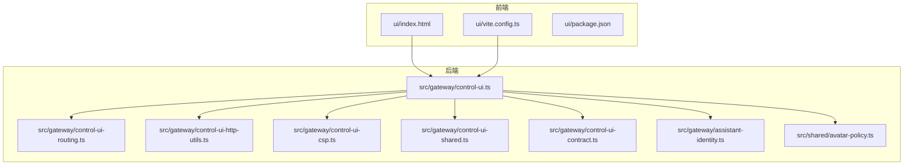
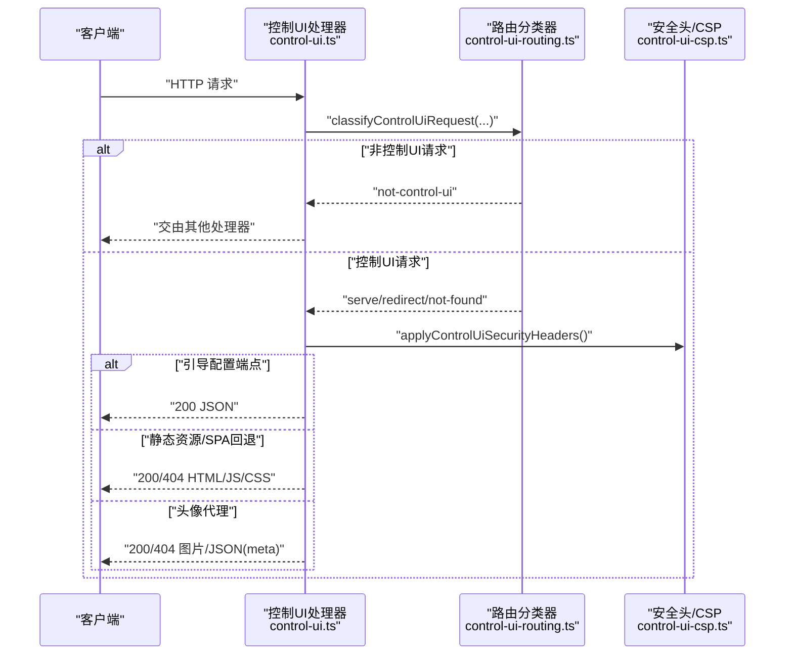
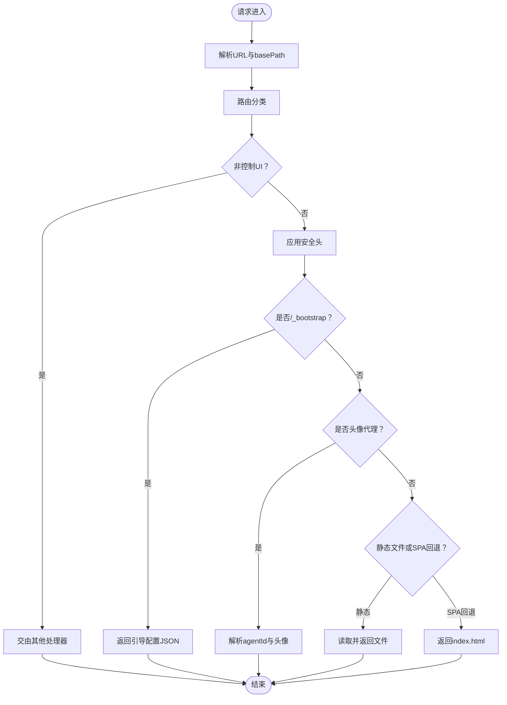
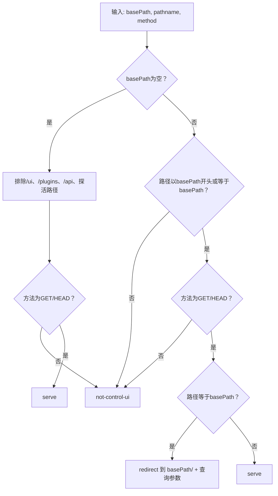
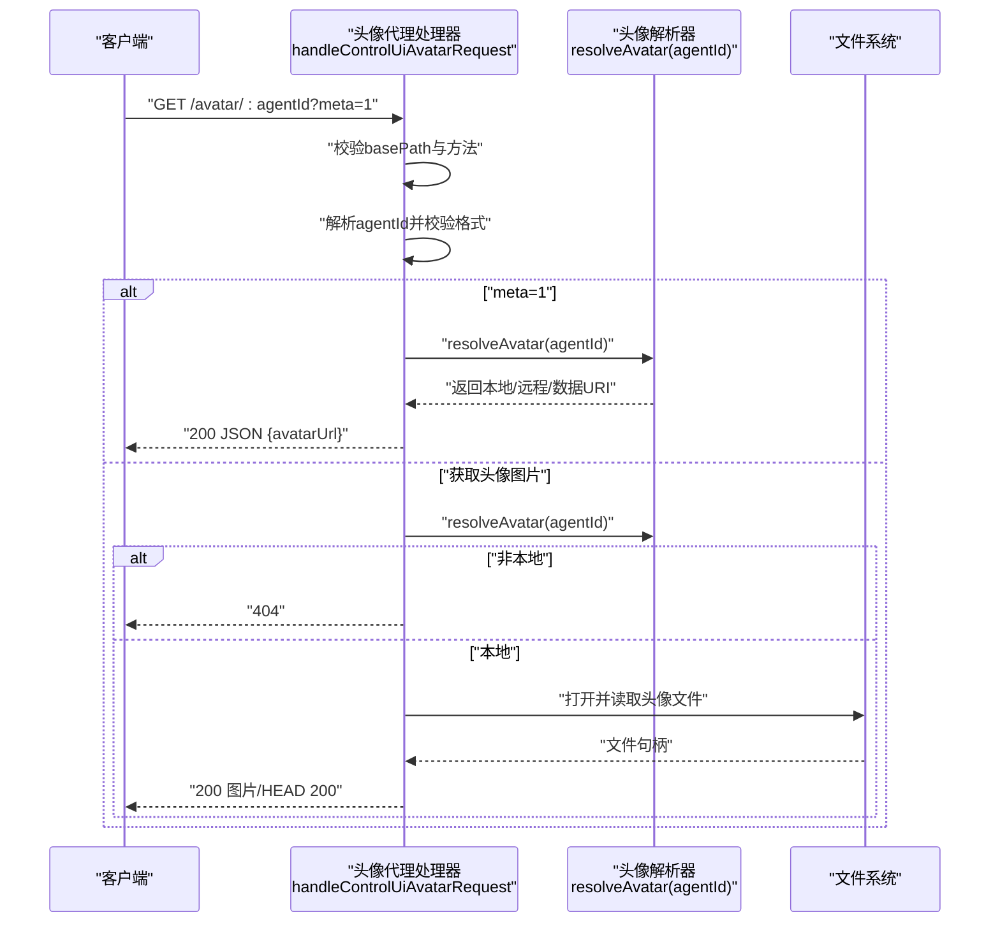
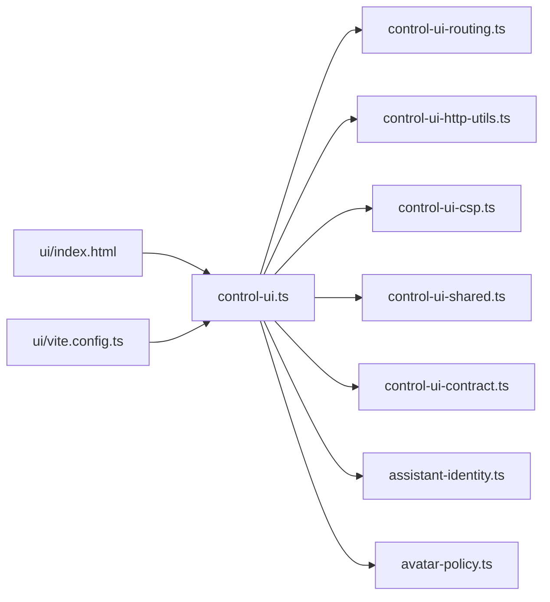

# 控制 UI API

<cite>
**本文引用的文件**
- [control-ui.ts](file://src/gateway/control-ui.ts)
- [control-ui-routing.ts](file://src/gateway/control-ui-routing.ts)
- [control-ui-http-utils.ts](file://src/gateway/control-ui-http-utils.ts)
- [control-ui-csp.ts](file://src/gateway/control-ui-csp.ts)
- [control-ui-shared.ts](file://src/gateway/control-ui-shared.ts)
- [assistant-identity.ts](file://src/gateway/assistant-identity.ts)
- [control-ui-contract.ts](file://src/gateway/control-ui-contract.ts)
- [avatar-policy.ts](file://src/shared/avatar-policy.ts)
- [control-ui.http.test.ts](file://src/gateway/control-ui.http.test.ts)
- [control-ui-routing.test.ts](file://src/gateway/control-ui-routing.test.ts)
- [gateway-misc.test.ts](file://src/gateway/gateway-misc.test.ts)
- [server.plugin-http-auth.test.ts](file://src/gateway/server.plugin-http-auth.test.ts)
- [index.html](file://ui/index.html)
- [vite.config.ts](file://ui/vite.config.ts)
- [package.json](file://ui/package.json)
</cite>

## 目录
1. [简介](#简介)
2. [项目结构](#项目结构)
3. [核心组件](#核心组件)
4. [架构总览](#架构总览)
5. [详细组件分析](#详细组件分析)
6. [依赖关系分析](#依赖关系分析)
7. [性能考量](#性能考量)
8. [故障排查指南](#故障排查指南)
9. [结论](#结论)
10. [附录](#附录)

## 简介
本文件为 OpenClaw 控制 UI 的 HTTP API 参考文档，覆盖以下主题：
- 控制面板的 HTTP 接口：仪表板数据获取端点、配置管理 API、状态查询接口
- 路由机制：SPA（单页应用）路由处理与静态资源服务
- 代理头像获取端点、配置同步接口与实时状态更新机制
- 完整的 API 端点清单（含 GET、POST、PUT 等请求方法、参数与响应格式）
- 认证要求、CSP（内容安全策略）配置与跨域访问设置
- 前端集成示例与后端 API 使用指南
- 控制 UI 的安全模型与访问控制机制

## 项目结构
控制 UI 的 HTTP 服务由后端网关模块提供，前端构建产物位于 ui 目录并通过后端进行静态资源服务与 SPA 回退。核心文件如下：
- 后端路由与处理：src/gateway/control-ui.ts、control-ui-routing.ts、control-ui-http-utils.ts
- 安全与 CSP：src/gateway/control-ui-csp.ts
- 共享常量与路径：src/gateway/control-ui-shared.ts、src/gateway/control-ui-contract.ts
- 助手身份与头像策略：src/gateway/assistant-identity.ts、src/shared/avatar-policy.ts
- 前端入口与构建：ui/index.html、ui/vite.config.ts、ui/package.json
- 测试用例：src/gateway/*.test.ts

**图表来源**
- [control-ui.ts:1-482](file://src/gateway/control-ui.ts#L1-L482)
- [control-ui-routing.ts:1-52](file://src/gateway/control-ui-routing.ts#L1-L52)
- [control-ui-http-utils.ts:1-16](file://src/gateway/control-ui-http-utils.ts#L1-L16)
- [control-ui-csp.ts](file://src/gateway/control-ui-csp.ts)
- [control-ui-shared.ts](file://src/gateway/control-ui-shared.ts)
- [control-ui-contract.ts](file://src/gateway/control-ui-contract.ts)
- [assistant-identity.ts](file://src/gateway/assistant-identity.ts)
- [avatar-policy.ts](file://src/shared/avatar-policy.ts)
- [index.html:1-17](file://ui/index.html#L1-L17)
- [vite.config.ts:1-44](file://ui/vite.config.ts#L1-L44)
- [package.json:1-28](file://ui/package.json#L1-L28)

**章节来源**
- [control-ui.ts:1-482](file://src/gateway/control-ui.ts#L1-L482)
- [control-ui-routing.ts:1-52](file://src/gateway/control-ui-routing.ts#L1-L52)
- [control-ui-http-utils.ts:1-16](file://src/gateway/control-ui-http-utils.ts#L1-L16)
- [index.html:1-17](file://ui/index.html#L1-L17)
- [vite.config.ts:1-44](file://ui/vite.config.ts#L1-L44)
- [package.json:1-28](file://ui/package.json#L1-L28)

## 核心组件
- 控制 UI HTTP 处理器：负责识别控制 UI 相关请求、分类路由、返回静态资源、SPA 回退、头像代理与引导配置等。
- 路由分类器：根据 basePath、方法与路径判断是否属于控制 UI、是否重定向或回退到 SPA。
- 安全与 CSP：统一注入安全响应头，包括 X-Frame-Options、Content-Security-Policy、X-Content-Type-Options、Referrer-Policy。
- 头像代理解析器：支持本地头像文件读取、远程头像与数据 URI 返回，并限制最大字节数。
- 引导配置端点：提供 basePath、助手名称/头像/Agent ID、服务器版本等前端初始化所需信息。

**章节来源**
- [control-ui.ts:113-125](file://src/gateway/control-ui.ts#L113-L125)
- [control-ui-routing.ts:3-7](file://src/gateway/control-ui-routing.ts#L3-L7)
- [control-ui.ts:156-221](file://src/gateway/control-ui.ts#L156-L221)
- [control-ui.ts:299-481](file://src/gateway/control-ui.ts#L299-L481)
- [control-ui.ts:338-363](file://src/gateway/control-ui.ts#L338-L363)

## 架构总览
控制 UI 的 HTTP 交互流程如下：
- 请求进入后端，先通过路由分类器判断是否属于控制 UI。
- 若是控制 UI 请求，则应用安全头并执行相应处理：
  - 引导配置端点：返回前端初始化所需的 JSON 数据。
  - 静态资源与 SPA 回退：从已解析的 UI 根目录读取文件，未知扩展名路径回退到 index.html。
  - 头像代理：解析 agentId，支持 meta 查询与实际头像文件读取。
- 对于非控制 UI 请求，交由其他处理器（如插件 Webhook、探活接口等）处理。

**图表来源**
- [control-ui.ts:299-481](file://src/gateway/control-ui.ts#L299-L481)
- [control-ui-routing.ts:11-51](file://src/gateway/control-ui-routing.ts#L11-L51)
- [control-ui-csp.ts](file://src/gateway/control-ui-csp.ts)

**章节来源**
- [control-ui.ts:299-481](file://src/gateway/control-ui.ts#L299-L481)
- [control-ui-routing.ts:11-51](file://src/gateway/control-ui-routing.ts#L11-L51)

## 详细组件分析

### 组件一：控制 UI HTTP 处理器
职责与行为：
- 解析 URL、basePath、方法与路径，调用路由分类器。
- 应用统一安全头（X-Frame-Options、CSP、X-Content-Type-Options、Referrer-Policy）。
- 处理引导配置端点（/_bootstrap）、静态资源与 SPA 回退、头像代理。
- 对 HEAD 方法进行快速响应，避免读取文件体。
- 对未知扩展名路径进行 SPA 回退，对已知扩展名路径返回 404。

**图表来源**
- [control-ui.ts:299-481](file://src/gateway/control-ui.ts#L299-L481)
- [control-ui-routing.ts:11-51](file://src/gateway/control-ui-routing.ts#L11-L51)

**章节来源**
- [control-ui.ts:299-481](file://src/gateway/control-ui.ts#L299-L481)

### 组件二：路由分类器
功能：
- 根据 basePath、方法与路径判断请求是否属于控制 UI。
- 在根挂载场景下，保留探活与插件/旧版 UI 路径不被 SPA 捕获。
- 对非 GET/HEAD 方法直接放行给其他处理器。
- 对仅带 basePath 的 GET/HEAD 请求进行重定向至带查询参数的路径。

**图表来源**
- [control-ui-routing.ts:11-51](file://src/gateway/control-ui-routing.ts#L11-L51)

**章节来源**
- [control-ui-routing.ts:11-51](file://src/gateway/control-ui-routing.ts#L11-L51)

### 组件三：头像代理端点
功能：
- 路径前缀：/avatar 或 basePath + /avatar。
- 支持查询参数 meta=1 获取头像元信息（avatarUrl）。
- 校验 agentId 格式，限制最大字节数，拒绝硬链接与危险路径。
- 仅允许 GET/HEAD 方法；非本地头像时返回 404。

**图表来源**
- [control-ui.ts:156-221](file://src/gateway/control-ui.ts#L156-L221)
- [avatar-policy.ts](file://src/shared/avatar-policy.ts)

**章节来源**
- [control-ui.ts:156-221](file://src/gateway/control-ui.ts#L156-L221)

### 组件四：引导配置端点
功能：
- 路径：/_bootstrap 或 basePath + /_bootstrap。
- 返回前端初始化所需数据：basePath、助手名称、助手头像（可为本地代理 URL 或原始值）、助手 Agent ID、服务器版本。
- 支持 HEAD 方法快速探测。

**章节来源**
- [control-ui.ts:338-363](file://src/gateway/control-ui.ts#L338-L363)
- [assistant-identity.ts](file://src/gateway/assistant-identity.ts)
- [control-ui-contract.ts](file://src/gateway/control-ui-contract.ts)

### 组件五：静态资源与 SPA 回退
功能：
- 识别已知静态扩展名（.js/.css/.json/.map/.svg/.png/.jpg/.jpeg/.gif/.webp/.ico/.txt），不存在则返回 404。
- 其他路径回退到 index.html，交由前端单页应用处理。
- 对 HEAD 方法仅设置响应头并返回 200。

**章节来源**
- [control-ui.ts:88-101](file://src/gateway/control-ui.ts#L88-L101)
- [control-ui.ts:454-477](file://src/gateway/control-ui.ts#L454-L477)
- [control-ui.ts:142-150](file://src/gateway/control-ui.ts#L142-L150)

## 依赖关系分析
- 控制 UI 处理器依赖路由分类器、HTTP 工具、CSP 构建器、共享常量、引导配置契约、助手身份与头像策略。
- 路由分类器依赖 HTTP 方法判定工具。
- 头像代理依赖头像解析器与策略限制。
- 前端通过 ui/index.html 与 vite.config.ts 提供入口与构建配置。

**图表来源**
- [control-ui.ts:1-482](file://src/gateway/control-ui.ts#L1-L482)
- [control-ui-routing.ts:1-52](file://src/gateway/control-ui-routing.ts#L1-L52)
- [control-ui-http-utils.ts:1-16](file://src/gateway/control-ui-http-utils.ts#L1-L16)
- [control-ui-csp.ts](file://src/gateway/control-ui-csp.ts)
- [control-ui-shared.ts](file://src/gateway/control-ui-shared.ts)
- [control-ui-contract.ts](file://src/gateway/control-ui-contract.ts)
- [assistant-identity.ts](file://src/gateway/assistant-identity.ts)
- [avatar-policy.ts](file://src/shared/avatar-policy.ts)
- [index.html:1-17](file://ui/index.html#L1-L17)
- [vite.config.ts:1-44](file://ui/vite.config.ts#L1-L44)

**章节来源**
- [control-ui.ts:1-482](file://src/gateway/control-ui.ts#L1-L482)
- [vite.config.ts:1-44](file://ui/vite.config.ts#L1-L44)

## 性能考量
- 静态资源与 SPA 回退均采用“按需读取 + 关闭文件描述符”的方式，避免资源泄漏。
- 对 HEAD 请求仅设置响应头并返回，减少不必要的 I/O。
- 静态资源设置“no-cache”策略，便于开发迭代但可能影响缓存命中率；生产部署建议结合 CDN 与长期缓存策略。
- 控制 UI 构建输出目录为 dist/control-ui，可通过环境变量 OPENCLAW_CONTROL_UI_BASE_PATH 配置基础路径。

**章节来源**
- [control-ui.ts:142-150](file://src/gateway/control-ui.ts#L142-L150)
- [control-ui.ts:223-234](file://src/gateway/control-ui.ts#L223-L234)
- [vite.config.ts:30-36](file://ui/vite.config.ts#L30-L36)

## 故障排查指南
常见问题与定位要点：
- 控制 UI 资源未找到：检查 ui 构建产物是否存在，或确认 gateway.controlUi.root 配置是否正确。
- 404 与 SPA 回退混淆：已知扩展名路径不存在将返回 404；未知路径会回退到 index.html。可通过测试用例验证行为。
- 非 GET/HEAD 方法被忽略：路由分类器仅处理 GET/HEAD；POST 等方法将交由其他处理器（如插件 Webhook）。
- 头像代理失败：确保 agentId 格式合法且头像文件在允许范围内，且不超过最大字节限制。
- 探活与插件路径不受 SPA 影响：根挂载场景下 /health、/ready 等探活路径与 /plugins、/api、/ui 路由不会被 SPA 捕获。

**章节来源**
- [control-ui.ts:127-140](file://src/gateway/control-ui.ts#L127-L140)
- [gateway-misc.test.ts:101-154](file://src/gateway/gateway-misc.test.ts#L101-L154)
- [control-ui-routing.test.ts:1-45](file://src/gateway/control-ui-routing.test.ts#L1-L45)
- [server.plugin-http-auth.test.ts:432-458](file://src/gateway/server.plugin-http-auth.test.ts#L432-L458)

## 结论
控制 UI 的 HTTP API 以“路由分类 + 安全头 + 静态资源 + SPA 回退 + 头像代理 + 引导配置”为核心能力，既满足前端单页应用的路由需求，又通过严格的路径校验与安全策略保障运行安全。通过明确的端点与清晰的处理流程，开发者可以高效地集成前端与后端，实现稳定的控制面板体验。

## 附录

### API 端点清单与规范
- 基础路径
  - basePath：可选，用于将控制 UI 挂载到子路径。若未设置，默认为根路径“/”。可通过环境变量 OPENCLAW_CONTROL_UI_BASE_PATH 配置。
  - 引导配置端点：/_bootstrap 或 basePath + /_bootstrap
    - 方法：GET/HEAD
    - 参数：无
    - 响应：JSON，字段包括 basePath、assistantName、assistantAvatar、assistantAgentId、serverVersion
    - 安全：应用统一安全头
  - 头像代理端点：/avatar/:agentId 或 basePath + /avatar/:agentId
    - 方法：GET/HEAD
    - 查询参数：
      - meta=1：返回 JSON { avatarUrl }
    - 响应：图片或 JSON；非本地头像时返回 404
    - 安全：应用统一安全头
  - 静态资源与 SPA 回退
    - 方法：GET/HEAD
    - 行为：已知扩展名路径优先返回静态资源；未知路径回退到 index.html；HEAD 仅返回响应头
    - 安全：应用统一安全头
  - 插件与探活路径
    - 方法：非 GET/HEAD 将被其他处理器处理；GET/HEAD 且路径匹配时由控制 UI 处理
    - 特殊路径：/health、/ready、/plugins、/api、/ui（在根挂载场景下不被 SPA 捕获）

- 认证要求
  - 当前实现未内置认证逻辑；安全头统一应用，建议在反向代理层或上游网关添加认证与授权策略。

- CSP（内容安全策略）
  - 统一注入 Content-Security-Policy、X-Frame-Options、X-Content-Type-Options、Referrer-Policy。
  - 建议在生产环境中进一步收紧 CSP，仅允许必要的脚本与资源来源。

- 跨域访问设置
  - 当前实现未内置 CORS 头；如需跨域，请在上游网关或反向代理中配置 Access-Control-Allow-* 头。

- 实时状态更新机制
  - 当前 HTTP API 未提供 WebSocket 或 Server-Sent Events；如需实时更新，可在前端使用轮询或在上游网关引入长连接通道。

- 前端集成示例（步骤）
  - 构建前端：在 ui 目录执行构建命令，生成 dist/control-ui。
  - 配置基础路径：设置 OPENCLAW_CONTROL_UI_BASE_PATH（可选）。
  - 部署：将 dist/control-ui 作为静态资源根目录，或由后端控制 UI 处理器读取。
  - 初始化：前端访问引导配置端点获取 basePath、助手信息与服务器版本，随后加载 SPA。

- 后端 API 使用指南（步骤）
  - 在网关中注册控制 UI 处理器，传入 basePath、config、agentId、root 等选项。
  - 确保静态资源根目录存在且可读；否则返回 503。
  - 对外暴露探活端点（/health、/ready）与插件端点（/plugins、/api）时，确保它们不被 SPA 捕获。

**章节来源**
- [control-ui.ts:338-363](file://src/gateway/control-ui.ts#L338-L363)
- [control-ui.ts:156-221](file://src/gateway/control-ui.ts#L156-L221)
- [control-ui.ts:299-481](file://src/gateway/control-ui.ts#L299-L481)
- [control-ui-routing.ts:9-34](file://src/gateway/control-ui-routing.ts#L9-L34)
- [control-ui-csp.ts](file://src/gateway/control-ui-csp.ts)
- [vite.config.ts:21-29](file://ui/vite.config.ts#L21-L29)