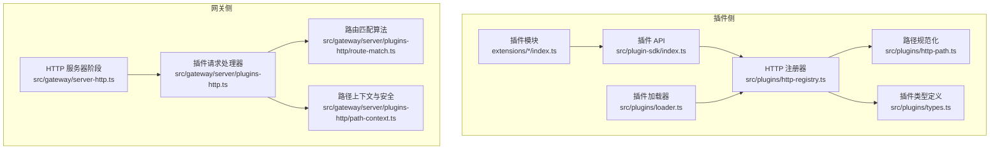
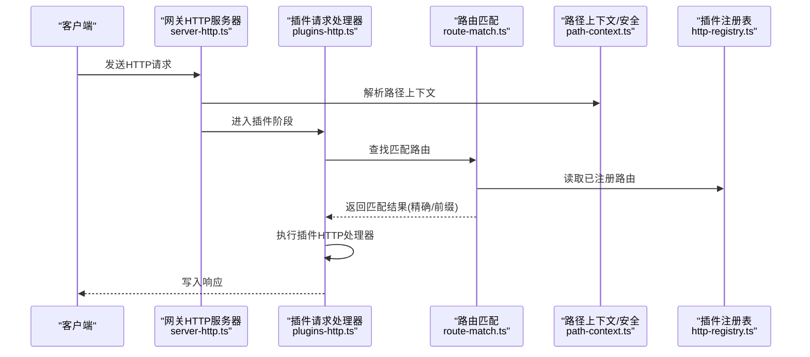
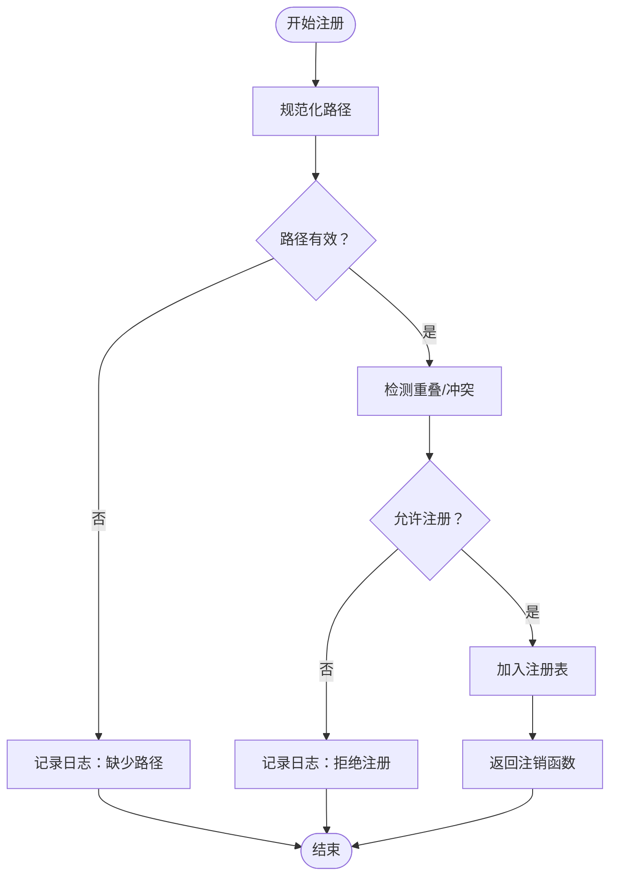
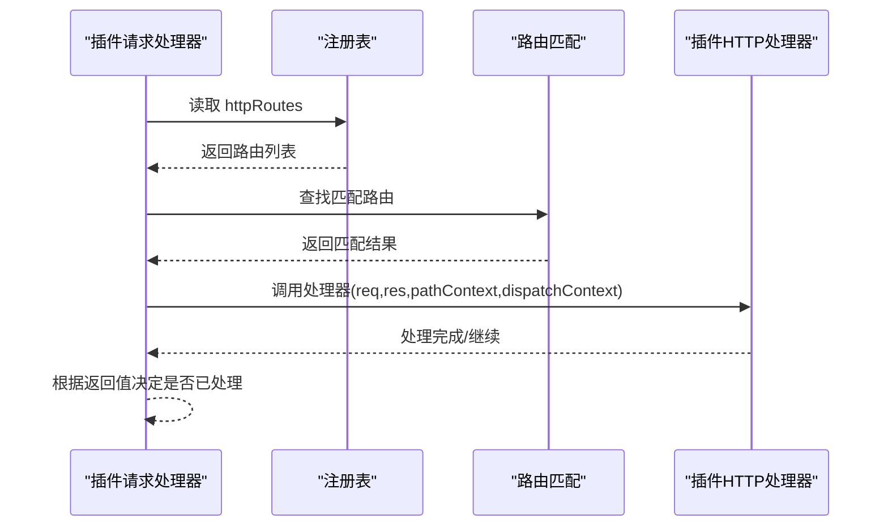
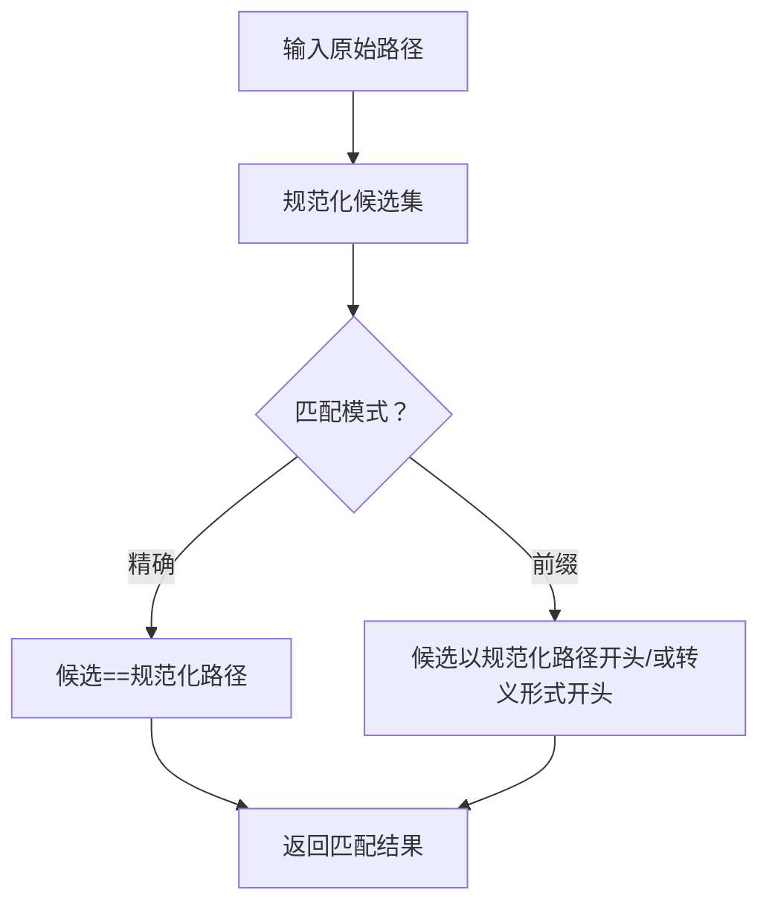
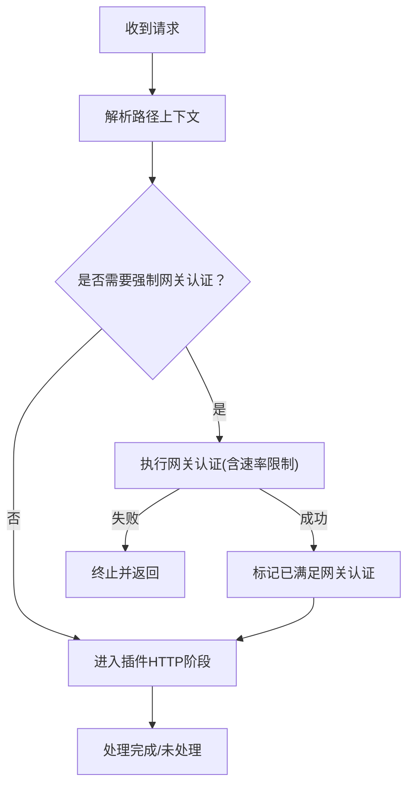
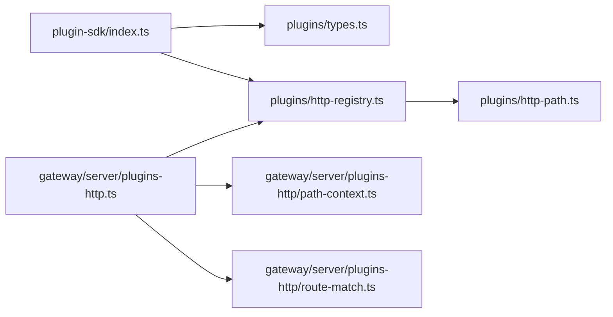

# 插件 HTTP API

<cite>
**本文引用的文件**
- [src/plugins/http-registry.ts](file://src/plugins/http-registry.ts)
- [src/plugins/http-path.ts](file://src/plugins/http-path.ts)
- [src/gateway/server/plugins-http.ts](file://src/gateway/server/plugins-http.ts)
- [src/gateway/server/plugins-http/route-match.ts](file://src/gateway/server/plugins-http/route-match.ts)
- [src/gateway/server/plugins-http/path-context.ts](file://src/gateway/server/plugins-http/path-context.ts)
- [src/gateway/server-http.ts](file://src/gateway/server-http.ts)
- [src/plugins/types.ts](file://src/plugins/types.ts)
- [src/plugin-sdk/index.ts](file://src/plugin-sdk/index.ts)
- [src/plugins/loader.ts](file://src/plugins/loader.ts)
- [extensions/diffs/index.ts](file://extensions/diffs/index.ts)
- [scripts/check-no-register-http-handler.mjs](file://scripts/check-no-register-http-handler.mjs)
</cite>

## 目录
1. [简介](#简介)
2. [项目结构](#项目结构)
3. [核心组件](#核心组件)
4. [架构总览](#架构总览)
5. [详细组件分析](#详细组件分析)
6. [依赖关系分析](#依赖关系分析)
7. [性能考量](#性能考量)
8. [故障排查指南](#故障排查指南)
9. [结论](#结论)
10. [附录：开发者指南与示例](#附录开发者指南与示例)

## 简介
本文件为 OpenClaw 插件系统的 HTTP API 参考文档，聚焦以下主题：
- 插件路由解析与匹配策略（精确匹配与前缀匹配）
- 请求转发与响应处理流程
- 插件路由上下文（路径解析、参数提取、安全校验）
- 插件 HTTP 处理器注册机制与生命周期管理
- 完整的插件 API 规范（路由前缀、中间件处理、错误传播）
- 插件与网关的集成模式（请求拦截、响应修改、安全隔离）
- 开发者指南（设计原则、最佳实践、测试方法）
- 现有插件实现示例与扩展示例
- 插件安全模型与权限控制机制

## 项目结构
围绕插件 HTTP 能力的关键模块分布如下：
- 插件侧注册与运行时
  - 路由注册与冲突检测：src/plugins/http-registry.ts
  - 路径规范化：src/plugins/http-path.ts
  - 插件类型与 API：src/plugins/types.ts
  - SDK 导出入口：src/plugin-sdk/index.ts
  - 插件加载与激活：src/plugins/loader.ts
- 网关侧路由匹配与请求分发
  - 插件请求处理器：src/gateway/server/plugins-http.ts
  - 路由匹配算法：src/gateway/server/plugins-http/route-match.ts
  - 路径上下文与安全校验：src/gateway/server/plugins-http/path-context.ts
  - 网关 HTTP 服务器阶段编排：src/gateway/server-http.ts
- 示例与迁移守则
  - 差分插件示例：extensions/diffs/index.ts
  - 迁移检查脚本（禁止使用旧 API）：scripts/check-no-register-http-handler.mjs

**图表来源**
- [src/plugins/http-registry.ts:12-92](file://src/plugins/http-registry.ts#L12-L92)
- [src/plugins/http-path.ts:1-14](file://src/plugins/http-path.ts#L1-L14)
- [src/gateway/server/plugins-http.ts:62-71](file://src/gateway/server/plugins-http.ts#L62-L71)
- [src/gateway/server/plugins-http/route-match.ts:11-60](file://src/gateway/server/plugins-http/route-match.ts#L11-L60)
- [src/gateway/server/plugins-http/path-context.ts:50-60](file://src/gateway/server/plugins-http/path-context.ts#L50-L60)
- [src/gateway/server-http.ts:285-346](file://src/gateway/server-http.ts#L285-L346)

**章节来源**
- [src/plugins/http-registry.ts:12-92](file://src/plugins/http-registry.ts#L12-L92)
- [src/gateway/server/plugins-http.ts:62-71](file://src/gateway/server/plugins-http.ts#L62-L71)
- [src/gateway/server/plugins-http/route-match.ts:11-60](file://src/gateway/server/plugins-http/route-match.ts#L11-L60)
- [src/gateway/server/plugins-http/path-context.ts:50-60](file://src/gateway/server/plugins-http/path-context.ts#L50-L60)
- [src/gateway/server-http.ts:285-346](file://src/gateway/server-http.ts#L285-L346)

## 核心组件
- 插件 HTTP 路由注册器
  - 提供 registerPluginHttpRoute，支持路径规范化、重复/重叠冲突检测、替换策略与卸载回调
  - 支持 auth 为 "gateway" 或 "plugin"，match 为 "exact" 或 "prefix"
- 插件 HTTP 请求处理器
  - 在网关侧创建 createGatewayPluginRequestHandler，按注册表查找匹配路由并执行
- 路由匹配与路径上下文
  - 基于规范化的候选路径集合进行精确或前缀匹配，并提供受保护路径判定
- 网关 HTTP 阶段编排
  - 将插件认证与插件 HTTP 处理作为独立阶段，支持条件执行与速率限制
- 插件 API 与类型
  - OpenClawPluginApi.registerHttpRoute 提供统一注册入口；类型定义明确 handler 签名与参数

**章节来源**
- [src/plugins/http-registry.ts:12-92](file://src/plugins/http-registry.ts#L12-L92)
- [src/gateway/server/plugins-http.ts:62-71](file://src/gateway/server/plugins-http.ts#L62-L71)
- [src/gateway/server/plugins-http/route-match.ts:11-60](file://src/gateway/server/plugins-http/route-match.ts#L11-L60)
- [src/gateway/server/plugins-http/path-context.ts:50-60](file://src/gateway/server/plugins-http/path-context.ts#L50-L60)
- [src/gateway/server-http.ts:285-346](file://src/gateway/server-http.ts#L285-L346)
- [src/plugins/types.ts:205-219](file://src/plugins/types.ts#L205-L219)
- [src/plugin-sdk/index.ts:125-126](file://src/plugin-sdk/index.ts#L125-L126)

## 架构总览
下图展示了从请求进入网关到插件路由处理的整体流程，以及与安全校验、速率限制的交互。

**图表来源**
- [src/gateway/server-http.ts:285-346](file://src/gateway/server-http.ts#L285-L346)
- [src/gateway/server/plugins-http.ts:62-71](file://src/gateway/server/plugins-http.ts#L62-L71)
- [src/gateway/server/plugins-http/route-match.ts:22-53](file://src/gateway/server/plugins-http/route-match.ts#L22-L53)
- [src/gateway/server/plugins-http/path-context.ts:50-60](file://src/gateway/server/plugins-http/path-context.ts#L50-L60)
- [src/plugins/http-registry.ts:24-84](file://src/plugins/http-registry.ts#L24-L84)

## 详细组件分析

### 组件一：插件 HTTP 路由注册器
- 功能要点
  - 路径规范化：确保以 "/" 开头，缺失时回退到 fallback
  - 冲突与重叠检测：同路径不同 auth 的重叠将被拒绝；相同路径可选择替换但需满足所有权约束
  - 注销回调：返回一个函数用于从注册表移除该路由
  - 匹配策略：默认 "exact"，支持 "prefix"
  - 认证策略：auth 支持 "gateway" 与 "plugin"
- 错误传播
  - 当路径缺失、冲突或重叠不被允许时，通过日志记录并返回空注销函数
- 生命周期
  - 注册后随插件生命周期存在；插件卸载或注销回调会移除路由

**图表来源**
- [src/plugins/http-registry.ts:12-92](file://src/plugins/http-registry.ts#L12-L92)

**章节来源**
- [src/plugins/http-registry.ts:12-92](file://src/plugins/http-registry.ts#L12-L92)
- [src/plugins/http-path.ts:1-14](file://src/plugins/http-path.ts#L1-L14)

### 组件二：插件 HTTP 请求处理器
- 功能要点
  - 从注册表读取 httpRoutes，若为空直接返回未处理
  - 按精确匹配优先、前缀匹配次优的顺序排序并返回首个匹配
  - 根据路由的 auth 与 dispatchContext.gatewayAuthSatisfied 决定是否具备网关授权
  - 调用路由 handler(req, res, pathContext, dispatchContext)
- 客户端作用域
  - 若需要网关认证且已满足，则授予更广的作用域；否则仅授予写操作作用域

**图表来源**
- [src/gateway/server/plugins-http.ts:62-71](file://src/gateway/server/plugins-http.ts#L62-L71)
- [src/gateway/server/plugins-http/route-match.ts:22-53](file://src/gateway/server/plugins-http/route-match.ts#L22-L53)

**章节来源**
- [src/gateway/server/plugins-http.ts:29-53](file://src/gateway/server/plugins-http.ts#L29-L53)
- [src/gateway/server/plugins-http.ts:62-71](file://src/gateway/server/plugins-http.ts#L62-L71)

### 组件三：路由匹配与路径上下文
- 路由匹配
  - 对每个候选规范化路径进行精确或前缀匹配
  - 精确匹配优先级高于前缀匹配；两者均按路径长度降序排列
- 路径上下文
  - 提供 pathname、canonicalPath、candidates、malformedEncoding、decodePassLimitReached、rawNormalizedPath
  - isProtectedPluginRoutePathFromContext 判断是否命中受保护前缀或存在畸形编码风险
- 安全校验
  - 结合受保护前缀与路径解码状态，辅助网关阶段进行安全判定

**图表来源**
- [src/gateway/server/plugins-http/route-match.ts:11-44](file://src/gateway/server/plugins-http/route-match.ts#L11-L44)
- [src/gateway/server/plugins-http/path-context.ts:50-60](file://src/gateway/server/plugins-http/path-context.ts#L50-L60)

**章节来源**
- [src/gateway/server/plugins-http/route-match.ts:11-60](file://src/gateway/server/plugins-http/route-match.ts#L11-L60)
- [src/gateway/server/plugins-http/path-context.ts:1-60](file://src/gateway/server/plugins-http/path-context.ts#L1-L60)

### 组件四：网关 HTTP 阶段编排与安全
- 阶段划分
  - 插件认证阶段：根据 shouldEnforcePluginGatewayAuth 判定是否强制网关认证
  - 插件 HTTP 阶段：调用 handlePluginRequest，传入 pathContext 与 dispatchContext
- 安全与速率限制
  - enforcePluginRouteGatewayAuth 支持受信任代理、真实 IP 回退与速率限制器
- 条件执行
  - 对特定路径（如 Mattermost Slash 回调）跳过插件认证阶段

**图表来源**
- [src/gateway/server-http.ts:285-346](file://src/gateway/server-http.ts#L285-L346)

**章节来源**
- [src/gateway/server-http.ts:285-346](file://src/gateway/server-http.ts#L285-L346)

### 组件五：插件 API 与类型
- OpenClawPluginApi.registerHttpRoute
  - 参数：path、handler、auth、match、replaceExisting
  - 返回：无（内部通过 SDK 导出 registerPluginHttpRoute 实现）
- 类型定义
  - OpenClawPluginHttpRouteAuth："gateway" | "plugin"
  - OpenClawPluginHttpRouteMatch："exact" | "prefix"
  - OpenClawPluginHttpRouteHandler：(req, res) => Promise<boolean | void> | boolean | void

**章节来源**
- [src/plugin-sdk/index.ts:125-126](file://src/plugin-sdk/index.ts#L125-L126)
- [src/plugins/types.ts:205-219](file://src/plugins/types.ts#L205-L219)

## 依赖关系分析
- 插件注册器依赖
  - 路径规范化工具
  - 注册表运行时（requireActivePluginRegistry）
  - 重叠路由检测
- 网关处理器依赖
  - 注册表（registry.httpRoutes）
  - 路由匹配算法
  - 路径上下文与安全判定
- 类型与 SDK
  - OpenClawPluginApi 与 registerHttpRoute 通过 SDK 暴露给插件

**图表来源**
- [src/plugin-sdk/index.ts:125-126](file://src/plugin-sdk/index.ts#L125-L126)
- [src/plugins/http-registry.ts:24-84](file://src/plugins/http-registry.ts#L24-L84)
- [src/plugins/http-path.ts:1-14](file://src/plugins/http-path.ts#L1-L14)
- [src/gateway/server/plugins-http.ts:62-71](file://src/gateway/server/plugins-http.ts#L62-L71)
- [src/gateway/server/plugins-http/route-match.ts:22-53](file://src/gateway/server/plugins-http/route-match.ts#L22-L53)
- [src/gateway/server/plugins-http/path-context.ts:50-60](file://src/gateway/server/plugins-http/path-context.ts#L50-L60)

**章节来源**
- [src/plugin-sdk/index.ts:125-126](file://src/plugin-sdk/index.ts#L125-L126)
- [src/plugins/http-registry.ts:24-84](file://src/plugins/http-registry.ts#L24-L84)
- [src/gateway/server/plugins-http.ts:62-71](file://src/gateway/server/plugins-http.ts#L62-L71)

## 性能考量
- 路由匹配复杂度
  - 精确匹配与前缀匹配均遍历注册表，时间复杂度 O(N)
  - 通过 candidates 与规范化减少无效比较
- 排序策略
  - 精确匹配与前缀匹配分别按路径长度降序，优先匹配更具体的路由
- 并发与异步
  - 插件处理器返回 Promise，避免阻塞网关主线程
- 速率限制
  - 网关阶段支持速率限制器，防止滥用

[本节为通用指导，无需具体文件分析]

## 故障排查指南
- 常见问题
  - 路由未生效：确认路径已规范化、匹配模式正确、未被重叠/冲突拒绝
  - 认证失败：检查 shouldEnforcePluginGatewayAuth 与受信任代理配置
  - 响应未返回：确认处理器返回布尔值指示是否已处理
- 日志与诊断
  - 注册器会在冲突/重叠/缺失路径等场景输出日志
  - 插件加载器在注册阶段对异常进行捕获并记录诊断信息
- 迁移提示
  - 使用 registerHttpHandler 的插件会被检查脚本标记为弃用，应改用 registerHttpRoute

**章节来源**
- [src/plugins/http-registry.ts:41-48](file://src/plugins/http-registry.ts#L41-L48)
- [src/plugins/loader.ts:775-800](file://src/plugins/loader.ts#L775-L800)
- [scripts/check-no-register-http-handler.mjs:14-35](file://scripts/check-no-register-http-handler.mjs#L14-L35)

## 结论
OpenClaw 的插件 HTTP API 通过“注册—匹配—处理—安全”的清晰分层，提供了灵活、可控且安全的插件路由能力。开发者可通过统一的 API 注册路由，结合网关阶段编排实现请求拦截、响应修改与安全隔离；同时，严格的冲突检测与安全校验保障了系统的稳定性与安全性。

[本节为总结性内容，无需具体文件分析]

## 附录：开发者指南与示例

### API 设计原则与最佳实践
- 路由设计
  - 明确区分 "exact" 与 "prefix" 场景，避免歧义
  - 使用受保护前缀时，优先采用 "exact" 并配合网关认证
- 安全与权限
  - 对敏感路由使用 auth:"gateway"，并在网关阶段强制认证
  - 对公开路由使用 auth:"plugin"，并进行最小权限授权
- 错误处理
  - 处理器应返回布尔值表示是否已处理，便于网关后续阶段决策
  - 使用日志记录关键路径与错误，便于调试
- 生命周期
  - 在插件卸载或注销时，确保调用返回的注销函数清理路由

**章节来源**
- [src/plugins/types.ts:205-219](file://src/plugins/types.ts#L205-L219)
- [src/gateway/server/plugins-http.ts:29-53](file://src/gateway/server/plugins-http.ts#L29-L53)

### 测试方法
- 单元测试
  - 使用注册器测试覆盖路径规范化、冲突与重叠检测
  - 使用路由匹配测试覆盖精确/前缀匹配与候选路径
- 集成测试
  - 使用网关测试夹具模拟请求，验证插件处理器是否被正确调用
  - 验证受保护路径与安全校验逻辑

**章节来源**
- [src/plugins/http-registry.test.ts:1-50](file://src/plugins/http-registry.test.ts#L1-L50)
- [src/gateway/server/plugins-http.test.ts:1-33](file://src/gateway/server/plugins-http.test.ts#L1-L33)

### 现有插件实现示例
- 差分插件示例
  - 使用 registerHttpRoute 注册前缀路由，auth:"plugin"，handler 为渲染与查看逻辑
  - 展示了如何在插件中注册 HTTP 路由并绑定安全策略

**章节来源**
- [extensions/diffs/index.ts:28-37](file://extensions/diffs/index.ts#L28-L37)

### 扩展与进阶
- 自定义中间件
  - 在网关阶段编排中插入自定义中间件，实现统一的请求预处理与响应后处理
- 动态路由
  - 使用 replaceExisting 选项在运行时替换已有路由，实现动态更新
- 账户级路由
  - 通过 accountId 参数为不同账户注册独立路由，实现多租户隔离

**章节来源**
- [src/plugins/http-registry.ts:18-24](file://src/plugins/http-registry.ts#L18-L24)
- [src/plugins/http-registry.ts:76-84](file://src/plugins/http-registry.ts#L76-L84)

### 插件安全模型与权限控制
- 认证策略
  - auth:"gateway"：要求网关认证通过，通常用于敏感路由
  - auth:"plugin"：插件自有认证，适用于公开或低风险路由
- 受保护前缀
  - 系统维护受保护前缀列表，命中这些前缀的路由将触发更严格的安全校验
- 速率限制
  - 网关阶段支持速率限制器，防止滥用与攻击

**章节来源**
- [src/gateway/server/plugins-http/path-context.ts:29-48](file://src/gateway/server/plugins-http/path-context.ts#L29-L48)
- [src/gateway/server-http.ts:318-325](file://src/gateway/server-http.ts#L318-L325)