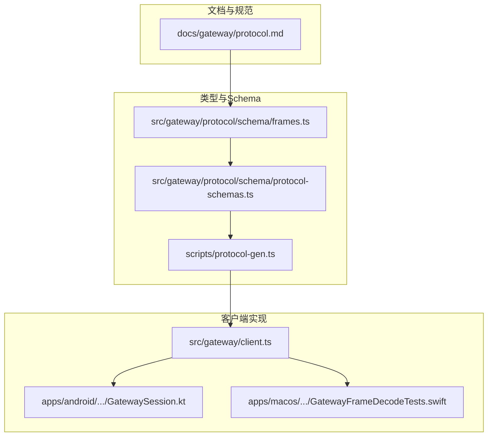
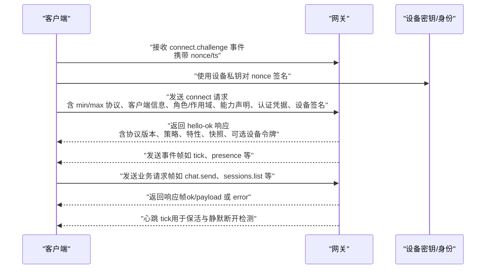
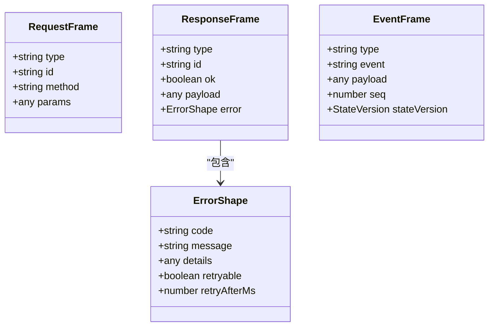
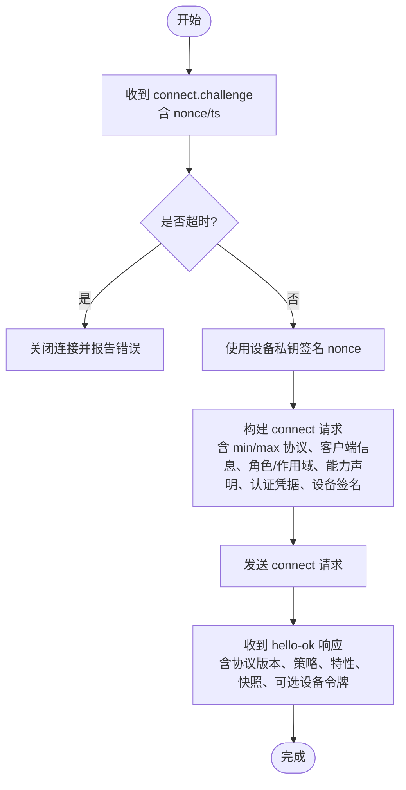
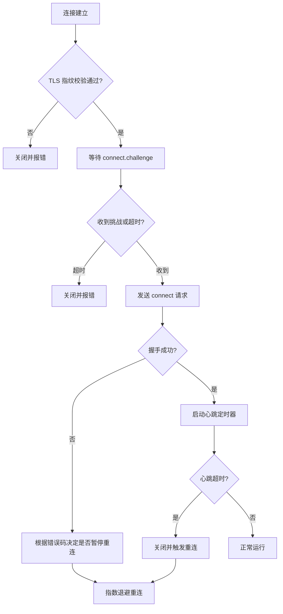
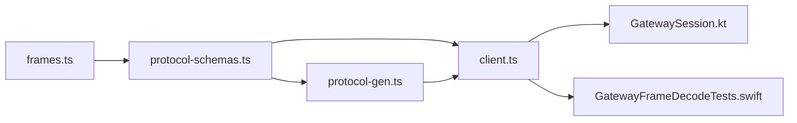

# WebSocket API

<cite>
**本文引用的文件**
- [docs/gateway/protocol.md](file://docs/gateway/protocol.md)
- [src/gateway/protocol/schema/frames.ts](file://src/gateway/protocol/schema/frames.ts)
- [src/gateway/protocol/schema/protocol-schemas.ts](file://src/gateway/protocol/schema/protocol-schemas.ts)
- [src/gateway/client.ts](file://src/gateway/client.ts)
- [apps/android/app/src/main/java/ai/openclaw/app/gateway/GatewaySession.kt](file://apps/android/app/src/main/java/ai/openclaw/app/gateway/GatewaySession.kt)
- [apps/macos/Tests/OpenClawIPCTests/GatewayFrameDecodeTests.swift](file://apps/macos/Tests/OpenClawIPCTests/GatewayFrameDecodeTests.swift)
- [scripts/protocol-gen.ts](file://scripts/protocol-gen.ts)
- [src/gateway/call.ts](file://src/gateway/call.ts)
- [src/gateway/test-helpers.server.ts](file://src/gateway/test-helpers.server.ts)
- [src/gateway/probe.ts](file://src/gateway/probe.ts)
</cite>

## 目录
1. [简介](#简介)
2. [项目结构](#项目结构)
3. [核心组件](#核心组件)
4. [架构总览](#架构总览)
5. [详细组件分析](#详细组件分析)
6. [依赖关系分析](#依赖关系分析)
7. [性能考量](#性能考量)
8. [故障排查指南](#故障排查指南)
9. [结论](#结论)
10. [附录](#附录)

## 简介
本文件为 OpenClaw 的 WebSocket API 参考文档，聚焦于网关 WebSocket 协议的握手、身份验证与角色权限、消息帧格式、方法调用规范、错误处理与重连策略、以及连接状态管理。文档同时提供客户端实现建议与常见交互示例路径，帮助开发者快速集成与调试。

## 项目结构
OpenClaw 的 WebSocket 协议由“文档规范 + 类型定义 + 客户端实现 + 生成脚本”构成：
- 文档层：协议与握手、帧格式、角色与作用域、版本与认证策略等在文档中明确。
- 类型层：使用 TypeBox 定义帧与参数的严格 Schema，并导出协议 Schema 集合。
- 实现层：Node.js 客户端 GatewayClient 负责握手、鉴权、事件与响应处理、心跳与重连。
- 工具层：协议生成脚本输出 JSON Schema，便于跨语言校验与代码生成。

图表来源
- [docs/gateway/protocol.md:1-268](file://docs/gateway/protocol.md#L1-L268)
- [src/gateway/protocol/schema/frames.ts:1-164](file://src/gateway/protocol/schema/frames.ts#L1-L164)
- [src/gateway/protocol/schema/protocol-schemas.ts:162-302](file://src/gateway/protocol/schema/protocol-schemas.ts#L162-L302)
- [scripts/protocol-gen.ts:1-52](file://scripts/protocol-gen.ts#L1-L52)
- [src/gateway/client.ts:109-674](file://src/gateway/client.ts#L109-L674)

章节来源
- [docs/gateway/protocol.md:10-268](file://docs/gateway/protocol.md#L10-L268)
- [src/gateway/protocol/schema/frames.ts:1-164](file://src/gateway/protocol/schema/frames.ts#L1-L164)
- [src/gateway/protocol/schema/protocol-schemas.ts:162-302](file://src/gateway/protocol/schema/protocol-schemas.ts#L162-L302)
- [scripts/protocol-gen.ts:1-52](file://scripts/protocol-gen.ts#L1-L52)

## 核心组件
- 握手与连接挑战
  - 服务器先发“connect.challenge”事件，携带随机 nonce；客户端需签名并回传 connect 请求。
  - connect 请求包含 min/max 协议版本、客户端信息、角色与作用域、能力声明、认证凭据与设备签名等。
- 消息帧格式
  - 请求帧：req，包含 id、method、params。
  - 响应帧：res，包含 id、ok、payload 或 error。
  - 事件帧：event，包含 event 名称、payload、可选序号 seq 与状态版本 stateVersion。
- 角色与作用域
  - 角色：operator（控制面）、node（能力宿主）。
  - 作用域：operator.read、operator.write、operator.admin、operator.approvals、operator.pairing 等。
- 错误与重连
  - 错误包含 code、message、details、可选 retryable 与 retryAfterMs。
  - 客户端内置指数退避重连、心跳检测、gap 检测与 TLS 指纹校验。

章节来源
- [docs/gateway/protocol.md:22-268](file://docs/gateway/protocol.md#L22-L268)
- [src/gateway/protocol/schema/frames.ts:125-163](file://src/gateway/protocol/schema/frames.ts#L125-L163)
- [src/gateway/client.ts:43-96](file://src/gateway/client.ts#L43-L96)

## 架构总览
下图展示了从客户端发起连接到建立会话、处理事件与响应的整体流程。

图表来源
- [docs/gateway/protocol.md:22-90](file://docs/gateway/protocol.md#L22-L90)
- [src/gateway/client.ts:267-415](file://src/gateway/client.ts#L267-L415)
- [src/gateway/client.ts:497-554](file://src/gateway/client.ts#L497-L554)

## 详细组件分析

### 组件一：消息帧与数据模型
- 帧类型与字段
  - req：type、id、method、params（可选）。
  - res：type、id、ok、payload（可选）、error（可选）。
  - event：type、event、payload（可选）、seq（可选）、stateVersion（可选）。
- 错误形状
  - code、message、details（可选）、retryable（可选）、retryAfterMs（可选）。
- 生成与校验
  - 使用 TypeBox 定义 Schema，统一生成 JSON Schema，便于跨语言校验与代码生成。

图表来源
- [src/gateway/protocol/schema/frames.ts:125-163](file://src/gateway/protocol/schema/frames.ts#L125-L163)

章节来源
- [src/gateway/protocol/schema/frames.ts:114-163](file://src/gateway/protocol/schema/frames.ts#L114-L163)
- [scripts/protocol-gen.ts:9-41](file://scripts/protocol-gen.ts#L9-L41)

### 组件二：握手与身份验证流程
- 握手阶段
  - 服务器发送 connect.challenge，包含 nonce 与时间戳。
  - 客户端等待挑战超时或收到挑战后，构造 connect 请求。
- 设备身份与签名
  - 客户端使用设备私钥对服务端 nonce 进行签名，并在 connect 中提交设备签名与 nonce。
  - 支持 v2/v3 签名负载，绑定平台、设备家族等上下文。
- 认证与设备令牌
  - 支持共享令牌、密码与设备令牌混合策略。
  - 成功握手后，网关可能下发设备令牌，客户端应持久化以便后续自动重试。

图表来源
- [docs/gateway/protocol.md:22-90](file://docs/gateway/protocol.md#L22-L90)
- [src/gateway/client.ts:267-415](file://src/gateway/client.ts#L267-L415)

章节来源
- [docs/gateway/protocol.md:22-90](file://docs/gateway/protocol.md#L22-L90)
- [src/gateway/client.ts:267-415](file://src/gateway/client.ts#L267-L415)

### 组件三：客户端实现与重连策略
- 连接安全
  - 仅允许 wss:// 或受控的 ws://（本地回环或特定环境变量开启）。
  - 支持 TLS 证书指纹校验，避免中间人攻击。
- 心跳与静默检测
  - 根据 hello-ok 中的策略设置心跳间隔；若超过两倍心跳间隔未收到 tick，主动关闭以避免静默断开。
- 重连与退避
  - 初始退避 1s，每次失败翻倍，上限 30s；成功后重置。
  - 对认证失败场景进行暂停策略，避免无限重试循环。
- 事件与响应处理
  - 解析事件帧并维护 seq，检测 gap；解析响应帧并按 id 匹配回调。
- 错误封装
  - 将网关错误映射为带 code/details 的客户端错误对象，便于上层处理。

图表来源
- [src/gateway/client.ts:134-251](file://src/gateway/client.ts#L134-L251)
- [src/gateway/client.ts:576-618](file://src/gateway/client.ts#L576-L618)

章节来源
- [src/gateway/client.ts:134-251](file://src/gateway/client.ts#L134-L251)
- [src/gateway/client.ts:576-618](file://src/gateway/client.ts#L576-L618)

### 组件四：方法调用规范与 API 参考
- 方法清单来源
  - 协议 Schema 集合导出全部可用方法与参数/结果 Schema，覆盖聊天、会话、代理、节点、工具、配置、向导、通道、执行审批、设备、日志等模块。
- 方法分类
  - 聊天：chat.history、chat.send、chat.abort、chat.inject、chat.event。
  - 会话：sessions.list、sessions.preview、sessions.resolve、sessions.patch、sessions.reset、sessions.delete、sessions.compact、sessions.usage。
  - 代理：agent.*（如 agent.send、agent.wait、agent.identity.*、agent.update、agent.delete、agent.files.*、agents.*）。
  - 节点：node.*（如 node.pair.request/approve/reject/verify/list、node.rename、node.list、node.invoke、node.describe、node.pending.*、node.event）。
  - 工具：tools.catalog、skills.bins、skills.install、skills.update、skills.status。
  - 配置：config.get/set/patch/apply/schema.*。
  - 向导：wizard.start/next/cancel/status。
  - 通道：channels.status/logout/web.login.*、talk.mode/config。
  - 执行审批：exec.approvals.*。
  - 设备：device.pair.*、device.token.rotate/revoke。
  - 日志：logs.tail。
- 参数与返回值
  - 所有方法参数与返回值均以 TypeBox Schema 定义，客户端可据此进行强类型校验与生成。
- 示例路径
  - 握手与 hello-ok 示例：参见文档中的 JSON 示例。
  - connect 请求示例（含设备签名与能力声明）：参见文档中的 JSON 示例。
  - 事件帧解码示例（Swift 测试）：参见 Swift 测试文件。
  - Android 客户端组装 connect 请求与事件分发：参见 Android 客户端文件。

章节来源
- [src/gateway/protocol/schema/protocol-schemas.ts:162-299](file://src/gateway/protocol/schema/protocol-schemas.ts#L162-L299)
- [docs/gateway/protocol.md:92-154](file://docs/gateway/protocol.md#L92-L154)
- [apps/macos/Tests/OpenClawIPCTests/GatewayFrameDecodeTests.swift:1-54](file://apps/macos/Tests/OpenClawIPCTests/GatewayFrameDecodeTests.swift#L1-L54)
- [apps/android/app/src/main/java/ai/openclaw/app/gateway/GatewaySession.kt:443-476](file://apps/android/app/src/main/java/ai/openclaw/app/gateway/GatewaySession.kt#L443-L476)

### 组件五：错误处理与恢复建议
- 错误形状
  - code、message、details（可选），支持 retryable 与 retryAfterMs。
- 常见错误与恢复
  - 认证相关：缺少令牌/密码、不匹配、速率限制、配对要求、设备身份缺失等，客户端应暂停自动重连并提示操作。
  - 设备令牌不匹配：在可信端点允许一次有限重试，否则停止自动重连。
  - 连接挑战超时：关闭并提示重新尝试。
- 客户端行为
  - 将网关错误转换为带 code/details 的客户端错误对象，便于上层判断与 UI 提示。

章节来源
- [src/gateway/protocol/schema/frames.ts:114-123](file://src/gateway/protocol/schema/frames.ts#L114-L123)
- [src/gateway/client.ts:417-476](file://src/gateway/client.ts#L417-L476)

### 组件六：连接状态管理与心跳
- 心跳检测
  - 根据 hello-ok 中的策略设置心跳间隔；若超过两倍心跳间隔未收到 tick，主动关闭以避免静默断开。
- 序号与 gap 检测
  - 事件帧包含 seq，客户端维护 lastSeq 并上报 gap，便于上层感知丢包或乱序。
- 关闭码提示
  - 内置常见关闭码含义，便于诊断。

章节来源
- [src/gateway/client.ts:596-618](file://src/gateway/client.ts#L596-L618)
- [src/gateway/client.ts:514-525](file://src/gateway/client.ts#L514-L525)
- [src/gateway/client.ts:98-107](file://src/gateway/client.ts#L98-L107)

## 依赖关系分析
- 类型与生成
  - frames.ts 定义帧与错误形状；protocol-schemas.ts 汇总全部 Schema 并导出协议版本；protocol-gen.ts 输出 JSON Schema。
- 客户端与实现
  - client.ts 依赖协议 Schema 进行帧校验与错误封装；测试与示例分别在 Android 与 Swift 中体现。

图表来源
- [src/gateway/protocol/schema/frames.ts:125-163](file://src/gateway/protocol/schema/frames.ts#L125-L163)
- [src/gateway/protocol/schema/protocol-schemas.ts:162-302](file://src/gateway/protocol/schema/protocol-schemas.ts#L162-L302)
- [scripts/protocol-gen.ts:1-52](file://scripts/protocol-gen.ts#L1-L52)
- [src/gateway/client.ts:109-674](file://src/gateway/client.ts#L109-L674)

章节来源
- [src/gateway/protocol/schema/protocol-schemas.ts:162-302](file://src/gateway/protocol/schema/protocol-schemas.ts#L162-L302)
- [scripts/protocol-gen.ts:1-52](file://scripts/protocol-gen.ts#L1-L52)
- [src/gateway/client.ts:109-674](file://src/gateway/client.ts#L109-L674)

## 性能考量
- 大载荷支持
  - 客户端默认放宽最大载荷大小，以支持节点截图等大响应。
- 心跳与保活
  - 合理的心跳间隔可降低网络空闲时的资源占用，同时避免静默断开。
- 重连退避
  - 指数退避上限与抖动策略有助于缓解网络拥塞与风暴效应。

章节来源
- [src/gateway/client.ts:169-196](file://src/gateway/client.ts#L169-L196)
- [src/gateway/client.ts:576-618](file://src/gateway/client.ts#L576-L618)

## 故障排查指南
- 握手失败
  - 检查是否收到 connect.challenge 且 nonce 非空；确认设备签名与 nonce 是否正确提交。
  - 若出现 AUTH_TOKEN_MISMATCH，检查是否处于可信端点且允许一次设备令牌重试。
- 认证问题
  - 缺少令牌/密码、速率限制、配对要求、设备身份缺失等，客户端会暂停自动重连并提示操作。
- TLS 与指纹
  - 确认 wss:// 且 TLS 指纹匹配；若不匹配，需修正配置或证书。
- 重连与心跳
  - 若频繁断开，检查网络稳定性与心跳间隔；关注心跳超时导致的主动关闭。
- 事件 gap
  - 检查事件序号连续性，定位网络或服务端异常。

章节来源
- [src/gateway/client.ts:144-168](file://src/gateway/client.ts#L144-L168)
- [src/gateway/client.ts:211-244](file://src/gateway/client.ts#L211-L244)
- [src/gateway/client.ts:417-476](file://src/gateway/client.ts#L417-L476)
- [src/gateway/client.ts:514-525](file://src/gateway/client.ts#L514-L525)

## 结论
OpenClaw 的 WebSocket API 以严格的帧格式与 Schema 为基础，结合设备身份与多级认证策略，提供了高安全性与可扩展的控制面与节点通信通道。通过心跳、gap 检测与指数退避重连，客户端可在复杂网络环境中保持稳定连接。建议在生产实现中遵循本文档的握手流程、帧格式与错误处理策略，并利用生成的 JSON Schema 进行强类型校验与跨语言一致性保障。

## 附录

### A. 常见交互示例路径
- 握手与 hello-ok
  - 参考文档中的 JSON 示例路径：[握手与 hello-ok 示例:69-90](file://docs/gateway/protocol.md#L69-L90)
- connect 请求（含设备签名与能力声明）
  - 参考文档中的 JSON 示例路径：[connect 请求示例:94-125](file://docs/gateway/protocol.md#L94-L125)
- 事件帧解码（Swift）
  - 参考测试文件路径：[事件帧解码示例:1-54](file://apps/macos/Tests/OpenClawIPCTests/GatewayFrameDecodeTests.swift#L1-L54)
- Android 客户端组装 connect 请求
  - 参考文件路径：[Android connect 组装:443-476](file://apps/android/app/src/main/java/ai/openclaw/app/gateway/GatewaySession.kt#L443-L476)

章节来源
- [docs/gateway/protocol.md:69-125](file://docs/gateway/protocol.md#L69-L125)
- [apps/macos/Tests/OpenClawIPCTests/GatewayFrameDecodeTests.swift:1-54](file://apps/macos/Tests/OpenClawIPCTests/GatewayFrameDecodeTests.swift#L1-L54)
- [apps/android/app/src/main/java/ai/openclaw/app/gateway/GatewaySession.kt:443-476](file://apps/android/app/src/main/java/ai/openclaw/app/gateway/GatewaySession.kt#L443-L476)

### B. 客户端实现最佳实践
- 连接建立
  - 优先使用 wss://；若必须使用 ws://，确保仅限本地回环或在受控环境下启用。
  - 在收到 connect.challenge 后再发送 connect 请求，避免超时。
- 消息序列化
  - 使用 TypeBox Schema 校验请求与响应，确保字段完整与类型正确。
- 异常处理
  - 对认证类错误进行暂停策略；对网络瞬时错误采用指数退避重连。
  - 记录并上报心跳超时、事件 gap 与 TLS 指纹不匹配等关键错误。

章节来源
- [src/gateway/client.ts:134-251](file://src/gateway/client.ts#L134-L251)
- [src/gateway/client.ts:576-618](file://src/gateway/client.ts#L576-L618)
- [src/gateway/client.ts:417-476](file://src/gateway/client.ts#L417-L476)

### C. 方法调用参考（节选）
- 聊天
  - chat.history、chat.send、chat.abort、chat.inject、chat.event
- 会话
  - sessions.list、sessions.preview、sessions.resolve、sessions.patch、sessions.reset、sessions.delete、sessions.compact、sessions.usage
- 代理
  - agent.*、agents.*
- 节点
  - node.pair.*、node.rename、node.list、node.invoke、node.describe、node.pending.*、node.event
- 工具与技能
  - tools.catalog、skills.bins、skills.install、skills.update、skills.status
- 配置
  - config.get、config.set、config.patch、config.apply、config.schema.*
- 向导
  - wizard.start、wizard.next、wizard.cancel、wizard.status
- 通道与登录
  - channels.status、channels.logout、web.login.*、talk.mode、talk.config
- 执行审批
  - exec.approvals.*
- 设备
  - device.pair.*、device.token.rotate、device.token.revoke
- 日志
  - logs.tail

章节来源
- [src/gateway/protocol/schema/protocol-schemas.ts:162-299](file://src/gateway/protocol/schema/protocol-schemas.ts#L162-L299)