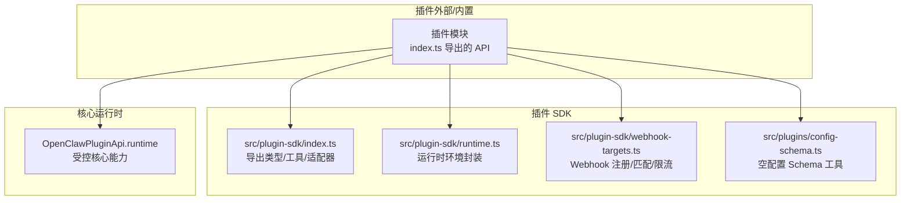
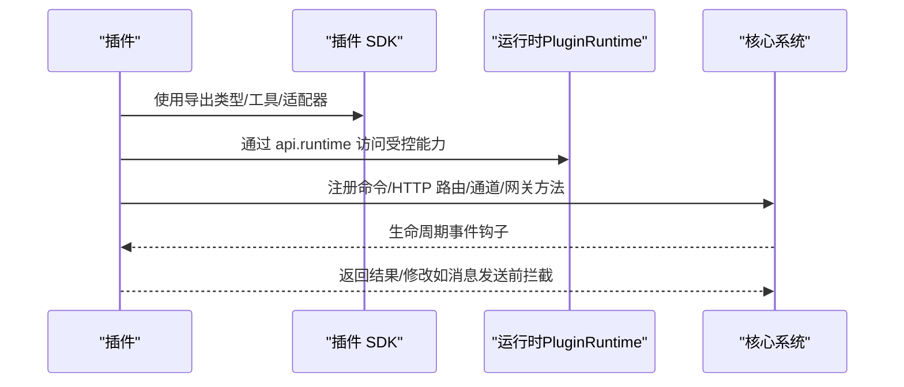
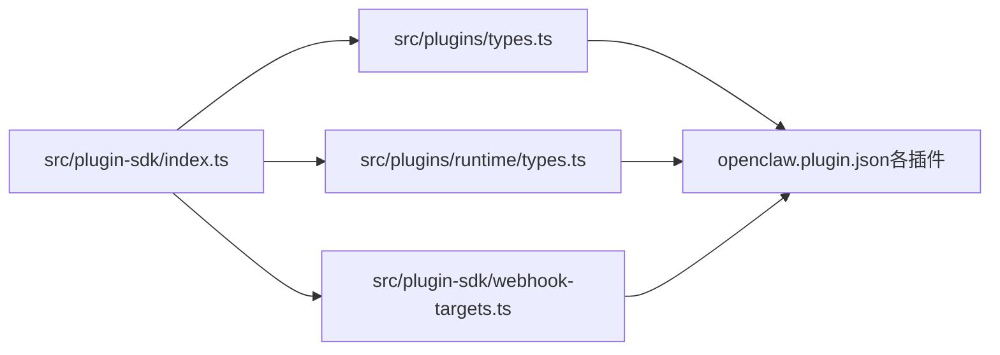

# 插件 SDK

<cite>
**本文引用的文件**
- [index.ts](file://src/plugin-sdk/index.ts)
- [runtime.ts](file://src/plugin-sdk/runtime.ts)
- [types.ts](file://src/plugins/types.ts)
- [types.ts](file://src/plugins/runtime/types.ts)
- [config-schema.ts](file://src/plugins/config-schema.ts)
- [webhook-targets.ts](file://src/plugin-sdk/webhook-targets.ts)
- [plugin-sdk.md](file://docs/refactor/plugin-sdk.md)
- [manifest.md](file://docs/plugins/manifest.md)
- [openclaw.plugin.json（diffs）](file://extensions/diffs/openclaw.plugin.json)
- [openclaw.plugin.json（memory-core）](file://extensions/memory-core/openclaw.plugin.json)
</cite>

## 目录
1. [简介](#简介)
2. [项目结构](#项目结构)
3. [核心组件](#核心组件)
4. [架构总览](#架构总览)
5. [组件详解](#组件详解)
6. [依赖关系分析](#依赖关系分析)
7. [性能考量](#性能考量)
8. [故障排查指南](#故障排查指南)
9. [结论](#结论)
10. [附录](#附录)

## 简介
本文件为 OpenClaw 插件 SDK 的权威参考文档，面向插件开发者与维护者，系统阐述插件开发接口、生命周期、事件与回调机制、接口规范、配置系统、集成方式、发布与分发最佳实践等。文档以仓库中已有的 SDK 类型、运行时接口、配置校验与示例清单为基础，辅以架构重构规划与清单式规范，帮助你快速构建稳定、可维护且可扩展的插件。

## 项目结构
OpenClaw 将“插件 SDK”与“插件运行时”解耦为两层：
- SDK 层：类型、工具函数、配置辅助与通用能力导出，无运行时状态与副作用，便于稳定发布与跨版本兼容。
- 运行时层：通过 OpenClawPluginApi.runtime 暴露对核心行为的受控访问，插件不得直接导入 src/**，必须经由 SDK 或运行时。



图示来源
- [index.ts:1-135](file://src/plugin-sdk/index.ts#L1-L135)
- [runtime.ts:1-45](file://src/plugin-sdk/runtime.ts#L1-L45)
- [webhook-targets.ts:1-100](file://src/plugin-sdk/webhook-targets.ts#L1-L100)
- [config-schema.ts:1-34](file://src/plugins/config-schema.ts#L1-L34)

章节来源
- [plugin-sdk.md:1-215](file://docs/refactor/plugin-sdk.md#L1-L215)

## 核心组件
- 插件 API（OpenClawPluginApi）
  - 提供注册工具、命令、HTTP 路由、通道、网关方法、CLI、服务、提供商、上下文引擎等能力。
  - 提供生命周期钩子 on(...) 注册入口。
- 插件运行时（PluginRuntime）
  - 提供子代理运行、会话查询与删除、通道能力等。
- 配置系统
  - 插件清单 openclaw.plugin.json 必须包含 id 与 configSchema；支持 uiHints、kind、channels、providers、skills 等字段。
  - 内置空配置 Schema 工具用于严格校验。
- Webhook 系统
  - 提供路径归一化、目标注册、单目标解析、鉴权拒绝、请求管线与并发/速率限制等。
- 日志与运行时环境
  - 提供日志记录与退出语义的统一封装。

章节来源
- [types.ts:248-306](file://src/plugins/types.ts#L248-L306)
- [types.ts:51-63](file://src/plugins/runtime/types.ts#L51-L63)
- [config-schema.ts:13-33](file://src/plugins/config-schema.ts#L13-L33)
- [webhook-targets.ts:57-100](file://src/plugin-sdk/webhook-targets.ts#L57-L100)
- [runtime.ts:9-32](file://src/plugin-sdk/runtime.ts#L9-L32)

## 架构总览
下图展示了插件在 SDK 与运行时之间的交互关系，以及与核心系统的集成点（通道、网关、HTTP 路由、配置）：



图示来源
- [index.ts:1-135](file://src/plugin-sdk/index.ts#L1-L135)
- [types.ts:263-306](file://src/plugins/types.ts#L263-L306)
- [types.ts:51-63](file://src/plugins/runtime/types.ts#L51-L63)

## 组件详解

### 插件生命周期与事件钩子
- 生命周期阶段
  - 定义了从模型选择、提示构建、代理执行、工具调用、消息写入、会话开始/结束、子代理派生与回收、网关启动/停止等全链路钩子。
- 钩子注册
  - 通过 OpenClawPluginApi.on(...) 按名称注册处理器，并可指定优先级。
- 典型用途
  - 在提示构建阶段注入静态上下文；在消息发送前进行内容改写或取消；在工具调用前后进行审计或限流；在会话开始/结束时进行资源初始化/清理。

```mermaid
flowchart TD
Start(["开始一次代理回合"]) --> BMR["before_model_resolve"]
BMR --> BPB["before_prompt_build"]
BPB --> BAS["before_agent_start"]
BAS --> LLMI["llm_input"]
LLMI --> LLMO["llm_output"]
LLMO --> TAFT["after_tool_call"]
TAFT --> MSGW["before_message_write"]
MSGW --> SESSS["session_start"]
SESSS --> SUBSP["subagent_spawning"]
SUBSP --> SUBDT["subagent_delivery_target"]
SUBDT --> SUBSD["subagent_spawned"]
SUBSD --> SUBEND["subagent_ended"]
SUBEND --> SE SSE["session_end"]
SSE --> END(["结束"])
```

图示来源
- [types.ts:321-377](file://src/plugins/types.ts#L321-L377)
- [types.ts:787-806](file://src/plugins/types.ts#L787-L806)

章节来源
- [types.ts:321-377](file://src/plugins/types.ts#L321-L377)
- [types.ts:787-806](file://src/plugins/types.ts#L787-L806)

### 插件接口规范与必需项
- 插件定义（OpenClawPluginDefinition）
  - 可选字段：id、name、description、version、kind、configSchema、register、activate。
  - register/activate 接收 OpenClawPluginApi 并返回 Promise 支持异步初始化。
- OpenClawPluginApi
  - 注册类：registerTool、registerHook、registerHttpRoute、registerChannel、registerGatewayMethod、registerCli、registerService、registerProvider、registerCommand、registerContextEngine。
  - 查询与工具：resolvePath、on（生命周期钩子）。
- 插件模块形态
  - 可为对象或函数式定义，函数式形式直接接收 api 执行注册。

章节来源
- [types.ts:248-306](file://src/plugins/types.ts#L248-L306)
- [types.ts:263-306](file://src/plugins/types.ts#L263-L306)

### 回调与事件数据结构
- Agent/会话/工具/消息/子代理/网关等事件均有对应的事件体与可选结果类型，允许插件在回调中返回修改或阻断指令。
- 示例要点
  - before_prompt_build：可修改系统提示、前置/后置上下文。
  - message_sending：可修改内容或取消发送。
  - before_tool_call：可修改参数或阻断调用。
  - tool_result_persist：可精简写入会话的消息内容。
  - session_start/end：用于资源生命周期管理。
  - subagent_*：用于派生/投递/回收的可观测与可干预。

章节来源
- [types.ts:422-442](file://src/plugins/types.ts#L422-L442)
- [types.ts:573-583](file://src/plugins/types.ts#L573-L583)
- [types.ts:606-620](file://src/plugins/types.ts#L606-L620)
- [types.ts:635-657](file://src/plugins/types.ts#L635-L657)
- [types.ts:678-691](file://src/plugins/types.ts#L678-L691)
- [types.ts:716-727](file://src/plugins/types.ts#L716-L727)

### 插件配置系统
- 清单要求
  - 必填：id、configSchema（JSON Schema）。
  - 可选：kind、channels、providers、skills、name、description、uiHints、version。
- 配置校验
  - 通过 emptyPluginConfigSchema 可生成严格空配置校验器；所有插件需在安装/加载阶段完成清单与 Schema 校验。
- UI 提示
  - uiHints 支持标签、高级选项、敏感字段、占位符等，用于 UI 呈现与引导。
- 动态更新机制
  - 通过 OpenClawPluginApi.runtime 访问受控能力，结合配置变更触发重载或热更新（具体行为由插件实现与核心策略共同决定）。

章节来源
- [manifest.md:11-76](file://docs/plugins/manifest.md#L11-L76)
- [config-schema.ts:13-33](file://src/plugins/config-schema.ts#L13-L33)
- [openclaw.plugin.json（diffs）:1-183](file://extensions/diffs/openclaw.plugin.json#L1-L183)
- [openclaw.plugin.json（memory-core）:1-10](file://extensions/memory-core/openclaw.plugin.json#L1-L10)

### 插件与核心系统的集成
- 消息路由
  - 通过通道适配器与目录条目定义路由规则；插件可通过注册通道与目录能力参与路由决策。
- 权限控制
  - 通过组策略、允许列表、提及要求等策略在运行时解析与应用。
- 资源访问
  - 仅能通过 api.runtime 暴露的能力访问核心资源，避免直接导入 src/**。
- 网关与 HTTP
  - 通过 registerGatewayMethod 与 registerHttpRoute 注册方法与路由；Webhook 子系统提供路径归一化、鉴权、限流与并发控制。

章节来源
- [index.ts:1-135](file://src/plugin-sdk/index.ts#L1-L135)
- [webhook-targets.ts:102-162](file://src/plugin-sdk/webhook-targets.ts#L102-L162)

### 插件开发指南（结构、构建与测试）
- 项目结构
  - 插件根目录放置 openclaw.plugin.json；可包含 skills 目录；遵循清单字段与 Schema 规范。
- 构建流程
  - 严格遵守 SDK 与运行时约束，避免直接导入核心源码；使用 SDK 导出的类型与工具。
- 测试策略
  - 单元测试覆盖适配器与运行时函数；金标准测试确保路由、配对、允许列表、提及门禁等行为不漂移；CI 包含安装+运行+冒烟测试。

章节来源
- [plugin-sdk.md:153-215](file://docs/refactor/plugin-sdk.md#L153-L215)

### 具体插件示例
- diffs 插件
  - 展示了丰富的 uiHints 与复杂 configSchema（defaults 与 security 两段），体现配置项组织与 UI 呈现。
- memory-core 插件
  - 最小化示例，kind 为 memory，configSchema 为空对象，演示最小可用清单。

章节来源
- [openclaw.plugin.json（diffs）:1-183](file://extensions/diffs/openclaw.plugin.json#L1-L183)
- [openclaw.plugin.json（memory-core）:1-10](file://extensions/memory-core/openclaw.plugin.json#L1-L10)

### 发布与分发最佳实践
- 版本管理
  - SDK 采用语义化版本；运行时随核心版本发布；插件声明所需运行时范围。
- 兼容性检查
  - 通过 SDK 与运行时版本兼容性检查，确保插件在不同核心版本下的稳定性。
- 安全考虑
  - Webhook 请求管线包含速率限制、并发限制、内容类型校验与拒绝策略；建议插件在鉴权与输入校验上遵循 SDK 提供的守卫与工具。

章节来源
- [plugin-sdk.md:188-193](file://docs/refactor/plugin-sdk.md#L188-L193)
- [webhook-targets.ts:115-162](file://src/plugin-sdk/webhook-targets.ts#L115-L162)

## 依赖关系分析
- 插件对 SDK 的依赖
  - 通过 src/plugin-sdk/index.ts 导出的类型与工具进行开发，避免直接依赖核心实现。
- 插件对运行时的依赖
  - 通过 OpenClawPluginApi.runtime 获取受控核心能力，保证隔离与可替换性。
- Webhook 子系统
  - 与 HTTP 路由注册、鉴权、限流与并发控制紧密耦合，形成稳定的入口面。



图示来源
- [index.ts:1-135](file://src/plugin-sdk/index.ts#L1-L135)
- [types.ts:248-306](file://src/plugins/types.ts#L248-L306)
- [types.ts:51-63](file://src/plugins/runtime/types.ts#L51-L63)
- [webhook-targets.ts:1-100](file://src/plugin-sdk/webhook-targets.ts#L1-L100)

章节来源
- [index.ts:1-135](file://src/plugin-sdk/index.ts#L1-L135)
- [types.ts:248-306](file://src/plugins/types.ts#L248-L306)
- [types.ts:51-63](file://src/plugins/runtime/types.ts#L51-L63)
- [webhook-targets.ts:1-100](file://src/plugin-sdk/webhook-targets.ts#L1-L100)

## 性能考量
- 钩子链路
  - 在提示构建与工具调用前后插入逻辑应尽量轻量，避免阻塞主回合并影响延迟。
- Webhook 管线
  - 合理设置速率限制与并发上限，避免对下游造成压力；必要时启用按路径/客户端键的限流。
- 子代理运行
  - 使用 api.runtime.subagent.run/wait/getSession/deleteSession 时注意幂等键与超时设置，防止资源泄漏。

## 故障排查指南
- 配置错误
  - 清单缺失或 Schema 不符合要求会导致验证失败；检查 openclaw.plugin.json 的 id 与 configSchema 字段。
- Webhook 未命中
  - 确认路径归一化与目标注册是否正确；使用 resolveWebhookTargets 与 resolveSingleWebhookTarget 辅助定位。
- 鉴权失败
  - 使用 resolveWebhookTargetWithAuthOrReject 或 resolveWebhookTargetWithAuthOrRejectSync 进行同步/异步匹配与拒绝响应。
- 速率/并发限制
  - 检查 FixedWindowRateLimiter 与 WebhookInFlightLimiter 的配置与键生成策略。

章节来源
- [manifest.md:53-62](file://docs/plugins/manifest.md#L53-L62)
- [webhook-targets.ts:102-162](file://src/plugin-sdk/webhook-targets.ts#L102-L162)
- [webhook-targets.ts:222-271](file://src/plugin-sdk/webhook-targets.ts#L222-L271)

## 结论
OpenClaw 插件 SDK 以“稳定 SDK + 受控运行时”的双层架构，为插件提供了清晰的开发边界与强大的扩展能力。通过严格的清单与配置 Schema、完善的钩子体系与 Webhook 管线，插件可以在不侵入核心的前提下实现灵活的功能定制与安全可控的运行。建议在开发中遵循 SDK 导出的类型与工具，使用运行时提供的受控能力，并结合清单与 Schema 确保配置正确性与可维护性。

## 附录
- 关键导出与类型参考
  - SDK 导出：见 src/plugin-sdk/index.ts 中的类型与工具导出清单。
  - 运行时类型：见 src/plugins/runtime/types.ts 的 PluginRuntime 子集。
  - 配置 Schema：见 src/plugins/config-schema.ts 的空配置工具与 JSON Schema 要求。
  - Webhook：见 src/plugin-sdk/webhook-targets.ts 的注册、匹配与管线工具。
- 清单与规范
  - 插件清单与 JSON Schema 要求：见 docs/plugins/manifest.md。
  - SDK 与运行时重构规划：见 docs/refactor/plugin-sdk.md。