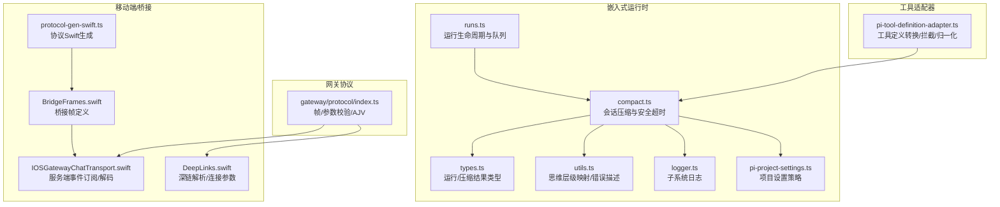
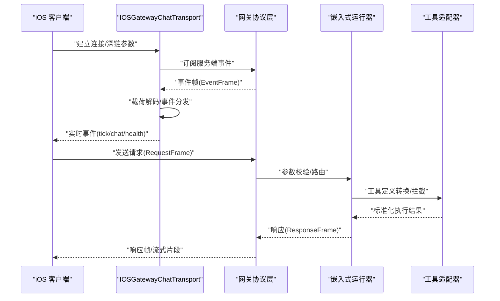
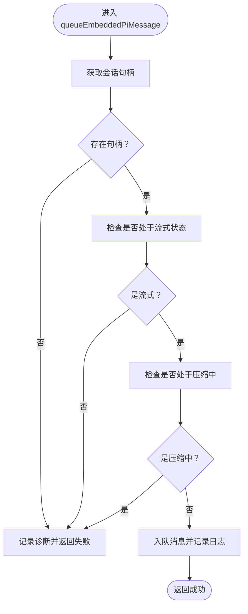
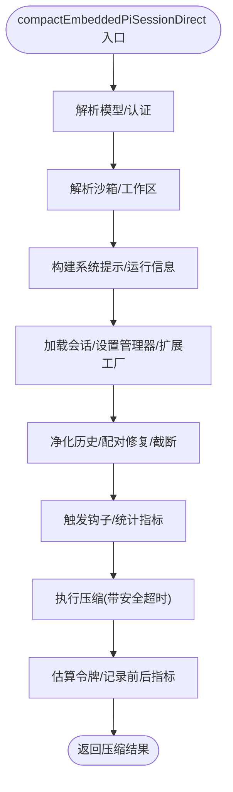
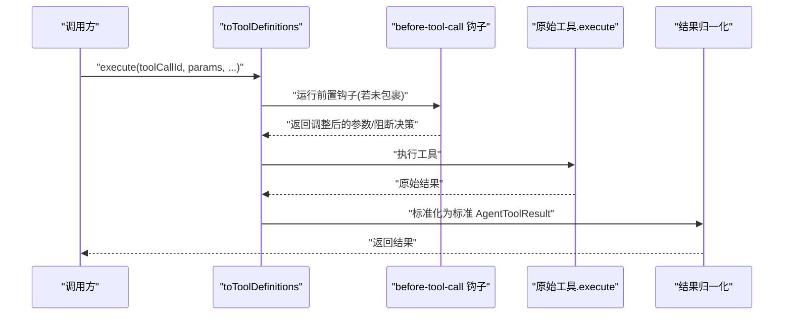
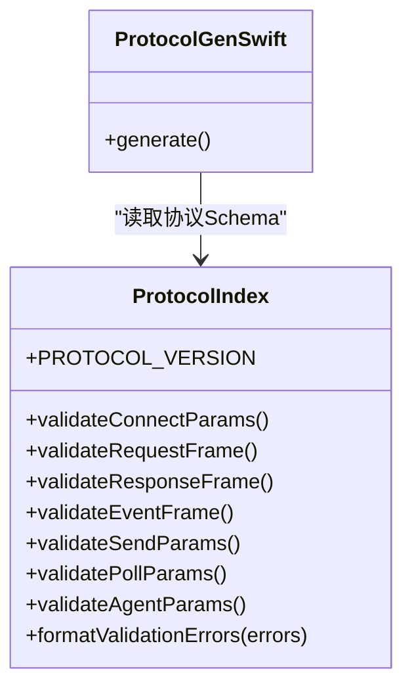
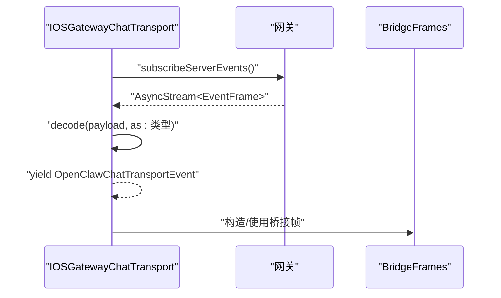
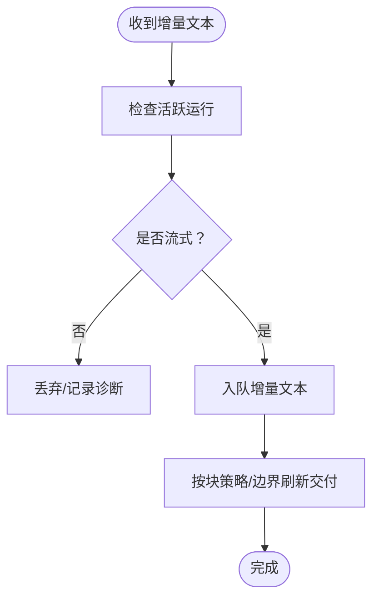
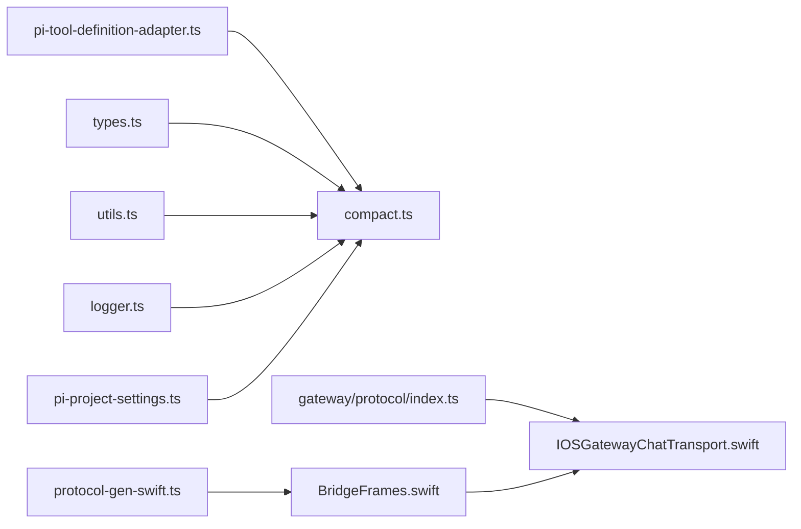

# Pi Agent 运行时

<cite>
**本文引用的文件**
- [src/agents/pi-embedded-runner/runs.ts](file://src/agents/pi-embedded-runner/runs.ts)
- [src/agents/pi-embedded-runner/compact.ts](file://src/agents/pi-embedded-runner/compact.ts)
- [src/agents/pi-embedded-runner/types.ts](file://src/agents/pi-embedded-runner/types.ts)
- [src/agents/pi-embedded-runner/logger.ts](file://src/agents/pi-embedded-runner/logger.ts)
- [src/agents/pi-embedded-runner/utils.ts](file://src/agents/pi-embedded-runner/utils.ts)
- [src/agents/pi-tool-definition-adapter.ts](file://src/agents/pi-tool-definition-adapter.ts)
- [src/agents/pi-embedded.ts](file://src/agents/pi-embedded.ts)
- [src/gateway/protocol/index.ts](file://src/gateway/protocol/index.ts)
- [apps/ios/Sources/Chat/IOSGatewayChatTransport.swift](file://apps/ios/Sources/Chat/IOSGatewayChatTransport.swift)
- [apps/shared/OpenClawKit/Sources/OpenClawKit/DeepLinks.swift](file://apps/shared/OpenClawKit/Sources/OpenClawKit/DeepLinks.swift)
- [src/agents/pi-project-settings.ts](file://src/agents/pi-project-settings.ts)
- [src/auto-reply/reply/block-streaming.ts](file://src/auto-reply/reply/block-streaming.ts)
- [src/auto-reply/reply/reply-utils.test.ts](file://src/auto-reply/reply/reply-utils.test.ts)
- [src/agents/openai-ws-stream.test.ts](file://src/agents/openai-ws-stream.test.ts)
- [scripts/protocol-gen-swift.ts](file://scripts/protocol-gen-swift.ts)
- [apps/shared/OpenClawKit/Sources/OpenClawKit/BridgeFrames.swift](file://apps/shared/OpenClawKit/Sources/OpenClawKit/BridgeFrames.swift)
- [docs/gateway/bridge-protocol.md](file://docs/gateway/bridge-protocol.md)
</cite>

## 目录
1. [简介](#简介)
2. [项目结构](#项目结构)
3. [核心组件](#核心组件)
4. [架构总览](#架构总览)
5. [详细组件分析](#详细组件分析)
6. [依赖关系分析](#依赖关系分析)
7. [性能考量](#性能考量)
8. [故障排查指南](#故障排查指南)
9. [结论](#结论)
10. [附录](#附录)

## 简介
本文件面向 Pi Agent 嵌入式运行时，系统性阐述其在 OpenClaw 生态中的实现与集成方式，重点覆盖以下方面：
- 与 Pi 设备/客户端的通信协议与帧模型
- 消息序列化与反序列化校验机制
- 代理订阅与事件流（含块流式传输与实时消息）
- 代理负载处理（请求构建、参数校验、响应解析）
- 工具适配器（工具定义转换、调用拦截、结果归一化）
- 集成最佳实践（错误处理、超时管理、资源清理）

## 项目结构
Pi Agent 运行时由“嵌入式运行器”“工具适配器”“网关协议层”“移动端/桥接层”等模块协同构成。下图给出与本文相关的高层结构映射。

**图表来源**
- [src/agents/pi-embedded-runner/runs.ts:1-252](file://src/agents/pi-embedded-runner/runs.ts#L1-L252)
- [src/agents/pi-embedded-runner/compact.ts:1-967](file://src/agents/pi-embedded-runner/compact.ts#L1-L967)
- [src/agents/pi-embedded-runner/types.ts:1-106](file://src/agents/pi-embedded-runner/types.ts#L1-L106)
- [src/agents/pi-embedded-runner/utils.ts:1-35](file://src/agents/pi-embedded-runner/utils.ts#L1-L35)
- [src/agents/pi-embedded-runner/logger.ts:1-4](file://src/agents/pi-embedded-runner/logger.ts#L1-L4)
- [src/agents/pi-tool-definition-adapter.ts:1-237](file://src/agents/pi-tool-definition-adapter.ts#L1-L237)
- [src/gateway/protocol/index.ts:1-673](file://src/gateway/protocol/index.ts#L1-L673)
- [apps/ios/Sources/Chat/IOSGatewayChatTransport.swift:98-124](file://apps/ios/Sources/Chat/IOSGatewayChatTransport.swift#L98-L124)
- [apps/shared/OpenClawKit/Sources/OpenClawKit/DeepLinks.swift:37-69](file://apps/shared/OpenClawKit/Sources/OpenClawKit/DeepLinks.swift#L37-L69)
- [apps/shared/OpenClawKit/Sources/OpenClawKit/BridgeFrames.swift:140-191](file://apps/shared/OpenClawKit/Sources/OpenClawKit/BridgeFrames.swift#L140-L191)
- [scripts/protocol-gen-swift.ts:203-247](file://scripts/protocol-gen-swift.ts#L203-L247)

**章节来源**
- [src/agents/pi-embedded-runner/runs.ts:1-252](file://src/agents/pi-embedded-runner/runs.ts#L1-L252)
- [src/agents/pi-embedded-runner/compact.ts:1-967](file://src/agents/pi-embedded-runner/compact.ts#L1-L967)
- [src/agents/pi-tool-definition-adapter.ts:1-237](file://src/agents/pi-tool-definition-adapter.ts#L1-L237)
- [src/gateway/protocol/index.ts:1-673](file://src/gateway/protocol/index.ts#L1-L673)

## 核心组件
- 嵌入式运行生命周期与队列：维护活跃运行、消息排队、中止控制、等待结束等能力。
- 会话压缩与安全超时：在受控上下文中执行压缩，限制超时并记录诊断指标。
- 类型与元数据：统一运行/压缩结果的数据契约，便于上层消费。
- 工具适配器：将外部工具定义转换为内部可执行的 ToolDefinition，并支持拦截与结果归一化。
- 网关协议与校验：基于 AJV 的参数/帧校验，保障通信一致性。
- 移动端/桥接层：订阅服务端事件、解码载荷、解析深链连接参数。

**章节来源**
- [src/agents/pi-embedded-runner/runs.ts:1-252](file://src/agents/pi-embedded-runner/runs.ts#L1-L252)
- [src/agents/pi-embedded-runner/compact.ts:263-800](file://src/agents/pi-embedded-runner/compact.ts#L263-L800)
- [src/agents/pi-embedded-runner/types.ts:1-106](file://src/agents/pi-embedded-runner/types.ts#L1-L106)
- [src/agents/pi-tool-definition-adapter.ts:137-236](file://src/agents/pi-tool-definition-adapter.ts#L137-L236)
- [src/gateway/protocol/index.ts:259-458](file://src/gateway/protocol/index.ts#L259-L458)

## 架构总览
下图展示从移动端到网关再到嵌入式运行时的整体交互路径，以及关键的序列化/反序列化与事件订阅点。

**图表来源**
- [apps/ios/Sources/Chat/IOSGatewayChatTransport.swift:98-124](file://apps/ios/Sources/Chat/IOSGatewayChatTransport.swift#L98-L124)
- [src/gateway/protocol/index.ts:259-458](file://src/gateway/protocol/index.ts#L259-L458)
- [src/agents/pi-tool-definition-adapter.ts:137-236](file://src/agents/pi-tool-definition-adapter.ts#L137-L236)
- [src/agents/pi-embedded-runner/runs.ts:21-38](file://src/agents/pi-embedded-runner/runs.ts#L21-L38)

## 详细组件分析

### 嵌入式运行生命周期与消息队列
- 运行注册与状态变更：通过全局映射维护活跃运行，记录开始/替换/完成等状态。
- 消息排队：仅在“正在流式”且非“压缩中”时允许排队；失败时记录诊断日志。
- 中止控制：支持按会话或模式（全部/仅压缩中）批量中止。
- 结束等待：为重启/资源回收提供等待机制，带超时与轮询策略。

**图表来源**
- [src/agents/pi-embedded-runner/runs.ts:21-38](file://src/agents/pi-embedded-runner/runs.ts#L21-L38)

**章节来源**
- [src/agents/pi-embedded-runner/runs.ts:1-252](file://src/agents/pi-embedded-runner/runs.ts#L1-L252)

### 会话压缩与安全超时
- 模型与认证：优先使用配置覆盖，切换提供商时丢弃主认证以避免凭证错配。
- 上下文与沙箱：根据会话键解析沙箱工作区，确保会话头存在。
- 工具与策略：收集允许工具名、清理 Google 工具限制、注入通道动作与提示。
- 压缩流程：应用历史截断与配对修复，触发压缩并记录前后指标，暴露安全超时包装。
- 钩子与诊断：触发内部钩子与全局钩子，输出预/后指标，分类压缩失败原因。

**图表来源**
- [src/agents/pi-embedded-runner/compact.ts:263-800](file://src/agents/pi-embedded-runner/compact.ts#L263-L800)

**章节来源**
- [src/agents/pi-embedded-runner/compact.ts:1-967](file://src/agents/pi-embedded-runner/compact.ts#L1-L967)

### 类型与元数据契约
- 运行元数据：包含会话标识、提供商/模型、用量、停止原因、待处理工具调用等。
- 压缩结果：布尔成功标志、是否发生压缩、摘要与令牌变化等。
- 沙箱信息：启用状态、工作区挂载、容器路径、浏览器桥接地址、提权策略等。

**章节来源**
- [src/agents/pi-embedded-runner/types.ts:1-106](file://src/agents/pi-embedded-runner/types.ts#L1-L106)

### 工具适配器：定义转换、拦截与结果处理
- 定义转换：将外部 AgentTool 转换为 ToolDefinition，自动规范化名称与描述。
- 调用拦截：在未被包裹前置钩子时，先运行 before-tool-call 钩子，支持参数调整与阻断。
- 执行与归一化：捕获异常并转化为标准 AgentToolResult，文本内容统一为数组形式，保留细节字段。
- 客户端工具：对客户端托管工具返回“待定”结果，交由客户端执行并回调通知。

**图表来源**
- [src/agents/pi-tool-definition-adapter.ts:137-194](file://src/agents/pi-tool-definition-adapter.ts#L137-L194)

**章节来源**
- [src/agents/pi-tool-definition-adapter.ts:1-237](file://src/agents/pi-tool-definition-adapter.ts#L1-L237)

### 网关协议与消息序列化/反序列化
- 参数/帧校验：使用 AJV 编译各 Schema，提供统一的校验函数与错误格式化。
- 协议版本：通过常量导出协议版本，用于版本协商与兼容性判断。
- Swift 协议生成：自动生成桥接层使用的枚举与结构体，保证跨语言一致性。

**图表来源**
- [src/gateway/protocol/index.ts:259-458](file://src/gateway/protocol/index.ts#L259-L458)
- [scripts/protocol-gen-swift.ts:203-247](file://scripts/protocol-gen-swift.ts#L203-L247)

**章节来源**
- [src/gateway/protocol/index.ts:1-673](file://src/gateway/protocol/index.ts#L1-L673)
- [scripts/protocol-gen-swift.ts:203-247](file://scripts/protocol-gen-swift.ts#L203-L247)

### 移动端/桥接层：事件订阅与深链解析
- 事件订阅：在 iOS 中订阅网关服务端事件，按事件类型解码并产出异步流事件（心跳、序列间隙、健康、聊天等）。
- 深链解析：解析 ws/wss 深链，支持本地回环主机与 TLS 校验，提取 token/password 等连接参数。
- 桥接帧：定义桥接层帧结构（如 pair-request/pair-ok/ping 等），供 Swift 侧使用。

**图表来源**
- [apps/ios/Sources/Chat/IOSGatewayChatTransport.swift:98-124](file://apps/ios/Sources/Chat/IOSGatewayChatTransport.swift#L98-L124)
- [apps/shared/OpenClawKit/Sources/OpenClawKit/BridgeFrames.swift:140-191](file://apps/shared/OpenClawKit/Sources/OpenClawKit/BridgeFrames.swift#L140-L191)

**章节来源**
- [apps/ios/Sources/Chat/IOSGatewayChatTransport.swift:98-124](file://apps/ios/Sources/Chat/IOSGatewayChatTransport.swift#L98-L124)
- [apps/shared/OpenClawKit/Sources/OpenClawKit/DeepLinks.swift:37-69](file://apps/shared/OpenClawKit/Sources/OpenClawKit/DeepLinks.swift#L37-L69)
- [apps/shared/OpenClawKit/Sources/OpenClawKit/BridgeFrames.swift:140-191](file://apps/shared/OpenClawKit/Sources/OpenClawKit/BridgeFrames.swift#L140-L191)
- [docs/gateway/bridge-protocol.md:88-92](file://docs/gateway/bridge-protocol.md#L88-L92)

### 代理订阅机制与流式响应
- 流式响应处理：通过 runs.ts 的队列接口在运行期间接收增量文本，结合 isStreaming/isCompacting 判定。
- 块流式传输：根据通道能力与配置决定块大小与换行段落边界刷新策略，确保段落级交付。
- 实时消息传递：移动端订阅事件流，按事件类型解码并转发至 UI 层。

**图表来源**
- [src/agents/pi-embedded-runner/runs.ts:21-38](file://src/agents/pi-embedded-runner/runs.ts#L21-L38)
- [src/auto-reply/reply/block-streaming.ts:152-171](file://src/auto-reply/reply/block-streaming.ts#L152-L171)

**章节来源**
- [src/agents/pi-embedded-runner/runs.ts:1-252](file://src/agents/pi-embedded-runner/runs.ts#L1-L252)
- [src/auto-reply/reply/block-streaming.ts:152-171](file://src/auto-reply/reply/block-streaming.ts#L152-L171)
- [src/auto-reply/reply/reply-utils.test.ts:746-779](file://src/auto-reply/reply/reply-utils.test.ts#L746-L779)

### 代理负载处理：请求构建、参数验证与响应解析
- 请求构建：在运行前构建系统提示、运行信息、渠道动作与消息工具提示，注入时间、技能、文档等上下文。
- 参数验证：使用 AJV 对连接、请求、事件、发送、轮询、代理等参数进行编译校验，统一错误格式化。
- 响应解析：在移动端按事件类型解码并产出事件对象，支持心跳、健康、聊天等。

**章节来源**
- [src/agents/pi-embedded-runner/compact.ts:549-577](file://src/agents/pi-embedded-runner/compact.ts#L549-L577)
- [src/gateway/protocol/index.ts:259-458](file://src/gateway/protocol/index.ts#L259-L458)
- [apps/ios/Sources/Chat/IOSGatewayChatTransport.swift:98-124](file://apps/ios/Sources/Chat/IOSGatewayChatTransport.swift#L98-L124)

### 代理助手工具适配器：定义转换、调用拦截与结果处理
- 工具定义转换：将 AgentTool 转为 ToolDefinition，自动规范化名称与参数。
- 调用拦截：在未被包裹前置钩子时，运行 before-tool-call 钩子，支持参数调整与阻断。
- 结果处理：捕获异常并转化为标准 AgentToolResult，文本内容统一为数组形式，保留细节字段。
- 客户端工具：对客户端托管工具返回“待定”结果，交由客户端执行并回调通知。

**章节来源**
- [src/agents/pi-tool-definition-adapter.ts:137-236](file://src/agents/pi-tool-definition-adapter.ts#L137-L236)

### Pi Agent 集成最佳实践
- 错误处理：统一使用 describeUnknownError 将未知错误序列化为字符串；工具执行异常转为标准结果并记录调试/错误日志。
- 超时管理：压缩流程使用安全超时包装，等待运行结束提供超时与轮询参数，避免阻塞重启。
- 资源清理：在重启前等待活跃运行清空，释放会话写锁；项目设置策略支持“忽略/净化/信任”，防止工作区设置破坏执行行为。

**章节来源**
- [src/agents/pi-embedded-runner/utils.ts:19-32](file://src/agents/pi-embedded-runner/utils.ts#L19-L32)
- [src/agents/pi-embedded-runner/runs.ts:132-154](file://src/agents/pi-embedded-runner/runs.ts#L132-L154)
- [src/agents/pi-project-settings.ts:22-44](file://src/agents/pi-project-settings.ts#L22-L44)

## 依赖关系分析
- 运行器依赖：工具适配器提供执行入口；类型契约统一结果结构；日志与工具函数提供诊断与辅助。
- 协议层依赖：AJV 校验与协议生成脚本确保跨语言一致性；移动端/桥接层依赖协议定义。
- 集成依赖：移动端通过订阅事件与深链参数接入网关；运行器通过沙箱与项目设置策略隔离工作区影响。

**图表来源**
- [src/agents/pi-tool-definition-adapter.ts:1-237](file://src/agents/pi-tool-definition-adapter.ts#L1-L237)
- [src/agents/pi-embedded-runner/compact.ts:1-967](file://src/agents/pi-embedded-runner/compact.ts#L1-L967)
- [src/agents/pi-embedded-runner/types.ts:1-106](file://src/agents/pi-embedded-runner/types.ts#L1-L106)
- [src/agents/pi-embedded-runner/utils.ts:1-35](file://src/agents/pi-embedded-runner/utils.ts#L1-L35)
- [src/agents/pi-embedded-runner/logger.ts:1-4](file://src/agents/pi-embedded-runner/logger.ts#L1-L4)
- [src/agents/pi-project-settings.ts:1-75](file://src/agents/pi-project-settings.ts#L1-L75)
- [src/gateway/protocol/index.ts:1-673](file://src/gateway/protocol/index.ts#L1-L673)
- [apps/ios/Sources/Chat/IOSGatewayChatTransport.swift:98-124](file://apps/ios/Sources/Chat/IOSGatewayChatTransport.swift#L98-L124)
- [apps/shared/OpenClawKit/Sources/OpenClawKit/BridgeFrames.swift:140-191](file://apps/shared/OpenClawKit/Sources/OpenClawKit/BridgeFrames.swift#L140-L191)
- [scripts/protocol-gen-swift.ts:203-247](file://scripts/protocol-gen-swift.ts#L203-L247)

**章节来源**
- [src/agents/pi-tool-definition-adapter.ts:1-237](file://src/agents/pi-tool-definition-adapter.ts#L1-L237)
- [src/agents/pi-embedded-runner/compact.ts:1-967](file://src/agents/pi-embedded-runner/compact.ts#L1-L967)
- [src/gateway/protocol/index.ts:1-673](file://src/gateway/protocol/index.ts#L1-L673)

## 性能考量
- 压缩与令牌估计：在压缩前后分别统计消息数量、字符数与令牌数，帮助评估上下文缩减效果。
- 历史截断与配对修复：在截断后重新修复 tool_use/tool_result 配对，减少无效消息带来的重复计算。
- 块流式传输：按段落边界刷新，降低长文本一次性交付的压力，提升端到端体验。
- 超时与重试：压缩流程采用安全超时，等待结束提供轮询与超时参数，避免长时间阻塞。

[本节为通用指导，无需列出具体文件来源]

## 故障排查指南
- 运行队列失败：检查 isStreaming/isCompacting 状态，确认无并发冲突；查看诊断日志定位原因。
- 压缩失败：关注失败原因分类（如超时、4xx/5xx、保护阻断等），核对模型/密钥与上下文窗口配置。
- 工具执行异常：查看工具返回结果是否符合标准 AgentToolResult；异常会被捕获并转为“error”结果。
- 事件解码失败：核对事件类型与载荷结构，确保使用正确的解码目标类型。
- 深链参数：确认 scheme、TLS、host/port 与 token/password 的合法性。

**章节来源**
- [src/agents/pi-embedded-runner/runs.ts:21-38](file://src/agents/pi-embedded-runner/runs.ts#L21-L38)
- [src/agents/pi-embedded-runner/compact.ts:259-257](file://src/agents/pi-embedded-runner/compact.ts#L259-L257)
- [src/agents/pi-tool-definition-adapter.ts:168-190](file://src/agents/pi-tool-definition-adapter.ts#L168-L190)
- [apps/ios/Sources/Chat/IOSGatewayChatTransport.swift:115-122](file://apps/ios/Sources/Chat/IOSGatewayChatTransport.swift#L115-L122)
- [apps/shared/OpenClawKit/Sources/OpenClawKit/DeepLinks.swift:37-69](file://apps/shared/OpenClawKit/Sources/OpenClawKit/DeepLinks.swift#L37-L69)

## 结论
Pi Agent 嵌入式运行时通过严谨的协议校验、可插拔的工具适配器、安全的会话压缩与完善的运行生命周期管理，实现了在多平台（尤其是移动端）上的稳定与高效集成。配合块流式传输与事件订阅机制，能够满足实时消息传递与流式响应场景的需求。遵循本文的最佳实践，可在错误处理、超时管理与资源清理方面获得更好的稳定性与可观测性。

[本节为总结性内容，无需列出具体文件来源]

## 附录
- 配置项参考
  - 项目设置策略：支持“trusted/ignore/sanitize”，默认“sanitize”，用于控制工作区设置对执行的影响。
  - 压缩模型覆盖：可通过配置覆盖压缩阶段使用的模型/提供商，必要时丢弃主认证以避免凭证错配。
  - 块流式传输：根据通道能力与配置决定块大小与刷新策略，确保段落级交付。
- 示例与测试参考
  - 工具定义转换与拦截：参考工具适配器的单元测试，了解不同工具输入与输出形态。
  - 流式指令累积：参考回复工具测试，了解指令标签在流式过程中的传播与重置行为。
  - WebSocket 流式响应：参考相关测试，了解消息与函数调用的组合输出结构。

**章节来源**
- [src/agents/pi-project-settings.ts:22-44](file://src/agents/pi-project-settings.ts#L22-L44)
- [src/auto-reply/reply/block-streaming.ts:152-171](file://src/auto-reply/reply/block-streaming.ts#L152-L171)
- [src/agents/openai-ws-stream.test.ts:304-380](file://src/agents/openai-ws-stream.test.ts#L304-L380)
- [src/auto-reply/reply/reply-utils.test.ts:746-779](file://src/auto-reply/reply/reply-utils.test.ts#L746-L779)