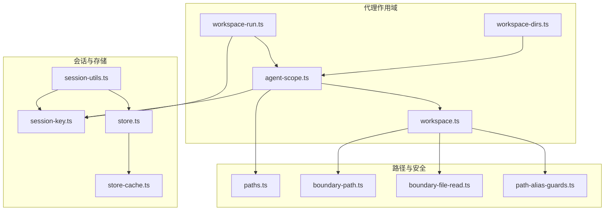
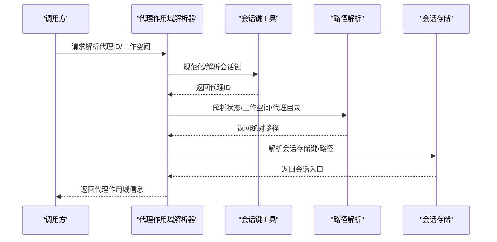
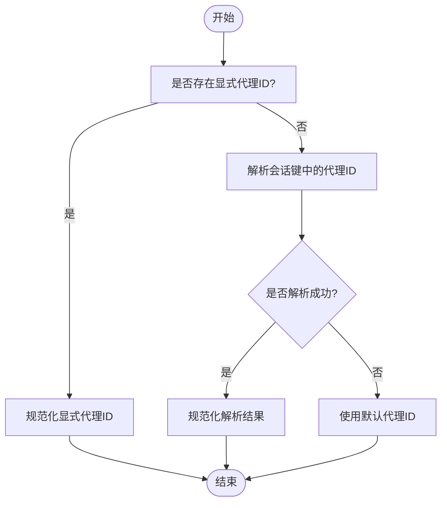
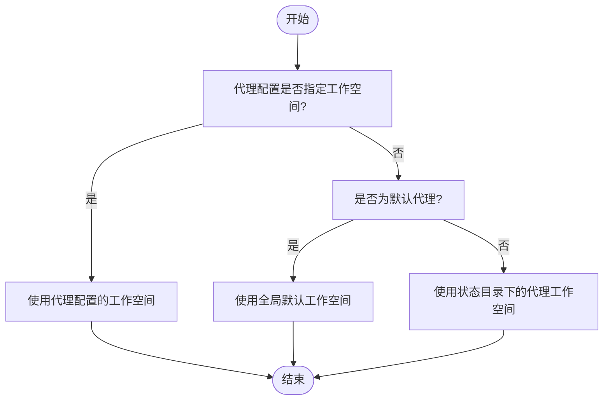
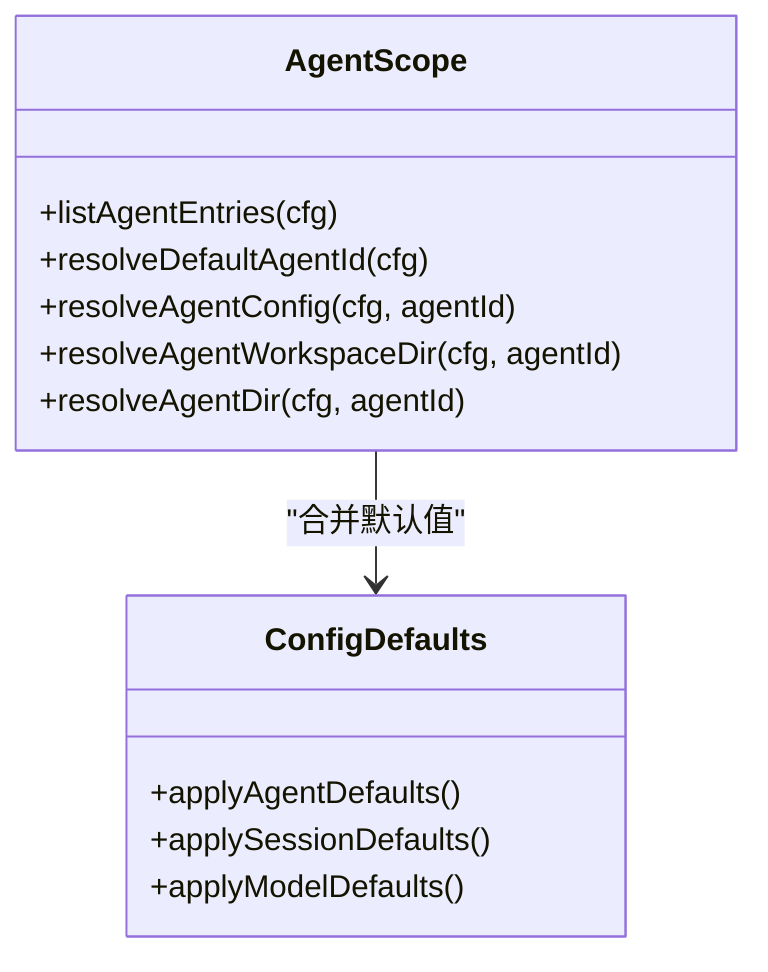
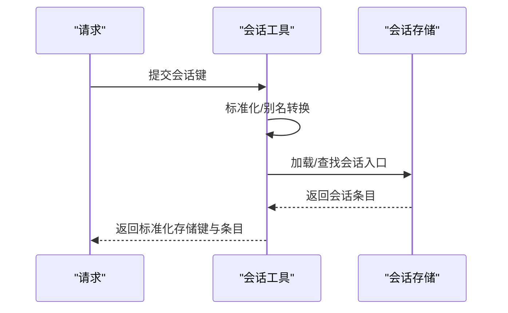
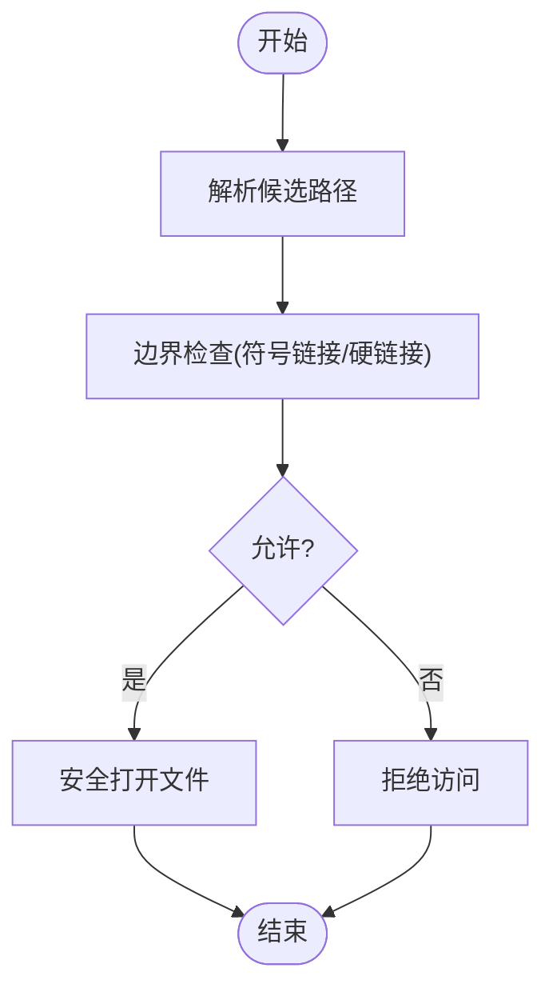
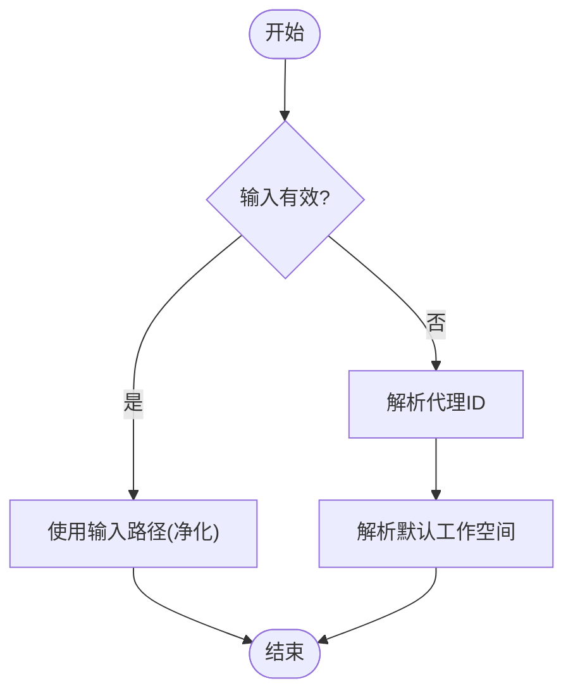
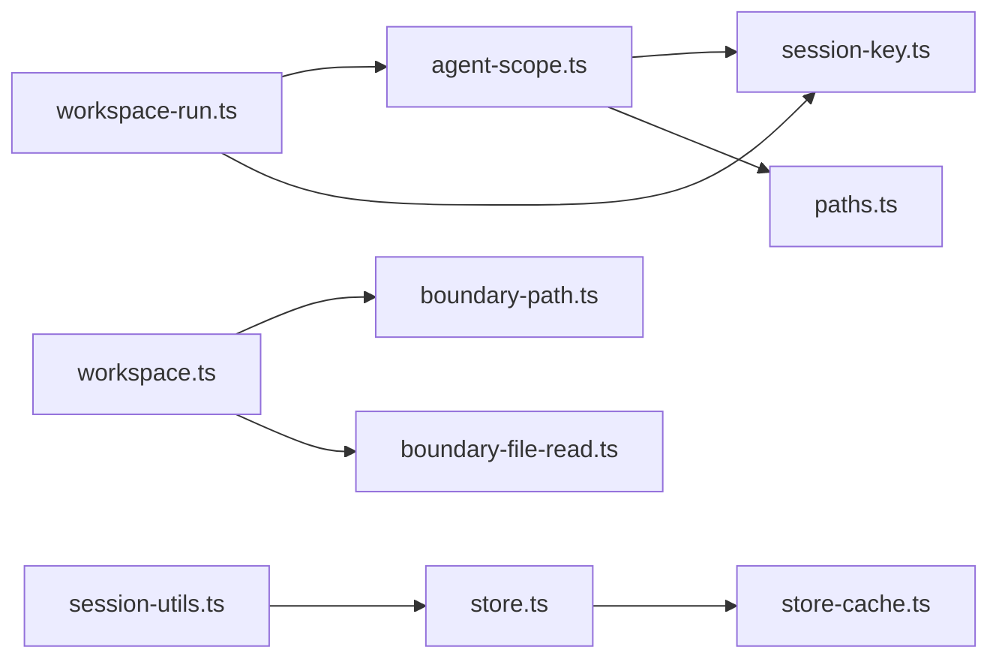

# 代理作用域管理

<cite>
**本文档引用的文件**
- [agent-scope.ts](file://src/agents/agent-scope.ts)
- [workspace-dirs.ts](file://src/agents/workspace-dirs.ts)
- [workspace-run.ts](file://src/agents/workspace-run.ts)
- [workspace.ts](file://src/agents/workspace.ts)
- [session-key.ts](file://src/routing/session-key.ts)
- [paths.ts](file://src/config/paths.ts)
- [session-utils.ts](file://src/gateway/session-utils.ts)
- [agent.ts](file://src/gateway/server-methods/agent.ts)
- [boundary-file-read.ts](file://src/infra/boundary-file-read.ts)
- [boundary-path.ts](file://src/infra/boundary-path.ts)
- [path-alias-guards.ts](file://src/infra/path-alias-guards.ts)
- [store-cache.ts](file://src/config/sessions/store-cache.ts)
- [store.ts](file://src/config/sessions/store.ts)
- [cleanup-utils.ts](file://src/commands/cleanup-utils.ts)
</cite>

## 目录
1. [简介](#简介)
2. [项目结构](#项目结构)
3. [核心组件](#核心组件)
4. [架构总览](#架构总览)
5. [详细组件分析](#详细组件分析)
6. [依赖关系分析](#依赖关系分析)
7. [性能考量](#性能考量)
8. [故障排除指南](#故障排除指南)
9. [结论](#结论)

## 简介
本文件系统性阐述代理作用域管理系统的概念、实现与最佳实践，覆盖以下关键主题：
- 代理标识符解析与规范化：确保代理ID在不同输入形态下统一、安全地归一化。
- 会话键处理与默认代理选择：从会话键中提取或推导代理ID，并在缺失时回退到默认代理。
- 代理路径解析：工作空间目录、代理目录与状态目录的确定规则与优先级。
- 代理配置解析：代理条目验证、配置合并与默认值处理。
- 会话目录管理：会话键到代理ID的映射与会话状态存储。
- 安全考虑：路径规范化、权限检查与资源隔离。
- 最佳实践与故障排除。

## 项目结构
代理作用域管理涉及多个子模块协同工作：
- 代理作用域与配置解析：负责代理ID解析、默认代理选择、工作空间与代理目录解析、配置合并与默认值处理。
- 会话键与会话存储：负责会话键标准化、会话键到代理ID映射、会话存储读写与缓存。
- 路径与安全边界：负责路径规范化、边界检查、符号链接与硬链接防护。
- 工作空间引导与模板：负责工作空间初始化、模板加载与引导文件生成。

**图表来源**
- [agent-scope.ts:1-339](file://src/agents/agent-scope.ts#L1-L339)
- [workspace-dirs.ts:1-17](file://src/agents/workspace-dirs.ts#L1-L17)
- [workspace-run.ts:1-117](file://src/agents/workspace-run.ts#L1-L117)
- [workspace.ts:1-656](file://src/agents/workspace.ts#L1-L656)
- [session-key.ts:1-254](file://src/routing/session-key.ts#L1-L254)
- [session-utils.ts:171-188](file://src/gateway/session-utils.ts#L171-L188)
- [store-cache.ts:1-81](file://src/config/sessions/store-cache.ts#L1-L81)
- [store.ts:256-305](file://src/config/sessions/store.ts#L256-L305)
- [paths.ts:1-285](file://src/config/paths.ts#L1-L285)
- [boundary-path.ts:1-800](file://src/infra/boundary-path.ts#L1-L800)
- [boundary-file-read.ts:1-203](file://src/infra/boundary-file-read.ts#L1-L203)
- [path-alias-guards.ts:1-34](file://src/infra/path-alias-guards.ts#L1-L34)

**章节来源**
- [agent-scope.ts:1-339](file://src/agents/agent-scope.ts#L1-L339)
- [workspace.ts:1-656](file://src/agents/workspace.ts#L1-L656)
- [session-key.ts:1-254](file://src/routing/session-key.ts#L1-L254)
- [paths.ts:1-285](file://src/config/paths.ts#L1-L285)

## 核心组件
- 代理作用域解析器（agent-scope.ts）
  - 解析默认代理ID、代理配置、模型主备策略、工作空间与代理目录解析。
  - 提供会话键到代理ID的解析与规范化能力。
- 运行期工作空间解析（workspace-run.ts）
  - 在运行时根据会话键与显式参数解析最终工作空间路径，支持回退与安全净化。
- 工作空间引导与模板（workspace.ts）
  - 默认工作空间路径解析、引导文件生成、模板加载与安全读取。
- 会话键与存储（session-key.ts, session-utils.ts, store.ts, store-cache.ts）
  - 会话键标准化、别名规范化、会话存储读写与缓存。
- 路径与安全边界（paths.ts, boundary-path.ts, boundary-file-read.ts, path-alias-guards.ts）
  - 状态目录、配置路径解析；路径边界解析、符号链接与硬链接防护；安全文件打开。

**章节来源**
- [agent-scope.ts:72-116](file://src/agents/agent-scope.ts#L72-L116)
- [workspace-run.ts:74-117](file://src/agents/workspace-run.ts#L74-L117)
- [workspace.ts:12-45](file://src/agents/workspace.ts#L12-L45)
- [session-key.ts:73-87](file://src/routing/session-key.ts#L73-L87)
- [session-utils.ts:407-442](file://src/gateway/session-utils.ts#L407-L442)
- [store.ts:256-305](file://src/config/sessions/store.ts#L256-L305)
- [paths.ts:60-89](file://src/config/paths.ts#L60-L89)
- [boundary-path.ts:47-113](file://src/infra/boundary-path.ts#L47-L113)
- [boundary-file-read.ts:142-166](file://src/infra/boundary-file-read.ts#L142-L166)
- [path-alias-guards.ts:12-34](file://src/infra/path-alias-guards.ts#L12-L34)

## 架构总览
代理作用域管理通过“配置解析—会话键处理—路径解析—安全边界—会话存储”的链路协作，实现对多代理、多会话的隔离与一致管理。

**图表来源**
- [agent-scope.ts:86-116](file://src/agents/agent-scope.ts#L86-L116)
- [session-key.ts:73-87](file://src/routing/session-key.ts#L73-L87)
- [paths.ts:60-89](file://src/config/paths.ts#L60-L89)
- [session-utils.ts:407-442](file://src/gateway/session-utils.ts#L407-L442)

## 详细组件分析

### 代理标识符解析与默认代理选择
- 代理ID规范化
  - 支持正则校验与字符替换，确保ID路径安全与Shell友好。
  - 对空或非法输入回退至默认代理ID。
- 默认代理ID选择
  - 若存在多个标记为默认的代理，仅使用首个并记录警告。
  - 当未配置代理列表时，默认代理ID为固定值。
- 会话键到代理ID映射
  - 显式传入的代理ID优先；
  - 否则从会话键解析出代理ID；
  - 再否则使用默认代理ID。

**图表来源**
- [agent-scope.ts:86-116](file://src/agents/agent-scope.ts#L86-L116)
- [session-key.ts:73-87](file://src/routing/session-key.ts#L73-L87)

**章节来源**
- [agent-scope.ts:72-116](file://src/agents/agent-scope.ts#L72-L116)
- [session-key.ts:89-112](file://src/routing/session-key.ts#L89-L112)

### 代理路径解析：工作空间、代理目录与状态目录
- 状态目录解析
  - 优先使用环境变量覆盖；若不存在，则在用户家目录下查找历史与新状态目录；默认指向新状态目录。
- 默认工作空间目录
  - 基于用户配置文件夹与可选的配置文件夹后缀，形成默认工作空间路径。
- 代理工作空间目录解析
  - 优先使用代理配置中的显式工作空间；
  - 其次使用默认代理的全局默认工作空间；
  - 否则在状态目录下按代理ID生成独立工作空间。
- 代理目录解析
  - 优先使用代理配置中的显式代理目录；
  - 否则在状态目录下按代理ID生成标准代理目录。

**图表来源**
- [agent-scope.ts:256-272](file://src/agents/agent-scope.ts#L256-L272)
- [paths.ts:60-89](file://src/config/paths.ts#L60-L89)
- [workspace.ts:12-22](file://src/agents/workspace.ts#L12-L22)

**章节来源**
- [agent-scope.ts:256-338](file://src/agents/agent-scope.ts#L256-L338)
- [paths.ts:60-89](file://src/config/paths.ts#L60-L89)
- [workspace.ts:12-22](file://src/agents/workspace.ts#L12-L22)

### 代理配置解析：条目验证、配置合并与默认值处理
- 代理条目验证
  - 过滤非对象项与缺失ID的条目，确保列表有效性。
- 配置合并与默认值
  - 代理显式配置优先；
  - 模型主备策略与心跳等字段支持显式覆盖或继承全局默认；
  - 多个默认代理标记时发出警告并使用首个。
- 运行期模型回退策略
  - 支持按代理覆盖模型回退列表，或在无会话覆盖时采用全局默认。

**图表来源**
- [agent-scope.ts:46-145](file://src/agents/agent-scope.ts#L46-L145)
- [agent-scope.ts:170-241](file://src/agents/agent-scope.ts#L170-L241)

**章节来源**
- [agent-scope.ts:46-145](file://src/agents/agent-scope.ts#L46-L145)
- [agent-scope.ts:170-241](file://src/agents/agent-scope.ts#L170-L241)

### 会话目录管理：会话键到代理ID映射与会话状态存储
- 会话键标准化
  - 将“main”、“agent:<id>:...”等别名规范化为标准格式；
  - 支持全局/未知别名与主键别名转换。
- 会话存储键解析
  - 将请求的会话键映射为存储键，必要时回退到默认代理；
  - 支持主键别名与全局模式。
- 会话存储读写与缓存
  - 会话存储对象缓存与序列化缓存，支持TTL与元信息一致性校验；
  - 读取时进行迁移与维护操作。

**图表来源**
- [session-utils.ts:407-442](file://src/gateway/session-utils.ts#L407-L442)
- [store-cache.ts:41-81](file://src/config/sessions/store-cache.ts#L41-L81)
- [store.ts:256-305](file://src/config/sessions/store.ts#L256-L305)

**章节来源**
- [session-key.ts:40-87](file://src/routing/session-key.ts#L40-L87)
- [session-utils.ts:392-442](file://src/gateway/session-utils.ts#L392-L442)
- [store-cache.ts:1-81](file://src/config/sessions/store-cache.ts#L1-L81)
- [store.ts:256-305](file://src/config/sessions/store.ts#L256-L305)

### 安全考虑：路径规范化、权限检查与资源隔离
- 路径规范化与边界检查
  - 使用边界路径解析器，严格限制访问范围，防止符号链接逃逸与硬链接滥用；
  - 支持策略化允许最终符号链接/硬链接（如卸载场景）。
- 安全文件读取
  - 打开文件前进行边界验证与类型/大小限制，避免越界与恶意内容。
- 工作空间与代理目录的隔离
  - 通过状态目录与代理ID构建独立命名空间，避免跨代理污染。

**图表来源**
- [boundary-path.ts:47-113](file://src/infra/boundary-path.ts#L47-L113)
- [path-alias-guards.ts:12-34](file://src/infra/path-alias-guards.ts#L12-L34)
- [boundary-file-read.ts:142-166](file://src/infra/boundary-file-read.ts#L142-L166)

**章节来源**
- [boundary-path.ts:47-113](file://src/infra/boundary-path.ts#L47-L113)
- [path-alias-guards.ts:12-34](file://src/infra/path-alias-guards.ts#L12-L34)
- [boundary-file-read.ts:67-166](file://src/infra/boundary-file-read.ts#L67-L166)

### 运行期工作空间解析与回退机制
- 输入优先：显式传入的工作空间路径优先；
- 回退策略：当输入为空/无效时，按代理ID解析默认工作空间；
- 安全净化：对路径进行控制字符净化与用户路径解析，避免注入风险；
- 记录回退原因：缺失、空白或类型错误等。

**图表来源**
- [workspace-run.ts:74-117](file://src/agents/workspace-run.ts#L74-L117)

**章节来源**
- [workspace-run.ts:74-117](file://src/agents/workspace-run.ts#L74-L117)

### 会话目录清理与工作空间目录枚举
- 清理工作空间目录
  - 支持批量删除指定工作空间目录，可Dry Run预演。
- 列举代理会话目录
  - 基于状态目录下的代理工作区，枚举每个代理的sessions子目录。

**章节来源**
- [cleanup-utils.ts:130-153](file://src/commands/cleanup-utils.ts#L130-L153)

## 依赖关系分析

**图表来源**
- [agent-scope.ts:1-339](file://src/agents/agent-scope.ts#L1-L339)
- [session-key.ts:1-254](file://src/routing/session-key.ts#L1-L254)
- [paths.ts:1-285](file://src/config/paths.ts#L1-L285)
- [workspace-run.ts:1-117](file://src/agents/workspace-run.ts#L1-L117)
- [workspace.ts:1-656](file://src/agents/workspace.ts#L1-L656)
- [boundary-path.ts:1-800](file://src/infra/boundary-path.ts#L1-L800)
- [boundary-file-read.ts:1-203](file://src/infra/boundary-file-read.ts#L1-L203)
- [session-utils.ts:171-188](file://src/gateway/session-utils.ts#L171-L188)
- [store.ts:256-305](file://src/config/sessions/store.ts#L256-L305)
- [store-cache.ts:1-81](file://src/config/sessions/store-cache.ts#L1-L81)

**章节来源**
- [agent-scope.ts:1-339](file://src/agents/agent-scope.ts#L1-L339)
- [workspace-run.ts:1-117](file://src/agents/workspace-run.ts#L1-L117)
- [workspace.ts:1-656](file://src/agents/workspace.ts#L1-L656)
- [session-utils.ts:171-188](file://src/gateway/session-utils.ts#L171-L188)
- [store.ts:256-305](file://src/config/sessions/store.ts#L256-L305)

## 性能考量
- 缓存优化
  - 会话存储对象与序列化内容缓存，降低重复读取成本；
  - TTL与元信息一致性校验避免脏读。
- I/O最小化
  - 边界文件打开前置校验，减少无效I/O；
  - 模板与引导文件按需加载与缓存。
- 路径解析
  - 优先使用真实路径与符号链接解析，确保边界检查稳定高效。

[本节为通用指导，无需具体文件分析]

## 故障排除指南
- 代理ID解析异常
  - 确认会话键格式正确，避免“malformed_agent”情形；
  - 检查显式代理ID与会话键中的代理ID是否一致。
- 工作空间路径越界
  - 检查符号链接与硬链接策略，必要时启用允许最终符号链接/硬链接的策略；
  - 确保路径解析后仍在工作空间根内。
- 会话存储读取失败
  - 校验存储路径与权限；
  - 清理缓存后重试，确认TTL与文件变更时间一致性。
- 状态目录切换
  - 确认环境变量覆盖与历史状态目录的存在性；
  - 如需迁移，确保新旧目录数据一致性。

**章节来源**
- [agent.ts:276-319](file://src/gateway/server-methods/agent.ts#L276-L319)
- [boundary-path.ts:779-800](file://src/infra/boundary-path.ts#L779-L800)
- [store-cache.ts:41-81](file://src/config/sessions/store-cache.ts#L41-L81)
- [paths.ts:60-89](file://src/config/paths.ts#L60-L89)

## 结论
代理作用域管理系统通过严格的代理ID规范化、会话键标准化、路径边界检查与会话存储缓存机制，实现了多代理、多会话场景下的安全、可维护与高性能管理。遵循本文的最佳实践与故障排除建议，可显著降低配置与路径相关风险，提升系统稳定性与可运维性。