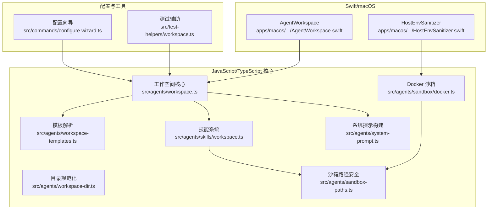
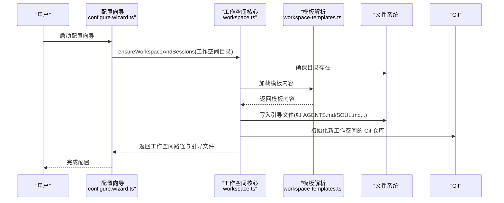
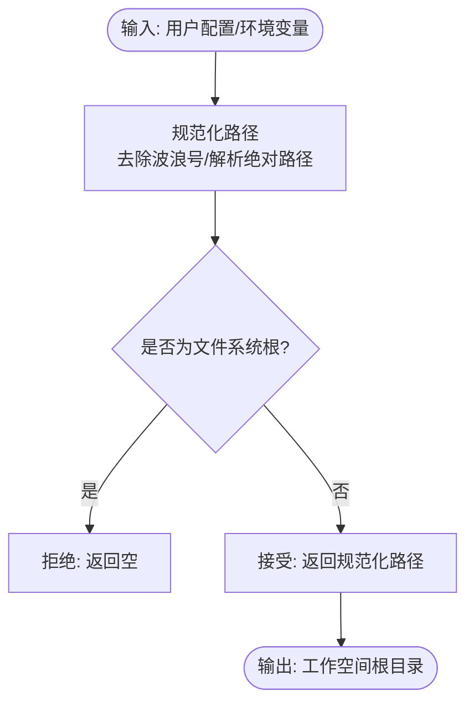
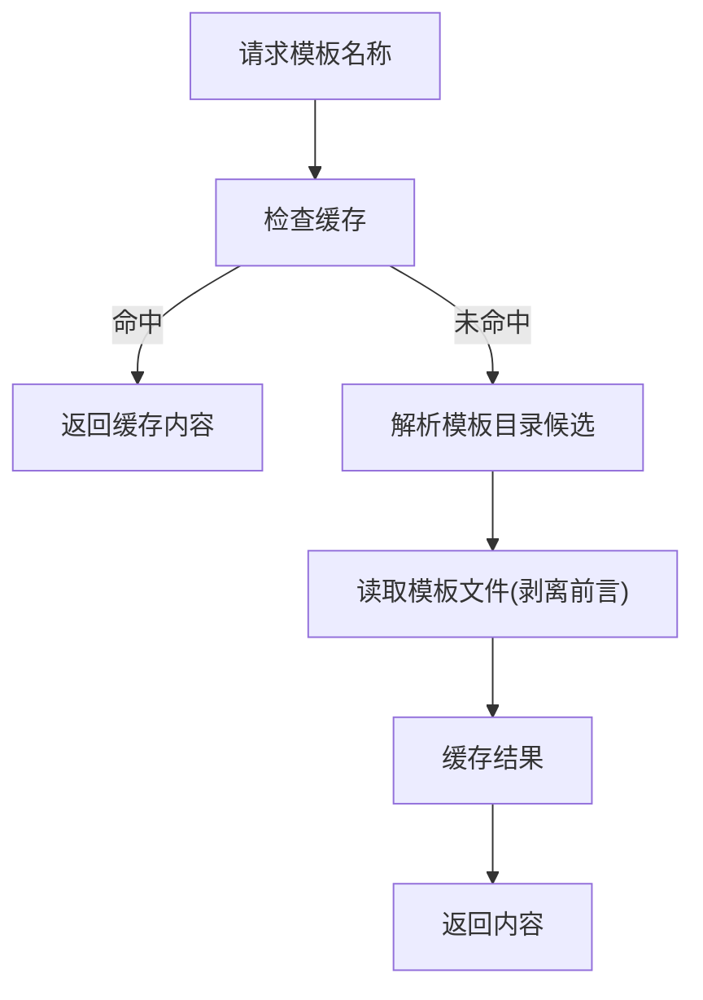
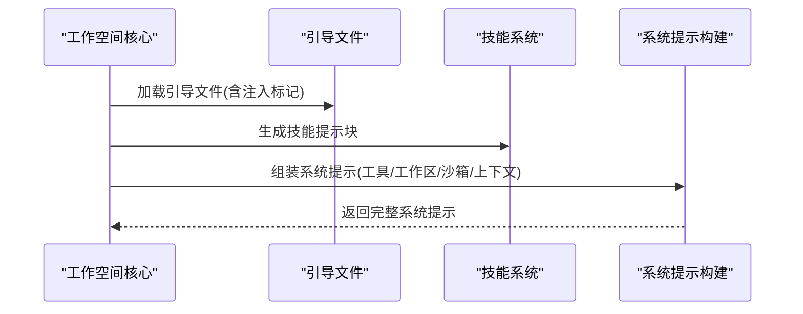
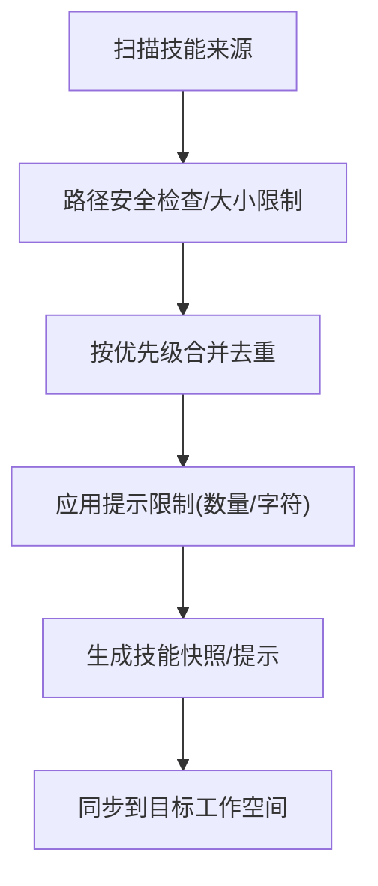
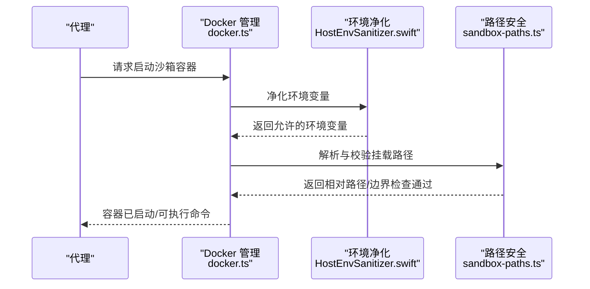
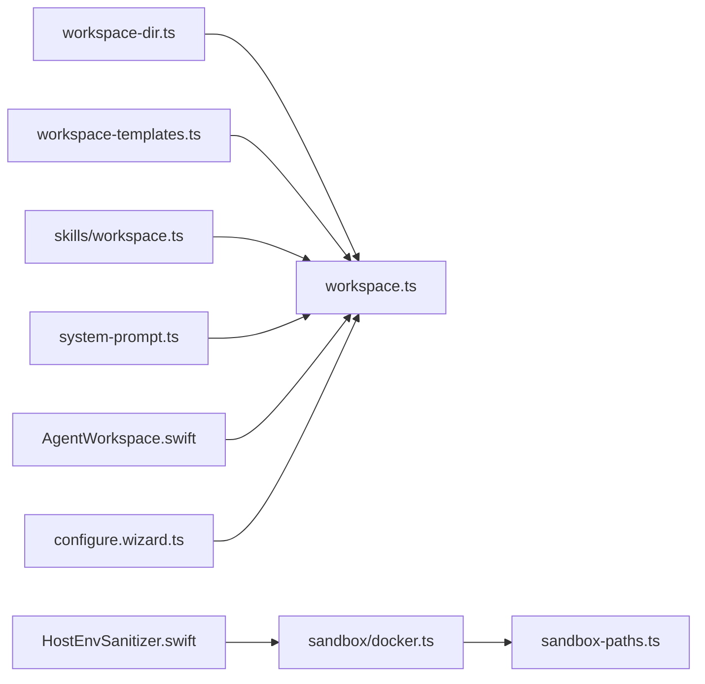

# 代理工作空间系统

<cite>
**本文档引用的文件**
- [src/agents/workspace.ts](file://src/agents/workspace.ts)
- [src/agents/workspace-templates.ts](file://src/agents/workspace-templates.ts)
- [src/agents/workspace-dir.ts](file://src/agents/workspace-dir.ts)
- [src/agents/skills/workspace.ts](file://src/agents/skills/workspace.ts)
- [src/agents/system-prompt.ts](file://src/agents/system-prompt.ts)
- [src/agents/sandbox/docker.ts](file://src/agents/sandbox/docker.ts)
- [src/agents/sandbox-paths.ts](file://src/agents/sandbox-paths.ts)
- [apps/macos/Sources/OpenClaw/AgentWorkspace.swift](file://apps/macos/Sources/OpenClaw/AgentWorkspace.swift)
- [apps/macos/Sources/OpenClaw/HostEnvSanitizer.swift](file://apps/macos/Sources/OpenClaw/HostEnvSanitizer.swift)
- [src/commands/configure.wizard.ts](file://src/commands/configure.wizard.ts)
- [src/test-helpers/workspace.ts](file://src/test-helpers/workspace.ts)
- [src/agents/sandbox/workspace-mounts.test.ts](file://src/agents/sandbox/workspace-mounts.test.ts)
- [src/config/config.env-vars.test.ts](file://src/config/config.env-vars.test.ts)
- [src/daemon/service-env.ts](file://src/daemon/service-env.ts)
</cite>

## 目录
1. [简介](#简介)
2. [项目结构](#项目结构)
3. [核心组件](#核心组件)
4. [架构总览](#架构总览)
5. [详细组件分析](#详细组件分析)
6. [依赖关系分析](#依赖关系分析)
7. [性能考虑](#性能考虑)
8. [故障排除指南](#故障排除指南)
9. [结论](#结论)
10. [附录](#附录)

## 简介
本技术文档面向代理工作空间系统，系统性阐述工作空间的概念、架构与实现细节，涵盖工作空间根目录、模板系统、运行时环境、目录结构、注入提示文件、技能目录与临时文件管理、模板机制（解析、变量替换与动态生成）、运行时（进程启动、环境变量设置与资源限制）、配置选项（权限控制、安全策略与性能优化）以及最佳实践（目录组织、文件管理与调试技巧）。文档以代码级分析为基础，辅以可视化图示，帮助开发者与运维人员快速理解并高效使用该系统。

## 项目结构
工作空间系统由多语言模块协同组成：
- JavaScript/TypeScript 核心：负责工作空间引导、模板加载、技能发现与同步、系统提示构建、沙箱容器管理与路径安全校验。
- Swift/macOS 原生：提供工作空间路径解析、空闲检测与模板入口等能力。
- 配置与命令行：向导式配置工作空间目录，确保模板与状态文件就绪，并在首次使用时初始化 Git 仓库。

**图表来源**
- [src/agents/workspace.ts:1-656](file://src/agents/workspace.ts#L1-L656)
- [src/agents/workspace-templates.ts:1-60](file://src/agents/workspace-templates.ts#L1-L60)
- [src/agents/workspace-dir.ts:1-21](file://src/agents/workspace-dir.ts#L1-L21)
- [src/agents/skills/workspace.ts:1-882](file://src/agents/skills/workspace.ts#L1-L882)
- [src/agents/system-prompt.ts:1-729](file://src/agents/system-prompt.ts#L1-L729)
- [src/agents/sandbox/docker.ts:1-568](file://src/agents/sandbox/docker.ts#L1-L568)
- [src/agents/sandbox-paths.ts:1-218](file://src/agents/sandbox-paths.ts#L1-L218)
- [apps/macos/Sources/OpenClaw/AgentWorkspace.swift:40-71](file://apps/macos/Sources/OpenClaw/AgentWorkspace.swift#L40-L71)
- [apps/macos/Sources/OpenClaw/HostEnvSanitizer.swift:31-56](file://apps/macos/Sources/OpenClaw/HostEnvSanitizer.swift#L31-L56)
- [src/commands/configure.wizard.ts:439-485](file://src/commands/configure.wizard.ts#L439-L485)
- [src/test-helpers/workspace.ts:1-17](file://src/test-helpers/workspace.ts#L1-L17)

**章节来源**
- [src/agents/workspace.ts:1-656](file://src/agents/workspace.ts#L1-L656)
- [src/agents/workspace-templates.ts:1-60](file://src/agents/workspace-templates.ts#L1-L60)
- [src/agents/workspace-dir.ts:1-21](file://src/agents/workspace-dir.ts#L1-L21)
- [src/agents/skills/workspace.ts:1-882](file://src/agents/skills/workspace.ts#L1-L882)
- [src/agents/system-prompt.ts:1-729](file://src/agents/system-prompt.ts#L1-L729)
- [src/agents/sandbox/docker.ts:1-568](file://src/agents/sandbox/docker.ts#L1-L568)
- [src/agents/sandbox-paths.ts:1-218](file://src/agents/sandbox-paths.ts#L1-L218)
- [apps/macos/Sources/OpenClaw/AgentWorkspace.swift:40-71](file://apps/macos/Sources/OpenClaw/AgentWorkspace.swift#L40-L71)
- [apps/macos/Sources/OpenClaw/HostEnvSanitizer.swift:31-56](file://apps/macos/Sources/OpenClaw/HostEnvSanitizer.swift#L31-L56)
- [src/commands/configure.wizard.ts:439-485](file://src/commands/configure.wizard.ts#L439-L485)
- [src/test-helpers/workspace.ts:1-17](file://src/test-helpers/workspace.ts#L1-L17)

## 核心组件
- 工作空间引导与模板系统：负责默认工作空间目录解析、模板目录定位、模板加载与缓存、边界安全读取、引导文件写入与状态管理。
- 技能系统：扫描工作空间中的技能目录，按优先级合并，过滤与限制，构建技能提示与快照，并支持同步到沙箱。
- 系统提示构建：根据工作空间文件、技能、运行时信息与模式（full/minimal/none）生成系统提示，包含工具清单、工作区指导、沙箱说明与上下文文件。
- 沙箱运行时：通过 Docker 创建隔离容器，应用安全策略（只读根文件系统、丢弃能力、seccomp/apparmor、DNS/hosts、ulimits、内存/CPU 限制），挂载工作空间并注入环境变量。
- 路径安全与环境净化：在沙箱中对路径进行边界检查，阻止逃逸；对环境变量进行白名单过滤与阻断，避免敏感变量泄露。
- macOS 原生集成：提供工作空间路径解析、空闲检测与模板入口，以及主机环境变量净化。

**章节来源**
- [src/agents/workspace.ts:12-459](file://src/agents/workspace.ts#L12-L459)
- [src/agents/workspace-templates.ts:14-59](file://src/agents/workspace-templates.ts#L14-L59)
- [src/agents/skills/workspace.ts:292-527](file://src/agents/skills/workspace.ts#L292-L527)
- [src/agents/system-prompt.ts:189-689](file://src/agents/system-prompt.ts#L189-L689)
- [src/agents/sandbox/docker.ts:317-475](file://src/agents/sandbox/docker.ts#L317-L475)
- [src/agents/sandbox-paths.ts:44-79](file://src/agents/sandbox-paths.ts#L44-L79)
- [apps/macos/Sources/OpenClaw/AgentWorkspace.swift:40-71](file://apps/macos/Sources/OpenClaw/AgentWorkspace.swift#L40-L71)
- [apps/macos/Sources/OpenClaw/HostEnvSanitizer.swift:44-56](file://apps/macos/Sources/OpenClaw/HostEnvSanitizer.swift#L44-L56)

## 架构总览
工作空间系统围绕“工作空间根目录”展开，通过模板系统生成引导文件，结合技能目录与系统提示构建，最终在沙箱环境中执行工具调用与命令。macOS 原生层提供路径解析与环境净化，配置向导确保工作空间初始化与 Git 初始化。

**图表来源**
- [src/commands/configure.wizard.ts:439-485](file://src/commands/configure.wizard.ts#L439-L485)
- [src/agents/workspace.ts:321-459](file://src/agents/workspace.ts#L321-L459)
- [src/agents/workspace-templates.ts:104-130](file://src/agents/workspace-templates.ts#L104-L130)

**章节来源**
- [src/commands/configure.wizard.ts:439-485](file://src/commands/configure.wizard.ts#L439-L485)
- [src/agents/workspace.ts:321-459](file://src/agents/workspace.ts#L321-L459)
- [src/agents/workspace-templates.ts:104-130](file://src/agents/workspace-templates.ts#L104-L130)

## 详细组件分析

### 工作空间根目录与目录规范化
- 默认工作空间目录基于用户主目录与环境变量组合生成，支持按配置文件档案(profile)区分不同工作空间。
- 目录规范化拒绝将文件系统根作为工作空间，防止误用。
- macOS 层提供路径解析与空闲检测，确保模板入口与工作空间状态一致。

**图表来源**
- [src/agents/workspace-dir.ts:4-16](file://src/agents/workspace-dir.ts#L4-L16)
- [apps/macos/Sources/OpenClaw/AgentWorkspace.swift:40-45](file://apps/macos/Sources/OpenClaw/AgentWorkspace.swift#L40-L45)

**章节来源**
- [src/agents/workspace-dir.ts:4-16](file://src/agents/workspace-dir.ts#L4-L16)
- [apps/macos/Sources/OpenClaw/AgentWorkspace.swift:40-45](file://apps/macos/Sources/OpenClaw/AgentWorkspace.swift#L40-L45)

### 模板系统与动态生成
- 模板目录优先从包根或当前工作目录查找，回退到内置模板目录，支持缓存与并发解析。
- 引导文件缺失时自动写入，确保工作空间具备最小可用文件集。
- 边界安全读取：限制最大文件大小，基于 inode/dev/size/mtime 组合的身份标识缓存，避免重复读取与越界访问。

**图表来源**
- [src/agents/workspace-templates.ts:14-54](file://src/agents/workspace-templates.ts#L14-L54)
- [src/agents/workspace.ts:104-130](file://src/agents/workspace.ts#L104-L130)

**章节来源**
- [src/agents/workspace-templates.ts:14-54](file://src/agents/workspace-templates.ts#L14-L54)
- [src/agents/workspace.ts:104-130](file://src/agents/workspace.ts#L104-L130)

### 注入的提示文件与系统提示构建
- 工作空间注入的提示文件包括 AGENTS、SOUL、TOOLS、IDENTITY、USER、HEARTBEAT、BOOTSTRAP 及 MEMORY 等，用于构建系统提示。
- 系统提示包含工具清单、工作区指导、沙箱说明、消息与反应指引、静默回复规则、心跳处理与运行时信息。
- 支持按会话键（子代理/定时任务）裁剪注入文件集合，减少上下文冗余。

**图表来源**
- [src/agents/workspace.ts:498-555](file://src/agents/workspace.ts#L498-L555)
- [src/agents/system-prompt.ts:189-689](file://src/agents/system-prompt.ts#L189-L689)
- [src/agents/skills/workspace.ts:567-638](file://src/agents/skills/workspace.ts#L567-L638)

**章节来源**
- [src/agents/workspace.ts:498-555](file://src/agents/workspace.ts#L498-L555)
- [src/agents/system-prompt.ts:189-689](file://src/agents/system-prompt.ts#L189-L689)
- [src/agents/skills/workspace.ts:567-638](file://src/agents/skills/workspace.ts#L567-L638)

### 技能目录与同步
- 技能来源按优先级合并：extra < bundled < managed < agents-skills-personal < agents-skills-project < workspace。
- 对每个来源进行路径安全检查与大小限制，过滤超限与不合规条目。
- 提供技能提示限制（数量与字符数），采用二分搜索确定最大可容纳集合。
- 支持将技能同步到目标工作空间的 skills 目录，避免同名冲突并进行安全路径解析。

**图表来源**
- [src/agents/skills/workspace.ts:292-527](file://src/agents/skills/workspace.ts#L292-L527)
- [src/agents/skills/workspace.ts:567-638](file://src/agents/skills/workspace.ts#L567-L638)
- [src/agents/skills/workspace.ts:710-766](file://src/agents/skills/workspace.ts#L710-L766)

**章节来源**
- [src/agents/skills/workspace.ts:292-527](file://src/agents/skills/workspace.ts#L292-L527)
- [src/agents/skills/workspace.ts:567-638](file://src/agents/skills/workspace.ts#L567-L638)
- [src/agents/skills/workspace.ts:710-766](file://src/agents/skills/workspace.ts#L710-L766)

### 运行时与沙箱容器
- Docker 容器创建时应用严格安全策略：只读根文件系统、丢弃多余能力、启用 seccomp/apparmor、限制 DNS/hosts、ulimits、内存/CPU、PID 数量等。
- 自动挂载工作空间与代理工作空间，支持读写/只读权限与共享模式。
- 环境变量注入前进行净化：阻断危险变量，仅允许白名单变量进入容器。
- 路径安全：在沙箱内对所有输入路径进行边界检查，防止逃逸与符号链接陷阱。

**图表来源**
- [src/agents/sandbox/docker.ts:317-427](file://src/agents/sandbox/docker.ts#L317-L427)
- [apps/macos/Sources/OpenClaw/HostEnvSanitizer.swift:44-56](file://apps/macos/Sources/OpenClaw/HostEnvSanitizer.swift#L44-L56)
- [src/agents/sandbox-paths.ts:44-79](file://src/agents/sandbox-paths.ts#L44-L79)

**章节来源**
- [src/agents/sandbox/docker.ts:317-427](file://src/agents/sandbox/docker.ts#L317-L427)
- [apps/macos/Sources/OpenClaw/HostEnvSanitizer.swift:44-56](file://apps/macos/Sources/OpenClaw/HostEnvSanitizer.swift#L44-L56)
- [src/agents/sandbox-paths.ts:44-79](file://src/agents/sandbox-paths.ts#L44-L79)

### 临时文件管理与媒体源解析
- 媒体源支持 HTTP URL、file:// URL 与本地绝对路径映射至沙箱工作区或受控临时目录。
- 对 data: URL 明确禁止，避免不安全数据注入。
- 临时目录路径同样进行别名逃逸检查，确保仅在允许范围内访问。

**章节来源**
- [src/agents/sandbox-paths.ts:88-135](file://src/agents/sandbox-paths.ts#L88-L135)
- [src/agents/sandbox-paths.ts:184-210](file://src/agents/sandbox-paths.ts#L184-L210)

## 依赖关系分析

**图表来源**
- [src/agents/workspace-dir.ts:1-21](file://src/agents/workspace-dir.ts#L1-L21)
- [src/agents/workspace.ts:1-10](file://src/agents/workspace.ts#L1-L10)
- [src/agents/workspace-templates.ts:1-4](file://src/agents/workspace-templates.ts#L1-L4)
- [src/agents/skills/workspace.ts:1-31](file://src/agents/skills/workspace.ts#L1-L31)
- [src/agents/system-prompt.ts:1-10](file://src/agents/system-prompt.ts#L1-L10)
- [src/agents/sandbox/docker.ts:1-8](file://src/agents/sandbox/docker.ts#L1-L8)
- [src/agents/sandbox-paths.ts:1-7](file://src/agents/sandbox-paths.ts#L1-L7)
- [apps/macos/Sources/OpenClaw/AgentWorkspace.swift:40-71](file://apps/macos/Sources/OpenClaw/AgentWorkspace.swift#L40-L71)
- [apps/macos/Sources/OpenClaw/HostEnvSanitizer.swift:31-56](file://apps/macos/Sources/OpenClaw/HostEnvSanitizer.swift#L31-L56)
- [src/commands/configure.wizard.ts:439-485](file://src/commands/configure.wizard.ts#L439-L485)

**章节来源**
- [src/agents/workspace.ts:1-10](file://src/agents/workspace.ts#L1-L10)
- [src/agents/skills/workspace.ts:1-31](file://src/agents/skills/workspace.ts#L1-L31)
- [src/agents/sandbox/docker.ts:1-8](file://src/agents/sandbox/docker.ts#L1-L8)

## 性能考虑
- 文件读取缓存：工作空间引导文件按 inode/dev/size/mtime 组合身份缓存，避免重复读取与越界风险。
- 技能扫描限制：对候选数量、单文件大小与提示字符数进行上限控制，二分搜索确定最优截断点，平衡上下文质量与 token 成本。
- 模板缓存：模板目录解析与模板内容缓存减少重复 IO。
- 沙箱资源限制：通过 ulimits、内存/CPU、PID 限制与只读根文件系统降低容器资源占用与逃逸风险。
- 路径解析与挂载：统一的路径解析与挂载策略减少跨平台差异带来的性能损耗。

[本节为通用性能讨论，无需特定文件引用]

## 故障排除指南
- 模板缺失：当模板文件不存在时抛出错误，需确认模板目录是否正确打包与可达。
- Git 初始化失败：新工作空间尝试初始化 Git 仓库，若失败不影响工作空间使用。
- 环境变量问题：配置中注入的危险环境变量会被阻断，建议通过白名单方式传递必要变量。
- 沙箱启动失败：Docker 命令不可用时会给出明确提示，可通过安装 Docker 或关闭沙箱模式解决。
- 路径逃逸与符号链接：沙箱路径安全检查会拒绝逃逸路径与不合规符号链接，确保容器安全。
- 权限与安全审计：配置文件权限检查会报告世界可写/组可写等高危状态，建议调整权限并遵循最小权限原则。

**章节来源**
- [src/agents/workspace-templates.ts:114-120](file://src/agents/workspace-templates.ts#L114-L120)
- [src/agents/workspace.ts:304-319](file://src/agents/workspace.ts#L304-L319)
- [src/config/config.env-vars.test.ts:46-72](file://src/config/config.env-vars.test.ts#L46-L72)
- [src/agents/sandbox/docker.ts:113-125](file://src/agents/sandbox/docker.ts#L113-L125)
- [src/agents/sandbox-paths.ts:54-58](file://src/agents/sandbox-paths.ts#L54-L58)
- [src/daemon/service-env.ts:313-339](file://src/daemon/service-env.ts#L313-L339)

## 结论
代理工作空间系统通过模板驱动的引导文件、严格的路径与环境安全策略、可裁剪的系统提示与沙箱容器运行时，实现了安全、可控且高性能的代理工作区。其模块化设计便于扩展与维护，适合在多平台环境下部署与演进。

[本节为总结性内容，无需特定文件引用]

## 附录

### 工作空间目录结构与约定
- 引导文件：AGENTS.md、SOUL.md、TOOLS.md、IDENTITY.md、USER.md、HEARTBEAT.md、BOOTSTRAP.md、MEMORY.md/memory.md。
- 技能目录：工作空间根下 skills 目录及多来源合并（extra/bundled/managed/personal/project/workspace）。
- 状态目录：工作空间根下隐藏目录保存工作空间引导状态。
- 临时与媒体：受控临时目录与沙箱映射路径，避免 data: URL 与符号链接陷阱。

**章节来源**
- [src/agents/workspace.ts:24-36](file://src/agents/workspace.ts#L24-L36)
- [src/agents/workspace.ts:461-496](file://src/agents/workspace.ts#L461-L496)
- [src/agents/skills/workspace.ts:445-488](file://src/agents/skills/workspace.ts#L445-L488)

### 工作空间配置选项与安全策略
- 沙箱模式：支持关闭、按会话或共享作用域，容器参数包括只读根、tmpfs、网络、用户、能力丢弃、seccomp/apparmor、DNS/hosts、ulimits、内存/CPU、PID 限制等。
- 环境变量：仅允许白名单变量进入容器，阻断危险变量（如 SHELL、HOME、BASH_ENV 等）。
- 权限控制：配置文件权限检查与修复建议，避免世界可读/可写。
- 资源限制：通过 Docker 参数与系统 ulimits 控制 CPU、内存、PID 数量，防止资源滥用。

**章节来源**
- [src/agents/sandbox/docker.ts:317-427](file://src/agents/sandbox/docker.ts#L317-L427)
- [src/config/config.env-vars.test.ts:46-72](file://src/config/config.env-vars.test.ts#L46-L72)
- [src/daemon/service-env.ts:313-339](file://src/daemon/service-env.ts#L313-L339)

### 最佳实践
- 目录组织：将工作空间置于受控位置，避免使用文件系统根；使用相对路径与 tilde 展开提升可移植性。
- 文件管理：利用引导文件与模板保持一致性；避免直接修改注入文件，通过上下文文件与技能扩展功能实现定制。
- 调试技巧：使用系统提示报告与技能快照核对上下文与工具可用性；在沙箱模式下优先使用相对路径与容器工作区映射。
- 性能优化：合理设置技能提示上限与字符预算；启用模板与文件读取缓存；在非必要场景关闭沙箱以降低开销。

**章节来源**
- [src/agents/system-prompt.ts:567-689](file://src/agents/system-prompt.ts#L567-L689)
- [src/agents/skills/workspace.ts:529-565](file://src/agents/skills/workspace.ts#L529-L565)
- [src/agents/sandbox/workspace-mounts.test.ts:1-49](file://src/agents/sandbox/workspace-mounts.test.ts#L1-L49)