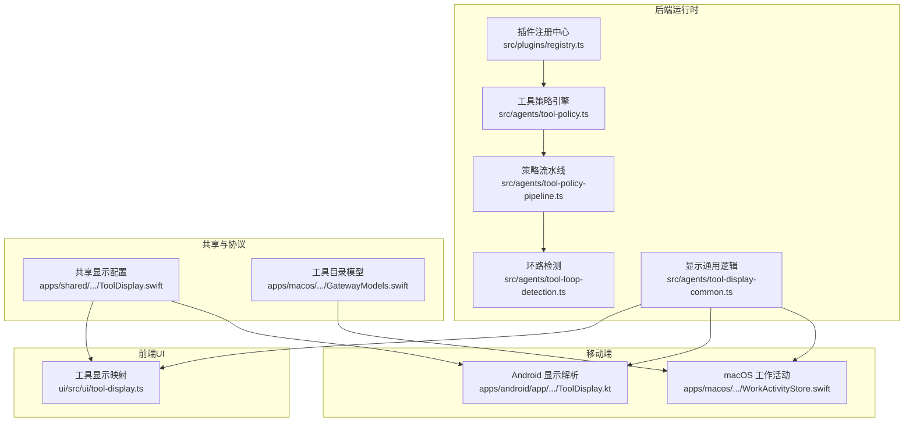
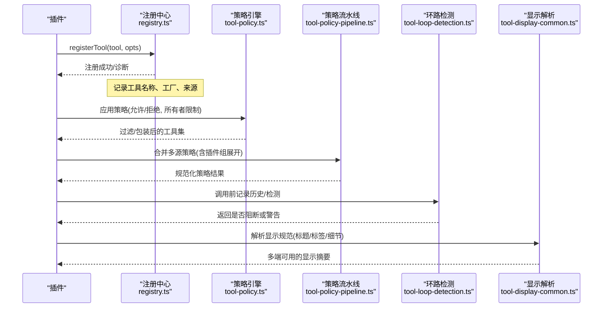
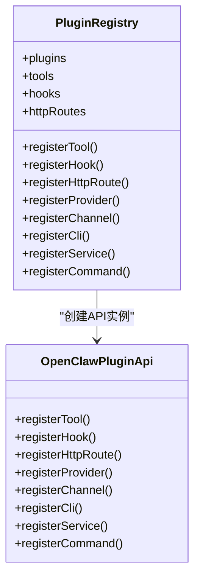
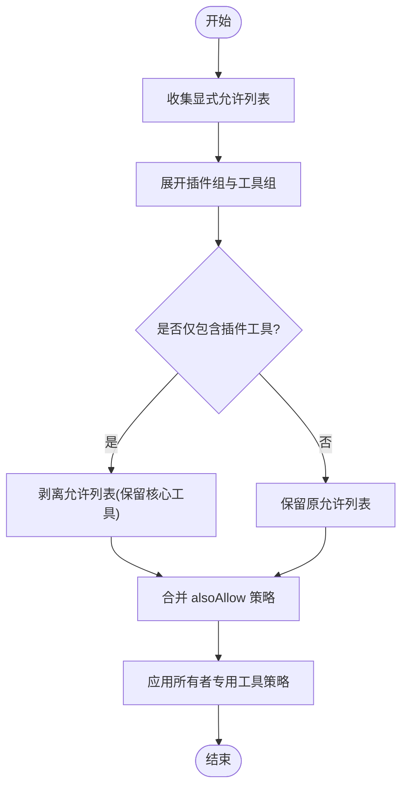
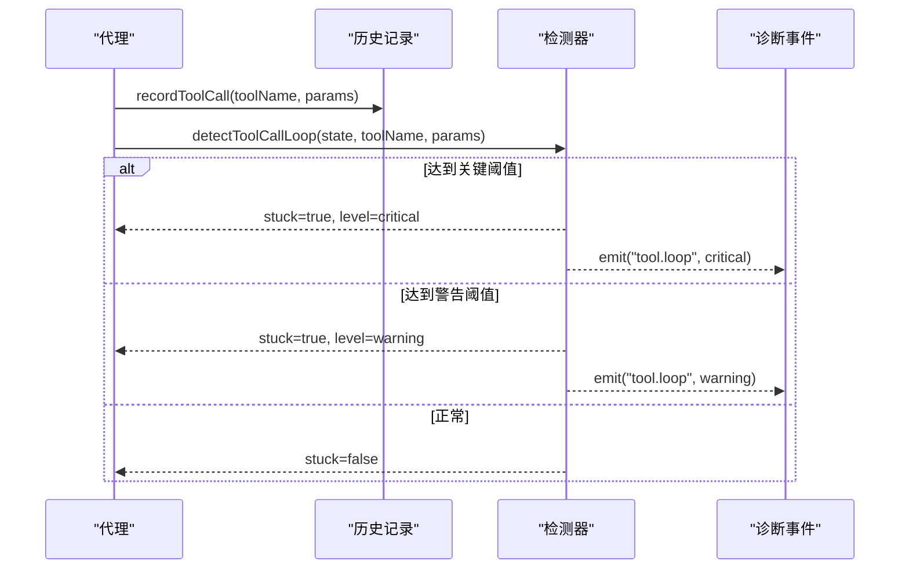
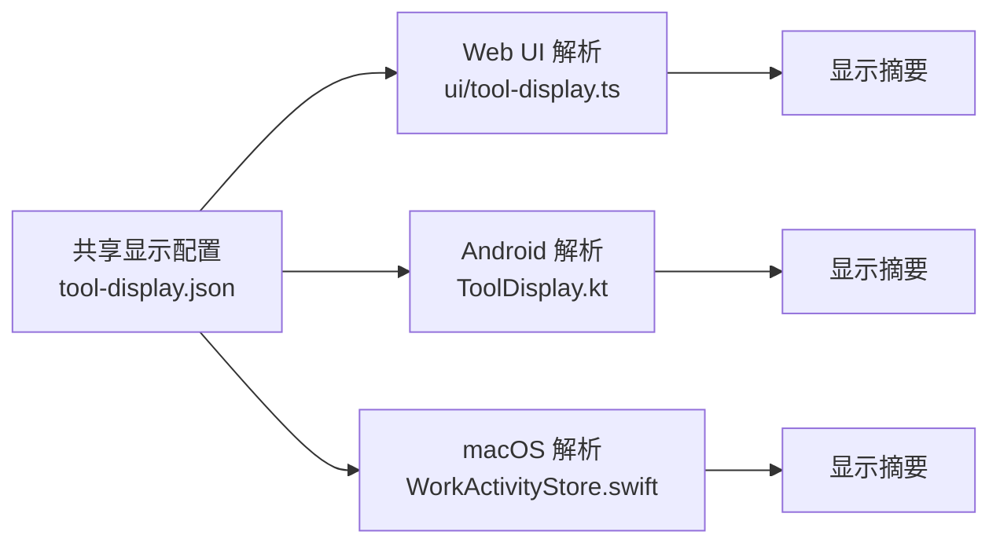
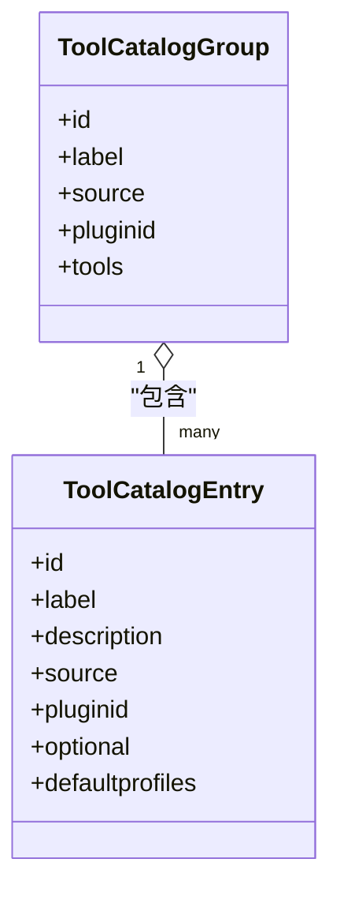
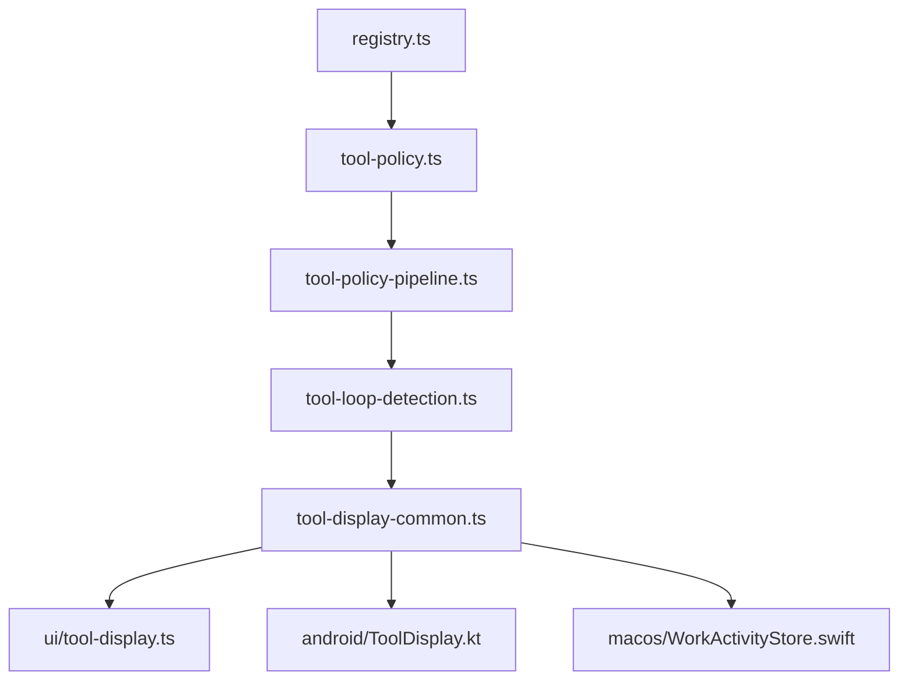

# 代理工具系统

<cite>
**本文引用的文件**
- [registry.ts](file://src/plugins/registry.ts)
- [tool-policy.ts](file://src/agents/tool-policy.ts)
- [tool-policy-pipeline.ts](file://src/agents/tool-policy-pipeline.ts)
- [tool-policy.conformance.ts](file://src/agents/tool-policy.conformance.ts)
- [tool-loop-detection.ts](file://src/agents/tool-loop-detection.ts)
- [pi-tools.before-tool-call.runtime.ts](file://src/agents/pi-tools.before-tool-call.runtime.ts)
- [pi-tools.before-tool-call.e2e.test.ts](file://src/agents/pi-tools.before-tool-call.e2e.test.ts)
- [common.ts](file://src/agents/tools/common.ts)
- [tool-display-common.ts](file://src/agents/tool-display-common.ts)
- [tool-display.ts](file://ui/src/ui/tool-display.ts)
- [ToolDisplay.kt](file://apps/android/app/src/main/java/ai/openclaw/app/tools/ToolDisplay.kt)
- [ToolDisplay.swift](file://apps/macos/Sources/OpenClaw/WorkActivityStore.swift)
- [ToolCatalogGroup.swift](file://apps/macos/Sources/OpenClawProtocol/GatewayModels.swift)
- [ToolCatalogEntry.swift](file://apps/macos/Sources/OpenClawProtocol/GatewayModels.swift)
- [ToolDisplay.swift](file://apps/shared/OpenClawKit/Sources/OpenClawKit/ToolDisplay.swift)
- [config-ui-hints-types.ts](file://src/shared/config-ui-hints-types.ts)
- [AGENTS.md](file://AGENTS.md)
</cite>

## 目录
1. [简介](#简介)
2. [项目结构](#项目结构)
3. [核心组件](#核心组件)
4. [架构总览](#架构总览)
5. [详细组件分析](#详细组件分析)
6. [依赖关系分析](#依赖关系分析)
7. [性能考量](#性能考量)
8. [故障排除指南](#故障排除指南)
9. [结论](#结论)
10. [附录](#附录)

## 简介
本文件面向“代理工具系统”的技术文档，系统性阐述工具注册、发现与调用机制，工具目录管理（元数据、类型定义、版本控制），工具策略系统（访问控制、权限验证、安全限制），工具显示配置（UI定制、参数展示、结果格式化），并提供工具开发指南、监控与调试方法、性能优化与故障排除建议。文档以代码级事实为基础，结合架构图与流程图帮助读者快速理解与落地。

## 项目结构
代理工具系统横跨后端运行时、前端UI、移动端平台与协议层，围绕插件生态构建统一的工具注册与策略执行框架，并通过显示配置在多端一致呈现工具行为。

图表来源
- [registry.ts:185-625](file://src/plugins/registry.ts#L185-L625)
- [tool-policy.ts:1-211](file://src/agents/tool-policy.ts#L1-L211)
- [tool-policy-pipeline.ts:1-57](file://src/agents/tool-policy-pipeline.ts#L1-L57)
- [tool-loop-detection.ts:1-624](file://src/agents/tool-loop-detection.ts#L1-L624)
- [tool-display-common.ts:1-800](file://src/agents/tool-display-common.ts#L1-L800)
- [tool-display.ts:1-49](file://ui/src/ui/tool-display.ts#L1-L49)
- [ToolDisplay.kt:1-91](file://apps/android/app/src/main/java/ai/openclaw/app/tools/ToolDisplay.kt#L1-L91)
- [WorkActivityStore.swift:208-243](file://apps/macos/Sources/OpenClaw/WorkActivityStore.swift#L208-L243)
- [ToolDisplay.swift:104-146](file://apps/shared/OpenClawKit/Sources/OpenClawKit/ToolDisplay.swift#L104-L146)
- [GatewayModels.swift:2464-2521](file://apps/macos/Sources/OpenClawProtocol/GatewayModels.swift#L2464-L2521)

章节来源
- [registry.ts:1-625](file://src/plugins/registry.ts#L1-L625)
- [tool-policy.ts:1-211](file://src/agents/tool-policy.ts#L1-L211)
- [tool-policy-pipeline.ts:1-57](file://src/agents/tool-policy-pipeline.ts#L1-L57)
- [tool-display-common.ts:1-800](file://src/agents/tool-display-common.ts#L1-L800)

## 核心组件
- 插件注册中心：负责工具注册、钩子、HTTP路由、通道、提供者等的集中登记与校验，提供标准化API给插件使用。
- 工具策略引擎：定义工具允许/拒绝列表、插件组展开、核心工具保护、所有者专用工具策略等。
- 策略流水线：按优先级顺序合并多源策略，支持“仅插件允许列表”自动剥离，避免误封核心工具。
- 环路检测：对重复调用、轮询无进展、全局断路器、ping-pong交替等进行检测与告警/阻断。
- 显示配置：统一的工具显示规范（标题、标签、细节键、动作），在Web、Android、macOS多端解析与渲染。

章节来源
- [registry.ts:185-625](file://src/plugins/registry.ts#L185-L625)
- [tool-policy.ts:1-211](file://src/agents/tool-policy.ts#L1-L211)
- [tool-policy-pipeline.ts:1-57](file://src/agents/tool-policy-pipeline.ts#L1-L57)
- [tool-loop-detection.ts:1-624](file://src/agents/tool-loop-detection.ts#L1-L624)
- [tool-display-common.ts:1-800](file://src/agents/tool-display-common.ts#L1-L800)

## 架构总览
下图展示从插件注册到工具调用、策略过滤、显示渲染的关键路径。

图表来源
- [registry.ts:193-218](file://src/plugins/registry.ts#L193-L218)
- [tool-policy.ts:46-57](file://src/agents/tool-policy.ts#L46-L57)
- [tool-policy-pipeline.ts:28-57](file://src/agents/tool-policy-pipeline.ts#L28-L57)
- [tool-loop-detection.ts:372-495](file://src/agents/tool-loop-detection.ts#L372-L495)
- [tool-display-common.ts:66-89](file://src/agents/tool-display-common.ts#L66-L89)

## 详细组件分析

### 组件A：插件注册与工具发现
- 注册入口：插件通过API注册工具，支持单个工具或工厂函数返回多个工具；自动规范化名称与可选标志。
- 去重与校验：对HTTP路由重叠、提供者重复、命令冲突等进行诊断与拦截。
- 工厂模式：工具可由上下文动态生成，便于按环境注入不同实现。
- 发现机制：工具名与工厂映射存储于注册表，调用时按名称解析。

图表来源
- [registry.ts:129-142](file://src/plugins/registry.ts#L129-L142)
- [registry.ts:575-608](file://src/plugins/registry.ts#L575-L608)

章节来源
- [registry.ts:193-218](file://src/plugins/registry.ts#L193-L218)
- [registry.ts:318-400](file://src/plugins/registry.ts#L318-L400)
- [registry.ts:430-457](file://src/plugins/registry.ts#L430-L457)
- [registry.ts:459-517](file://src/plugins/registry.ts#L459-L517)

### 组件B：工具策略系统
- 允许/拒绝策略：支持显式白名单与黑名单，自动规范化与去重。
- 插件组展开：支持“group:plugins”与按插件ID分组的工具集合展开。
- 核心工具保护：当仅存在插件工具的允许列表时自动剥离，防止误封核心工具。
- 所有者专用工具：对ownerOnly标记或特定工具名进行访问限制，非所有者调用将被包装为抛错。
- 策略流水线：按优先级顺序合并策略，支持“也允许”叠加与插件组展开。

图表来源
- [tool-policy.ts:75-92](file://src/agents/tool-policy.ts#L75-L92)
- [tool-policy.ts:115-141](file://src/agents/tool-policy.ts#L115-L141)
- [tool-policy.ts:156-200](file://src/agents/tool-policy.ts#L156-L200)
- [tool-policy.ts:46-57](file://src/agents/tool-policy.ts#L46-L57)

章节来源
- [tool-policy.ts:59-74](file://src/agents/tool-policy.ts#L59-L74)
- [tool-policy.ts:94-113](file://src/agents/tool-policy.ts#L94-L113)
- [tool-policy.ts:143-154](file://src/agents/tool-policy.ts#L143-L154)
- [tool-policy.ts:156-200](file://src/agents/tool-policy.ts#L156-L200)
- [tool-policy-pipeline.ts:28-57](file://src/agents/tool-policy-pipeline.ts#L28-L57)

### 组件C：环路检测与安全限制
- 检测维度：通用重复、已知轮询无进展、全局断路器、ping-pong交替。
- 阈值配置：可配置历史窗口、警告阈值、关键阈值与全局断路器阈值。
- 结果处理：达到阈值时发出警告或关键事件，必要时阻断会话以防止资源浪费。
- 诊断事件：提供诊断事件流，便于监控与排障。

图表来源
- [tool-loop-detection.ts:372-495](file://src/agents/tool-loop-detection.ts#L372-L495)
- [pi-tools.before-tool-call.runtime.ts:1-7](file://src/agents/pi-tools.before-tool-call.runtime.ts#L1-L7)
- [pi-tools.before-tool-call.e2e.test.ts:241-275](file://src/agents/pi-tools.before-tool-call.e2e.test.ts#L241-L275)

章节来源
- [tool-loop-detection.ts:27-42](file://src/agents/tool-loop-detection.ts#L27-L42)
- [tool-loop-detection.ts:497-588](file://src/agents/tool-loop-detection.ts#L497-L588)
- [pi-tools.before-tool-call.runtime.ts:1-7](file://src/agents/pi-tools.before-tool-call.runtime.ts#L1-L7)
- [pi-tools.before-tool-call.e2e.test.ts:28-72](file://src/agents/pi-tools.before-tool-call.e2e.test.ts#L28-L72)

### 组件D：工具显示配置与多端解析
- Web端：加载共享显示配置，解析工具标题、标签、动作用词与细节，映射为图标与文本。
- Android端：从资源加载显示配置，按工具名与动作解析emoji、标题、标签与细节键。
- macOS端：在工作活动与协议层使用显示配置生成人类可读的标签与摘要。
- 显示规范：支持默认配置、工具专属配置与动作级配置，细节键用于从参数中提取摘要信息。

图表来源
- [tool-display.ts:1-49](file://ui/src/ui/tool-display.ts#L1-L49)
- [ToolDisplay.kt:54-91](file://apps/android/app/src/main/java/ai/openclaw/app/tools/ToolDisplay.kt#L54-L91)
- [WorkActivityStore.swift:214-237](file://apps/macos/Sources/OpenClaw/WorkActivityStore.swift#L214-L237)
- [ToolDisplay.swift:104-146](file://apps/shared/OpenClawKit/Sources/OpenClawKit/ToolDisplay.swift#L104-L146)

章节来源
- [tool-display-common.ts:66-89](file://src/agents/tool-display-common.ts#L66-L89)
- [tool-display-common.ts:190-258](file://src/agents/tool-display-common.ts#L190-L258)
- [tool-display-common.ts:259-304](file://src/agents/tool-display-common.ts#L259-L304)
- [tool-display-common.ts:306-320](file://src/agents/tool-display-common.ts#L306-L320)
- [tool-display-common.ts:321-496](file://src/agents/tool-display-common.ts#L321-L496)

### 组件E：工具目录与版本控制
- 目录模型：工具目录分组包含工具条目，支持来源、插件ID、可选字段与默认配置。
- 版本控制：目录条目包含版本号与默认配置数组，便于多版本共存与回滚。
- 多端一致性：macOS协议层提供目录模型，确保网关与客户端一致消费。

图表来源
- [ToolCatalogEntry.swift:2464-2490](file://apps/macos/Sources/OpenClawProtocol/GatewayModels.swift#L2464-L2490)
- [ToolCatalogGroup.swift:2493-2521](file://apps/macos/Sources/OpenClawProtocol/GatewayModels.swift#L2493-L2521)

章节来源
- [ToolCatalogEntry.swift:2464-2521](file://apps/macos/Sources/OpenClawProtocol/GatewayModels.swift#L2464-L2521)
- [ToolCatalogGroup.swift:2493-2521](file://apps/macos/Sources/OpenClawProtocol/GatewayModels.swift#L2493-L2521)

### 组件F：工具开发指南
- 接口规范：工具需实现标准接口，支持ownerOnly标记、输入参数读取与错误类型。
- 最佳实践：使用参数读取器进行严格校验，合理设置动作门控，避免敏感操作未授权调用。
- 测试方法：遵循项目测试规范，使用单元与端到端测试覆盖工具行为与环路检测。

章节来源
- [common.ts:7-10](file://src/agents/tools/common.ts#L7-L10)
- [common.ts:74-127](file://src/agents/tools/common.ts#L74-L127)
- [common.ts:242-255](file://src/agents/tools/common.ts#L242-L255)
- [AGENTS.md:129-142](file://AGENTS.md#L129-L142)

## 依赖关系分析
- 注册中心依赖工具公共类型与插件类型定义，向插件暴露统一API。
- 策略引擎依赖策略共享模块，提供工具组展开与策略合并能力。
- 环路检测依赖会话状态与配置，输出诊断事件供外部订阅。
- 显示解析依赖共享配置与通用显示逻辑，多端共享同一套规则。

图表来源
- [registry.ts:1-625](file://src/plugins/registry.ts#L1-L625)
- [tool-policy.ts:1-211](file://src/agents/tool-policy.ts#L1-L211)
- [tool-policy-pipeline.ts:1-57](file://src/agents/tool-policy-pipeline.ts#L1-L57)
- [tool-loop-detection.ts:1-624](file://src/agents/tool-loop-detection.ts#L1-L624)
- [tool-display-common.ts:1-800](file://src/agents/tool-display-common.ts#L1-L800)
- [tool-display.ts:1-49](file://ui/src/ui/tool-display.ts#L1-L49)
- [ToolDisplay.kt:1-91](file://apps/android/app/src/main/java/ai/openclaw/app/tools/ToolDisplay.kt#L1-L91)
- [WorkActivityStore.swift:208-243](file://apps/macos/Sources/OpenClaw/WorkActivityStore.swift#L208-L243)

## 性能考量
- 策略合并：批量策略合并与插件组展开应避免重复计算，建议缓存规范化结果。
- 环路检测：历史窗口大小与哈希稳定性直接影响性能，应根据场景调整阈值与窗口。
- 显示解析：多端解析共享同一份配置，建议预解析与缓存常用摘要，减少重复字符串处理。
- 注册校验：HTTP路由与命令冲突检查应在注册阶段完成，避免运行时开销。

## 故障排除指南
- 策略相关
  - 症状：工具被意外禁用或无法调用
  - 排查：确认策略流水线是否剥离了仅插件的允许列表；核对工具组展开是否正确
- 环路检测
  - 症状：会话被阻断或频繁警告
  - 排查：查看诊断事件，确认是否触发关键阈值；调整阈值或停止无效轮询
- 显示异常
  - 症状：工具标签/细节不正确
  - 排查：检查共享显示配置是否存在对应工具与动作；确认细节键映射是否匹配参数结构
- 注册问题
  - 症状：HTTP路由冲突或命令重复
  - 排查：查看注册中心诊断日志，修正路径、匹配方式或替换策略

章节来源
- [tool-policy-pipeline.ts:28-57](file://src/agents/tool-policy-pipeline.ts#L28-L57)
- [tool-loop-detection.ts:372-495](file://src/agents/tool-loop-detection.ts#L372-L495)
- [pi-tools.before-tool-call.e2e.test.ts:241-275](file://src/agents/pi-tools.before-tool-call.e2e.test.ts#L241-L275)
- [registry.ts:318-400](file://src/plugins/registry.ts#L318-L400)
- [registry.ts:459-517](file://src/plugins/registry.ts#L459-L517)

## 结论
代理工具系统以插件注册中心为核心，配合策略引擎与流水线实现灵活可控的工具访问与安全限制；通过统一的显示配置在多端保持一致的人类可读体验；借助环路检测保障会话稳定与资源安全。该体系既满足扩展需求，又兼顾可观测性与易维护性。

## 附录
- 工具开发清单
  - 实现标准工具接口，设置ownerOnly（如需要）
  - 使用参数读取器进行输入校验
  - 提供动作门控与错误类型
  - 编写单元与端到端测试
- 监控与调试
  - 订阅诊断事件流，关注tool.loop事件
  - 使用会话状态统计工具调用频率与最频繁模式
  - 在本地启用更严格的阈值进行回归测试

章节来源
- [common.ts:7-10](file://src/agents/tools/common.ts#L7-L10)
- [common.ts:74-127](file://src/agents/tools/common.ts#L74-L127)
- [common.ts:242-255](file://src/agents/tools/common.ts#L242-L255)
- [tool-loop-detection.ts:593-623](file://src/agents/tool-loop-detection.ts#L593-L623)
- [AGENTS.md:129-142](file://AGENTS.md#L129-L142)