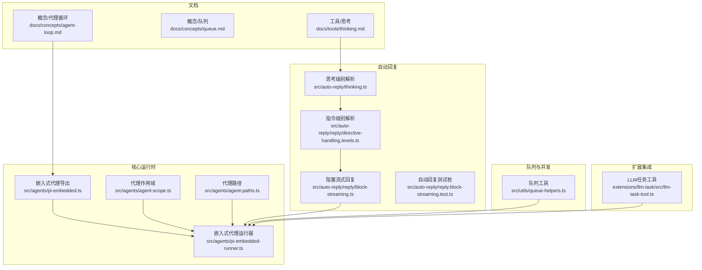
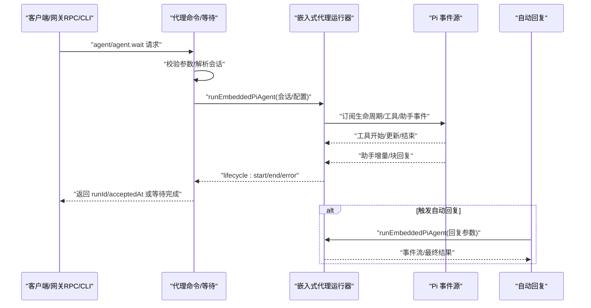
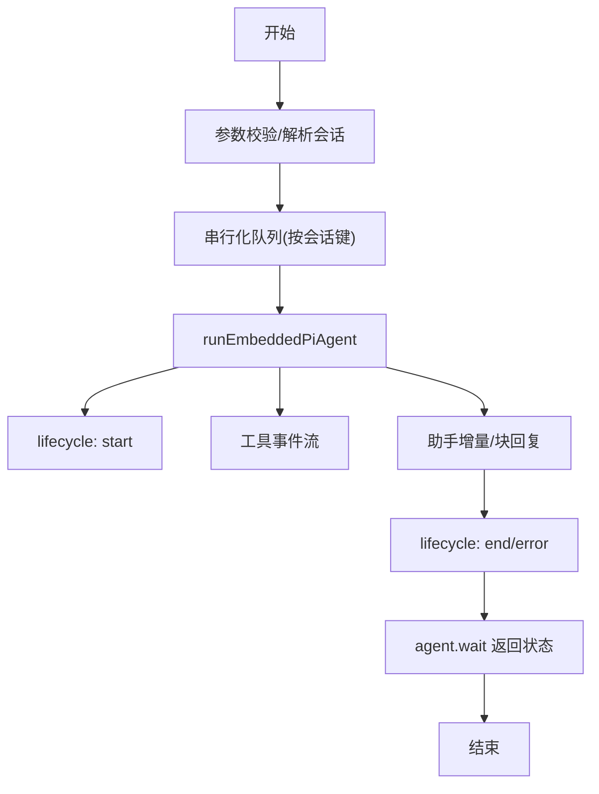
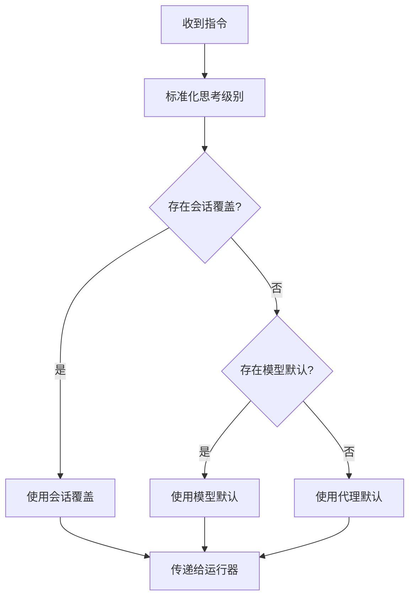
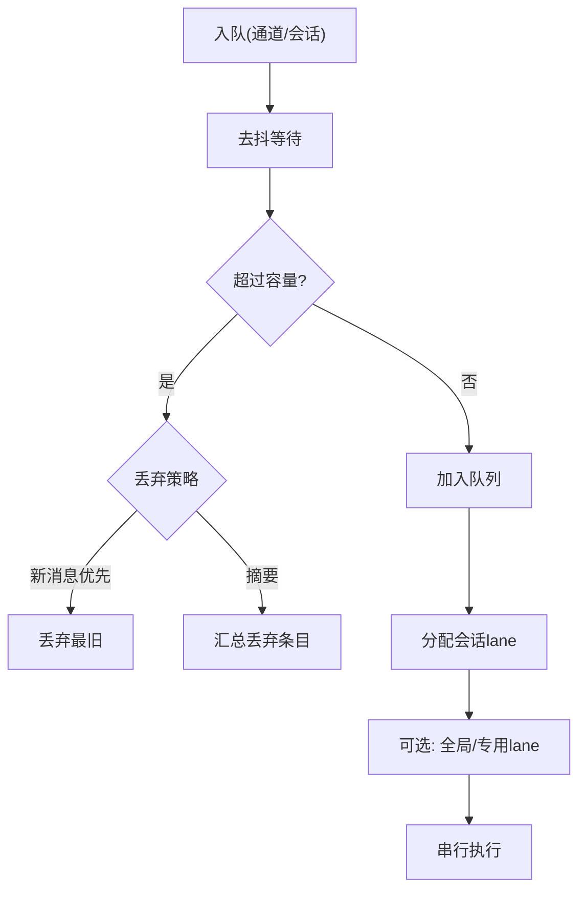
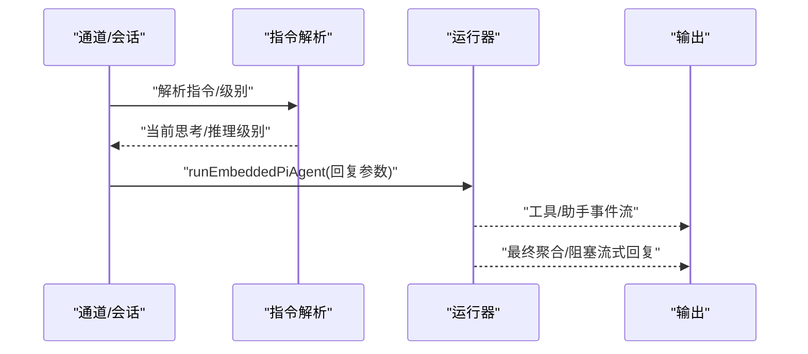
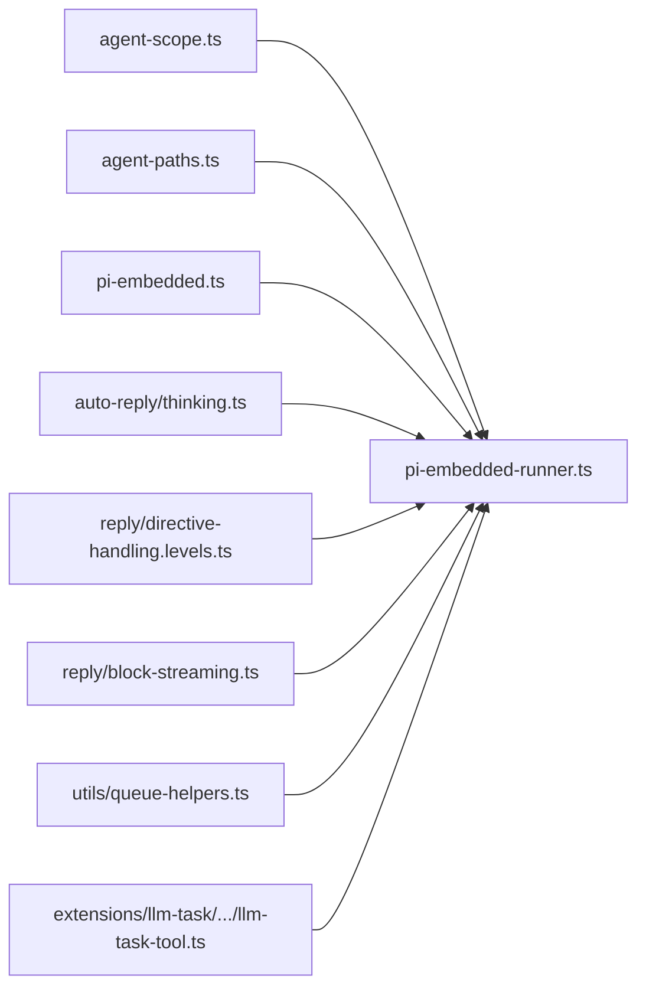

# 代理循环机制

<cite>
**本文引用的文件**
- [docs/concepts/agent-loop.md](file://docs/concepts/agent-loop.md)
- [docs/concepts/queue.md](file://docs/concepts/queue.md)
- [docs/tools/thinking.md](file://docs/tools/thinking.md)
- [src/agents/agent-scope.ts](file://src/agents/agent-scope.ts)
- [src/agents/agent-paths.ts](file://src/agents/agent-paths.ts)
- [src/agents/pi-embedded.ts](file://src/agents/pi-embedded.ts)
- [src/agents/pi-embedded-runner.ts](file://src/agents/pi-embedded-runner.ts)
- [src/auto-reply/thinking.ts](file://src/auto-reply/thinking.ts)
- [src/auto-reply/reply/directive-handling.levels.ts](file://src/auto-reply/reply/directive-handling.levels.ts)
- [src/auto-reply/reply/block-streaming.ts](file://src/auto-reply/reply/block-streaming.ts)
- [src/auto-reply/reply/agent-runner.runreplyagent.e2e.test.ts](file://src/auto-reply/reply/agent-runner.runreplyagent.e2e.test.ts)
- [src/auto-reply/reply.directive.directive-behavior.e2e-mocks.ts](file://src/auto-reply/reply.directive.directive-behavior.e2e-mocks.ts)
- [src/auto-reply/reply.block-streaming.test.ts](file://src/auto-reply/reply.block-streaming.test.ts)
- [src/utils/queue-helpers.ts](file://src/utils/queue-helpers.ts)
- [extensions/llm-task/src/llm-task-tool.ts](file://extensions/llm-task/src/llm-task-tool.ts)
</cite>

## 目录
1. [引言](#引言)
2. [项目结构](#项目结构)
3. [核心组件](#核心组件)
4. [架构总览](#架构总览)
5. [详细组件分析](#详细组件分析)
6. [依赖关系分析](#依赖关系分析)
7. [性能考量](#性能考量)
8. [故障排查指南](#故障排查指南)
9. [结论](#结论)
10. [附录](#附录)

## 引言
本文件系统化阐述 OpenClaw 的“代理循环（Agent Loop）”机制，覆盖消息接收、上下文组装、模型推理、工具执行、流式回复、持久化与生命周期事件的全链路。重点解释思考过程（推理模式、思考级别、中间结果处理）、消息调度（优先级、队列管理、并发控制）、自动回复系统（触发条件、模板匹配、响应生成），并给出配置项（超时、重试、错误处理）、监控与调试方法及性能优化建议。

## 项目结构
围绕代理循环的关键目录与文件：
- 文档层：概念与工具说明，定义了代理循环的生命周期、事件流、思考级别等
- 核心运行时：嵌入式 Pi 代理运行器与桥接逻辑
- 自动回复：思考级别解析、指令处理、阻塞流式回复
- 队列与并发：通用队列工具与通道队列模式
- 扩展集成：插件通过内部钩子与外部扩展参与代理循环

图示来源
- [docs/concepts/agent-loop.md:1-149](file://docs/concepts/agent-loop.md#L1-L149)
- [docs/concepts/queue.md:69-90](file://docs/concepts/queue.md#L69-L90)
- [docs/tools/thinking.md:34-43](file://docs/tools/thinking.md#L34-L43)
- [src/agents/agent-scope.ts:1-339](file://src/agents/agent-scope.ts#L1-L339)
- [src/agents/agent-paths.ts:1-26](file://src/agents/agent-paths.ts#L1-L26)
- [src/agents/pi-embedded.ts:1-17](file://src/agents/pi-embedded.ts#L1-L17)
- [src/agents/pi-embedded-runner.ts](file://src/agents/pi-embedded-runner.ts)
- [src/auto-reply/thinking.ts](file://src/auto-reply/thinking.ts)
- [src/auto-reply/reply/directive-handling.levels.ts](file://src/auto-reply/reply/directive-handling.levels.ts)
- [src/auto-reply/reply/block-streaming.ts](file://src/auto-reply/reply/block-streaming.ts)
- [src/auto-reply/reply.block-streaming.test.ts:1-28](file://src/auto-reply/reply.block-streaming.test.ts#L1-L28)
- [src/utils/queue-helpers.ts:84-133](file://src/utils/queue-helpers.ts#L84-L133)
- [extensions/llm-task/src/llm-task-tool.ts:1-25](file://extensions/llm-task/src/llm-task-tool.ts#L1-L25)

章节来源
- [docs/concepts/agent-loop.md:1-149](file://docs/concepts/agent-loop.md#L1-L149)
- [docs/concepts/queue.md:69-90](file://docs/concepts/queue.md#L69-L90)
- [docs/tools/thinking.md:34-43](file://docs/tools/thinking.md#L34-L43)
- [src/agents/agent-scope.ts:1-339](file://src/agents/agent-scope.ts#L1-L339)
- [src/agents/agent-paths.ts:1-26](file://src/agents/agent-paths.ts#L1-L26)
- [src/agents/pi-embedded.ts:1-17](file://src/agents/pi-embedded.ts#L1-L17)
- [src/agents/pi-embedded-runner.ts](file://src/agents/pi-embedded-runner.ts)
- [src/auto-reply/thinking.ts](file://src/auto-reply/thinking.ts)
- [src/auto-reply/reply/directive-handling.levels.ts](file://src/auto-reply/reply/directive-handling.levels.ts)
- [src/auto-reply/reply/block-streaming.ts](file://src/auto-reply/reply/block-streaming.ts)
- [src/auto-reply/reply.block-streaming.test.ts:1-28](file://src/auto-reply/reply.block-streaming.test.ts#L1-L28)
- [src/utils/queue-helpers.ts:84-133](file://src/utils/queue-helpers.ts#L84-L133)
- [extensions/llm-task/src/llm-task-tool.ts:1-25](file://extensions/llm-task/src/llm-task-tool.ts#L1-L25)

## 核心组件
- 代理作用域与配置解析：负责解析默认/会话/显式代理 ID、工作空间、模型主备策略、沙箱与工具等配置项
- 嵌入式代理运行器：统一串行化每个会话的运行，订阅 Pi 事件，桥接生命周期与流式事件，执行超时与重试/压缩
- 思考与推理级别：支持低中高/极高/自适应等多级思考，结合指令覆盖与会话默认值
- 自动回复流水线：根据指令与会话状态决定触发条件、模板匹配与响应生成，支持阻塞流式回复
- 队列与并发：基于会话键的串行化与全局/专用通道并行，配合去抖、容量与丢弃策略

章节来源
- [src/agents/agent-scope.ts:118-145](file://src/agents/agent-scope.ts#L118-L145)
- [src/agents/agent-scope.ts:256-272](file://src/agents/agent-scope.ts#L256-L272)
- [src/agents/pi-embedded.ts:7-16](file://src/agents/pi-embedded.ts#L7-L16)
- [src/auto-reply/thinking.ts](file://src/auto-reply/thinking.ts)
- [src/auto-reply/reply/directive-handling.levels.ts](file://src/auto-reply/reply/directive-handling.levels.ts)
- [src/auto-reply/reply/block-streaming.ts](file://src/auto-reply/reply/block-streaming.ts)
- [src/utils/queue-helpers.ts:84-133](file://src/utils/queue-helpers.ts#L84-L133)

## 架构总览
代理循环从网关 RPC/CLI 进入，经参数校验、会话解析与元数据持久化后，启动嵌入式 Pi 代理运行器。运行器通过队列串行化每个会话，订阅工具与助手事件，按需流式输出，并在生命周期结束时返回结果与用量信息。自动回复系统在特定触发条件下，调用相同运行器生成回复。

图示来源
- [docs/concepts/agent-loop.md:20-43](file://docs/concepts/agent-loop.md#L20-L43)
- [src/agents/pi-embedded.ts:7-16](file://src/agents/pi-embedded.ts#L7-L16)
- [src/auto-reply/reply/agent-runner.runreplyagent.e2e.test.ts:28-76](file://src/auto-reply/reply/agent-runner.runreplyagent.e2e.test.ts#L28-L76)

章节来源
- [docs/concepts/agent-loop.md:20-43](file://docs/concepts/agent-loop.md#L20-L43)
- [src/agents/pi-embedded.ts:7-16](file://src/agents/pi-embedded.ts#L7-L16)
- [src/auto-reply/reply/agent-runner.runreplyagent.e2e.test.ts:28-76](file://src/auto-reply/reply/agent-runner.runreplyagent.e2e.test.ts#L28-L76)

## 详细组件分析

### 代理循环生命周期与事件流
- 入口：网关 RPC 的 agent/agent.wait 与 CLI 命令
- 生命周期：start/end/error 三阶段事件，伴随工具与助手增量流
- 等待语义：agent.wait 仅等待生命周期结束或错误，不中断运行
- 超时：运行器内置超时保护，超时即中止；等待端可设置超时

图示来源
- [docs/concepts/agent-loop.md:18-43](file://docs/concepts/agent-loop.md#L18-L43)
- [docs/concepts/agent-loop.md:138-149](file://docs/concepts/agent-loop.md#L138-L149)

章节来源
- [docs/concepts/agent-loop.md:18-43](file://docs/concepts/agent-loop.md#L18-L43)
- [docs/concepts/agent-loop.md:138-149](file://docs/concepts/agent-loop.md#L138-L149)

### 思考过程与推理级别
- 支持级别：低/中/高/极高、自适应/自动等别名
- 会话默认：通过指令设置当前会话的思考级别，支持一次性覆盖与持久默认
- 指令解析：优先使用会话覆盖，其次模型默认，最后回退到代理默认
- 推理可见性：可配置是否在回复中显示推理块，或在特定平台进行流式展示

图示来源
- [docs/tools/thinking.md:34-43](file://docs/tools/thinking.md#L34-L43)
- [src/auto-reply/thinking.ts](file://src/auto-reply/thinking.ts)
- [src/auto-reply/reply/directive-handling.levels.ts](file://src/auto-reply/reply/directive-handling.levels.ts)

章节来源
- [docs/tools/thinking.md:34-43](file://docs/tools/thinking.md#L34-L43)
- [src/auto-reply/thinking.ts](file://src/auto-reply/thinking.ts)
- [src/auto-reply/reply/directive-handling.levels.ts](file://src/auto-reply/reply/directive-handling.levels.ts)

### 消息调度与并发控制
- 串行化：按会话键（session lane）串行化运行，避免工具/会话竞态
- 并行：可配置全局并发上限，后台任务（如 cron/subagent）使用专用 lane
- 通道队列模式：collect/steer/followup 等模式影响进入 lane 的行为
- 去抖/容量/丢弃：支持去抖、容量限制与摘要丢弃策略，保证吞吐与稳定性

图示来源
- [docs/concepts/queue.md:69-90](file://docs/concepts/queue.md#L69-L90)
- [src/utils/queue-helpers.ts:84-133](file://src/utils/queue-helpers.ts#L84-L133)

章节来源
- [docs/concepts/queue.md:69-90](file://docs/concepts/queue.md#L69-L90)
- [src/utils/queue-helpers.ts:84-133](file://src/utils/queue-helpers.ts#L84-L133)

### 自动回复系统
- 触发条件：心跳、会话空闲、特定指令或通道规则
- 模板匹配：根据会话状态与指令解析当前思考/推理级别，决定回复形态
- 响应生成：复用同一运行器，支持阻塞流式回复与最终聚合
- 测试与模拟：通过测试桩替换运行器调用，验证端到端行为

图示来源
- [src/auto-reply/reply/block-streaming.ts](file://src/auto-reply/reply/block-streaming.ts)
- [src/auto-reply/reply/agent-runner.runreplyagent.e2e.test.ts:28-76](file://src/auto-reply/reply/agent-runner.runreplyagent.e2e.test.ts#L28-L76)
- [src/auto-reply/reply.block-streaming.test.ts:1-28](file://src/auto-reply/reply.block-streaming.test.ts#L1-L28)

章节来源
- [src/auto-reply/reply/block-streaming.ts](file://src/auto-reply/reply/block-streaming.ts)
- [src/auto-reply/reply/agent-runner.runreplyagent.e2e.test.ts:28-76](file://src/auto-reply/reply/agent-runner.runreplyagent.e2e.test.ts#L28-L76)
- [src/auto-reply/reply.block-streaming.test.ts:1-28](file://src/auto-reply/reply.block-streaming.test.ts#L1-L28)

### 配置选项与错误处理
- 超时设置：agent.wait 默认等待超时；运行器有独立超时保护
- 重试策略：压缩（compaction）可能触发重试，重置内存缓冲与工具摘要
- 错误处理：生命周期错误事件、AbortSignal 取消、网关断开或 RPC 超时
- 模型主备：支持代理级/会话级/模型级主备列表，动态回退

章节来源
- [docs/concepts/agent-loop.md:138-149](file://docs/concepts/agent-loop.md#L138-L149)
- [src/agents/agent-scope.ts:193-254](file://src/agents/agent-scope.ts#L193-L254)

## 依赖关系分析
- 运行器依赖：代理作用域解析代理与工作空间、代理路径环境变量、嵌入式导出接口
- 自动回复依赖：思考级别解析、指令级别解析、阻塞流式回复与运行器
- 队列依赖：通用队列工具提供去抖、容量与丢弃策略
- 扩展集成：插件通过内部钩子与运行器交互，保持对同一运行器的复用

图示来源
- [src/agents/agent-scope.ts:118-145](file://src/agents/agent-scope.ts#L118-L145)
- [src/agents/agent-paths.ts:16-25](file://src/agents/agent-paths.ts#L16-L25)
- [src/agents/pi-embedded.ts:7-16](file://src/agents/pi-embedded.ts#L7-L16)
- [src/auto-reply/thinking.ts](file://src/auto-reply/thinking.ts)
- [src/auto-reply/reply/directive-handling.levels.ts](file://src/auto-reply/reply/directive-handling.levels.ts)
- [src/auto-reply/reply/block-streaming.ts](file://src/auto-reply/reply/block-streaming.ts)
- [src/utils/queue-helpers.ts:84-133](file://src/utils/queue-helpers.ts#L84-L133)
- [extensions/llm-task/src/llm-task-tool.ts:12-25](file://extensions/llm-task/src/llm-task-tool.ts#L12-L25)

章节来源
- [src/agents/agent-scope.ts:118-145](file://src/agents/agent-scope.ts#L118-L145)
- [src/agents/agent-paths.ts:16-25](file://src/agents/agent-paths.ts#L16-L25)
- [src/agents/pi-embedded.ts:7-16](file://src/agents/pi-embedded.ts#L7-L16)
- [src/auto-reply/thinking.ts](file://src/auto-reply/thinking.ts)
- [src/auto-reply/reply/directive-handling.levels.ts](file://src/auto-reply/reply/directive-handling.levels.ts)
- [src/auto-reply/reply/block-streaming.ts](file://src/auto-reply/reply/block-streaming.ts)
- [src/utils/queue-helpers.ts:84-133](file://src/utils/queue-helpers.ts#L84-L133)
- [extensions/llm-task/src/llm-task-tool.ts:12-25](file://extensions/llm-task/src/llm-task-tool.ts#L12-L25)

## 性能考量
- 串行化优先：会话级串行化确保一致性，避免工具竞态与历史不一致
- 去抖与容量：合理设置去抖时间与队列容量，减少抖动与内存占用
- 压缩与重试：在压缩触发时重置缓冲，避免重复输出与放大延迟
- 并发上限：通过全局并发配置允许多会话并行，但需评估资源与稳定性
- 日志与指标：启用详细日志观察排队耗时与事件流，定位瓶颈

## 故障排查指南
- 等待超时：确认 agent.wait 的超时设置与运行器超时；检查网络与网关断连
- 无响应：检查队列是否积压，关注“排队耗时”日志；核对通道队列模式
- 重复输出：确认压缩触发后的重试逻辑与缓冲重置
- 指令无效：核对思考级别别名与覆盖顺序，确保指令解析正确
- 插件干扰：通过内部钩子隔离问题，确认插件未阻塞事件流

章节来源
- [docs/concepts/agent-loop.md:138-149](file://docs/concepts/agent-loop.md#L138-L149)
- [src/utils/queue-helpers.ts:84-133](file://src/utils/queue-helpers.ts#L84-L133)
- [src/auto-reply/reply/directive-handling.levels.ts](file://src/auto-reply/reply/directive-handling.levels.ts)

## 结论
代理循环以“串行化+事件驱动”的方式，将消息接收、上下文组装、模型推理、工具执行与流式回复整合为统一生命周期。通过思考级别与指令解析、队列与并发控制、自动回复与压缩重试，形成稳定、可观测且可扩展的闭环。建议在生产环境中结合日志与指标持续观测队列深度、事件延迟与压缩频率，以平衡吞吐与一致性。

## 附录
- 关键实现入口与导出
  - 嵌入式代理运行器导出：abortEmbeddedPiRun、compactEmbeddedPiSession、isEmbeddedPiRunActive、isEmbeddedPiRunStreaming、queueEmbeddedPiMessage、resolveEmbeddedSessionLane、runEmbeddedPiAgent、waitForEmbeddedPiRunEnd
  - 代理作用域与路径：resolveAgentConfig、resolveAgentWorkspaceDir、resolveAgentDir、ensureOpenClawAgentEnv
  - 队列工具：applyQueueDropPolicy、waitForQueueDebounce
  - 自动回复：阻塞流式回复与指令级别解析

章节来源
- [src/agents/pi-embedded.ts:7-16](file://src/agents/pi-embedded.ts#L7-L16)
- [src/agents/agent-scope.ts:118-145](file://src/agents/agent-scope.ts#L118-L145)
- [src/agents/agent-scope.ts:256-272](file://src/agents/agent-scope.ts#L256-L272)
- [src/utils/queue-helpers.ts:84-133](file://src/utils/queue-helpers.ts#L84-L133)
- [src/auto-reply/reply/block-streaming.ts](file://src/auto-reply/reply/block-streaming.ts)
- [src/auto-reply/reply/directive-handling.levels.ts](file://src/auto-reply/reply/directive-handling.levels.ts)