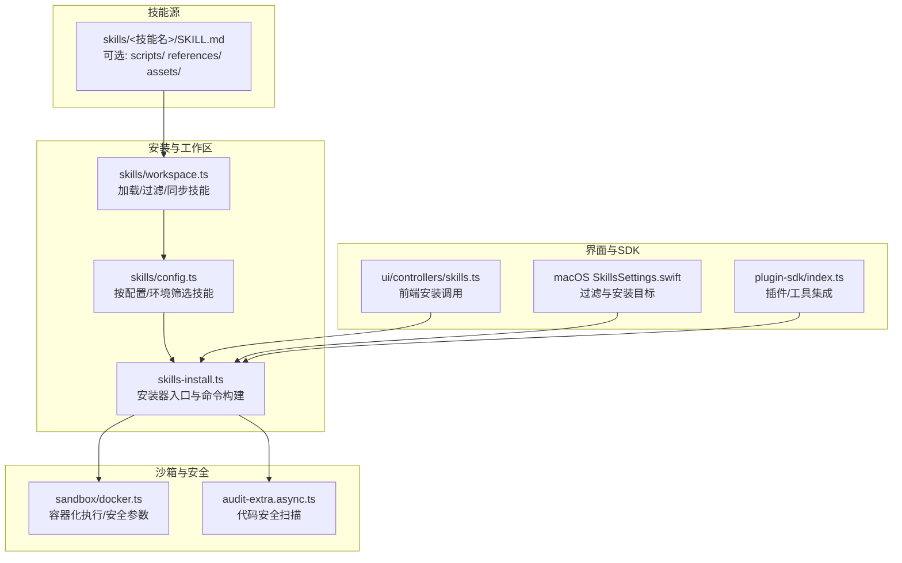
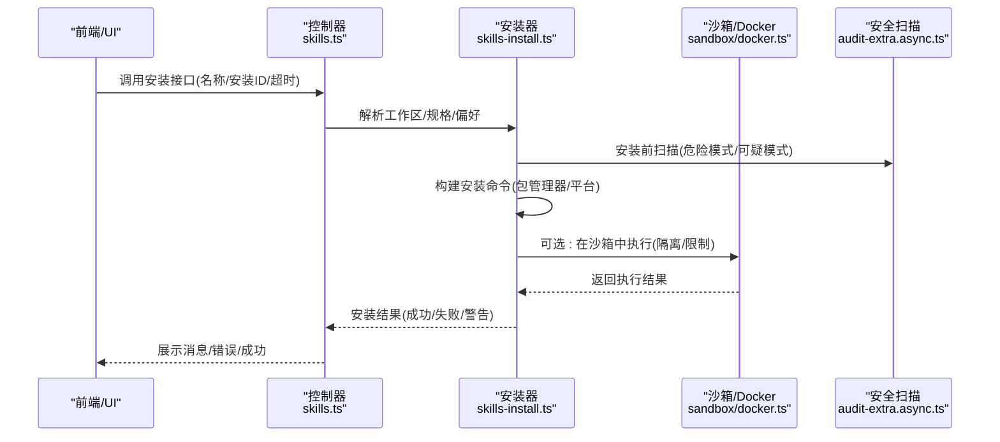
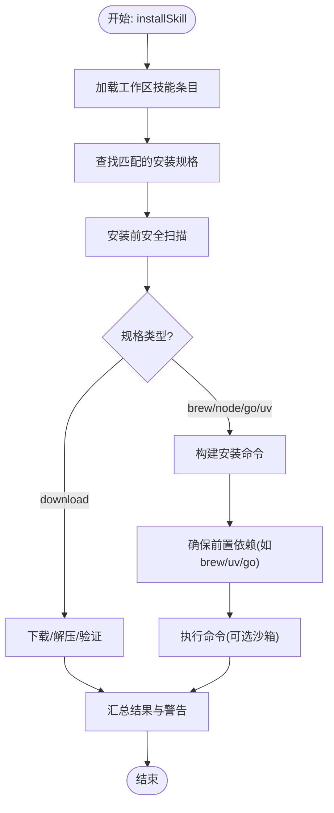
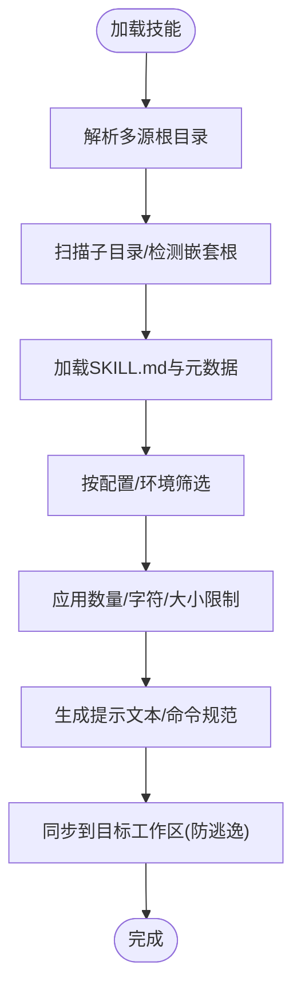
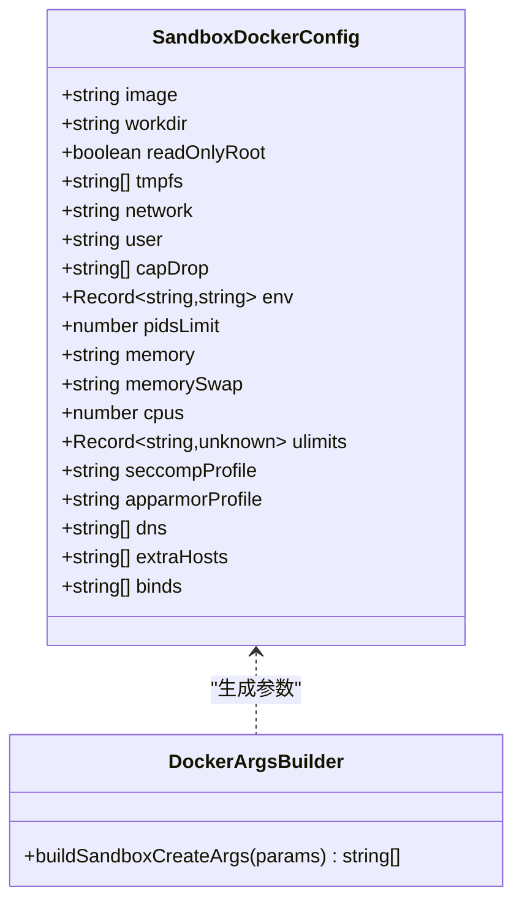
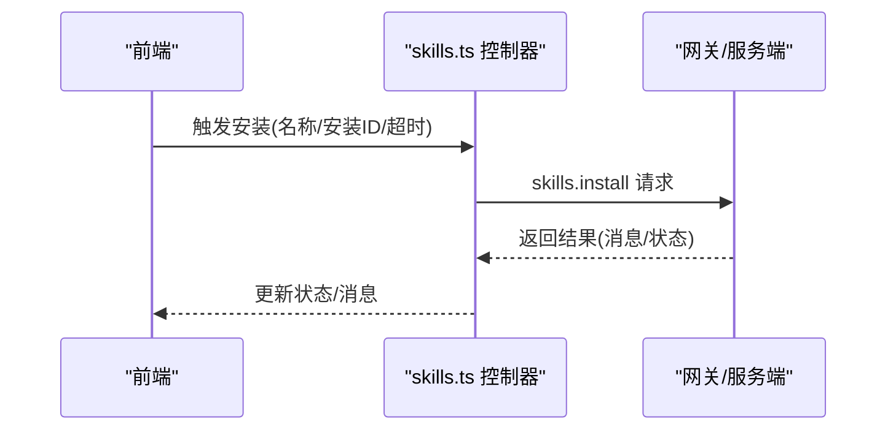
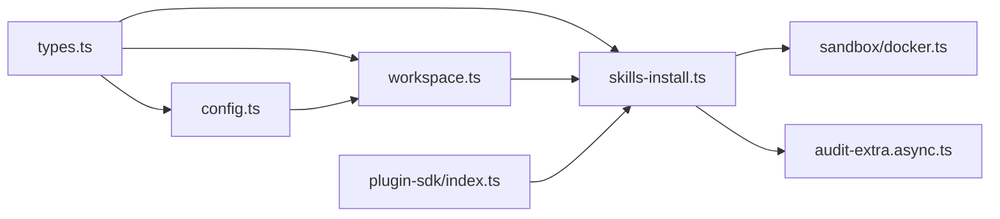

# 代理技能管理

<cite>
**本文引用的文件**
- [src/agents/skills-install.ts](file://src/agents/skills-install.ts)
- [src/agents/skills.ts](file://src/agents/skills.ts)
- [src/agents/skills/types.ts](file://src/agents/skills/types.ts)
- [src/agents/skills/workspace.ts](file://src/agents/skills/workspace.ts)
- [src/agents/skills/config.ts](file://src/agents/skills/config.ts)
- [src/agents/sandbox/docker.ts](file://src/agents/sandbox/docker.ts)
- [src/agents/sandbox-create-args.test.ts](file://src/agents/sandbox-create-args.test.ts)
- [src/plugin-sdk/index.ts](file://src/plugin-sdk/index.ts)
- [ui/src/ui/controllers/skills.ts](file://ui/src/ui/controllers/skills.ts)
- [apps/macos/Sources/OpenClaw/SkillsSettings.swift](file://apps/macos/Sources/OpenClaw/SkillsSettings.swift)
- [skills/skill-creator/SKILL.md](file://skills/skill-creator/SKILL.md)
- [src/security/audit-extra.async.ts](file://src/security/audit-extra.async.ts)
</cite>

## 目录
1. [简介](#简介)
2. [项目结构](#项目结构)
3. [核心组件](#核心组件)
4. [架构总览](#架构总览)
5. [详细组件分析](#详细组件分析)
6. [依赖分析](#依赖分析)
7. [性能考量](#性能考量)
8. [故障排除指南](#故障排除指南)
9. [结论](#结论)
10. [附录](#附录)

## 简介
本技术文档面向“代理技能管理系统”，系统性阐述技能体系的设计理念、安装机制与生命周期管理；详解安装流程（下载、解压、校验与注册）、配置管理（参数、依赖与冲突处理）、状态监控（安装与运行状态、错误报告）以及开发指南（接口规范、模板与测试方法）。同时覆盖安全层面（沙箱执行、权限控制与资源限制），并提供最佳实践与排障建议。

## 项目结构
围绕技能管理的关键目录与文件：
- 技能定义与工作区：skills 目录下各技能包（含 SKILL.md 与可选资源）
- 核心安装逻辑：src/agents/skills-install.ts
- 技能元数据与类型：src/agents/skills/types.ts、src/agents/skills/config.ts、src/agents/skills/workspace.ts
- 沙箱与安全：src/agents/sandbox/docker.ts、src/agents/sandbox-create-args.test.ts
- 开发工具：skills/skill-creator/SKILL.md
- 安全审计：src/security/audit-extra.async.ts
- 前端与桌面端：ui/src/ui/controllers/skills.ts、apps/macos/Sources/OpenClaw/SkillsSettings.swift
- 插件 SDK：src/plugin-sdk/index.ts

图表来源
- [src/agents/skills/workspace.ts:292-527](file://src/agents/skills/workspace.ts#L292-L527)
- [src/agents/skills/config.ts:71-103](file://src/agents/skills/config.ts#L71-L103)
- [src/agents/skills-install.ts:392-471](file://src/agents/skills-install.ts#L392-L471)
- [src/agents/sandbox/docker.ts:317-427](file://src/agents/sandbox/docker.ts#L317-L427)
- [src/security/audit-extra.async.ts:1268-1314](file://src/security/audit-extra.async.ts#L1268-L1314)
- [ui/src/ui/controllers/skills.ts:125-157](file://ui/src/ui/controllers/skills.ts#L125-L157)
- [apps/macos/Sources/OpenClaw/SkillsSettings.swift:111-166](file://apps/macos/Sources/OpenClaw/SkillsSettings.swift#L111-L166)
- [src/plugin-sdk/index.ts:645-646](file://src/plugin-sdk/index.ts#L645-L646)

章节来源
- [src/agents/skills/workspace.ts:292-527](file://src/agents/skills/workspace.ts#L292-L527)
- [src/agents/skills/config.ts:71-103](file://src/agents/skills/config.ts#L71-L103)
- [src/agents/skills-install.ts:392-471](file://src/agents/skills-install.ts#L392-L471)
- [src/agents/sandbox/docker.ts:317-427](file://src/agents/sandbox/docker.ts#L317-L427)
- [src/security/audit-extra.async.ts:1268-1314](file://src/security/audit-extra.async.ts#L1268-L1314)
- [ui/src/ui/controllers/skills.ts:125-157](file://ui/src/ui/controllers/skills.ts#L125-L157)
- [apps/macos/Sources/OpenClaw/SkillsSettings.swift:111-166](file://apps/macos/Sources/OpenClaw/SkillsSettings.swift#L111-L166)
- [src/plugin-sdk/index.ts:645-646](file://src/plugin-sdk/index.ts#L645-L646)

## 核心组件
- 技能类型与元数据：定义安装规格、触发条件、依赖与环境要求等
- 工作区加载与过滤：从多源路径加载技能，按配置与环境筛选，生成提示与命令规范
- 安装器：解析安装规格，构建命令，执行安装，收集警告与结果
- 沙箱执行：以受限容器运行，严格控制网络、权限、资源与环境变量
- 安全扫描：静态检查危险模式，输出告警与修复建议
- 前端与桌面端：提供安装触发、状态展示与过滤能力
- 插件 SDK：暴露工具与类型，便于扩展与集成

章节来源
- [src/agents/skills/types.ts:3-33](file://src/agents/skills/types.ts#L3-L33)
- [src/agents/skills/workspace.ts:567-638](file://src/agents/skills/workspace.ts#L567-L638)
- [src/agents/skills-install.ts:392-471](file://src/agents/skills-install.ts#L392-L471)
- [src/agents/sandbox/docker.ts:317-427](file://src/agents/sandbox/docker.ts#L317-L427)
- [src/security/audit-extra.async.ts:1268-1314](file://src/security/audit-extra.async.ts#L1268-L1314)
- [ui/src/ui/controllers/skills.ts:125-157](file://ui/src/ui/controllers/skills.ts#L125-L157)
- [apps/macos/Sources/OpenClaw/SkillsSettings.swift:111-166](file://apps/macos/Sources/OpenClaw/SkillsSettings.swift#L111-L166)
- [src/plugin-sdk/index.ts:645-646](file://src/plugin-sdk/index.ts#L645-L646)

## 架构总览
技能管理贯穿“发现—筛选—安装—执行—监控—审计”的闭环。前端触发安装请求，后端解析规格并构建命令，必要时通过沙箱执行，安装完成后刷新技能快照并返回结果；同时对技能源进行安全扫描与合规检查。

图表来源
- [ui/src/ui/controllers/skills.ts:125-157](file://ui/src/ui/controllers/skills.ts#L125-L157)
- [src/agents/skills-install.ts:392-471](file://src/agents/skills-install.ts#L392-L471)
- [src/agents/sandbox/docker.ts:317-427](file://src/agents/sandbox/docker.ts#L317-L427)
- [src/security/audit-extra.async.ts:1268-1314](file://src/security/audit-extra.async.ts#L1268-L1314)

## 详细组件分析

### 组件A：技能安装器（skills-install.ts）
职责与流程：
- 解析工作区技能条目，定位目标技能与安装规格
- 收集安装前安全扫描警告
- 根据规格(kind)构建命令（brew/npm/go/uv/download）
- 处理前置依赖（如 brew/uv/go 的自动安装）
- 执行命令并格式化结果，返回成功或失败信息及警告

图表来源
- [src/agents/skills-install.ts:392-471](file://src/agents/skills-install.ts#L392-L471)
- [src/agents/skills-install.ts:421-424](file://src/agents/skills-install.ts#L421-L424)
- [src/agents/skills-install.ts:426-469](file://src/agents/skills-install.ts#L426-L469)

章节来源
- [src/agents/skills-install.ts:392-471](file://src/agents/skills-install.ts#L392-L471)

### 组件B：技能工作区与筛选（workspace.ts、config.ts）
职责与流程：
- 从多源目录加载技能，支持嵌套根目录探测与大小限制
- 过滤策略：按配置禁用、按允许清单放行、按运行时环境与依赖评估
- 生成技能提示文本与命令规范，限制数量与字符数
- 同步技能到目标工作区，避免路径逃逸与同名冲突

图表来源
- [src/agents/skills/workspace.ts:292-527](file://src/agents/skills/workspace.ts#L292-L527)
- [src/agents/skills/workspace.ts:529-565](file://src/agents/skills/workspace.ts#L529-L565)
- [src/agents/skills/workspace.ts:710-766](file://src/agents/skills/workspace.ts#L710-L766)
- [src/agents/skills/config.ts:71-103](file://src/agents/skills/config.ts#L71-L103)

章节来源
- [src/agents/skills/workspace.ts:292-527](file://src/agents/skills/workspace.ts#L292-L527)
- [src/agents/skills/workspace.ts:529-565](file://src/agents/skills/workspace.ts#L529-L565)
- [src/agents/skills/workspace.ts:710-766](file://src/agents/skills/workspace.ts#L710-L766)
- [src/agents/skills/config.ts:71-103](file://src/agents/skills/config.ts#L71-L103)

### 组件C：沙箱与安全（sandbox/docker.ts、audit-extra.async.ts）
职责与流程：
- 沙箱：构建容器创建参数，启用只读根、tmpfs、网络隔离、能力降级、seccomp/apparmor 等安全选项，并限制 CPU/内存/PIDs/ulimits
- 安全扫描：对技能源进行静态扫描，识别危险/可疑模式，输出聚合报告与修复建议

图表来源
- [src/agents/sandbox/docker.ts:317-427](file://src/agents/sandbox/docker.ts#L317-L427)
- [src/agents/sandbox-create-args.test.ts:41-73](file://src/agents/sandbox-create-args.test.ts#L41-L73)

章节来源
- [src/agents/sandbox/docker.ts:317-427](file://src/agents/sandbox/docker.ts#L317-L427)
- [src/agents/sandbox-create-args.test.ts:41-73](file://src/agents/sandbox-create-args.test.ts#L41-L73)
- [src/security/audit-extra.async.ts:1268-1314](file://src/security/audit-extra.async.ts#L1268-L1314)

### 组件D：前端与桌面端（UI 控制器与 macOS 设置）
职责与流程：
- 前端：发起安装请求，设置忙碌态/错误态，刷新技能列表并展示消息
- 桌面端：提供技能过滤（全部/就绪/待配置/已禁用）与安装目标选择（网关/本地）

图表来源
- [ui/src/ui/controllers/skills.ts:125-157](file://ui/src/ui/controllers/skills.ts#L125-L157)

章节来源
- [ui/src/ui/controllers/skills.ts:125-157](file://ui/src/ui/controllers/skills.ts#L125-L157)
- [apps/macos/Sources/OpenClaw/SkillsSettings.swift:111-166](file://apps/macos/Sources/OpenClaw/SkillsSettings.swift#L111-L166)

### 组件E：技能开发指南（skill-creator/SKILL.md）
- 设计原则：简洁、自由度适配任务复杂度、渐进式披露（元数据/正文/资源）
- 结构规范：必需 SKILL.md 与可选 scripts/references/assets
- 创建流程：理解需求→规划资源→初始化→编辑→打包→迭代
- 包装规则：自动校验、禁止符号链接、生成 .skill 文件

章节来源
- [skills/skill-creator/SKILL.md:1-373](file://skills/skill-creator/SKILL.md#L1-L373)

## 依赖分析
- 类型与元数据：OpenClawSkillMetadata、SkillInstallSpec、SkillEntry 等
- 工作区与筛选：依赖 pi-coding-agent 加载技能、配置与环境评估
- 安装器：依赖包管理器（brew/npm/pnpm/yarn/bun/go/uv）与系统二进制
- 沙箱：依赖 Docker 命令与安全参数校验
- 安全：依赖静态扫描模块与审计流程
- 插件 SDK：导出工具类型与运行时接口，供扩展使用

图表来源
- [src/agents/skills/types.ts:3-33](file://src/agents/skills/types.ts#L3-L33)
- [src/agents/skills/workspace.ts:292-527](file://src/agents/skills/workspace.ts#L292-L527)
- [src/agents/skills/config.ts:71-103](file://src/agents/skills/config.ts#L71-L103)
- [src/agents/skills-install.ts:392-471](file://src/agents/skills-install.ts#L392-L471)
- [src/agents/sandbox/docker.ts:317-427](file://src/agents/sandbox/docker.ts#L317-L427)
- [src/security/audit-extra.async.ts:1268-1314](file://src/security/audit-extra.async.ts#L1268-L1314)
- [src/plugin-sdk/index.ts:645-646](file://src/plugin-sdk/index.ts#L645-L646)

章节来源
- [src/agents/skills/types.ts:3-33](file://src/agents/skills/types.ts#L3-L33)
- [src/agents/skills/workspace.ts:292-527](file://src/agents/skills/workspace.ts#L292-L527)
- [src/agents/skills/config.ts:71-103](file://src/agents/skills/config.ts#L71-L103)
- [src/agents/skills-install.ts:392-471](file://src/agents/skills-install.ts#L392-L471)
- [src/agents/sandbox/docker.ts:317-427](file://src/agents/sandbox/docker.ts#L317-L427)
- [src/security/audit-extra.async.ts:1268-1314](file://src/security/audit-extra.async.ts#L1268-L1314)
- [src/plugin-sdk/index.ts:645-646](file://src/plugin-sdk/index.ts#L645-L646)

## 性能考量
- 技能加载限制：候选上限、单源加载上限、提示字符上限、单文件大小限制，避免上下文膨胀与 I/O 压力
- 并行与批处理：在安全扫描与批量安装中采用分批并行，降低整体耗时
- 沙箱热复用：容器热窗口内延迟重建，减少重复创建成本
- 路径与符号链接：严格路径约束与 realpath 校验，避免无效遍历与逃逸

章节来源
- [src/agents/skills/workspace.ts:139-149](file://src/agents/skills/workspace.ts#L139-L149)
- [src/agents/skills/workspace.ts:355-376](file://src/agents/skills/workspace.ts#L355-L376)
- [src/agents/sandbox/docker.ts:530-543](file://src/agents/sandbox/docker.ts#L530-L543)

## 故障排除指南
常见问题与处理：
- 安装失败（命令退出码非零）：检查安装命令构建与前置依赖（brew/uv/go），查看标准输出/错误流
- Homebrew 缺失：根据平台提示安装或改用其他包管理器
- Go/uv 自动安装失败：检查 apt/sudo 权限或手动安装
- 安全扫描告警：对危险/可疑模式逐项审查，必要时移除或替换不安全实现
- 沙箱不可用：确认 Docker 可用且路径正确，或关闭沙箱模式
- 前端无响应：检查请求超时与连接状态，重试或刷新页面

章节来源
- [src/agents/skills-install.ts:247-283](file://src/agents/skills-install.ts#L247-L283)
- [src/agents/skills-install.ts:285-367](file://src/agents/skills-install.ts#L285-L367)
- [src/agents/skills-install.ts:369-390](file://src/agents/skills-install.ts#L369-L390)
- [src/security/audit-extra.async.ts:1268-1314](file://src/security/audit-extra.async.ts#L1268-L1314)
- [src/agents/sandbox/docker.ts:105-125](file://src/agents/sandbox/docker.ts#L105-L125)
- [ui/src/ui/controllers/skills.ts:125-157](file://ui/src/ui/controllers/skills.ts#L125-L157)

## 结论
该技能管理体系以“可发现、可筛选、可安装、可执行、可审计”为核心，结合沙箱与安全扫描保障运行安全，通过严格的加载与限制策略优化性能与稳定性。前端与桌面端提供直观的操作体验，插件 SDK 则为生态扩展奠定基础。建议在生产环境中启用沙箱与安全扫描，并遵循开发指南与最佳实践。

## 附录

### 技能接口规范与开发模板
- 接口规范：参考类型定义与元数据字段，明确安装规格、依赖与触发条件
- 开发模板：使用 skill-creator 初始化技能目录，按步骤完善 SKILL.md 与资源
- 测试方法：对脚本进行实际运行验证，确保输出符合预期

章节来源
- [src/agents/skills/types.ts:3-33](file://src/agents/skills/types.ts#L3-L33)
- [skills/skill-creator/SKILL.md:263-373](file://skills/skill-creator/SKILL.md#L263-L373)
- [skills/skill-creator/SKILL.md:315-334](file://skills/skill-creator/SKILL.md#L315-L334)

### 安装流程（下载/解压/验证/注册）
- 下载/解压/验证：针对 download 类型的安装规格，先进行下载与解压，再收集扫描警告
- 注册：安装完成后刷新技能快照，前端展示成功/错误消息

章节来源
- [src/agents/skills-install.ts:421-424](file://src/agents/skills-install.ts#L421-L424)
- [ui/src/ui/controllers/skills.ts:125-157](file://ui/src/ui/controllers/skills.ts#L125-L157)

### 配置管理（参数/依赖/冲突）
- 参数：通过 OpenClawConfig 的 skills.install 与 skills.limits 控制安装偏好与加载限制
- 依赖：按 requires.bins/env/config 与运行时平台评估是否可用
- 冲突：多源合并时按优先级覆盖，避免同名冲突并记录日志

章节来源
- [src/agents/skills.ts:36-46](file://src/agents/skills.ts#L36-L46)
- [src/agents/skills/config.ts:71-103](file://src/agents/skills/config.ts#L71-L103)
- [src/agents/skills/workspace.ts:489-526](file://src/agents/skills/workspace.ts#L489-L526)

### 状态监控（安装/运行/错误）
- 安装状态：安装器返回 ok/code/stdout/stderr/message，前端显示成功/错误消息
- 运行状态：通过技能快照与过滤器展示就绪/待配置/禁用状态
- 错误报告：安全扫描与安装失败均输出详细告警与修复建议

章节来源
- [src/agents/skills-install.ts:209-218](file://src/agents/skills-install.ts#L209-L218)
- [src/agents/skills/workspace.ts:567-584](file://src/agents/skills/workspace.ts#L567-L584)
- [apps/macos/Sources/OpenClaw/SkillsSettings.swift:111-166](file://apps/macos/Sources/OpenClaw/SkillsSettings.swift#L111-L166)
- [src/security/audit-extra.async.ts:1268-1314](file://src/security/audit-extra.async.ts#L1268-L1314)

### 安全考虑（沙箱/权限/资源限制）
- 沙箱执行：只读根、tmpfs、网络 none、能力降级、seccomp/apparmor、DNS/hosts 限制
- 权限控制：用户/组、cap-drop、no-new-privileges
- 资源限制：CPU、内存、PIDs、ulimits

章节来源
- [src/agents/sandbox/docker.ts:317-427](file://src/agents/sandbox/docker.ts#L317-L427)
- [src/agents/sandbox-create-args.test.ts:41-73](file://src/agents/sandbox-create-args.test.ts#L41-L73)