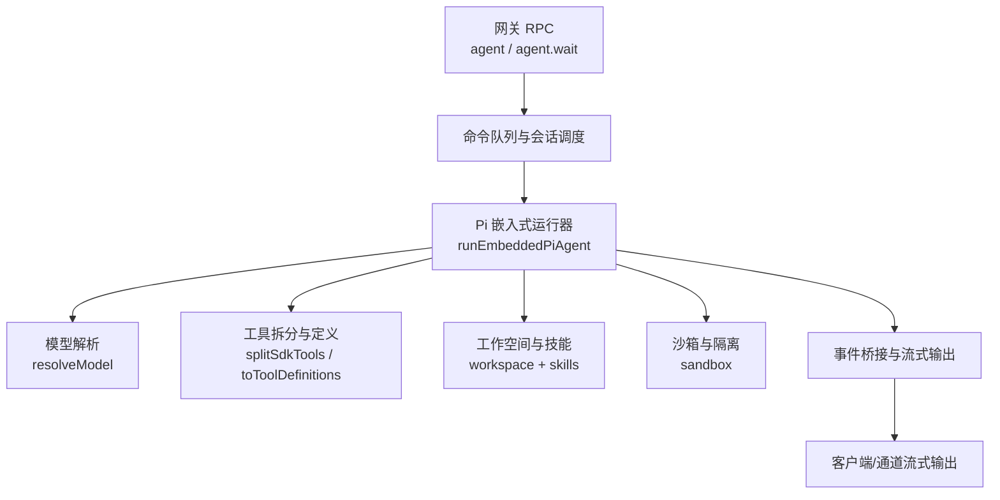
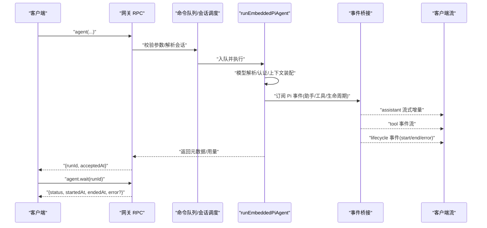
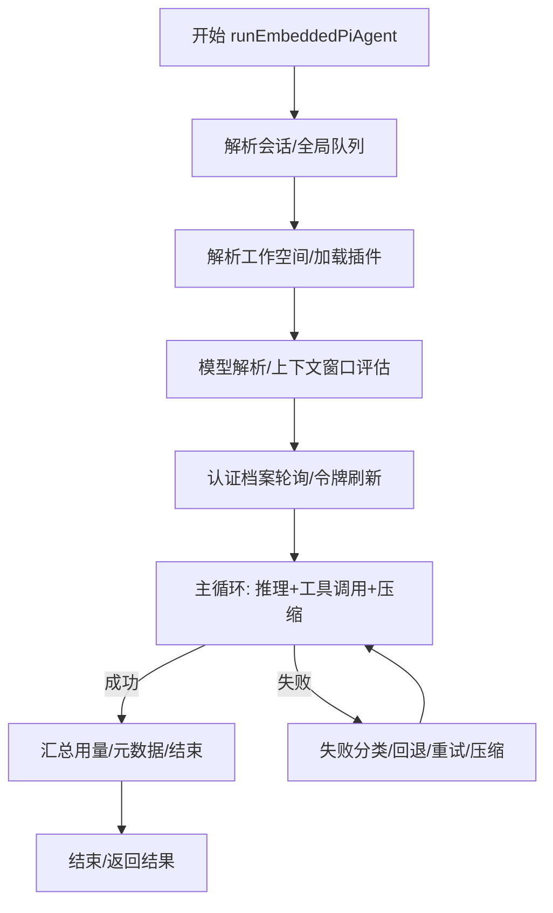
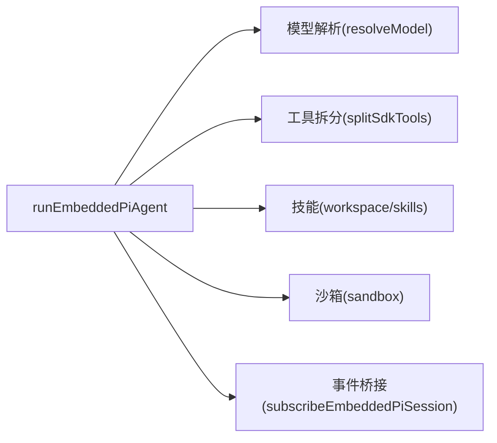

# 代理运行时

<cite>
**本文引用的文件**
- [src/agents/pi-embedded-runner.ts](file://src/agents/pi-embedded-runner.ts)
- [src/agents/sandbox.ts](file://src/agents/sandbox.ts)
- [src/agents/skills.ts](file://src/agents/skills.ts)
- [src/agents/model-selection.ts](file://src/agents/model-selection.ts)
- [src/agents/pi-embedded-runner/run.ts](file://src/agents/pi-embedded-runner/run.ts)
- [src/agents/pi-embedded-runner/runs.ts](file://src/agents/pi-embedded-runner/runs.ts)
- [src/agents/pi-embedded-runner/model.ts](file://src/agents/pi-embedded-runner/model.ts)
- [src/agents/pi-embedded-runner/tool-split.ts](file://src/agents/pi-embedded-runner/tool-split.ts)
- [docs/concepts/agent-loop.md](file://docs/concepts/agent-loop.md)
- [docs/concepts/agent-workspace.md](file://docs/concepts/agent-workspace.md)
</cite>

## 目录
1. [简介](#简介)
2. [项目结构](#项目结构)
3. [核心组件](#核心组件)
4. [架构总览](#架构总览)
5. [详细组件分析](#详细组件分析)
6. [依赖关系分析](#依赖关系分析)
7. [性能考量](#性能考量)
8. [故障排查指南](#故障排查指南)
9. [结论](#结论)
10. [附录](#附录)

## 简介
本文件面向 OpenClaw 的代理运行时系统，聚焦 Pi Agent 运行时的架构与实现，覆盖以下主题：
- RPC 模式与调用链：从网关 RPC 到嵌入式 Pi 运行器的端到端路径
- 工具流式传输与块流式传输：事件桥接、分块与增量输出
- 代理作用域管理：生命周期、状态管理、资源隔离（沙箱）
- 代理工作空间：根目录、注入提示文件、技能管理
- 代理循环机制：消息处理、思考过程、响应生成的完整流程
- 代理配置选项：模型选择、思考级别、输出策略
- 代理工具系统：注册、调用机制与结果处理
- 最佳实践与性能优化建议

## 项目结构
OpenClaw 的代理运行时由“网关 RPC 入口 + 嵌入式 Pi 运行器 + 工具与模型解析 + 沙箱与工作空间 + 技能与提示注入”等模块协同组成。下图给出与本文相关的核心模块关系。

图表来源
- [src/agents/pi-embedded-runner/run.ts:255-800](file://src/agents/pi-embedded-runner/run.ts#L255-L800)
- [src/agents/pi-embedded-runner/model.ts:257-281](file://src/agents/pi-embedded-runner/model.ts#L257-L281)
- [src/agents/pi-embedded-runner/tool-split.ts:8-17](file://src/agents/pi-embedded-runner/tool-split.ts#L8-L17)
- [src/agents/sandbox.ts:1-45](file://src/agents/sandbox.ts#L1-L45)
- [src/agents/skills.ts:1-47](file://src/agents/skills.ts#L1-L47)
- [docs/concepts/agent-loop.md:18-44](file://docs/concepts/agent-loop.md#L18-L44)

章节来源
- [docs/concepts/agent-loop.md:1-149](file://docs/concepts/agent-loop.md#L1-L149)

## 核心组件
- Pi 嵌入式运行器入口与导出
  - 提供运行、中止、等待结束、历史限制、系统提示覆盖、工具拆分等能力
- 模型解析与认证
  - 解析模型、应用配置覆盖、发现认证存储与模型注册表
- 工具系统
  - 将 SDK 工具统一转换为自定义工具定义，便于策略过滤与沙箱集成
- 沙箱与隔离
  - 配置解析、容器生命周期、运行时状态与工具策略
- 技能与工作空间
  - 技能加载与提示构建、工作空间布局与注入文件
- 代理循环与事件流
  - 入口、排队与并发控制、提示组装、钩子拦截、流式输出与收尾

章节来源
- [src/agents/pi-embedded-runner.ts:1-29](file://src/agents/pi-embedded-runner.ts#L1-L29)
- [src/agents/pi-embedded-runner/model.ts:257-281](file://src/agents/pi-embedded-runner/model.ts#L257-L281)
- [src/agents/pi-embedded-runner/tool-split.ts:8-17](file://src/agents/pi-embedded-runner/tool-split.ts#L8-L17)
- [src/agents/sandbox.ts:1-45](file://src/agents/sandbox.ts#L1-L45)
- [src/agents/skills.ts:1-47](file://src/agents/skills.ts#L1-L47)

## 架构总览
下图展示一次典型 RPC 调用如何驱动嵌入式 Pi 运行器完成一次完整的代理循环，并通过事件桥接向客户端推送流式输出。

图表来源
- [docs/concepts/agent-loop.md:18-44](file://docs/concepts/agent-loop.md#L18-L44)
- [src/agents/pi-embedded-runner/run.ts:255-375](file://src/agents/pi-embedded-runner/run.ts#L255-L375)
- [src/agents/pi-embedded-runner/runs.ts:21-38](file://src/agents/pi-embedded-runner/runs.ts#L21-L38)

章节来源
- [docs/concepts/agent-loop.md:1-149](file://docs/concepts/agent-loop.md#L1-L149)

## 详细组件分析

### 组件一：RPC 模式与代理循环
- 入口与等待语义
  - 网关提供 agent 与 agent.wait 两个端点；前者立即返回 runId，后者等待生命周期结束或错误
- 循环职责
  - 参数校验、会话解析、持久化元数据、调用嵌入式运行器、在无事件情况下发出生命周期结束/错误
- 会话与工作空间准备
  - 解析并创建工作空间；根据沙箱设置可能重定向到沙箱工作区；加载技能快照并注入环境与提示；解析引导/上下文文件
- 提示组装与系统提示
  - 基于 OpenClaw 基础提示、技能提示、引导上下文与每轮覆盖构建最终系统提示；强制模型上下文窗口与压缩预留
- 钩子拦截点
  - 内部钩子（网关）与插件钩子贯穿会话与工具生命周期，支持覆盖模型、注入上下文、拦截工具调用与结果持久化
- 流式输出
  - 助手增量来自 Pi；块流可按文本结束或消息结束触发；推理流可独立或作为块回复的一部分
- 并发与排队
  - 每会话键串行化，必要时通过全局队列；聊天通道将增量缓冲为 delta，生命周期结束时发出最终消息
- 超时与早停
  - agent.wait 默认超时；运行时有默认超时并在超时后中止；可被取消信号中断

章节来源
- [docs/concepts/agent-loop.md:18-149](file://docs/concepts/agent-loop.md#L18-L149)

### 组件二：Pi 嵌入式运行器（核心执行引擎）
- 运行主流程
  - 会话/全局队列、工作空间解析、运行前插件钩子、模型解析与上下文窗口评估、认证配置与轮换、运行循环与失败回退、自动压缩与重试、用量统计与元数据构建
- 关键机制
  - 认证档案轮询与冷却探测、GitHub Copilot 令牌刷新与调度、过载回退指数退避、溢出压缩尝试上限、工具结果截断与大小限制
- 事件与流式
  - 订阅 Pi 事件并桥接到 OpenClaw 的 assistant/tool/lifecycle 流；支持消息排队、中止、等待结束
- 并发与会话隔离
  - 以会话键为队列通道，避免会话内竞态；支持探针会话标识与工作空间回退日志

图表来源
- [src/agents/pi-embedded-runner/run.ts:255-800](file://src/agents/pi-embedded-runner/run.ts#L255-L800)
- [src/agents/pi-embedded-runner/runs.ts:21-188](file://src/agents/pi-embedded-runner/runs.ts#L21-L188)

章节来源
- [src/agents/pi-embedded-runner/run.ts:255-800](file://src/agents/pi-embedded-runner/run.ts#L255-L800)
- [src/agents/pi-embedded-runner/runs.ts:1-252](file://src/agents/pi-embedded-runner/runs.ts#L1-L252)

### 组件三：模型选择与思考级别
- 模型解析
  - 发现认证存储与模型注册表；应用配置覆盖（提供商别名、基础地址、头部、推理能力、输入类型、成本、上下文窗口、最大输出等）；前向兼容回退；特定代理（如 OpenRouter）直通代理
- 思考级别默认值
  - 支持 per-model 覆盖与全局默认；对特定供应商/型号族（如 Claude 4.6）采用自适应；具备推理能力的模型默认低思考级别
- 输出策略
  - 根据消息通道能力选择工具结果格式（纯文本或 Markdown）

章节来源
- [src/agents/pi-embedded-runner/model.ts:155-281](file://src/agents/pi-embedded-runner/model.ts#L155-L281)
- [src/agents/model-selection.ts:567-608](file://src/agents/model-selection.ts#L567-L608)

### 组件四：工具系统（注册、调用与结果处理）
- 工具拆分与定义
  - 将 SDK 工具统一转换为自定义工具定义，确保策略过滤、沙箱集成与扩展工具集一致
- 结果处理
  - 截断过大工具结果、清洗图像负载、抑制重复消息工具确认、最终聚合与去噪

章节来源
- [src/agents/pi-embedded-runner/tool-split.ts:8-17](file://src/agents/pi-embedded-runner/tool-split.ts#L8-L17)

### 组件五：代理作用域管理（生命周期、状态与资源隔离）
- 生命周期与状态
  - 运行注册/清除、活跃运行计数、等待结束、中止（单个/按模式）
- 资源隔离（沙箱）
  - 解析沙箱配置与范围、容器生命周期管理、运行时状态与工具策略、浏览器沙箱镜像与清理

章节来源
- [src/agents/pi-embedded-runner/runs.ts:1-252](file://src/agents/pi-embedded-runner/runs.ts#L1-L252)
- [src/agents/sandbox.ts:1-45](file://src/agents/sandbox.ts#L1-L45)

### 组件六：代理工作空间（概念与实现）
- 根目录与布局
  - 默认位置、按配置覆盖、沙箱工作空间差异；包含引导文件、记忆文件、技能目录、画布 UI 等
- 注入的提示文件
  - AGENTS/SOUL/USER/TOOLS/HEARTBEAT/BOOT/BOOTSTRAP 及每日记忆文件；缺失时注入占位符；大文件截断
- 技能管理
  - 加载工作区技能、合并优先级（extra < bundled < managed < 个人代理技能 < 项目代理技能 < 工作区），构建提示与命令规范，应用上限与截断策略

章节来源
- [docs/concepts/agent-workspace.md:24-125](file://docs/concepts/agent-workspace.md#L24-L125)
- [src/agents/skills.ts:26-34](file://src/agents/skills.ts#L26-L34)

## 依赖关系分析
- 运行器依赖
  - 模型解析：discoverModels/discoverAuthStorage、配置覆盖、前向兼容
  - 工具系统：SDK 工具定义适配器
  - 沙箱：容器生命周期与运行时状态
  - 技能：工作空间扫描、提示构建与命令规范
- 事件与流
  - Pi 事件订阅与桥接，形成 assistant/tool/lifecycle 三类流

图表来源
- [src/agents/pi-embedded-runner/run.ts:255-375](file://src/agents/pi-embedded-runner/run.ts#L255-L375)
- [src/agents/pi-embedded-runner/model.ts:257-281](file://src/agents/pi-embedded-runner/model.ts#L257-L281)
- [src/agents/pi-embedded-runner/tool-split.ts:8-17](file://src/agents/pi-embedded-runner/tool-split.ts#L8-L17)
- [src/agents/skills.ts:26-34](file://src/agents/skills.ts#L26-L34)
- [src/agents/sandbox.ts:1-45](file://src/agents/sandbox.ts#L1-L45)

章节来源
- [src/agents/pi-embedded-runner/run.ts:255-375](file://src/agents/pi-embedded-runner/run.ts#L255-L375)

## 性能考量
- 上下文窗口与压缩
  - 严格评估有效上下文窗口，避免溢出；自动压缩与重试，限制过度尝试次数
- 用量统计与缓存字段修正
  - 使用最后一次调用的缓存字段进行上下文估算，避免累积膨胀导致误判
- 失败回退与过载退避
  - 对过载/限流/账单等场景采用指数退避，降低瞬时压力
- 工具结果截断
  - 控制工具结果体积，减少传输与日志开销
- 队列与并发
  - 每会话串行化，避免竞态；必要时通过全局队列协调

## 故障排查指南
- 认证档案问题
  - 若所有档案处于冷却或不可用，抛出明确失败原因；支持锁定指定档案与探测冷却探针
- 模型不可用
  - 未知模型时提供本地代理提示（如 Ollama/vLLM 需要注册认证）
- 过载与限流
  - 自动退避与分级回退；检查失败原因分类与状态
- 运行中止
  - 使用中止接口按会话或模式中止；等待结束接口用于优雅收尾
- 用量与上下文
  - 检查用量归并与最后调用缓存字段修正逻辑，确保上下文估算准确

章节来源
- [src/agents/pi-embedded-runner/run.ts:543-715](file://src/agents/pi-embedded-runner/run.ts#L543-L715)
- [src/agents/pi-embedded-runner/runs.ts:46-104](file://src/agents/pi-embedded-runner/runs.ts#L46-L104)

## 结论
OpenClaw 的代理运行时以 Pi 嵌入式运行器为核心，围绕 RPC 入口、会话与工作空间、模型与工具、沙箱隔离与钩子扩展，构建了高可靠、可观测、可扩展的代理执行框架。通过严格的上下文窗口管理、自动压缩与回退、事件流式输出与生命周期治理，实现了稳定高效的代理循环。

## 附录
- 术语
  - 会话键/会话 ID：区分不同会话的标识
  - 工作空间：代理的默认工作目录，承载提示文件与技能
  - 沙箱：容器化隔离，限制工具访问范围
  - 思考级别：模型推理深度的策略开关
- 参考
  - 代理循环概念文档
  - 代理工作空间概念文档