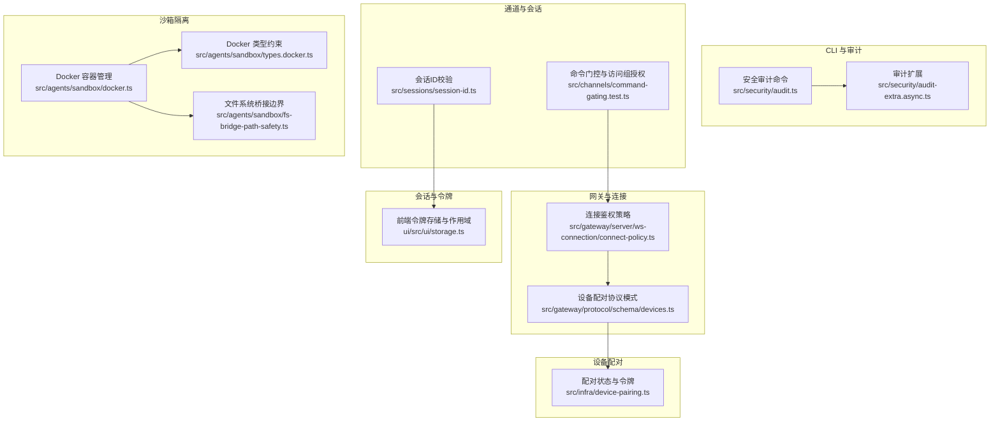
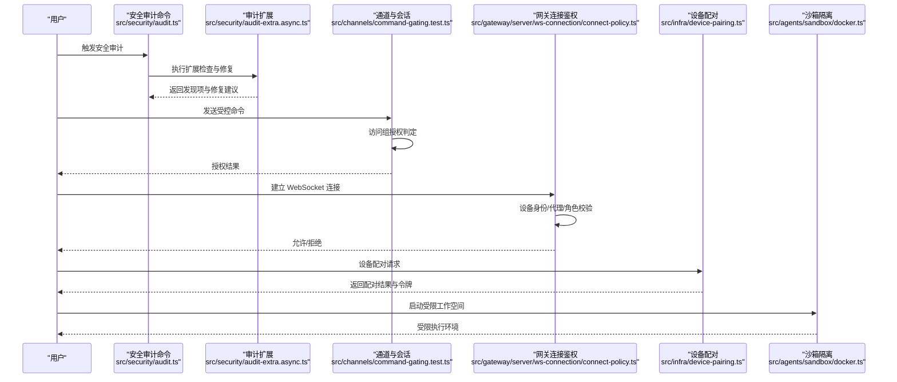
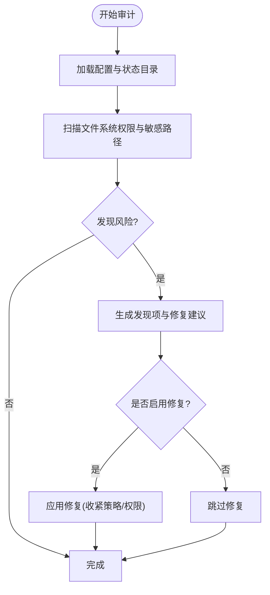
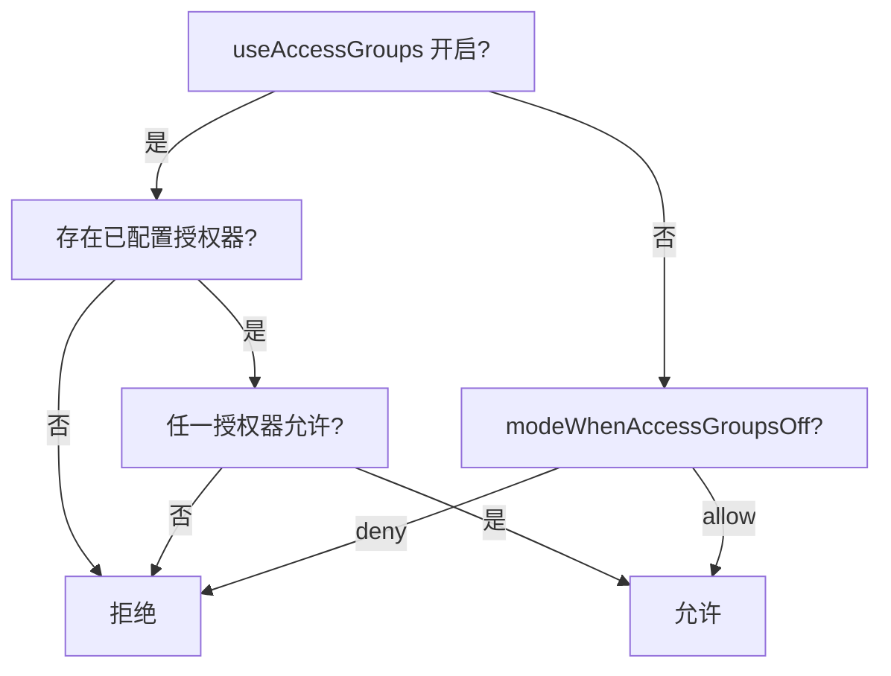
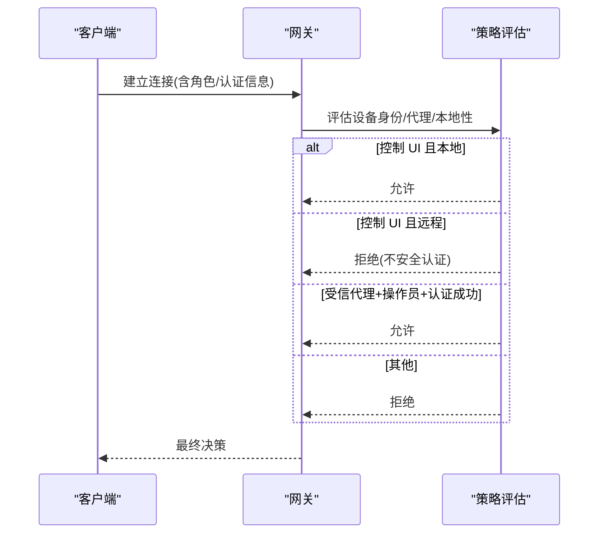
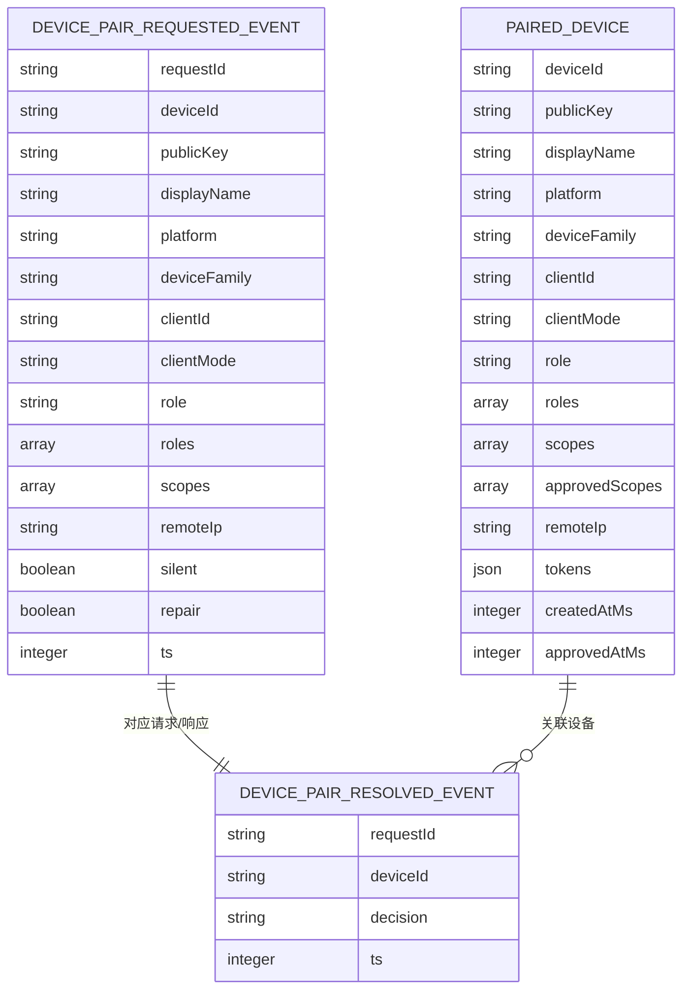
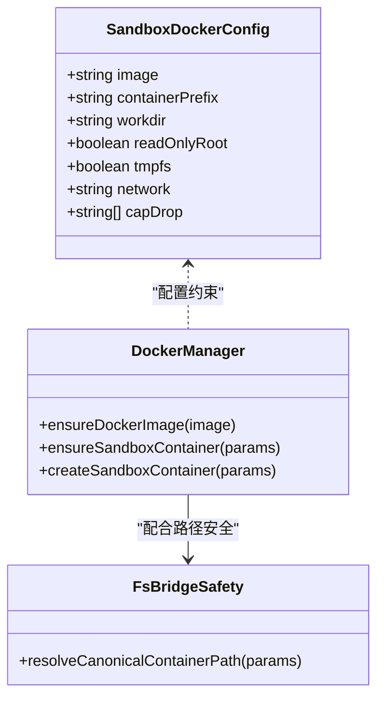
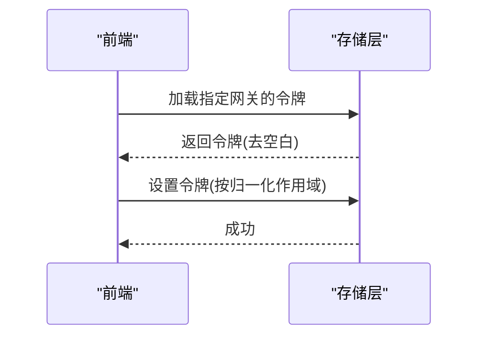
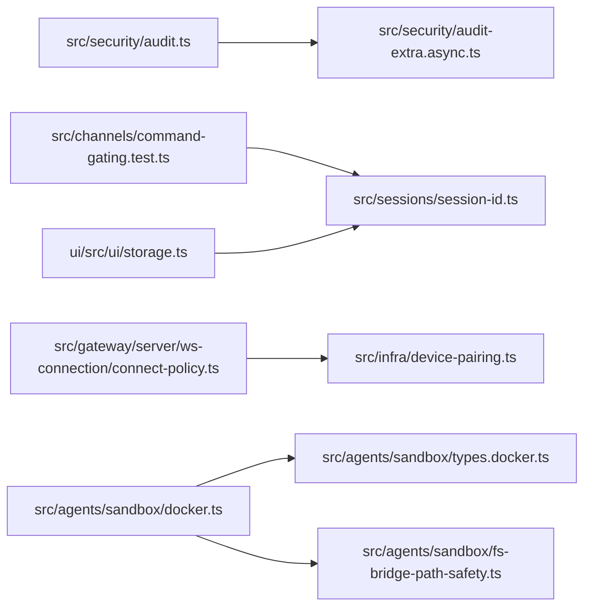

# 安全和权限

<cite>
**本文引用的文件**
- [安全审计入口](file://docs/zh-CN/cli/security.md)
- [安全审计命令实现](file://src/security/audit.ts)
- [安全审计扩展实现](file://src/security/audit-extra.async.ts)
- [通道访问组授权判定](file://src/channels/command-gating.test.ts)
- [WebSocket 连接鉴权策略](file://src/gateway/server/ws-connection/connect-policy.ts)
- [设备配对协议模式](file://src/gateway/protocol/schema/devices.ts)
- [设备配对状态与令牌](file://src/infra/device-pairing.ts)
- [Docker 沙箱容器管理](file://src/agents/sandbox/docker.ts)
- [Docker 配置类型约束](file://src/agents/sandbox/types.docker.ts)
- [文件系统桥接边界校验](file://src/agents/sandbox/fs-bridge-path-safety.ts)
- [会话 ID 校验](file://src/sessions/session-id.ts)
- [网关令牌存储与作用域归一化](file://ui/src/ui/storage.ts)
</cite>

## 目录
1. [简介](#简介)
2. [项目结构](#项目结构)
3. [核心组件](#核心组件)
4. [架构总览](#架构总览)
5. [详细组件分析](#详细组件分析)
6. [依赖关系分析](#依赖关系分析)
7. [性能考量](#性能考量)
8. [故障排查指南](#故障排查指南)
9. [结论](#结论)
10. [附录](#附录)

## 简介
本文件面向 OpenClaw 的安全与权限体系，系统阐述安全模型设计、默认安全策略、权限控制与访问管理、认证与会话安全、设备配对与信任建立、沙箱与权限隔离（含 Docker 容器、文件系统限制与网络访问控制）、安全配置最佳实践（密钥管理、日志与审计）、常见威胁防护与应急响应流程、安全审计与合规检查指南，以及跨平台安全特性差异与注意事项。

## 项目结构
围绕“安全与权限”的关键代码分布在以下模块：
- CLI 安全审计：提供统一的安全检查与修复入口，覆盖通道策略收紧、敏感信息脱敏、文件系统权限加固等。
- 通道与会话：通过访问组授权与命令门控，限制通道级与命令级的访问范围。
- 网关与连接：基于角色、设备身份与代理策略的 WebSocket 连接鉴权。
- 设备配对：请求/响应事件、令牌生成与作用域展开、信任建立与权限授予。
- 沙箱隔离：Docker 容器生命周期、只读根文件系统、tmpfs、网络模式与能力集裁剪。
- 会话与令牌：会话标识校验、前端令牌存储与作用域归一化。

**图表来源**
- [安全审计命令实现:1-200](file://src/security/audit.ts#L1-L200)
- [安全审计扩展实现:983-1067](file://src/security/audit-extra.async.ts#L983-L1067)
- [通道访问组授权判定:1-46](file://src/channels/command-gating.test.ts#L1-L46)
- [WebSocket 连接鉴权策略:46-94](file://src/gateway/server/ws-connection/connect-policy.ts#L46-L94)
- [设备配对协议模式:38-67](file://src/gateway/protocol/schema/devices.ts#L38-L67)
- [设备配对状态与令牌:51-270](file://src/infra/device-pairing.ts#L51-L270)
- [Docker 沙箱容器管理:244-528](file://src/agents/sandbox/docker.ts#L244-L528)
- [Docker 配置类型约束:1-13](file://src/agents/sandbox/types.docker.ts#L1-L13)
- [文件系统桥接边界校验:192-223](file://src/agents/sandbox/fs-bridge-path-safety.ts#L192-L223)
- [会话 ID 校验:1-5](file://src/sessions/session-id.ts#L1-L5)
- [网关令牌存储与作用域归一化:35-70](file://ui/src/ui/storage.ts#L35-L70)

**章节来源**
- [安全审计命令实现:1-200](file://src/security/audit.ts#L1-L200)
- [安全审计扩展实现:983-1067](file://src/security/audit-extra.async.ts#L983-L1067)
- [通道访问组授权判定:1-46](file://src/channels/command-gating.test.ts#L1-L46)
- [WebSocket 连接鉴权策略:46-94](file://src/gateway/server/ws-connection/connect-policy.ts#L46-L94)
- [设备配对协议模式:38-67](file://src/gateway/protocol/schema/devices.ts#L38-L67)
- [设备配对状态与令牌:51-270](file://src/infra/device-pairing.ts#L51-L270)
- [Docker 沙箱容器管理:244-528](file://src/agents/sandbox/docker.ts#L244-L528)
- [Docker 配置类型约束:1-13](file://src/agents/sandbox/types.docker.ts#L1-L13)
- [文件系统桥接边界校验:192-223](file://src/agents/sandbox/fs-bridge-path-safety.ts#L192-L223)
- [会话 ID 校验:1-5](file://src/sessions/session-id.ts#L1-L5)
- [网关令牌存储与作用域归一化:35-70](file://ui/src/ui/storage.ts#L35-L70)

## 核心组件
- 安全审计与修复：提供统一 CLI 命令进行安全检查与自动修复，覆盖通道策略、日志敏感度、文件系统权限等。
- 通道与会话访问控制：通过访问组授权与命令门控，确保仅在允许范围内执行命令；会话 ID 校验保障会话标识有效性。
- 网关连接鉴权：基于角色、设备身份、代理认证与本地/远程客户端区分，严格控制连接与操作权限。
- 设备配对与令牌：定义配对请求/响应事件模式，支持作用域展开与令牌轮换，建立信任并授予最小权限。
- 沙箱隔离：Docker 容器只读根文件系统、tmpfs、网络模式与能力裁剪，配合文件系统桥接边界校验，限制容器内可变更面。
- 会话与令牌：前端令牌存储按作用域归一化，避免跨域污染；会话 ID 校验防止格式错误的会话标识。

**章节来源**
- [安全审计命令实现:1-200](file://src/security/audit.ts#L1-L200)
- [安全审计扩展实现:983-1067](file://src/security/audit-extra.async.ts#L983-L1067)
- [通道访问组授权判定:1-46](file://src/channels/command-gating.test.ts#L1-L46)
- [WebSocket 连接鉴权策略:46-94](file://src/gateway/server/ws-connection/connect-policy.ts#L46-L94)
- [设备配对协议模式:38-67](file://src/gateway/protocol/schema/devices.ts#L38-L67)
- [设备配对状态与令牌:51-270](file://src/infra/device-pairing.ts#L51-L270)
- [Docker 沙箱容器管理:244-528](file://src/agents/sandbox/docker.ts#L244-L528)
- [文件系统桥接边界校验:192-223](file://src/agents/sandbox/fs-bridge-path-safety.ts#L192-L223)
- [会话 ID 校验:1-5](file://src/sessions/session-id.ts#L1-L5)
- [网关令牌存储与作用域归一化:35-70](file://ui/src/ui/storage.ts#L35-L70)

## 架构总览
下图展示从 CLI 到通道、网关、设备配对与沙箱的端到端安全链路：

**图表来源**
- [安全审计命令实现:1-200](file://src/security/audit.ts#L1-L200)
- [安全审计扩展实现:983-1067](file://src/security/audit-extra.async.ts#L983-L1067)
- [通道访问组授权判定:1-46](file://src/channels/command-gating.test.ts#L1-L46)
- [WebSocket 连接鉴权策略:46-94](file://src/gateway/server/ws-connection/connect-policy.ts#L46-L94)
- [设备配对状态与令牌:51-270](file://src/infra/device-pairing.ts#L51-L270)
- [Docker 沙箱容器管理:244-528](file://src/agents/sandbox/docker.ts#L244-L528)

## 详细组件分析

### 安全审计与修复
- 统一入口：提供 openclaw security audit 及其深度扫描与自动修复选项，覆盖通道策略收紧、日志敏感度、文件系统权限等。
- 扩展检查：针对凭据目录、认证配置文件等敏感位置进行权限检查，识别可写/可读风险并给出修复建议。
- 修复策略：将开放通道策略收紧为白名单、恢复日志敏感度设置、收紧本地权限（目录与文件权限模式）。

**图表来源**
- [安全审计命令实现:1-200](file://src/security/audit.ts#L1-L200)
- [安全审计扩展实现:983-1067](file://src/security/audit-extra.async.ts#L983-L1067)

**章节来源**
- [安全审计命令实现:1-200](file://src/security/audit.ts#L1-L200)
- [安全审计扩展实现:983-1067](file://src/security/audit-extra.async.ts#L983-L1067)

### 通道与会话访问控制
- 访问组授权：当启用访问组时，若无已配置授权器，则默认拒绝；任一授权器允许则放行；当关闭时默认允许，可通过模式参数切换为拒绝。
- 会话 ID 校验：使用正则表达式校验会话标识格式，防止格式错误导致的会话混淆或注入。

**图表来源**
- [通道访问组授权判定:1-46](file://src/channels/command-gating.test.ts#L1-L46)

**章节来源**
- [通道访问组授权判定:1-46](file://src/channels/command-gating.test.ts#L1-L46)
- [会话 ID 校验:1-5](file://src/sessions/session-id.ts#L1-L5)

### 网关连接鉴权
- 控制 UI 与远程/本地客户端区分：允许本地控制 UI 在特定策略下使用不安全认证，但远程控制 UI 即使开启也不允许。
- 代理认证：当为受信代理且认证方法匹配时，允许以操作员角色接入。
- 缺失设备身份决策：根据策略返回允许、拒绝或需要设备身份等不同决策。

**图表来源**
- [WebSocket 连接鉴权策略:46-94](file://src/gateway/server/ws-connection/connect-policy.ts#L46-L94)

**章节来源**
- [WebSocket 连接鉴权策略:46-94](file://src/gateway/server/ws-connection/connect-policy.ts#L46-L94)

### 设备配对与信任建立
- 请求/响应事件模式：定义配对请求与解决事件的数据结构，包含设备标识、公钥、显示名、平台、角色、作用域、远端 IP 等。
- 作用域展开：内置作用域蕴含关系，确保请求的作用域自动展开为完整集合后进行授权判断。
- 令牌生成与轮换：为已批准设备生成令牌，记录创建时间、轮换时间、撤销时间与最后使用时间，支持后续审计与轮替。
- 列表与查询：提供列出待处理与已配对设备的能力，并按时间排序。

**图表来源**
- [设备配对协议模式:38-67](file://src/gateway/protocol/schema/devices.ts#L38-L67)
- [设备配对状态与令牌:51-270](file://src/infra/device-pairing.ts#L51-L270)

**章节来源**
- [设备配对协议模式:38-67](file://src/gateway/protocol/schema/devices.ts#L38-L67)
- [设备配对状态与令牌:51-270](file://src/infra/device-pairing.ts#L51-L270)

### 沙箱与权限隔离
- Docker 容器管理：确保镜像存在、创建/启动容器、挂载工作区与自定义绑定、执行初始化命令、按配置哈希重建容器。
- 配置类型约束：要求必须提供镜像、容器前缀、工作目录、只读根、tmpfs、网络与能力丢弃列表等关键字段。
- 文件系统桥接边界：通过容器内脚本解析规范路径，禁止越界访问，确保挂载与操作在限定范围内。
- 网络与能力：通过网络模式与能力丢弃列表降低容器逃逸与横向移动风险。

**图表来源**
- [Docker 配置类型约束:1-13](file://src/agents/sandbox/types.docker.ts#L1-L13)
- [Docker 沙箱容器管理:244-528](file://src/agents/sandbox/docker.ts#L244-L528)
- [文件系统桥接边界校验:192-223](file://src/agents/sandbox/fs-bridge-path-safety.ts#L192-L223)

**章节来源**
- [Docker 配置类型约束:1-13](file://src/agents/sandbox/types.docker.ts#L1-L13)
- [Docker 沙箱容器管理:244-528](file://src/agents/sandbox/docker.ts#L244-L528)
- [文件系统桥接边界校验:192-223](file://src/agents/sandbox/fs-bridge-path-safety.ts#L192-L223)

### 会话与令牌管理
- 会话 ID 校验：使用正则表达式校验会话标识格式，保证会话键一致性。
- 前端令牌存储：按网关 URL 归一化作用域，使用 sessionStorage 存储令牌，清理历史键，避免跨域污染。

**图表来源**
- [会话 ID 校验:1-5](file://src/sessions/session-id.ts#L1-L5)
- [网关令牌存储与作用域归一化:35-70](file://ui/src/ui/storage.ts#L35-L70)

**章节来源**
- [会话 ID 校验:1-5](file://src/sessions/session-id.ts#L1-L5)
- [网关令牌存储与作用域归一化:35-70](file://ui/src/ui/storage.ts#L35-L70)

## 依赖关系分析
- CLI 审计依赖扩展模块进行文件系统与配置检查；扩展模块依赖平台权限检测与修复工具。
- 通道门控依赖访问组授权器配置；与会话 ID 校验共同保障命令执行边界。
- 网关连接鉴权依赖设备身份、代理认证与本地性判断；与设备配对状态联动。
- 沙箱隔离依赖 Docker 管理器与文件系统桥接安全模块；类型约束确保配置完整性。
- 前端令牌存储依赖会话 ID 校验与作用域归一化，避免跨域冲突。

**图表来源**
- [安全审计命令实现:1-200](file://src/security/audit.ts#L1-L200)
- [安全审计扩展实现:983-1067](file://src/security/audit-extra.async.ts#L983-L1067)
- [通道访问组授权判定:1-46](file://src/channels/command-gating.test.ts#L1-L46)
- [WebSocket 连接鉴权策略:46-94](file://src/gateway/server/ws-connection/connect-policy.ts#L46-L94)
- [设备配对状态与令牌:51-270](file://src/infra/device-pairing.ts#L51-L270)
- [Docker 沙箱容器管理:244-528](file://src/agents/sandbox/docker.ts#L244-L528)
- [Docker 配置类型约束:1-13](file://src/agents/sandbox/types.docker.ts#L1-L13)
- [文件系统桥接边界校验:192-223](file://src/agents/sandbox/fs-bridge-path-safety.ts#L192-L223)
- [会话 ID 校验:1-5](file://src/sessions/session-id.ts#L1-L5)
- [网关令牌存储与作用域归一化:35-70](file://ui/src/ui/storage.ts#L35-L70)

**章节来源**
- [安全审计命令实现:1-200](file://src/security/audit.ts#L1-L200)
- [安全审计扩展实现:983-1067](file://src/security/audit-extra.async.ts#L983-L1067)
- [通道访问组授权判定:1-46](file://src/channels/command-gating.test.ts#L1-L46)
- [WebSocket 连接鉴权策略:46-94](file://src/gateway/server/ws-connection/connect-policy.ts#L46-L94)
- [设备配对状态与令牌:51-270](file://src/infra/device-pairing.ts#L51-L270)
- [Docker 沙箱容器管理:244-528](file://src/agents/sandbox/docker.ts#L244-L528)
- [Docker 配置类型约束:1-13](file://src/agents/sandbox/types.docker.ts#L1-L13)
- [文件系统桥接边界校验:192-223](file://src/agents/sandbox/fs-bridge-path-safety.ts#L192-L223)
- [会话 ID 校验:1-5](file://src/sessions/session-id.ts#L1-L5)
- [网关令牌存储与作用域归一化:35-70](file://ui/src/ui/storage.ts#L35-L70)

## 性能考量
- 审计扫描：优先缓存与并发检查，减少重复 I/O；修复操作按需执行，避免不必要的系统调用。
- 沙箱容器：按配置哈希判断是否重建，避免频繁重启；合理设置 tmpfs 大小与挂载点，平衡性能与安全。
- 连接鉴权：策略评估逻辑轻量，避免复杂外部依赖；对设备身份与代理认证采用快速判定。
- 令牌存储：前端使用 sessionStorage，避免持久化带来的同步开销；作用域归一化减少键冲突与查找成本。

## 故障排查指南
- 审计报告异常
  - 现象：发现凭据目录可写/可读或认证配置文件权限不当。
  - 排查：确认平台权限检测工具可用；核对修复建议的目标路径与权限模式；重新运行审计以验证修复。
  - 参考
    - [安全审计扩展实现:983-1067](file://src/security/audit-extra.async.ts#L983-L1067)
- 通道命令被拒
  - 现象：启用访问组后命令被拒绝。
  - 排查：检查授权器配置与允许列表；确认 modeWhenAccessGroupsOff 参数；核对会话 ID 格式。
  - 参考
    - [通道访问组授权判定:1-46](file://src/channels/command-gating.test.ts#L1-L46)
    - [会话 ID 校验:1-5](file://src/sessions/session-id.ts#L1-L5)
- 连接被拒绝
  - 现象：控制 UI 远程连接失败或代理认证无效。
  - 排查：确认 isControlUi 与 isLocalClient 标识；检查 trusted-proxy 认证方法；核对设备身份与角色。
  - 参考
    - [WebSocket 连接鉴权策略:46-94](file://src/gateway/server/ws-connection/connect-policy.ts#L46-L94)
- 沙箱容器问题
  - 现象：容器无法启动或挂载异常。
  - 排查：确认镜像存在并可拉取；核对只读根、tmpfs、网络与能力配置；检查文件系统桥接边界。
  - 参考
    - [Docker 沙箱容器管理:244-528](file://src/agents/sandbox/docker.ts#L244-L528)
    - [文件系统桥接边界校验:192-223](file://src/agents/sandbox/fs-bridge-path-safety.ts#L192-L223)
- 令牌加载失败
  - 现象：前端无法加载或保存令牌。
  - 排查：确认 sessionStorage 可用；核对作用域归一化逻辑；清理历史键后重试。
  - 参考
    - [网关令牌存储与作用域归一化:35-70](file://ui/src/ui/storage.ts#L35-L70)

**章节来源**
- [安全审计扩展实现:983-1067](file://src/security/audit-extra.async.ts#L983-L1067)
- [通道访问组授权判定:1-46](file://src/channels/command-gating.test.ts#L1-L46)
- [会话 ID 校验:1-5](file://src/sessions/session-id.ts#L1-L5)
- [WebSocket 连接鉴权策略:46-94](file://src/gateway/server/ws-connection/connect-policy.ts#L46-L94)
- [Docker 沙箱容器管理:244-528](file://src/agents/sandbox/docker.ts#L244-L528)
- [文件系统桥接边界校验:192-223](file://src/agents/sandbox/fs-bridge-path-safety.ts#L192-L223)
- [网关令牌存储与作用域归一化:35-70](file://ui/src/ui/storage.ts#L35-L70)

## 结论
OpenClaw 的安全与权限体系以“最小权限”为核心原则，结合 CLI 审计、通道与会话门控、网关连接鉴权、设备配对信任链、Docker 沙箱隔离与前端令牌治理，形成端到端的安全闭环。通过持续审计与修复、严格的授权与鉴权策略、细粒度的容器隔离与文件系统边界控制，以及规范的令牌与会话管理，有效降低了多平台部署与多渠道接入带来的安全风险。

## 附录
- 安全配置最佳实践
  - 密钥与证书：使用受信存储与最小暴露面；定期轮换；限制读取权限。
  - 日志与审计：启用必要的审计日志，合理设置敏感度；保留足够时间窗口用于回溯。
  - 网络与主机：限制入站/出站访问；最小化容器能力与网络权限。
  - 会话与令牌：强制会话 ID 校验；前端令牌按作用域归一化存储；避免持久化敏感令牌。
- 常见威胁与防护
  - 权限提升：通过通道访问组与命令门控限制；沙箱隔离与只读根文件系统降低逃逸风险。
  - 中间人攻击：控制 UI 与远程连接区分策略；代理认证与设备身份校验。
  - 凭据泄露：收紧凭据目录与认证配置文件权限；定期审计与修复。
- 应急响应流程
  - 发现风险：立即运行安全审计并应用修复；临时收紧通道策略与访问组。
  - 隔离与调查：暂停受影响服务；冻结相关令牌与会话；收集日志与审计证据。
  - 恢复与加固：修复漏洞；更新策略与权限；回归测试与再次审计。
- 跨平台安全注意事项
  - Windows ACL：注意权限继承与特殊用户组；使用专用工具进行权限检查与修复。
  - Docker 平台差异：镜像拉取、网络模式与能力支持因平台而异；遵循平台最佳实践。
  - 前端存储：不同浏览器的 sessionStorage 行为可能差异；统一归一化逻辑。