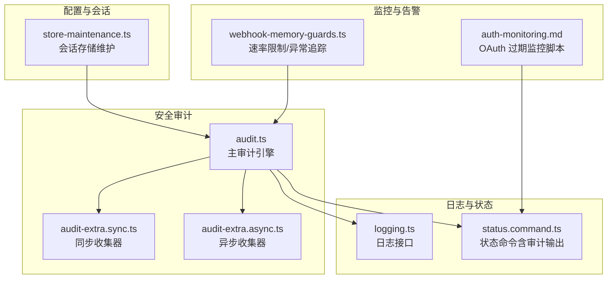
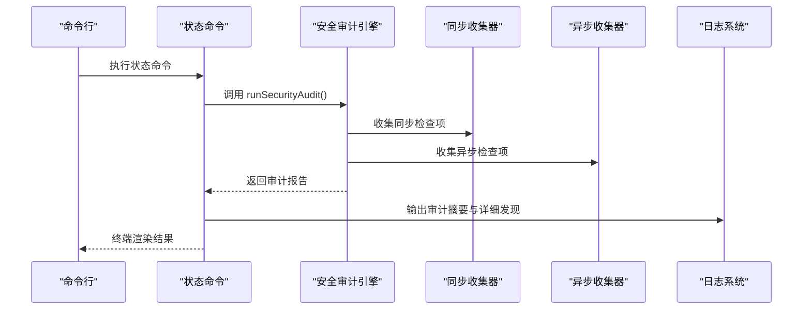
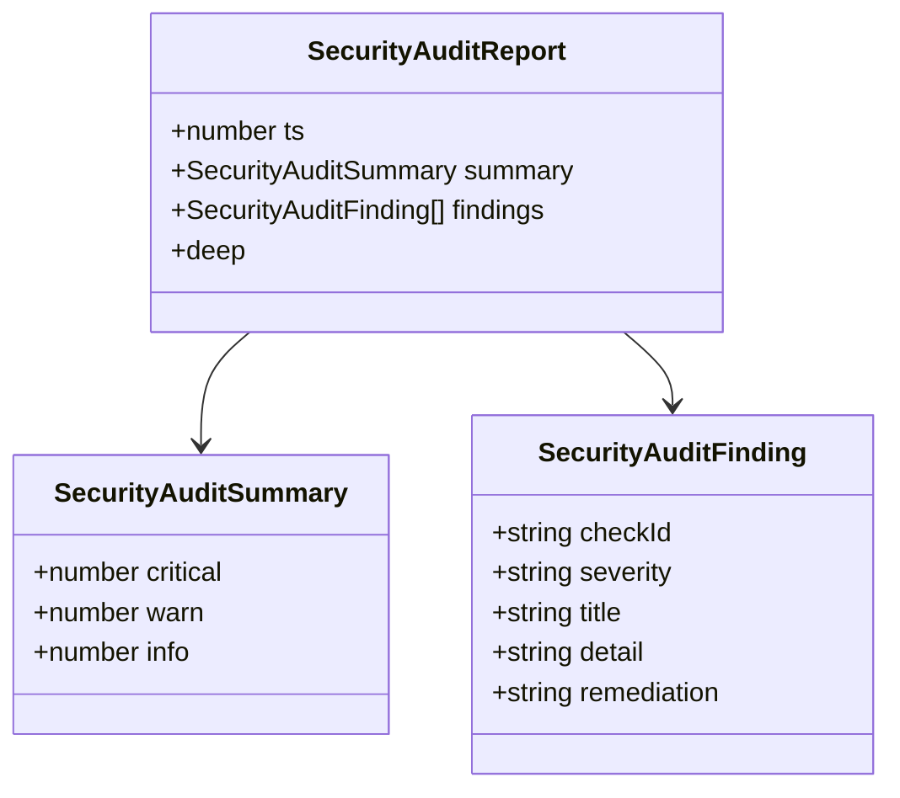
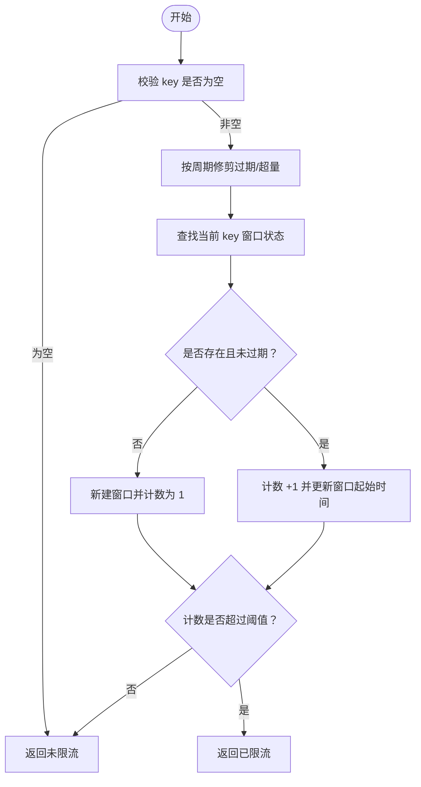
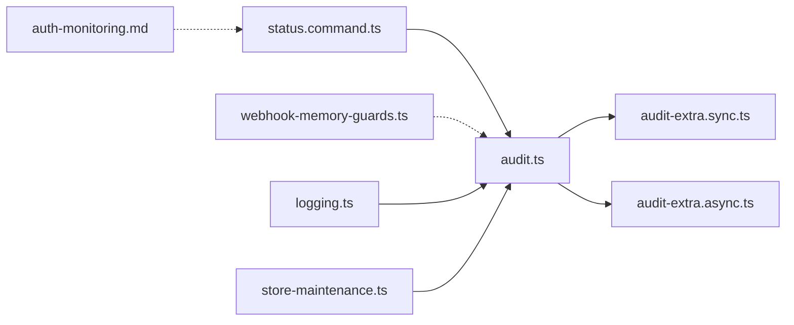

# 安全审计和监控

<cite>
**本文引用的文件**
- [src/security/audit.ts](file://src/security/audit.ts)
- [src/security/audit-extra.sync.ts](file://src/security/audit-extra.sync.ts)
- [src/security/audit-extra.async.ts](file://src/security/audit-extra.async.ts)
- [src/plugin-sdk/webhook-memory-guards.ts](file://src/plugin-sdk/webhook-memory-guards.ts)
- [src/commands/status.command.ts](file://src/commands/status.command.ts)
- [docs/cli/security.md](file://docs/cli/security.md)
- [docs/automation/auth-monitoring.md](file://docs/automation/auth-monitoring.md)
- [docs/security/THREAT-MODEL-ATLAS.md](file://docs/security/THREAT-MODEL-ATLAS.md)
- [src/config/sessions/store-maintenance.ts](file://src/config/sessions/store-maintenance.ts)
- [src/logging.ts](file://src/logging.ts)
</cite>

## 目录
1. [简介](#简介)
2. [项目结构](#项目结构)
3. [核心组件](#核心组件)
4. [架构总览](#架构总览)
5. [详细组件分析](#详细组件分析)
6. [依赖关系分析](#依赖关系分析)
7. [性能考量](#性能考量)
8. [故障排除指南](#故障排除指南)
9. [结论](#结论)
10. [附录](#附录)

## 简介
本技术文档面向 OpenClaw 的安全审计与监控体系，系统阐述以下内容：
- 审计日志的生成与收集机制：操作审计、访问审计、安全事件审计
- 审计数据的格式与结构：时间戳、用户标识、操作详情
- 实时监控与告警机制：异常检测、阈值监控、自动响应
- 审计数据的存储与保留策略：压缩、归档、删除
- 审计报告生成与分析
- 安全事件响应流程与取证程序
- 审计系统的性能影响与优化策略
- 审计配置最佳实践与故障排除

## 项目结构
OpenClaw 将安全审计与监控能力分布在多个模块中：
- 安全审计引擎：集中于安全审计主文件与同步/异步扩展收集器
- 日志系统：统一的日志接口与子系统日志路由
- 命令行状态输出：在状态命令中集成安全审计结果展示
- 插件 SDK：用于 webhook 入口的速率限制与异常追踪
- 自动化脚本：认证过期监控与告警自动化
- 配置与会话维护：会话存储的轮转与清理策略

图表来源
- [src/security/audit.ts:1131-1254](file://src/security/audit.ts#L1131-L1254)
- [src/security/audit-extra.sync.ts:528-556](file://src/security/audit-extra.sync.ts#L528-L556)
- [src/security/audit-extra.async.ts:1069-1127](file://src/security/audit-extra.async.ts#L1069-L1127)
- [src/plugin-sdk/webhook-memory-guards.ts:164-196](file://src/plugin-sdk/webhook-memory-guards.ts#L164-L196)
- [src/commands/status.command.ts:473-518](file://src/commands/status.command.ts#L473-L518)
- [docs/automation/auth-monitoring.md:1-45](file://docs/automation/auth-monitoring.md#L1-L45)
- [src/config/sessions/store-maintenance.ts:38-78](file://src/config/sessions/store-maintenance.ts#L38-L78)

章节来源
- [src/security/audit.ts:1131-1254](file://src/security/audit.ts#L1131-L1254)
- [src/commands/status.command.ts:473-518](file://src/commands/status.command.ts#L473-L518)

## 核心组件
- 安全审计引擎（runSecurityAudit）：聚合各类检查项，生成带严重性与修复建议的审计报告
- 同步/异步审计收集器：分别处理无需 I/O 的配置检查与需要 I/O 的文件系统/容器检查
- 日志系统：提供日志级别、子系统路由、文件落盘等能力，支撑审计日志与运行日志
- 状态命令：在终端输出安全审计摘要与详细发现
- Webhook 内存守卫：固定窗口速率限制与异常计数器，支持按状态码追踪
- 认证监控脚本：基于 CLI 检查模型提供商 OAuth 过期状态并可触发告警
- 会话存储维护：控制会话日志轮转与清理周期，间接影响审计数据保留

章节来源
- [src/security/audit.ts:1131-1254](file://src/security/audit.ts#L1131-L1254)
- [src/security/audit-extra.sync.ts:528-556](file://src/security/audit-extra.sync.ts#L528-L556)
- [src/security/audit-extra.async.ts:1069-1127](file://src/security/audit-extra.async.ts#L1069-L1127)
- [src/plugin-sdk/webhook-memory-guards.ts:164-196](file://src/plugin-sdk/webhook-memory-guards.ts#L164-L196)
- [docs/automation/auth-monitoring.md:1-45](file://docs/automation/auth-monitoring.md#L1-L45)
- [src/config/sessions/store-maintenance.ts:38-78](file://src/config/sessions/store-maintenance.ts#L38-L78)

## 架构总览
OpenClaw 的安全审计与监控采用“集中式审计 + 多源数据采集 + 可视化输出”的架构：
- 审计引擎负责组织检查项与汇总结果
- 同步收集器处理配置类风险（无需外部 I/O）
- 异步收集器处理文件系统、容器、插件等需要 I/O 的风险
- 日志系统为审计与运行日志提供统一出口
- 状态命令将审计结果以人类可读方式呈现
- Webhook 内存守卫在入口层进行异常检测与限流
- 认证监控脚本通过定时任务实现 OAuth 过期的持续监控

图表来源
- [src/commands/status.command.ts:87-109](file://src/commands/status.command.ts#L87-L109)
- [src/security/audit.ts:1131-1254](file://src/security/audit.ts#L1131-L1254)

## 详细组件分析

### 审计引擎与报告结构
- 报告字段：时间戳、严重性统计、发现列表、深度探测结果（可选）
- 发现字段：检查 ID、严重性、标题、详情、修复建议
- 深度探测：可选地对网关进行可达性与健康探测，并记录错误与关闭原因

图表来源
- [src/security/audit.ts:66-85](file://src/security/audit.ts#L66-L85)

章节来源
- [src/security/audit.ts:1131-1254](file://src/security/audit.ts#L1131-L1254)

### 同步审计收集器（配置类风险）
- 攻击面概要：统计各渠道组策略、工具提升权限、webhook/内部钩子启用、浏览器控制开关
- 配置敏感信息：检测配置中明文密码或令牌
- 钩子加固：令牌长度、与网关令牌复用风险、默认会话键、请求覆盖与前缀白名单
- 网关 HTTP 无认证：当认证模式为 none 且暴露到公网时发出警告
- 会话键覆盖：HTTP API 是否允许按请求覆盖会话键
- Docker 安全：默认配置了 Docker 但未启用沙箱的风险
- Node 命令策略：拒绝命令模式与危险允许命令
- 工具最小化配置覆盖：全局 minimal 被代理工具配置覆盖
- 小型模型风险：小模型（≤300B）在无沙箱且启用 web/browser 工具时的风险提示
- 暴露矩阵与多用户迹象：基于配置推断共享用户场景

章节来源
- [src/security/audit-extra.sync.ts:528-556](file://src/security/audit-extra.sync.ts#L528-L556)
- [src/security/audit-extra.sync.ts:575-603](file://src/security/audit-extra.sync.ts#L575-L603)
- [src/security/audit-extra.sync.ts:605-709](file://src/security/audit-extra.sync.ts#L605-L709)
- [src/security/audit-extra.sync.ts:711-736](file://src/security/audit-extra.sync.ts#L711-L736)
- [src/security/audit-extra.sync.ts:738-770](file://src/security/audit-extra.sync.ts#L738-L770)
- [src/security/audit-extra.sync.ts:772-800](file://src/security/audit-extra.sync.ts#L772-L800)

### 异步审计收集器（文件系统/容器/插件）
- 文件系统权限：状态目录、配置文件、会话文件、日志文件的可读/可写风险
- 浏览器沙箱容器：容器标签缺失/过期、非 loopback 端口发布
- 插件信任：未设置 allowlist、启用插件工具可能被可达、npm 安装未固定版本/缺少完整性/版本漂移
- 深度扫描：插件与技能代码安全性扫描（缓存复用）

章节来源
- [src/security/audit-extra.async.ts:1069-1127](file://src/security/audit-extra.async.ts#L1069-L1127)
- [src/security/audit-extra.async.ts:444-524](file://src/security/audit-extra.async.ts#L444-L524)
- [src/security/audit-extra.async.ts:526-755](file://src/security/audit-extra.async.ts#L526-L755)
- [src/security/audit-extra.async.ts:757-800](file://src/security/audit-extra.async.ts#L757-L800)

### 日志系统与审计日志
- 提供日志级别、子系统路由、文件落盘、控制台捕获等能力
- 审计日志与运行日志分离，便于检索与合规

章节来源
- [src/logging.ts:1-70](file://src/logging.ts#L1-L70)

### 状态命令中的审计展示
- 在状态命令中运行安全审计，输出摘要与前若干条重要发现
- 支持 JSON 输出，便于 CI/自动化工具消费

章节来源
- [src/commands/status.command.ts:473-518](file://src/commands/status.command.ts#L473-L518)
- [docs/cli/security.md:17-56](file://docs/cli/security.md#L17-L56)

### Webhook 内存守卫（异常检测与阈值监控）
- 固定窗口速率限制：按 key 维度统计请求次数，超限即限流
- 异常计数器：对指定状态码（如 400/401/408/413/415/429）进行计数，周期性记录
- TTL 与最大键数：支持 TTL 过期与最大键数裁剪，避免内存膨胀

图表来源
- [src/plugin-sdk/webhook-memory-guards.ts:51-105](file://src/plugin-sdk/webhook-memory-guards.ts#L51-L105)
- [src/plugin-sdk/webhook-memory-guards.ts:164-196](file://src/plugin-sdk/webhook-memory-guards.ts#L164-L196)

章节来源
- [src/plugin-sdk/webhook-memory-guards.ts:164-196](file://src/plugin-sdk/webhook-memory-guards.ts#L164-L196)

### OAuth 过期监控与告警自动化
- 使用 CLI 检查模型提供商 OAuth 状态，支持退出码区分过期/即将过期/正常
- 提供 systemd timer 与脚本，实现定时检查与通知（ntfy/手机）

章节来源
- [docs/automation/auth-monitoring.md:1-45](file://docs/automation/auth-monitoring.md#L1-L45)

### 会话存储维护与审计数据保留
- 会话轮转：按大小轮转，防止磁盘占用过大
- 清理策略：按时间间隔清理旧会话，支持重置归档保留期
- 影响：直接影响审计数据（会话日志）的留存周期与容量

章节来源
- [src/config/sessions/store-maintenance.ts:38-78](file://src/config/sessions/store-maintenance.ts#L38-L78)

## 依赖关系分析
- 审计引擎依赖同步/异步收集器产出的发现
- 状态命令依赖审计引擎输出并在终端渲染
- Webhook 内存守卫独立于审计引擎，但可作为入口层异常检测与限流
- 认证监控脚本与审计引擎解耦，通过 CLI 接口集成
- 日志系统为审计与运行日志提供统一出口

图表来源
- [src/security/audit.ts:1131-1254](file://src/security/audit.ts#L1131-L1254)
- [src/commands/status.command.ts:87-109](file://src/commands/status.command.ts#L87-L109)
- [src/plugin-sdk/webhook-memory-guards.ts:164-196](file://src/plugin-sdk/webhook-memory-guards.ts#L164-L196)
- [docs/automation/auth-monitoring.md:1-45](file://docs/automation/auth-monitoring.md#L1-L45)
- [src/logging.ts:1-70](file://src/logging.ts#L1-L70)
- [src/config/sessions/store-maintenance.ts:38-78](file://src/config/sessions/store-maintenance.ts#L38-L78)

## 性能考量
- 审计引擎按需选择检查范围：可禁用文件系统检查、通道安全检查、深度探测以降低开销
- 异步收集器使用缓存复用（代码安全性扫描缓存），减少重复 I/O
- Webhook 内存守卫采用固定窗口与 TTL，配合最大键数裁剪，避免长期持有大量状态
- 日志系统支持子系统过滤与文件级别控制，避免不必要的 I/O
- 会话轮转与清理策略降低磁盘压力，间接提升审计数据查询效率

章节来源
- [src/security/audit.ts:1093-1129](file://src/security/audit.ts#L1093-L1129)
- [src/security/audit-extra.async.ts:263-287](file://src/security/audit-extra.async.ts#L263-L287)
- [src/plugin-sdk/webhook-memory-guards.ts:107-162](file://src/plugin-sdk/webhook-memory-guards.ts#L107-L162)
- [src/logging.ts:1-70](file://src/logging.ts#L1-L70)
- [src/config/sessions/store-maintenance.ts:38-78](file://src/config/sessions/store-maintenance.ts#L38-L78)

## 故障排除指南
- 审计报告为空或不完整
  - 确认是否启用了文件系统检查与通道安全检查
  - 深度审计需要可达的网关与正确的认证环境变量
- 权限相关告警
  - 状态目录/配置文件/会话文件/日志文件存在世界可读/组可读/组可写
  - 使用修复建议调整权限或使用 CLI 的 --fix
- Webhook 异常激增
  - 检查状态码分布与异常计数器日志，确认是否达到阈值
  - 调整固定窗口参数或增加最大跟踪键数
- OAuth 即将过期
  - 使用 CLI 检查状态，结合 systemd timer 与通知脚本实现自动化告警
- 审计 JSON 输出
  - 使用 --json 获取机器可读报告，结合 jq 进行筛选与聚合

章节来源
- [docs/cli/security.md:43-72](file://docs/cli/security.md#L43-L72)
- [src/commands/status.command.ts:473-518](file://src/commands/status.command.ts#L473-L518)
- [docs/automation/auth-monitoring.md:1-45](file://docs/automation/auth-monitoring.md#L1-L45)

## 结论
OpenClaw 的安全审计与监控体系通过“集中式审计引擎 + 多源数据采集 + 可视化输出 + 入口层异常检测 + 认证过期自动化”的组合，实现了对配置、文件系统、容器、插件、入口流量与认证状态的全面覆盖。配合日志系统与会话存储维护策略，既能满足合规与审计需求，又能在性能上保持可控。

## 附录

### 审计数据格式与结构
- 报告字段
  - ts：审计执行时间戳
  - summary：严重性统计（critical/warn/info）
  - findings：发现数组（checkId/severity/title/detail/remediation）
  - deep：深度探测结果（可选）
- 发现字段
  - checkId：唯一检查标识
  - severity：严重性（info/warn/critical）
  - title：标题
  - detail：详情
  - remediation：修复建议

章节来源
- [src/security/audit.ts:66-85](file://src/security/audit.ts#L66-L85)

### 审计报告生成与分析
- CLI：openclaw security audit [--deep] [--fix] [--json]
- JSON 输出：便于 CI 与自动化工具消费
- 状态命令：在终端输出摘要与前若干条重要发现

章节来源
- [docs/cli/security.md:17-56](file://docs/cli/security.md#L17-L56)
- [src/commands/status.command.ts:473-518](file://src/commands/status.command.ts#L473-L518)

### 实时监控与告警机制
- Webhook 内存守卫：固定窗口速率限制与异常计数器
- OAuth 过期监控：CLI 检查 + systemd timer + 通知脚本
- 网关健康探测：深度审计可选地探测网关可达性与健康状态

章节来源
- [src/plugin-sdk/webhook-memory-guards.ts:164-196](file://src/plugin-sdk/webhook-memory-guards.ts#L164-L196)
- [docs/automation/auth-monitoring.md:1-45](file://docs/automation/auth-monitoring.md#L1-L45)
- [src/security/audit.ts:1041-1091](file://src/security/audit.ts#L1041-L1091)

### 审计数据存储与保留策略
- 会话轮转：按大小轮转，防止磁盘占用过大
- 清理策略：按时间间隔清理旧会话，支持重置归档保留期
- 日志系统：支持子系统过滤与文件级别控制，避免不必要的 I/O

章节来源
- [src/config/sessions/store-maintenance.ts:38-78](file://src/config/sessions/store-maintenance.ts#L38-L78)
- [src/logging.ts:1-70](file://src/logging.ts#L1-L70)

### 安全事件响应流程与取证程序
- 威胁模型参考：MITRE ATLAS，涵盖侦察、初始访问、执行、持久化、防御规避、发现、数据窃取与影响等阶段
- 关键风险与推荐：针对不同威胁提出立即（P0）、短期（P1）、中期（P2）的缓解建议
- 取证要点：结合审计报告、日志、会话存储与网关健康状态进行溯源

章节来源
- [docs/security/THREAT-MODEL-ATLAS.md:1-604](file://docs/security/THREAT-MODEL-ATLAS.md#L1-L604)