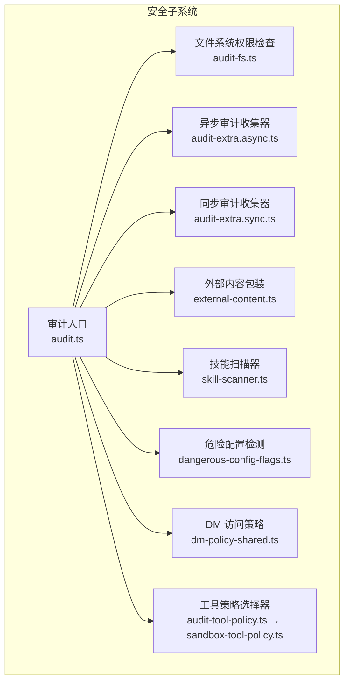
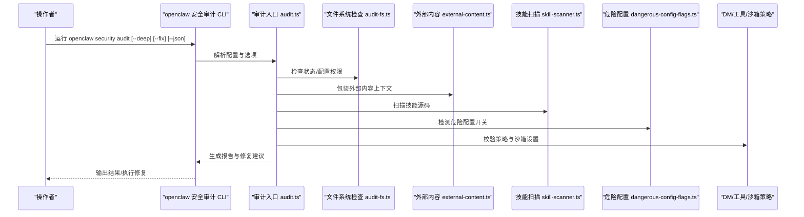
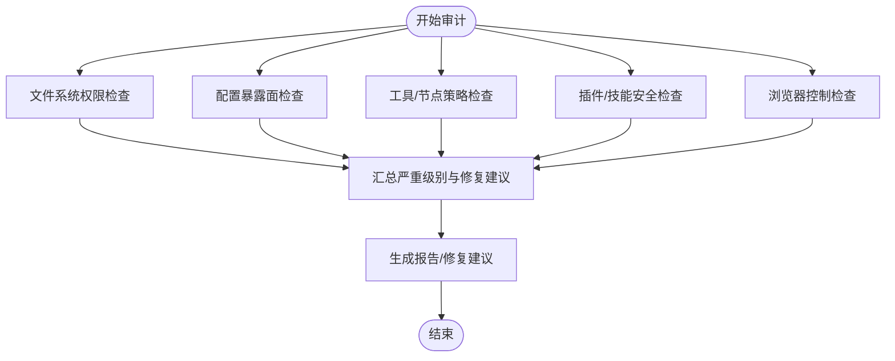
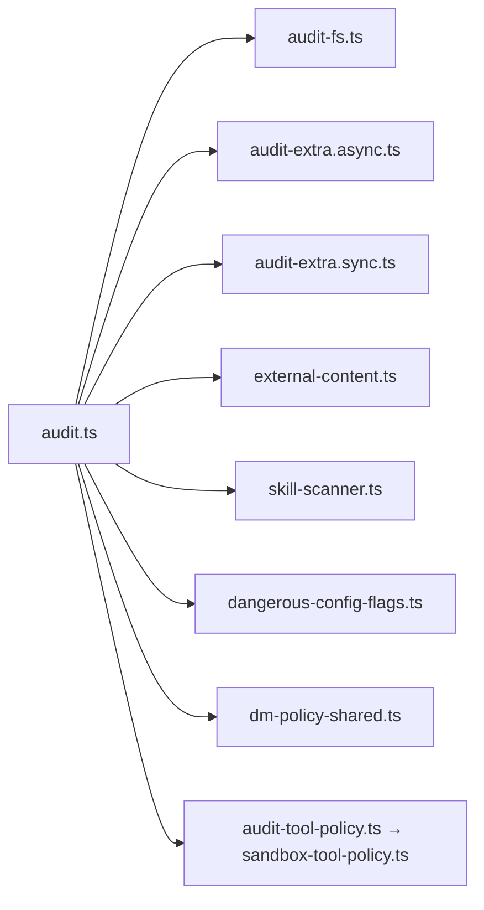

# 安全模型设计

<cite>
**本文引用的文件**
- [SECURITY.md](file://SECURITY.md)
- [docs/cli/security.md](file://docs/cli/security.md)
- [src/security/audit.ts](file://src/security/audit.ts)
- [src/security/audit-fs.ts](file://src/security/audit-fs.ts)
- [src/security/audit-extra.async.ts](file://src/security/audit-extra.async.ts)
- [src/security/audit-extra.sync.ts](file://src/security/audit-extra.sync.ts)
- [src/security/audit-tool-policy.ts](file://src/security/audit-tool-policy.ts)
- [src/security/external-content.ts](file://src/security/external-content.ts)
- [src/security/skill-scanner.ts](file://src/security/skill-scanner.ts)
- [src/security/dangerous-config-flags.ts](file://src/security/dangerous-config-flags.ts)
- [src/security/dm-policy-shared.ts](file://src/security/dm-policy-shared.ts)
- [src/agents/sandbox-tool-policy.ts](file://src/agents/sandbox-tool-policy.ts)
</cite>

## 目录
1. [引言](#引言)
2. [项目结构](#项目结构)
3. [核心组件](#核心组件)
4. [架构总览](#架构总览)
5. [详细组件分析](#详细组件分析)
6. [依赖关系分析](#依赖关系分析)
7. [性能考量](#性能考量)
8. [故障排查指南](#故障排查指南)
9. [结论](#结论)
10. [附录](#附录)

## 引言
本文件面向 OpenClaw 的安全模型设计，系统化阐述其整体安全架构、默认安全策略、威胁模型与安全边界定义；详解安全审计机制（文件系统审计、外部内容扫描、危险配置检测）；梳理安全策略的层次结构（系统级、用户级、渠道特定）；解释安全决策的执行流程（权限验证、风险评估、访问控制决策）；给出安全配置的优先级与继承规则；并说明扩展点与跨平台安全特性差异及兼容性考虑。

## 项目结构
OpenClaw 的安全能力主要由以下模块构成：
- 审计与修复：集中于 src/security 下，提供文件系统权限检查、配置暴露面扫描、工具策略与沙箱配置校验、插件与技能代码扫描等能力，并通过 CLI 命令进行触发与修复。
- 外部内容处理：提供统一的“不可信外部内容”包装与提示机制，防止注入与越界指令传播。
- 策略与决策：在 DM（私聊/群组）访问控制、工具策略、沙箱策略等方面形成分层策略体系。
- 配置与信任模型：通过 SECURITY.md 明确信任模型、部署假设与操作指导，CLI 文档提供审计与修复的使用说明。

图表来源
- [src/security/audit.ts:1-120](file://src/security/audit.ts#L1-L120)
- [src/security/audit-fs.ts:1-207](file://src/security/audit-fs.ts#L1-L207)
- [src/security/audit-extra.async.ts:1-200](file://src/security/audit-extra.async.ts#L1-L200)
- [src/security/audit-extra.sync.ts:1-200](file://src/security/audit-extra.sync.ts#L1-L200)
- [src/security/external-content.ts:1-346](file://src/security/external-content.ts#L1-L346)
- [src/security/skill-scanner.ts:1-584](file://src/security/skill-scanner.ts#L1-L584)
- [src/security/dangerous-config-flags.ts:1-29](file://src/security/dangerous-config-flags.ts#L1-L29)
- [src/security/dm-policy-shared.ts:1-333](file://src/security/dm-policy-shared.ts#L1-L333)
- [src/security/audit-tool-policy.ts:1-1](file://src/security/audit-tool-policy.ts#L1-L1)
- [src/agents/sandbox-tool-policy.ts:1-37](file://src/agents/sandbox-tool-policy.ts#L1-L37)

章节来源
- [src/security/audit.ts:1-120](file://src/security/audit.ts#L1-L120)
- [docs/cli/security.md:1-72](file://docs/cli/security.md#L1-L72)

## 核心组件
- 审计入口与报告
  - 聚合各类审计收集器，生成带严重级别与修复建议的报告；支持深度探测（如网关可达性）与 JSON 输出，便于 CI/CD 集成。
- 文件系统权限检查
  - 统一检查状态目录、配置文件及其 include 文件的可读写权限；对 Windows 使用 ACL 检查；提供修复建议（chmod 或重置 ACL）。
- 外部内容处理
  - 对来自邮件、Webhook、Web 搜索/抓取等来源的内容进行包装，附加安全警告与边界标记，屏蔽伪造边界标记，降低注入风险。
- 技能扫描器
  - 扫描技能源码中的危险模式（动态执行、命令执行、环境变量泄露、可疑网络行为、混淆等），输出规则命中与证据行号。
- 危险配置检测
  - 检测控制界面与钩子中明确的“危险/不安全”开关，提醒操作者注意潜在风险。
- DM 访问策略
  - 将允许列表合并与归一化，结合渠道策略与配对存储，判定私聊/群组访问决策（允许/阻止/需配对）。
- 工具策略选择器
  - 从配置中提取工具允许/拒绝集合，形成沙箱工具策略，支持 alsoAllow 的叠加语义。

章节来源
- [src/security/audit.ts:1-120](file://src/security/audit.ts#L1-L120)
- [src/security/audit-fs.ts:1-207](file://src/security/audit-fs.ts#L1-L207)
- [src/security/external-content.ts:1-346](file://src/security/external-content.ts#L1-L346)
- [src/security/skill-scanner.ts:1-584](file://src/security/skill-scanner.ts#L1-L584)
- [src/security/dangerous-config-flags.ts:1-29](file://src/security/dangerous-config-flags.ts#L1-L29)
- [src/security/dm-policy-shared.ts:1-333](file://src/security/dm-policy-shared.ts#L1-L333)
- [src/security/audit-tool-policy.ts:1-1](file://src/security/audit-tool-policy.ts#L1-L1)
- [src/agents/sandbox-tool-policy.ts:1-37](file://src/agents/sandbox-tool-policy.ts#L1-L37)

## 架构总览
OpenClaw 的安全模型以“个人助理”信任模型为核心，默认将认证通过的调用方视为受信任的操作员，路由与执行在同一信任边界内完成。安全控制通过多层策略与审计共同实现：

- 默认安全策略
  - 网关默认仅绑定回环地址；HTTP 工具调用默认对危险工具进行限制；沙箱模式默认关闭（主机优先）；工具策略默认严格。
- 威胁模型与边界
  - 不将单网关作为多租户、对抗性用户边界；会话标识仅为路由控制，非授权边界；推荐按用户/主机/OS 用户隔离运行。
- 审计与修复
  - 提供快速审计与深度审计，自动发现配置暴露面、权限问题、危险开关、工具策略与沙箱设置不当等问题，并给出可选修复建议。
- 外部内容与代码安全
  - 外部内容统一包装与警告；技能代码扫描识别高危模式；危险配置显式提示。
- 策略与决策
  - DM 访问策略、工具策略、沙箱策略协同，形成“允许/阻止/需配对”的访问决策；支持按系统、用户、渠道维度配置。

图表来源
- [src/security/audit.ts:1-120](file://src/security/audit.ts#L1-L120)
- [src/security/audit-fs.ts:1-207](file://src/security/audit-fs.ts#L1-L207)
- [src/security/external-content.ts:1-346](file://src/security/external-content.ts#L1-L346)
- [src/security/skill-scanner.ts:1-584](file://src/security/skill-scanner.ts#L1-L584)
- [src/security/dangerous-config-flags.ts:1-29](file://src/security/dangerous-config-flags.ts#L1-L29)

章节来源
- [SECURITY.md:88-172](file://SECURITY.md#L88-L172)
- [docs/cli/security.md:1-72](file://docs/cli/security.md#L1-L72)

## 详细组件分析

### 审计入口与报告（audit.ts）
- 职责
  - 聚合同步与异步审计收集器，生成带严重级别的报告；支持深度探测（如网关可达性）、JSON 输出、修复建议缓存。
- 关键流程
  - 权限检查：状态目录、配置文件、include 文件的可读写权限；Windows 使用 ACL 检查。
  - 配置暴露面：网关绑定、鉴权、受信代理、Control UI 允许来源、mDNS 模式、Tailscale 模式等。
  - 工具与节点：HTTP 工具放行、节点命令白名单/黑名单、小模型与浏览器工具组合的风险提示。
  - 插件与技能：插件信任边界、技能代码安全扫描、工作区路径安全。
  - 浏览器控制：远程 CDP 链接协议与鉴权缺失风险。
- 修复建议
  - chmod/ACL 重置、收紧权限、禁用危险开关、调整工具策略与沙箱设置。

图表来源
- [src/security/audit.ts:208-800](file://src/security/audit.ts#L208-L800)
- [src/security/audit-fs.ts:62-142](file://src/security/audit-fs.ts#L62-L142)

章节来源
- [src/security/audit.ts:1-120](file://src/security/audit.ts#L1-L120)
- [src/security/audit.ts:208-800](file://src/security/audit.ts#L208-L800)

### 文件系统权限检查（audit-fs.ts）
- 职责
  - 统一检查目标路径的权限位或 Windows ACL；区分符号链接、目录/文件类型；提供可读写权限判断与修复命令格式化。
- 平台差异
  - POSIX：基于 mode 位判断世界/组可读写。
  - Windows：调用 ACL 检查，汇总未信任主体的读写能力，提供 iCACLS 重置命令。
- 修复建议
  - 提供 chmod 或 ACL 重置命令模板，按目标类型与平台生成。

章节来源
- [src/security/audit-fs.ts:1-207](file://src/security/audit-fs.ts#L1-L207)

### 外部内容处理（external-content.ts）
- 职责
  - 对外部来源（邮件、Webhook、API、浏览器、Web 搜索/抓取）内容进行安全包装：附加来源元数据、安全警告、边界标记；屏蔽伪造边界标记；提供构建安全提示的辅助函数。
- 安全要点
  - 使用随机 ID 的边界标记，避免伪造；对多种角度括号与全角字符进行折叠处理；记录可疑模式但继续安全处理。
- 使用场景
  - 在将外部输入交给 LLM 前，先进行包装与提示，确保不会被误认为系统指令。

章节来源
- [src/security/external-content.ts:1-346](file://src/security/external-content.ts#L1-L346)

### 技能扫描器（skill-scanner.ts）
- 职责
  - 扫描技能源码中的危险模式，输出规则命中与证据行号；支持缓存与文件大小限制，避免性能问题。
- 规则类别
  - 行级规则：动态代码执行、危险命令执行、可能挖矿、可疑网络端口。
  - 源码规则：文件读取+网络发送组合、十六进制/大段 Base64 编码、环境变量+网络发送组合。
- 性能与缓存
  - 文件扫描缓存与目录条目缓存，限制最大扫描文件数与单文件大小。

章节来源
- [src/security/skill-scanner.ts:1-584](file://src/security/skill-scanner.ts#L1-L584)

### 危险配置检测（dangerous-config-flags.ts）
- 职责
  - 检测控制界面与钩子中的危险/不安全开关，如允许不安全鉴权、允许 Host 头 Origin 回退、允许不受控外部内容等。
- 影响
  - 这些开关属于“显式破窗”配置，启用时需操作者明确风险。

章节来源
- [src/security/dangerous-config-flags.ts:1-29](file://src/security/dangerous-config-flags.ts#L1-L29)

### DM 访问策略（dm-policy-shared.ts）
- 职责
  - 合并与归一化允许列表，结合渠道策略与配对存储，判定私聊/群组访问决策（允许/阻止/需配对）；支持命令授权与控制命令拦截。
- 关键逻辑
  - 主 DM 仅允许单一所有者时可推断“固定主 DM”；群组策略与 DM 策略分别评估；命令门控根据配置与授权者集合决定是否放行。

章节来源
- [src/security/dm-policy-shared.ts:1-333](file://src/security/dm-policy-shared.ts#L1-L333)

### 工具策略选择器（audit-tool-policy.ts → sandbox-tool-policy.ts）
- 职责
  - 从配置中提取 allow/alsoAllow/deny，形成沙箱工具策略；alsoAllow 叠加到 allow，若无 allow 则隐含允许全部后叠加 alsoAllow。
- 应用
  - 用于审计与策略决策，确保工具调用在受控范围内。

章节来源
- [src/security/audit-tool-policy.ts:1-1](file://src/security/audit-tool-policy.ts#L1-L1)
- [src/agents/sandbox-tool-policy.ts:1-37](file://src/agents/sandbox-tool-policy.ts#L1-L37)

## 依赖关系分析
- 审计入口依赖多个收集器模块，形成清晰的职责分离：同步配置检查、异步文件系统与插件检查、外部内容与技能扫描。
- 文件系统检查模块同时支持 POSIX 与 Windows 平台，通过 ACL 检查实现跨平台一致性。
- DM 访问策略与工具策略相互独立又协同，前者负责路由与访问控制，后者负责工具调用范围。
- CLI 文档与安全策略文档共同指导操作者正确配置与使用安全功能。

图表来源
- [src/security/audit.ts:1-120](file://src/security/audit.ts#L1-L120)
- [src/security/audit-fs.ts:1-207](file://src/security/audit-fs.ts#L1-L207)
- [src/security/audit-extra.async.ts:1-200](file://src/security/audit-extra.async.ts#L1-L200)
- [src/security/audit-extra.sync.ts:1-200](file://src/security/audit-extra.sync.ts#L1-L200)
- [src/security/external-content.ts:1-346](file://src/security/external-content.ts#L1-L346)
- [src/security/skill-scanner.ts:1-584](file://src/security/skill-scanner.ts#L1-L584)
- [src/security/dangerous-config-flags.ts:1-29](file://src/security/dangerous-config-flags.ts#L1-L29)
- [src/security/dm-policy-shared.ts:1-333](file://src/security/dm-policy-shared.ts#L1-L333)
- [src/security/audit-tool-policy.ts:1-1](file://src/security/audit-tool-policy.ts#L1-L1)
- [src/agents/sandbox-tool-policy.ts:1-37](file://src/agents/sandbox-tool-policy.ts#L1-L37)

章节来源
- [src/security/audit.ts:1-120](file://src/security/audit.ts#L1-L120)

## 性能考量
- 技能扫描器采用文件与目录缓存，限制最大扫描文件数与单文件大小，避免大规模扫描带来的性能开销。
- 审计入口支持修复建议缓存与深度探测超时参数，便于在 CI/CD 中可控地平衡准确性与速度。
- 文件系统权限检查按平台选择最优路径（POSIX 模式位 vs Windows ACL），减少不必要的系统调用。

章节来源
- [src/security/skill-scanner.ts:50-122](file://src/security/skill-scanner.ts#L50-L122)
- [src/security/audit.ts:87-113](file://src/security/audit.ts#L87-L113)

## 故障排查指南
- 常见问题与定位
  - 网关暴露面：检查 gateway.bind、trustedProxies、Control UI allowedOrigins、mDNS 模式、Tailscale 模式等。
  - 权限问题：状态目录与配置文件的可读写权限；Windows ACL 未信任主体的读写能力。
  - 危险配置：控制界面允许不安全鉴权、Host 头 Origin 回退、允许不受控外部内容等。
  - 工具与沙箱：HTTP 工具放行、节点命令白名单/黑名单、小模型与浏览器工具组合风险。
  - 外部内容：未进行安全包装导致的注入风险。
  - 技能代码：动态执行、环境变量泄露、可疑网络行为等。
- 修复建议
  - 使用 CLI 的 --fix 选项应用安全修复；调整配置项以收紧权限与暴露面；启用沙箱与工具策略；对技能代码进行整改。

章节来源
- [docs/cli/security.md:17-72](file://docs/cli/security.md#L17-L72)
- [SECURITY.md:48-132](file://SECURITY.md#L48-L132)

## 结论
OpenClaw 的安全模型以“个人助理”信任模型为基础，通过多层次策略与持续审计实现纵深防御。默认安全策略强调最小暴露与严格工具策略，结合外部内容包装、技能代码扫描与危险配置检测，有效降低注入与越权风险。策略与决策在系统、用户、渠道三个层面协同，既保证灵活性，又维持可审计性与可修复性。跨平台差异通过统一接口与平台适配得到良好处理，满足不同运行环境下的安全需求。

## 附录

### 安全策略层次结构与优先级
- 系统级安全规则
  - 网关默认回环绑定、HTTP 工具默认限制、沙箱默认关闭、工具策略默认严格。
- 用户级安全配置
  - 控制界面鉴权、暴露面控制、危险开关、工具策略覆盖、插件允许列表。
- 渠道特定安全策略
  - DM 策略（disabled/open/pairing/allowlist）、群组策略、允许列表合并与归一化、命令门控。

章节来源
- [SECURITY.md:88-172](file://SECURITY.md#L88-L172)
- [src/security/dm-policy-shared.ts:31-60](file://src/security/dm-policy-shared.ts#L31-L60)
- [src/security/audit-tool-policy.ts:1-1](file://src/security/audit-tool-policy.ts#L1-L1)

### 安全决策执行流程
- 权限验证：文件系统权限检查与 Windows ACL 校验。
- 风险评估：配置暴露面、工具策略、沙箱设置、外部内容与技能代码扫描。
- 访问控制决策：DM 访问策略、工具策略、沙箱策略协同，形成允许/阻止/需配对决策。

章节来源
- [src/security/audit.ts:339-687](file://src/security/audit.ts#L339-L687)
- [src/security/dm-policy-shared.ts:105-196](file://src/security/dm-policy-shared.ts#L105-L196)

### 扩展点与自定义安全策略
- 自定义审计收集器：在 audit-extra.async.ts 或 audit-extra.sync.ts 中新增收集器，遵循统一的 SecurityAuditFinding 接口。
- 自定义工具策略：通过 alsoAllow 叠加允许集合，或使用 deny 精细控制。
- 自定义 DM 访问策略：通过 allowFrom/groupAllowFrom/storeAllowFrom 的合并与归一化，实现灵活的路由与访问控制。

章节来源
- [src/security/audit-extra.async.ts:1-200](file://src/security/audit-extra.async.ts#L1-L200)
- [src/security/audit-extra.sync.ts:1-200](file://src/security/audit-extra.sync.ts#L1-L200)
- [src/agents/sandbox-tool-policy.ts:21-37](file://src/agents/sandbox-tool-policy.ts#L21-L37)
- [src/security/dm-policy-shared.ts:31-60](file://src/security/dm-policy-shared.ts#L31-L60)

### 跨平台安全特性与兼容性
- 文件系统权限：POSIX 使用 mode 位，Windows 使用 ACL；统一输出与修复建议。
- 浏览器控制：远程 CDP 使用 HTTP/HTTPS 的风险提示与修复建议。
- CLI 与文档：提供一致的审计与修复体验，跨平台可复用。

章节来源
- [src/security/audit-fs.ts:98-141](file://src/security/audit-fs.ts#L98-L141)
- [src/security/audit.ts:718-797](file://src/security/audit.ts#L718-L797)
- [docs/cli/security.md:1-72](file://docs/cli/security.md#L1-L72)