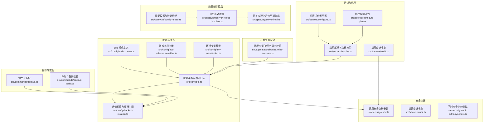
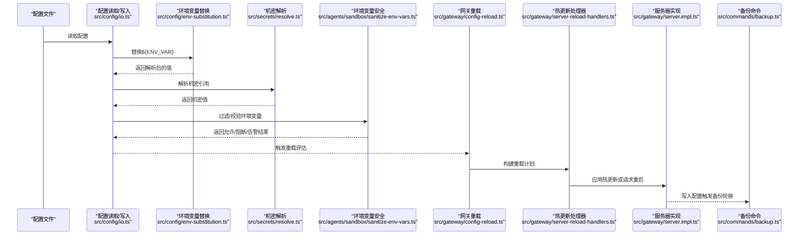
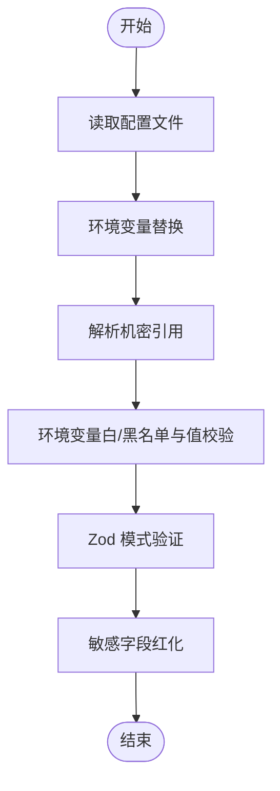
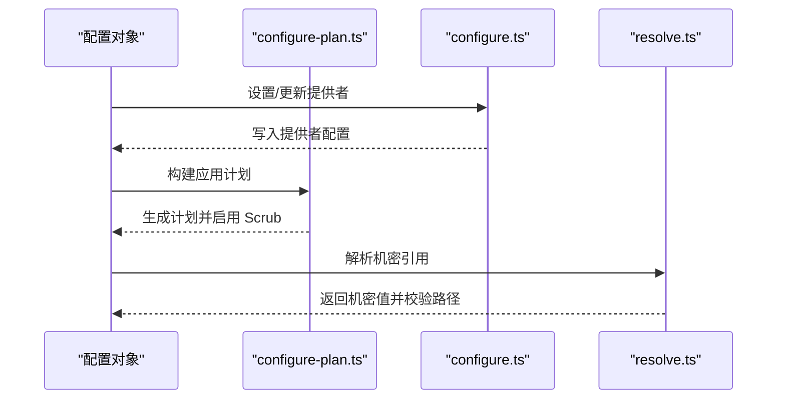
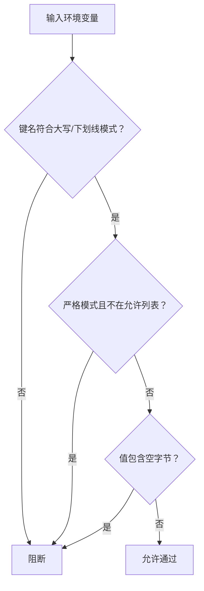
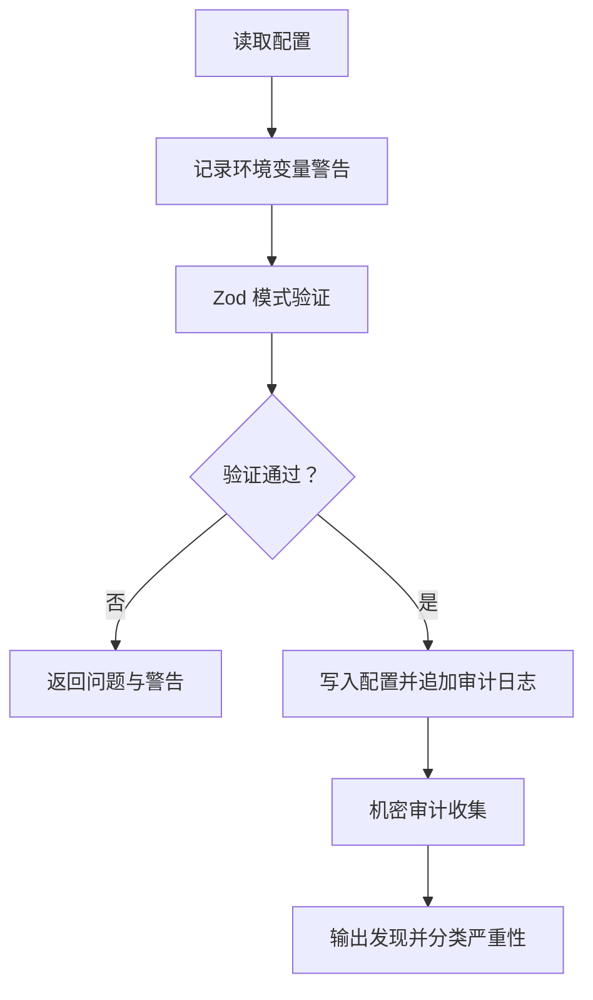
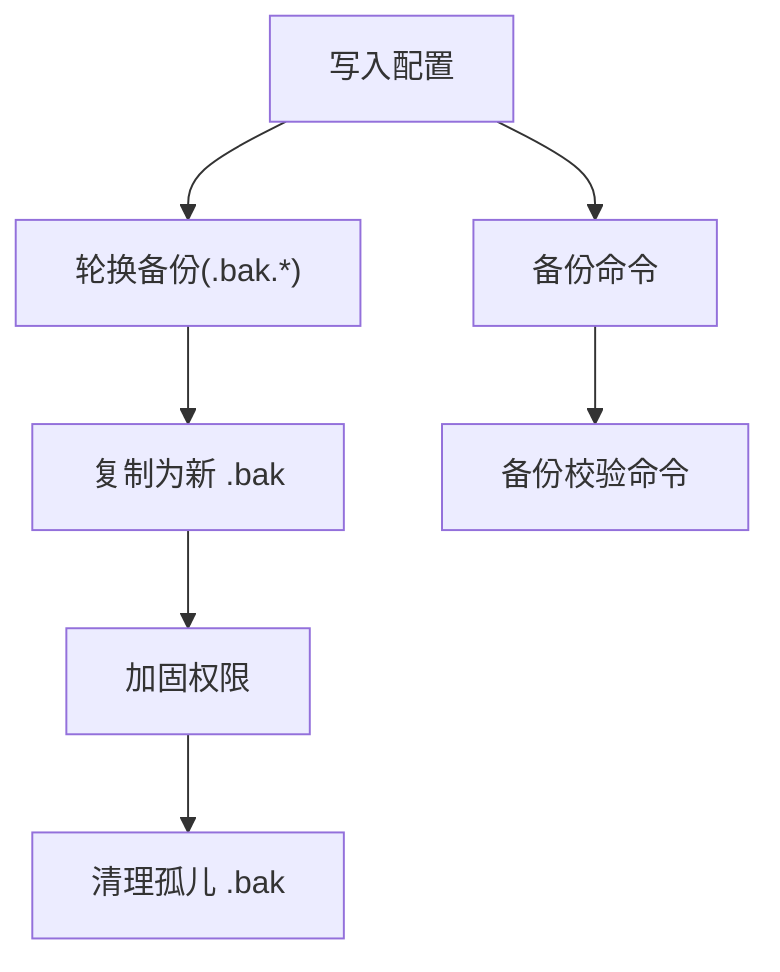
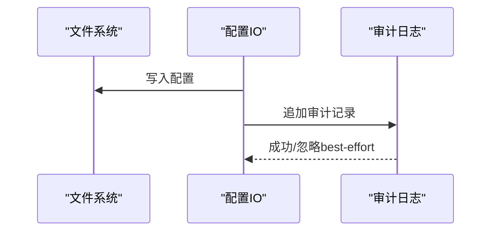
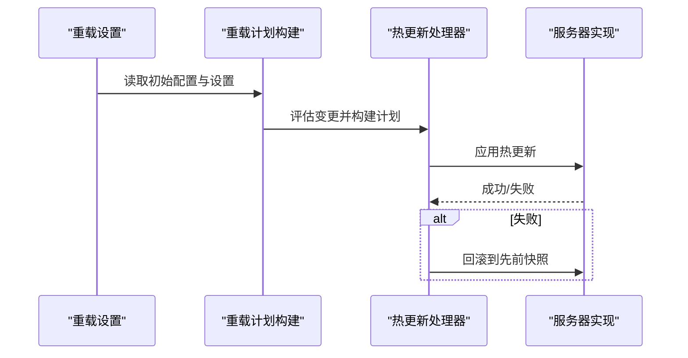
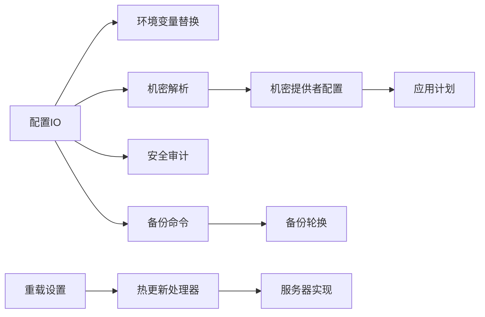

# 安全配置管理

<cite>
**本文引用的文件**
- [SECURITY.md](file://SECURITY.md)
- [docs/security/README.md](file://docs/security/README.md)
- [src/config/zod-schema.ts](file://src/config/zod-schema.ts)
- [src/config/zod-schema.sensitive.ts](file://src/config/zod-schema.sensitive.ts)
- [src/config/env-substitution.ts](file://src/config/env-substitution.ts)
- [src/config/io.ts](file://src/config/io.ts)
- [src/config/backup-rotation.ts](file://src/config/backup-rotation.ts)
- [src/agents/sandbox/sanitize-env-vars.ts](file://src/agents/sandbox/sanitize-env-vars.ts)
- [src/gateway/config-reload.ts](file://src/gateway/config-reload.ts)
- [src/gateway/server-reload-handlers.ts](file://src/gateway/server-reload-handlers.ts)
- [src/gateway/server.impl.ts](file://src/gateway/server.impl.ts)
- [src/gateway/credentials.test.ts](file://src/gateway/credentials.test.ts)
- [src/secrets/resolve.ts](file://src/secrets/resolve.ts)
- [src/secrets/configure.ts](file://src/secrets/configure.ts)
- [src/secrets/configure-plan.ts](file://src/secrets/configure-plan.ts)
- [src/secrets/audit.ts](file://src/secrets/audit.ts)
- [src/security/audit.ts](file://src/security/audit.ts)
- [src/security/audit-extra.sync.test.ts](file://src/security/audit-extra.sync.test.ts)
- [src/commands/backup.ts](file://src/commands/backup.ts)
- [src/commands/backup-verify.ts](file://src/commands/backup-verify.ts)
- [src/commands/backup.test.ts](file://src/commands/backup.test.ts)
</cite>

## 目录
1. [简介](#简介)
2. [项目结构](#项目结构)
3. [核心组件](#核心组件)
4. [架构总览](#架构总览)
5. [详细组件分析](#详细组件分析)
6. [依赖关系分析](#依赖关系分析)
7. [性能考量](#性能考量)
8. [故障排查指南](#故障排查指南)
9. [结论](#结论)
10. [附录](#附录)

## 简介
本文件面向 OpenClaw 的安全配置管理，系统化阐述配置的分层结构（全局、用户、渠道）、密钥与敏感信息管理（生成、存储加密、访问控制）、环境变量安全使用规范（命名与注入防护）、配置验证与安全检查机制（冲突检测与漏洞扫描）、备份与恢复策略、变更审计与追踪、热更新安全考虑与最佳实践，以及常见错误的识别与修复方法。目标是帮助不同技术背景的读者理解并正确实施安全配置。

## 项目结构
围绕安全配置管理的关键代码分布在以下模块：
- 配置与模式：Zod 模式定义、敏感字段注册、环境变量替换、配置读写与审计日志
- 密钥与机密：机密解析、提供者配置、应用计划与清理选项
- 环境变量安全：严格白/黑名单与值校验
- 热更新与重启：重载设置、计划构建、回滚与重启策略
- 备份与恢复：环形备份轮换、权限加固、校验与验证
- 安全审计：通用安全审计、机密审计、额外等时比较测试

**图表来源**
- [src/config/zod-schema.ts:1-800](file://src/config/zod-schema.ts#L1-L800)
- [src/config/zod-schema.sensitive.ts:1-5](file://src/config/zod-schema.sensitive.ts#L1-L5)
- [src/config/env-substitution.ts:1-49](file://src/config/env-substitution.ts#L1-L49)
- [src/config/io.ts:534-581](file://src/config/io.ts#L534-L581)
- [src/config/backup-rotation.ts:83-125](file://src/config/backup-rotation.ts#L83-L125)
- [src/secrets/resolve.ts:289-321](file://src/secrets/resolve.ts#L289-L321)
- [src/secrets/configure.ts:34-90](file://src/secrets/configure.ts#L34-L90)
- [src/secrets/configure-plan.ts:227-259](file://src/secrets/configure-plan.ts#L227-L259)
- [src/secrets/audit.ts:203-254](file://src/secrets/audit.ts#L203-L254)
- [src/agents/sandbox/sanitize-env-vars.ts:58-110](file://src/agents/sandbox/sanitize-env-vars.ts#L58-L110)
- [src/gateway/config-reload.ts:54-182](file://src/gateway/config-reload.ts#L54-L182)
- [src/gateway/server-reload-handlers.ts:138-161](file://src/gateway/server-reload-handlers.ts#L138-L161)
- [src/gateway/server.impl.ts:982-1013](file://src/gateway/server.impl.ts#L982-L1013)
- [src/commands/backup.ts:1-31](file://src/commands/backup.ts#L1-L31)
- [src/commands/backup-verify.ts:121-140](file://src/commands/backup-verify.ts#L121-L140)
- [src/security/audit.ts:87-113](file://src/security/audit.ts#L87-L113)
- [src/security/audit-extra.sync.test.ts:37-55](file://src/security/audit-extra.sync.test.ts#L37-L55)

**章节来源**
- [src/config/zod-schema.ts:1-800](file://src/config/zod-schema.ts#L1-L800)
- [src/config/io.ts:534-581](file://src/config/io.ts#L534-L581)
- [src/config/backup-rotation.ts:83-125](file://src/config/backup-rotation.ts#L83-L125)
- [src/agents/sandbox/sanitize-env-vars.ts:58-110](file://src/agents/sandbox/sanitize-env-vars.ts#L58-L110)
- [src/gateway/config-reload.ts:54-182](file://src/gateway/config-reload.ts#L54-L182)
- [src/gateway/server-reload-handlers.ts:138-161](file://src/gateway/server-reload-handlers.ts#L138-L161)
- [src/gateway/server.impl.ts:982-1013](file://src/gateway/server.impl.ts#L982-L1013)
- [src/commands/backup.ts:1-31](file://src/commands/backup.ts#L1-L31)
- [src/commands/backup-verify.ts:121-140](file://src/commands/backup-verify.ts#L121-L140)
- [src/security/audit.ts:87-113](file://src/security/audit.ts#L87-L113)
- [src/security/audit-extra.sync.test.ts:37-55](file://src/security/audit-extra.sync.test.ts#L37-L55)

## 核心组件
- 配置模式与敏感字段注册：通过 Zod 模式约束配置结构，并在敏感字段注册表中声明需要脱敏的键，确保导出或展示时自动红化。
- 环境变量替换与缺失处理：支持 `${VAR}` 语法在配置中进行环境变量替换；对缺失变量抛出明确错误，避免静默失败。
- 配置读写与审计日志：读取配置时记录环境变量警告；写入配置后追加审计记录到受控日志文件，含可疑变更原因集合。
- 机密解析与提供者：解析机密引用，校验提供者来源一致性；对文件型提供者执行绝对路径与大小限制检查。
- 环境变量白/黑名单与值校验：严格过滤危险前缀变量，校验值中是否包含空字节等异常内容，支持严格模式与自定义规则。
- 热更新与重启：根据变更路径构建重载计划，支持“关闭/重启/热/混合”模式；热更新失败时回滚至先前运行时快照。
- 备份与恢复：环形备份轮换、复制旧配置为 .bak、加固权限、清理孤儿 .bak 文件；提供备份创建与校验命令。
- 安全审计：通用安全审计参数可选择深度扫描、通道安全检查、文件系统检查等；机密审计收集明文存储、提供者阴影等问题。

**章节来源**
- [src/config/zod-schema.ts:1-800](file://src/config/zod-schema.ts#L1-L800)
- [src/config/zod-schema.sensitive.ts:1-5](file://src/config/zod-schema.sensitive.ts#L1-L5)
- [src/config/env-substitution.ts:1-49](file://src/config/env-substitution.ts#L1-L49)
- [src/config/io.ts:534-581](file://src/config/io.ts#L534-L581)
- [src/secrets/resolve.ts:289-321](file://src/secrets/resolve.ts#L289-L321)
- [src/agents/sandbox/sanitize-env-vars.ts:58-110](file://src/agents/sandbox/sanitize-env-vars.ts#L58-L110)
- [src/gateway/config-reload.ts:54-182](file://src/gateway/config-reload.ts#L54-L182)
- [src/gateway/server-reload-handlers.ts:138-161](file://src/gateway/server-reload-handlers.ts#L138-L161)
- [src/config/backup-rotation.ts:83-125](file://src/config/backup-rotation.ts#L83-L125)
- [src/commands/backup.ts:1-31](file://src/commands/backup.ts#L1-L31)
- [src/commands/backup-verify.ts:121-140](file://src/commands/backup-verify.ts#L121-L140)
- [src/security/audit.ts:87-113](file://src/security/audit.ts#L87-L113)
- [src/secrets/audit.ts:203-254](file://src/secrets/audit.ts#L203-L254)

## 架构总览
下图展示从配置加载、机密解析、环境变量安全、热更新到备份与审计的整体流程。

**图表来源**
- [src/config/io.ts:534-581](file://src/config/io.ts#L534-L581)
- [src/config/env-substitution.ts:1-49](file://src/config/env-substitution.ts#L1-L49)
- [src/secrets/resolve.ts:289-321](file://src/secrets/resolve.ts#L289-L321)
- [src/agents/sandbox/sanitize-env-vars.ts:58-110](file://src/agents/sandbox/sanitize-env-vars.ts#L58-L110)
- [src/gateway/config-reload.ts:54-182](file://src/gateway/config-reload.ts#L54-L182)
- [src/gateway/server-reload-handlers.ts:138-161](file://src/gateway/server-reload-handlers.ts#L138-L161)
- [src/gateway/server.impl.ts:982-1013](file://src/gateway/server.impl.ts#L982-L1013)
- [src/commands/backup.ts:1-31](file://src/commands/backup.ts#L1-L31)

## 详细组件分析

### 配置层次结构与敏感信息管理
- 全局配置：通过 Zod 模式统一约束，敏感字段在注册表中声明，导出或展示时自动红化。
- 用户配置：通过机密提供者（如文件）解析，强制绝对路径与大小限制，避免路径穿越与超大载荷。
- 渠道配置：在通道插件中进行凭据来源校验，确保来自配置或环境变量的凭据能通过验证。

**图表来源**
- [src/config/env-substitution.ts:1-49](file://src/config/env-substitution.ts#L1-L49)
- [src/secrets/resolve.ts:289-321](file://src/secrets/resolve.ts#L289-L321)
- [src/agents/sandbox/sanitize-env-vars.ts:58-110](file://src/agents/sandbox/sanitize-env-vars.ts#L58-L110)
- [src/config/zod-schema.sensitive.ts:1-5](file://src/config/zod-schema.sensitive.ts#L1-L5)

**章节来源**
- [src/config/zod-schema.ts:1-800](file://src/config/zod-schema.ts#L1-L800)
- [src/config/zod-schema.sensitive.ts:1-5](file://src/config/zod-schema.sensitive.ts#L1-L5)
- [src/config/env-substitution.ts:1-49](file://src/config/env-substitution.ts#L1-L49)
- [src/secrets/resolve.ts:289-321](file://src/secrets/resolve.ts#L289-L321)
- [src/agents/sandbox/sanitize-env-vars.ts:58-110](file://src/agents/sandbox/sanitize-env-vars.ts#L58-L110)

### 密钥与敏感信息管理
- 机密提供者配置：支持别名与来源一致性校验，防止跨源引用。
- 路径与超时安全：文件型提供者要求绝对路径，限制读取超时与最大字节数。
- 应用计划与清理：生成应用计划时启用 Scrub 选项，清理历史凭据与遗留 JSON。

**图表来源**
- [src/secrets/configure-plan.ts:227-259](file://src/secrets/configure-plan.ts#L227-L259)
- [src/secrets/configure.ts:34-90](file://src/secrets/configure.ts#L34-L90)
- [src/secrets/resolve.ts:289-321](file://src/secrets/resolve.ts#L289-L321)

**章节来源**
- [src/secrets/configure-plan.ts:227-259](file://src/secrets/configure-plan.ts#L227-L259)
- [src/secrets/configure.ts:34-90](file://src/secrets/configure.ts#L34-L90)
- [src/secrets/resolve.ts:289-321](file://src/secrets/resolve.ts#L289-L321)

### 环境变量的安全使用规范
- 命名约定：仅匹配大写与下划线的变量名模式，避免误匹配小写或特殊字符。
- 注入防护：缺失变量抛错；严格模式下阻断未显式允许的变量；禁止包含空字节的值。
- 网关凭据：当配置中存在未解析的占位符时，拒绝加载，避免凭据泄漏。

**图表来源**
- [src/agents/sandbox/sanitize-env-vars.ts:58-110](file://src/agents/sandbox/sanitize-env-vars.ts#L58-L110)
- [src/config/env-substitution.ts:1-49](file://src/config/env-substitution.ts#L1-L49)
- [src/gateway/credentials.test.ts:609-630](file://src/gateway/credentials.test.ts#L609-L630)

**章节来源**
- [src/agents/sandbox/sanitize-env-vars.ts:58-110](file://src/agents/sandbox/sanitize-env-vars.ts#L58-L110)
- [src/config/env-substitution.ts:1-49](file://src/config/env-substitution.ts#L1-L49)
- [src/gateway/credentials.test.ts:609-630](file://src/gateway/credentials.test.ts#L609-L630)

### 配置验证与安全检查机制
- 模式验证：Zod 模式对配置结构进行强约束，包含数值范围、枚举、URL 协议等。
- 环境变量警告：对未设置的非关键变量发出警告，允许降级启动。
- 审计日志：写入配置后追加审计记录，记录可疑变更原因集合。
- 机密审计：收集明文存储、提供者阴影等问题，输出告警或严重级别发现。

**图表来源**
- [src/config/io.ts:967-999](file://src/config/io.ts#L967-L999)
- [src/config/io.ts:534-581](file://src/config/io.ts#L534-L581)
- [src/secrets/audit.ts:203-254](file://src/secrets/audit.ts#L203-L254)

**章节来源**
- [src/config/io.ts:967-999](file://src/config/io.ts#L967-L999)
- [src/config/io.ts:534-581](file://src/config/io.ts#L534-L581)
- [src/secrets/audit.ts:203-254](file://src/secrets/audit.ts#L203-L254)

### 备份与恢复策略
- 环形备份轮换：按固定数量维护 .bak.* 文件，移除孤儿备份。
- 权限加固：写入审计日志与备份文件采用受限权限。
- 创建与校验：提供备份创建命令与校验命令，支持 JSON 输出与摘要格式。

**图表来源**
- [src/config/backup-rotation.ts:83-125](file://src/config/backup-rotation.ts#L83-L125)
- [src/commands/backup.ts:1-31](file://src/commands/backup.ts#L1-L31)
- [src/commands/backup-verify.ts:121-140](file://src/commands/backup-verify.ts#L121-L140)

**章节来源**
- [src/config/backup-rotation.ts:83-125](file://src/config/backup-rotation.ts#L83-L125)
- [src/commands/backup.ts:1-31](file://src/commands/backup.ts#L1-L31)
- [src/commands/backup-verify.ts:121-140](file://src/commands/backup-verify.ts#L121-L140)

### 配置变更的审计与追踪
- 审计日志路径：位于状态目录下的日志文件，写入受限权限。
- 可疑变更原因：包括大小骤降、缺少元数据、移除网关模式等。
- 记录内容：每次写入都会追加一条记录，便于回溯。

**图表来源**
- [src/config/io.ts:534-581](file://src/config/io.ts#L534-L581)

**章节来源**
- [src/config/io.ts:534-581](file://src/config/io.ts#L534-L581)

### 配置热更新的安全考虑与最佳实践
- 重载模式：支持 off/restart/hot/hybrid，根据变更路径决定行为。
- 计划构建：区分需要重启、动态读取、无操作路径，记录原因。
- 回滚保护：热更新失败时回滚到之前的运行时快照。
- 重启策略：若需重启但无监听器则跳过，避免意外中断。

**图表来源**
- [src/gateway/config-reload.ts:54-182](file://src/gateway/config-reload.ts#L54-L182)
- [src/gateway/server-reload-handlers.ts:138-161](file://src/gateway/server-reload-handlers.ts#L138-L161)
- [src/gateway/server.impl.ts:982-1013](file://src/gateway/server.impl.ts#L982-L1013)

**章节来源**
- [src/gateway/config-reload.ts:54-182](file://src/gateway/config-reload.ts#L54-L182)
- [src/gateway/server-reload-handlers.ts:138-161](file://src/gateway/server-reload-handlers.ts#L138-L161)
- [src/gateway/server.impl.ts:982-1013](file://src/gateway/server.impl.ts#L982-L1013)

### 常见安全配置错误与修复
- 明文存储敏感信息：机密审计会标记明文存储，应改用机密引用或提供者。
- 提供者来源不一致：解析阶段会抛出来源不匹配错误，需修正提供者 alias 或来源。
- 缺失环境变量：环境变量替换会抛错，需补齐或改为机密引用。
- 不安全的环境变量键名：严格模式下会被阻断，需调整命名或加入允许列表。
- 热更新失败导致的配置回滚：热更新失败会自动回滚，修复后再试。

**章节来源**
- [src/secrets/audit.ts:203-254](file://src/secrets/audit.ts#L203-L254)
- [src/secrets/resolve.ts:186-206](file://src/secrets/resolve.ts#L186-L206)
- [src/config/env-substitution.ts:29-37](file://src/config/env-substitution.ts#L29-L37)
- [src/agents/sandbox/sanitize-env-vars.ts:84-96](file://src/agents/sandbox/sanitize-env-vars.ts#L84-L96)
- [src/gateway/server.impl.ts:994-1000](file://src/gateway/server.impl.ts#L994-L1000)

## 依赖关系分析
- 组件耦合：配置 IO 依赖环境变量替换与机密解析；热更新依赖重载设置与处理器；备份命令依赖轮换与权限加固。
- 外部依赖：Node.js 运行时、文件系统 API、进程信号（SIGUSR1）用于重启。
- 循环依赖：当前模块间无明显循环导入；审计与机密审计相互独立。

**图表来源**
- [src/config/io.ts:534-581](file://src/config/io.ts#L534-L581)
- [src/config/env-substitution.ts:1-49](file://src/config/env-substitution.ts#L1-L49)
- [src/secrets/resolve.ts:289-321](file://src/secrets/resolve.ts#L289-L321)
- [src/security/audit.ts:87-113](file://src/security/audit.ts#L87-L113)
- [src/secrets/configure.ts:34-90](file://src/secrets/configure.ts#L34-L90)
- [src/secrets/configure-plan.ts:227-259](file://src/secrets/configure-plan.ts#L227-L259)
- [src/commands/backup.ts:1-31](file://src/commands/backup.ts#L1-L31)
- [src/config/backup-rotation.ts:83-125](file://src/config/backup-rotation.ts#L83-L125)
- [src/gateway/config-reload.ts:54-182](file://src/gateway/config-reload.ts#L54-L182)
- [src/gateway/server-reload-handlers.ts:138-161](file://src/gateway/server-reload-handlers.ts#L138-L161)
- [src/gateway/server.impl.ts:982-1013](file://src/gateway/server.impl.ts#L982-L1013)

**章节来源**
- [src/config/io.ts:534-581](file://src/config/io.ts#L534-L581)
- [src/config/env-substitution.ts:1-49](file://src/config/env-substitution.ts#L1-L49)
- [src/secrets/resolve.ts:289-321](file://src/secrets/resolve.ts#L289-L321)
- [src/security/audit.ts:87-113](file://src/security/audit.ts#L87-L113)
- [src/secrets/configure.ts:34-90](file://src/secrets/configure.ts#L34-L90)
- [src/secrets/configure-plan.ts:227-259](file://src/secrets/configure-plan.ts#L227-L259)
- [src/commands/backup.ts:1-31](file://src/commands/backup.ts#L1-L31)
- [src/config/backup-rotation.ts:83-125](file://src/config/backup-rotation.ts#L83-L125)
- [src/gateway/config-reload.ts:54-182](file://src/gateway/config-reload.ts#L54-L182)
- [src/gateway/server-reload-handlers.ts:138-161](file://src/gateway/server-reload-handlers.ts#L138-L161)
- [src/gateway/server.impl.ts:982-1013](file://src/gateway/server.impl.ts#L982-L1013)

## 性能考量
- 环境变量替换与机密解析：在配置加载阶段一次性完成，避免运行时重复计算。
- 热更新：优先尝试热更新，减少重启带来的停机时间；对大规模变更建议 hybrid 模式。
- 备份：轮换与权限加固为轻量操作，尽量在写入后异步执行以降低阻塞。

## 故障排查指南
- 配置无法加载：检查缺失的环境变量与模式验证错误，确认敏感字段是否被正确红化。
- 机密解析失败：确认提供者 alias 存在且来源一致，路径为绝对路径且未超限。
- 环境变量被阻断：调整键名或允许列表，或在严格模式下移除危险键。
- 热更新失败：查看审计日志与重载计划，确认失败原因并回滚到上一个快照。
- 备份异常：检查备份轮换与权限加固逻辑，确保状态目录可写且无孤儿文件残留。

**章节来源**
- [src/config/io.ts:967-999](file://src/config/io.ts#L967-L999)
- [src/secrets/resolve.ts:186-206](file://src/secrets/resolve.ts#L186-L206)
- [src/agents/sandbox/sanitize-env-vars.ts:84-96](file://src/agents/sandbox/sanitize-env-vars.ts#L84-L96)
- [src/gateway/server.impl.ts:994-1000](file://src/gateway/server.impl.ts#L994-L1000)
- [src/config/backup-rotation.ts:83-125](file://src/config/backup-rotation.ts#L83-L125)

## 结论
OpenClaw 的安全配置管理通过严格的模式约束、机密解析与提供者校验、环境变量白/黑名单与值校验、热更新与回滚保护、环形备份与审计日志，形成了一套完整的安全配置闭环。遵循本文档的最佳实践，可有效降低配置泄露、误用与破坏风险，保障系统的安全性与稳定性。

## 附录
- 安全策略与威胁模型：参阅项目安全策略与威胁模型文档，了解报告流程与信任边界。
- 安全扫描工具：项目使用 detect-secrets 进行 CI 自动扫描，可本地运行以检测潜在机密泄露。

**章节来源**
- [SECURITY.md:1-288](file://SECURITY.md#L1-L288)
- [docs/security/README.md:1-18](file://docs/security/README.md#L1-L18)