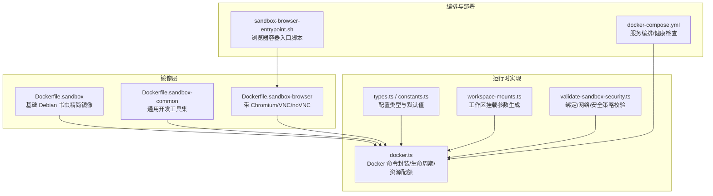
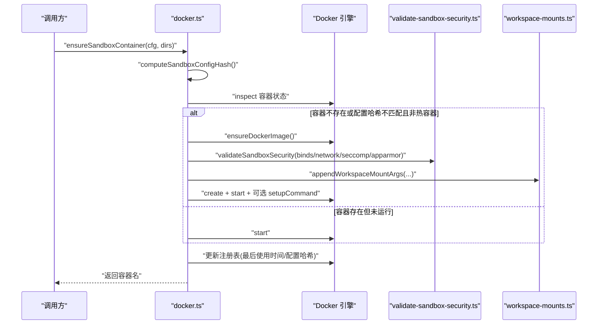
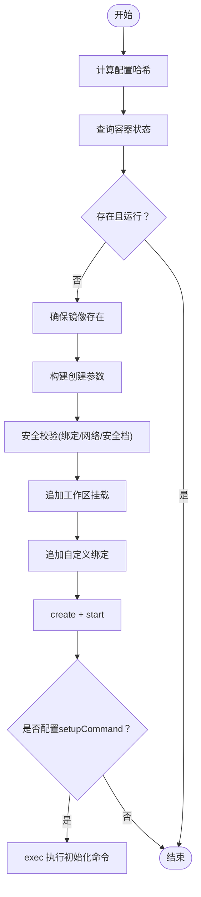
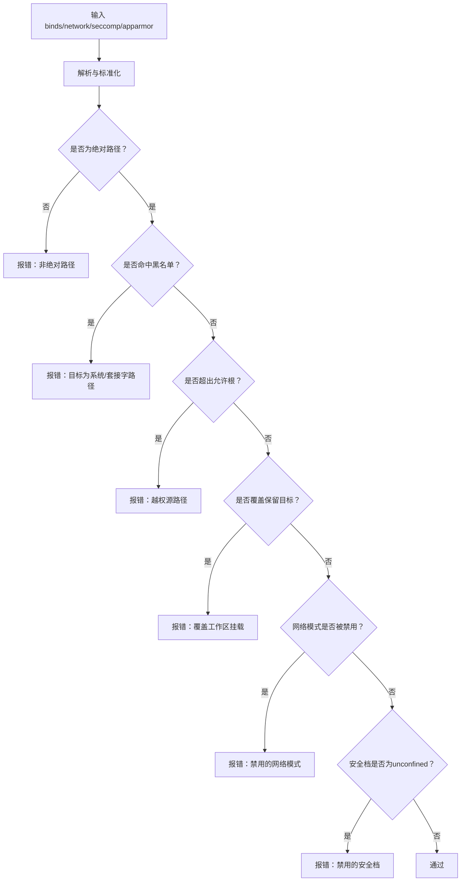
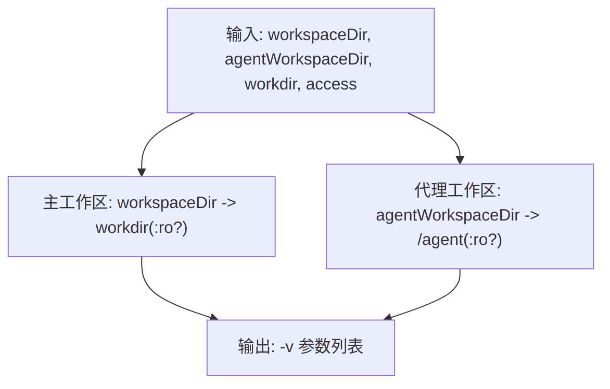
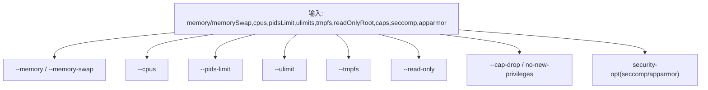
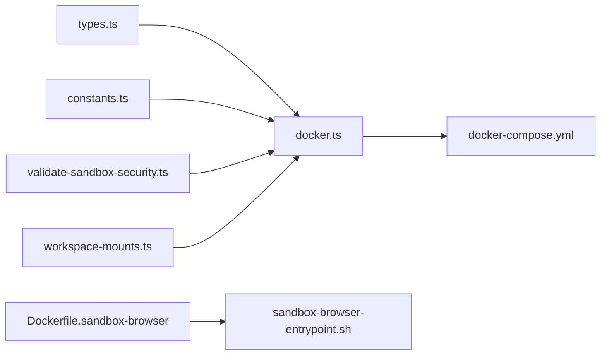

# 容器化沙箱

<cite>
**本文引用的文件**
- [Dockerfile.sandbox](file://Dockerfile.sandbox)
- [Dockerfile.sandbox-common](file://Dockerfile.sandbox-common)
- [Dockerfile.sandbox-browser](file://Dockerfile.sandbox-browser)
- [docker.ts](file://src/agents/sandbox/docker.ts)
- [types.ts](file://src/agents/sandbox/types.ts)
- [constants.ts](file://src/agents/sandbox/constants.ts)
- [workspace-mounts.ts](file://src/agents/sandbox/workspace-mounts.ts)
- [validate-sandbox-security.ts](file://src/agents/sandbox/validate-sandbox-security.ts)
- [docker-compose.yml](file://docker-compose.yml)
- [sandbox-browser-entrypoint.sh](file://scripts/sandbox-browser-entrypoint.sh)
</cite>

## 目录
1. [简介](#简介)
2. [项目结构](#项目结构)
3. [核心组件](#核心组件)
4. [架构总览](#架构总览)
5. [详细组件分析](#详细组件分析)
6. [依赖关系分析](#依赖关系分析)
7. [性能考量](#性能考量)
8. [故障排查指南](#故障排查指南)
9. [结论](#结论)
10. [附录：配置示例与最佳实践](#附录配置示例与最佳实践)

## 简介
本文件面向 OpenClaw 的容器化沙箱系统，系统性阐述 Docker 在沙箱中的角色与实现原理，覆盖镜像管理、容器生命周期管理、资源配额控制、启动参数构建、网络与存储配置、清理与回收策略、跨平台差异与兼容性、故障恢复与健康检查、安全隔离边界与性能影响等主题。读者可据此理解如何在不同平台上可靠地运行受控的执行环境，并将其集成到 OpenClaw 的网关与工具链中。

## 项目结构
围绕容器化沙箱的关键文件组织如下：
- 镜像定义：基础与通用工具镜像、浏览器镜像
- 运行时实现：Docker 命令封装、容器生命周期、安全校验、工作区挂载
- 编排与部署：Compose 文件、入口脚本
- 类型与常量：配置类型、默认值、路径与端口

**图表来源**
- [Dockerfile.sandbox:1-24](file://Dockerfile.sandbox#L1-L24)
- [Dockerfile.sandbox-common:1-48](file://Dockerfile.sandbox-common#L1-L48)
- [Dockerfile.sandbox-browser:1-35](file://Dockerfile.sandbox-browser#L1-L35)
- [docker.ts:1-568](file://src/agents/sandbox/docker.ts#L1-L568)
- [validate-sandbox-security.ts:1-344](file://src/agents/sandbox/validate-sandbox-security.ts#L1-L344)
- [workspace-mounts.ts:1-29](file://src/agents/sandbox/workspace-mounts.ts#L1-L29)
- [types.ts:1-91](file://src/agents/sandbox/types.ts#L1-L91)
- [constants.ts:1-55](file://src/agents/sandbox/constants.ts#L1-L55)
- [docker-compose.yml:1-77](file://docker-compose.yml#L1-L77)
- [sandbox-browser-entrypoint.sh:1-128](file://scripts/sandbox-browser-entrypoint.sh#L1-L128)

**章节来源**
- [Dockerfile.sandbox:1-24](file://Dockerfile.sandbox#L1-L24)
- [Dockerfile.sandbox-common:1-48](file://Dockerfile.sandbox-common#L1-L48)
- [Dockerfile.sandbox-browser:1-35](file://Dockerfile.sandbox-browser#L1-L35)
- [docker.ts:1-568](file://src/agents/sandbox/docker.ts#L1-L568)
- [validate-sandbox-security.ts:1-344](file://src/agents/sandbox/validate-sandbox-security.ts#L1-L344)
- [workspace-mounts.ts:1-29](file://src/agents/sandbox/workspace-mounts.ts#L1-L29)
- [types.ts:1-91](file://src/agents/sandbox/types.ts#L1-L91)
- [constants.ts:1-55](file://src/agents/sandbox/constants.ts#L1-L55)
- [docker-compose.yml:1-77](file://docker-compose.yml#L1-L77)
- [sandbox-browser-entrypoint.sh:1-128](file://scripts/sandbox-browser-entrypoint.sh#L1-L128)

## 核心组件
- 镜像层：提供最小可用的基础系统与按需扩展（通用工具、浏览器）。
- 运行时：封装 Docker CLI 调用、构建容器创建参数、执行容器生命周期操作、进行安全校验与资源配额设置。
- 挂载与网络：根据工作区访问级别生成只读/读写挂载；支持自定义 DNS、hosts、网络模式与安全配置。
- 清理与回收：基于配置哈希与热容器窗口策略，自动重建或重启容器；结合注册表记录最后使用时间。
- 浏览器沙箱：提供带 VNC/noVNC 与 CDP 的无头/有头浏览器运行环境。
- 编排与健康检查：通过 Compose 启动网关与 CLI 服务，内置健康检查以保障可用性。

**章节来源**
- [docker.ts:182-567](file://src/agents/sandbox/docker.ts#L182-L567)
- [validate-sandbox-security.ts:328-343](file://src/agents/sandbox/validate-sandbox-security.ts#L328-L343)
- [workspace-mounts.ts:12-28](file://src/agents/sandbox/workspace-mounts.ts#L12-L28)
- [types.ts:55-91](file://src/agents/sandbox/types.ts#L55-L91)
- [constants.ts:50-55](file://src/agents/sandbox/constants.ts#L50-L55)
- [docker-compose.yml:38-49](file://docker-compose.yml#L38-L49)

## 架构总览
下图展示从配置到容器运行、再到工作区与网络交互的整体流程。

**图表来源**
- [docker.ts:492-567](file://src/agents/sandbox/docker.ts#L492-L567)
- [validate-sandbox-security.ts:328-343](file://src/agents/sandbox/validate-sandbox-security.ts#L328-L343)
- [workspace-mounts.ts:12-28](file://src/agents/sandbox/workspace-mounts.ts#L12-L28)

## 详细组件分析

### 组件一：Docker 命令封装与容器生命周期
- 命令封装：统一解析 Windows/Unix 跨平台调用，支持超时与中断信号；错误处理包含 ENOENT 友好提示。
- 镜像管理：检查镜像是否存在，若为默认镜像则拉取并打标签；否则抛出明确错误。
- 容器状态：查询运行状态，用于决定是否重建或启动。
- 创建参数：集中构建容器创建参数，含标签、只读根文件系统、tmpfs、网络、用户、环境变量、能力集、安全选项、DNS、hosts、PID/内存/CPU/ulimit 等。
- 工作区挂载：依据访问级别生成主工作区与代理工作区挂载参数。
- 自定义绑定：追加用户自定义绑定，确保安全校验通过。
- 启动与初始化：创建后立即启动；如配置了 setupCommand，则在容器内执行初始化脚本。
- 注册表更新：记录容器名、会话键、创建/最后使用时间、镜像与配置哈希。

**图表来源**
- [docker.ts:258-475](file://src/agents/sandbox/docker.ts#L258-L475)

**章节来源**
- [docker.ts:67-189](file://src/agents/sandbox/docker.ts#L67-L189)
- [docker.ts:258-269](file://src/agents/sandbox/docker.ts#L258-L269)
- [docker.ts:271-279](file://src/agents/sandbox/docker.ts#L271-L279)
- [docker.ts:317-427](file://src/agents/sandbox/docker.ts#L317-L427)
- [docker.ts:438-475](file://src/agents/sandbox/docker.ts#L438-L475)
- [docker.ts:492-567](file://src/agents/sandbox/docker.ts#L492-L567)

### 组件二：安全校验与绑定策略
- 绑定挂载黑名单：禁止挂载系统关键目录与 Docker 套接字路径；支持保留目标路径检测，避免覆盖工作区挂载。
- 允许根校验：仅允许绝对路径；支持危险放行开关，但默认严格限制。
- 网络模式：禁止 host 与容器命名空间加入模式，防止绕过网络隔离。
- 安全档：禁止 unconfined 的 seccomp/AppArmor，要求使用受限或自定义策略。
- 错误信息：对每类违规给出明确原因与建议。

**图表来源**
- [validate-sandbox-security.ts:96-180](file://src/agents/sandbox/validate-sandbox-security.ts#L96-L180)
- [validate-sandbox-security.ts:283-306](file://src/agents/sandbox/validate-sandbox-security.ts#L283-L306)
- [validate-sandbox-security.ts:308-326](file://src/agents/sandbox/validate-sandbox-security.ts#L308-L326)

**章节来源**
- [validate-sandbox-security.ts:16-37](file://src/agents/sandbox/validate-sandbox-security.ts#L16-L37)
- [validate-sandbox-security.ts:182-281](file://src/agents/sandbox/validate-sandbox-security.ts#L182-L281)
- [validate-sandbox-security.ts:283-326](file://src/agents/sandbox/validate-sandbox-security.ts#L283-L326)

### 组件三：工作区挂载与访问控制
- 主工作区挂载：将宿主工作区目录挂载到容器工作目录，依据访问级别选择读写或只读。
- 代理工作区挂载：当与主工作区不同时，挂载到固定路径，读写/只读由访问级别决定。
- 参数生成：统一在创建阶段追加挂载参数，避免分散逻辑。

**图表来源**
- [workspace-mounts.ts:12-28](file://src/agents/sandbox/workspace-mounts.ts#L12-L28)

**章节来源**
- [workspace-mounts.ts:1-29](file://src/agents/sandbox/workspace-mounts.ts#L1-L29)

### 组件四：资源配额与限制
- 内存与内存交换：支持设置内存上限与交换上限。
- CPU：限制可用 CPU 数。
- PID：限制进程数。
- ulimit：支持多格式（数字、字符串、软硬分离对象）。
- tmpfs：按需挂载临时文件系统。
- 只读根文件系统：提升安全性。
- 能力与安全选项：drop 能力、禁用新权限、可选 seccomp/AppArmor 策略。

**图表来源**
- [docker.ts:391-420](file://src/agents/sandbox/docker.ts#L391-L420)

**章节来源**
- [docker.ts:281-315](file://src/agents/sandbox/docker.ts#L281-L315)
- [docker.ts:391-420](file://src/agents/sandbox/docker.ts#L391-L420)

### 组件五：容器镜像与启动参数
- 默认镜像：若为默认镜像，自动拉取 Debian 书虫精简版并重命名为默认沙箱镜像。
- 启动参数：集中生成，包含标签、网络、DNS、hosts、用户、环境变量、安全选项、资源限制、绑定挂载等。
- 工作目录：设置容器工作目录。
- 初始化命令：可选在容器内执行初始化脚本。

**章节来源**
- [docker.ts:258-269](file://src/agents/sandbox/docker.ts#L258-L269)
- [docker.ts:317-427](file://src/agents/sandbox/docker.ts#L317-L427)
- [docker.ts:472-474](file://src/agents/sandbox/docker.ts#L472-L474)

### 组件六：浏览器沙箱与网络暴露
- 镜像：安装 Chromium、VNC、noVNC、Xvfb 等组件。
- 入口脚本：配置显示、CDP 端口、VNC/noVNC、无头模式、禁用图形标志、扩展、渲染进程限制、沙箱开关等；通过 socat 将 CDP 端口映射到容器内部调试端口；在启用 noVNC 时生成随机密码并启动 VNC 与 websocket 代理。
- 端口：默认暴露 CDP、VNC、noVNC 端口，可通过环境变量调整。

**章节来源**
- [Dockerfile.sandbox-browser:1-35](file://Dockerfile.sandbox-browser#L1-L35)
- [sandbox-browser-entrypoint.sh:19-125](file://scripts/sandbox-browser-entrypoint.sh#L19-L125)

### 组件七：清理策略与资源回收
- 配置哈希：每次创建容器时写入 openclaw.configHash 标签；后续检查若不一致则触发重建或提示重建。
- 热容器窗口：最近使用过的容器在配置变更时仅提示重建，避免强制中断。
- 注册表：记录容器名、会话键、创建/最后使用时间、镜像与配置哈希，便于回收与审计。
- 周期性修剪：通过 prune 配置（空闲小时与最大存活天数）控制容器生命周期。

**章节来源**
- [docker.ts:477-490](file://src/agents/sandbox/docker.ts#L477-L490)
- [docker.ts:508-567](file://src/agents/sandbox/docker.ts#L508-L567)
- [constants.ts:48-51](file://src/agents/sandbox/constants.ts#L48-L51)

### 组件八：跨平台差异与兼容性
- Windows 跨平台：解析 docker 可执行程序，支持 Windows 隐藏窗口与 shell 回退策略。
- 平台差异：在 Windows 上通过包装器解析命令与参数，保证行为一致性。
- Docker 命令缺失：捕获 ENOENT 并给出明确提示，引导用户安装 Docker 或关闭沙箱模式。

**章节来源**
- [docker.ts:46-65](file://src/agents/sandbox/docker.ts#L46-L65)
- [docker.ts:105-125](file://src/agents/sandbox/docker.ts#L105-L125)

### 组件九：健康检查与故障恢复
- 网关健康检查：通过 HTTP 探针检查 /healthz，失败时按配置重试。
- 故障恢复：容器异常退出时，由 Compose 的 restart 策略或上层调度器负责重启；沙箱侧通过重建与标签哈希机制确保配置一致性。
- 日志与诊断：运行时日志记录敏感环境变量阻断与可疑项警告，便于定位问题。

**章节来源**
- [docker-compose.yml:38-49](file://docker-compose.yml#L38-L49)
- [docker.ts:372-377](file://src/agents/sandbox/docker.ts#L372-L377)

## 依赖关系分析
- docker.ts 依赖：
  - validate-sandbox-security.ts：安全校验
  - workspace-mounts.ts：挂载参数生成
  - constants.ts：默认值与路径
  - types.ts：配置类型
- 浏览器镜像依赖入口脚本：sandbox-browser-entrypoint.sh
- 编排依赖：docker-compose.yml 中的服务间依赖与健康检查

**图表来源**
- [docker.ts:168-174](file://src/agents/sandbox/docker.ts#L168-L174)
- [types.ts:1-91](file://src/agents/sandbox/types.ts#L1-L91)
- [constants.ts:1-55](file://src/agents/sandbox/constants.ts#L1-L55)
- [validate-sandbox-security.ts:1-344](file://src/agents/sandbox/validate-sandbox-security.ts#L1-L344)
- [workspace-mounts.ts:1-29](file://src/agents/sandbox/workspace-mounts.ts#L1-L29)
- [docker-compose.yml:1-77](file://docker-compose.yml#L1-L77)
- [Dockerfile.sandbox-browser:1-35](file://Dockerfile.sandbox-browser#L1-L35)
- [sandbox-browser-entrypoint.sh:1-128](file://scripts/sandbox-browser-entrypoint.sh#L1-L128)

**章节来源**
- [docker.ts:168-174](file://src/agents/sandbox/docker.ts#L168-L174)
- [docker-compose.yml:51-77](file://docker-compose.yml#L51-L77)

## 性能考量
- 镜像体积：采用 Debian 书虫精简镜像，减少下载与启动时间。
- 包缓存：构建时使用共享 apt 缓存，加速重复构建。
- 临时文件系统：对敏感或频繁读写的目录使用 tmpfs，降低磁盘 IO。
- CPU/内存限制：通过 cpus 与 memory/memory-swap 控制资源占用，避免“饿死”宿主。
- 进程数限制：pids-limit 限制容器内进程数量，降低系统压力。
- 网络隔离：默认桥接网络，避免 host 模式带来的性能与安全风险。
- 浏览器优化：无头模式与禁用图形标志可显著降低资源消耗；CDP 与 VNC/noVNC 仅在需要时启用。

[本节为通用指导，无需列出具体文件来源]

## 故障排查指南
- Docker 命令不可用：出现 ENOENT 时，确认已安装 Docker 并将 docker 命令加入 PATH；或在配置中关闭沙箱模式。
- 镜像拉取失败：检查网络与镜像仓库可达性；必要时手动拉取默认镜像并重命名。
- 绑定挂载被拒：检查绑定源路径是否为绝对路径、是否位于允许根内、是否覆盖保留目标路径；按错误提示修正。
- 网络模式被拒：避免使用 host 或 container:* 网络模式；改用自定义 bridge 网络。
- 安全档被拒：不要使用 unconfined；提供自定义 seccomp/AppArmor 策略文件。
- 容器无法启动：查看容器日志与注册表记录；如配置哈希不一致，按提示执行重建。
- 浏览器无法连接：确认 CDP/VNC/noVNC 端口映射正确，且入口脚本已成功启动各服务；检查防火墙与源地址范围。

**章节来源**
- [docker.ts:105-125](file://src/agents/sandbox/docker.ts#L105-L125)
- [docker.ts:258-269](file://src/agents/sandbox/docker.ts#L258-L269)
- [validate-sandbox-security.ts:201-227](file://src/agents/sandbox/validate-sandbox-security.ts#L201-L227)
- [validate-sandbox-security.ts:292-305](file://src/agents/sandbox/validate-sandbox-security.ts#L292-L305)
- [validate-sandbox-security.ts:310-314](file://src/agents/sandbox/validate-sandbox-security.ts#L310-L314)
- [sandbox-browser-entrypoint.sh:106-125](file://scripts/sandbox-browser-entrypoint.sh#L106-L125)

## 结论
OpenClaw 的容器化沙箱通过严格的镜像分层、统一的 Docker 命令封装、全面的安全校验与资源配额控制，实现了在多平台上的可重复、可审计、可恢复的受控执行环境。配合工作区挂载策略、健康检查与清理回收机制，能够在保证安全隔离的同时兼顾性能与易用性。对于浏览器场景，提供了开箱即用的 CDP/VNC/noVNC 能力，满足自动化与可视化需求。

[本节为总结，无需列出具体文件来源]

## 附录：配置示例与最佳实践
- 配置要点
  - 模式与作用域：mode 支持 off/non-main/all；scope 支持 session/agent/shared。
  - 工作区访问：none/ro/rw，按需选择。
  - 容器前缀与工作目录：自定义容器名前缀与工作目录。
  - 网络与 DNS：指定网络、DNS、hosts。
  - 安全与能力：drop 能力、禁用新权限、提供 seccomp/AppArmor 策略。
  - 资源配额：memory/memory-swap/cpus/pids/ulimit/tmpfs。
  - 绑定挂载：仅使用绝对路径，避免系统关键目录与 Docker 套接字；必要时使用危险放行开关并充分信任运行时。
  - 浏览器：启用/禁用无头模式、设置 CDP/VNC/noVNC 端口、可选 noVNC 密码与源地址范围。
- 最佳实践
  - 使用默认镜像或自行构建的通用镜像，避免在沙箱内再次拉取大镜像。
  - 为每个会话/代理设置独立的容器前缀与工作区，便于隔离与回收。
  - 启用只读根文件系统与必要的 tmpfs，减少持久化风险。
  - 限制 CPU/内存/PID，防止资源滥用。
  - 仅在确有需要时开启 host 网络或 container:* 网络模式。
  - 对敏感环境变量进行白名单过滤，避免泄露。
  - 定期清理长时间未使用的容器，释放资源。
  - 在生产环境启用健康检查与重启策略，提高可用性。

**章节来源**
- [types.ts:55-91](file://src/agents/sandbox/types.ts#L55-L91)
- [constants.ts:5-11](file://src/agents/sandbox/constants.ts#L5-L11)
- [constants.ts:39-48](file://src/agents/sandbox/constants.ts#L39-L48)
- [docker.ts:317-427](file://src/agents/sandbox/docker.ts#L317-L427)
- [validate-sandbox-security.ts:328-343](file://src/agents/sandbox/validate-sandbox-security.ts#L328-L343)
- [docker-compose.yml:38-49](file://docker-compose.yml#L38-L49)