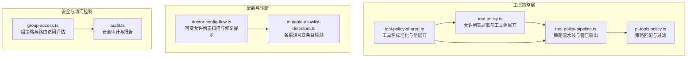
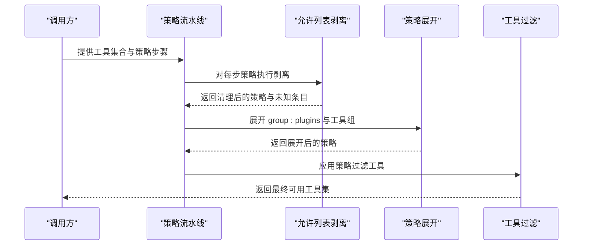
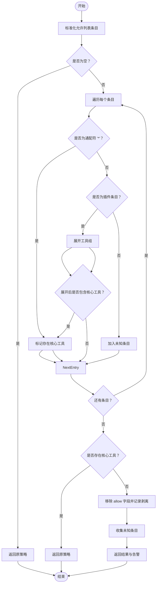
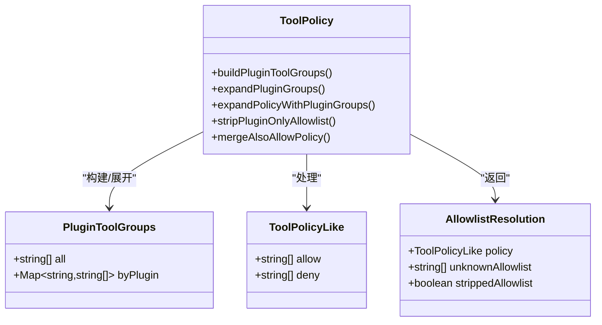
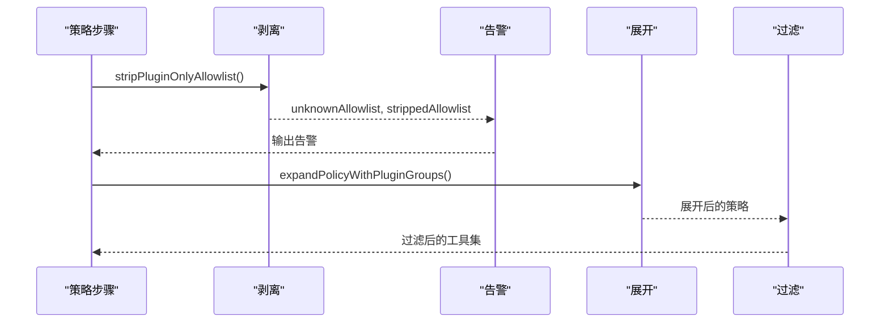
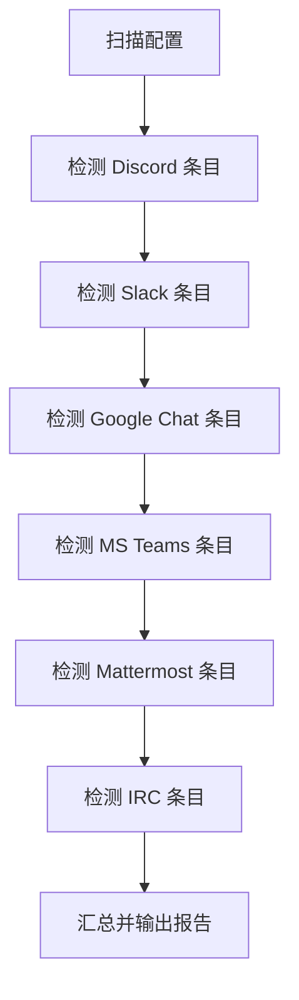
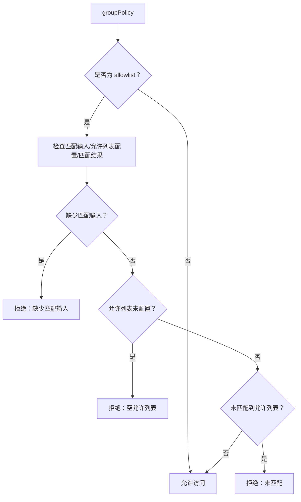
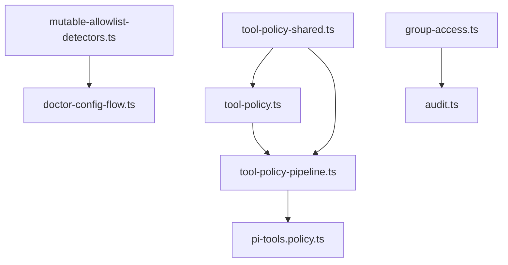

# 允许列表清理机制

<cite>
**本文档引用的文件**
- [src/agents/tool-policy.ts](file://src/agents/tool-policy.ts)
- [src/agents/tool-policy-pipeline.ts](file://src/agents/tool-policy-pipeline.ts)
- [src/agents/tool-policy-shared.ts](file://src/agents/tool-policy-shared.ts)
- [src/agents/pi-tools.policy.ts](file://src/agents/pi-tools.policy.ts)
- [src/commands/doctor-config-flow.ts](file://src/commands/doctor-config-flow.ts)
- [src/security/mutable-allowlist-detectors.ts](file://src/security/mutable-allowlist-detectors.ts)
- [src/plugin-sdk/group-access.ts](file://src/plugin-sdk/group-access.ts)
- [src/security/audit.ts](file://src/security/audit.ts)
- [src/agents/tool-policy.plugin-only-allowlist.test.ts](file://src/agents/tool-policy.plugin-only-allowlist.test.ts)
- [src/agents/tool-policy-pipeline.test.ts](file://src/agents/tool-policy-pipeline.test.ts)
</cite>

## 目录
1. [简介](#简介)
2. [项目结构](#项目结构)
3. [核心组件](#核心组件)
4. [架构概览](#架构概览)
5. [详细组件分析](#详细组件分析)
6. [依赖关系分析](#依赖关系分析)
7. [性能考量](#性能考量)
8. [故障排除指南](#故障排除指南)
9. [结论](#结论)
10. [附录](#附录)

## 简介
本文件系统性阐述 OpenClaw 的允许列表清理机制，重点覆盖以下方面：
- 允许列表剥离的触发条件与判断逻辑
- 核心工具检测与插件工具识别算法
- 安全考虑与风险控制
- 未知工具条目的识别与报告机制
- 配置选项与自定义策略
- 日志记录与审计功能
- 清理后的策略重写与兼容性处理

该机制旨在确保当允许列表仅包含插件工具而无任何核心工具时，自动剥离该允许列表，避免意外禁用核心工具；同时对未知条目进行告警并提供修复建议。

## 项目结构
允许列表清理机制涉及的核心模块包括：
- 工具策略与清理：tool-policy.ts、tool-policy-pipeline.ts、tool-policy-shared.ts
- 策略应用与过滤：pi-tools.policy.ts
- 配置诊断与修复：doctor-config-flow.ts
- 可变允许列表检测器：mutable-allowlist-detectors.ts
- 组访问控制：group-access.ts
- 安全审计：audit.ts
- 测试用例：tool-policy.plugin-only-allowlist.test.ts、tool-policy-pipeline.test.ts

**图表来源**
- [src/agents/tool-policy.ts:156-200](file://src/agents/tool-policy.ts#L156-L200)
- [src/agents/tool-policy-pipeline.ts:65-108](file://src/agents/tool-policy-pipeline.ts#L65-L108)
- [src/agents/tool-policy-shared.ts:19-43](file://src/agents/tool-policy-shared.ts#L19-L43)
- [src/agents/pi-tools.policy.ts:150-156](file://src/agents/pi-tools.policy.ts#L150-L156)
- [src/commands/doctor-config-flow.ts:654-652](file://src/commands/doctor-config-flow.ts#L654-L652)
- [src/security/mutable-allowlist-detectors.ts:1-102](file://src/security/mutable-allowlist-detectors.ts#L1-L102)
- [src/plugin-sdk/group-access.ts:114-143](file://src/plugin-sdk/group-access.ts#L114-L143)
- [src/security/audit.ts:87-1129](file://src/security/audit.ts#L87-L1129)

**章节来源**
- [src/agents/tool-policy.ts:156-200](file://src/agents/tool-policy.ts#L156-L200)
- [src/agents/tool-policy-pipeline.ts:65-108](file://src/agents/tool-policy-pipeline.ts#L65-L108)
- [src/commands/doctor-config-flow.ts:654-652](file://src/commands/doctor-config-flow.ts#L654-L652)

## 核心组件
- 允许列表剥离函数：在仅包含插件工具且无核心工具匹配时，移除 allow 字段以避免禁用核心工具。
- 插件工具组构建与展开：将插件工具按插件 ID 分组，并支持 group:plugins 展开。
- 策略流水线：按优先级顺序应用多层策略（配置文件、全局、代理等），并在每步执行剥离与告警。
- 可变允许列表检测：针对 Discord、Slack、Google Chat、MS Teams、Mattermost、IRC 等渠道检测可变条目。
- 组访问控制：根据 groupPolicy 与 allowlist 状态决定路由是否允许。
- 安全审计：提供日志与报告能力，支持 JSON 输出与修复建议。

**章节来源**
- [src/agents/tool-policy.ts:94-154](file://src/agents/tool-policy.ts#L94-L154)
- [src/agents/tool-policy-pipeline.ts:11-63](file://src/agents/tool-policy-pipeline.ts#L11-L63)
- [src/security/mutable-allowlist-detectors.ts:1-102](file://src/security/mutable-allowlist-detectors.ts#L1-L102)
- [src/plugin-sdk/group-access.ts:114-143](file://src/plugin-sdk/group-access.ts#L114-L143)

## 架构概览
允许列表清理在策略流水线中执行，核心流程如下：

**图表来源**
- [src/agents/tool-policy-pipeline.ts:65-108](file://src/agents/tool-policy-pipeline.ts#L65-L108)
- [src/agents/tool-policy.ts:156-200](file://src/agents/tool-policy.ts#L156-L200)
- [src/agents/tool-policy.ts:115-154](file://src/agents/tool-policy.ts#L115-L154)
- [src/agents/pi-tools.policy.ts:150-156](file://src/agents/pi-tools.policy.ts#L150-L156)

## 详细组件分析

### 允许列表剥离与判断逻辑
- 触发条件：当允许列表存在但不包含任何核心工具条目时，且未显式包含通配符 "*"，则判定为“仅插件”允许列表。
- 判断流程：
  1) 标准化允许列表条目（去空白、小写、别名映射）。
  2) 检查是否存在通配符 "*"，若存在则视为包含核心工具。
  3) 识别条目是否属于插件工具或插件组（group:plugins 或具体插件 ID）。
  4) 展开工具组后，检查是否有与核心工具集合的交集。
  5) 若无核心工具匹配，则剥离 allow 字段；同时收集未知条目用于告警。
- 告警策略：若存在未知条目，根据是否已剥离给出不同提示；若允许列表被剥离，提示使用 tools.alsoAllow 进行附加启用。

**图表来源**
- [src/agents/tool-policy.ts:156-200](file://src/agents/tool-policy.ts#L156-L200)

**章节来源**
- [src/agents/tool-policy.ts:156-200](file://src/agents/tool-policy.ts#L156-L200)
- [src/agents/tool-policy.plugin-only-allowlist.test.ts:29-56](file://src/agents/tool-policy.plugin-only-allowlist.test.ts#L29-L56)

### 核心工具检测与插件工具识别算法
- 核心工具集合：从工具列表中筛选无插件元数据的工具名称，形成核心工具集合。
- 插件工具组构建：遍历工具，提取插件元数据中的插件 ID，将工具名标准化后按插件 ID 分组。
- 插件组展开：支持 group:plugins 展开为所有插件工具，或按插件 ID 展开为对应工具列表。
- 工具组展开：将工具组别名映射为实际工具名集合，再进行去重。

**图表来源**
- [src/agents/tool-policy.ts:64-73](file://src/agents/tool-policy.ts#L64-L73)
- [src/agents/tool-policy.ts:94-154](file://src/agents/tool-policy.ts#L94-L154)
- [src/agents/tool-policy.ts:156-200](file://src/agents/tool-policy.ts#L156-L200)

**章节来源**
- [src/agents/tool-policy.ts:94-154](file://src/agents/tool-policy.ts#L94-L154)
- [src/agents/tool-policy-shared.ts:19-43](file://src/agents/tool-policy-shared.ts#L19-L43)

### 策略流水线与告警
- 步骤构建：按优先级顺序生成策略步骤，如 profile、provider profile、全局 allow、agent allow、group allow 等。
- 执行流程：对每一步策略先执行剥离与未知条目收集，再展开并应用过滤；最后输出告警信息。
- 告警内容：未知条目清单与剥离原因说明，指导用户使用 tools.alsoAllow 实现附加启用。

**图表来源**
- [src/agents/tool-policy-pipeline.ts:17-63](file://src/agents/tool-policy-pipeline.ts#L17-L63)
- [src/agents/tool-policy-pipeline.ts:65-108](file://src/agents/tool-policy-pipeline.ts#L65-L108)

**章节来源**
- [src/agents/tool-policy-pipeline.ts:65-108](file://src/agents/tool-policy-pipeline.ts#L65-L108)
- [src/agents/tool-policy-pipeline.test.ts:27-66](file://src/agents/tool-policy-pipeline.test.ts#L27-L66)

### 可变允许列表检测与报告
- 检测范围：Discord、Slack、Google Chat、MS Teams、Mattermost、IRC 等渠道的 allowFrom/allowlists。
- 检测规则：针对各渠道的提及格式、前缀、ID 规范等进行判断，识别可变条目。
- 报告机制：统计命中数量、示例条目与路径，提供修复建议（启用危险匹配开关或改用稳定 ID）。

**图表来源**
- [src/commands/doctor-config-flow.ts:654-799](file://src/commands/doctor-config-flow.ts#L654-L799)
- [src/security/mutable-allowlist-detectors.ts:1-102](file://src/security/mutable-allowlist-detectors.ts#L1-L102)

**章节来源**
- [src/commands/doctor-config-flow.ts:1910-1936](file://src/commands/doctor-config-flow.ts#L1910-L1936)
- [src/security/mutable-allowlist-detectors.ts:1-102](file://src/security/mutable-allowlist-detectors.ts#L1-L102)

### 组访问控制与策略重写
- 组策略评估：当 groupPolicy 为 allowlist 时，若缺少匹配输入、未配置允许列表或未匹配到允许列表，则拒绝访问。
- 路由访问评估：结合路由级别的 allowlist 配置与启用状态，进行细粒度控制。
- 策略重写：在允许列表缺失或无效时，通过诊断工具提供修复建议（如添加通配符、完善允许列表）。

**图表来源**
- [src/plugin-sdk/group-access.ts:114-143](file://src/plugin-sdk/group-access.ts#L114-L143)

**章节来源**
- [src/plugin-sdk/group-access.ts:114-143](file://src/plugin-sdk/group-access.ts#L114-L143)
- [src/commands/doctor-config-flow.ts:1825-1834](file://src/commands/doctor-config-flow.ts#L1825-L1834)

### 安全考虑与风险控制
- 仅插件允许列表剥离：防止误伤核心工具，确保关键能力不被意外禁用。
- 未知条目告警：提醒用户确认条目有效性，避免拼写错误或无效条目导致策略失效。
- 可变允许列表检测：识别易受动态变化影响的条目，降低因名称/邮箱等不稳定标识导致的越权风险。
- 组策略默认收紧：在缺少配置时采用更严格的安全策略（如 allowlist），并通过诊断工具引导修复。

**章节来源**
- [src/agents/tool-policy.ts:188-194](file://src/agents/tool-policy.ts#L188-L194)
- [src/commands/doctor-config-flow.ts:1910-1936](file://src/commands/doctor-config-flow.ts#L1910-L1936)
- [src/config/runtime-group-policy.ts:16-27](file://src/config/runtime-group-policy.ts#L16-L27)

## 依赖关系分析
- 工具策略层依赖共享工具名标准化与组展开能力。
- 策略流水线依赖工具组构建与展开，以及策略匹配与过滤。
- 配置诊断依赖各渠道的可变条目检测器。
- 安全审计贯穿配置与运行时环境检查，提供统一报告接口。

**图表来源**
- [src/agents/tool-policy-shared.ts:19-43](file://src/agents/tool-policy-shared.ts#L19-L43)
- [src/agents/tool-policy.ts:94-154](file://src/agents/tool-policy.ts#L94-L154)
- [src/agents/tool-policy-pipeline.ts:65-108](file://src/agents/tool-policy-pipeline.ts#L65-L108)
- [src/agents/pi-tools.policy.ts:150-156](file://src/agents/pi-tools.policy.ts#L150-L156)
- [src/security/mutable-allowlist-detectors.ts:1-102](file://src/security/mutable-allowlist-detectors.ts#L1-L102)
- [src/commands/doctor-config-flow.ts:654-799](file://src/commands/doctor-config-flow.ts#L654-L799)
- [src/plugin-sdk/group-access.ts:114-143](file://src/plugin-sdk/group-access.ts#L114-L143)
- [src/security/audit.ts:87-1129](file://src/security/audit.ts#L87-L1129)

**章节来源**
- [src/agents/tool-policy-shared.ts:19-43](file://src/agents/tool-policy-shared.ts#L19-L43)
- [src/agents/tool-policy.ts:94-154](file://src/agents/tool-policy.ts#L94-L154)
- [src/agents/tool-policy-pipeline.ts:65-108](file://src/agents/tool-policy-pipeline.ts#L65-L108)
- [src/agents/pi-tools.policy.ts:150-156](file://src/agents/pi-tools.policy.ts#L150-L156)
- [src/security/mutable-allowlist-detectors.ts:1-102](file://src/security/mutable-allowlist-detectors.ts#L1-L102)
- [src/commands/doctor-config-flow.ts:654-799](file://src/commands/doctor-config-flow.ts#L654-L799)
- [src/plugin-sdk/group-access.ts:114-143](file://src/plugin-sdk/group-access.ts#L114-L143)
- [src/security/audit.ts:87-1129](file://src/security/audit.ts#L87-L1129)

## 性能考量
- 标准化与展开操作为线性复杂度，适合大规模工具集。
- 去重与集合运算采用 Set 数据结构，提升查找效率。
- 策略流水线按优先级顺序处理，避免重复计算。
- 建议在高频场景下缓存工具组与策略展开结果，减少重复构建成本。

## 故障排除指南
- 允许列表被意外剥离：检查是否仅包含插件工具且未显式包含核心工具；使用 tools.alsoAllow 添加核心工具。
- 未知条目告警：核对条目是否拼写正确或已被移除；必要时替换为稳定 ID。
- 可变允许列表问题：根据诊断报告中的示例条目与路径，启用危险匹配开关或改用稳定 ID。
- 组策略拒绝访问：检查 groupPolicy 与 allowlist 配置，确保满足匹配输入与允许列表要求。

**章节来源**
- [src/agents/tool-policy-pipeline.test.ts:27-66](file://src/agents/tool-policy-pipeline.test.ts#L27-L66)
- [src/commands/doctor-config-flow.ts:1910-1936](file://src/commands/doctor-config-flow.ts#L1910-L1936)
- [src/plugin-sdk/group-access.ts:114-143](file://src/plugin-sdk/group-access.ts#L114-L143)

## 结论
OpenClaw 的允许列表清理机制通过“仅插件”剥离、未知条目告警与可变条目检测，有效平衡了灵活性与安全性。策略流水线确保在多层级配置下仍能正确应用核心工具保护，配合诊断工具与安全审计，为用户提供清晰的修复路径与可观测的运行状态。

## 附录
- 配置选项与自定义策略
  - tools.alsoAllow：在剥离后追加核心工具，实现“附加启用”而非“完全替代”。
  - tools.profile 与 tools.byProvider.profile：通过预设配置组合核心与插件工具集合。
  - groupPolicy：在缺少配置时采用更严格的默认策略，结合 allowlist 与匹配输入控制访问。
- 日志记录与审计
  - 支持 JSON 输出与修复建议，便于 CI/CD 集成与自动化处理。
  - 安全审计涵盖文件系统权限、日志敏感度与通道安全等维度。

**章节来源**
- [src/agents/tool-policy.ts:202-210](file://src/agents/tool-policy.ts#L202-L210)
- [src/agents/pi-tools.policy.ts:268-323](file://src/agents/pi-tools.policy.ts#L268-L323)
- [src/config/runtime-group-policy.ts:16-27](file://src/config/runtime-group-policy.ts#L16-L27)
- [src/security/audit.ts:87-1129](file://src/security/audit.ts#L87-L1129)