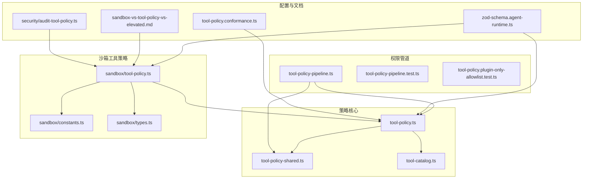
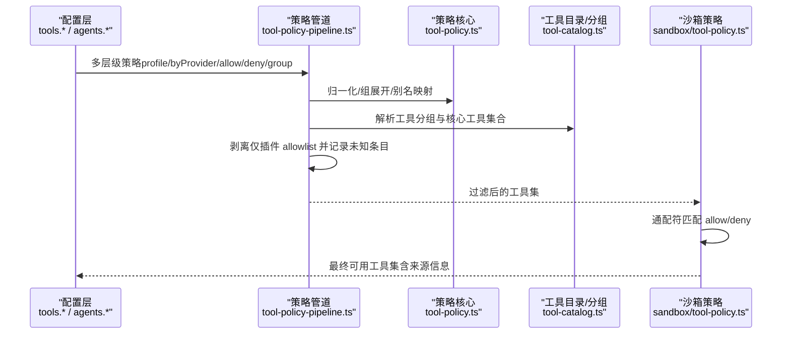
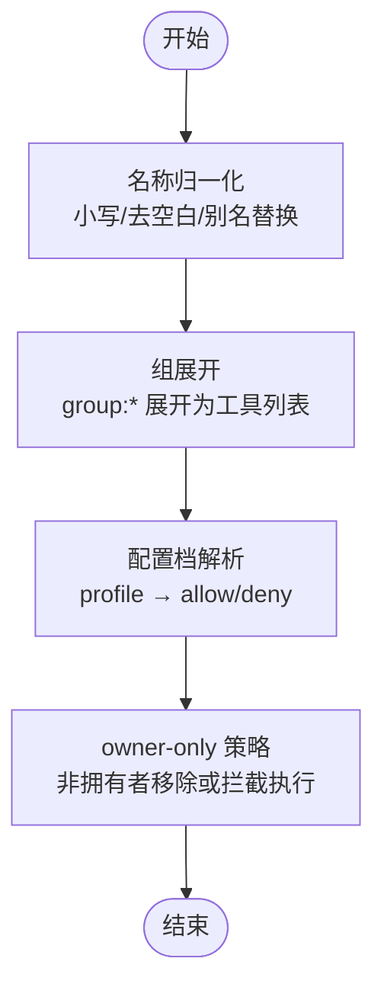
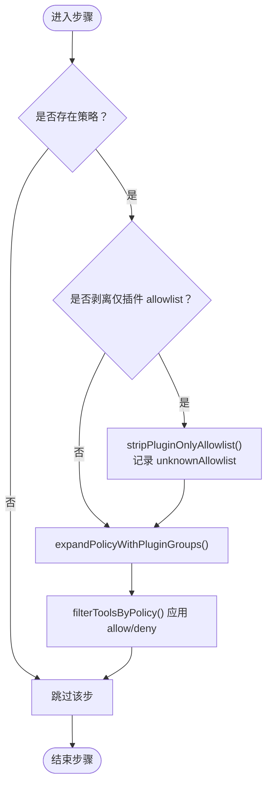
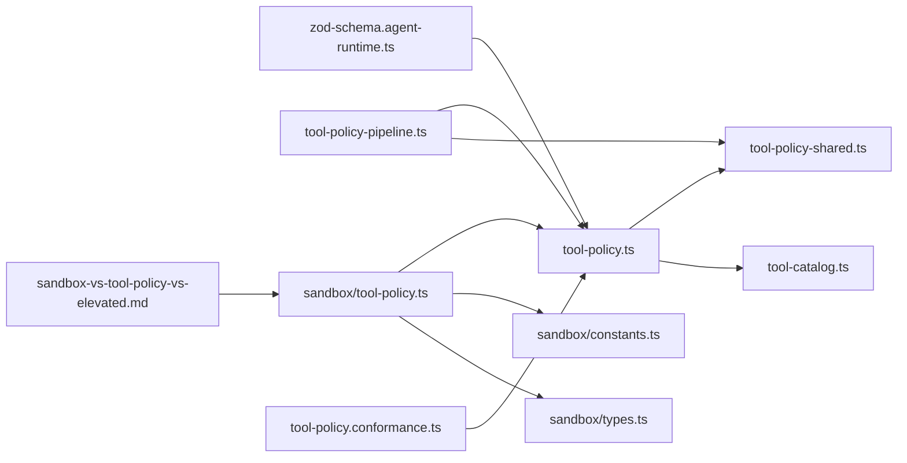

# 工具权限策略

<cite>
**本文引用的文件**
- [src/agents/tool-policy.ts](file://src/agents/tool-policy.ts)
- [src/agents/tool-policy-shared.ts](file://src/agents/tool-policy-shared.ts)
- [src/agents/tool-policy-pipeline.ts](file://src/agents/tool-policy-pipeline.ts)
- [src/agents/tool-policy-pipeline.test.ts](file://src/agents/tool-policy-pipeline.test.ts)
- [src/agents/tool-policy.plugin-only-allowlist.test.ts](file://src/agents/tool-policy.plugin-only-allowlist.test.ts)
- [src/agents/tool-policy.test.ts](file://src/agents/tool-policy.test.ts)
- [src/agents/tool-catalog.ts](file://src/agents/tool-catalog.ts)
- [src/agents/sandbox/tool-policy.ts](file://src/agents/sandbox/tool-policy.ts)
- [src/agents/sandbox/constants.ts](file://src/agents/sandbox/constants.ts)
- [src/agents/sandbox/types.ts](file://src/agents/sandbox/types.ts)
- [src/config/zod-schema.agent-runtime.ts](file://src/config/zod-schema.agent-runtime.ts)
- [docs/gateway/sandbox-vs-tool-policy-vs-elevated.md](file://docs/gateway/sandbox-vs-tool-policy-vs-elevated.md)
- [src/agents/tool-policy.conformance.ts](file://src/agents/tool-policy.conformance.ts)
- [src/security/audit-tool-policy.ts](file://src/security/audit-tool-policy.ts)
</cite>

## 目录
1. [简介](#简介)
2. [项目结构](#项目结构)
3. [核心组件](#核心组件)
4. [架构总览](#架构总览)
5. [组件详解](#组件详解)
6. [依赖关系分析](#依赖关系分析)
7. [性能考量](#性能考量)
8. [故障排查指南](#故障排查指南)
9. [结论](#结论)
10. [附录](#附录)

## 简介
本文件系统性阐述 OpenClaw 的“工具权限策略”体系，覆盖策略解析、权限继承与动态授权、工具白名单、权限管道与组合规则、静态分析与动态验证、自定义策略开发指南、冲突与优先级处理、与代理配置的关系与影响，以及调试与监控方法。目标是帮助开发者与运维人员在不深入源码的前提下，也能高效理解并正确配置工具权限策略。

## 项目结构
围绕工具权限策略的关键代码主要分布在以下模块：
- 工具策略核心：解析与合并、组展开、别名归一化、所有者专用工具策略等
- 工具目录与分组：内置工具清单、工具分组、配置档（profile）与工具映射
- 权限管道：多层级策略的顺序应用与插件白名单清理
- 沙箱工具策略：沙箱模式下的允许/拒绝匹配与默认值
- 配置与约束：Zod Schema 对策略字段的约束与校验
- 文档与审计：策略矩阵说明、策略一致性快照与审计入口

图表来源
- [src/agents/tool-policy.ts:1-211](file://src/agents/tool-policy.ts#L1-L211)
- [src/agents/tool-policy-shared.ts:1-50](file://src/agents/tool-policy-shared.ts#L1-L50)
- [src/agents/tool-catalog.ts:1-327](file://src/agents/tool-catalog.ts#L1-L327)
- [src/agents/tool-policy-pipeline.ts:1-109](file://src/agents/tool-policy-pipeline.ts#L1-L109)
- [src/agents/sandbox/tool-policy.ts:1-110](file://src/agents/sandbox/tool-policy.ts#L1-L110)
- [src/agents/sandbox/constants.ts:1-55](file://src/agents/sandbox/constants.ts#L1-L55)
- [src/config/zod-schema.agent-runtime.ts:244-399](file://src/config/zod-schema.agent-runtime.ts#L244-L399)
- [docs/gateway/sandbox-vs-tool-policy-vs-elevated.md:1-129](file://docs/gateway/sandbox-vs-tool-policy-vs-elevated.md#L1-L129)

章节来源
- [src/agents/tool-policy.ts:1-211](file://src/agents/tool-policy.ts#L1-L211)
- [src/agents/tool-policy-pipeline.ts:1-109](file://src/agents/tool-policy-pipeline.ts#L1-L109)
- [src/agents/sandbox/tool-policy.ts:1-110](file://src/agents/sandbox/tool-policy.ts#L1-L110)
- [src/config/zod-schema.agent-runtime.ts:244-399](file://src/config/zod-schema.agent-runtime.ts#L244-L399)

## 核心组件
- 工具策略解析与归一化
  - 名称归一化与别名映射（如 bash → exec）
  - 组展开（group:runtime、group:fs 等）
  - 配置档（profile）解析（minimal/coding/messaging/full）
- 插件工具白名单清理
  - 仅插件工具的 allowlist 自动剥离，避免误禁用核心工具
  - 记录未知条目并给出提示
- 权限管道
  - 多层级策略按序应用：profile → byProvider profile → 全局 allow → byProvider allow → agent allow → agent byProvider allow → group allow
  - 每步可选择剥离仅插件 allowlist，并对未知条目发出警告
- 沙箱工具策略
  - 支持通配符与组展开
  - 默认 allow/deny 与自动注入 image 工具
  - 明确来源（agent/global/default）用于诊断
- 配置约束与校验
  - Zod Schema 对 allow/alsoAllow 冲突进行约束
  - 提供策略一致性快照（conformance）

章节来源
- [src/agents/tool-policy.ts:59-211](file://src/agents/tool-policy.ts#L59-L211)
- [src/agents/tool-policy-shared.ts:12-47](file://src/agents/tool-policy-shared.ts#L12-L47)
- [src/agents/tool-policy-pipeline.ts:11-109](file://src/agents/tool-policy-pipeline.ts#L11-L109)
- [src/agents/sandbox/tool-policy.ts:12-110](file://src/agents/sandbox/tool-policy.ts#L12-L110)
- [src/config/zod-schema.agent-runtime.ts:244-399](file://src/config/zod-schema.agent-runtime.ts#L244-L399)
- [src/agents/tool-policy.conformance.ts:1-17](file://src/agents/tool-policy.conformance.ts#L1-L17)

## 架构总览
下图展示从配置到运行时工具可用性的整体流程：配置层（全局/按提供方/按代理）经由策略管道与沙箱策略双重过滤，最终决定工具是否可用。

图表来源
- [src/agents/tool-policy-pipeline.ts:65-109](file://src/agents/tool-policy-pipeline.ts#L65-L109)
- [src/agents/tool-policy.ts:59-211](file://src/agents/tool-policy.ts#L59-L211)
- [src/agents/tool-catalog.ts:261-327](file://src/agents/tool-catalog.ts#L261-L327)
- [src/agents/sandbox/tool-policy.ts:16-110](file://src/agents/sandbox/tool-policy.ts#L16-L110)

## 组件详解

### 工具策略解析与归一化
- 名称归一化与别名
  - 将输入名称统一为小写并去除空白；对已知别名进行替换（如 bash → exec，apply-patch → apply_patch）
- 组展开
  - group:runtime → exec, process
  - group:fs → read, write, edit, apply_patch
  - group:openclaw → 所有内置 OpenClaw 工具（排除插件）
- 配置档（profile）解析
  - minimal/coding/messaging/full → 对应允许的工具集合
- owner-only 工具
  - 对于标记 ownerOnly 或名称命中回退名单（如 whatsapp_login、cron、gateway、nodes）的工具，非拥有者调用将被移除或执行时抛错

图表来源
- [src/agents/tool-policy-shared.ts:12-47](file://src/agents/tool-policy-shared.ts#L12-L47)
- [src/agents/tool-catalog.ts:261-327](file://src/agents/tool-catalog.ts#L261-L327)
- [src/agents/tool-policy.ts:18-57](file://src/agents/tool-policy.ts#L18-L57)

章节来源
- [src/agents/tool-policy-shared.ts:12-47](file://src/agents/tool-policy-shared.ts#L12-L47)
- [src/agents/tool-policy.ts:18-57](file://src/agents/tool-policy.ts#L18-L57)
- [src/agents/tool-policy.test.ts:43-132](file://src/agents/tool-policy.test.ts#L43-L132)

### 插件工具白名单清理与策略组合
- 仅插件工具的 allowlist 自动剥离
  - 当 allowlist 仅包含插件工具或插件组，且未包含任何核心工具时，会剥离 allow，以避免误禁用核心工具
  - 若混合了核心工具，则保留 allowlist
- 未知条目检测
  - 记录不在任何工具或插件中的条目，并给出提示（是否剥离 allowlist 及原因）
- 策略组合规则
  - 顺序：profile → byProvider profile → 全局 allow → byProvider allow → agent allow → agent byProvider allow → group allow
  - 每步可选择剥离仅插件 allowlist，并在遇到未知条目时发出警告

图表来源
- [src/agents/tool-policy-pipeline.ts:65-109](file://src/agents/tool-policy-pipeline.ts#L65-L109)
- [src/agents/tool-policy.ts:156-211](file://src/agents/tool-policy.ts#L156-L211)

章节来源
- [src/agents/tool-policy-pipeline.ts:17-109](file://src/agents/tool-policy-pipeline.ts#L17-L109)
- [src/agents/tool-policy.ts:156-211](file://src/agents/tool-policy.ts#L156-L211)
- [src/agents/tool-policy-pipeline.test.ts:1-67](file://src/agents/tool-policy-pipeline.test.ts#L1-L67)
- [src/agents/tool-policy.plugin-only-allowlist.test.ts:1-57](file://src/agents/tool-policy.plugin-only-allowlist.test.ts#L1-L57)

### 工具白名单实现原理与配置方法
- 白名单入口
  - 全局：tools.allow / tools.deny
  - 按提供方：tools.byProvider[provider].allow / tools.byProvider[provider].deny
  - 按代理：agents.{id}.tools.allow / agents.{id}.tools.deny
  - 按代理提供方：agents.{id}.tools.byProvider[provider].allow / agents.{id}.tools.byProvider[provider].deny
  - 组级别：group tools.allow
- 组展开与别名
  - 支持 group:runtime、group:fs、group:openclaw 等
  - 别名如 bash → exec，apply-patch → apply_patch
- alsoAllow 与 allow 的互斥
  - 同一层级不允许同时设置 allow 与 alsoAllow，Zod Schema 会在配置阶段报错

章节来源
- [src/config/zod-schema.agent-runtime.ts:244-399](file://src/config/zod-schema.agent-runtime.ts#L244-L399)
- [src/agents/tool-policy-shared.ts:12-47](file://src/agents/tool-policy-shared.ts#L12-L47)
- [src/agents/tool-policy.ts:59-92](file://src/agents/tool-policy.ts#L59-L92)

### 权限管道工作流程与策略组合规则
- 步骤构建
  - 依据 profile、byProvider profile、全局/按代理/按组策略构建步骤数组
- 应用流程
  - 逐个步骤应用：先剥离仅插件 allowlist（若开启），再展开组与别名，最后按 allow/deny 过滤
- 优先级与冲突
  - deny 总是优先于 allow
  - 非空 allow 会将其他工具视为禁止
  - 策略组合遵循“从基础到具体”的层次，后应用的策略覆盖前者的 allow/deny

章节来源
- [src/agents/tool-policy-pipeline.ts:17-109](file://src/agents/tool-policy-pipeline.ts#L17-L109)
- [src/agents/tool-policy-pipeline.test.ts:1-67](file://src/agents/tool-policy-pipeline.test.ts#L1-L67)

### 工具权限的静态分析与动态验证
- 静态分析（构建期/CI）
  - TOOL_POLICY_CONFORMANCE 快照导出工具分组，便于与模型/提取器比对，检测策略漂移
- 动态验证（运行期）
  - 策略管道对未知 allowlist 条目发出警告
  - 沙箱策略对工具名称进行归一化与通配符匹配，确保 deny 优先

章节来源
- [src/agents/tool-policy.conformance.ts:1-17](file://src/agents/tool-policy.conformance.ts#L1-L17)
- [src/agents/tool-policy-pipeline.ts:89-100](file://src/agents/tool-policy-pipeline.ts#L89-L100)
- [src/agents/sandbox/tool-policy.ts:16-33](file://src/agents/sandbox/tool-policy.ts#L16-L33)

### 自定义工具权限策略的开发指南
- 新增工具或插件工具
  - 在工具目录中注册新工具或插件工具元数据（包含 pluginId）
  - 使用 buildPluginToolGroups 生成插件工具分组，以便策略展开与清理
- 定义策略
  - 在 tools.allow / tools.deny 中使用工具名、组名或通配符
  - 使用 alsoAllow 进行增量补充（与 allow 不能同用）
- 调试与诊断
  - 使用 sandbox explain 查看生效的沙箱模式、工具 allow/deny 及来源
  - 关注策略管道的未知条目警告

章节来源
- [src/agents/tool-policy.ts:94-113](file://src/agents/tool-policy.ts#L94-L113)
- [docs/gateway/sandbox-vs-tool-policy-vs-elevated.md:16-33](file://docs/gateway/sandbox-vs-tool-policy-vs-elevated.md#L16-L33)

### 权限冲突解决与优先级处理机制
- deny 优先
  - 一旦匹配 deny，直接禁止
- allow 非空即限制
  - 存在 allow 时，默认禁止其他工具
- 仅插件 allowlist 自动剥离
  - 避免因仅插件 allowlist 导致核心工具被意外禁用
- 未知条目处理
  - 记录并提示，必要时剥离 allowlist 以保证核心工具可用

章节来源
- [src/agents/tool-policy-pipeline.ts:89-100](file://src/agents/tool-policy-pipeline.ts#L89-L100)
- [src/agents/tool-policy.ts:156-200](file://src/agents/tool-policy.ts#L156-L200)

### 工具权限与代理配置的关系与影响
- 代理维度
  - agents.{id}.tools.allow / agents.{id}.tools.deny 优先于全局策略
  - agents.{id}.tools.byProvider[provider].allow / agents.{id}.tools.byProvider[provider].deny 优先于全局 byProvider 策略
- 提供方维度
  - tools.byProvider[provider].profile 与 tools.byProvider[provider].allow/deny 协同作用
- 沙箱维度
  - tools.sandbox.tools.allow / tools.sandbox.tools.deny 仅在沙箱模式下生效
  - 沙箱默认 deny 包含浏览器、画布、节点、定时任务、网关及通道 ID，除非显式允许

章节来源
- [src/agents/sandbox/tool-policy.ts:35-110](file://src/agents/sandbox/tool-policy.ts#L35-L110)
- [src/agents/sandbox/constants.ts:13-37](file://src/agents/sandbox/constants.ts#L13-L37)
- [docs/gateway/sandbox-vs-tool-policy-vs-elevated.md:52-114](file://docs/gateway/sandbox-vs-tool-policy-vs-elevated.md#L52-L114)

### 权限策略调试与监控
- 命令行诊断
  - openclaw sandbox explain 输出沙箱模式、工具 allow/deny 及来源
- 策略日志
  - 策略管道对未知 allowlist 条目发出警告
- 审计入口
  - audit-tool-policy.ts 导出 pickSandboxToolPolicy 作为审计切入点

章节来源
- [docs/gateway/sandbox-vs-tool-policy-vs-elevated.md:16-33](file://docs/gateway/sandbox-vs-tool-policy-vs-elevated.md#L16-L33)
- [src/agents/tool-policy-pipeline.ts:92-100](file://src/agents/tool-policy-pipeline.ts#L92-L100)
- [src/security/audit-tool-policy.ts:1-2](file://src/security/audit-tool-policy.ts#L1-L2)

## 依赖关系分析

图表来源
- [src/config/zod-schema.agent-runtime.ts:244-399](file://src/config/zod-schema.agent-runtime.ts#L244-L399)
- [src/agents/tool-policy.ts:1-211](file://src/agents/tool-policy.ts#L1-L211)
- [src/agents/tool-policy-shared.ts:1-50](file://src/agents/tool-policy-shared.ts#L1-L50)
- [src/agents/tool-catalog.ts:1-327](file://src/agents/tool-catalog.ts#L1-L327)
- [src/agents/tool-policy-pipeline.ts:1-109](file://src/agents/tool-policy-pipeline.ts#L1-L109)
- [src/agents/sandbox/tool-policy.ts:1-110](file://src/agents/sandbox/tool-policy.ts#L1-L110)
- [src/agents/sandbox/constants.ts:1-55](file://src/agents/sandbox/constants.ts#L1-L55)
- [src/agents/sandbox/types.ts:1-91](file://src/agents/sandbox/types.ts#L1-L91)
- [docs/gateway/sandbox-vs-tool-policy-vs-elevated.md:1-129](file://docs/gateway/sandbox-vs-tool-policy-vs-elevated.md#L1-L129)
- [src/agents/tool-policy.conformance.ts:1-17](file://src/agents/tool-policy.conformance.ts#L1-L17)

章节来源
- [src/agents/tool-policy.ts:1-211](file://src/agents/tool-policy.ts#L1-L211)
- [src/agents/tool-policy-pipeline.ts:1-109](file://src/agents/tool-policy-pipeline.ts#L1-L109)
- [src/agents/sandbox/tool-policy.ts:1-110](file://src/agents/sandbox/tool-policy.ts#L1-L110)

## 性能考量
- 组展开与别名映射为线性复杂度，工具数量有限，开销可忽略
- 策略管道按步骤顺序应用，整体复杂度与工具数和策略步数线性相关
- 沙箱策略采用编译后的通配符匹配，匹配成本低
- 建议在配置层尽量使用组名与通配符，减少冗长列表

## 故障排查指南
- “工具被沙箱策略拒绝”
  - 使用 openclaw sandbox explain 查看工具 allow/deny 及来源
  - 检查 tools.sandbox.tools.allow/deny 是否包含该工具
- “工具被策略管道拒绝”
  - 关注未知 allowlist 条目警告，确认条目是否拼写错误或不存在
  - 若仅包含插件工具，考虑改用 alsoAllow 或移除 allow
- “deny 优先但未生效”
  - 确认 deny 是否在更具体的层级（agent/byProvider）中设置
  - 检查是否误用了 allow 与 alsoAllow 的互斥规则

章节来源
- [docs/gateway/sandbox-vs-tool-policy-vs-elevated.md:16-33](file://docs/gateway/sandbox-vs-tool-policy-vs-elevated.md#L16-L33)
- [src/agents/tool-policy-pipeline.ts:92-100](file://src/agents/tool-policy-pipeline.ts#L92-L100)
- [src/config/zod-schema.agent-runtime.ts:252-260](file://src/config/zod-schema.agent-runtime.ts#L252-L260)

## 结论
OpenClaw 的工具权限策略通过“配置档 + 组展开 + 别名归一化 + 多层级策略管道 + 沙箱策略”的组合，实现了灵活、安全、可审计的工具访问控制。其设计强调 deny 优先、allow 限制、未知条目告警与仅插件 allowlist 自动剥离，既保障安全，又便于扩展与维护。配合命令行诊断与策略一致性快照，可实现从配置到运行时的全链路可观测与可追溯。

## 附录
- 策略一致性快照
  - TOOL_POLICY_CONFORMANCE 导出工具分组，便于 CI 对比
- 审计入口
  - audit-tool-policy.ts 导出 pickSandboxToolPolicy，便于审计与合规检查

章节来源
- [src/agents/tool-policy.conformance.ts:1-17](file://src/agents/tool-policy.conformance.ts#L1-L17)
- [src/security/audit-tool-policy.ts:1-2](file://src/security/audit-tool-policy.ts#L1-L2)