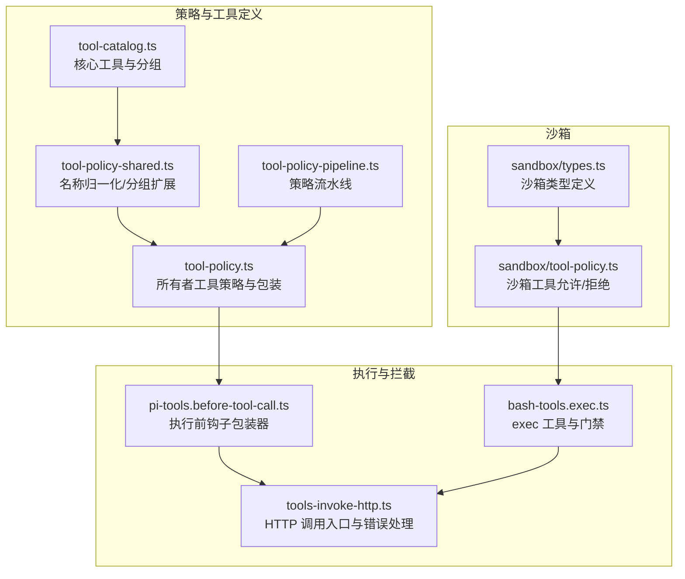
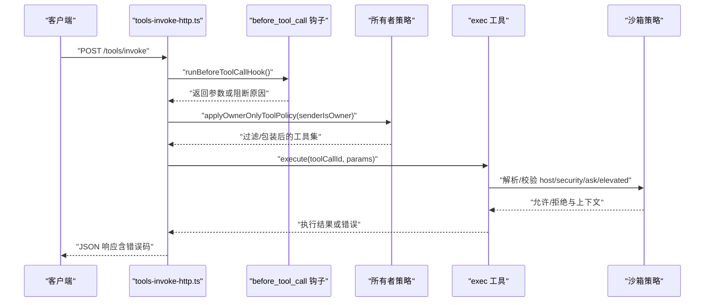
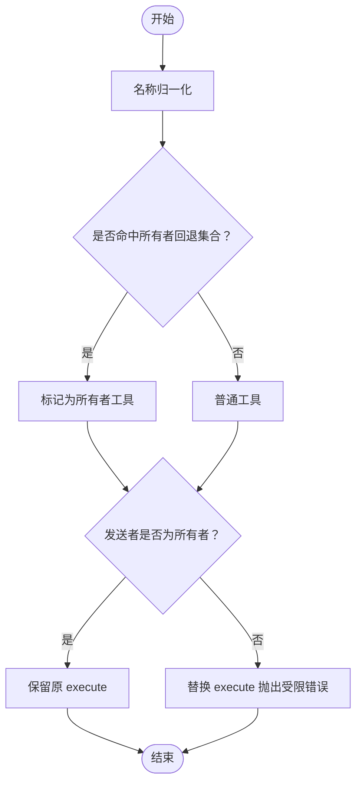
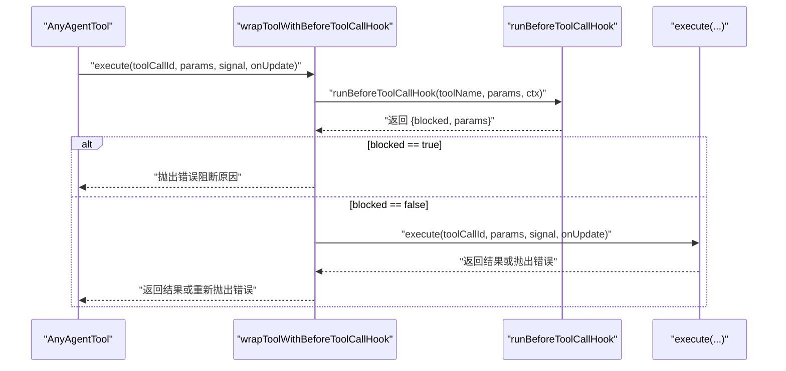
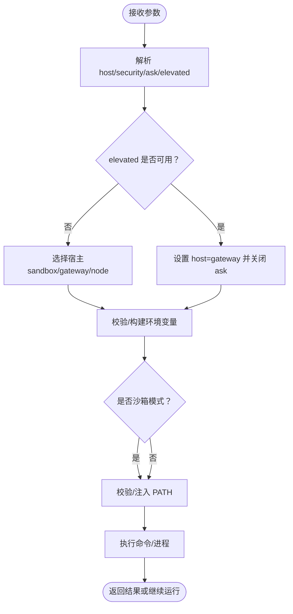
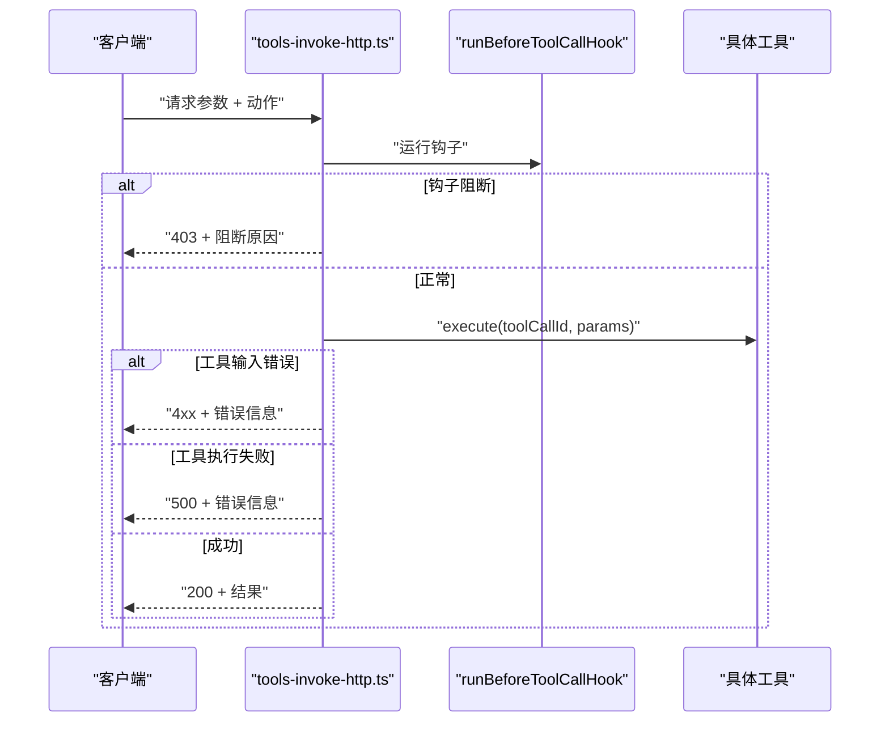
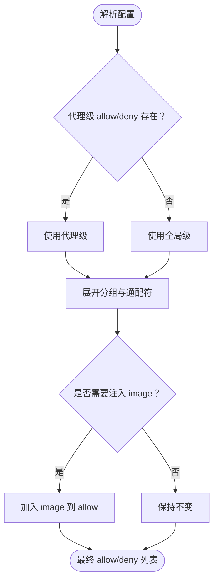
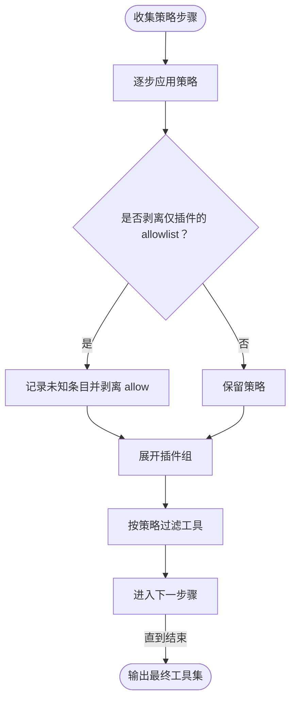
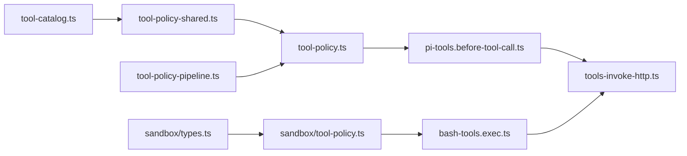

# 所有者专用工具策略

<cite>
**本文引用的文件**
- [src/agents/tool-policy.ts](file://src/agents/tool-policy.ts)
- [src/agents/tool-policy-shared.ts](file://src/agents/tool-policy-shared.ts)
- [src/agents/tools/common.ts](file://src/agents/tools/common.ts)
- [src/agents/sandbox/tool-policy.ts](file://src/agents/sandbox/tool-policy.ts)
- [src/agents/sandbox/types.ts](file://src/agents/sandbox/types.ts)
- [src/agents/tool-policy-pipeline.ts](file://src/agents/tool-policy-pipeline.ts)
- [src/agents/tool-catalog.ts](file://src/agents/tool-catalog.ts)
- [src/agents/pi-tools.before-tool-call.ts](file://src/agents/pi-tools.before-tool-call.ts)
- [src/agents/bash-tools.exec.ts](file://src/agents/bash-tools.exec.ts)
- [src/gateway/tools-invoke-http.ts](file://src/gateway/tools-invoke-http.ts)
- [src/agents/tool-policy.test.ts](file://src/agents/tool-policy.test.ts)
- [src/agents/pi-tools.whatsapp-login-gating.test.ts](file://src/agents/pi-tools.whatsapp-login-gating.test.ts)
- [src/agents/bash-tools.exec.path.test.ts](file://src/agents/bash-tools.exec.path.test.ts)
- [src/agents/pi-tools-agent-config.test.ts](file://src/agents/pi-tools-agent-config.test.ts)
- [docs/gateway/sandbox-vs-tool-policy-vs-elevated.md](file://docs/gateway/sandbox-vs-tool-policy-vs-elevated.md)
- [docs/gateway/security/index.md](file://docs/gateway/security/index.md)
</cite>

## 目录
1. [简介](#简介)
2. [项目结构](#项目结构)
3. [核心组件](#核心组件)
4. [架构总览](#架构总览)
5. [详细组件分析](#详细组件分析)
6. [依赖关系分析](#依赖关系分析)
7. [性能考量](#性能考量)
8. [故障排查指南](#故障排查指南)
9. [结论](#结论)
10. [附录](#附录)

## 简介
本文件面向 OpenClaw 的“所有者专用工具策略”，系统性阐述以下内容：
- 所有者限制工具的识别机制与执行保护
- 工具包装器（拦截器）的实现原理与安全检查机制
- 所有者工具名称回退机制与工具分类规则
- 所有者身份验证与权限检查流程
- 所有者工具的配置方法与管理策略
- 安全漏洞防护与权限绕过检测机制
- 工具执行拦截与错误处理策略

目标是帮助开发者与运维人员在理解代码实现的基础上，正确配置与使用所有者工具策略，确保高风险工具仅对所有者开放，并在非所有者调用时进行有效拦截。

## 项目结构
围绕“所有者专用工具策略”的关键代码分布在以下模块：
- 工具策略与名称归一化：tool-policy.ts、tool-policy-shared.ts、tool-catalog.ts
- 工具包装器与拦截：pi-tools.before-tool-call.ts
- 执行工具与权限门禁：bash-tools.exec.ts
- 网关入口与错误处理：tools-invoke-http.ts
- 沙箱工具策略：sandbox/tool-policy.ts、sandbox/types.ts
- 策略流水线与插件组：tool-policy-pipeline.ts
- 测试与文档参考：tool-policy.test.ts、pi-tools.whatsapp-login-gating.test.ts、bash-tools.exec.path.test.ts、pi-tools-agent-config.test.ts、sandbox-vs-tool-policy-vs-elevated.md、gateway/security/index.md

图表来源
- [src/agents/tool-policy.ts:1-211](file://src/agents/tool-policy.ts#L1-L211)
- [src/agents/tool-policy-shared.ts:1-50](file://src/agents/tool-policy-shared.ts#L1-L50)
- [src/agents/tool-catalog.ts:1-327](file://src/agents/tool-catalog.ts#L1-L327)
- [src/agents/tool-policy-pipeline.ts:1-109](file://src/agents/tool-policy-pipeline.ts#L1-L109)
- [src/agents/pi-tools.before-tool-call.ts:1-276](file://src/agents/pi-tools.before-tool-call.ts#L1-L276)
- [src/agents/bash-tools.exec.ts:1-599](file://src/agents/bash-tools.exec.ts#L1-L599)
- [src/gateway/tools-invoke-http.ts:315-360](file://src/gateway/tools-invoke-http.ts#L315-L360)
- [src/agents/sandbox/tool-policy.ts:1-110](file://src/agents/sandbox/tool-policy.ts#L1-L110)
- [src/agents/sandbox/types.ts:1-91](file://src/agents/sandbox/types.ts#L1-L91)

章节来源
- [src/agents/tool-policy.ts:1-211](file://src/agents/tool-policy.ts#L1-L211)
- [src/agents/tool-policy-shared.ts:1-50](file://src/agents/tool-policy-shared.ts#L1-L50)
- [src/agents/tool-catalog.ts:1-327](file://src/agents/tool-catalog.ts#L1-L327)
- [src/agents/tool-policy-pipeline.ts:1-109](file://src/agents/tool-policy-pipeline.ts#L1-L109)
- [src/agents/pi-tools.before-tool-call.ts:1-276](file://src/agents/pi-tools.before-tool-call.ts#L1-L276)
- [src/agents/bash-tools.exec.ts:1-599](file://src/agents/bash-tools.exec.ts#L1-L599)
- [src/gateway/tools-invoke-http.ts:315-360](file://src/gateway/tools-invoke-http.ts#L315-L360)
- [src/agents/sandbox/tool-policy.ts:1-110](file://src/agents/sandbox/tool-policy.ts#L1-L110)
- [src/agents/sandbox/types.ts:1-91](file://src/agents/sandbox/types.ts#L1-L91)

## 核心组件
- 所有者工具识别与策略
  - 名称归一化与回退：通过工具名称标准化与预设集合判断是否为所有者工具
  - 执行包装：对所有者工具在非所有者调用时替换 execute 抛出受限错误
  - 策略应用：按发送者是否为所有者决定保留或移除所有者工具
- 工具包装器（拦截器）
  - 执行前钩子：在工具 execute 前运行钩子，支持参数调整与阻断
  - 循环检测：记录工具调用状态，防止循环卡死并可分级阻断
- 执行工具与门禁
  - exec 工具：集中处理 host、security、ask、elevated 等参数与门禁
  - 升级模式（elevated）：受全局与代理级配置约束，必要时绕过审批
- 网关入口与错误处理
  - HTTP 入口：统一执行工具调用，拦截阻断与输入错误并返回标准响应
- 沙箱工具策略
  - 允许/拒绝列表：基于 glob 模式匹配，支持默认注入 image 工具
  - 优先级：代理级覆盖全局，未显式允许时默认允许全部

章节来源
- [src/agents/tool-policy.ts:18-57](file://src/agents/tool-policy.ts#L18-L57)
- [src/agents/tools/common.ts:24-255](file://src/agents/tools/common.ts#L24-L255)
- [src/agents/pi-tools.before-tool-call.ts:91-194](file://src/agents/pi-tools.before-tool-call.ts#L91-L194)
- [src/agents/bash-tools.exec.ts:209-303](file://src/agents/bash-tools.exec.ts#L209-L303)
- [src/gateway/tools-invoke-http.ts:315-360](file://src/gateway/tools-invoke-http.ts#L315-L360)
- [src/agents/sandbox/tool-policy.ts:16-33](file://src/agents/sandbox/tool-policy.ts#L16-L33)

## 架构总览
下图展示从网关入口到工具执行的整体路径，以及所有者策略与拦截器的关键节点：

图表来源
- [src/gateway/tools-invoke-http.ts:315-360](file://src/gateway/tools-invoke-http.ts#L315-L360)
- [src/agents/pi-tools.before-tool-call.ts:91-194](file://src/agents/pi-tools.before-tool-call.ts#L91-L194)
- [src/agents/tool-policy.ts:46-57](file://src/agents/tool-policy.ts#L46-L57)
- [src/agents/bash-tools.exec.ts:209-303](file://src/agents/bash-tools.exec.ts#L209-L303)
- [src/agents/sandbox/tool-policy.ts:16-33](file://src/agents/sandbox/tool-policy.ts#L16-L33)

## 详细组件分析

### 组件A：所有者工具识别与策略
- 名称归一化与回退
  - 使用工具别名映射与小写/去空白处理，确保跨大小写与拼写的兼容
  - 预设所有者工具名称集合，作为“名称回退”判定依据
- 执行包装
  - 对标记为 ownerOnly 或命中回退集合的工具，在非所有者调用时替换 execute 抛出受限错误
- 策略应用
  - 非所有者：移除所有者工具；所有者：保留并可进一步执行
- 工具分类与分组
  - 核心工具按功能分组（如 group:openclaw、group:automation），便于策略扩展

图表来源
- [src/agents/tool-policy.ts:31-57](file://src/agents/tool-policy.ts#L31-L57)
- [src/agents/tool-policy-shared.ts:12-22](file://src/agents/tool-policy-shared.ts#L12-L22)
- [src/agents/tools/common.ts:242-255](file://src/agents/tools/common.ts#L242-L255)

章节来源
- [src/agents/tool-policy.ts:18-57](file://src/agents/tool-policy.ts#L18-L57)
- [src/agents/tool-policy-shared.ts:12-22](file://src/agents/tool-policy-shared.ts#L12-L22)
- [src/agents/tools/common.ts:242-255](file://src/agents/tools/common.ts#L242-L255)
- [src/agents/tool-catalog.ts:261-278](file://src/agents/tool-catalog.ts#L261-L278)

### 组件B：工具包装器与拦截器
- 包装器实现
  - 在工具 execute 前后分别运行钩子，支持：
    - 参数合并与调整
    - 执行阻断（block=true）
    - 循环检测与分级警告/阻断
- 错误处理
  - 钩子异常被记录但不中断工具执行
  - 记录工具调用结果/错误，用于诊断

图表来源
- [src/agents/pi-tools.before-tool-call.ts:196-255](file://src/agents/pi-tools.before-tool-call.ts#L196-L255)
- [src/agents/pi-tools.before-tool-call.ts:91-194](file://src/agents/pi-tools.before-tool-call.ts#L91-L194)

章节来源
- [src/agents/pi-tools.before-tool-call.ts:91-194](file://src/agents/pi-tools.before-tool-call.ts#L91-L194)
- [src/agents/pi-tools.before-tool-call.ts:196-255](file://src/agents/pi-tools.before-tool-call.ts#L196-L255)

### 组件C：执行工具与权限门禁
- exec 工具职责
  - 解析 host、security、ask、elevated 等参数
  - 校验与规范化环境变量、工作目录、PATH 等
  - 支持沙箱/网关/节点三种宿主模式
- elevated 升级门禁
  - 受全局与代理级配置控制（tools.elevated.*）
  - 当 elevated 被请求且满足条件时，可绕过审批（full 模式）
- 安全前置检查
  - 防止脚本中出现 shell 变量泄漏等常见问题
  - 沙箱模式下严格校验 PATH 与环境变量

图表来源
- [src/agents/bash-tools.exec.ts:209-303](file://src/agents/bash-tools.exec.ts#L209-L303)
- [src/agents/bash-tools.exec.ts:336-348](file://src/agents/bash-tools.exec.ts#L336-L348)
- [src/agents/bash-tools.exec.ts:468-470](file://src/agents/bash-tools.exec.ts#L468-L470)

章节来源
- [src/agents/bash-tools.exec.ts:209-303](file://src/agents/bash-tools.exec.ts#L209-L303)
- [src/agents/bash-tools.exec.ts:336-348](file://src/agents/bash-tools.exec.ts#L336-L348)
- [src/agents/bash-tools.exec.ts:468-470](file://src/agents/bash-tools.exec.ts#L468-L470)

### 组件D：网关入口与错误处理
- HTTP 入口
  - 合并 action 与参数，运行 before_tool_call 钩子
  - 若被阻断，返回 403；若参数无效，返回对应状态码
  - 工具执行失败时统一记录日志并返回 500
- 错误映射
  - 输入错误：根据工具自定义错误映射返回相应状态码
  - 执行阻断：返回“工具调用被阻断”消息

图表来源
- [src/gateway/tools-invoke-http.ts:315-360](file://src/gateway/tools-invoke-http.ts#L315-L360)

章节来源
- [src/gateway/tools-invoke-http.ts:315-360](file://src/gateway/tools-invoke-http.ts#L315-L360)

### 组件E：沙箱工具策略
- 策略解析
  - 代理级 allow/deny 优先于全局；均未设置时采用默认值
  - 允许列表为空表示“允许全部”，拒绝列表优先级更高
- 工具注入
  - 为保证多模态能力，默认向沙箱会话注入 image 工具（除非显式拒绝）

图表来源
- [src/agents/sandbox/tool-policy.ts:35-109](file://src/agents/sandbox/tool-policy.ts#L35-L109)

章节来源
- [src/agents/sandbox/tool-policy.ts:16-33](file://src/agents/sandbox/tool-policy.ts#L16-L33)
- [src/agents/sandbox/tool-policy.ts:35-109](file://src/agents/sandbox/tool-policy.ts#L35-L109)
- [src/agents/sandbox/types.ts:6-27](file://src/agents/sandbox/types.ts#L6-L27)

### 组件F：策略流水线与插件组
- 流水线步骤
  - 按 profile、provider profile、全局、代理、分组等顺序叠加策略
  - 对仅包含插件工具的 allowlist 进行剥离，避免意外禁用核心工具
- 插件组扩展
  - 将 group:plugins 与插件 ID 展开为核心工具集合

图表来源
- [src/agents/tool-policy-pipeline.ts:17-108](file://src/agents/tool-policy-pipeline.ts#L17-L108)

章节来源
- [src/agents/tool-policy-pipeline.ts:17-108](file://src/agents/tool-policy-pipeline.ts#L17-L108)

## 依赖关系分析
- 组件耦合
  - 所有者策略依赖工具共享模块（名称归一化、分组）
  - 执行工具依赖沙箱策略与门禁配置
  - 网关入口依赖拦截器与工具策略
- 外部集成点
  - 钩子系统（before_tool_call）提供扩展点
  - 配置系统（tools.elevated.*、tools.sandbox.*）影响行为

图表来源
- [src/agents/tool-policy-shared.ts:1-50](file://src/agents/tool-policy-shared.ts#L1-L50)
- [src/agents/tool-policy.ts:1-16](file://src/agents/tool-policy.ts#L1-L16)
- [src/agents/tool-catalog.ts:1-327](file://src/agents/tool-catalog.ts#L1-L327)
- [src/agents/tool-policy-pipeline.ts:1-109](file://src/agents/tool-policy-pipeline.ts#L1-L109)
- [src/agents/pi-tools.before-tool-call.ts:1-276](file://src/agents/pi-tools.before-tool-call.ts#L1-L276)
- [src/gateway/tools-invoke-http.ts:315-360](file://src/gateway/tools-invoke-http.ts#L315-L360)
- [src/agents/bash-tools.exec.ts:1-599](file://src/agents/bash-tools.exec.ts#L1-L599)
- [src/agents/sandbox/tool-policy.ts:1-110](file://src/agents/sandbox/tool-policy.ts#L1-L110)
- [src/agents/sandbox/types.ts:1-91](file://src/agents/sandbox/types.ts#L1-L91)

章节来源
- [src/agents/tool-policy-shared.ts:1-50](file://src/agents/tool-policy-shared.ts#L1-L50)
- [src/agents/tool-policy.ts:1-16](file://src/agents/tool-policy.ts#L1-L16)
- [src/agents/tool-catalog.ts:1-327](file://src/agents/tool-catalog.ts#L1-L327)
- [src/agents/tool-policy-pipeline.ts:1-109](file://src/agents/tool-policy-pipeline.ts#L1-L109)
- [src/agents/pi-tools.before-tool-call.ts:1-276](file://src/agents/pi-tools.before-tool-call.ts#L1-L276)
- [src/gateway/tools-invoke-http.ts:315-360](file://src/gateway/tools-invoke-http.ts#L315-L360)
- [src/agents/bash-tools.exec.ts:1-599](file://src/agents/bash-tools.exec.ts#L1-L599)
- [src/agents/sandbox/tool-policy.ts:1-110](file://src/agents/sandbox/tool-policy.ts#L1-L110)
- [src/agents/sandbox/types.ts:1-91](file://src/agents/sandbox/types.ts#L1-L91)

## 性能考量
- 名称归一化与集合查找为 O(n) 操作，预设集合规模较小，开销可忽略
- 拦截器与策略流水线在工具集较小时影响有限，建议在代理层缓存策略结果以减少重复计算
- 沙箱策略的 glob 匹配在允许列表为空时短路返回，避免多余计算

## 故障排查指南
- 所有者工具不可见或被阻断
  - 确认发送者身份是否为所有者
  - 检查工具是否命中“名称回退”集合
  - 验证 before_tool_call 钩子是否返回 block=true
- elevated 不生效
  - 检查 tools.elevated.enabled 与 allowFrom.<provider> 配置
  - 确认代理级配置未覆盖全局设置
- 沙箱模式下 exec 失败
  - 确认 agents.defaults.sandbox.mode 与 tools.exec.host 设置
  - 检查 PATH 与环境变量是否被沙箱策略正确注入
- HTTP 调用返回 403/4xx/500
  - 查看 before_tool_call 钩子日志与阻断原因
  - 检查工具输入参数与 schema 是否匹配

章节来源
- [src/agents/tool-policy.test.ts:78-110](file://src/agents/tool-policy.test.ts#L78-L110)
- [src/agents/pi-tools.whatsapp-login-gating.test.ts:16-33](file://src/agents/pi-tools.whatsapp-login-gating.test.ts#L16-L33)
- [src/agents/bash-tools.exec.path.test.ts:215-236](file://src/agents/bash-tools.exec.path.test.ts#L215-L236)
- [src/agents/pi-tools-agent-config.test.ts:169-169](file://src/agents/pi-tools-agent-config.test.ts#L169-L169)
- [docs/gateway/sandbox-vs-tool-policy-vs-elevated.md:86-113](file://docs/gateway/sandbox-vs-tool-policy-vs-elevated.md#L86-L113)
- [docs/gateway/security/index.md:954-978](file://docs/gateway/security/index.md#L954-L978)

## 结论
OpenClaw 的“所有者专用工具策略”通过“名称归一化 + 回退集合 + 执行包装 + 拦截器 + 门禁配置 + 沙箱策略”的组合，实现了对高风险工具的精细化管控。其设计强调：
- 明确的身份边界（senderIsOwner）
- 可插拔的拦截器扩展（before_tool_call）
- 渐进式的门禁与升级通道（elevated）
- 可观测的策略流水线与诊断能力

在实际部署中，建议：
- 严格限定 tools.elevated.allowFrom.<provider>
- 在代理层启用沙箱并合理配置 tools.sandbox.tools.allow/deny
- 通过钩子系统实现业务侧的动态拦截与参数校验
- 定期审查工具策略流水线，避免仅插件工具导致的核心工具不可用

## 附录
- 相关文档
  - [沙箱与工具策略对比:86-113](file://docs/gateway/sandbox-vs-tool-policy-vs-elevated.md#L86-L113)
  - [网关安全与隔离建议:954-978](file://docs/gateway/security/index.md#L954-L978)