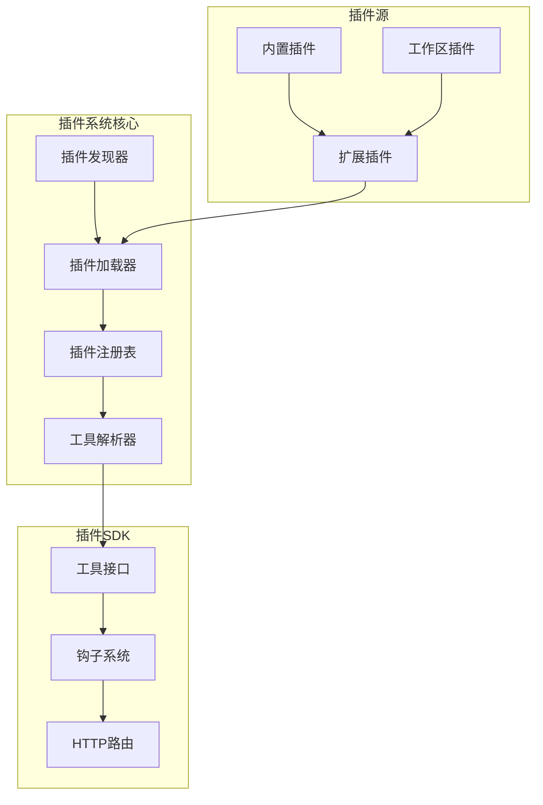
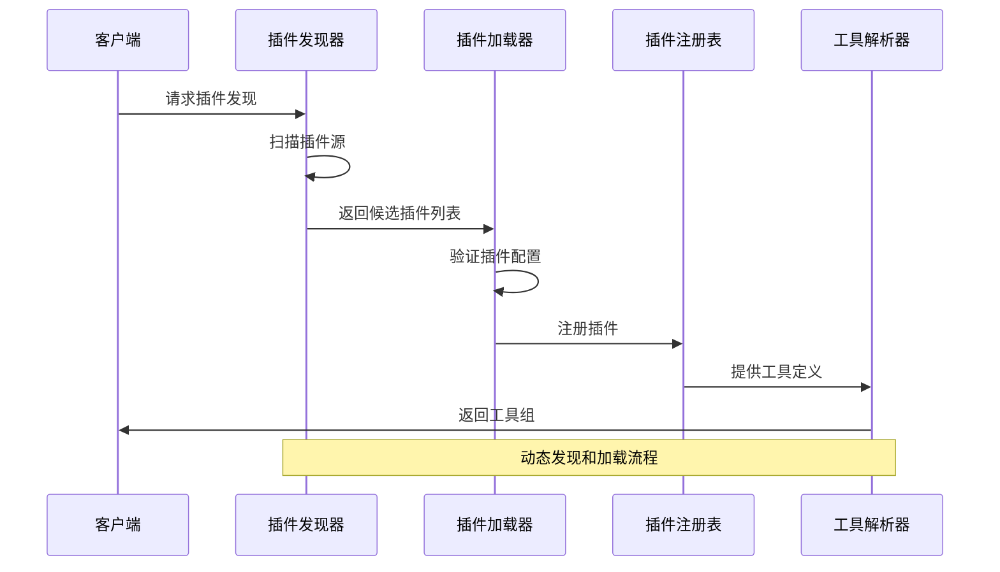
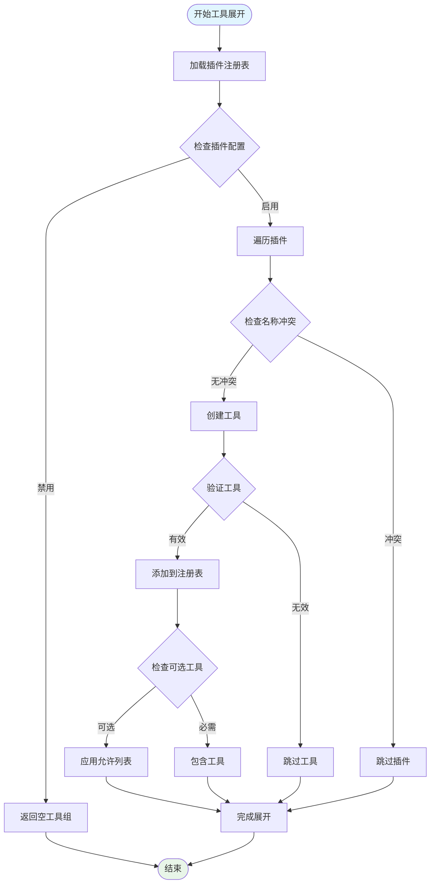
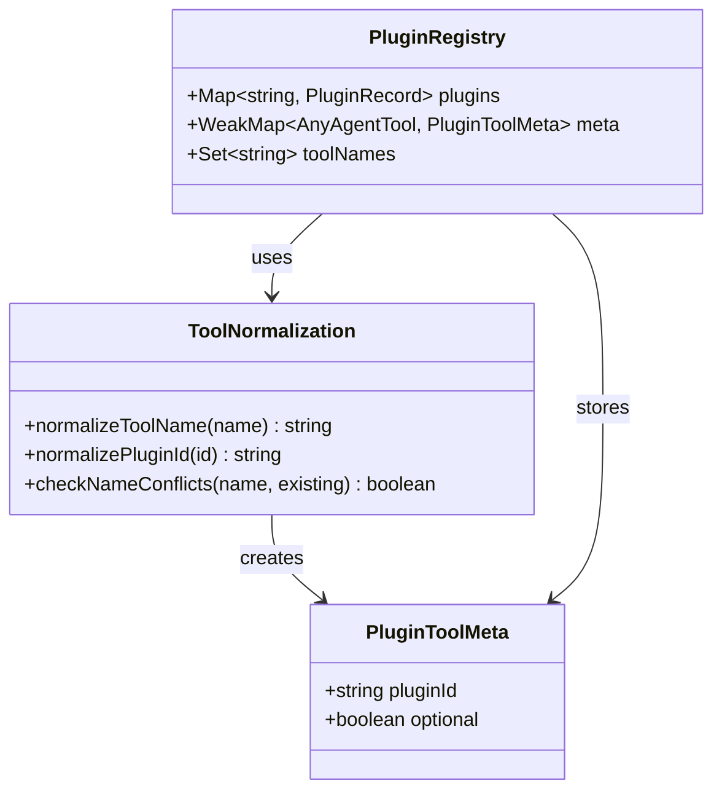
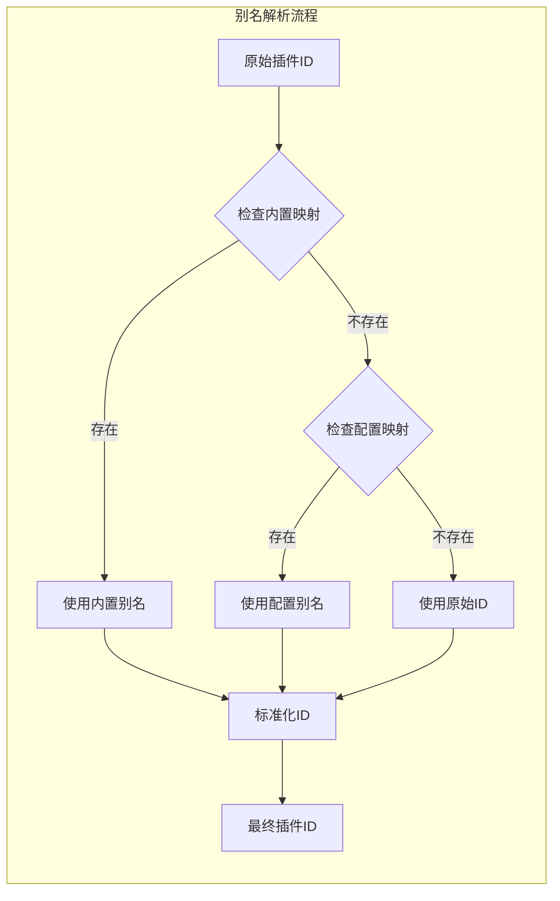
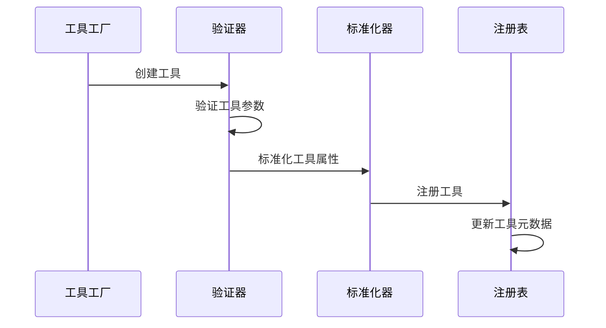
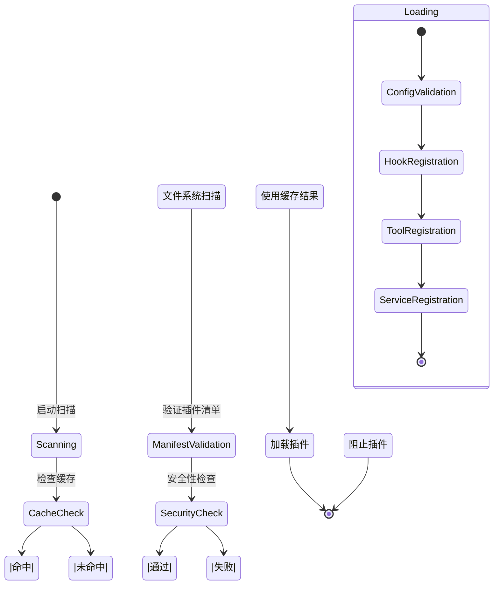
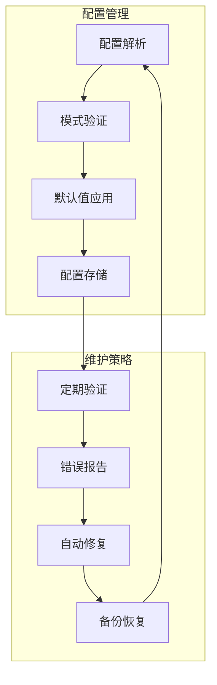
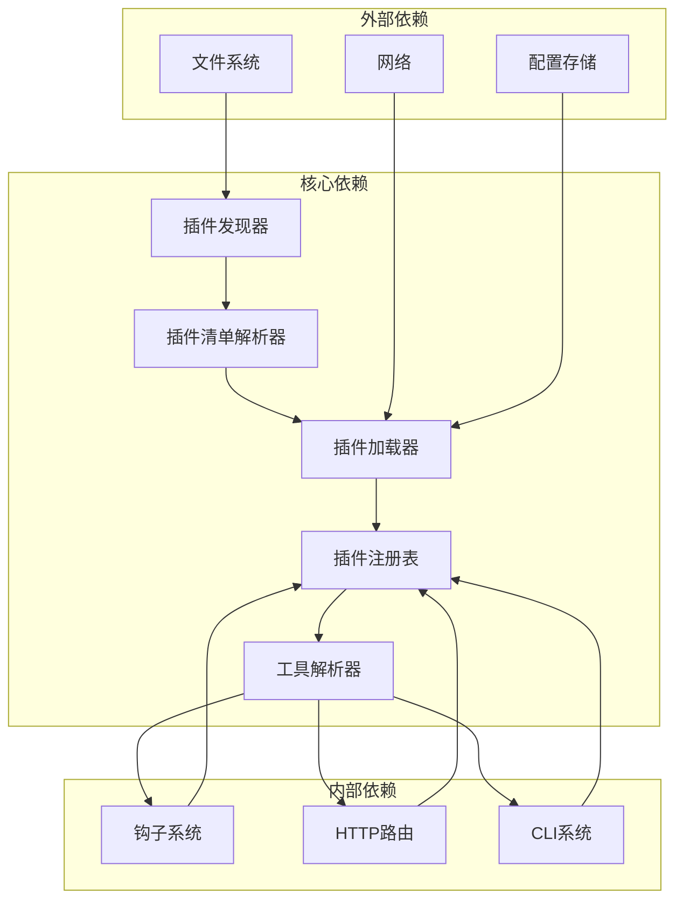

# 插件工具组管理

<cite>
**本文档引用的文件**
- [tools.ts](file://src/plugins/tools.ts)
- [discovery.ts](file://src/plugins/discovery.ts)
- [loader.ts](file://src/plugins/loader.ts)
- [manifest.ts](file://src/plugins/manifest.ts)
- [types.ts](file://src/plugins/types.ts)
- [config-state.ts](file://src/plugins/config-state.ts)
- [registry.ts](file://src/plugins/registry.ts)
- [index.ts](file://src/plugin-sdk/index.ts)
- [memory-lancedb/index.ts](file://extensions/memory-lancedb/index.ts)
- [memory-core/index.ts](file://extensions/memory-core/index.ts)
- [voice-call/index.ts](file://extensions/voice-call/index.ts)
- [discord/index.ts](file://extensions/discord/index.ts)
</cite>

## 目录
1. [简介](#简介)
2. [项目结构](#项目结构)
3. [核心组件](#核心组件)
4. [架构概览](#架构概览)
5. [详细组件分析](#详细组件分析)
6. [依赖关系分析](#依赖关系分析)
7. [性能考虑](#性能考虑)
8. [故障排除指南](#故障排除指南)
9. [结论](#结论)

## 简介

OpenClaw的插件工具组管理系统是一个高度模块化的架构，允许开发者通过插件扩展AI代理的功能。该系统支持动态加载、工具标准化、插件组别名解析和工具展开算法等核心功能。

系统主要特点包括：
- 动态插件发现和加载机制
- 工具组展开算法和插件ID映射规则
- 插件组别名解析和工具标准化过程
- 配置管理和维护策略
- 性能优化和内存管理
- 插件工具组与核心工具组的区别和交互关系

## 项目结构

OpenClaw插件系统采用分层架构设计，主要由以下组件构成：

**图表来源**
- [discovery.ts:639-733](file://src/plugins/discovery.ts#L639-L733)
- [loader.ts:447-800](file://src/plugins/loader.ts#L447-L800)
- [registry.ts:185-625](file://src/plugins/registry.ts#L185-L625)

**章节来源**
- [discovery.ts:1-733](file://src/plugins/discovery.ts#L1-L733)
- [loader.ts:1-829](file://src/plugins/loader.ts#L1-L829)
- [registry.ts:1-625](file://src/plugins/registry.ts#L1-L625)

## 核心组件

### 插件发现器 (Plugin Discovery)

插件发现器负责扫描和识别可用的插件源，支持多种发现路径：

- **内置插件**：随应用一起分发的标准插件
- **全局插件**：用户配置目录中的插件
- **工作区插件**：项目特定的插件
- **自定义路径**：通过配置指定的额外插件路径

### 插件加载器 (Plugin Loader)

插件加载器处理插件的动态加载和初始化过程，包括：

- 模块导入和验证
- 配置模式验证
- 生命周期钩子注册
- 工具和服务注册

### 插件注册表 (Plugin Registry)

注册表维护所有已加载插件的状态和元数据，包括：

- 工具定义和工厂函数
- 钩子处理器
- HTTP路由
- CLI命令注册

**章节来源**
- [discovery.ts:1-733](file://src/plugins/discovery.ts#L1-L733)
- [loader.ts:1-829](file://src/plugins/loader.ts#L1-L829)
- [registry.ts:1-625](file://src/plugins/registry.ts#L1-L625)

## 架构概览

OpenClaw插件工具组管理系统的整体架构如下：

**图表来源**
- [discovery.ts:639-733](file://src/plugins/discovery.ts#L639-L733)
- [loader.ts:447-800](file://src/plugins/loader.ts#L447-L800)
- [tools.ts:45-140](file://src/plugins/tools.ts#L45-L140)

系统采用延迟加载策略，只有在需要时才加载插件模块，从而优化启动时间和内存使用。

## 详细组件分析

### 工具组展开算法

工具组展开算法是插件系统的核心功能之一，负责将插件定义转换为可用的工具集合：

**图表来源**
- [tools.ts:45-140](file://src/plugins/tools.ts#L45-L140)

**章节来源**
- [tools.ts:1-140](file://src/plugins/tools.ts#L1-L140)

### 插件ID映射规则

插件ID映射规则确保插件标识符的一致性和唯一性：

**图表来源**
- [tools.ts:11-20](file://src/plugins/tools.ts#L11-L20)
- [registry.ts:102-127](file://src/plugins/registry.ts#L102-L127)

### 插件组别名解析

插件组别名解析机制支持灵活的插件标识符映射：

**图表来源**
- [config-state.ts:90-104](file://src/plugins/config-state.ts#L90-L104)

### 工具标准化过程

工具标准化过程确保所有工具具有统一的接口和行为：

**图表来源**
- [registry.ts:193-218](file://src/plugins/registry.ts#L193-L218)

**章节来源**
- [config-state.ts:1-287](file://src/plugins/config-state.ts#L1-L287)
- [registry.ts:1-625](file://src/plugins/registry.ts#L1-L625)

### 动态发现和更新机制

系统支持插件的动态发现和实时更新：

**图表来源**
- [discovery.ts:36-84](file://src/plugins/discovery.ts#L36-L84)
- [loader.ts:537-558](file://src/plugins/loader.ts#L537-L558)

**章节来源**
- [discovery.ts:1-733](file://src/plugins/discovery.ts#L1-L733)
- [loader.ts:1-829](file://src/plugins/loader.ts#L1-L829)

### 配置管理和维护策略

插件配置管理系统提供了完整的配置验证和维护功能：

**图表来源**
- [config-state.ts:90-104](file://src/plugins/config-state.ts#L90-L104)
- [loader.ts:745-755](file://src/plugins/loader.ts#L745-L755)

**章节来源**
- [config-state.ts:1-287](file://src/plugins/config-state.ts#L1-L287)

## 依赖关系分析

插件系统各组件之间的依赖关系如下：

**图表来源**
- [discovery.ts:1-733](file://src/plugins/discovery.ts#L1-L733)
- [loader.ts:1-829](file://src/plugins/loader.ts#L1-L829)
- [registry.ts:1-625](file://src/plugins/registry.ts#L1-L625)

**章节来源**
- [types.ts:1-893](file://src/plugins/types.ts#L1-L893)
- [manifest.ts:1-199](file://src/plugins/manifest.ts#L1-L199)

## 性能考虑

### 内存管理优化

系统采用了多种内存管理策略来优化性能：

1. **延迟加载**：插件模块仅在需要时加载
2. **缓存机制**：插件发现结果和配置信息缓存
3. **垃圾回收**：及时释放不再使用的插件实例
4. **内存池**：复用常用的插件对象

### 启动时间优化

为了减少启动时间，系统实现了以下优化：

- **并行加载**：多个插件可以并行加载
- **增量初始化**：插件按需初始化
- **预热机制**：常用插件提前加载到内存

### 资源限制

系统提供了资源使用限制机制：

- **内存使用上限**：防止插件占用过多内存
- **CPU使用监控**：监控插件的CPU使用情况
- **I/O限制**：限制插件的文件操作频率

## 故障排除指南

### 常见问题诊断

1. **插件加载失败**
   - 检查插件清单文件格式
   - 验证插件配置的有效性
   - 确认插件依赖项的完整性

2. **工具冲突**
   - 检查工具名称是否重复
   - 验证插件ID的唯一性
   - 确认工具参数的正确性

3. **性能问题**
   - 监控插件的内存使用情况
   - 检查插件的执行时间
   - 分析插件的资源消耗

### 调试工具

系统提供了多种调试工具：

- **日志记录**：详细的插件执行日志
- **性能分析**：插件性能指标监控
- **配置验证**：插件配置的实时验证

**章节来源**
- [loader.ts:256-284](file://src/plugins/loader.ts#L256-L284)
- [discovery.ts:237-272](file://src/plugins/discovery.ts#L237-L272)

## 结论

OpenClaw的插件工具组管理系统是一个功能强大且高度可扩展的架构。通过动态发现、智能加载和严格的管理机制，系统能够有效地组织和管理各种插件工具。

主要优势包括：
- **灵活性**：支持多种插件类型和加载方式
- **安全性**：完善的权限控制和安全检查机制
- **性能**：优化的内存管理和启动时间
- **可维护性**：清晰的配置管理和故障排除机制

未来的发展方向可能包括：
- 更智能的插件依赖管理
- 增强的插件间通信机制
- 更丰富的插件开发工具
- 改进的插件市场和分发机制

这个系统为OpenClaw平台提供了强大的扩展能力，使得开发者能够轻松地添加新功能和定制化需求。