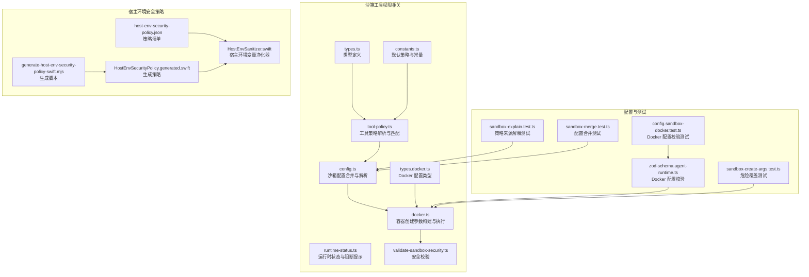
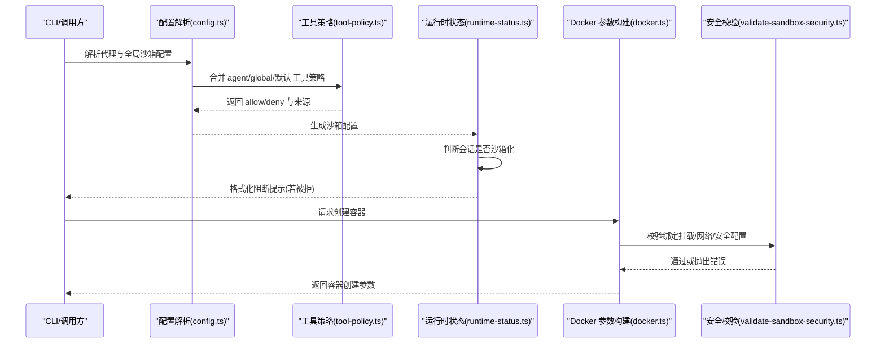
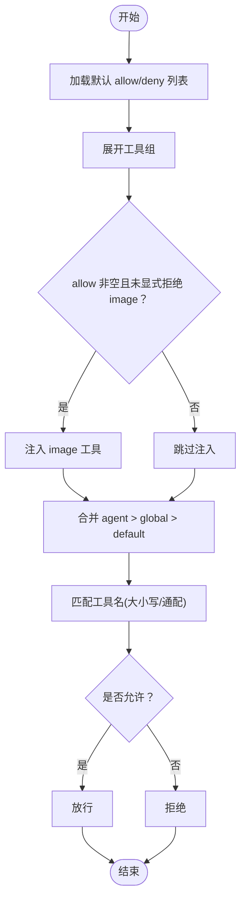
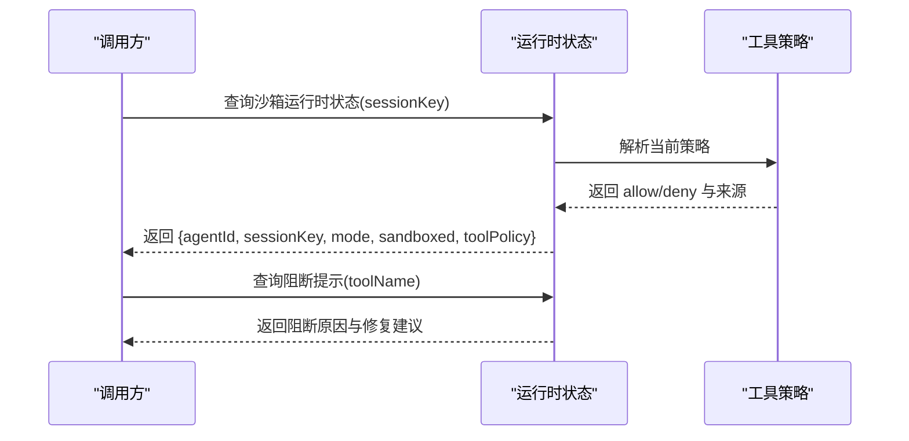
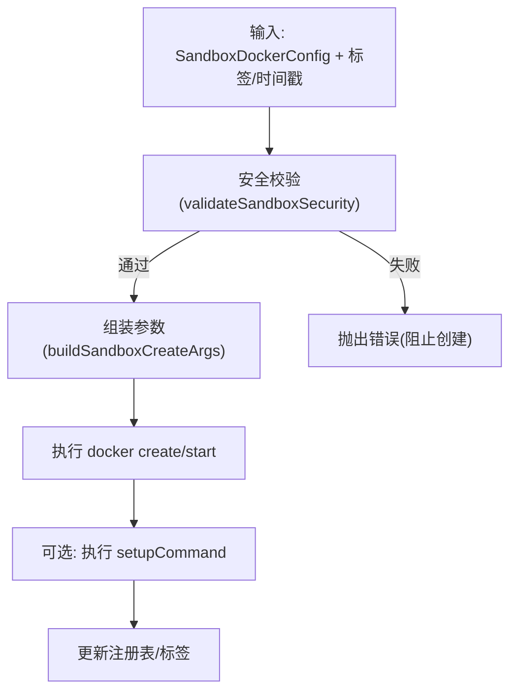
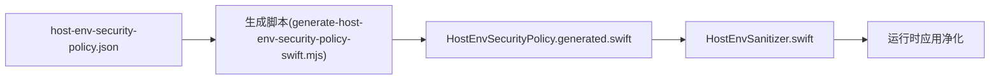
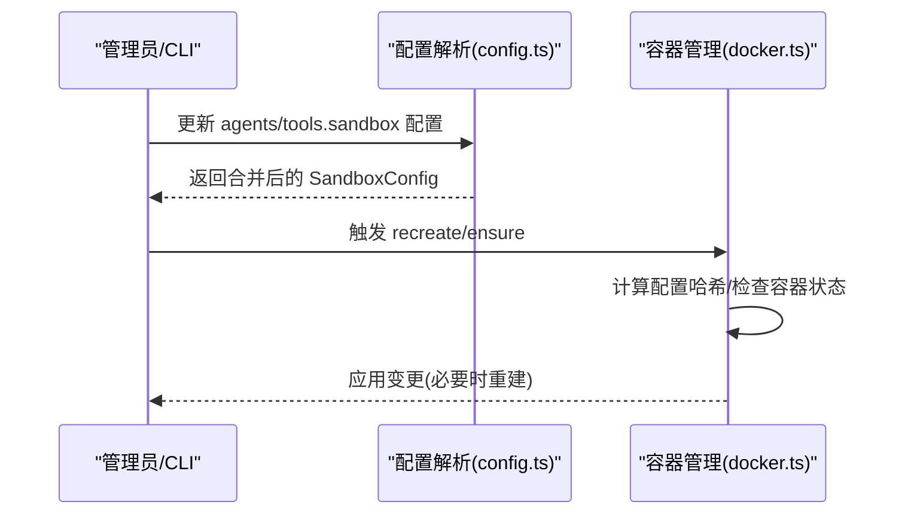
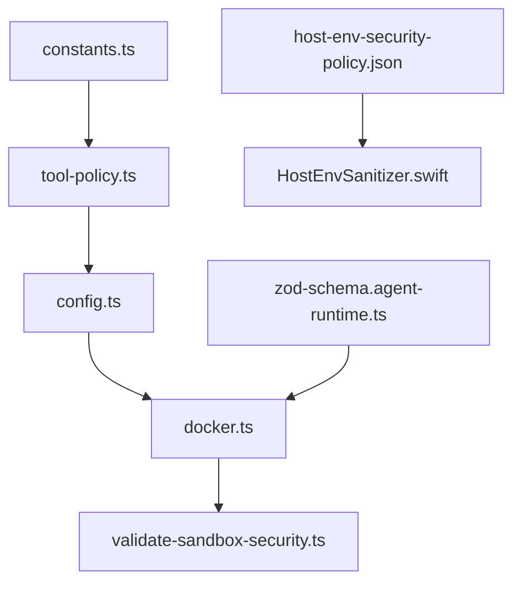

# 沙箱工具权限

<cite>
**本文引用的文件**
- [src/agents/sandbox/types.ts](file://src/agents/sandbox/types.ts)
- [src/agents/sandbox/constants.ts](file://src/agents/sandbox/constants.ts)
- [src/agents/sandbox/tool-policy.ts](file://src/agents/sandbox/tool-policy.ts)
- [src/agents/sandbox/config.ts](file://src/agents/sandbox/config.ts)
- [src/agents/sandbox/runtime-status.ts](file://src/agents/sandbox/runtime-status.ts)
- [src/agents/sandbox/docker.ts](file://src/agents/sandbox/docker.ts)
- [src/agents/sandbox/validate-sandbox-security.ts](file://src/agents/sandbox/validate-sandbox-security.ts)
- [src/agents/sandbox/types.docker.ts](file://src/agents/sandbox/types.docker.ts)
- [src/config/zod-schema.agent-runtime.ts](file://src/config/zod-schema.agent-runtime.ts)
- [src/agents/sandbox-explain.test.ts](file://src/agents/sandbox-explain.test.ts)
- [src/agents/sandbox-merge.test.ts](file://src/agents/sandbox-merge.test.ts)
- [src/agents/sandbox-create-args.test.ts](file://src/agents/sandbox-create-args.test.ts)
- [src/agents/sandbox/config.sandbox-docker.test.ts](file://src/agents/sandbox/config.sandbox-docker.test.ts)
- [src/agents/sandbox/context.ts](file://src/agents/sandbox/context.ts)
- [src/infra/host-env-security-policy.json](file://src/infra/host-env-security-policy.json)
- [apps/macos/Sources/OpenClaw/HostEnvSecurityPolicy.generated.swift](file://apps/macos/Sources/OpenClaw/HostEnvSecurityPolicy.generated.swift)
- [apps/macos/Sources/OpenClaw/HostEnvSanitizer.swift](file://apps/macos/Sources/OpenClaw/HostEnvSanitizer.swift)
- [scripts/generate-host-env-security-policy-swift.mjs](file://scripts/generate-host-env-security-policy-swift.mjs)
</cite>

## 目录
1. [简介](#简介)
2. [项目结构](#项目结构)
3. [核心组件](#核心组件)
4. [架构总览](#架构总览)
5. [详细组件分析](#详细组件分析)
6. [依赖关系分析](#依赖关系分析)
7. [性能考量](#性能考量)
8. [故障排查指南](#故障排查指南)
9. [结论](#结论)
10. [附录](#附录)

## 简介
本文件系统性阐述 OpenClaw 在沙箱环境中对“工具权限”的控制机制，覆盖以下关键主题：
- 沙箱工具权限的隔离与访问控制
- 白名单与黑名单的合并、扩展与匹配规则
- 与宿主环境的权限映射（含环境变量安全策略）
- 动态调整与实时更新机制
- 配置模板与最佳实践
- 性能监控与资源限制
- 与代理工作空间的集成方式

## 项目结构
围绕沙箱工具权限的相关代码主要位于 src/agents/sandbox 及其子模块，并与宿主环境安全策略、Docker 安全校验、配置模式等协同工作。



**图表来源**
- [src/agents/sandbox/types.ts:1-91](file://src/agents/sandbox/types.ts#L1-L91)
- [src/agents/sandbox/constants.ts:1-55](file://src/agents/sandbox/constants.ts#L1-L55)
- [src/agents/sandbox/tool-policy.ts:1-110](file://src/agents/sandbox/tool-policy.ts#L1-L110)
- [src/agents/sandbox/config.ts:1-217](file://src/agents/sandbox/config.ts#L1-L217)
- [src/agents/sandbox/runtime-status.ts:1-139](file://src/agents/sandbox/runtime-status.ts#L1-L139)
- [src/agents/sandbox/docker.ts:1-568](file://src/agents/sandbox/docker.ts#L1-L568)
- [src/agents/sandbox/validate-sandbox-security.ts:1-344](file://src/agents/sandbox/validate-sandbox-security.ts#L1-L344)
- [src/agents/sandbox/types.docker.ts:1-13](file://src/agents/sandbox/types.docker.ts#L1-L13)
- [src/config/zod-schema.agent-runtime.ts:95-133](file://src/config/zod-schema.agent-runtime.ts#L95-L133)
- [src/infra/host-env-security-policy.json:1-51](file://src/infra/host-env-security-policy.json#L1-L51)
- [apps/macos/Sources/OpenClaw/HostEnvSecurityPolicy.generated.swift:1-66](file://apps/macos/Sources/OpenClaw/HostEnvSecurityPolicy.generated.swift#L1-L66)
- [apps/macos/Sources/OpenClaw/HostEnvSanitizer.swift:1-29](file://apps/macos/Sources/OpenClaw/HostEnvSanitizer.swift#L1-L29)
- [scripts/generate-host-env-security-policy-swift.mjs:1-78](file://scripts/generate-host-env-security-policy-swift.mjs#L1-L78)
- [src/agents/sandbox-explain.test.ts:1-34](file://src/agents/sandbox-explain.test.ts#L1-L34)
- [src/agents/sandbox-merge.test.ts:1-131](file://src/agents/sandbox-merge.test.ts#L1-L131)
- [src/agents/sandbox-create-args.test.ts:286-329](file://src/agents/sandbox-create-args.test.ts#L286-L329)
- [src/agents/sandbox/config.sandbox-docker.test.ts:30-180](file://src/agents/sandbox/config.sandbox-docker.test.ts#L30-L180)

**章节来源**
- [src/agents/sandbox/types.ts:1-91](file://src/agents/sandbox/types.ts#L1-L91)
- [src/agents/sandbox/constants.ts:1-55](file://src/agents/sandbox/constants.ts#L1-L55)
- [src/agents/sandbox/tool-policy.ts:1-110](file://src/agents/sandbox/tool-policy.ts#L1-L110)
- [src/agents/sandbox/config.ts:1-217](file://src/agents/sandbox/config.ts#L1-L217)
- [src/agents/sandbox/docker.ts:1-568](file://src/agents/sandbox/docker.ts#L1-L568)
- [src/agents/sandbox/validate-sandbox-security.ts:1-344](file://src/agents/sandbox/validate-sandbox-security.ts#L1-L344)
- [src/agents/sandbox/runtime-status.ts:1-139](file://src/agents/sandbox/runtime-status.ts#L1-L139)
- [src/agents/sandbox/types.docker.ts:1-13](file://src/agents/sandbox/types.docker.ts#L1-L13)
- [src/config/zod-schema.agent-runtime.ts:95-133](file://src/config/zod-schema.agent-runtime.ts#L95-L133)
- [src/infra/host-env-security-policy.json:1-51](file://src/infra/host-env-security-policy.json#L1-L51)
- [apps/macos/Sources/OpenClaw/HostEnvSecurityPolicy.generated.swift:1-66](file://apps/macos/Sources/OpenClaw/HostEnvSecurityPolicy.generated.swift#L1-L66)
- [apps/macos/Sources/OpenClaw/HostEnvSanitizer.swift:1-29](file://apps/macos/Sources/OpenClaw/HostEnvSanitizer.swift#L1-L29)
- [scripts/generate-host-env-security-policy-swift.mjs:1-78](file://scripts/generate-host-env-security-policy-swift.mjs#L1-L78)
- [src/agents/sandbox-explain.test.ts:1-34](file://src/agents/sandbox-explain.test.ts#L1-L34)
- [src/agents/sandbox-merge.test.ts:1-131](file://src/agents/sandbox-merge.test.ts#L1-L131)
- [src/agents/sandbox-create-args.test.ts:286-329](file://src/agents/sandbox-create-args.test.ts#L286-L329)
- [src/agents/sandbox/config.sandbox-docker.test.ts:30-180](file://src/agents/sandbox/config.sandbox-docker.test.ts#L30-L180)

## 核心组件
- 工具策略模型与来源标注：定义 allow/deny 列表及其来源（agent/global/default），用于解释阻断原因与修复建议。
- 默认工具策略：内置默认允许与拒绝列表，确保多模态能力（如图像）在默认情况下可用，同时拒绝浏览器、画布等高风险工具。
- 策略解析与合并：按优先级合并 agent 覆盖 > 全局 > 默认，支持组展开与通配匹配。
- 运行时状态与阻断提示：根据会话键与沙箱模式判断是否沙箱化，并格式化阻断信息。
- Docker 安全参数构建：将策略与安全策略结合，生成容器创建参数并进行安全校验。
- 宿主环境变量安全策略：通过 JSON 策略与 Swift 生成器同步，净化敏感环境变量，防止注入。

**章节来源**
- [src/agents/sandbox/types.ts:6-27](file://src/agents/sandbox/types.ts#L6-L27)
- [src/agents/sandbox/constants.ts:13-37](file://src/agents/sandbox/constants.ts#L13-L37)
- [src/agents/sandbox/tool-policy.ts:35-109](file://src/agents/sandbox/tool-policy.ts#L35-L109)
- [src/agents/sandbox/runtime-status.ts:45-79](file://src/agents/sandbox/runtime-status.ts#L45-L79)
- [src/agents/sandbox/docker.ts:317-427](file://src/agents/sandbox/docker.ts#L317-L427)
- [src/infra/host-env-security-policy.json:1-51](file://src/infra/host-env-security-policy.json#L1-L51)

## 架构总览
下图展示从配置到运行时工具权限决策与容器创建的关键流程：



**图表来源**
- [src/agents/sandbox/config.ts:170-216](file://src/agents/sandbox/config.ts#L170-L216)
- [src/agents/sandbox/tool-policy.ts:35-109](file://src/agents/sandbox/tool-policy.ts#L35-L109)
- [src/agents/sandbox/runtime-status.ts:45-79](file://src/agents/sandbox/runtime-status.ts#L45-L79)
- [src/agents/sandbox/docker.ts:317-427](file://src/agents/sandbox/docker.ts#L317-L427)
- [src/agents/sandbox/validate-sandbox-security.ts:328-343](file://src/agents/sandbox/validate-sandbox-security.ts#L328-L343)

## 详细组件分析

### 组件一：工具权限模型与来源标注
- 类型定义：SandboxToolPolicy、SandboxToolPolicyResolved、SandboxToolPolicySource 提供清晰的策略结构与来源标注。
- 来源优先级：当 agent 的 allow/deny 存在时优先使用；否则回退到全局；若均无则使用默认值。
- 多模态增强：在非空 allow 列表且未显式拒绝时自动注入 image 工具，保障多模态工作流。

```mermaid
classDiagram
class SandboxToolPolicy {
+allow? : string[]
+deny? : string[]
}
class SandboxToolPolicySource {
+source : "agent"|"global"|"default"
+key : string
}
class SandboxToolPolicyResolved {
+allow : string[]
+deny : string[]
+sources : { allow : SandboxToolPolicySource, deny : SandboxToolPolicySource }
}
SandboxToolPolicyResolved --> SandboxToolPolicySource : "包含"
```

**图表来源**
- [src/agents/sandbox/types.ts:6-27](file://src/agents/sandbox/types.ts#L6-L27)

**章节来源**
- [src/agents/sandbox/types.ts:6-27](file://src/agents/sandbox/types.ts#L6-L27)
- [src/agents/sandbox/constants.ts:13-37](file://src/agents/sandbox/constants.ts#L13-L37)
- [src/agents/sandbox/tool-policy.ts:35-109](file://src/agents/sandbox/tool-policy.ts#L35-L109)

### 组件二：默认策略与白/黑名单管理
- 默认允许：包含 exec、process、read、write、edit、apply_patch、image、sessions_*、subagents、session_status 等基础工具。
- 默认拒绝：包含 browser、canvas、nodes、cron、gateway 以及所有通道 ID，避免高风险工具进入沙箱。
- 组展开：支持将工具组展开后再参与匹配，提升策略可维护性。
- 通配匹配：统一大小写与通配符处理，保证匹配一致性。



**图表来源**
- [src/agents/sandbox/constants.ts:13-37](file://src/agents/sandbox/constants.ts#L13-L37)
- [src/agents/sandbox/tool-policy.ts:12-33](file://src/agents/sandbox/tool-policy.ts#L12-L33)

**章节来源**
- [src/agents/sandbox/constants.ts:13-37](file://src/agents/sandbox/constants.ts#L13-L37)
- [src/agents/sandbox/tool-policy.ts:12-33](file://src/agents/sandbox/tool-policy.ts#L12-L33)

### 组件三：运行时状态与阻断提示
- 会话沙箱判定：根据模式（off/all/non-main）与会话键决定是否启用沙箱。
- 阻断消息格式化：基于当前策略来源与原因生成可操作的修复建议，包括禁用沙箱、调整 allow/deny 或切换到主会话键。



**图表来源**
- [src/agents/sandbox/runtime-status.ts:45-79](file://src/agents/sandbox/runtime-status.ts#L45-L79)
- [src/agents/sandbox/runtime-status.ts:81-138](file://src/agents/sandbox/runtime-status.ts#L81-L138)

**章节来源**
- [src/agents/sandbox/runtime-status.ts:45-79](file://src/agents/sandbox/runtime-status.ts#L45-L79)
- [src/agents/sandbox/runtime-status.ts:81-138](file://src/agents/sandbox/runtime-status.ts#L81-L138)

### 组件四：Docker 安全参数构建与容器创建
- 参数构建：将只读根文件系统、tmpfs、网络、用户、capabilities、安全选项、DNS、主机名、ulimits、内存限制、CPU 限额、绑定挂载等整合为 docker create 参数。
- 安全校验：在构建阶段即执行安全校验，阻止危险绑定挂载、保留目标路径、保留容器命名空间加入、禁用 seccomp/apparmor 等。
- 危险覆盖：仅在明确设置危险开关时允许例外，否则直接报错。



**图表来源**
- [src/agents/sandbox/docker.ts:317-427](file://src/agents/sandbox/docker.ts#L317-L427)
- [src/agents/sandbox/validate-sandbox-security.ts:328-343](file://src/agents/sandbox/validate-sandbox-security.ts#L328-L343)

**章节来源**
- [src/agents/sandbox/docker.ts:317-427](file://src/agents/sandbox/docker.ts#L317-L427)
- [src/agents/sandbox/validate-sandbox-security.ts:328-343](file://src/agents/sandbox/validate-sandbox-security.ts#L328-L343)

### 组件五：宿主环境变量安全策略与映射
- 策略来源：host-env-security-policy.json 定义受保护的键、前缀与覆盖规则。
- 平台生成：通过脚本生成 Swift 端策略文件，确保与 JSON 保持一致。
- 净化器：HostEnvSanitizer 基于策略过滤敏感环境变量，仅允许必要项。



**图表来源**
- [src/infra/host-env-security-policy.json:1-51](file://src/infra/host-env-security-policy.json#L1-L51)
- [scripts/generate-host-env-security-policy-swift.mjs:1-78](file://scripts/generate-host-env-security-policy-swift.mjs#L1-L78)
- [apps/macos/Sources/OpenClaw/HostEnvSecurityPolicy.generated.swift:1-66](file://apps/macos/Sources/OpenClaw/HostEnvSecurityPolicy.generated.swift#L1-L66)
- [apps/macos/Sources/OpenClaw/HostEnvSanitizer.swift:1-29](file://apps/macos/Sources/OpenClaw/HostEnvSanitizer.swift#L1-L29)

**章节来源**
- [src/infra/host-env-security-policy.json:1-51](file://src/infra/host-env-security-policy.json#L1-L51)
- [scripts/generate-host-env-security-policy-swift.mjs:1-78](file://scripts/generate-host-env-security-policy-swift.mjs#L1-L78)
- [apps/macos/Sources/OpenClaw/HostEnvSecurityPolicy.generated.swift:1-66](file://apps/macos/Sources/OpenClaw/HostEnvSecurityPolicy.generated.swift#L1-L66)
- [apps/macos/Sources/OpenClaw/HostEnvSanitizer.swift:1-29](file://apps/macos/Sources/OpenClaw/HostEnvSanitizer.swift#L1-L29)

### 组件六：配置合并与动态调整
- 配置合并：支持 agent 与全局层面对 docker、browser、prune 等的分层合并，agent 层优先，shared scope 下忽略 agent 级别覆盖。
- 动态调整：通过命令行或配置变更触发，容器重建时应用新配置哈希，热容器在短期内给出重建提示。



**图表来源**
- [src/agents/sandbox/config.ts:76-168](file://src/agents/sandbox/config.ts#L76-L168)
- [src/agents/sandbox/docker.ts:492-567](file://src/agents/sandbox/docker.ts#L492-L567)

**章节来源**
- [src/agents/sandbox/config.ts:76-168](file://src/agents/sandbox/config.ts#L76-L168)
- [src/agents/sandbox/docker.ts:492-567](file://src/agents/sandbox/docker.ts#L492-L567)

## 依赖关系分析
- 工具策略依赖默认常量与组展开逻辑，最终输出给配置解析与运行时状态模块。
- 配置解析依赖工具策略结果与各子配置解析器（docker/browser/prune），形成完整的沙箱配置。
- Docker 创建依赖安全校验模块，确保参数合法与安全。
- 宿主环境变量安全策略独立于沙箱工具策略，但共同构成宿主侧的安全边界。



**图表来源**
- [src/agents/sandbox/constants.ts:1-55](file://src/agents/sandbox/constants.ts#L1-L55)
- [src/agents/sandbox/tool-policy.ts:1-110](file://src/agents/sandbox/tool-policy.ts#L1-L110)
- [src/agents/sandbox/config.ts:1-217](file://src/agents/sandbox/config.ts#L1-L217)
- [src/agents/sandbox/docker.ts:1-568](file://src/agents/sandbox/docker.ts#L1-L568)
- [src/agents/sandbox/validate-sandbox-security.ts:1-344](file://src/agents/sandbox/validate-sandbox-security.ts#L1-L344)
- [src/infra/host-env-security-policy.json:1-51](file://src/infra/host-env-security-policy.json#L1-L51)
- [apps/macos/Sources/OpenClaw/HostEnvSanitizer.swift:1-29](file://apps/macos/Sources/OpenClaw/HostEnvSanitizer.swift#L1-L29)
- [src/config/zod-schema.agent-runtime.ts:95-133](file://src/config/zod-schema.agent-runtime.ts#L95-L133)

**章节来源**
- [src/agents/sandbox/constants.ts:1-55](file://src/agents/sandbox/constants.ts#L1-L55)
- [src/agents/sandbox/tool-policy.ts:1-110](file://src/agents/sandbox/tool-policy.ts#L1-L110)
- [src/agents/sandbox/config.ts:1-217](file://src/agents/sandbox/config.ts#L1-L217)
- [src/agents/sandbox/docker.ts:1-568](file://src/agents/sandbox/docker.ts#L1-L568)
- [src/agents/sandbox/validate-sandbox-security.ts:1-344](file://src/agents/sandbox/validate-sandbox-security.ts#L1-L344)
- [src/infra/host-env-security-policy.json:1-51](file://src/infra/host-env-security-policy.json#L1-L51)
- [apps/macos/Sources/OpenClaw/HostEnvSanitizer.swift:1-29](file://apps/macos/Sources/OpenClaw/HostEnvSanitizer.swift#L1-L29)
- [src/config/zod-schema.agent-runtime.ts:95-133](file://src/config/zod-schema.agent-runtime.ts#L95-L133)

## 性能考量
- 容器生命周期与热复用：对近期使用的容器在配置哈希不一致时给出重建提示，避免频繁重启带来的开销。
- 资源限制：通过 ulimits、memory/memorySwap、cpus、pidsLimit 等参数限制容器资源消耗，降低对宿主性能影响。
- 绑定挂载最小化：仅挂载必要的工作区与代理工作区，减少 I/O 开销与潜在攻击面。
- 网络隔离：默认 none 网络或专用桥接网络，避免不必要的网络开销与暴露。

[本节为通用指导，无需特定文件引用]

## 故障排查指南
- 工具被拒绝：使用阻断提示功能获取具体原因与修复建议，包括调整 allow/deny、切换会话键或禁用沙箱。
- 绑定挂载错误：检查绑定源路径是否在允许根目录内、目标路径是否为保留路径、是否使用了非绝对路径。
- 网络模式受限：host 与 container:* 命名空间加入默认被阻止，需明确危险开关才允许。
- 安全配置被拒绝：seccomp/apparmor 使用 unconfined 将被拒绝，需提供自定义配置文件或移除。
- 宿主环境变量异常：敏感键与前缀会被净化，确认是否属于允许范围。

**章节来源**
- [src/agents/sandbox/runtime-status.ts:81-138](file://src/agents/sandbox/runtime-status.ts#L81-L138)
- [src/agents/sandbox/validate-sandbox-security.ts:234-343](file://src/agents/sandbox/validate-sandbox-security.ts#L234-L343)
- [src/agents/sandbox-create-args.test.ts:286-329](file://src/agents/sandbox-create-args.test.ts#L286-L329)
- [src/agents/sandbox/config.sandbox-docker.test.ts:30-180](file://src/agents/sandbox/config.sandbox-docker.test.ts#L30-L180)
- [apps/macos/Sources/OpenClaw/HostEnvSanitizer.swift:21-29](file://apps/macos/Sources/OpenClaw/HostEnvSanitizer.swift#L21-L29)

## 结论
OpenClaw 的沙箱工具权限体系以“默认拒绝、显式允许”为核心，结合 agent/global/default 的三层策略合并与来源标注，实现了可控、可审计、可解释的工具访问控制。配合严格的 Docker 安全校验与宿主环境变量净化，既保障了运行安全，又兼顾了灵活性与可观测性。通过配置哈希与容器热复用机制，系统在安全性与性能之间取得平衡。

[本节为总结性内容，无需特定文件引用]

## 附录

### 配置模板与最佳实践
- 工具策略模板
  - 允许列表为空表示“允许全部”，适用于受控环境；否则请明确列出所需工具。
  - 拒绝列表用于屏蔽高风险工具（如 browser/canvas/gateway 等）。
  - 使用 alsoAllow 在 allow 为空时追加额外工具，避免意外收紧。
- Docker 安全模板
  - 网络：优先使用 none 或专用 bridge；避免 host 与 container:*。
  - 安全选项：禁止 seccomp/unconfined 与 apparmor/unconfined；使用自定义配置。
  - 绑定挂载：限定在允许根目录内，避免保留目标路径；必要时使用危险覆盖开关并充分评估风险。
- 最佳实践
  - 为不同代理设置差异化的工具策略，遵循最小权限原则。
  - 对多模态场景默认开启 image 工具，避免因策略收紧导致功能缺失。
  - 定期审查阻断日志，优化 allow/deny 列表与来源标注，提升可运维性。

**章节来源**
- [src/agents/sandbox/tool-policy.ts:35-109](file://src/agents/sandbox/tool-policy.ts#L35-L109)
- [src/agents/sandbox/constants.ts:13-37](file://src/agents/sandbox/constants.ts#L13-L37)
- [src/agents/sandbox/validate-sandbox-security.ts:328-343](file://src/agents/sandbox/validate-sandbox-security.ts#L328-L343)
- [src/config/zod-schema.agent-runtime.ts:95-133](file://src/config/zod-schema.agent-runtime.ts#L95-L133)

### 与代理工作空间的集成
- 工作区挂载：根据沙箱作用域（session/agent/shared）生成工作区挂载策略，支持只读/读写。
- 代理工作区：将代理专属工作区挂载至固定路径，确保工具在沙箱内可见。
- 上下文创建：在确保容器存在后建立文件系统桥接与浏览器上下文，实现工具与工作空间的无缝衔接。

**章节来源**
- [src/agents/sandbox/context.ts:188-210](file://src/agents/sandbox/context.ts#L188-L210)
- [src/agents/sandbox/docker.ts:438-475](file://src/agents/sandbox/docker.ts#L438-L475)