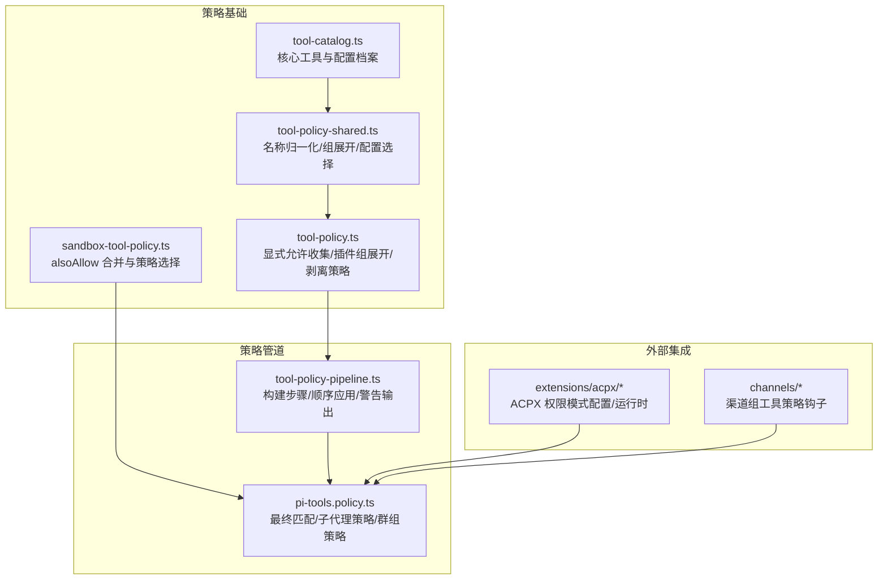
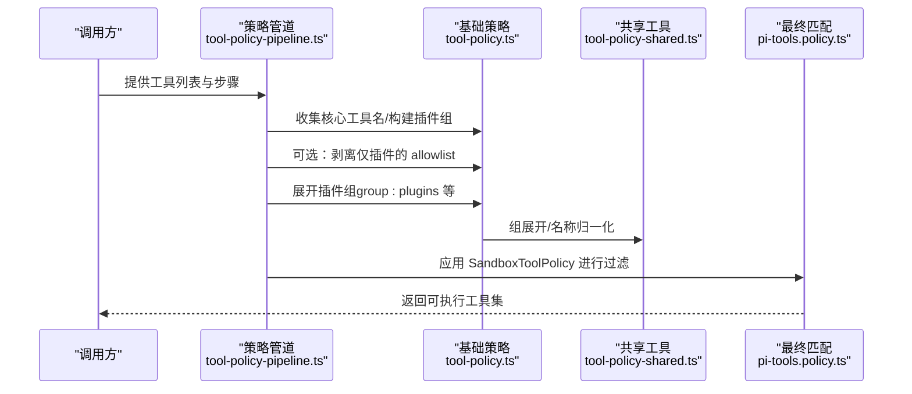
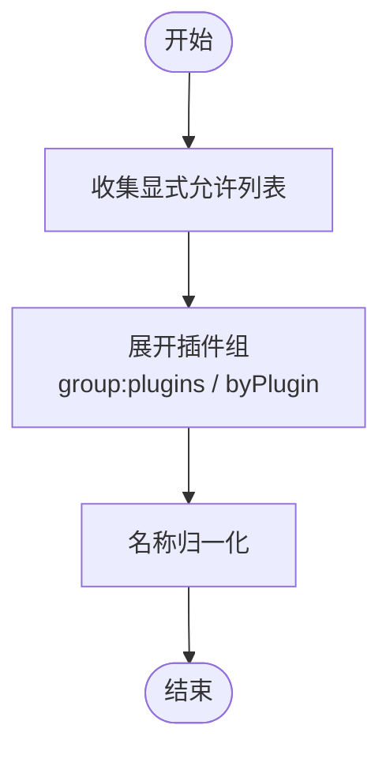
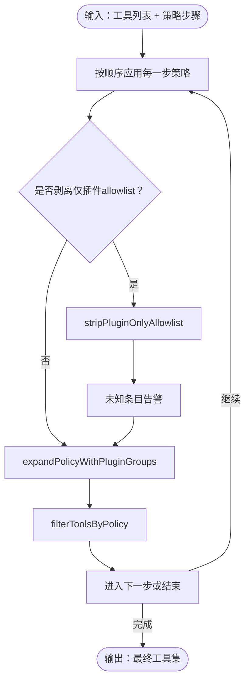
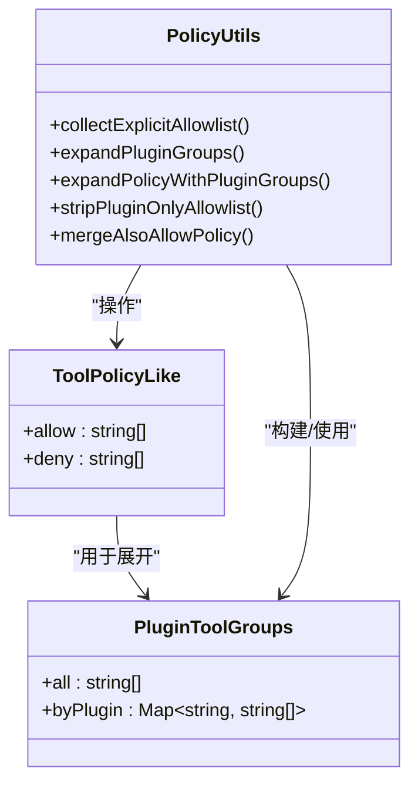
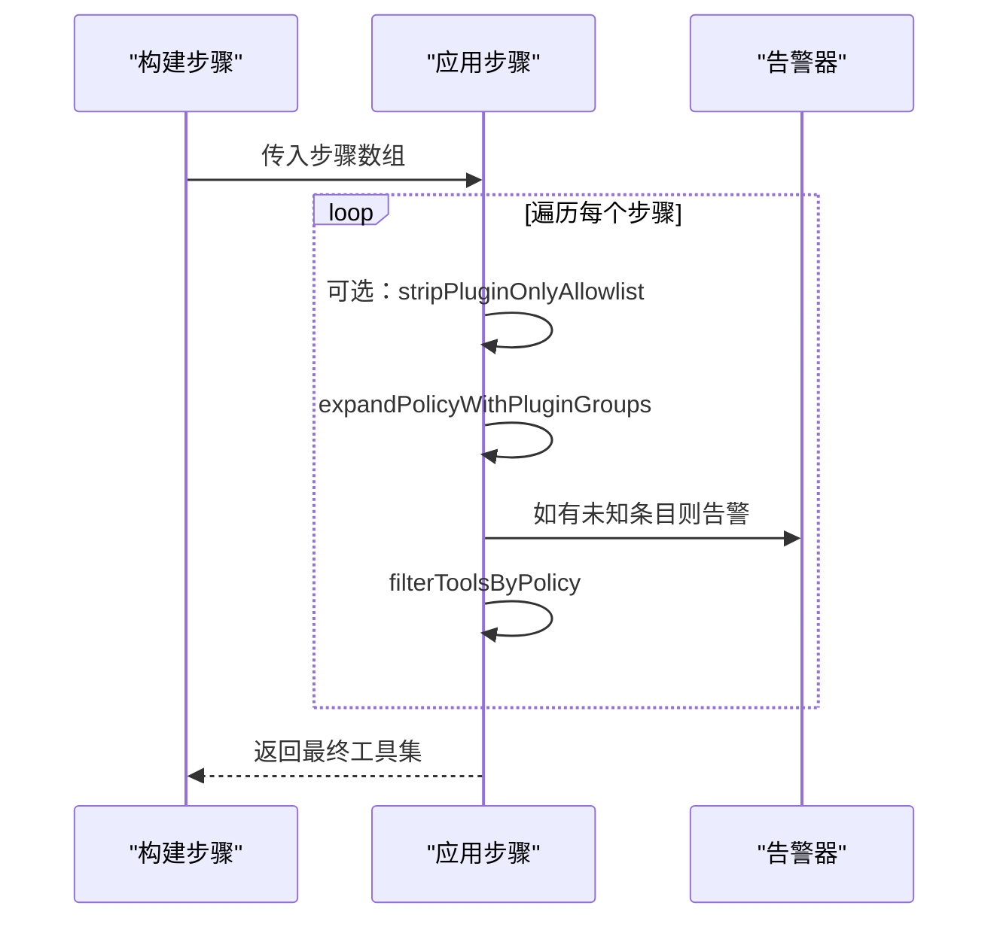
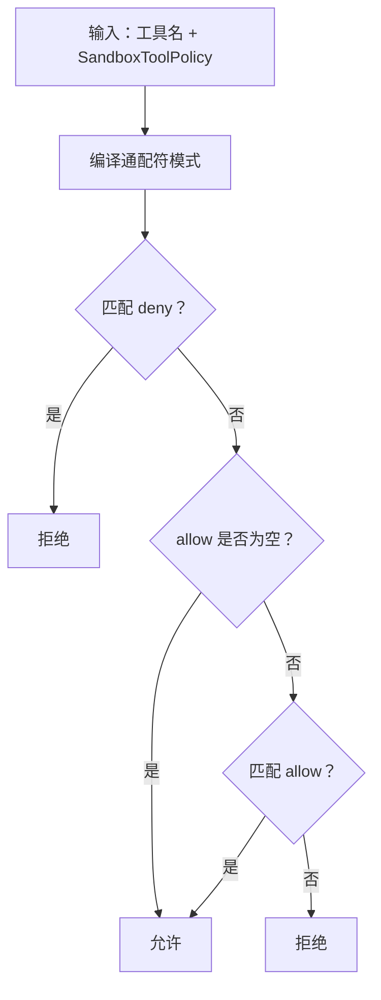
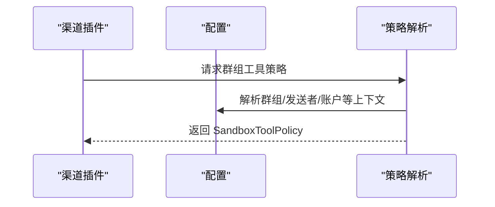
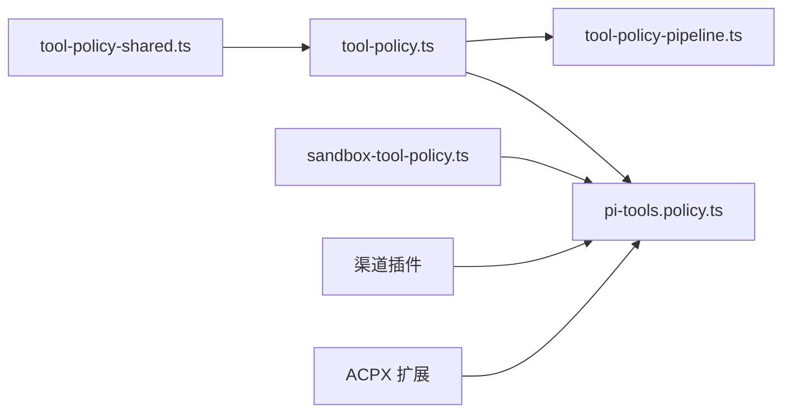

# 策略解析和合并

<cite>
**本文引用的文件**
- [src/agents/tool-policy.ts](file://src/agents/tool-policy.ts)
- [src/agents/tool-policy-pipeline.ts](file://src/agents/tool-policy-pipeline.ts)
- [src/agents/tool-policy-shared.ts](file://src/agents/tool-policy-shared.ts)
- [src/agents/tool-policy.test.ts](file://src/agents/tool-policy.test.ts)
- [src/agents/pi-tools.policy.ts](file://src/agents/pi-tools.policy.ts)
- [src/agents/tool-catalog.ts](file://src/agents/tool-catalog.ts)
- [src/agents/sandbox-tool-policy.ts](file://src/agents/sandbox-tool-policy.ts)
- [src/channels/plugins/group-mentions.test.ts](file://src/channels/plugins/group-mentions.test.ts)
- [extensions/acpx/src/config.ts](file://extensions/acpx/src/config.ts)
- [extensions/acpx/src/runtime.ts](file://extensions/acpx/src/runtime.ts)
</cite>

## 目录
1. [简介](#简介)
2. [项目结构](#项目结构)
3. [核心组件](#核心组件)
4. [架构总览](#架构总览)
5. [详细组件分析](#详细组件分析)
6. [依赖关系分析](#依赖关系分析)
7. [性能考量](#性能考量)
8. [故障排查指南](#故障排查指南)
9. [结论](#结论)
10. [附录](#附录)

## 简介
本文件系统性阐述 OpenClaw 工具权限策略的解析与合并机制，覆盖以下关键主题：
- 显式允许列表收集：从多源策略中提取并归一化允许条目
- 策略合并算法：按优先级顺序应用策略，处理插件组展开与冲突
- 冲突解决规则：deny 优先、allow 聚合、插件仅允许列表的安全剥离
- 策略管道工作原理：继承链、优先级处理与最终策略确定
- 工具组展开与插件组权限：将 group:plugins 等占位符展开为具体工具集
- 性能优化与缓存策略：避免重复计算与冗余遍历
- 边界情况与错误恢复：未知条目警告、空策略跳过、owner-only 安全限制
- 策略调试与验证：日志与断言、测试用例覆盖

## 项目结构
围绕工具权限策略的核心代码位于 agents 子模块，并与渠道插件、扩展插件协同工作：
- 工具策略基础能力：名称归一化、组展开、配置选择与合并
- 策略管道：按作用域与优先级顺序应用策略
- 最终策略匹配：编译通配符模式、执行 deny/allow 决策
- 插件与渠道集成：插件组展开、渠道组策略钩子

图表来源
- [src/agents/tool-policy-shared.ts:1-50](file://src/agents/tool-policy-shared.ts#L1-L50)
- [src/agents/tool-policy.ts:1-211](file://src/agents/tool-policy.ts#L1-L211)
- [src/agents/tool-catalog.ts:1-327](file://src/agents/tool-catalog.ts#L1-L327)
- [src/agents/sandbox-tool-policy.ts:1-38](file://src/agents/sandbox-tool-policy.ts#L1-L38)
- [src/agents/tool-policy-pipeline.ts:1-109](file://src/agents/tool-policy-pipeline.ts#L1-L109)
- [src/agents/pi-tools.policy.ts:1-390](file://src/agents/pi-tools.policy.ts#L1-L390)
- [extensions/acpx/src/config.ts:156-190](file://extensions/acpx/src/config.ts#L156-L190)
- [extensions/acpx/src/runtime.ts:54-642](file://extensions/acpx/src/runtime.ts#L54-L642)

章节来源
- [src/agents/tool-policy-shared.ts:1-50](file://src/agents/tool-policy-shared.ts#L1-L50)
- [src/agents/tool-policy.ts:1-211](file://src/agents/tool-policy.ts#L1-L211)
- [src/agents/tool-policy-pipeline.ts:1-109](file://src/agents/tool-policy-pipeline.ts#L1-L109)
- [src/agents/pi-tools.policy.ts:1-390](file://src/agents/pi-tools.policy.ts#L1-L390)
- [src/agents/tool-catalog.ts:1-327](file://src/agents/tool-catalog.ts#L1-L327)
- [src/agents/sandbox-tool-policy.ts:1-38](file://src/agents/sandbox-tool-policy.ts#L1-L38)
- [extensions/acpx/src/config.ts:156-190](file://extensions/acpx/src/config.ts#L156-L190)
- [extensions/acpx/src/runtime.ts:54-642](file://extensions/acpx/src/runtime.ts#L54-L642)

## 核心组件
- 名称归一化与组展开（tool-policy-shared.ts）
  - 将别名映射为标准名称，统一大小写与空白
  - 将 group:* 展开为核心工具集合或插件工具集合
- 工具策略数据结构（tool-policy.ts）
  - ToolPolicyLike：allow/deny 列表
  - PluginToolGroups：按插件聚合的工具清单
  - AllowlistResolution：允许列表解析结果（含未知条目与剥离标记）
- 策略合并与插件组展开（tool-policy.ts）
  - collectExplicitAllowlist：从多策略中收集显式允许条目
  - expandPluginGroups / expandPolicyWithPluginGroups：将 group:plugins 展开为具体工具
  - stripPluginOnlyAllowlist：当 allowlist 仅包含插件工具时剥离，确保核心工具不被意外禁用
  - mergeAlsoAllowPolicy：将 alsoAllow 合并到 allow 中
- 策略管道（tool-policy-pipeline.ts）
  - buildDefaultToolPolicyPipelineSteps：定义策略应用顺序（profile → byProvider → 全局 → agent → group）
  - applyToolPolicyPipeline：逐层应用策略，支持插件组展开与未知条目告警
- 最终策略匹配（pi-tools.policy.ts）
  - 编译通配符模式，先 deny 后 allow
  - 子代理工具策略、群组工具策略、提供者维度策略解析
- 沙箱策略选择（sandbox-tool-policy.ts）
  - alsoAllow 的语义：在无 allow 时作为“隐式全部”基础上的增量
  - pickSandboxToolPolicy：生成最终 SandboxToolPolicy

章节来源
- [src/agents/tool-policy-shared.ts:19-47](file://src/agents/tool-policy-shared.ts#L19-L47)
- [src/agents/tool-policy.ts:59-211](file://src/agents/tool-policy.ts#L59-L211)
- [src/agents/tool-policy-pipeline.ts:11-109](file://src/agents/tool-policy-pipeline.ts#L11-L109)
- [src/agents/pi-tools.policy.ts:20-45](file://src/agents/pi-tools.policy.ts#L20-L45)
- [src/agents/sandbox-tool-policy.ts:9-37](file://src/agents/sandbox-tool-policy.ts#L9-L37)

## 架构总览
下图展示从策略输入到工具过滤的完整流程，包括策略管道、插件组展开与最终匹配阶段。

图表来源
- [src/agents/tool-policy-pipeline.ts:65-109](file://src/agents/tool-policy-pipeline.ts#L65-L109)
- [src/agents/tool-policy.ts:75-211](file://src/agents/tool-policy.ts#L75-L211)
- [src/agents/tool-policy-shared.ts:19-47](file://src/agents/tool-policy-shared.ts#L19-L47)
- [src/agents/pi-tools.policy.ts:150-156](file://src/agents/pi-tools.policy.ts#L150-L156)

## 详细组件分析

### 组件A：显式允许列表收集与插件组展开
- 功能要点
  - collectExplicitAllowlist：遍历多个策略的 allow 列表，去空白与非字符串项，保留有效条目
  - expandPluginGroups：将 group:plugins 展开为所有插件工具；将插件 ID 展开为其工具集合
  - expandPolicyWithPluginGroups：对 allow/deny 均进行展开
- 关键行为
  - group:plugins 在存在插件工具时展开为具体工具名；否则保持原样
  - 对 byPlugin 的映射按小写插件 ID 查找，确保大小写不敏感
- 复杂度
  - 展开过程线性于条目数量与插件工具数量之和
  - 去重使用 Set，保证输出无重复

图表来源
- [src/agents/tool-policy.ts:75-92](file://src/agents/tool-policy.ts#L75-L92)
- [src/agents/tool-policy.ts:115-154](file://src/agents/tool-policy.ts#L115-L154)
- [src/agents/tool-policy-shared.ts:19-47](file://src/agents/tool-policy-shared.ts#L19-L47)

章节来源
- [src/agents/tool-policy.ts:75-154](file://src/agents/tool-policy.ts#L75-L154)
- [src/agents/tool-policy-shared.ts:19-47](file://src/agents/tool-policy-shared.ts#L19-L47)

### 组件B：策略合并与冲突解决
- 合并顺序（策略管道）
  - tools.profile → tools.byProvider.profile → tools.allow → tools.byProvider.allow → agents.{id}.tools.allow → agents.{id}.tools.byProvider.allow → group tools.allow
  - 每步可选择是否剥离仅插件的 allowlist，以避免误禁核心工具
- 冲突解决规则
  - deny 优先：先按 deny 过滤，再按 allow 保留
  - alsoAllow 语义：在无 allow 时作为“隐式全部”基础上的增量
  - 未知条目告警：当 allowlist 包含无法识别的条目时发出警告
- 最终策略确定
  - 使用 pi-tools.policy.ts 的匹配器，编译通配符并执行匹配
  - applyToolPolicyPipeline 返回最终可用工具集

图表来源
- [src/agents/tool-policy-pipeline.ts:17-63](file://src/agents/tool-policy-pipeline.ts#L17-L63)
- [src/agents/tool-policy-pipeline.ts:65-109](file://src/agents/tool-policy-pipeline.ts#L65-L109)
- [src/agents/tool-policy.ts:156-200](file://src/agents/tool-policy.ts#L156-L200)
- [src/agents/pi-tools.policy.ts:150-156](file://src/agents/pi-tools.policy.ts#L150-L156)

章节来源
- [src/agents/tool-policy-pipeline.ts:17-109](file://src/agents/tool-policy-pipeline.ts#L17-L109)
- [src/agents/tool-policy.ts:156-211](file://src/agents/tool-policy.ts#L156-L211)
- [src/agents/pi-tools.policy.ts:150-156](file://src/agents/pi-tools.policy.ts#L150-L156)

### 组件C：工具组展开与插件组权限
- 工具组映射
  - TOOL_GROUPS：核心工具分组（如 group:fs、group:runtime 等）
  - group:openclaw：包含若干常用工具的集合
- 插件组展开
  - buildPluginToolGroups：基于工具元信息（pluginId）构建插件工具分组
  - expandPluginGroups：将 group:plugins 展开为所有插件工具；将插件 ID 展开为其工具集合
- 插件组权限处理
  - 当 allowlist 仅包含插件工具且未包含核心工具时，stripPluginOnlyAllowlist 会剥离 allowlist，避免误禁核心工具
  - 若存在未知条目，返回 unknownAllowlist 并提示用户改用 tools.alsoAllow 或启用对应插件

图表来源
- [src/agents/tool-policy.ts:59-73](file://src/agents/tool-policy.ts#L59-L73)
- [src/agents/tool-policy.ts:94-154](file://src/agents/tool-policy.ts#L94-L154)
- [src/agents/tool-policy.ts:156-211](file://src/agents/tool-policy.ts#L156-L211)

章节来源
- [src/agents/tool-policy.ts:59-154](file://src/agents/tool-policy.ts#L59-L154)
- [src/agents/tool-policy.ts:156-211](file://src/agents/tool-policy.ts#L156-L211)

### 组件D：策略管道与优先级
- 步骤构建
  - buildDefaultToolPolicyPipelineSteps：根据配置参数生成步骤序列，标注来源标签
- 执行流程
  - applyToolPolicyPipeline：逐步应用策略，必要时剥离仅插件 allowlist，并对未知条目发出告警
- 优先级处理
  - 通过步骤顺序体现优先级：更具体的策略（agent/group）覆盖更通用的策略（全局）

图表来源
- [src/agents/tool-policy-pipeline.ts:17-63](file://src/agents/tool-policy-pipeline.ts#L17-L63)
- [src/agents/tool-policy-pipeline.ts:65-109](file://src/agents/tool-policy-pipeline.ts#L65-L109)

章节来源
- [src/agents/tool-policy-pipeline.ts:17-109](file://src/agents/tool-policy-pipeline.ts#L17-L109)

### 组件E：最终策略匹配与子代理/群组策略
- 匹配器
  - makeToolPolicyMatcher：编译 deny/allow 通配符，先匹配 deny，再匹配 allow；特殊处理 apply_patch 对 exec 的例外
- 子代理策略
  - resolveSubagentToolPolicy / resolveSubagentToolPolicyForSession：根据深度/角色与 alsoAllow 合并 deny 列表
- 群组策略
  - resolveGroupToolPolicy：从会话上下文解析群组与渠道，调用渠道插件或默认实现获取工具策略

图表来源
- [src/agents/pi-tools.policy.ts:20-45](file://src/agents/pi-tools.policy.ts#L20-L45)
- [src/agents/pi-tools.policy.ts:150-156](file://src/agents/pi-tools.policy.ts#L150-L156)

章节来源
- [src/agents/pi-tools.policy.ts:20-45](file://src/agents/pi-tools.policy.ts#L20-L45)
- [src/agents/pi-tools.policy.ts:103-141](file://src/agents/pi-tools.policy.ts#L103-L141)
- [src/agents/pi-tools.policy.ts:325-382](file://src/agents/pi-tools.policy.ts#L325-L382)

### 组件F：插件组权限与渠道集成
- 渠道组策略
  - 测试用例展示了不同群组与发送者身份下的工具策略差异（如 exec/deny 或 message.* 的 allow）
- ACPX 权限模式
  - config.ts：校验 permissionMode、nonInteractivePermissions、timeoutSeconds、strictWindowsCmdWrapper 等字段
  - runtime.ts：根据 permissionMode 生成命令行参数，处理非交互场景的权限请求

图表来源
- [src/channels/plugins/group-mentions.test.ts:132-175](file://src/channels/plugins/group-mentions.test.ts#L132-L175)
- [src/agents/pi-tools.policy.ts:338-382](file://src/agents/pi-tools.policy.ts#L338-L382)
- [extensions/acpx/src/config.ts:156-190](file://extensions/acpx/src/config.ts#L156-L190)
- [extensions/acpx/src/runtime.ts:54-642](file://extensions/acpx/src/runtime.ts#L54-L642)

章节来源
- [src/channels/plugins/group-mentions.test.ts:132-175](file://src/channels/plugins/group-mentions.test.ts#L132-L175)
- [src/agents/pi-tools.policy.ts:338-382](file://src/agents/pi-tools.policy.ts#L338-L382)
- [extensions/acpx/src/config.ts:156-190](file://extensions/acpx/src/config.ts#L156-L190)
- [extensions/acpx/src/runtime.ts:54-642](file://extensions/acpx/src/runtime.ts#L54-L642)

## 依赖关系分析
- 模块内依赖
  - tool-policy.ts 依赖 tool-policy-shared.ts 的名称归一化与组展开
  - tool-policy-pipeline.ts 依赖 tool-policy.ts 的策略工具与插件组展开
  - pi-tools.policy.ts 依赖 sandbox-tool-policy.ts 的 alsoAllow 语义与最终匹配
- 外部依赖
  - 渠道插件通过 resolveChannelGroupToolsPolicy 或自定义钩子提供群组策略
  - ACPX 扩展通过配置与运行时控制权限模式

图表来源
- [src/agents/tool-policy-shared.ts:1-50](file://src/agents/tool-policy-shared.ts#L1-L50)
- [src/agents/tool-policy.ts:1-211](file://src/agents/tool-policy.ts#L1-L211)
- [src/agents/tool-policy-pipeline.ts:1-109](file://src/agents/tool-policy-pipeline.ts#L1-L109)
- [src/agents/pi-tools.policy.ts:1-390](file://src/agents/pi-tools.policy.ts#L1-L390)
- [src/agents/sandbox-tool-policy.ts:1-38](file://src/agents/sandbox-tool-policy.ts#L1-L38)

章节来源
- [src/agents/tool-policy-shared.ts:1-50](file://src/agents/tool-policy-shared.ts#L1-L50)
- [src/agents/tool-policy.ts:1-211](file://src/agents/tool-policy.ts#L1-L211)
- [src/agents/tool-policy-pipeline.ts:1-109](file://src/agents/tool-policy-pipeline.ts#L1-L109)
- [src/agents/pi-tools.policy.ts:1-390](file://src/agents/pi-tools.policy.ts#L1-L390)
- [src/agents/sandbox-tool-policy.ts:1-38](file://src/agents/sandbox-tool-policy.ts#L1-L38)

## 性能考量
- 时间复杂度
  - 名称归一化与组展开：O(N)，N 为条目数
  - 插件组展开：O(N + M)，M 为插件工具总数
  - 策略管道：对每一步执行一次过滤，整体 O(S·T)，S 为步骤数，T 为工具数
- 空间复杂度
  - 主要消耗在 Set 去重与中间展开结果
- 优化建议
  - 缓存策略展开结果：对相同策略与工具集组合复用展开与匹配器
  - 预编译通配符：在策略稳定时缓存编译后的模式
  - 分段过滤：先按 deny 快速筛除，再按 allow 精确保留
  - 插件组缓存：对 buildPluginToolGroups 结果按工具快照缓存

[本节为通用指导，无需列出具体文件来源]

## 故障排查指南
- 未知条目告警
  - 现象：策略允许列表包含无法识别的条目
  - 处理：检查条目是否拼写错误；若为插件工具，请启用相应插件或改用 tools.alsoAllow
  - 触发位置：applyToolPolicyPipeline 中对 unknownAllowlist 的告警
- 仅插件 allowlist 被剥离
  - 现象：allowlist 仅包含插件工具时被剥离，以保护核心工具
  - 处理：改用 tools.alsoAllow 或在 allow 中显式包含核心工具
  - 触发位置：stripPluginOnlyAllowlist
- owner-only 工具限制
  - 现象：非所有者发送者会被移除 owner-only 工具或替换为抛错执行
  - 处理：确认发送者身份或调整策略
  - 触发位置：applyOwnerOnlyToolPolicy
- 渠道/群组策略异常
  - 现象：不同群组或发送者身份导致策略差异
  - 处理：检查渠道插件钩子与 resolveGroupToolPolicy 的上下文解析
  - 触发位置：resolveGroupToolPolicy

章节来源
- [src/agents/tool-policy-pipeline.ts:92-100](file://src/agents/tool-policy-pipeline.ts#L92-L100)
- [src/agents/tool-policy.ts:156-200](file://src/agents/tool-policy.ts#L156-L200)
- [src/agents/tool-policy.ts:46-57](file://src/agents/tool-policy.ts#L46-L57)
- [src/agents/pi-tools.policy.ts:338-382](file://src/agents/pi-tools.policy.ts#L338-L382)

## 结论
OpenClaw 的工具权限策略体系通过“名称归一化 + 组展开 + 策略管道 + 最终匹配”的分层设计，实现了高可配置性与安全性：
- 显式允许列表收集与插件组展开确保策略表达灵活
- 策略管道按优先级顺序应用，结合未知条目告警与仅插件 allowlist 剥离，提升健壮性
- 最终匹配采用 deny 优先与通配符模式，兼顾灵活性与一致性
- 与渠道插件、扩展插件的集成进一步增强了策略的上下文感知能力

[本节为总结性内容，无需列出具体文件来源]

## 附录
- 相关测试用例参考
  - 策略管道与插件组展开：[src/agents/tool-policy-pipeline.test.ts:1-25](file://src/agents/tool-policy-pipeline.test.ts#L1-L25)
  - 工具策略与 owner-only 限制：[src/agents/tool-policy.test.ts:16-132](file://src/agents/tool-policy.test.ts#L16-L132)
  - 沙箱策略与 alsoAllow 语义：[src/agents/tool-policy.test.ts:189-227](file://src/agents/tool-policy.test.ts#L189-L227)
  - 渠道组策略示例：[src/channels/plugins/group-mentions.test.ts:132-175](file://src/channels/plugins/group-mentions.test.ts#L132-L175)
  - ACPX 权限模式校验：[extensions/acpx/src/config.ts:156-190](file://extensions/acpx/src/config.ts#L156-L190)

[本节为补充材料，无需列出具体文件来源]