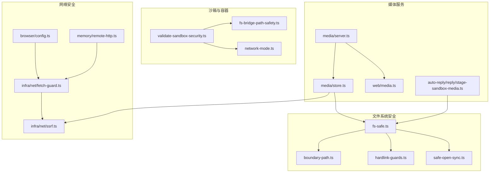
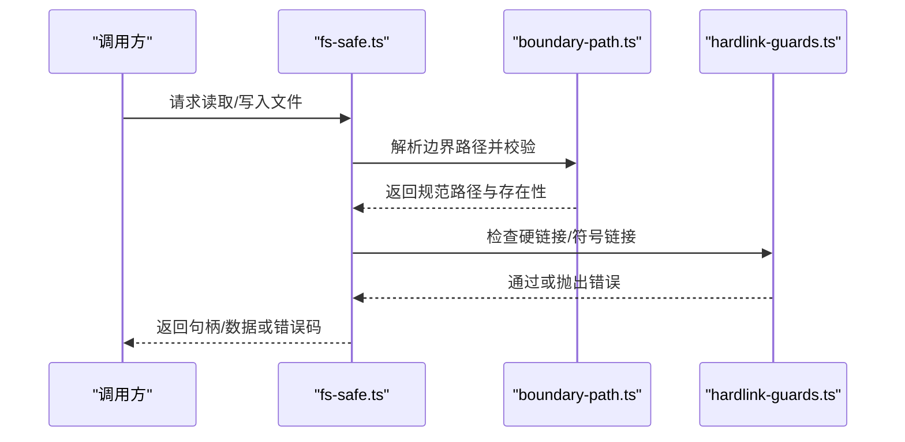
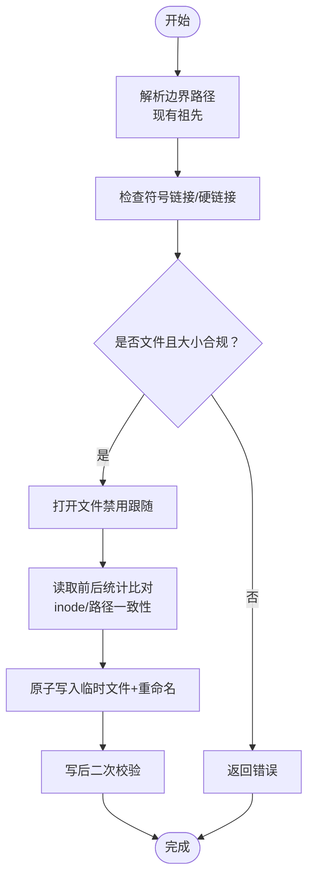
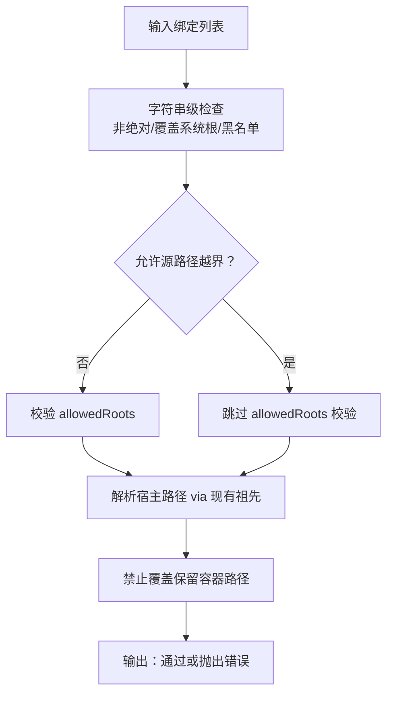
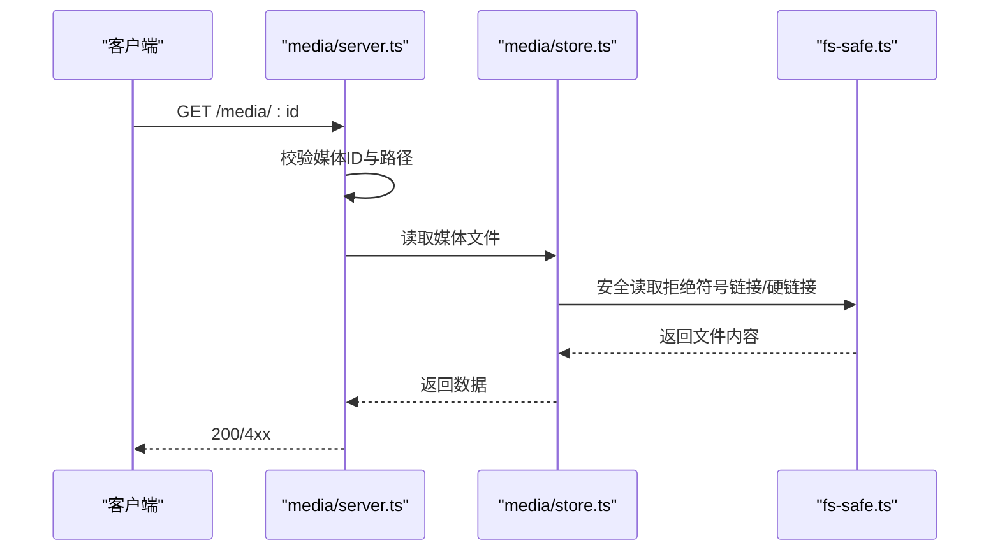
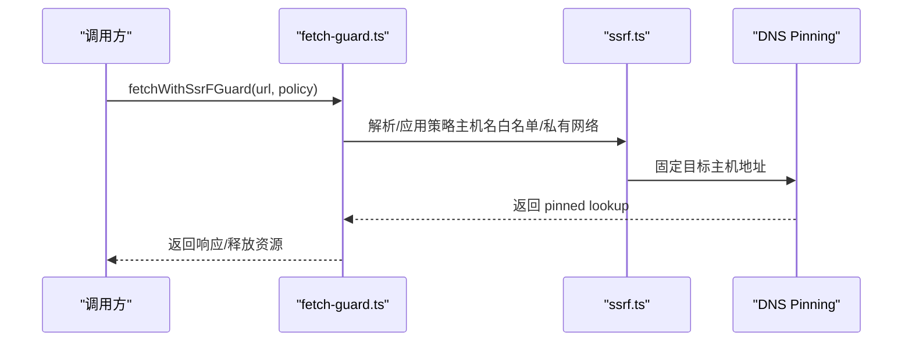
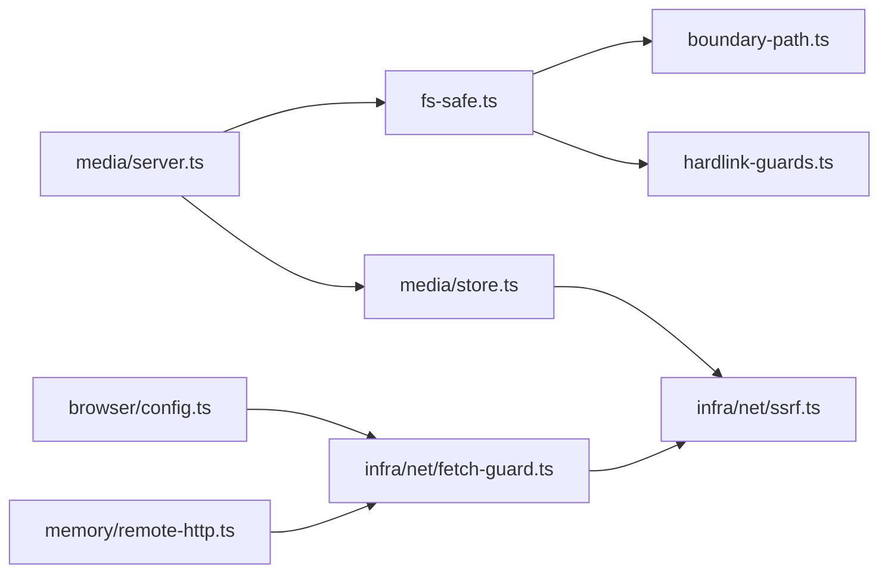

# 文件系统和网络隔离

<cite>
**本文引用的文件**
- [src/agents/sandbox/validate-sandbox-security.ts](file://src/agents/sandbox/validate-sandbox-security.ts)
- [src/agents/sandbox/network-mode.ts](file://src/agents/sandbox/network-mode.ts)
- [src/agents/sandbox/fs-bridge-path-safety.ts](file://src/agents/sandbox/fs-bridge-path-safety.ts)
- [src/infra/fs-safe.ts](file://src/infra/fs-safe.ts)
- [src/infra/boundary-path.ts](file://src/infra/boundary-path.ts)
- [src/infra/hardlink-guards.ts](file://src/infra/hardlink-guards.ts)
- [src/infra/safe-open-sync.ts](file://src/infra/safe-open-sync.ts)
- [src/media/server.ts](file://src/media/server.ts)
- [src/media/store.ts](file://src/media/store.ts)
- [src/media/server.test.ts](file://src/media/server.test.ts)
- [src/web/media.ts](file://src/web/media.ts)
- [src/auto-reply/reply/stage-sandbox-media.ts](file://src/auto-reply/reply/stage-sandbox-media.ts)
- [src/infra/net/ssrf.ts](file://src/infra/net/ssrf.ts)
- [src/infra/net/fetch-guard.ts](file://src/infra/net/fetch-guard.ts)
- [src/browser/config.ts](file://src/browser/config.ts)
- [src/memory/remote-http.ts](file://src/memory/remote-http.ts)
- [SECURITY.md](file://SECURITY.md)
</cite>

## 目录
1. [简介](#简介)
2. [项目结构](#项目结构)
3. [核心组件](#核心组件)
4. [架构总览](#架构总览)
5. [详细组件分析](#详细组件分析)
6. [依赖关系分析](#依赖关系分析)
7. [性能考量](#性能考量)
8. [故障排查指南](#故障排查指南)
9. [结论](#结论)
10. [附录](#附录)

## 简介
本文件系统与网络隔离技术文档聚焦于 OpenClaw 在文件系统与网络访问两方面的安全边界设计与实现。内容涵盖：
- 文件系统隔离：路径白名单、访问控制、硬链接与符号链接防护、原子写入与边界校验、媒体文件路径的特殊处理与安全考虑。
- 网络访问控制：SSRF 防护策略、DNS 固定（Pinning）、主机名白名单、私有网络访问策略、受信代理模式与流量过滤。
- 路径策略解析与应用：边界路径解析、别名逃逸检测、宿主路径规范化与同源性校验。
- 配置示例与最佳实践：如何在不同运行场景下正确配置隔离策略。
- 性能影响与优化：I/O 校验成本、DNS Pinning 缓存、并发与超时控制。
- 不同操作系统差异：Linux/Windows 平台在路径语义、权限模型与边界检查上的差异。
- 测试与验证：单元测试覆盖点、关键边界用例与回归保障。

## 项目结构
OpenClaw 将隔离能力分布在多个子模块中：
- 沙箱与容器隔离：绑定挂载校验、网络模式阻断、宿主路径规范化。
- 文件系统安全：安全打开与读写、边界路径解析、硬链接与符号链接限制、原子写入与后验证。
- 媒体服务：本地媒体路由、ID 规范化、大小限制、过期清理、路径白名单。
- 网络安全：SSRF 策略、DNS 固定、受信代理模式、远程请求守卫。

图表来源
- [src/agents/sandbox/validate-sandbox-security.ts:1-344](file://src/agents/sandbox/validate-sandbox-security.ts#L1-L344)
- [src/agents/sandbox/network-mode.ts:1-29](file://src/agents/sandbox/network-mode.ts#L1-L29)
- [src/agents/sandbox/fs-bridge-path-safety.ts:1-49](file://src/agents/sandbox/fs-bridge-path-safety.ts#L1-L49)
- [src/infra/fs-safe.ts:1-860](file://src/infra/fs-safe.ts#L1-L860)
- [src/infra/boundary-path.ts:1-862](file://src/infra/boundary-path.ts#L1-L862)
- [src/infra/hardlink-guards.ts:1-39](file://src/infra/hardlink-guards.ts#L1-L39)
- [src/infra/safe-open-sync.ts:1-102](file://src/infra/safe-open-sync.ts#L1-L102)
- [src/media/server.ts:1-118](file://src/media/server.ts#L1-L118)
- [src/media/store.ts:1-378](file://src/media/store.ts#L1-L378)
- [src/web/media.ts:97-138](file://src/web/media.ts#L97-L138)
- [src/auto-reply/reply/stage-sandbox-media.ts:169-225](file://src/auto-reply/reply/stage-sandbox-media.ts#L169-L225)
- [src/infra/net/ssrf.ts:53-92](file://src/infra/net/ssrf.ts#L53-L92)
- [src/infra/net/fetch-guard.ts:1-52](file://src/infra/net/fetch-guard.ts#L1-L52)
- [src/browser/config.ts:101-136](file://src/browser/config.ts#L101-L136)
- [src/memory/remote-http.ts:1-40](file://src/memory/remote-http.ts#L1-L40)

章节来源
- [src/agents/sandbox/validate-sandbox-security.ts:1-344](file://src/agents/sandbox/validate-sandbox-security.ts#L1-L344)
- [src/infra/fs-safe.ts:1-860](file://src/infra/fs-safe.ts#L1-L860)
- [src/media/server.ts:1-118](file://src/media/server.ts#L1-L118)
- [src/infra/net/ssrf.ts:53-92](file://src/infra/net/ssrf.ts#L53-L92)

## 核心组件
- 沙箱绑定挂载与网络模式校验：阻止危险宿主路径暴露、禁止 host 网络与容器命名空间加入，确保容器网络隔离。
- 边界路径解析与别名逃逸防护：通过“现有祖先”解析与严格边界判定，防止符号链接与硬链接逃逸。
- 安全文件读写：拒绝目录、符号链接、硬链接；支持最大字节限制；原子写入与后验证，避免竞态与越界。
- 媒体服务与本地媒体访问：媒体 ID 校验、路径白名单、大小限制、过期清理；本地媒体访问需明确允许根目录。
- SSRF 防护与 DNS 固定：主机名白名单、私有网络访问策略、可选受信代理模式；远程请求守卫统一接入。

章节来源
- [src/agents/sandbox/validate-sandbox-security.ts:1-344](file://src/agents/sandbox/validate-sandbox-security.ts#L1-L344)
- [src/infra/boundary-path.ts:1-862](file://src/infra/boundary-path.ts#L1-L862)
- [src/infra/fs-safe.ts:1-860](file://src/infra/fs-safe.ts#L1-L860)
- [src/media/server.ts:1-118](file://src/media/server.ts#L1-L118)
- [src/web/media.ts:97-138](file://src/web/media.ts#L97-L138)
- [src/infra/net/ssrf.ts:53-92](file://src/infra/net/ssrf.ts#L53-L92)
- [src/infra/net/fetch-guard.ts:1-52](file://src/infra/net/fetch-guard.ts#L1-L52)

## 架构总览
OpenClaw 的隔离体系以“边界+策略+执行”三层协同：
- 边界层：宿主路径规范化、容器挂载目标与源路径边界判定、媒体目录白名单。
- 策略层：SSRF 主机名白名单、私有网络访问策略、浏览器/插件侧策略解析。
- 执行层：安全打开/写入、DNS 固定、受信代理模式、远程请求守卫。

图表来源
- [src/infra/fs-safe.ts:177-210](file://src/infra/fs-safe.ts#L177-L210)
- [src/infra/boundary-path.ts:47-80](file://src/infra/boundary-path.ts#L47-L80)
- [src/infra/hardlink-guards.ts:5-31](file://src/infra/hardlink-guards.ts#L5-L31)

## 详细组件分析

### 文件系统隔离：路径白名单、访问控制与数据保护
- 路径白名单与边界校验
  - 使用边界路径解析器对绝对路径进行“现有祖先”解析，确保即使存在符号链接也能回到合法边界内。
  - 支持策略化的最终符号链接/硬链接容忍，用于删除等特定操作。
- 访问控制
  - 严格拒绝目录与符号链接作为目标；拒绝硬链接文件；拒绝超出最大字节数的文件。
  - 写入前进行原子替换与后验证，避免竞态导致的越界写入。
- 数据保护
  - 原子写入：临时文件+重命名，失败即清理；写后再次打开并比对 inode 与路径，确保未被替换。
  - 同源性校验：lstat/fstat 双重校验，防止路径在读取过程中被替换。

图表来源
- [src/infra/boundary-path.ts:47-80](file://src/infra/boundary-path.ts#L47-L80)
- [src/infra/hardlink-guards.ts:5-31](file://src/infra/hardlink-guards.ts#L5-L31)
- [src/infra/fs-safe.ts:380-501](file://src/infra/fs-safe.ts#L380-L501)

章节来源
- [src/infra/boundary-path.ts:1-862](file://src/infra/boundary-path.ts#L1-L862)
- [src/infra/hardlink-guards.ts:1-39](file://src/infra/hardlink-guards.ts#L1-L39)
- [src/infra/fs-safe.ts:1-860](file://src/infra/fs-safe.ts#L1-L860)
- [src/infra/safe-open-sync.ts:1-102](file://src/infra/safe-open-sync.ts#L1-L102)

### 沙箱绑定挂载与网络隔离
- 绑定挂载校验
  - 禁止非绝对源路径、禁止覆盖系统根、禁止挂载黑名单路径（如 /etc、/proc、/dev、Docker 套接字目录）。
  - 允许通过 allowedRoots 白名单限定宿主路径来源；支持“允许源路径位于白名单之外”的危险开关。
  - 禁止覆盖保留容器路径（如 /workspace）。
- 网络模式校验
  - 默认禁止 host 网络模式与 container:* 命名空间加入，避免绕过容器网络隔离。
  - 提供危险开关仅在完全信任运行时启用。

图表来源
- [src/agents/sandbox/validate-sandbox-security.ts:96-180](file://src/agents/sandbox/validate-sandbox-security.ts#L96-L180)
- [src/agents/sandbox/network-mode.ts:8-23](file://src/agents/sandbox/network-mode.ts#L8-L23)

章节来源
- [src/agents/sandbox/validate-sandbox-security.ts:1-344](file://src/agents/sandbox/validate-sandbox-security.ts#L1-L344)
- [src/agents/sandbox/network-mode.ts:1-29](file://src/agents/sandbox/network-mode.ts#L1-L29)

### 媒体文件路径的特殊处理与安全考虑
- 媒体服务器路由
  - 媒体 ID 严格校验（长度、字符集、保留路径），拒绝路径穿越与过长 ID。
  - 仅允许从媒体目录读取，拒绝符号链接与硬链接；超过大小限制返回 413。
- 本地媒体访问
  - 本地媒体访问需显式允许的 localRoots；默认拒绝根目录；避免将工作区临时目录误放行。
- 媒体入库与下载
  - 下载时进行 DNS 固定与主机名白名单校验；写入采用原子方式并设置文件权限，便于容器内访问。

图表来源
- [src/media/server.ts:15-95](file://src/media/server.ts#L15-L95)
- [src/media/store.ts:303-344](file://src/media/store.ts#L303-L344)
- [src/infra/fs-safe.ts:266-294](file://src/infra/fs-safe.ts#L266-L294)

章节来源
- [src/media/server.ts:1-118](file://src/media/server.ts#L1-L118)
- [src/media/server.test.ts:78-131](file://src/media/server.test.ts#L78-L131)
- [src/web/media.ts:97-138](file://src/web/media.ts#L97-L138)
- [src/media/store.ts:1-378](file://src/media/store.ts#L1-L378)
- [src/auto-reply/reply/stage-sandbox-media.ts:169-225](file://src/auto-reply/reply/stage-sandbox-media.ts#L169-L225)

### 网络访问控制：SSRF 防护与流量过滤
- SSRF 策略
  - 主机名白名单与通配后缀匹配；私有网络访问策略可选择允许或受限；支持 RFC2544 基准范围。
  - DNS 固定：解析到固定 IP 列表，后续查询强制使用该地址，防止 DNS 劫持与切换。
- 受信代理模式
  - 受信环境代理模式允许在受控 URL 场景下使用系统代理；默认严格模式下不使用代理。
- 远程请求守卫
  - 统一的 guarded fetch 接口，支持超时、信号中止、最大重定向次数、SSRF 策略与 DNS 固定。

图表来源
- [src/infra/net/fetch-guard.ts:1-52](file://src/infra/net/fetch-guard.ts#L1-L52)
- [src/infra/net/ssrf.ts:53-92](file://src/infra/net/ssrf.ts#L53-L92)
- [src/browser/config.ts:101-136](file://src/browser/config.ts#L101-L136)
- [src/memory/remote-http.ts:1-40](file://src/memory/remote-http.ts#L1-L40)

章节来源
- [src/infra/net/ssrf.ts:53-92](file://src/infra/net/ssrf.ts#L53-L92)
- [src/infra/net/fetch-guard.ts:1-52](file://src/infra/net/fetch-guard.ts#L1-L52)
- [src/browser/config.ts:101-136](file://src/browser/config.ts#L101-L136)
- [src/memory/remote-http.ts:1-40](file://src/memory/remote-http.ts#L1-L40)

### 路径策略的解析与应用机制
- 边界路径解析
  - 通过“现有祖先”解析，先找到存在的父节点再逐步解析到目标，避免符号链接逃逸。
  - 支持同步/异步两种实现，保证跨平台一致性。
- 别名逃逸检测
  - 对最终符号链接/硬链接进行策略化容忍，删除等场景可放宽。
- 应用流程
  - 输入绝对路径与根路径，输出规范路径、相对路径、存在性与类型，确保所有操作都在边界之内。

章节来源
- [src/infra/boundary-path.ts:1-862](file://src/infra/boundary-path.ts#L1-L862)
- [src/infra/path-alias-guards.ts:1-35](file://src/infra/path-alias-guards.ts#L1-L35)

## 依赖关系分析
- 文件系统安全依赖边界路径解析与硬链接防护，共同构成“读写前校验”链路。
- 媒体服务依赖安全文件读取与 SSRF 防护，确保下载与读取的安全性。
- 网络安全依赖 SSRF 策略与受信代理模式，统一由远程请求守卫接入。

图表来源
- [src/infra/fs-safe.ts:1-860](file://src/infra/fs-safe.ts#L1-L860)
- [src/infra/boundary-path.ts:1-862](file://src/infra/boundary-path.ts#L1-L862)
- [src/infra/hardlink-guards.ts:1-39](file://src/infra/hardlink-guards.ts#L1-L39)
- [src/media/server.ts:1-118](file://src/media/server.ts#L1-L118)
- [src/media/store.ts:1-378](file://src/media/store.ts#L1-L378)
- [src/infra/net/ssrf.ts:53-92](file://src/infra/net/ssrf.ts#L53-L92)
- [src/infra/net/fetch-guard.ts:1-52](file://src/infra/net/fetch-guard.ts#L1-L52)
- [src/browser/config.ts:101-136](file://src/browser/config.ts#L101-L136)
- [src/memory/remote-http.ts:1-40](file://src/memory/remote-http.ts#L1-L40)

章节来源
- [src/infra/fs-safe.ts:1-860](file://src/infra/fs-safe.ts#L1-L860)
- [src/media/server.ts:1-118](file://src/media/server.ts#L1-L118)
- [src/infra/net/ssrf.ts:53-92](file://src/infra/net/ssrf.ts#L53-L92)
- [src/infra/net/fetch-guard.ts:1-52](file://src/infra/net/fetch-guard.ts#L1-L52)

## 性能考量
- I/O 校验成本
  - lstat/fstat/realpath 多次调用带来额外开销；建议在批量读写场景中合并操作，减少系统调用次数。
- DNS 固定缓存
  - 对频繁访问的目标域名启用缓存，降低解析与 pinning 成本；注意缓存失效与 TTL 策略。
- 并发与超时
  - guarded fetch 支持超时与信号中止，避免长时间阻塞；合理设置最大重定向次数与并发上限。
- 原子写入
  - 临时文件+重命名在高并发下可能产生短暂的磁盘压力；建议结合文件系统特性与存储介质优化。

## 故障排查指南
- 常见错误与定位
  - 路径不在工作区：检查 rootDir 与相对路径拼接是否越界。
  - 符号链接/硬链接：确认目标不是符号链接或硬链接，必要时调整策略。
  - 超出大小限制：检查 maxBytes 设置与文件实际大小。
  - SSRF 策略拒绝：核对主机名白名单、私有网络访问策略与 DNS 固定配置。
- 测试用例参考
  - 媒体服务：路径穿越、无效 ID、符号链接逃逸、过大文件、缺失参数等场景均有覆盖。
  - SSRF：主机名解析、私有网络访问、受信代理模式等。

章节来源
- [src/media/server.test.ts:78-131](file://src/media/server.test.ts#L78-L131)
- [SECURITY.md:48-67](file://SECURITY.md#L48-L67)

## 结论
OpenClaw 的隔离机制通过“边界路径解析 + 别名逃逸检测 + 安全读写 + SSRF 策略 + DNS 固定”的组合，构建了多层纵深防御。在保证安全性的同时，提供了灵活的策略接口与受信代理模式，满足不同运行环境的需求。建议在生产环境中默认启用严格策略，并根据业务需要审慎开启危险开关。

## 附录

### 配置示例与最佳实践
- 沙箱绑定挂载
  - 明确 allowedRoots，避免使用非绝对路径；默认禁止覆盖保留容器路径。
  - 如需例外，使用危险开关并记录审计日志。
- 网络访问
  - SSRF 策略优先使用主机名白名单；私有网络访问按需开启。
  - 受信代理模式仅用于受控 URL，避免滥用。
- 媒体服务
  - 严格校验媒体 ID；限制最大文件大小；定期清理过期文件。
  - 本地媒体访问必须显式允许 localRoots，避免根目录放行。

### 不同操作系统下的差异
- Linux
  - 支持 O_NOFOLLOW 标志，增强打开文件时的符号链接防护。
  - realpath 与 lstat 行为一致，边界解析更稳健。
- Windows
  - 特殊路径与权限模型不同，安全打开逻辑采用替代方案；原子写入通过临时文件+重命名实现。
  - 边界路径解析同步/异步行为保持一致，避免平台差异导致的逃逸风险。