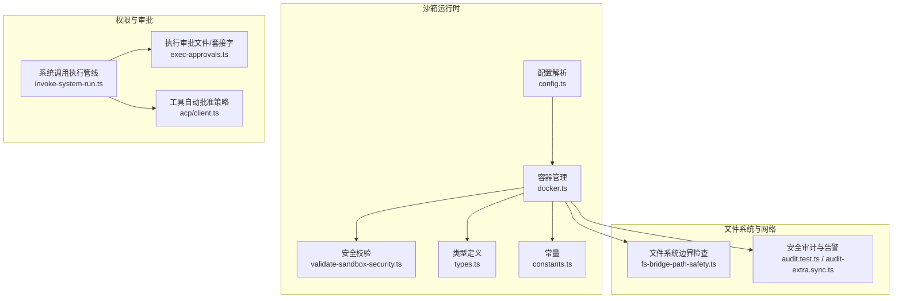
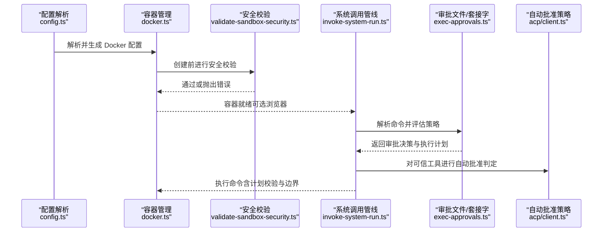
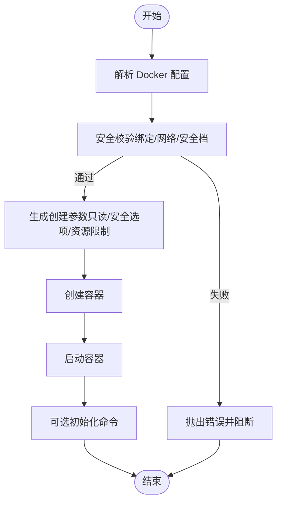
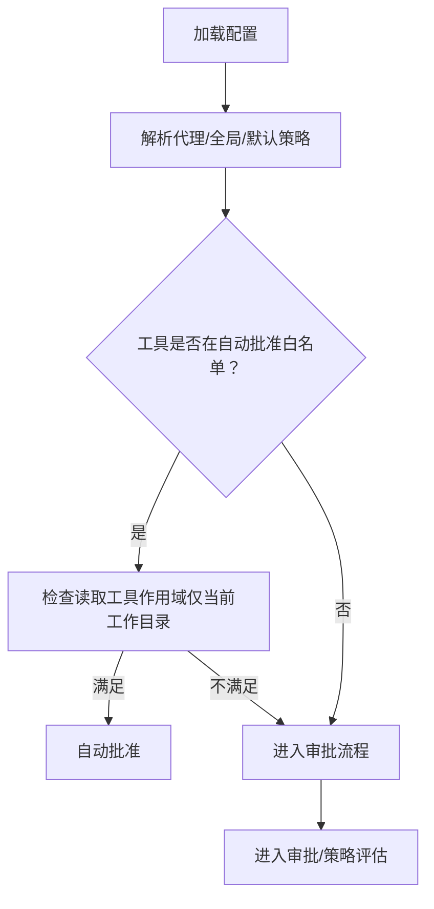
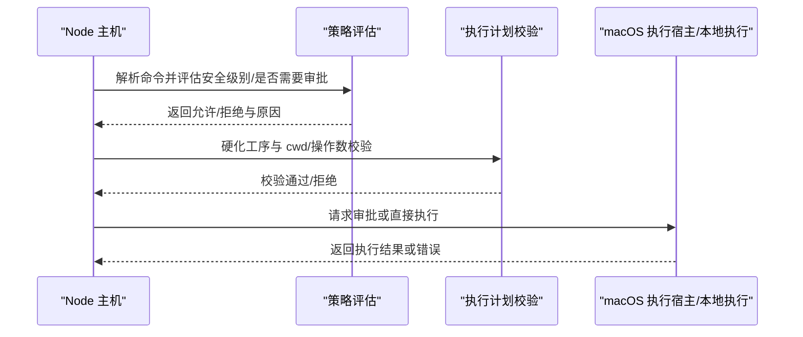
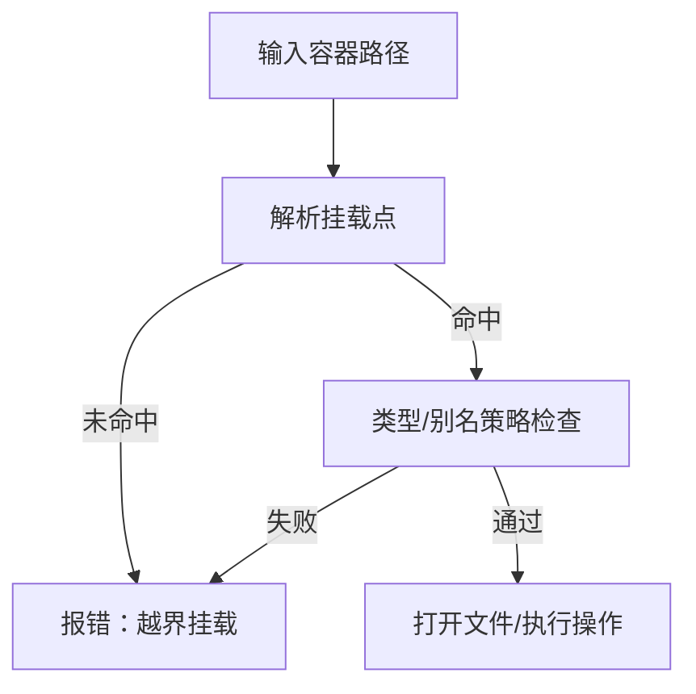
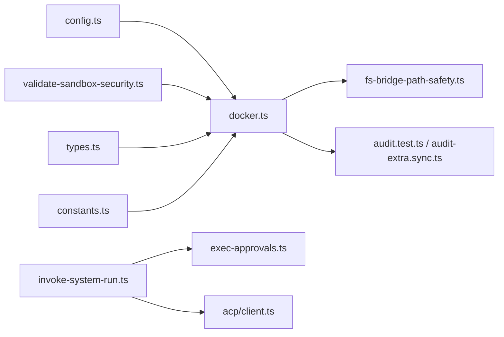

# 沙箱和权限隔离

<cite>
**本文引用的文件**
- [src/agents/sandbox/validate-sandbox-security.ts](file://src/agents/sandbox/validate-sandbox-security.ts)
- [src/agents/sandbox/docker.ts](file://src/agents/sandbox/docker.ts)
- [src/agents/sandbox/config.ts](file://src/agents/sandbox/config.ts)
- [src/agents/sandbox/types.ts](file://src/agents/sandbox/types.ts)
- [src/agents/sandbox/constants.ts](file://src/agents/sandbox/constants.ts)
- [src/agents/sandbox-create-args.test.ts](file://src/agents/sandbox-create-args.test.ts)
- [src/agents/sandbox/fs-bridge-path-safety.ts](file://src/agents/sandbox/fs-bridge-path-safety.ts)
- [src/node-host/invoke-system-run.ts](file://src/node-host/invoke-system-run.ts)
- [src/infra/exec-approvals.ts](file://src/infra/exec-approvals.ts)
- [src/acp/client.ts](file://src/acp/client.ts)
- [src/security/audit.test.ts](file://src/security/audit.test.ts)
- [src/security/audit-extra.sync.ts](file://src/security/audit-extra.sync.ts)
- [SECURITY.md](file://SECURITY.md)
</cite>

## 目录
1. [简介](#简介)
2. [项目结构](#项目结构)
3. [核心组件](#核心组件)
4. [架构总览](#架构总览)
5. [详细组件分析](#详细组件分析)
6. [依赖关系分析](#依赖关系分析)
7. [性能考量](#性能考量)
8. [故障排查指南](#故障排查指南)
9. [结论](#结论)
10. [附录](#附录)

## 简介
本文件面向 OpenClaw 的沙箱与权限隔离体系，系统阐述容器化隔离、进程隔离与资源限制设计；工具权限策略（白名单、继承与动态授权）；系统调用审批机制（流程、验证与执行控制）；文件系统隔离与网络访问控制；沙箱配置最佳实践（安全策略定制与性能优化）；逃逸防护与异常处理；跨平台实现差异与兼容性；以及调试与监控工具使用。

## 项目结构
围绕“沙箱”与“权限”的核心代码主要分布在以下模块：
- 沙箱运行时与容器管理：构建参数生成、镜像校验、容器生命周期、注册表与修剪
- 安全校验：绑定挂载、网络模式、安全配置（Seccomp/AppArmor）
- 工具权限策略：默认允许/拒绝清单、来源解析与继承
- 系统调用审批：命令解析、策略评估、执行计划校验、macOS 执行宿主桥接
- 文件系统边界：路径安全检查、边界打开与类型约束
- 配置与常量：默认镜像、前缀、工作目录、端口、修剪策略等

图示来源
- [src/agents/sandbox/config.ts](file://src/agents/sandbox/config.ts)
- [src/agents/sandbox/docker.ts](file://src/agents/sandbox/docker.ts)
- [src/agents/sandbox/validate-sandbox-security.ts](file://src/agents/sandbox/validate-sandbox-security.ts)
- [src/agents/sandbox/types.ts](file://src/agents/sandbox/types.ts)
- [src/agents/sandbox/constants.ts](file://src/agents/sandbox/constants.ts)
- [src/node-host/invoke-system-run.ts](file://src/node-host/invoke-system-run.ts)
- [src/infra/exec-approvals.ts](file://src/infra/exec-approvals.ts)
- [src/acp/client.ts](file://src/acp/client.ts)
- [src/agents/sandbox/fs-bridge-path-safety.ts](file://src/agents/sandbox/fs-bridge-path-safety.ts)
- [src/security/audit.test.ts](file://src/security/audit.test.ts)
- [src/security/audit-extra.sync.ts](file://src/security/audit-extra.sync.ts)

章节来源
- [src/agents/sandbox/config.ts](file://src/agents/sandbox/config.ts)
- [src/agents/sandbox/docker.ts](file://src/agents/sandbox/docker.ts)
- [src/agents/sandbox/validate-sandbox-security.ts](file://src/agents/sandbox/validate-sandbox-security.ts)
- [src/agents/sandbox/types.ts](file://src/agents/sandbox/types.ts)
- [src/agents/sandbox/constants.ts](file://src/agents/sandbox/constants.ts)
- [src/node-host/invoke-system-run.ts](file://src/node-host/invoke-system-run.ts)
- [src/infra/exec-approvals.ts](file://src/infra/exec-approvals.ts)
- [src/acp/client.ts](file://src/acp/client.ts)
- [src/agents/sandbox/fs-bridge-path-safety.ts](file://src/agents/sandbox/fs-bridge-path-safety.ts)
- [src/security/audit.test.ts](file://src/security/audit.test.ts)
- [src/security/audit-extra.sync.ts](file://src/security/audit-extra.sync.ts)

## 核心组件
- 沙箱配置解析与合并：支持全局与代理级覆盖，环境变量与 ulimit 合并策略，危险布尔开关的显式覆盖
- 容器创建参数生成：只读根文件系统、tmpfs、网络模式、用户、能力丢弃、安全选项、DNS/hosts、资源限制、绑定挂载
- 运行时安全校验：禁止挂载系统敏感路径、禁止覆盖根目录、禁止非绝对源路径、保留目标路径保护、Seccomp/AppArmor 禁用项拦截
- 工具权限策略：默认允许/拒绝清单，来源（全局/代理/默认）标注，自动批准白名单工具
- 系统调用审批：命令解析、策略评估（安全级别、是否需要审批）、执行计划校验（cwd 变更、脚本操作数绑定与漂移）、macOS 执行宿主桥接
- 文件系统边界：按挂载点解析与断言、边界打开、类型与别名策略、错误即拒绝
- 审计与告警：危险配置检测（绑定、网络、Seccomp/AppArmor），模式与配置不一致提示

章节来源
- [src/agents/sandbox/config.ts](file://src/agents/sandbox/config.ts)
- [src/agents/sandbox/docker.ts](file://src/agents/sandbox/docker.ts)
- [src/agents/sandbox/validate-sandbox-security.ts](file://src/agents/sandbox/validate-sandbox-security.ts)
- [src/agents/sandbox/types.ts](file://src/agents/sandbox/types.ts)
- [src/agents/sandbox/constants.ts](file://src/agents/sandbox/constants.ts)
- [src/node-host/invoke-system-run.ts](file://src/node-host/invoke-system-run.ts)
- [src/infra/exec-approvals.ts](file://src/infra/exec-approvals.ts)
- [src/acp/client.ts](file://src/acp/client.ts)
- [src/agents/sandbox/fs-bridge-path-safety.ts](file://src/agents/sandbox/fs-bridge-path-safety.ts)
- [src/security/audit.test.ts](file://src/security/audit.test.ts)
- [src/security/audit-extra.sync.ts](file://src/security/audit-extra.sync.ts)

## 架构总览
OpenClaw 的沙箱与权限隔离由“配置—容器—安全校验—执行审批—文件系统边界—审计告警”构成的闭环：

图示来源
- [src/agents/sandbox/config.ts](file://src/agents/sandbox/config.ts)
- [src/agents/sandbox/docker.ts](file://src/agents/sandbox/docker.ts)
- [src/agents/sandbox/validate-sandbox-security.ts](file://src/agents/sandbox/validate-sandbox-security.ts)
- [src/node-host/invoke-system-run.ts](file://src/node-host/invoke-system-run.ts)
- [src/infra/exec-approvals.ts](file://src/infra/exec-approvals.ts)
- [src/acp/client.ts](file://src/acp/client.ts)

## 详细组件分析

### 组件一：容器化隔离与资源限制
- 设计要点
  - 只读根文件系统、tmpfs 临时挂载、最小能力集（丢弃 ALL）、no-new-privileges、Seccomp/AppArmor 安全选项
  - 网络默认 none，必要时使用自定义桥接网络；禁止 host 命中与容器命名空间加入
  - 资源限制：pids、内存、内存交换、CPU、ulimit（nofile/nproc/core）
  - 环境变量净化与标记，避免泄露敏感信息
- 关键实现
  - 参数生成与校验：[buildSandboxCreateArgs](file://src/agents/sandbox/docker.ts)
  - 安全校验：[validateSandboxSecurity](file://src/agents/sandbox/validate-sandbox-security.ts)
  - 默认镜像与前缀常量：[constants.ts](file://src/agents/sandbox/constants.ts)
  - 测试用例覆盖危险配置与资源标志位：[sandbox-create-args.test.ts](file://src/agents/sandbox-create-args.test.ts)

图示来源
- [src/agents/sandbox/docker.ts](file://src/agents/sandbox/docker.ts)
- [src/agents/sandbox/validate-sandbox-security.ts](file://src/agents/sandbox/validate-sandbox-security.ts)
- [src/agents/sandbox/constants.ts](file://src/agents/sandbox/constants.ts)
- [src/agents/sandbox-create-args.test.ts](file://src/agents/sandbox-create-args.test.ts)

章节来源
- [src/agents/sandbox/docker.ts](file://src/agents/sandbox/docker.ts)
- [src/agents/sandbox/validate-sandbox-security.ts](file://src/agents/sandbox/validate-sandbox-security.ts)
- [src/agents/sandbox/constants.ts](file://src/agents/sandbox/constants.ts)
- [src/agents/sandbox-create-args.test.ts](file://src/agents/sandbox-create-args.test.ts)

### 组件二：工具权限策略（白名单、继承与动态授权）
- 设计要点
  - 默认允许/拒绝工具集合，确保浏览器、画布、节点、定时任务、网关等高风险工具默认拒绝
  - 来源解析：优先代理级，其次全局，再次默认值，并在策略对象中标注来源
  - 自动批准：对已知安全工具 ID 与安全别名进行自动批准，读取工具限定在当前工作目录内
- 关键实现
  - 默认策略与来源标注：[types.ts](file://src/agents/sandbox/types.ts)
  - 策略解析与合并：[config.ts](file://src/agents/sandbox/config.ts)
  - 自动批准判定逻辑：[acp/client.ts](file://src/acp/client.ts)

图示来源
- [src/agents/sandbox/types.ts](file://src/agents/sandbox/types.ts)
- [src/agents/sandbox/config.ts](file://src/agents/sandbox/config.ts)
- [src/acp/client.ts](file://src/acp/client.ts)

章节来源
- [src/agents/sandbox/types.ts](file://src/agents/sandbox/types.ts)
- [src/agents/sandbox/config.ts](file://src/agents/sandbox/config.ts)
- [src/acp/client.ts](file://src/acp/client.ts)

### 组件三：系统调用审批机制（流程、验证与执行控制）
- 设计要点
  - 命令解析与预处理：argv、shell 包装、cwd、env、超时、屏幕录制需求
  - 策略评估：安全级别（deny/allowlist/full）、是否需要审批（always/on-miss）、自动允许技能
  - 执行计划校验：硬化工序 argv/cwd、审批后 cwd 漂移阻断、脚本操作数绑定与漂移阻断
  - macOS 执行宿主桥接：通过套接字请求审批，回传结果或错误原因
- 关键实现
  - 审批文件与套接字：[exec-approvals.ts](file://src/infra/exec-approvals.ts)
  - 系统调用执行管线：[invoke-system-run.ts](file://src/node-host/invoke-system-run.ts)

图示来源
- [src/node-host/invoke-system-run.ts](file://src/node-host/invoke-system-run.ts)
- [src/infra/exec-approvals.ts](file://src/infra/exec-approvals.ts)

章节来源
- [src/node-host/invoke-system-run.ts](file://src/node-host/invoke-system-run.ts)
- [src/infra/exec-approvals.ts](file://src/infra/exec-approvals.ts)

### 组件四：文件系统隔离与网络访问控制
- 文件系统隔离
  - 按容器路径解析挂载点，断言目标路径在允许挂载范围内
  - 打开文件前进行边界检查，支持类型与别名策略
- 网络访问控制
  - 默认网络 none，禁止 host 模式与容器命名空间加入
  - 允许自定义桥接网络与 DNS/hosts 配置
- 关键实现
  - 路径安全断言与打开：[fs-bridge-path-safety.ts](file://src/agents/sandbox/fs-bridge-path-safety.ts)
  - 网络模式与安全档校验：[validate-sandbox-security.ts](file://src/agents/sandbox/validate-sandbox-security.ts)

图示来源
- [src/agents/sandbox/fs-bridge-path-safety.ts](file://src/agents/sandbox/fs-bridge-path-safety.ts)
- [src/agents/sandbox/validate-sandbox-security.ts](file://src/agents/sandbox/validate-sandbox-security.ts)

章节来源
- [src/agents/sandbox/fs-bridge-path-safety.ts](file://src/agents/sandbox/fs-bridge-path-safety.ts)
- [src/agents/sandbox/validate-sandbox-security.ts](file://src/agents/sandbox/validate-sandbox-security.ts)

### 组件五：沙箱配置最佳实践与安全审计
- 最佳实践
  - 默认启用只读根、tmpfs、能力丢弃、no-new-privileges、安全档
  - 禁止 host 网络与容器命名空间加入；必要时使用自定义桥接网络
  - 显式声明绑定挂载，避免非绝对路径与系统敏感路径
  - 使用危险开关需有充分信任与审计记录
- 安全审计
  - 危险配置检测：绑定、网络、Seccomp/AppArmor 禁用项
  - 模式与配置不一致告警：当 docker 设置存在但模式关闭
- 关键实现
  - 审计测试与发现收集：[audit.test.ts](file://src/security/audit.test.ts)、[audit-extra.sync.ts](file://src/security/audit-extra.sync.ts)
  - 安全边界声明与范围：[SECURITY.md](file://SECURITY.md)

章节来源
- [src/security/audit.test.ts](file://src/security/audit.test.ts)
- [src/security/audit-extra.sync.ts](file://src/security/audit-extra.sync.ts)
- [SECURITY.md](file://SECURITY.md)

## 依赖关系分析
- 组件耦合
  - docker.ts 依赖 validate-sandbox-security.ts 进行运行时校验
  - config.ts 生成的 Docker 配置被 docker.ts 用于参数生成
  - invoke-system-run.ts 依赖 exec-approvals.ts 提供审批与策略
  - fs-bridge-path-safety.ts 与 docker.ts 的挂载策略协同
- 外部依赖
  - Docker 命令可用性与镜像存在性检查
  - macOS 执行宿主套接字通信

图示来源
- [src/agents/sandbox/config.ts](file://src/agents/sandbox/config.ts)
- [src/agents/sandbox/docker.ts](file://src/agents/sandbox/docker.ts)
- [src/agents/sandbox/validate-sandbox-security.ts](file://src/agents/sandbox/validate-sandbox-security.ts)
- [src/agents/sandbox/types.ts](file://src/agents/sandbox/types.ts)
- [src/agents/sandbox/constants.ts](file://src/agents/sandbox/constants.ts)
- [src/node-host/invoke-system-run.ts](file://src/node-host/invoke-system-run.ts)
- [src/infra/exec-approvals.ts](file://src/infra/exec-approvals.ts)
- [src/acp/client.ts](file://src/acp/client.ts)
- [src/agents/sandbox/fs-bridge-path-safety.ts](file://src/agents/sandbox/fs-bridge-path-safety.ts)
- [src/security/audit.test.ts](file://src/security/audit.test.ts)
- [src/security/audit-extra.sync.ts](file://src/security/audit-extra.sync.ts)

## 性能考量
- 容器热复用窗口：最近使用且配置哈希变化时建议重建以应用新配置
- 资源限制：合理设置 pids/memory/cpus/ulimit，避免过度分配导致资源争用
- tmpfs 使用：减少持久化写入，提升 I/O 性能与数据隔离
- 网络策略：仅开放必要端口，降低连接建立与流量开销
- 审批缓存与记录：allowlist 命中可减少重复审批成本

## 故障排查指南
- Docker 命令不可用
  - 现象：创建容器时报错提示未找到 docker 命令
  - 排查：确认 Docker 已安装且 PATH 正确；或调整沙箱模式为 off
  - 参考：[docker.ts](file://src/agents/sandbox/docker.ts)
- 危险配置被拦截
  - 现象：绑定挂载、网络 host 模式、禁用安全档被拒绝
  - 排查：检查 binds、network、seccomp/apparmor 配置；必要时使用危险开关并充分评估风险
  - 参考：[validate-sandbox-security.ts](file://src/agents/sandbox/validate-sandbox-security.ts)
- 审批缺失或漂移
  - 现象：审批后 cwd 或脚本操作数发生变化导致拒绝
  - 排查：确保审批计划与执行上下文一致；避免运行时变更 cwd/文件
  - 参考：[invoke-system-run.ts](file://src/node-host/invoke-system-run.ts)
- 文件系统越界
  - 现象：尝试访问未挂载或越界的容器路径
  - 排查：确认挂载点与路径在允许范围内；检查别名与类型策略
  - 参考：[fs-bridge-path-safety.ts](file://src/agents/sandbox/fs-bridge-path-safety.ts)
- 审计告警
  - 现象：docker 设置存在但模式关闭；或存在危险配置
  - 排查：启用相应沙箱模式或移除危险配置
  - 参考：[audit.test.ts](file://src/security/audit.test.ts)、[audit-extra.sync.ts](file://src/security/audit-extra.sync.ts)

章节来源
- [src/agents/sandbox/docker.ts](file://src/agents/sandbox/docker.ts)
- [src/agents/sandbox/validate-sandbox-security.ts](file://src/agents/sandbox/validate-sandbox-security.ts)
- [src/node-host/invoke-system-run.ts](file://src/node-host/invoke-system-run.ts)
- [src/agents/sandbox/fs-bridge-path-safety.ts](file://src/agents/sandbox/fs-bridge-path-safety.ts)
- [src/security/audit.test.ts](file://src/security/audit.test.ts)
- [src/security/audit-extra.sync.ts](file://src/security/audit-extra.sync.ts)

## 结论
OpenClaw 的沙箱与权限隔离通过“严格的运行时安全校验 + 分层配置与继承 + 审批与执行计划校验 + 文件系统边界 + 审计告警”形成闭环，既保证了执行安全，又兼顾了可运维性与可观测性。遵循本文最佳实践与排障指引，可在多平台上稳定落地。

## 附录

### 不同平台的实现差异与兼容性
- Docker 命令与镜像：Linux/macOS 上通过 docker 命令行；Windows 平台通过 Windows Spawn 程序解析与材料化
- macOS 执行宿主：支持通过套接字与 macOS 应用桥接执行，便于 UI 审批与屏幕录制权限处理
- 资源限制：不同平台对 ulimit、CPU、内存限制的支持略有差异，需结合实际环境调优

章节来源
- [src/agents/sandbox/docker.ts](file://src/agents/sandbox/docker.ts)
- [src/node-host/invoke-system-run.ts](file://src/node-host/invoke-system-run.ts)

### 沙箱调试与监控工具使用
- 容器状态与标签：读取容器标签与环境变量，辅助诊断配置哈希与会话关联
- 注册表与修剪：查看容器注册表条目，识别闲置与过期容器
- 审批文件：检查 exec-approvals.json 的 socket 路径与 token，确保审批通道可用
- 日志与事件：关注 exec.denied 事件与 denied 原因，定位策略与计划校验失败

章节来源
- [src/agents/sandbox/docker.ts](file://src/agents/sandbox/docker.ts)
- [src/infra/exec-approvals.ts](file://src/infra/exec-approvals.ts)