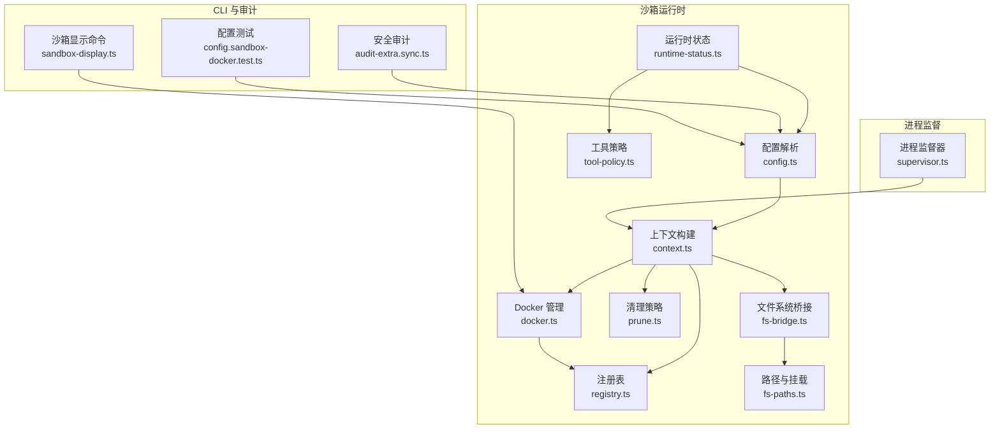
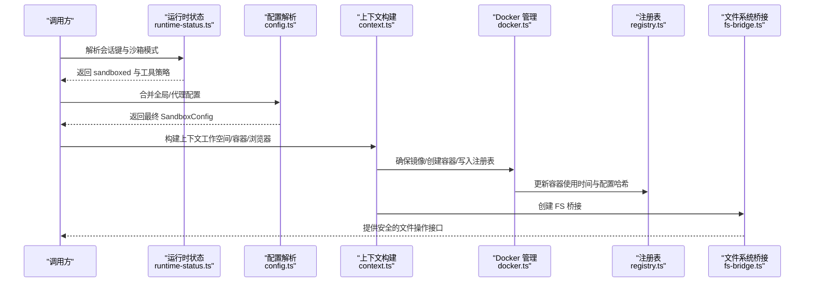
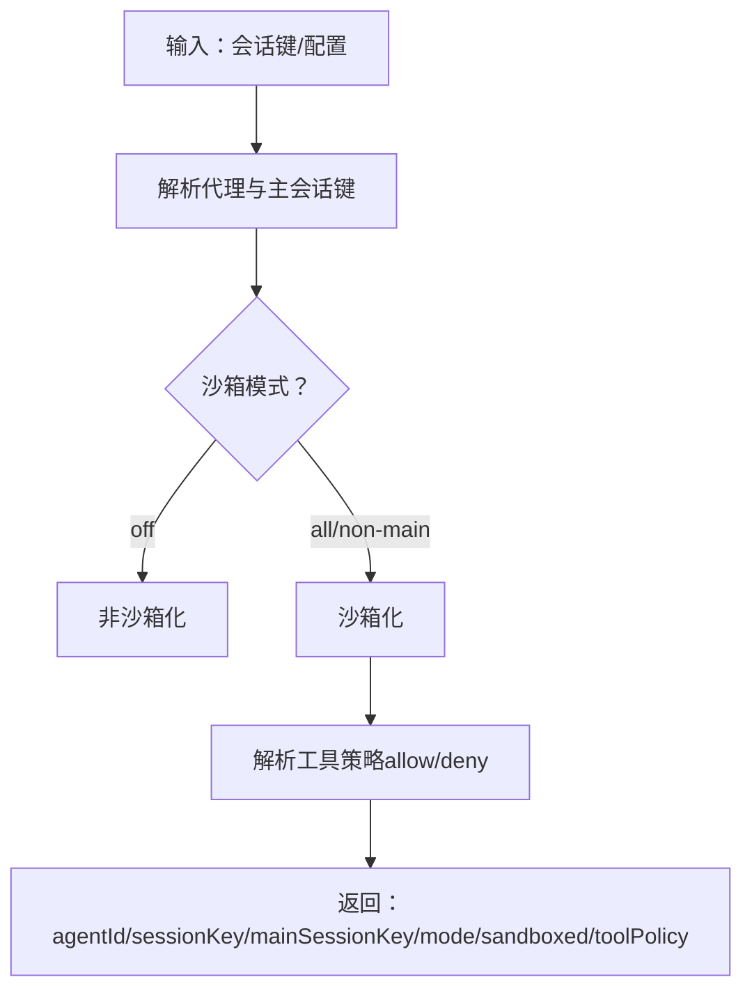
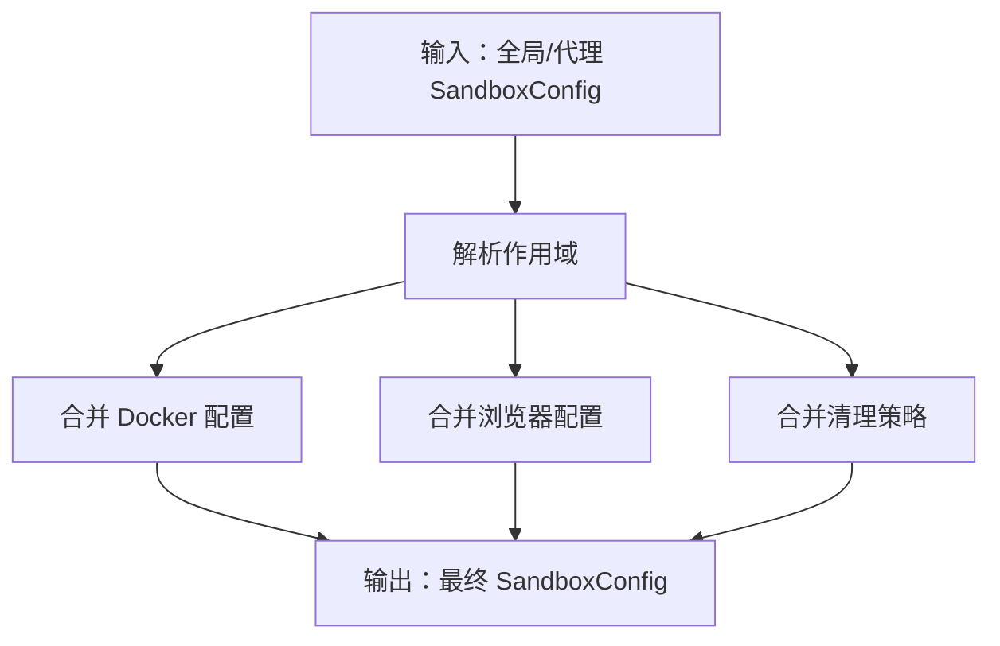
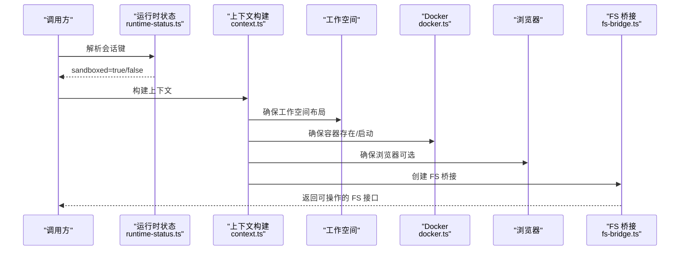
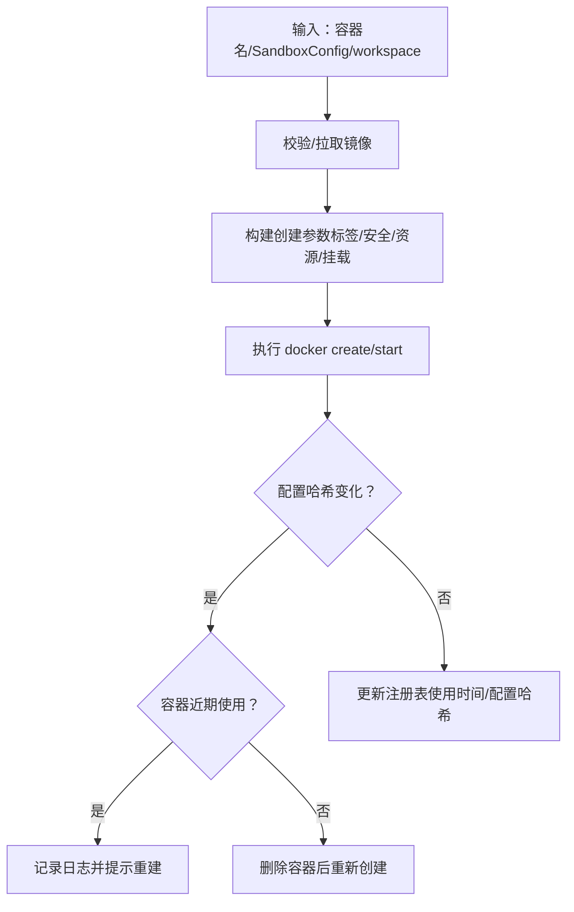
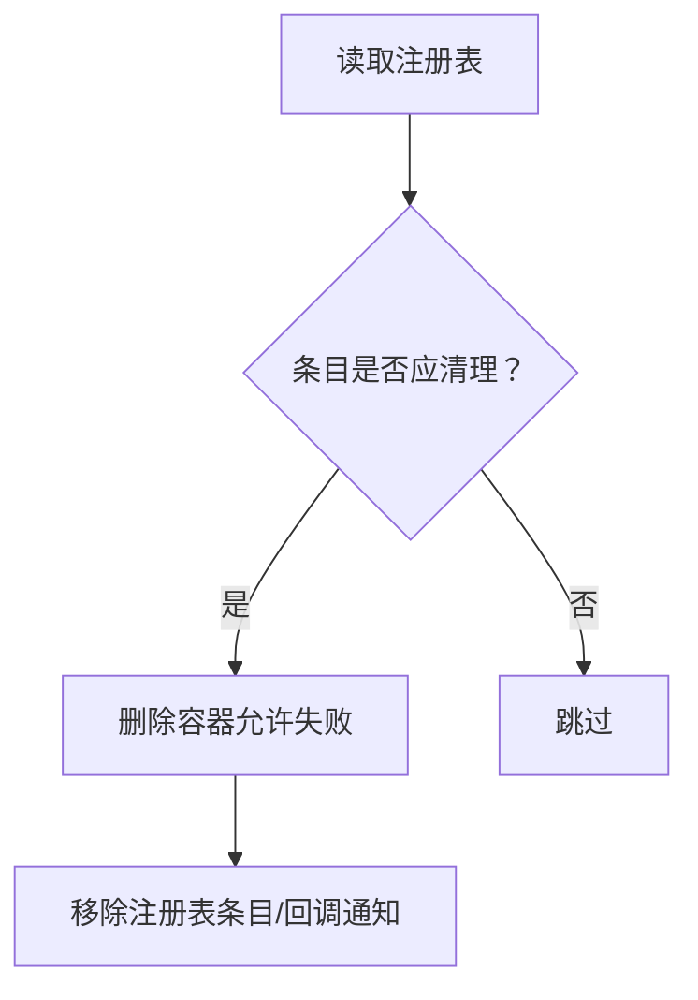
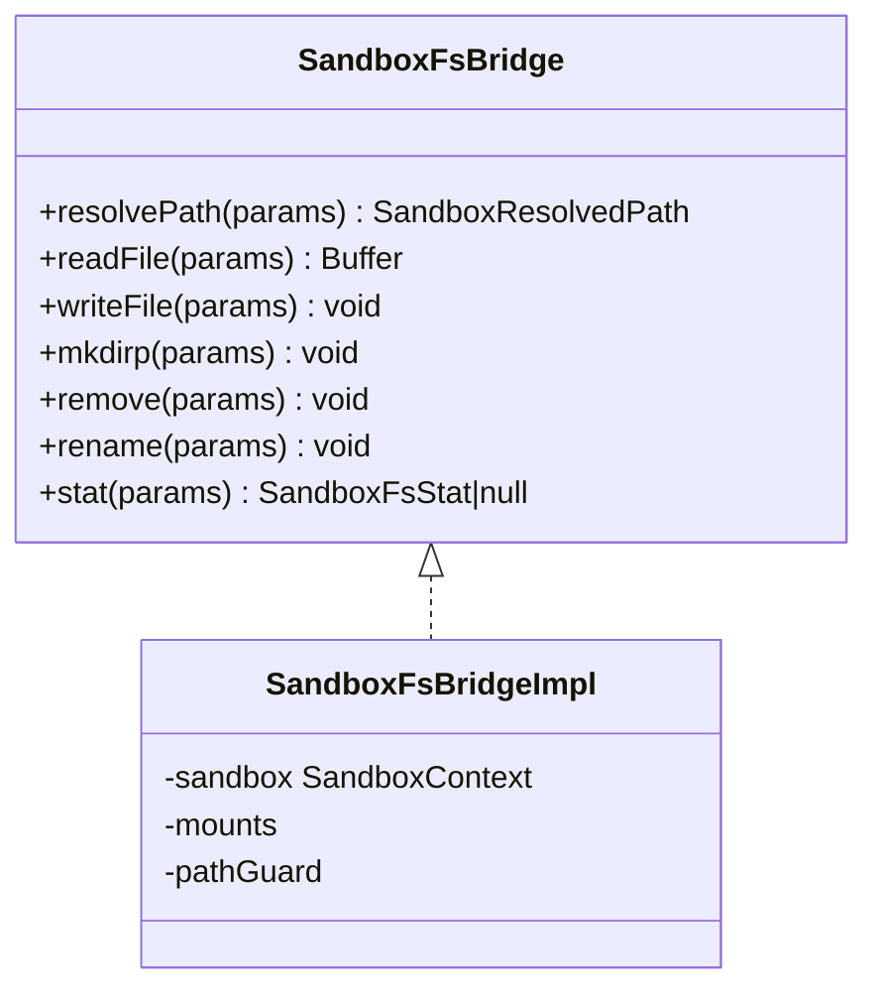
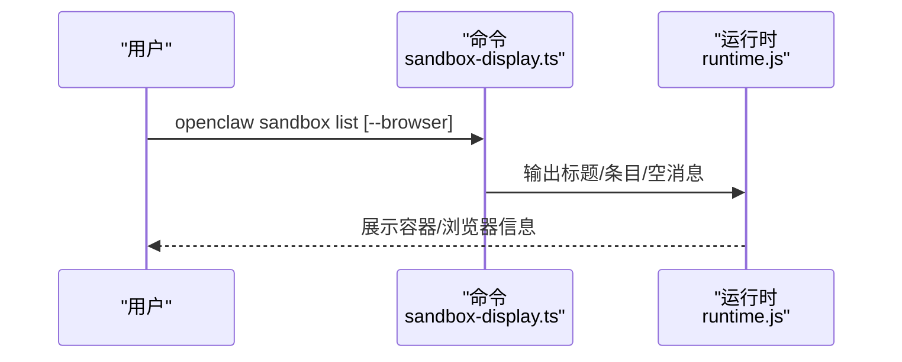
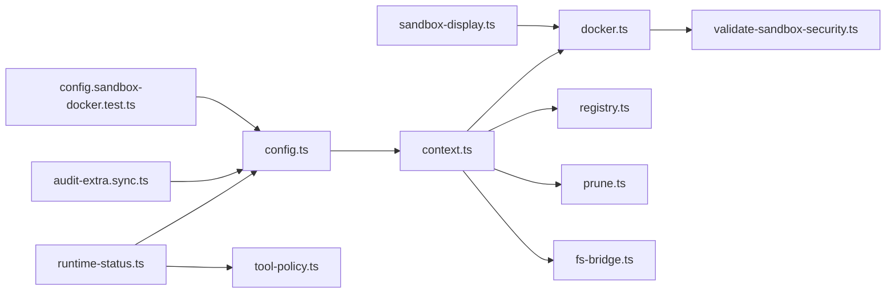

# 沙箱运行时管理

<cite>
**本文引用的文件**
- [src/agents/sandbox/runtime-status.ts](file://src/agents/sandbox/runtime-status.ts)
- [src/agents/sandbox/types.ts](file://src/agents/sandbox/types.ts)
- [src/agents/sandbox/config.ts](file://src/agents/sandbox/config.ts)
- [src/agents/sandbox/context.ts](file://src/agents/sandbox/context.ts)
- [src/agents/sandbox/docker.ts](file://src/agents/sandbox/docker.ts)
- [src/agents/sandbox/registry.ts](file://src/agents/sandbox/registry.ts)
- [src/agents/sandbox/prune.ts](file://src/agents/sandbox/prune.ts)
- [src/agents/sandbox/fs-bridge.ts](file://src/agents/sandbox/fs-bridge.ts)
- [src/agents/sandbox/fs-paths.ts](file://src/agents/sandbox/fs-paths.ts)
- [src/agents/sandbox/tool-policy.ts](file://src/agents/sandbox/tool-policy.ts)
- [src/agents/sandbox/validate-sandbox-security.ts](file://src/agents/sandbox/validate-sandbox-security.ts)
- [src/commands/sandbox-display.ts](file://src/commands/sandbox-display.ts)
- [src/commands/sandbox.test.ts](file://src/commands/sandbox.test.ts)
- [src/config/config.sandbox-docker.test.ts](file://src/config/config.sandbox-docker.test.ts)
- [src/security/audit-extra.sync.ts](file://src/security/audit-extra.sync.ts)
- [src/process/supervisor/supervisor.ts](file://src/process/supervisor/supervisor.ts)
</cite>

## 目录
1. [简介](#简介)
2. [项目结构](#项目结构)
3. [核心组件](#核心组件)
4. [架构总览](#架构总览)
5. [详细组件分析](#详细组件分析)
6. [依赖关系分析](#依赖关系分析)
7. [性能考量](#性能考量)
8. [故障排除指南](#故障排除指南)
9. [结论](#结论)
10. [附录](#附录)

## 简介
本文件面向 OpenClaw 的“沙箱运行时管理系统”，系统性阐述以下主题：
- 沙箱运行状态管理：运行状态监控、健康检查与故障恢复策略
- 沙箱上下文创建与维护：工作空间管理、资源分配与挂载策略
- 沙箱解释器（工具策略）：工具白/黑名单与会话隔离
- 性能监控与资源统计：容器资源限制、临时文件系统与清理策略
- 配置优化与调优：Docker 安全与性能参数、作用域与生命周期
- 日志与诊断：子系统日志、CLI 可视化输出、安全审计
- 与代理系统的交互：会话键解析、代理作用域、运行时状态判定
- 故障排除与调试：常见错误定位、重建提示与回退策略

## 项目结构
围绕沙箱运行时的关键模块分布如下：
- 运行时状态与策略：runtime-status.ts、tool-policy.ts
- 配置解析与合并：config.ts、types.ts
- 上下文构建：context.ts、fs-bridge.ts、fs-paths.ts
- Docker 生命周期与安全：docker.ts、validate-sandbox-security.ts
- 注册表与清理：registry.ts、prune.ts
- CLI 可视化：commands/sandbox-display.ts
- 安全审计与配置校验：security/audit-extra.sync.ts、config.sandbox-docker.test.ts
- 进程监督（与沙箱运行时协同）：process/supervisor/supervisor.ts

**图表来源**
- [src/agents/sandbox/runtime-status.ts:1-139](file://src/agents/sandbox/runtime-status.ts#L1-L139)
- [src/agents/sandbox/config.ts:1-217](file://src/agents/sandbox/config.ts#L1-L217)
- [src/agents/sandbox/context.ts:1-211](file://src/agents/sandbox/context.ts#L1-L211)
- [src/agents/sandbox/docker.ts:1-568](file://src/agents/sandbox/docker.ts#L1-L568)
- [src/agents/sandbox/registry.ts:58-103](file://src/agents/sandbox/registry.ts#L58-L103)
- [src/agents/sandbox/prune.ts:36-70](file://src/agents/sandbox/prune.ts#L36-L70)
- [src/agents/sandbox/fs-bridge.ts:31-71](file://src/agents/sandbox/fs-bridge.ts#L31-L71)
- [src/agents/sandbox/fs-paths.ts:171-219](file://src/agents/sandbox/fs-paths.ts#L171-L219)
- [src/agents/sandbox/tool-policy.ts](file://src/agents/sandbox/tool-policy.ts)
- [src/commands/sandbox-display.ts:1-51](file://src/commands/sandbox-display.ts#L1-L51)
- [src/security/audit-extra.sync.ts:777-845](file://src/security/audit-extra.sync.ts#L777-L845)
- [src/config/config.sandbox-docker.test.ts:80-134](file://src/config/config.sandbox-docker.test.ts#L80-L134)
- [src/process/supervisor/supervisor.ts:256-282](file://src/process/supervisor/supervisor.ts#L256-L282)

**章节来源**
- [src/agents/sandbox/runtime-status.ts:1-139](file://src/agents/sandbox/runtime-status.ts#L1-L139)
- [src/agents/sandbox/types.ts:1-91](file://src/agents/sandbox/types.ts#L1-L91)
- [src/agents/sandbox/config.ts:1-217](file://src/agents/sandbox/config.ts#L1-L217)
- [src/agents/sandbox/context.ts:1-211](file://src/agents/sandbox/context.ts#L1-L211)
- [src/agents/sandbox/docker.ts:1-568](file://src/agents/sandbox/docker.ts#L1-L568)
- [src/agents/sandbox/registry.ts:58-103](file://src/agents/sandbox/registry.ts#L58-L103)
- [src/agents/sandbox/prune.ts:36-70](file://src/agents/sandbox/prune.ts#L36-L70)
- [src/agents/sandbox/fs-bridge.ts:31-71](file://src/agents/sandbox/fs-bridge.ts#L31-L71)
- [src/agents/sandbox/fs-paths.ts:171-219](file://src/agents/sandbox/fs-paths.ts#L171-L219)
- [src/agents/sandbox/tool-policy.ts](file://src/agents/sandbox/tool-policy.ts)
- [src/commands/sandbox-display.ts:1-51](file://src/commands/sandbox-display.ts#L1-L51)
- [src/security/audit-extra.sync.ts:777-845](file://src/security/audit-extra.sync.ts#L777-L845)
- [src/config/config.sandbox-docker.test.ts:80-134](file://src/config/config.sandbox-docker.test.ts#L80-L134)
- [src/process/supervisor/supervisor.ts:256-282](file://src/process/supervisor/supervisor.ts#L256-L282)

## 核心组件
- 运行时状态判定：根据会话键、代理主会话与沙箱模式，计算是否启用沙箱及工具策略
- 配置解析与合并：按作用域（会话/代理/共享）合并全局与代理级配置，生成最终 Docker、浏览器与工具策略
- 上下文构建：确保工作空间布局、容器与浏览器存在、文件系统桥接可用
- Docker 生命周期：镜像校验、容器创建/启动、标签与配置哈希、环境变量净化
- 注册表与清理：记录容器使用时间与配置哈希，按空闲与最大年龄清理
- 文件系统桥接：在宿主与容器之间建立安全可追踪的路径映射与操作接口
- CLI 可视化：容器列表、状态格式化、端口与年龄信息展示
- 安全审计：检测未生效的 Docker 设置、危险配置项并给出修复建议

**章节来源**
- [src/agents/sandbox/runtime-status.ts:45-79](file://src/agents/sandbox/runtime-status.ts#L45-L79)
- [src/agents/sandbox/config.ts:170-216](file://src/agents/sandbox/config.ts#L170-L216)
- [src/agents/sandbox/context.ts:108-186](file://src/agents/sandbox/context.ts#L108-L186)
- [src/agents/sandbox/docker.ts:492-567](file://src/agents/sandbox/docker.ts#L492-L567)
- [src/agents/sandbox/registry.ts:58-103](file://src/agents/sandbox/registry.ts#L58-L103)
- [src/agents/sandbox/prune.ts:36-70](file://src/agents/sandbox/prune.ts#L36-L70)
- [src/agents/sandbox/fs-bridge.ts:31-71](file://src/agents/sandbox/fs-bridge.ts#L31-L71)
- [src/commands/sandbox-display.ts:29-51](file://src/commands/sandbox-display.ts#L29-L51)
- [src/security/audit-extra.sync.ts:777-845](file://src/security/audit-extra.sync.ts#L777-L845)

## 架构总览
沙箱运行时以“配置解析—上下文构建—Docker 生命周期—注册表与清理—文件系统桥接”为主线，结合“运行时状态判定—工具策略—CLI 可视化—安全审计”的辅助能力，形成闭环的运行时管理。

**图表来源**
- [src/agents/sandbox/runtime-status.ts:45-79](file://src/agents/sandbox/runtime-status.ts#L45-L79)
- [src/agents/sandbox/config.ts:170-216](file://src/agents/sandbox/config.ts#L170-L216)
- [src/agents/sandbox/context.ts:108-186](file://src/agents/sandbox/context.ts#L108-L186)
- [src/agents/sandbox/docker.ts:492-567](file://src/agents/sandbox/docker.ts#L492-L567)
- [src/agents/sandbox/registry.ts:58-103](file://src/agents/sandbox/registry.ts#L58-L103)
- [src/agents/sandbox/fs-bridge.ts:64-66](file://src/agents/sandbox/fs-bridge.ts#L64-L66)

## 详细组件分析

### 组件一：运行时状态与工具策略
- 运行时状态判定逻辑基于会话键、主会话键与沙箱模式，决定是否沙箱化以及工具策略来源
- 工具策略支持 allow/deny 分组，支持展开与来源标注，便于诊断“被阻止的工具”原因

**图表来源**
- [src/agents/sandbox/runtime-status.ts:10-79](file://src/agents/sandbox/runtime-status.ts#L10-L79)

**章节来源**
- [src/agents/sandbox/runtime-status.ts:1-139](file://src/agents/sandbox/runtime-status.ts#L1-L139)
- [src/agents/sandbox/tool-policy.ts](file://src/agents/sandbox/tool-policy.ts)

### 组件二：配置解析与合并
- 作用域解析：支持 perSession 与 scope 显式控制（session/agent/shared）
- Docker 配置合并：环境变量覆盖、ulimit 合并、binds 拼接；危险布尔项仅代理可覆盖
- 浏览器配置合并：网络、端口、自动启动等参数合并
- 清理策略：空闲小时数与最大存活天数

**图表来源**
- [src/agents/sandbox/config.ts:63-216](file://src/agents/sandbox/config.ts#L63-L216)

**章节来源**
- [src/agents/sandbox/config.ts:1-217](file://src/agents/sandbox/config.ts#L1-L217)
- [src/config/config.sandbox-docker.test.ts:80-134](file://src/config/config.sandbox-docker.test.ts#L80-L134)

### 组件三：上下文构建与工作空间管理
- 会话解析：判断是否需要沙箱化
- 工作空间布局：根据访问级别选择代理或沙箱工作空间，并同步技能内容
- Docker 用户解析：若未显式指定用户，则尝试从工作空间权限推断 UID/GID
- 容器与浏览器：确保容器存在并启动，必要时注入浏览器桥接认证
- 文件系统桥接：创建安全的路径解析与文件操作接口

**图表来源**
- [src/agents/sandbox/context.ts:108-186](file://src/agents/sandbox/context.ts#L108-L186)
- [src/agents/sandbox/docker.ts:492-567](file://src/agents/sandbox/docker.ts#L492-L567)
- [src/agents/sandbox/fs-bridge.ts:64-66](file://src/agents/sandbox/fs-bridge.ts#L64-L66)

**章节来源**
- [src/agents/sandbox/context.ts:1-211](file://src/agents/sandbox/context.ts#L1-L211)
- [src/agents/sandbox/fs-bridge.ts:31-71](file://src/agents/sandbox/fs-bridge.ts#L31-L71)

### 组件四：Docker 生命周期与安全
- 镜像校验与拉取：默认镜像不存在时自动拉取并重命名
- 容器创建：构建创建参数（标签、只读根文件系统、tmpfs、网络、cap-drop、安全选项、ulimit、binds 等），追加工作目录与挂载，最后启动
- 配置哈希与热容器处理：当配置变更且容器近期使用时，提示重建而非强制删除
- 环境变量净化：阻断敏感变量，记录警告
- 安全校验：禁止危险绑定源、保留目标与容器命名空间加入，默认拒绝

**图表来源**
- [src/agents/sandbox/docker.ts:258-269](file://src/agents/sandbox/docker.ts#L258-L269)
- [src/agents/sandbox/docker.ts:317-427](file://src/agents/sandbox/docker.ts#L317-L427)
- [src/agents/sandbox/docker.ts:492-567](file://src/agents/sandbox/docker.ts#L492-L567)
- [src/agents/sandbox/validate-sandbox-security.ts](file://src/agents/sandbox/validate-sandbox-security.ts)

**章节来源**
- [src/agents/sandbox/docker.ts:1-568](file://src/agents/sandbox/docker.ts#L1-L568)
- [src/agents/sandbox/validate-sandbox-security.ts](file://src/agents/sandbox/validate-sandbox-security.ts)

### 组件五：注册表与清理策略
- 注册表读写：JSON 文件锁保护，容错回退与错误分类
- 清理策略：按空闲小时数与最大存活天数扫描并删除容器，同时移除注册表条目

**图表来源**
- [src/agents/sandbox/registry.ts:58-103](file://src/agents/sandbox/registry.ts#L58-L103)
- [src/agents/sandbox/prune.ts:36-70](file://src/agents/sandbox/prune.ts#L36-L70)

**章节来源**
- [src/agents/sandbox/registry.ts:58-103](file://src/agents/sandbox/registry.ts#L58-L103)
- [src/agents/sandbox/prune.ts:36-70](file://src/agents/sandbox/prune.ts#L36-L70)

### 组件六：文件系统桥接与路径管理
- 路径解析：将容器内路径映射到宿主，避免越权访问
- 去重与优先级：对挂载进行去重与优先级排序，保证精确覆盖
- FS 操作：提供安全的读写、创建目录、重命名、删除与统计

**图表来源**
- [src/agents/sandbox/fs-bridge.ts:31-71](file://src/agents/sandbox/fs-bridge.ts#L31-L71)
- [src/agents/sandbox/fs-bridge.ts:64-66](file://src/agents/sandbox/fs-bridge.ts#L64-L66)

**章节来源**
- [src/agents/sandbox/fs-bridge.ts:31-71](file://src/agents/sandbox/fs-bridge.ts#L31-L71)
- [src/agents/sandbox/fs-paths.ts:171-219](file://src/agents/sandbox/fs-paths.ts#L171-L219)

### 组件七：CLI 可视化与诊断
- 列出容器：显示状态、镜像匹配、年龄与空闲时间、会话键
- 单元测试验证：确认人类可读输出与标志位行为

**图表来源**
- [src/commands/sandbox-display.ts:17-51](file://src/commands/sandbox-display.ts#L17-L51)
- [src/commands/sandbox.test.ts:90-122](file://src/commands/sandbox.test.ts#L90-L122)

**章节来源**
- [src/commands/sandbox-display.ts:1-51](file://src/commands/sandbox-display.ts#L1-L51)
- [src/commands/sandbox.test.ts:90-122](file://src/commands/sandbox.test.ts#L90-L122)

### 组件八：安全审计与配置校验
- 未生效 Docker 设置审计：当沙箱模式为 off 但配置了 docker 设置时给出告警
- 危险配置检测：容器命名空间加入、外部绑定源、保留目标等需显式危险开关
- 配置测试覆盖：验证合并与拒绝场景

**章节来源**
- [src/security/audit-extra.sync.ts:777-845](file://src/security/audit-extra.sync.ts#L777-L845)
- [src/config/config.sandbox-docker.test.ts:80-134](file://src/config/config.sandbox-docker.test.ts#L80-L134)
- [src/config/config.sandbox-docker.test.ts:279-335](file://src/config/config.sandbox-docker.test.ts#L279-L335)

### 组件九：与代理系统的交互
- 会话键解析：支持别名规范化与主会话键解析
- 代理作用域：根据会话键确定所属代理，用于工具策略与作用域决策
- 进程监督：与沙箱上下文协同，确保运行时一致性

**章节来源**
- [src/agents/sandbox/runtime-status.ts:20-43](file://src/agents/sandbox/runtime-status.ts#L20-L43)
- [src/process/supervisor/supervisor.ts:256-282](file://src/process/supervisor/supervisor.ts#L256-L282)

## 依赖关系分析
- 运行时状态依赖配置解析与工具策略
- 上下文构建依赖运行时状态、配置解析、Docker 管理、注册表与清理、文件系统桥接
- Docker 管理依赖安全校验、注册表与工作空间挂载
- CLI 与安全审计独立于核心流程，提供可观测性与合规性

**图表来源**
- [src/agents/sandbox/runtime-status.ts:1-139](file://src/agents/sandbox/runtime-status.ts#L1-L139)
- [src/agents/sandbox/config.ts:1-217](file://src/agents/sandbox/config.ts#L1-L217)
- [src/agents/sandbox/context.ts:1-211](file://src/agents/sandbox/context.ts#L1-L211)
- [src/agents/sandbox/docker.ts:1-568](file://src/agents/sandbox/docker.ts#L1-L568)
- [src/agents/sandbox/registry.ts:58-103](file://src/agents/sandbox/registry.ts#L58-L103)
- [src/agents/sandbox/prune.ts:36-70](file://src/agents/sandbox/prune.ts#L36-L70)
- [src/agents/sandbox/fs-bridge.ts:31-71](file://src/agents/sandbox/fs-bridge.ts#L31-L71)
- [src/agents/sandbox/validate-sandbox-security.ts](file://src/agents/sandbox/validate-sandbox-security.ts)
- [src/commands/sandbox-display.ts:1-51](file://src/commands/sandbox-display.ts#L1-L51)
- [src/security/audit-extra.sync.ts:777-845](file://src/security/audit-extra.sync.ts#L777-L845)
- [src/config/config.sandbox-docker.test.ts:80-134](file://src/config/config.sandbox-docker.test.ts#L80-L134)

**章节来源**
- [src/agents/sandbox/runtime-status.ts:1-139](file://src/agents/sandbox/runtime-status.ts#L1-L139)
- [src/agents/sandbox/config.ts:1-217](file://src/agents/sandbox/config.ts#L1-L217)
- [src/agents/sandbox/context.ts:1-211](file://src/agents/sandbox/context.ts#L1-L211)
- [src/agents/sandbox/docker.ts:1-568](file://src/agents/sandbox/docker.ts#L1-L568)
- [src/agents/sandbox/registry.ts:58-103](file://src/agents/sandbox/registry.ts#L58-L103)
- [src/agents/sandbox/prune.ts:36-70](file://src/agents/sandbox/prune.ts#L36-L70)
- [src/agents/sandbox/fs-bridge.ts:31-71](file://src/agents/sandbox/fs-bridge.ts#L31-L71)
- [src/agents/sandbox/validate-sandbox-security.ts](file://src/agents/sandbox/validate-sandbox-security.ts)
- [src/commands/sandbox-display.ts:1-51](file://src/commands/sandbox-display.ts#L1-L51)
- [src/security/audit-extra.sync.ts:777-845](file://src/security/audit-extra.sync.ts#L777-L845)
- [src/config/config.sandbox-docker.test.ts:80-134](file://src/config/config.sandbox-docker.test.ts#L80-L134)

## 性能考量
- 资源限制：通过 Docker ulimit、pids-limit、memory/memory-swap、cpus 控制容器资源占用
- 临时文件系统：tmpfs 挂载常用运行时目录，减少磁盘 IO
- 只读根文件系统：降低容器内持久化风险，提升隔离性
- 热容器窗口：对近期使用的容器在配置变更时采用“重建提示”而非直接删除，减少中断
- 清理策略：按空闲与最大年龄清理，释放资源并保持运行效率

**章节来源**
- [src/agents/sandbox/docker.ts:317-427](file://src/agents/sandbox/docker.ts#L317-L427)
- [src/agents/sandbox/docker.ts:530-543](file://src/agents/sandbox/docker.ts#L530-L543)
- [src/agents/sandbox/prune.ts:36-70](file://src/agents/sandbox/prune.ts#L36-L70)

## 故障排除指南
- Docker 命令不可用：当 PATH 中缺少 docker 时，会抛出明确错误并提示禁用沙箱或安装 Docker
- 镜像缺失：默认镜像不存在时自动拉取 debian:bookworm-slim 并打标签为默认镜像
- 容器配置变更：若容器最近使用且配置哈希不一致，记录日志并提示使用重建命令
- 安全配置拒绝：危险绑定源、保留目标与容器命名空间加入默认拒绝，需显式危险开关
- 工具策略被阻止：通过格式化消息指出 deny/allow 触发原因与修复建议
- CLI 可视化：容器/浏览器列表输出包含状态、镜像匹配、年龄与空闲时间，便于快速定位问题

**章节来源**
- [src/agents/sandbox/docker.ts:115-125](file://src/agents/sandbox/docker.ts#L115-L125)
- [src/agents/sandbox/docker.ts:258-269](file://src/agents/sandbox/docker.ts#L258-L269)
- [src/agents/sandbox/docker.ts:530-543](file://src/agents/sandbox/docker.ts#L530-L543)
- [src/agents/sandbox/validate-sandbox-security.ts](file://src/agents/sandbox/validate-sandbox-security.ts)
- [src/agents/sandbox/runtime-status.ts:81-138](file://src/agents/sandbox/runtime-status.ts#L81-L138)
- [src/commands/sandbox-display.ts:29-51](file://src/commands/sandbox-display.ts#L29-L51)

## 结论
OpenClaw 的沙箱运行时管理以“配置即代码”的方式实现了强隔离与高可控性：通过严格的运行时状态判定、可追溯的配置合并、安全的 Docker 生命周期与注册表清理、以及完善的 CLI 可视化与安全审计，系统在保障安全性的同时提供了良好的可观测性与可维护性。建议在生产环境中启用合理的资源限制与清理策略，并遵循安全审计建议关闭危险配置。

## 附录
- 关键类型定义：SandboxConfig、SandboxContext、SandboxToolPolicy、SandboxPruneConfig 等
- 常用命令：沙箱列表、解释工具策略、重建容器等

**章节来源**
- [src/agents/sandbox/types.ts:55-91](file://src/agents/sandbox/types.ts#L55-L91)
- [src/commands/sandbox-display.ts:1-51](file://src/commands/sandbox-display.ts#L1-L51)