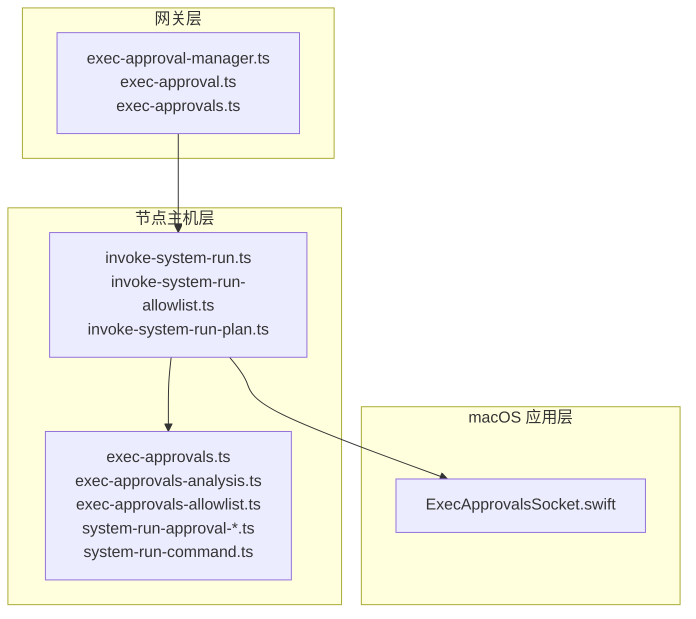
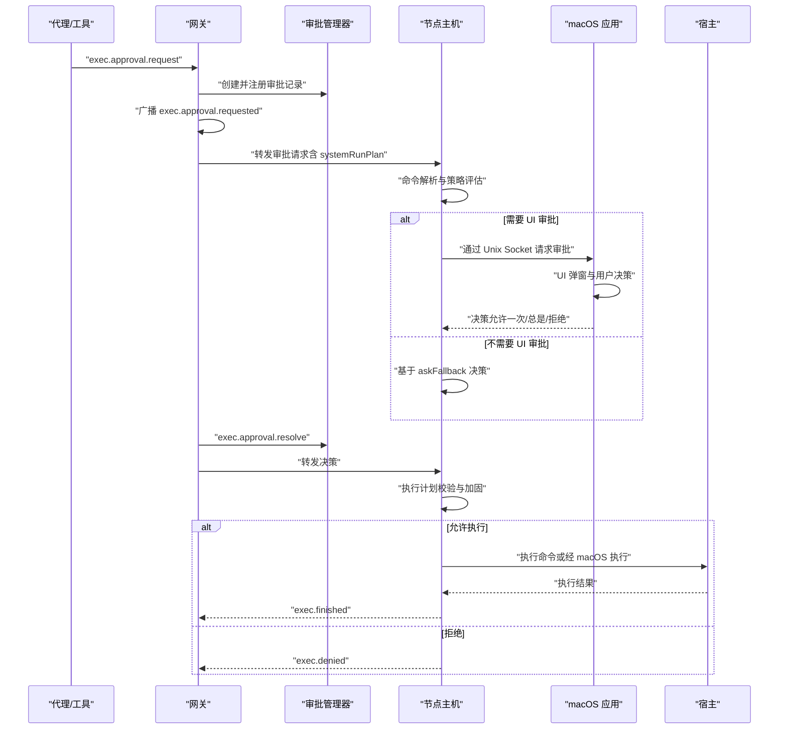
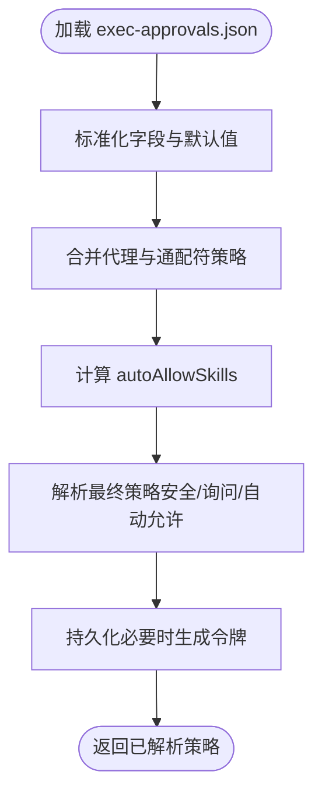
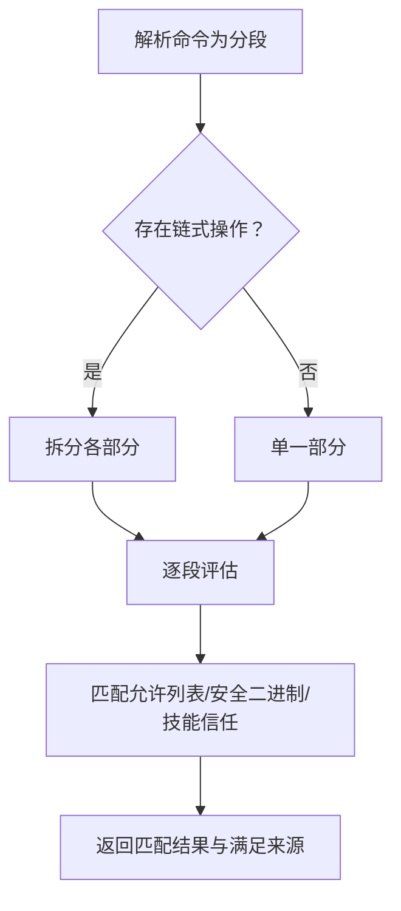
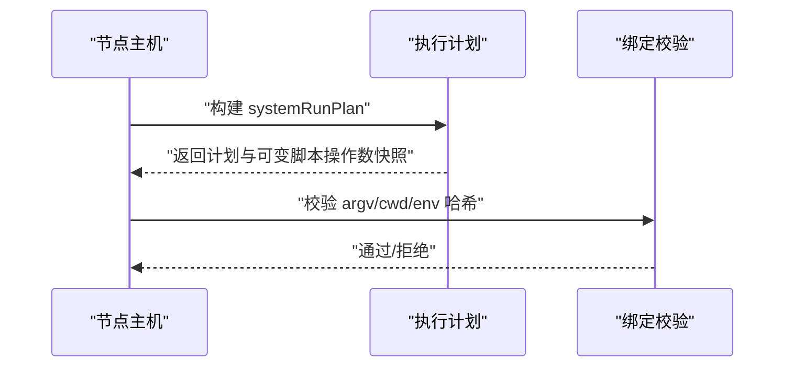
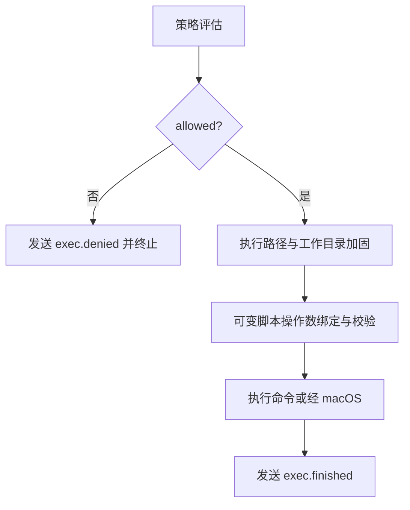
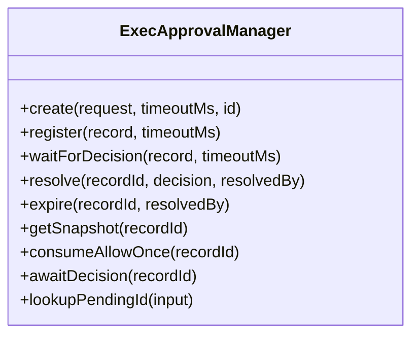
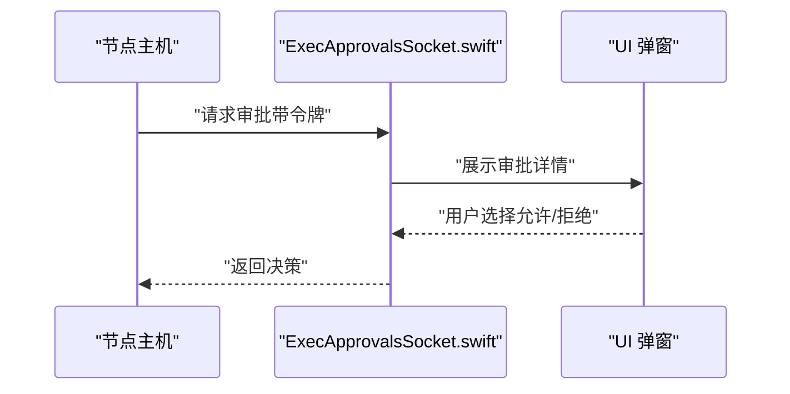
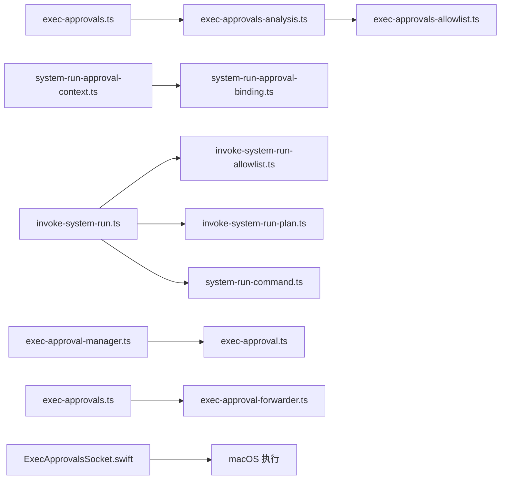

# 系统调用审批

<cite>
**本文档引用的文件**
- [exec-approvals.md](file://docs/tools/exec-approvals.md)
- [exec-approvals.ts](file://src/infra/exec-approvals.ts)
- [exec-approvals-analysis.ts](file://src/infra/exec-approvals-analysis.ts)
- [exec-approvals-allowlist.ts](file://src/infra/exec-approvals-allowlist.ts)
- [system-run-approval-binding.ts](file://src/infra/system-run-approval-binding.ts)
- [system-run-approval-context.ts](file://src/infra/system-run-approval-context.ts)
- [system-run-command.ts](file://src/infra/system-run-command.ts)
- [invoke-system-run.ts](file://src/node-host/invoke-system-run.ts)
- [invoke-system-run-allowlist.ts](file://src/node-host/invoke-system-run-allowlist.ts)
- [invoke-system-run-plan.ts](file://src/node-host/invoke-system-run-plan.ts)
- [exec-approval-manager.ts](file://src/gateway/exec-approval-manager.ts)
- [exec-approval.ts](file://src/gateway/server-methods/exec-approval.ts)
- [exec-approvals.ts](file://src/gateway/server-methods/exec-approvals.ts)
- [exec-approval-forwarder.ts](file://src/infra/exec-approval-forwarder.ts)
- [ExecApprovalsSocket.swift](file://apps/macos/Sources/OpenClaw/ExecApprovalsSocket.swift)
</cite>

## 目录
1. [简介](#简介)
2. [项目结构](#项目结构)
3. [核心组件](#核心组件)
4. [架构总览](#架构总览)
5. [详细组件分析](#详细组件分析)
6. [依赖关系分析](#依赖关系分析)
7. [性能考虑](#性能考虑)
8. [故障排除指南](#故障排除指南)
9. [结论](#结论)
10. [附录](#附录)

## 简介
本文件系统性阐述 OpenClaw 的系统调用审批机制，覆盖从命令解析、策略评估、权限验证到执行控制的完整链路。重点包括：
- 审批流程：请求生成、广播、决策、转发与执行
- 权限验证：安全模式（deny/allowlist/full）、询问策略（off/on-miss/always）、自动允许技能 CLIs
- 执行控制：可执行路径加固、工作目录规范化、可变脚本操作数绑定、环境变量约束
- 沙箱隔离：与容器沙箱的边界关系与协同
- 调试与监控：事件流、错误码、日志与 UI 提示

## 项目结构
OpenClaw 将系统调用审批分为三层：
- 网关层（Gateway）：审批请求的接收、广播、决策管理与节点配置同步
- 节点主机层（Node Host）：命令解析、策略评估、执行计划构建与执行
- macOS 应用层（Companion App）：本地审批弹窗、Unix Socket 交互与执行

**图表来源**
- [exec-approval-manager.ts:1-212](file://src/gateway/exec-approval-manager.ts#L1-212)
- [exec-approval.ts:1-341](file://src/gateway/server-methods/exec-approval.ts#L1-L341)
- [exec-approvals.ts:1-194](file://src/gateway/server-methods/exec-approvals.ts#L1-L194)
- [invoke-system-run.ts:1-565](file://src/node-host/invoke-system-run.ts#L1-L565)
- [invoke-system-run-allowlist.ts:1-143](file://src/node-host/invoke-system-run-allowlist.ts#L1-L143)
- [invoke-system-run-plan.ts:1-780](file://src/node-host/invoke-system-run-plan.ts#L1-L780)
- [exec-approvals.ts:1-590](file://src/infra/exec-approvals.ts#L1-L590)
- [exec-approvals-analysis.ts:1-819](file://src/infra/exec-approvals-analysis.ts#L1-L819)
- [exec-approvals-allowlist.ts:1-610](file://src/infra/exec-approvals-allowlist.ts#L1-L610)
- [system-run-approval-binding.ts:1-240](file://src/infra/system-run-approval-binding.ts#L1-L240)
- [system-run-approval-context.ts:1-153](file://src/infra/system-run-approval-context.ts#L1-L153)
- [system-run-command.ts:1-257](file://src/infra/system-run-command.ts#L1-L257)
- [ExecApprovalsSocket.swift:1-891](file://apps/macos/Sources/OpenClaw/ExecApprovalsSocket.swift#L1-L891)

**章节来源**
- [exec-approvals.md:1-398](file://docs/tools/exec-approvals.md#L1-L398)

## 核心组件
- 审批文件与默认值：负责存储审批策略、默认值、代理级覆盖与允许列表
- 命令分析与允许列表：解析 shell 命令、识别分段、匹配允许列表、判定安全二进制与技能自动信任
- 执行计划与绑定：构建审批绑定、校验环境变量哈希、重定执行上下文
- 策略评估：综合安全模式、询问策略、分析结果与允许列表状态，决定是否放行
- 执行路径加固：规范化工作目录、固定可执行路径、绑定可变脚本操作数
- 网关审批管理：审批记录生命周期、等待决策、超时与幂等注册
- macOS 审批通道：Unix Socket、令牌校验、挑战响应、UI 弹窗与执行

**章节来源**
- [exec-approvals.ts:1-590](file://src/infra/exec-approvals.ts#L1-L590)
- [exec-approvals-analysis.ts:1-819](file://src/infra/exec-approvals-analysis.ts#L1-L819)
- [exec-approvals-allowlist.ts:1-610](file://src/infra/exec-approvals-allowlist.ts#L1-L610)
- [system-run-approval-binding.ts:1-240](file://src/infra/system-run-approval-binding.ts#L1-L240)
- [system-run-approval-context.ts:1-153](file://src/infra/system-run-approval-context.ts#L1-L153)
- [system-run-command.ts:1-257](file://src/infra/system-run-command.ts#L1-L257)
- [invoke-system-run.ts:1-565](file://src/node-host/invoke-system-run.ts#L1-L565)
- [invoke-system-run-allowlist.ts:1-143](file://src/node-host/invoke-system-run-allowlist.ts#L1-L143)
- [invoke-system-run-plan.ts:1-780](file://src/node-host/invoke-system-run-plan.ts#L1-L780)
- [exec-approval-manager.ts:1-212](file://src/gateway/exec-approval-manager.ts#L1-L212)
- [ExecApprovalsSocket.swift:1-891](file://apps/macos/Sources/OpenClaw/ExecApprovalsSocket.swift#L1-L891)

## 架构总览
系统调用审批的整体流程如下：

**图表来源**
- [exec-approval.ts:1-341](file://src/gateway/server-methods/exec-approval.ts#L1-L341)
- [exec-approvals.ts:1-194](file://src/gateway/server-methods/exec-approvals.ts#L1-L194)
- [exec-approval-manager.ts:1-212](file://src/gateway/exec-approval-manager.ts#L1-L212)
- [invoke-system-run.ts:1-565](file://src/node-host/invoke-system-run.ts#L1-L565)
- [ExecApprovalsSocket.swift:1-891](file://apps/macos/Sources/OpenClaw/ExecApprovalsSocket.swift#L1-L891)

## 详细组件分析

### 组件A：审批文件与策略解析
- 文件结构：支持版本化 JSON，包含 socket 路径与令牌、默认策略、按代理覆盖与允许列表
- 默认值合并：支持通配符代理（*），优先级为代理 > 通配符 > 默认
- 自动允许技能：当启用时，已知技能的可执行文件被视为允许
- 安全模式与询问策略：deny（全部拒绝）、allowlist（仅允许列表）、full（全部允许）
- ask 策略：off（不提示）、on-miss（未命中允许列表时提示）、always（每次提示）

**图表来源**
- [exec-approvals.ts:412-482](file://src/infra/exec-approvals.ts#L412-L482)
- [exec-approvals.ts:375-389](file://src/infra/exec-approvals.ts#L375-L389)

**章节来源**
- [exec-approvals.ts:1-590](file://src/infra/exec-approvals.ts#L1-L590)
- [exec-approvals.md:48-141](file://docs/tools/exec-approvals.md#L48-L141)

### 组件B：命令分析与允许列表匹配
- 命令解析：支持 POSIX shell 管道与链式操作（&&、||、;），Windows 使用 PowerShell 规则
- 分段与链式：将命令拆分为段，分别进行解析与匹配
- 允许列表匹配：支持可执行路径、内联脚本与安全二进制（stdin-only）
- 技能自动信任：根据技能可执行文件的解析路径进行白名单匹配
- 安全二进制：严格限制参数与输出方向，避免文件读取与路径扩展

**图表来源**
- [exec-approvals-analysis.ts:756-797](file://src/infra/exec-approvals-analysis.ts#L756-L797)
- [exec-approvals-allowlist.ts:281-310](file://src/infra/exec-approvals-allowlist.ts#L281-L310)

**章节来源**
- [exec-approvals-analysis.ts:1-819](file://src/infra/exec-approvals-analysis.ts#L1-L819)
- [exec-approvals-allowlist.ts:1-610](file://src/infra/exec-approvals-allowlist.ts#L1-L610)

### 组件C：执行计划与绑定校验
- 执行计划：构建包含 argv、cwd、命令文本、可选预览、会话键、可变脚本操作数快照
- 环境变量绑定：对 env 进行规范化与哈希，确保审批时的环境一致性
- 上下文绑定：在 host=node 场景下，使用 systemRunPlan 作为权威执行上下文
- 绑定校验：比较 argv、cwd、agentId、sessionKey 与 env 哈希，不一致即拒绝

**图表来源**
- [system-run-approval-binding.ts:106-124](file://src/infra/system-run-approval-binding.ts#L106-L124)
- [system-run-approval-binding.ts:191-213](file://src/infra/system-run-approval-binding.ts#L191-L213)
- [system-run-approval-context.ts:84-114](file://src/infra/system-run-approval-context.ts#L84-L114)

**章节来源**
- [system-run-approval-binding.ts:1-240](file://src/infra/system-run-approval-binding.ts#L1-L240)
- [system-run-approval-context.ts:1-153](file://src/infra/system-run-approval-context.ts#L1-L153)

### 组件D：策略评估与执行控制
- 策略评估：综合安全模式、询问策略、分析结果与允许列表状态，决定是否放行
- 可执行路径加固：在被 UI 审批后，固定可执行路径，避免 wrapper 语义被破坏
- 工作目录加固：规范化并校验工作目录的符号链接与身份一致性
- 可变脚本操作数：对解释器类运行时绑定单一本地脚本文件，防止内容漂移
- 环境变量与屏幕录制：严格限制 env 覆盖范围；若需要屏幕录制权限，必须显式授权

**图表来源**
- [invoke-system-run.ts:252-374](file://src/node-host/invoke-system-run.ts#L252-L374)
- [invoke-system-run-plan.ts:635-726](file://src/node-host/invoke-system-run-plan.ts#L635-L726)
- [invoke-system-run-plan.ts:487-540](file://src/node-host/invoke-system-run-plan.ts#L487-L540)

**章节来源**
- [invoke-system-run.ts:1-565](file://src/node-host/invoke-system-run.ts#L1-L565)
- [invoke-system-run-plan.ts:1-780](file://src/node-host/invoke-system-run-plan.ts#L1-L780)

### 组件E：网关审批管理与转发
- 审批记录：创建、注册、等待决策、超时与幂等处理
- 决策广播：向所有审批客户端广播请求，并在有决策时广播 resolved
- 节点配置同步：支持网关与节点侧 exec-approvals.json 的读取与设置
- 外部转发：将审批请求转发至聊天渠道（如 Discord/Telegram），支持按钮式回复

**图表来源**
- [exec-approval-manager.ts:1-212](file://src/gateway/exec-approval-manager.ts#L1-L212)

**章节来源**
- [exec-approval-manager.ts:1-212](file://src/gateway/exec-approval-manager.ts#L1-L212)
- [exec-approval.ts:1-341](file://src/gateway/server-methods/exec-approval.ts#L1-L341)
- [exec-approvals.ts:1-194](file://src/gateway/server-methods/exec-approvals.ts#L1-L194)
- [exec-approval-forwarder.ts:1-574](file://src/infra/exec-approval-forwarder.ts#L1-L574)

### 组件F：macOS 审批通道与执行
- Unix Socket：本地 IPC，0600 权限，同 UID 校验，令牌存储于 exec-approvals.json
- 挑战响应：nonce + HMAC + 请求哈希 + TTL，防止重放
- UI 弹窗：展示命令、工作目录、代理、可执行路径与主机信息
- 执行：根据决策执行命令，支持屏幕录制权限检查

**图表来源**
- [ExecApprovalsSocket.swift:100-184](file://apps/macos/Sources/OpenClaw/ExecApprovalsSocket.swift#L100-L184)
- [ExecApprovalsSocket.swift:647-775](file://apps/macos/Sources/OpenClaw/ExecApprovalsSocket.swift#L647-L775)

**章节来源**
- [ExecApprovalsSocket.swift:1-891](file://apps/macos/Sources/OpenClaw/ExecApprovalsSocket.swift#L1-L891)

## 依赖关系分析

**图表来源**
- [exec-approvals.ts:1-590](file://src/infra/exec-approvals.ts#L1-L590)
- [exec-approvals-analysis.ts:1-819](file://src/infra/exec-approvals-analysis.ts#L1-L819)
- [exec-approvals-allowlist.ts:1-610](file://src/infra/exec-approvals-allowlist.ts#L1-L610)
- [system-run-approval-context.ts:1-153](file://src/infra/system-run-approval-context.ts#L1-L153)
- [system-run-approval-binding.ts:1-240](file://src/infra/system-run-approval-binding.ts#L1-L240)
- [invoke-system-run.ts:1-565](file://src/node-host/invoke-system-run.ts#L1-L565)
- [invoke-system-run-allowlist.ts:1-143](file://src/node-host/invoke-system-run-allowlist.ts#L1-L143)
- [invoke-system-run-plan.ts:1-780](file://src/node-host/invoke-system-run-plan.ts#L1-L780)
- [system-run-command.ts:1-257](file://src/infra/system-run-command.ts#L1-L257)
- [exec-approval-manager.ts:1-212](file://src/gateway/exec-approval-manager.ts#L1-L212)
- [exec-approval.ts:1-341](file://src/gateway/server-methods/exec-approval.ts#L1-L341)
- [exec-approvals.ts:1-194](file://src/gateway/server-methods/exec-approvals.ts#L1-L194)
- [exec-approval-forwarder.ts:1-574](file://src/infra/exec-approval-forwarder.ts#L1-L574)
- [ExecApprovalsSocket.swift:1-891](file://apps/macos/Sources/OpenClaw/ExecApprovalsSocket.swift#L1-L891)

**章节来源**
- [exec-approvals.ts:1-590](file://src/infra/exec-approvals.ts#L1-L590)
- [exec-approvals-analysis.ts:1-819](file://src/infra/exec-approvals-analysis.ts#L1-L819)
- [exec-approvals-allowlist.ts:1-610](file://src/infra/exec-approvals-allowlist.ts#L1-L610)
- [system-run-approval-binding.ts:1-240](file://src/infra/system-run-approval-binding.ts#L1-L240)
- [system-run-approval-context.ts:1-153](file://src/infra/system-run-approval-context.ts#L1-L153)
- [system-run-command.ts:1-257](file://src/infra/system-run-command.ts#L1-L257)
- [invoke-system-run.ts:1-565](file://src/node-host/invoke-system-run.ts#L1-L565)
- [invoke-system-run-allowlist.ts:1-143](file://src/node-host/invoke-system-run-allowlist.ts#L1-L143)
- [invoke-system-run-plan.ts:1-780](file://src/node-host/invoke-system-run-plan.ts#L1-L780)
- [exec-approval-manager.ts:1-212](file://src/gateway/exec-approval-manager.ts#L1-L212)
- [exec-approval.ts:1-341](file://src/gateway/server-methods/exec-approval.ts#L1-L341)
- [exec-approvals.ts:1-194](file://src/gateway/server-methods/exec-approvals.ts#L1-L194)
- [exec-approval-forwarder.ts:1-574](file://src/infra/exec-approval-forwarder.ts#L1-L574)
- [ExecApprovalsSocket.swift:1-891](file://apps/macos/Sources/OpenClaw/ExecApprovalsSocket.swift#L1-L891)

## 性能考虑
- 命令解析保守策略：避免行续写与复杂 shell 语法，减少解析成本与不确定性
- 允许列表匹配：按分段并行评估，遇到不满足立即短路
- 执行计划缓存：审批通过后复用 argv/cwd 快照，避免重复解析
- 并发控制：审批管理器使用 Map 存储待决记录，超时与幂等注册避免重复处理
- 输出截断：对长输出进行截断并追加提示，降低消息体积

[本节为通用指导，无需特定文件引用]

## 故障排除指南
常见错误与处理：
- 审批超时：检查审批客户端可用性与网络；确认 askFallback 设置
- 允许列表不匹配：核对模式与策略；检查安全二进制配置与可信目录
- 执行计划不匹配：确认 argv/cwd/env 是否与审批绑定一致
- macOS 审批不可用：检查 socket 权限、令牌与 UI 可见性
- 屏幕录制权限缺失：在 macOS 中授予相应权限

**章节来源**
- [invoke-system-run.ts:156-183](file://src/node-host/invoke-system-run.ts#L156-L183)
- [exec-approvals.ts:559-589](file://src/infra/exec-approvals.ts#L559-L589)
- [ExecApprovalsSocket.swift:720-775](file://apps/macos/Sources/OpenClaw/ExecApprovalsSocket.swift#L720-L775)

## 结论
OpenClaw 的系统调用审批机制通过“策略 + 允许列表 + 用户审批”的三重保障，结合执行计划加固与沙箱隔离，实现了高安全性与可用性的平衡。其模块化设计便于扩展与维护，同时提供了完善的调试与监控能力。

[本节为总结，无需特定文件引用]

## 附录

### 审批匹配规则与权限判断逻辑
- 安全模式与询问策略组合决定是否需要审批
- 允许列表匹配优先于安全二进制与技能自动信任
- 审批决策影响后续执行路径与允许列表持久化

**章节来源**
- [exec-approvals.ts:484-496](file://src/infra/exec-approvals.ts#L484-L496)
- [exec-approvals-allowlist.ts:198-310](file://src/infra/exec-approvals-allowlist.ts#L198-L310)

### 系统调用拦截、分析与放行机制
- 拦截入口：system.run 请求
- 分析阶段：命令解析、分段、匹配与策略评估
- 放行条件：策略允许 + 许可证匹配 + 绑定校验通过

**章节来源**
- [invoke-system-run.ts:188-374](file://src/node-host/invoke-system-run.ts#L188-L374)
- [system-run-command.ts:130-164](file://src/infra/system-run-command.ts#L130-L164)

### 审批错误处理与异常情况
- 错误分类：安全模式拒绝、审批必需、允许列表不匹配、执行计划不匹配、伴侧行不可用、权限缺失
- 异常恢复：超时自动过期、askFallback 决策、UI 不可达时的降级

**章节来源**
- [invoke-system-run.ts:49-127](file://src/node-host/invoke-system-run.ts#L49-L127)
- [exec-approval-manager.ts:129-148](file://src/gateway/exec-approval-manager.ts#L129-L148)

### 自定义审批规则配置
- exec-approvals.json：编辑默认策略、代理覆盖与允许列表
- 聊天渠道转发：配置 exec.approvals.* 以启用外部审批
- 安全二进制：配置 tools.exec.safeBins 与 trustedSafeBinDirs

**章节来源**
- [exec-approvals.md:48-241](file://docs/tools/exec-approvals.md#L48-L241)
- [exec-approval-forwarder.ts:568-574](file://src/infra/exec-approval-forwarder.ts#L568-L574)

### 审计与监控
- 系统事件：exec.running、exec.finished、exec.denied
- 日志与告警：审批超时、路径漂移、权限缺失等关键事件

**章节来源**
- [exec-approvals.md:372-392](file://docs/tools/exec-approvals.md#L372-L392)