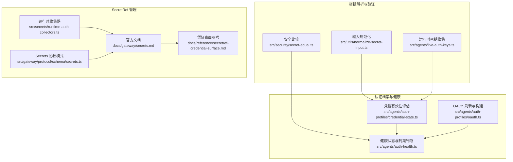
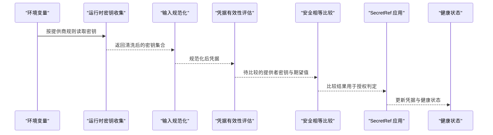
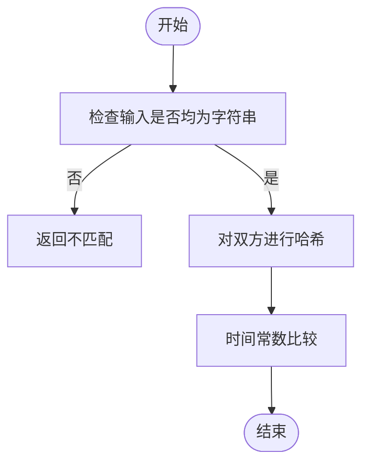
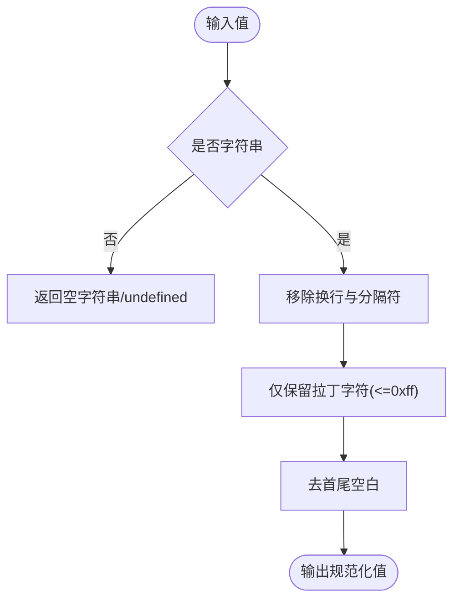
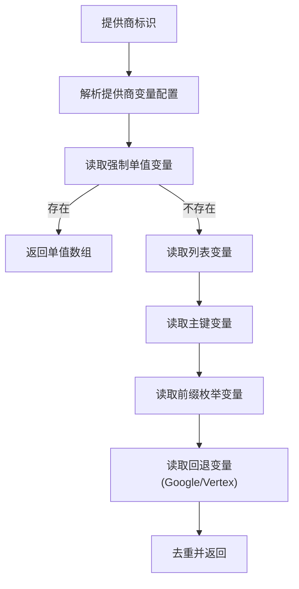
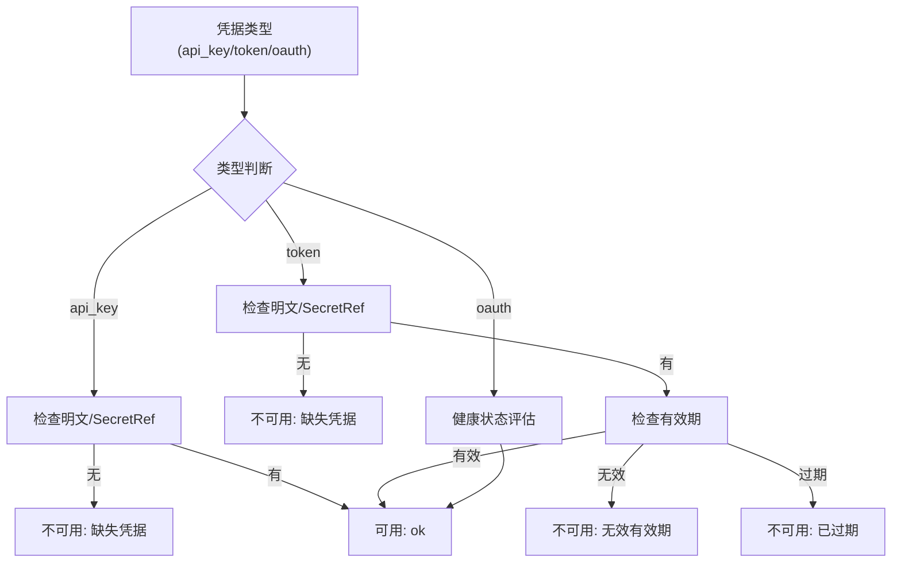
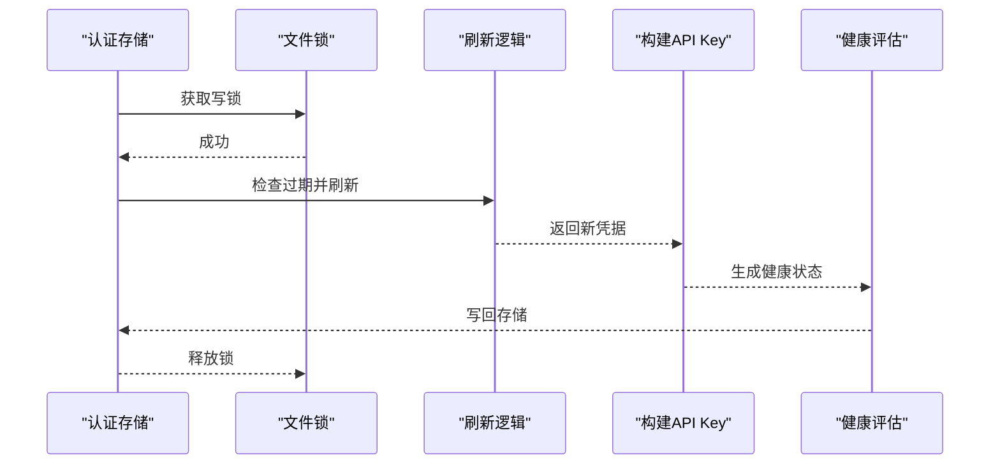
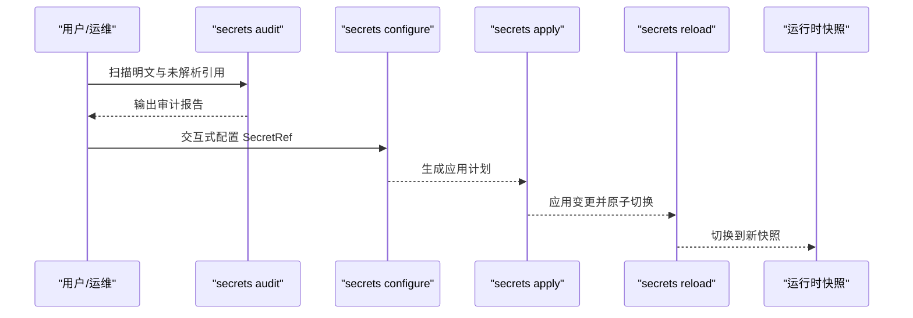
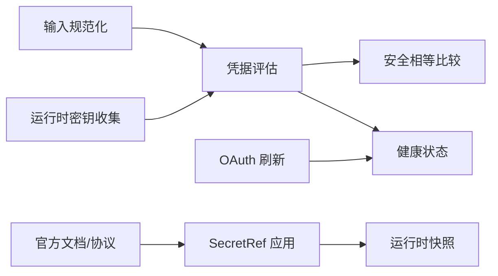

# API 密钥认证

<cite>
**本文引用的文件**
- [src/security/secret-equal.ts](file://src/security/secret-equal.ts)
- [src/utils/normalize-secret-input.ts](file://src/utils/normalize-secret-input.ts)
- [src/agents/live-auth-keys.ts](file://src/agents/live-auth-keys.ts)
- [src/agents/auth-profiles/credential-state.ts](file://src/agents/auth-profiles/credential-state.ts)
- [src/agents/auth-profiles/oauth.ts](file://src/agents/auth-profiles/oauth.ts)
- [src/agents/auth-health.ts](file://src/agents/auth-health.ts)
- [src/commands/doctor-auth.ts](file://src/commands/doctor-auth.ts)
- [src/secrets/runtime-auth-collectors.ts](file://src/secrets/runtime-auth-collectors.ts)
- [src/gateway/protocol/schema/secrets.ts](file://src/gateway/protocol/schema/secrets.ts)
- [docs/gateway/secrets.md](file://docs/gateway/secrets.md)
- [docs/reference/secretref-credential-surface.md](file://docs/reference/secretref-credential-surface.md)
</cite>

## 目录
1. [简介](#简介)
2. [项目结构](#项目结构)
3. [核心组件](#核心组件)
4. [架构总览](#架构总览)
5. [详细组件分析](#详细组件分析)
6. [依赖关系分析](#依赖关系分析)
7. [性能考量](#性能考量)
8. [故障排除指南](#故障排除指南)
9. [结论](#结论)
10. [附录](#附录)

## 简介
本文件系统性阐述 OpenClaw 的 API 密钥认证机制，覆盖密钥生成、存储与验证全流程；详解密钥解析（来自配置与环境变量）的优先级策略；解释安全相等比较以抵御时序攻击；说明密钥轮换与更新流程；给出最佳实践与安全建议，并提供失效处理与重新认证机制说明及配置示例与故障排除指引。

## 项目结构
围绕 API 密钥认证的关键模块分布如下：
- 安全比较：提供时序安全的密钥比较函数，避免侧信道攻击
- 输入规范化：对粘贴或输入的密钥进行清洗，去除换行与非拉丁字符，确保 HTTP 头部兼容
- 运行时密钥收集：按提供商规则从环境变量批量收集可用密钥
- 认证档案与有效期评估：评估 auth-profiles 中存储的凭据是否可用、是否过期
- OAuth 刷新与健康状态：对可刷新令牌进行加锁刷新并评估健康状态
- SecretRef 配置与应用：通过 secrets 命令将明文凭据替换为 SecretRef 引用，支持 env/file/exec 提供商
- 文档与参考：官方文档定义了 SecretRef 合约、激活行为、重载策略与诊断信号

图表来源
- [src/security/secret-equal.ts:1-13](file://src/security/secret-equal.ts#L1-L13)
- [src/utils/normalize-secret-input.ts:1-35](file://src/utils/normalize-secret-input.ts#L1-L35)
- [src/agents/live-auth-keys.ts:1-203](file://src/agents/live-auth-keys.ts#L1-L203)
- [src/agents/auth-profiles/credential-state.ts:1-75](file://src/agents/auth-profiles/credential-state.ts#L1-L75)
- [src/agents/auth-profiles/oauth.ts:154-177](file://src/agents/auth-profiles/oauth.ts#L154-L177)
- [src/agents/auth-health.ts:98-163](file://src/agents/auth-health.ts#L98-L163)
- [src/secrets/runtime-auth-collectors.ts:1-99](file://src/secrets/runtime-auth-collectors.ts#L1-L99)
- [src/gateway/protocol/schema/secrets.ts:1-35](file://src/gateway/protocol/schema/secrets.ts#L1-L35)
- [docs/gateway/secrets.md:1-455](file://docs/gateway/secrets.md#L1-L455)
- [docs/reference/secretref-credential-surface.md:1-24](file://docs/reference/secretref-credential-surface.md#L1-L24)

章节来源
- [src/security/secret-equal.ts:1-13](file://src/security/secret-equal.ts#L1-L13)
- [src/utils/normalize-secret-input.ts:1-35](file://src/utils/normalize-secret-input.ts#L1-L35)
- [src/agents/live-auth-keys.ts:1-203](file://src/agents/live-auth-keys.ts#L1-L203)
- [src/agents/auth-profiles/credential-state.ts:1-75](file://src/agents/auth-profiles/credential-state.ts#L1-L75)
- [src/agents/auth-profiles/oauth.ts:154-177](file://src/agents/auth-profiles/oauth.ts#L154-L177)
- [src/agents/auth-health.ts:98-163](file://src/agents/auth-health.ts#L98-L163)
- [src/secrets/runtime-auth-collectors.ts:1-99](file://src/secrets/runtime-auth-collectors.ts#L1-L99)
- [src/gateway/protocol/schema/secrets.ts:1-35](file://src/gateway/protocol/schema/secrets.ts#L1-L35)
- [docs/gateway/secrets.md:1-455](file://docs/gateway/secrets.md#L1-L455)
- [docs/reference/secretref-credential-surface.md:1-24](file://docs/reference/secretref-credential-surface.md#L1-L24)

## 核心组件
- 安全相等比较：使用哈希与时间常数比较，避免时序攻击
- 密钥输入规范化：去除换行与非拉丁字符，保留普通空格，确保 HTTP ByteString 兼容
- 运行时密钥收集：按提供商前缀与变量名规则从环境变量聚合可用密钥，支持单值、列表、主键与前缀枚举
- 凭据有效性评估：对 api_key/token/oauth 凭据进行可用性与有效期判定
- OAuth 刷新与健康：在文件锁保护下刷新令牌，构建 API Key 字符串并评估健康状态
- SecretRef 收集与应用：在运行时将明文凭据转换为 SecretRef 引用，支持 env/file/exec 提供商
- 官方文档与协议：定义 SecretRef 合约、激活与重载策略、诊断信号与命令工作流

章节来源
- [src/security/secret-equal.ts:1-13](file://src/security/secret-equal.ts#L1-L13)
- [src/utils/normalize-secret-input.ts:1-35](file://src/utils/normalize-secret-input.ts#L1-L35)
- [src/agents/live-auth-keys.ts:100-140](file://src/agents/live-auth-keys.ts#L100-L140)
- [src/agents/auth-profiles/credential-state.ts:34-75](file://src/agents/auth-profiles/credential-state.ts#L34-L75)
- [src/agents/auth-profiles/oauth.ts:154-177](file://src/agents/auth-profiles/oauth.ts#L154-L177)
- [src/secrets/runtime-auth-collectors.ts:23-99](file://src/secrets/runtime-auth-collectors.ts#L23-L99)
- [docs/gateway/secrets.md:1-455](file://docs/gateway/secrets.md#L1-L455)

## 架构总览
OpenClaw 的 API 密钥认证由“输入规范化 → 运行时收集 → 凭据评估 → 安全比较 → SecretRef 管理 → 健康监控”构成闭环。启动与重载阶段采用“预检失败即中止”的策略，确保运行时只读取已解析的内存快照，避免外部密钥源波动影响热路径。

图表来源
- [src/agents/live-auth-keys.ts:100-140](file://src/agents/live-auth-keys.ts#L100-L140)
- [src/utils/normalize-secret-input.ts:16-29](file://src/utils/normalize-secret-input.ts#L16-L29)
- [src/agents/auth-profiles/credential-state.ts:34-75](file://src/agents/auth-profiles/credential-state.ts#L34-L75)
- [src/security/secret-equal.ts:3-12](file://src/security/secret-equal.ts#L3-L12)
- [src/secrets/runtime-auth-collectors.ts:23-99](file://src/secrets/runtime-auth-collectors.ts#L23-L99)
- [src/agents/auth-health.ts:98-163](file://src/agents/auth-health.ts#L98-L163)

## 详细组件分析

### 安全相等比较（防时序攻击）
- 实现要点
  - 对提供的密钥与期望密钥分别计算哈希，再使用时间常数比较函数进行对比
  - 非字符串输入直接返回不匹配，避免类型混淆
- 安全收益
  - 抵御基于比较耗时差异的时序攻击，确保比较过程与输入长度无关
- 使用场景
  - 授权校验、令牌比对、密钥轮换前后一致性确认

图表来源
- [src/security/secret-equal.ts:3-12](file://src/security/secret-equal.ts#L3-L12)

章节来源
- [src/security/secret-equal.ts:1-13](file://src/security/secret-equal.ts#L1-L13)

### 密钥输入规范化
- 清洗规则
  - 移除换行与分隔符，保留普通空格，剔除非拉丁字符以避免 HTTP ByteString 错误
  - 对空或无效输入返回空字符串或 undefined
- 设计动机
  - 避免复制粘贴带来的隐藏字符导致请求头构造失败
  - 保持“Bearer <token>”等格式的完整性

图表来源
- [src/utils/normalize-secret-input.ts:16-29](file://src/utils/normalize-secret-input.ts#L16-L29)

章节来源
- [src/utils/normalize-secret-input.ts:1-35](file://src/utils/normalize-secret-input.ts#L1-L35)

### 运行时密钥收集（环境变量优先）
- 支持的提供商与变量规则
  - Anthropic、OpenAI、Google/Gemini 等均有独立的单值、列表、主键与前缀变量
  - Google/Vertex 提供回退变量（如 GOOGLE_API_KEY）
- 收集顺序与优先级
  - 强制单值变量优先（若存在则直接返回该单值）
  - 列表变量、主键变量、前缀枚举变量合并去重
  - Google/Vertex 回退变量在未命中时参与
- 结果
  - 返回清洗后的可用密钥数组，供后续选择与轮换使用

图表来源
- [src/agents/live-auth-keys.ts:71-98](file://src/agents/live-auth-keys.ts#L71-L98)
- [src/agents/live-auth-keys.ts:100-140](file://src/agents/live-auth-keys.ts#L100-L140)

章节来源
- [src/agents/live-auth-keys.ts:1-203](file://src/agents/live-auth-keys.ts#L1-L203)

### 凭据有效性评估（api_key/token/oauth）
- api_key
  - 至少需存在明文或 SecretRef 引用之一，否则不可用
- token
  - 明文或 SecretRef 存在基础上，还需有效且未过期
  - 有效期状态包括：缺失、无效、过期、有效
- oauth
  - 通过健康状态评估整体可用性，必要时触发刷新

图表来源
- [src/agents/auth-profiles/credential-state.ts:34-75](file://src/agents/auth-profiles/credential-state.ts#L34-L75)

章节来源
- [src/agents/auth-profiles/credential-state.ts:1-75](file://src/agents/auth-profiles/credential-state.ts#L1-L75)

### OAuth 刷新与健康状态
- 刷新流程
  - 在文件锁保护下读取认证存储，检查是否需要刷新
  - 若未过期，直接构建 API Key 字符串；若过期，执行刷新并返回新凭据
- 健康状态
  - 对静态 api_key 返回静态健康状态
  - 对 token 类型根据有效期与剩余时间返回 expired/expiring/static 等状态

图表来源
- [src/agents/auth-profiles/oauth.ts:154-177](file://src/agents/auth-profiles/oauth.ts#L154-L177)
- [src/agents/auth-health.ts:98-163](file://src/agents/auth-health.ts#L98-L163)

章节来源
- [src/agents/auth-profiles/oauth.ts:154-177](file://src/agents/auth-profiles/oauth.ts#L154-L177)
- [src/agents/auth-health.ts:98-163](file://src/agents/auth-health.ts#L98-L163)

### SecretRef 配置与应用（明文到引用的迁移）
- 运行时收集器
  - 将明文 api_key/token 转换为 SecretRef 引用，若同时存在明文与引用，引用优先
  - 对冲突场景发出运行时警告
- 官方文档与协议
  - 定义 SecretRef 合约（env/file/exec）、提供商配置、激活与重载策略、诊断信号
  - 提供命令工作流：secrets audit → secrets configure → secrets apply → secrets reload

图表来源
- [src/secrets/runtime-auth-collectors.ts:23-99](file://src/secrets/runtime-auth-collectors.ts#L23-L99)
- [docs/gateway/secrets.md:365-424](file://docs/gateway/secrets.md#L365-L424)
- [src/gateway/protocol/schema/secrets.ts:1-35](file://src/gateway/protocol/schema/secrets.ts#L1-L35)

章节来源
- [src/secrets/runtime-auth-collectors.ts:1-99](file://src/secrets/runtime-auth-collectors.ts#L1-L99)
- [docs/gateway/secrets.md:1-455](file://docs/gateway/secrets.md#L1-L455)
- [src/gateway/protocol/schema/secrets.ts:1-35](file://src/gateway/protocol/schema/secrets.ts#L1-L35)
- [docs/reference/secretref-credential-surface.md:1-24](file://docs/reference/secretref-credential-surface.md#L1-L24)

## 依赖关系分析
- 组件耦合
  - 安全比较与输入规范化为底层工具，被凭据评估与健康状态广泛复用
  - 运行时密钥收集为上游数据源，服务于凭据评估与 SecretRef 应用
  - OAuth 刷新与健康状态依赖认证存储与文件锁，保证并发安全
- 外部集成点
  - SecretRef 通过 env/file/exec 提供商对接外部密管系统
  - 官方文档与协议定义了跨版本兼容与诊断信号

图表来源
- [src/utils/normalize-secret-input.ts:16-29](file://src/utils/normalize-secret-input.ts#L16-L29)
- [src/agents/live-auth-keys.ts:100-140](file://src/agents/live-auth-keys.ts#L100-L140)
- [src/agents/auth-profiles/credential-state.ts:34-75](file://src/agents/auth-profiles/credential-state.ts#L34-L75)
- [src/security/secret-equal.ts:3-12](file://src/security/secret-equal.ts#L3-L12)
- [src/agents/auth-health.ts:98-163](file://src/agents/auth-health.ts#L98-L163)
- [src/agents/auth-profiles/oauth.ts:154-177](file://src/agents/auth-profiles/oauth.ts#L154-L177)
- [src/secrets/runtime-auth-collectors.ts:23-99](file://src/secrets/runtime-auth-collectors.ts#L23-L99)
- [docs/gateway/secrets.md:1-455](file://docs/gateway/secrets.md#L1-L455)

章节来源
- [src/utils/normalize-secret-input.ts:1-35](file://src/utils/normalize-secret-input.ts#L1-L35)
- [src/agents/live-auth-keys.ts:1-203](file://src/agents/live-auth-keys.ts#L1-L203)
- [src/agents/auth-profiles/credential-state.ts:1-75](file://src/agents/auth-profiles/credential-state.ts#L1-L75)
- [src/security/secret-equal.ts:1-13](file://src/security/secret-equal.ts#L1-L13)
- [src/agents/auth-health.ts:98-163](file://src/agents/auth-health.ts#L98-L163)
- [src/agents/auth-profiles/oauth.ts:154-177](file://src/agents/auth-profiles/oauth.ts#L154-L177)
- [src/secrets/runtime-auth-collectors.ts:1-99](file://src/secrets/runtime-auth-collectors.ts#L1-L99)
- [docs/gateway/secrets.md:1-455](file://docs/gateway/secrets.md#L1-L455)

## 性能考量
- 时间复杂度
  - 输入规范化：线性扫描字符，O(n)
  - 安全比较：固定哈希与常数时间比较，O(1) 比较成本
  - 密钥收集：遍历环境变量与合并去重，近似 O(m+n+k)，m/n/k 为不同来源数量
- 并发与锁
  - OAuth 刷新使用文件锁，避免并发写入冲突
- 运行时优化
  - 启动与重载阶段一次性解析 SecretRef，运行时仅读取内存快照，降低热路径开销

## 故障排除指南
- 启动/重载失败
  - 现象：启动或重载因未解析的 SecretRef 失败
  - 排查：查看日志中的“活跃面”诊断，确认目标 SecretRef 是否处于活跃表面
  - 处理：修复或补充 SecretRef 引用，或调整配置使其进入非活跃面
- 明文凭据冲突
  - 现象：同时配置明文与 SecretRef，出现覆盖警告
  - 排查：检查运行时警告与审计报告
  - 处理：删除明文字段，仅保留 SecretRef
- 密钥过期或无效
  - 现象：凭据评估返回过期或无效有效期
  - 排查：确认 token 的 expires 字段类型与数值范围
  - 处理：更新凭据或触发刷新
- 环境变量未生效
  - 现象：运行时未读取到预期密钥
  - 排查：核对提供商变量命名与前缀，确认回退变量是否设置
  - 处理：修正环境变量或添加回退变量
- 重新认证与轮换
  - 流程：使用 doctor-auth 交互式修复，或通过 secrets reload 刷新快照
  - 注意：轮换后应先预检，再应用并重载

章节来源
- [docs/gateway/secrets.md:328-342](file://docs/gateway/secrets.md#L328-L342)
- [src/agents/auth-profiles/credential-state.ts:13-24](file://src/agents/auth-profiles/credential-state.ts#L13-L24)
- [src/agents/auth-health.ts:121-163](file://src/agents/auth-health.ts#L121-L163)
- [src/commands/doctor-auth.ts:286-309](file://src/commands/doctor-auth.ts#L286-L309)

## 结论
OpenClaw 的 API 密钥认证体系以“输入规范化 + 运行时收集 + 凭据评估 + 安全比较 + SecretRef 管理 + 健康监控”为核心闭环，结合严格的启动失败策略与原子快照切换，既保障了安全性，也提升了运行时稳定性。通过 SecretRef 与命令工作流，实现了从明文到受控引用的平滑迁移，并提供了完善的诊断与重载能力。

## 附录

### 密钥解析优先级与配置示例
- 变量优先级（以提供商为例）
  - 强制单值变量优先于列表、主键与前缀变量
  - 列表变量、主键变量、前缀枚举变量合并去重
  - Google/Vertex 提供回退变量
- SecretRef 合约与提供商配置
  - 支持 env/file/exec 三种来源，遵循严格校验与路径/命令安全策略
  - 默认提供者与并发限制可在配置中设定
- 参考文档
  - 官方文档详细描述了 SecretRef 合约、激活与重载策略、诊断信号与命令工作流

章节来源
- [src/agents/live-auth-keys.ts:71-98](file://src/agents/live-auth-keys.ts#L71-L98)
- [docs/gateway/secrets.md:76-176](file://docs/gateway/secrets.md#L76-L176)
- [docs/gateway/secrets.md:199-286](file://docs/gateway/secrets.md#L199-L286)