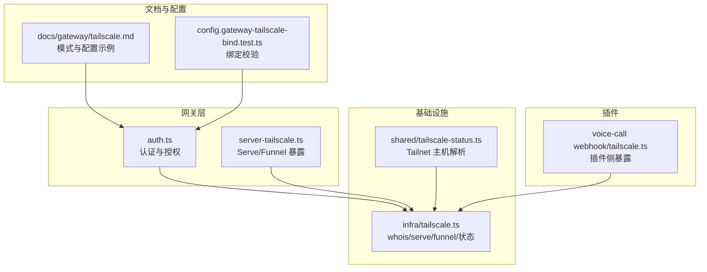
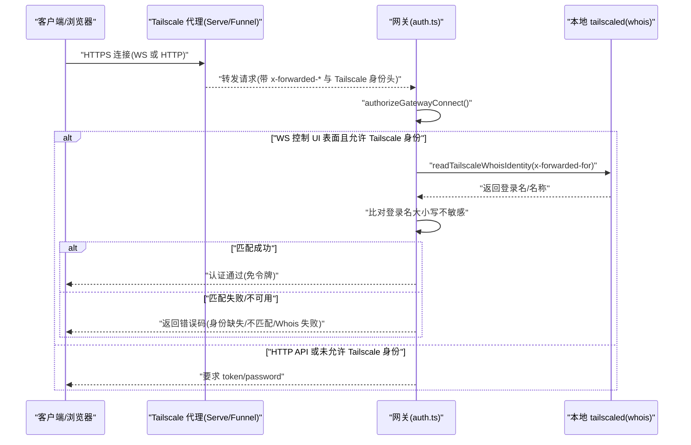
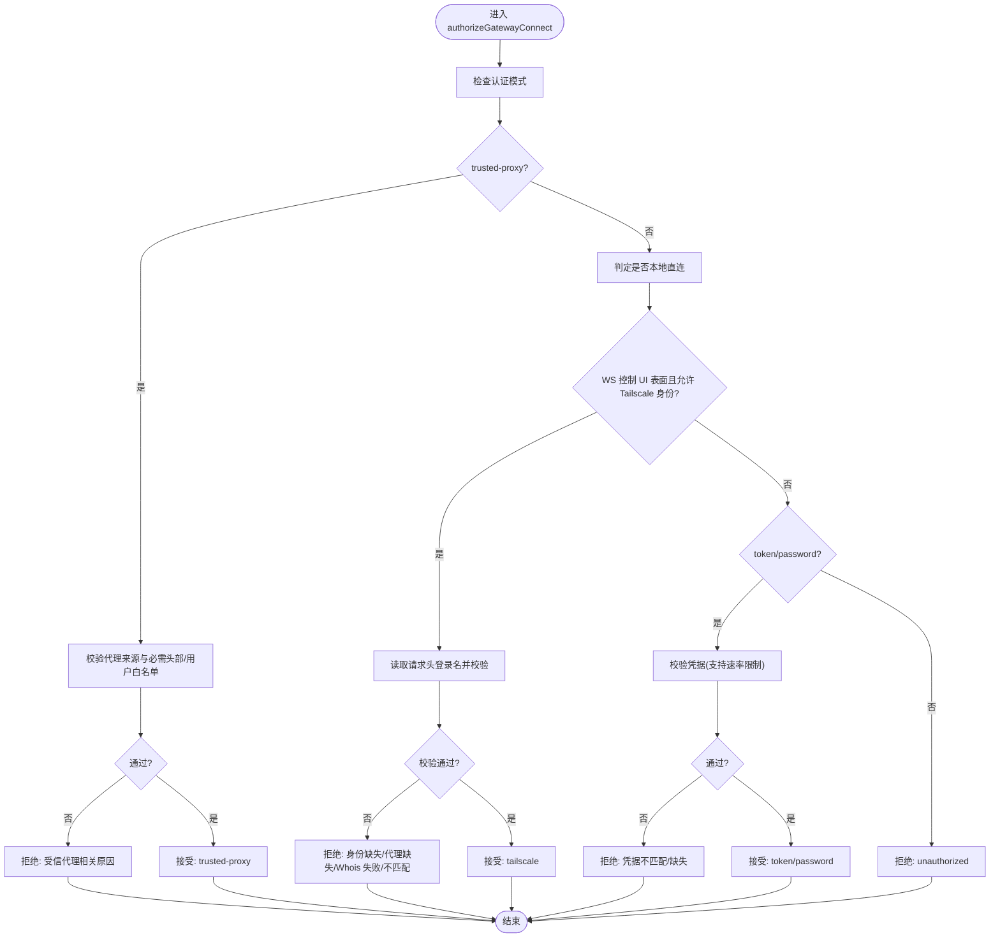
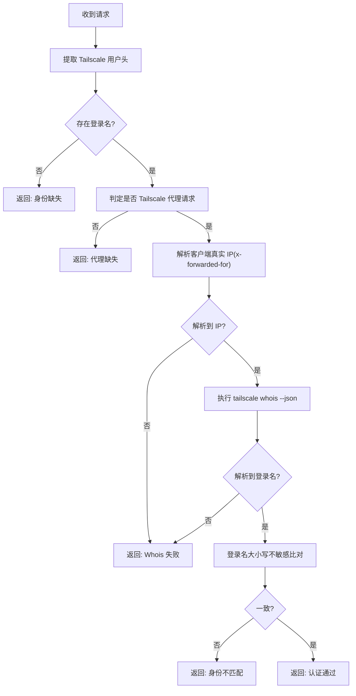
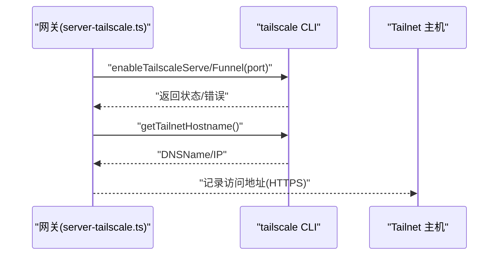
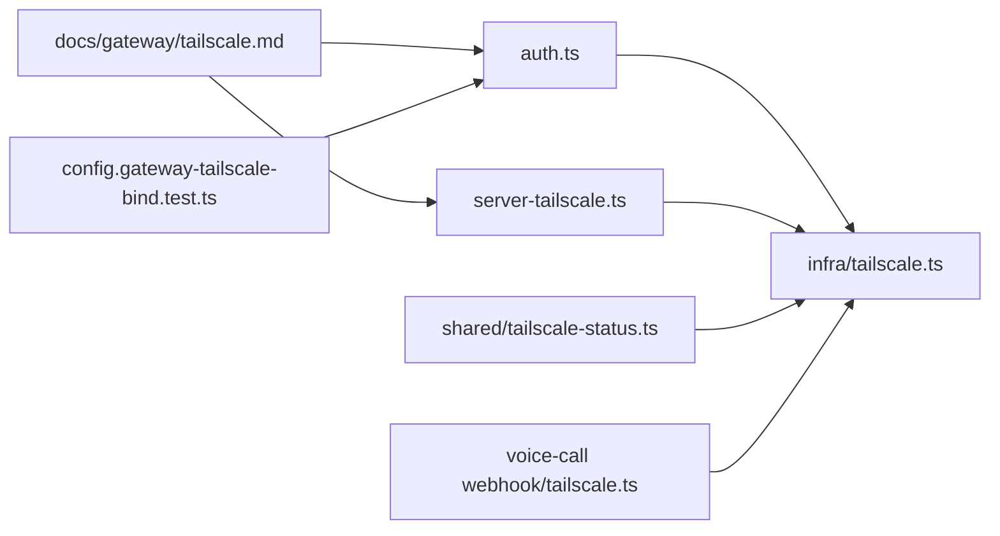

# Tailscale 认证

<cite>
**本文引用的文件**
- [docs/gateway/tailscale.md](file://docs/gateway/tailscale.md)
- [src/gateway/auth.ts](file://src/gateway/auth.ts)
- [src/infra/tailscale.ts](file://src/infra/tailscale.ts)
- [src/gateway/server-tailscale.ts](file://src/gateway/server-tailscale.ts)
- [src/shared/tailscale-status.ts](file://src/shared/tailscale-status.ts)
- [extensions/voice-call/src/webhook/tailscale.ts](file://extensions/voice-call/src/webhook/tailscale.ts)
- [src/gateway/auth.test.ts](file://src/gateway/auth.test.ts)
- [src/gateway/protocol/connect-error-details.ts](file://src/gateway/protocol/connect-error-details.ts)
- [apps/shared/OpenClawKit/Sources/OpenClawKit/GatewayErrors.swift](file://apps/shared/OpenClawKit/Sources/OpenClawKit/GatewayErrors.swift)
- [src/config/config.gateway-tailscale-bind.test.ts](file://src/config/config.gateway-tailscale-bind.test.ts)
</cite>

## 目录
1. [简介](#简介)
2. [项目结构](#项目结构)
3. [核心组件](#核心组件)
4. [架构总览](#架构总览)
5. [组件详解](#组件详解)
6. [依赖关系分析](#依赖关系分析)
7. [性能考量](#性能考量)
8. [故障排除指南](#故障排除指南)
9. [结论](#结论)
10. [附录](#附录)

## 简介
本文件面向 OpenClaw 的 Tailscale 认证系统，系统性阐述其集成架构、实现细节与运维实践。重点覆盖以下方面：
- Tailscale 用户身份验证流程：登录名验证与 Whois 查询机制
- 代理请求识别与处理逻辑（含 Serve/Funnel）
- 启用条件与配置要求
- 部署指南与网络配置要点
- 安全优势与典型使用场景
- 与本地直连请求的区别
- 配置示例与故障排除

## 项目结构
围绕 Tailscale 认证的关键代码分布在如下模块：
- 网关认证与授权：src/gateway/auth.ts
- Tailscale 基础设施与命令封装：src/infra/tailscale.ts
- 网关暴露（Serve/Funnel）：src/gateway/server-tailscale.ts
- Tailnet 主机解析：src/shared/tailscale-status.ts
- 插件侧的 Tailscale 暴露（Voice Call）：extensions/voice-call/src/webhook/tailscale.ts
- 文档与配置约束：docs/gateway/tailscale.md、src/config/config.gateway-tailscale-bind.test.ts
- 错误码映射：src/gateway/protocol/connect-error-details.ts、apps/shared/OpenClawKit/Sources/OpenClawKit/GatewayErrors.swift

图表来源
- [src/gateway/auth.ts:1-504](file://src/gateway/auth.ts#L1-L504)
- [src/infra/tailscale.ts:1-501](file://src/infra/tailscale.ts#L1-L501)
- [src/gateway/server-tailscale.ts:1-59](file://src/gateway/server-tailscale.ts#L1-L59)
- [src/shared/tailscale-status.ts:1-71](file://src/shared/tailscale-status.ts#L1-L71)
- [extensions/voice-call/src/webhook/tailscale.ts:1-116](file://extensions/voice-call/src/webhook/tailscale.ts#L1-L116)
- [docs/gateway/tailscale.md:1-133](file://docs/gateway/tailscale.md#L1-L133)
- [src/config/config.gateway-tailscale-bind.test.ts:1-80](file://src/config/config.gateway-tailscale-bind.test.ts#L1-L80)

章节来源
- [docs/gateway/tailscale.md:1-133](file://docs/gateway/tailscale.md#L1-L133)
- [src/gateway/auth.ts:1-504](file://src/gateway/auth.ts#L1-L504)
- [src/infra/tailscale.ts:1-501](file://src/infra/tailscale.ts#L1-L501)
- [src/gateway/server-tailscale.ts:1-59](file://src/gateway/server-tailscale.ts#L1-L59)
- [src/shared/tailscale-status.ts:1-71](file://src/shared/tailscale-status.ts#L1-L71)
- [extensions/voice-call/src/webhook/tailscale.ts:1-116](file://extensions/voice-call/src/webhook/tailscale.ts#L1-L116)
- [src/config/config.gateway-tailscale-bind.test.ts:1-80](file://src/config/config.gateway-tailscale-bind.test.ts#L1-L80)

## 核心组件
- 认证与授权引擎（authorizeGatewayConnect）：统一处理 token/password/trusted-proxy/tailscale 四种模式；在特定表面（WS 控制 UI）允许基于 Tailscale 身份的免令牌登录。
- Tailscale Whois 解析：通过本地 tailscaled 查询远端客户端的真实登录名，用于比对请求头中的 Tailscale 登录名。
- Serve/Funnel 暴露：在网关仅监听回环的前提下，由 Tailscale 提供 HTTPS 与身份头转发。
- Tailnet 主机解析：从 tailscale status 中提取 DNS 名称或 IP，用于生成访问链接。
- 插件侧暴露：Voice Call 插件可按路径将本地服务暴露到 Tailscale Serve/Funnel。

章节来源
- [src/gateway/auth.ts:378-504](file://src/gateway/auth.ts#L378-L504)
- [src/infra/tailscale.ts:469-500](file://src/infra/tailscale.ts#L469-L500)
- [src/gateway/server-tailscale.ts:9-59](file://src/gateway/server-tailscale.ts#L9-L59)
- [src/shared/tailscale-status.ts:43-71](file://src/shared/tailscale-status.ts#L43-L71)
- [extensions/voice-call/src/webhook/tailscale.ts:94-116](file://extensions/voice-call/src/webhook/tailscale.ts#L94-L116)

## 架构总览
下图展示 Tailscale 认证在 OpenClaw 中的整体交互：浏览器/控制 UI 通过 Tailscale Serve/Funnel 连接网关，网关在 WS 控制 UI 表面启用 Tailscale 身份头认证，HTTP API 仍需 token/password；网关侧通过本地 tailscaled 执行 whois 并缓存结果，确保可信的身份匹配。

图表来源
- [src/gateway/auth.ts:378-504](file://src/gateway/auth.ts#L378-L504)
- [src/infra/tailscale.ts:469-500](file://src/infra/tailscale.ts#L469-L500)
- [src/gateway/server-tailscale.ts:9-59](file://src/gateway/server-tailscale.ts#L9-L59)

## 组件详解

### 认证与授权流程（authorizeGatewayConnect）
- 请求来源判定：
  - 本地直连：仅当请求来自回环且无代理转发头时视为直连。
  - Tailscale 代理请求：要求来自回环且携带 x-forwarded-for/proto/host 等头部。
- 身份验证优先级：
  - trusted-proxy：必须来自受信代理并满足所需头部与用户白名单。
  - tailscale（WS 控制 UI 表面）：若允许 Tailscale 身份，且请求非本地直连，则读取请求头中的 Tailscale 登录名，经本地 whois 校验后放行。
  - token/password：常规凭据校验，支持速率限制。
- 返回值包含方法、用户标识与原因码，便于 UI 与协议层反馈。

图表来源
- [src/gateway/auth.ts:378-504](file://src/gateway/auth.ts#L378-L504)

章节来源
- [src/gateway/auth.ts:378-504](file://src/gateway/auth.ts#L378-L504)
- [src/gateway/auth.test.ts:31-88](file://src/gateway/auth.test.ts#L31-L88)

### Tailscale Whois 与身份匹配
- 请求头解析：从 headers 中提取 tailscale-user-login/name/profile-pic。
- 代理请求判定：要求来自回环且具备 x-forwarded-* 头部。
- IP 解析：优先使用 x-forwarded-for，结合受信代理列表进行解析。
- Whois 查询：调用 tailscale whois --json 获取用户信息，解析登录名与显示名，并缓存以降低开销。
- 匹配策略：登录名大小写不敏感对比，失败返回相应原因码。

图表来源
- [src/gateway/auth.ts:148-215](file://src/gateway/auth.ts#L148-L215)
- [src/infra/tailscale.ts:469-500](file://src/infra/tailscale.ts#L469-L500)

章节来源
- [src/gateway/auth.ts:148-215](file://src/gateway/auth.ts#L148-L215)
- [src/infra/tailscale.ts:432-500](file://src/infra/tailscale.ts#L432-L500)

### Serve/Funnel 暴露与 Tailnet 主机解析
- Serve：在网关仅监听回环的前提下，通过 tailscale serve 将网关端口暴露于 Tailnet，自动注入 Tailscale 身份头。
- Funnel：在公网 HTTPS 下暴露，需要共享密码（避免公开暴露）。
- Tailnet 主机解析：从 tailscale status 中提取 DNSName 或 TailscaleIPs，用于生成访问链接。
- 插件侧暴露：Voice Call 插件可按路径将本地服务暴露到 Tailscale Serve/Funnel，并在退出时清理。

图表来源
- [src/gateway/server-tailscale.ts:9-59](file://src/gateway/server-tailscale.ts#L9-L59)
- [src/infra/tailscale.ts:106-144](file://src/infra/tailscale.ts#L106-L144)
- [extensions/voice-call/src/webhook/tailscale.ts:94-116](file://extensions/voice-call/src/webhook/tailscale.ts#L94-L116)

章节来源
- [src/gateway/server-tailscale.ts:9-59](file://src/gateway/server-tailscale.ts#L9-L59)
- [src/shared/tailscale-status.ts:43-71](file://src/shared/tailscale-status.ts#L43-L71)
- [extensions/voice-call/src/webhook/tailscale.ts:94-116](file://extensions/voice-call/src/webhook/tailscale.ts#L94-L116)

### 配置与启用条件
- 模式选择：
  - serve：Tailnet 内访问，保持网关回环绑定，Tailscale 注入身份头。
  - funnel：公网 HTTPS，需共享密码，避免直接暴露。
  - off：默认关闭。
- 绑定约束：当启用 serve/funnel 时，gateway.bind 必须为 loopback 或自定义回环地址；IPv6 回环在 Serve 模式下被拒绝。
- 允许 Tailscale 身份：仅在 WS 控制 UI 表面启用，HTTP API 仍需 token/password。

章节来源
- [docs/gateway/tailscale.md:15-43](file://docs/gateway/tailscale.md#L15-L43)
- [src/config/config.gateway-tailscale-bind.test.ts:4-79](file://src/config/config.gateway-tailscale-bind.test.ts#L4-L79)

### 与本地直连请求的区别
- 本地直连：来自回环且无代理转发头，被视为直连请求，不触发 Tailscale 身份校验。
- 代理请求：来自回环但带有 x-forwarded-* 与 Tailscale 身份头，需进行 whois 校验。
- HTTP API：始终要求 token/password，不受 allowTailscale 影响。
- WS 控制 UI：在允许的情况下，可使用 Tailscale 身份头免令牌登录。

章节来源
- [src/gateway/auth.ts:125-146](file://src/gateway/auth.ts#L125-L146)
- [src/gateway/auth.ts:374-376](file://src/gateway/auth.ts#L374-L376)

### 错误码与诊断
- 协议层错误码映射：将认证失败原因映射为标准错误码，便于前端与协议层呈现。
- Swift SDK 错误枚举：包含 AUTH_TAILSCALE_* 系列错误，用于移动端/桌面端一致化处理。

章节来源
- [src/gateway/protocol/connect-error-details.ts:51-84](file://src/gateway/protocol/connect-error-details.ts#L51-L84)
- [apps/shared/OpenClawKit/Sources/OpenClawKit/GatewayErrors.swift:4-29](file://apps/shared/OpenClawKit/Sources/OpenClawKit/GatewayErrors.swift#L4-L29)

## 依赖关系分析
- 认证模块依赖基础设施模块提供的 whois 与二进制发现能力。
- 网关暴露模块依赖基础设施模块执行 Serve/Funnel。
- Tailnet 主机解析模块独立于认证，但与暴露模块配合生成访问地址。
- 插件侧暴露模块复用基础设施模块的命令封装。

图表来源
- [src/gateway/auth.ts:1-504](file://src/gateway/auth.ts#L1-L504)
- [src/infra/tailscale.ts:1-501](file://src/infra/tailscale.ts#L1-L501)
- [src/gateway/server-tailscale.ts:1-59](file://src/gateway/server-tailscale.ts#L1-L59)
- [src/shared/tailscale-status.ts:1-71](file://src/shared/tailscale-status.ts#L1-L71)
- [extensions/voice-call/src/webhook/tailscale.ts:1-116](file://extensions/voice-call/src/webhook/tailscale.ts#L1-L116)
- [docs/gateway/tailscale.md:1-133](file://docs/gateway/tailscale.md#L1-L133)
- [src/config/config.gateway-tailscale-bind.test.ts:1-80](file://src/config/config.gateway-tailscale-bind.test.ts#L1-L80)

## 性能考量
- Whois 缓存：对 whois 结果进行 TTL 缓存，减少重复查询；错误也设置短期缓存以抑制抖动。
- 速率限制：对 token/password 场景实施速率限制，保护免受暴力尝试。
- 二进制发现与超时：Tailscale CLI 发现与 whois 查询均设置合理超时，避免阻塞。
- 仅在 WS 控制 UI 表面启用免令牌登录，降低攻击面。

章节来源
- [src/infra/tailscale.ts:453-467](file://src/infra/tailscale.ts#L453-L467)
- [src/gateway/auth.ts:415-431](file://src/gateway/auth.ts#L415-L431)

## 故障排除指南
- Funnel 未启用：根据提示在管理后台开启 Funnel，或在 macOS 上使用用户态 tailscaled。
- 权限不足：部分操作需要 sudo 权限，框架会尝试重试；若失败请手动赋予必要权限。
- 版本不匹配：客户端/服务端版本不一致会导致功能异常，建议同步升级。
- Whois 失败：确认本地 tailscaled 正常运行，且请求的 x-forwarded-for 可被 whois 解析。
- 绑定冲突：启用 serve/funnel 时，gateway.bind 必须为回环；否则配置校验会拒绝。
- 测试辅助：可通过测试用例观察不同场景下的行为与错误码映射。

章节来源
- [src/infra/tailscale.ts:302-390](file://src/infra/tailscale.ts#L302-L390)
- [src/gateway/auth.test.ts:71-88](file://src/gateway/auth.test.ts#L71-L88)
- [src/config/config.gateway-tailscale-bind.test.ts:4-79](file://src/config/config.gateway-tailscale-bind.test.ts#L4-L79)

## 结论
OpenClaw 的 Tailscale 认证通过“回环+代理”的组合，实现了安全可控的远程访问：在保证本地主机信任的前提下，利用 Tailscale 的 HTTPS 与身份头，为 WS 控制 UI 提供免令牌登录体验；同时保留 HTTP API 的 token/password 强认证，形成分层安全模型。配合严格的绑定约束与错误码体系，既提升了可用性，又保障了安全性。

## 附录

### 配置示例与部署要点
- Tailnet-only（Serve）
  - gateway.bind: loopback
  - gateway.tailscale.mode: serve
  - 访问：https://<magicDNS>/（或自定义 basePath）
- 直接 Tailnet 绑定
  - gateway.bind: tailnet
  - gateway.auth.mode: token/password
  - 访问：http://<tailscale-ip>:18789/（WS: ws://...）
- 公网（Funnel + 共享密码）
  - gateway.bind: loopback
  - gateway.tailscale.mode: funnel
  - gateway.auth.mode: password
  - 注意：Funnel 需要满足 Tailscale 版本、HTTPS、MagicDNS 等前置条件

章节来源
- [docs/gateway/tailscale.md:44-109](file://docs/gateway/tailscale.md#L44-L109)