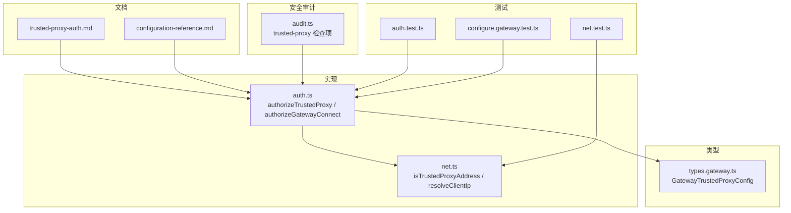
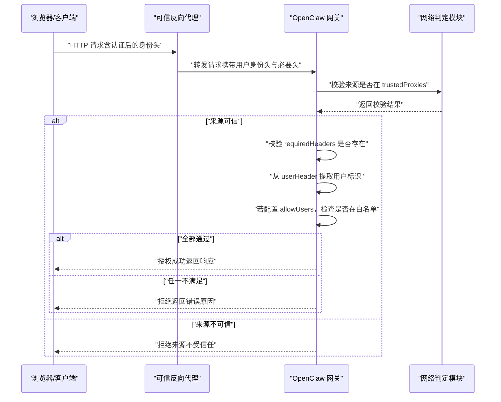
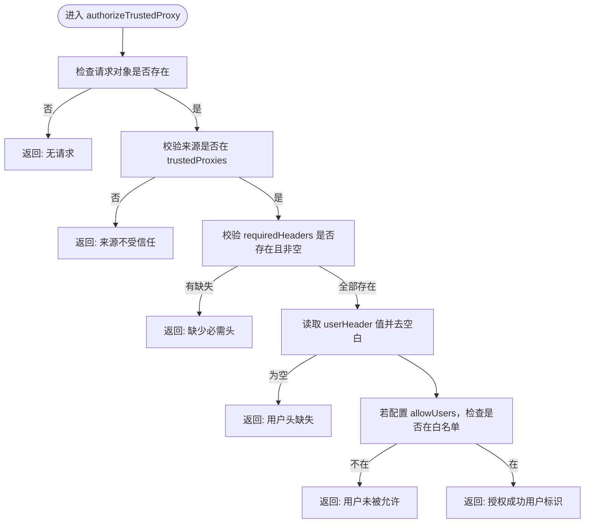
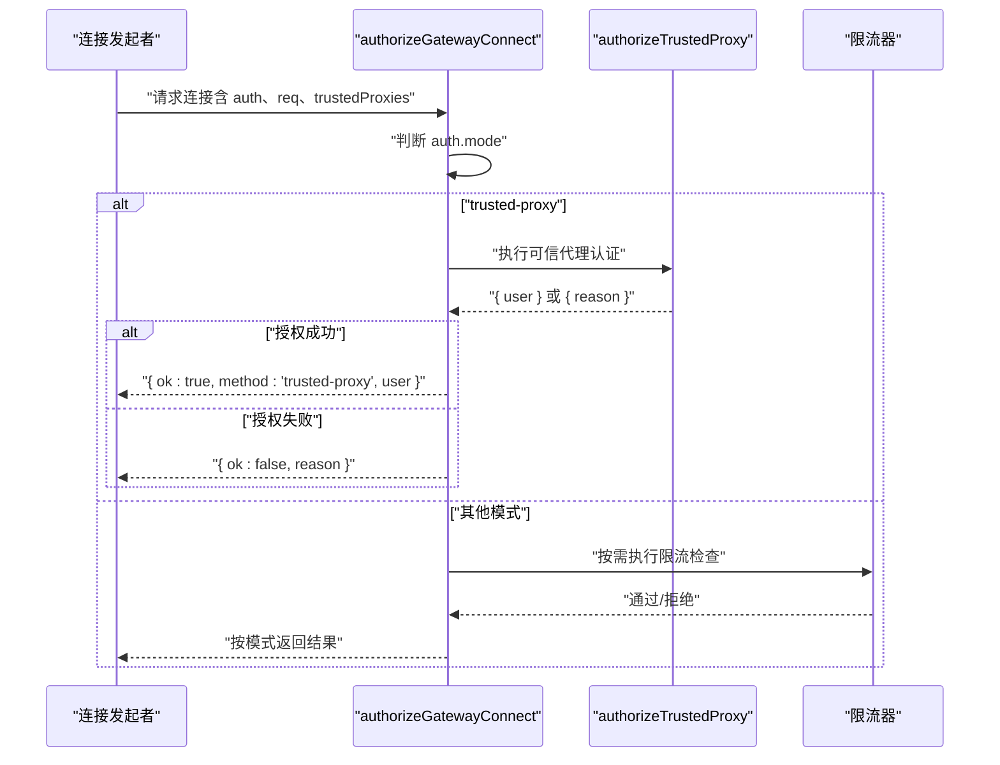
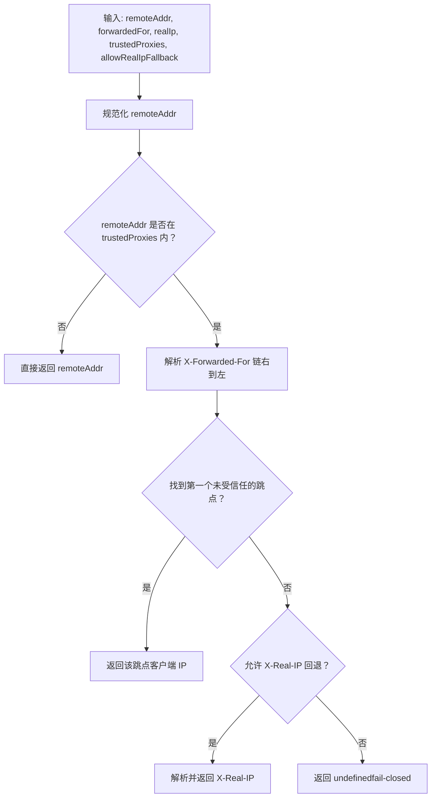
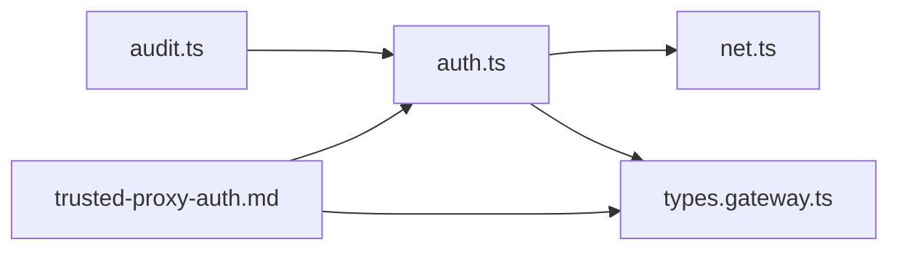

# 可信代理认证

<cite>
**本文引用的文件**
- [trusted-proxy-auth.md](file://docs/gateway/trusted-proxy-auth.md)
- [auth.ts](file://src/gateway/auth.ts)
- [net.ts](file://src/gateway/net.ts)
- [types.gateway.ts](file://src/config/types.gateway.ts)
- [configuration-reference.md](file://docs/gateway/configuration-reference.md)
- [audit.ts](file://src/security/audit.ts)
- [auth.test.ts](file://src/gateway/auth.test.ts)
- [net.test.ts](file://src/gateway/net.test.ts)
- [configure.gateway.test.ts](file://src/commands/configure.gateway.test.ts)
</cite>

## 目录
1. [简介](#简介)
2. [项目结构](#项目结构)
3. [核心组件](#核心组件)
4. [架构总览](#架构总览)
5. [详细组件分析](#详细组件分析)
6. [依赖关系分析](#依赖关系分析)
7. [性能考量](#性能考量)
8. [故障排除指南](#故障排除指南)
9. [结论](#结论)
10. [附录](#附录)

## 简介
本文件面向 OpenClaw 的可信代理认证（Trusted Proxy Auth）系统，提供从架构设计到实现细节、配置与部署、安全与最佳实践、以及与其他认证方式配合使用的完整技术文档。可信代理认证模式将网关的认证职责委托给一个“可信反向代理”（如 Pomerium、Caddy + OAuth、nginx + oauth2-proxy、Traefik + forward auth），由代理完成用户身份认证，并通过特定 HTTP 头将已认证用户传递给 OpenClaw 网关。网关仅对请求来源进行可信代理 IP 校验、对必需头进行存在性校验，并从指定用户头中提取用户身份，再结合可选的用户白名单进行授权。

## 项目结构
可信代理认证相关的核心代码与文档分布如下：
- 文档层：trusted-proxy-auth.md 提供配置参考、示例与安全检查清单
- 实现层：auth.ts 中的 authorizeTrustedProxy 与 authorizeGatewayConnect 完成认证逻辑；net.ts 提供 isTrustedProxyAddress 与 resolveClientIp 等网络判定能力
- 类型层：types.gateway.ts 定义 GatewayTrustedProxyConfig 等配置类型
- 安全审计：audit.ts 对缺失配置进行严重性提示
- 测试：auth.test.ts、net.test.ts、configure.gateway.test.ts 验证行为与边界条件

图表来源
- [trusted-proxy-auth.md:1-330](file://docs/gateway/trusted-proxy-auth.md#L1-L330)
- [auth.ts:331-485](file://src/gateway/auth.ts#L331-L485)
- [net.ts:141-185](file://src/gateway/net.ts#L141-L185)
- [types.gateway.ts:130-148](file://src/config/types.gateway.ts#L130-L148)
- [audit.ts:645-671](file://src/security/audit.ts#L645-L671)
- [auth.test.ts:506-595](file://src/gateway/auth.test.ts#L506-L595)
- [net.test.ts:51-164](file://src/gateway/net.test.ts#L51-L164)
- [configure.gateway.test.ts:123-156](file://src/commands/configure.gateway.test.ts#L123-L156)

章节来源
- [trusted-proxy-auth.md:1-330](file://docs/gateway/trusted-proxy-auth.md#L1-L330)
- [auth.ts:331-485](file://src/gateway/auth.ts#L331-L485)
- [net.ts:141-185](file://src/gateway/net.ts#L141-L185)
- [types.gateway.ts:130-148](file://src/config/types.gateway.ts#L130-L148)
- [audit.ts:645-671](file://src/security/audit.ts#L645-L671)
- [auth.test.ts:506-595](file://src/gateway/auth.test.ts#L506-L595)
- [net.test.ts:51-164](file://src/gateway/net.test.ts#L51-L164)
- [configure.gateway.test.ts:123-156](file://src/commands/configure.gateway.test.ts#L123-L156)

## 核心组件
- 认证入口与模式分发：authorizeGatewayConnect 根据 auth.mode 分派到不同认证路径，当 mode 为 trusted-proxy 时调用 authorizeTrustedProxy
- 可信代理校验：authorizeTrustedProxy 执行以下步骤
  - 来源地址检查：基于 gateway.trustedProxies 判断请求是否来自受信任代理
  - 必需头校验：遍历 trustedProxy.requiredHeaders，确保每个头均存在且非空
  - 用户头解析：读取 trustedProxy.userHeader，去除空白后作为用户标识
  - 用户白名单：若配置了 allowUsers，则仅允许其中的用户访问
- 网络判定：isTrustedProxyAddress 支持精确 IP 与 CIDR 匹配，resolveClientIp 在代理链中解析真实客户端 IP 并在缺失时 fail-closed
- 类型定义：GatewayTrustedProxyConfig 明确 userHeader、requiredHeaders、allowUsers 字段语义
- 安全审计：audit.ts 对缺失 trustedProxies、userHeader、allowUsers（空列表）发出严重或警告级别提示

章节来源
- [auth.ts:331-485](file://src/gateway/auth.ts#L331-L485)
- [net.ts:141-185](file://src/gateway/net.ts#L141-L185)
- [types.gateway.ts:130-148](file://src/config/types.gateway.ts#L130-L148)
- [audit.ts:645-671](file://src/security/audit.ts#L645-L671)

## 架构总览
可信代理认证的整体流程如下：

图表来源
- [auth.ts:331-409](file://src/gateway/auth.ts#L331-L409)
- [net.ts:141-185](file://src/gateway/net.ts#L141-L185)

章节来源
- [auth.ts:331-485](file://src/gateway/auth.ts#L331-L485)
- [net.ts:141-185](file://src/gateway/net.ts#L141-L185)

## 详细组件分析

### 组件：authorizeTrustedProxy（可信代理认证主流程）
- 输入参数
  - req：HTTP 请求对象（用于读取 headers 与 socket.remoteAddress）
  - trustedProxies：可信代理 IP 列表（支持精确 IP 与 CIDR）
  - trustedProxyConfig：GatewayTrustedProxyConfig（userHeader、requiredHeaders、allowUsers）
- 校验顺序
  1) 请求对象存在性检查
  2) 来源地址是否在 trustedProxies 内（isTrustedProxyAddress）
  3) requiredHeaders 每个头是否存在且非空
  4) userHeader 是否存在且非空，去空白后作为用户标识
  5) 若 allowUsers 非空，用户是否在白名单内
- 输出
  - 成功：返回 { user }
  - 失败：返回 { reason }，包含具体失败原因字符串

图表来源
- [auth.ts:331-372](file://src/gateway/auth.ts#L331-L372)

章节来源
- [auth.ts:331-372](file://src/gateway/auth.ts#L331-L372)

### 组件：authorizeGatewayConnect（认证入口与模式分发）
- 职责
  - 根据 auth.mode 分派到对应认证路径
  - trusted-proxy 模式下调用 authorizeTrustedProxy 并返回统一 GatewayAuthResult
  - 其他模式（none/token/password/tailscale）按各自规则处理
- 关键点
  - 当 mode 为 trusted-proxy 且缺少 trustedProxy 配置或 trustedProxies 为空，直接拒绝
  - 对于 ws-control-ui 表面，允许 Tailscale 头部认证（HTTP 表面禁用）

图表来源
- [auth.ts:378-485](file://src/gateway/auth.ts#L378-L485)

章节来源
- [auth.ts:378-485](file://src/gateway/auth.ts#L378-L485)

### 组件：网络判定（isTrustedProxyAddress 与 resolveClientIp）
- isTrustedProxyAddress
  - 支持精确 IP 与 CIDR（含 IPv6）匹配
  - 自动忽略空白条目，保留兼容性（旧配置行为）
  - 返回布尔值表示是否可信
- resolveClientIp
  - 优先从 X-Forwarded-For 代理链中解析真实客户端 IP
  - 若来自可信代理但缺失或无效的转发头，fail-closed 不回退到代理自身 IP
  - 可选允许 X-Real-IP 回退（默认关闭）

图表来源
- [net.ts:156-185](file://src/gateway/net.ts#L156-L185)

章节来源
- [net.ts:141-185](file://src/gateway/net.ts#L141-L185)
- [net.test.ts:51-164](file://src/gateway/net.test.ts#L51-L164)

### 组件：类型定义（GatewayTrustedProxyConfig）
- 字段说明
  - userHeader：必填，包含已认证用户标识的头名称
  - requiredHeaders：可选，必须存在的额外头列表，用于验证请求确实来自代理
  - allowUsers：可选，用户白名单；为空表示允许所有经代理认证的用户
- 默认行为
  - allowUsers 为空时，审计会给出“允许所有已认证用户”的警告

章节来源
- [types.gateway.ts:130-148](file://src/config/types.gateway.ts#L130-L148)
- [audit.ts:645-671](file://src/security/audit.ts#L645-L671)

### 组件：安全审计（trusted-proxy 检查项）
- 关键检查
  - 缺失 trustedProxies：critical
  - 缺失 userHeader：critical
  - allowUsers 为空：warn
- 审计触发场景
  - 启动时运行安全审计
  - 配置变更后建议重新审计

章节来源
- [audit.ts:645-671](file://src/security/audit.ts#L645-L671)
- [trusted-proxy-auth.md:266-275](file://docs/gateway/trusted-proxy-auth.md#L266-L275)

### 组件：配置示例与交互式配置
- 文档示例覆盖常见代理（Pomerium、Caddy、nginx+oauth2-proxy、Traefik）
- 交互式配置流程
  - 选择 trusted-proxy 模式后，引导输入 userHeader、requiredHeaders、allowUsers、trustedProxies
  - 默认绑定模式与 trustedProxies 会根据输入自动设置

章节来源
- [trusted-proxy-auth.md:50-254](file://docs/gateway/trusted-proxy-auth.md#L50-L254)
- [configure.gateway.test.ts:123-156](file://src/commands/configure.gateway.test.ts#L123-L156)

## 依赖关系分析
- 模块耦合
  - auth.ts 依赖 net.ts 进行来源 IP 判定与客户端 IP 解析
  - auth.ts 依赖 types.gateway.ts 的类型定义
  - audit.ts 依赖 auth.ts 的配置结构进行检查
- 外部依赖
  - 反向代理（Pomerium、Caddy、nginx+oauth2-proxy、Traefik）负责实际认证与头注入
- 潜在循环依赖
  - 未发现循环导入；各模块职责清晰

图表来源
- [auth.ts:1-22](file://src/gateway/auth.ts#L1-L22)
- [net.ts:1-11](file://src/gateway/net.ts#L1-L11)
- [types.gateway.ts:120-166](file://src/config/types.gateway.ts#L120-L166)
- [audit.ts:645-671](file://src/security/audit.ts#L645-L671)
- [trusted-proxy-auth.md:1-330](file://docs/gateway/trusted-proxy-auth.md#L1-L330)

章节来源
- [auth.ts:1-22](file://src/gateway/auth.ts#L1-L22)
- [net.ts:1-11](file://src/gateway/net.ts#L1-L11)
- [types.gateway.ts:120-166](file://src/config/types.gateway.ts#L120-L166)
- [audit.ts:645-671](file://src/security/audit.ts#L645-L671)
- [trusted-proxy-auth.md:1-330](file://docs/gateway/trusted-proxy-auth.md#L1-L330)

## 性能考量
- 认证开销
  - authorizeTrustedProxy 为线性扫描 requiredHeaders 与 allowUsers，时间复杂度 O(n+m)，n 为 requiredHeaders 数量，m 为 allowUsers 数量
  - isTrustedProxyAddress 使用 CIDR 匹配，单次检查近似 O(k)，k 为 trustedProxies 条目数
- 网络解析
  - resolveClientIp 在代理链解析时从右到左遍历，最坏 O(l)，l 为 X-Forwarded-For 链长度
- 建议
  - 将 requiredHeaders 与 allowUsers 控制在合理规模
  - 代理端尽量减少不必要的头数量，避免过长的 X-Forwarded-For 链

[本节为通用性能讨论，无需特定文件来源]

## 故障排除指南
- 常见失败原因与定位
  - 来源不受信任：确认 gateway.trustedProxies 是否包含代理实际 IP（容器 IP 可变）
  - 缺少用户头：确认代理是否正确传递 userHeader（大小写不敏感，拼写要一致）
  - 缺少必需头：确认代理是否注入 requiredHeaders 中的每个头
  - 用户未被允许：将用户加入 allowUsers 或移除 allowUsers
  - WebSocket 仍失败：确认代理支持 WebSocket 升级，且在升级时也传递身份头
- 审计与日志
  - 运行安全审计以识别缺失配置
  - 查看网关日志中的认证拒绝原因字符串（reason）

章节来源
- [trusted-proxy-auth.md:276-312](file://docs/gateway/trusted-proxy-auth.md#L276-L312)
- [auth.test.ts:511-595](file://src/gateway/auth.test.ts#L511-L595)
- [audit.ts:645-671](file://src/security/audit.ts#L645-L671)

## 结论
可信代理认证通过将认证责任委托给企业级反向代理，简化了 OpenClaw 网关侧的认证负担，同时保持了高安全性前提下的灵活部署。其关键在于：
- 严格的来源 IP 校验（trustedProxies）
- 必需头的存在性校验（requiredHeaders）
- 用户身份头的解析与可选白名单（allowUsers）
- fail-closed 的客户端 IP 解析策略，避免代理链伪造
配合安全审计与详尽的配置示例，可帮助用户在生产环境中安全、稳定地启用可信代理认证。

[本节为总结性内容，无需特定文件来源]

## 附录

### A. 配置要点与最佳实践
- 仅列出受控代理 IP（不要使用整个子网）
- 代理应覆盖并重写（而非追加） x-forwarded-* 头
- 为 allowUsers 设置最小可用集合，避免空列表
- 代理负责 TLS 终止与 HSTS 策略（推荐在代理端设置）
- WebSocket 升级时也要传递身份头

章节来源
- [trusted-proxy-auth.md:256-275](file://docs/gateway/trusted-proxy-auth.md#L256-L275)
- [trusted-proxy-auth.md:91-136](file://docs/gateway/trusted-proxy-auth.md#L91-L136)

### B. 与其他认证方式的配合
- trusted-proxy 与 Tailscale：在 ws-control-ui 表面允许 Tailscale 头部认证，HTTP 表面禁用
- trusted-proxy 与 token/password：当 mode 为 trusted-proxy 时，token/password 配置不再参与网关侧认证
- trusted-proxy 与 none：仅适用于完全受控的本地回环环境

章节来源
- [auth.ts:374-376](file://src/gateway/auth.ts#L374-L376)
- [configuration-reference.md:2461-2462](file://docs/gateway/configuration-reference.md#L2461-L2462)

### C. 部署与迁移指南
- 从 token/password 迁移到 trusted-proxy
  - 先独立验证代理认证与头传递
  - 更新网关配置为 trusted-proxy
  - 重启网关并验证 WebSocket 连接
  - 运行安全审计并修正告警

章节来源
- [trusted-proxy-auth.md:313-323](file://docs/gateway/trusted-proxy-auth.md#L313-L323)