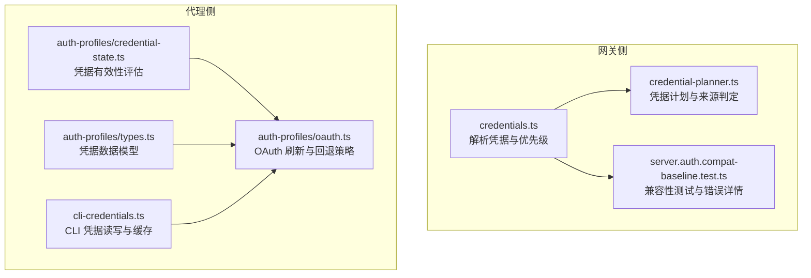
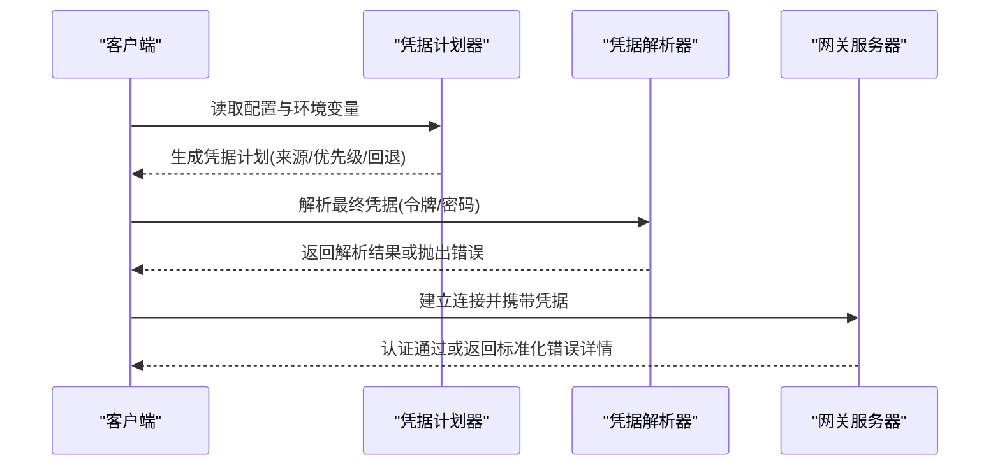
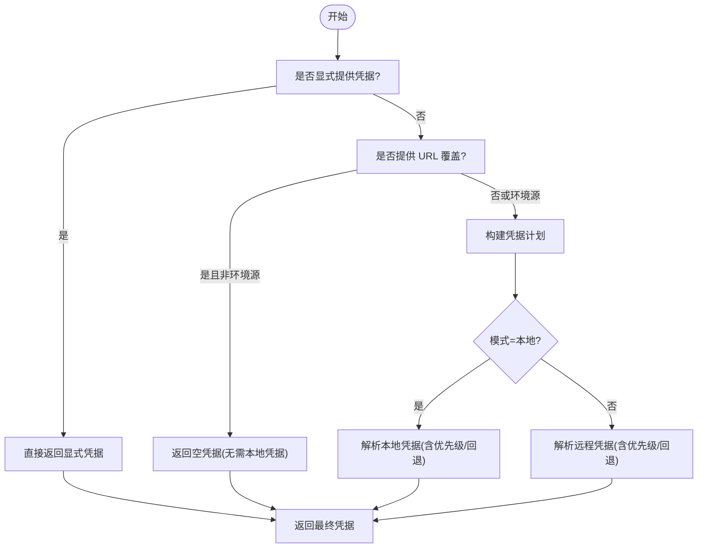
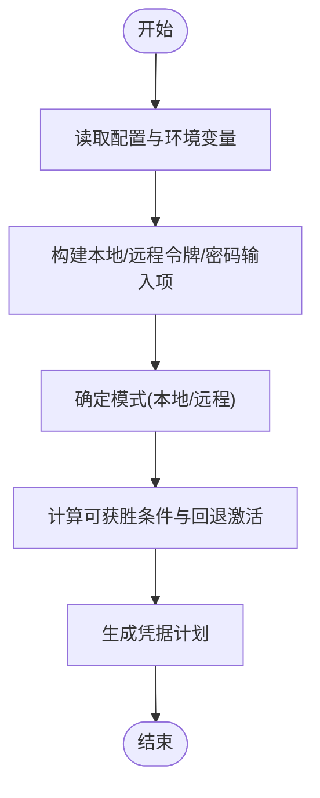
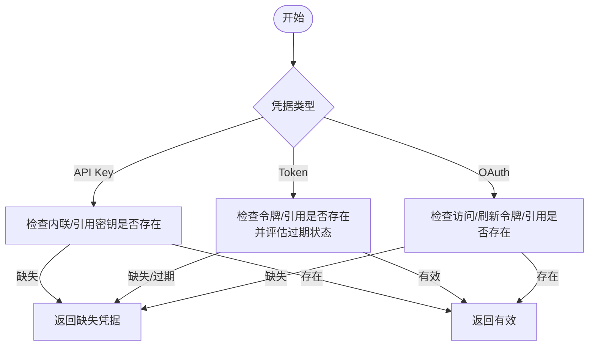
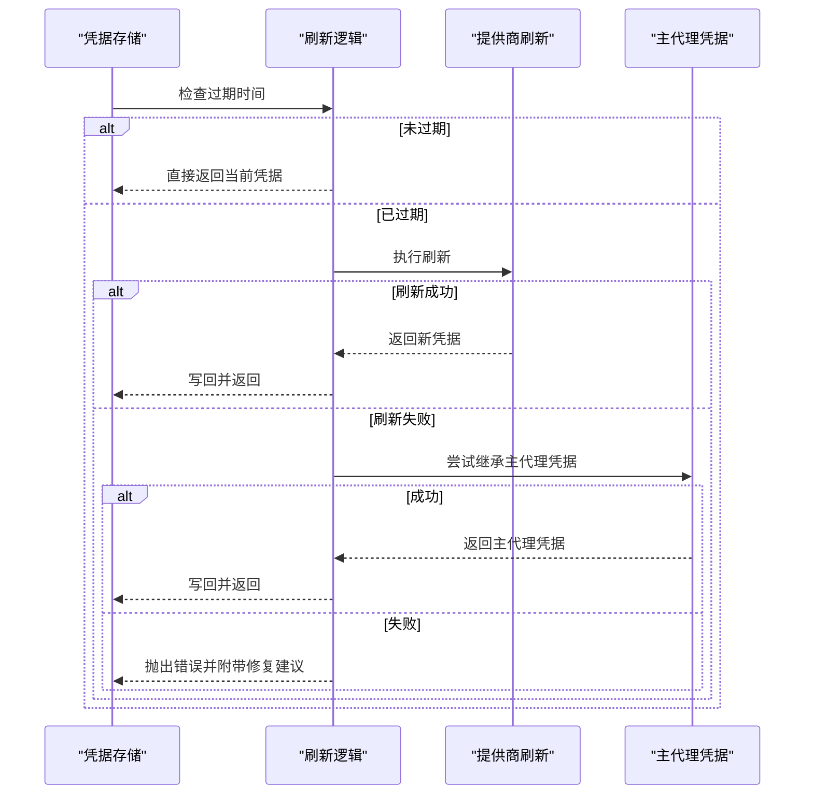
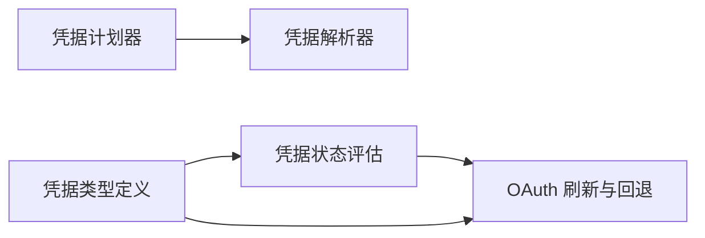

# 密码认证

<cite>
**本文引用的文件**
- [src/gateway/credentials.ts](file://src/gateway/credentials.ts)
- [src/gateway/credential-planner.ts](file://src/gateway/credential-planner.ts)
- [src/agents/auth-profiles/credential-state.ts](file://src/agents/auth-profiles/credential-state.ts)
- [src/agents/auth-profiles/oauth.ts](file://src/agents/auth-profiles/oauth.ts)
- [src/agents/auth-profiles/types.ts](file://src/agents/auth-profiles/types.ts)
- [src/agents/cli-credentials.ts](file://src/agents/cli-credentials.ts)
- [src/gateway/server.auth.compat-baseline.test.ts](file://src/gateway/server.auth.compat-baseline.test.ts)
- [src/commands/onboard-helpers.test.ts](file://src/commands/onboard-helpers.test.ts)
- [assets/chrome-extension/background.js](file://assets/chrome-extension/background.js)
- [assets/chrome-extension/options.js](file://assets/chrome-extension/options.js)
- [apps/macos/Sources/OpenClaw/GatewayEndpointStore.swift](file://apps/macos/Sources/OpenClaw/GatewayEndpointStore.swift)
- [apps/macos/Sources/OpenClaw/Launchctl.swift](file://apps/macos/Sources/OpenClaw/Launchctl.swift)
- [docker-compose.yml](file://docker-compose.yml)
- [docker-setup.sh](file://docker-setup.sh)
</cite>

## 目录
1. [简介](#简介)
2. [项目结构](#项目结构)
3. [核心组件](#核心组件)
4. [架构总览](#架构总览)
5. [详细组件分析](#详细组件分析)
6. [依赖关系分析](#依赖关系分析)
7. [性能考量](#性能考量)
8. [故障排查指南](#故障排查指南)
9. [结论](#结论)
10. [附录](#附录)

## 简介
本文件面向 OpenClaw 的“密码认证”能力，系统性阐述其工作原理、安全实现与使用方式。重点覆盖以下方面：
- 密码认证与 API 密钥认证的区别及适用场景
- 密码解析与验证流程（明文密码与加密密码的处理）
- 配置方法与环境变量设置
- 密码强度要求与安全最佳实践
- 失败处理机制与错误响应格式
- 配置示例与常见问题解决方案

## 项目结构
围绕密码认证的关键代码分布在网关侧与代理侧两大模块：
- 网关侧：负责接收连接请求并进行密码校验；支持从配置、环境变量与远程配置中解析凭据，并在失败时返回标准化错误详情。
- 代理侧：负责管理各类凭据类型（API Key、Bearer Token、OAuth），并提供凭据有效性评估与过期处理。

**图表来源**
- [src/gateway/credentials.ts:1-351](file://src/gateway/credentials.ts#L1-L351)
- [src/gateway/credential-planner.ts:1-217](file://src/gateway/credential-planner.ts#L1-L217)
- [src/gateway/server.auth.compat-baseline.test.ts:1-171](file://src/gateway/server.auth.compat-baseline.test.ts#L1-L171)
- [src/agents/auth-profiles/credential-state.ts:1-75](file://src/agents/auth-profiles/credential-state.ts#L1-L75)
- [src/agents/auth-profiles/oauth.ts:1-488](file://src/agents/auth-profiles/oauth.ts#L1-L488)
- [src/agents/auth-profiles/types.ts:1-82](file://src/agents/auth-profiles/types.ts#L1-L82)
- [src/agents/cli-credentials.ts:1-573](file://src/agents/cli-credentials.ts#L1-L573)

**章节来源**
- [src/gateway/credentials.ts:1-351](file://src/gateway/credentials.ts#L1-L351)
- [src/gateway/credential-planner.ts:1-217](file://src/gateway/credential-planner.ts#L1-L217)
- [src/agents/auth-profiles/credential-state.ts:1-75](file://src/agents/auth-profiles/credential-state.ts#L1-L75)
- [src/agents/auth-profiles/oauth.ts:1-488](file://src/agents/auth-profiles/oauth.ts#L1-L488)
- [src/agents/auth-profiles/types.ts:1-82](file://src/agents/auth-profiles/types.ts#L1-L82)
- [src/agents/cli-credentials.ts:1-573](file://src/agents/cli-credentials.ts#L1-L573)

## 核心组件
- 网关凭据解析器：负责从配置、环境变量与远程配置中解析“令牌模式”或“密码模式”的凭据，并在必要时抛出“密钥引用不可用”类错误，以避免在不支持的执行路径中使用密钥引用。
- 凭据计划器：根据配置与环境变量生成“凭据计划”，明确本地/远程凭据来源、可获胜条件与回退策略。
- 凭据状态评估：对 API Key、Bearer Token 与 OAuth 凭据进行有效性判断，包含过期时间检查与引用解析。
- OAuth 凭据刷新与回退：在令牌过期或刷新失败时，尝试回退到主代理凭据或特定提供商的刷新逻辑。
- CLI 凭据读写：提供跨平台的 CLI 凭据读取、写入与缓存，用于 OAuth 流程中的本地存储与复用。

**章节来源**
- [src/gateway/credentials.ts:1-351](file://src/gateway/credentials.ts#L1-L351)
- [src/gateway/credential-planner.ts:1-217](file://src/gateway/credential-planner.ts#L1-L217)
- [src/agents/auth-profiles/credential-state.ts:1-75](file://src/agents/auth-profiles/credential-state.ts#L1-L75)
- [src/agents/auth-profiles/oauth.ts:1-488](file://src/agents/auth-profiles/oauth.ts#L1-L488)
- [src/agents/cli-credentials.ts:1-573](file://src/agents/cli-credentials.ts#L1-L573)

## 架构总览
下图展示密码认证在客户端与网关之间的交互流程，以及失败时的错误详情返回机制。

**图表来源**
- [src/gateway/credential-planner.ts:137-217](file://src/gateway/credential-planner.ts#L137-L217)
- [src/gateway/credentials.ts:253-323](file://src/gateway/credentials.ts#L253-L323)
- [src/gateway/server.auth.compat-baseline.test.ts:141-166](file://src/gateway/server.auth.compat-baseline.test.ts#L141-L166)

## 详细组件分析

### 组件一：凭据解析与优先级（网关侧）
- 功能要点
  - 支持“令牌模式”和“密码模式”的凭据选择。
  - 允许显式传入凭据覆盖配置与环境变量。
  - 在远程模式下，支持“远程优先/环境优先/回退”等策略组合。
  - 对“密钥引用不可用”场景抛出专用错误，防止在不支持的命令路径中误用密钥引用。
- 关键行为
  - 本地与远程凭据来源的优先级由配置决定；当配置为“本地”时，优先使用本地配置与环境变量；当配置为“远程”时，优先考虑远程配置并按策略回退。
  - 当凭据为“密码模式”时，若未提供密码且无法从环境变量或远程配置获取，则不会自动切换到令牌模式，除非显式指定。

**图表来源**
- [src/gateway/credentials.ts:253-323](file://src/gateway/credentials.ts#L253-L323)

**章节来源**
- [src/gateway/credentials.ts:1-351](file://src/gateway/credentials.ts#L1-L351)

### 组件二：凭据计划器（来源判定与回退）
- 功能要点
  - 从配置与环境变量中识别“令牌/密码”的可用来源。
  - 判断“本地/远程”模式下的可获胜条件与回退激活状态。
  - 过滤掉包含未解析环境变量占位符的值，避免将占位符字符串误认为有效凭据。
- 安全要点
  - 使用“凭据裁剪”函数拒绝包含未解析占位符的值，降低凭据注入风险。

**图表来源**
- [src/gateway/credential-planner.ts:137-217](file://src/gateway/credential-planner.ts#L137-L217)

**章节来源**
- [src/gateway/credential-planner.ts:1-217](file://src/gateway/credential-planner.ts#L1-L217)

### 组件三：凭据有效性评估（代理侧）
- 功能要点
  - 对 API Key、Bearer Token 与 OAuth 凭据分别进行有效性评估。
  - Bearer Token 需满足“存在令牌或令牌引用”且“过期状态合法”。
  - OAuth 凭据需满足“存在访问令牌/刷新令牌或其引用”。
- 错误原因码
  - 缺失凭据、无效过期时间、已过期、引用未解析等。

**图表来源**
- [src/agents/auth-profiles/credential-state.ts:34-75](file://src/agents/auth-profiles/credential-state.ts#L34-L75)

**章节来源**
- [src/agents/auth-profiles/credential-state.ts:1-75](file://src/agents/auth-profiles/credential-state.ts#L1-L75)

### 组件四：OAuth 凭据刷新与回退（代理侧）
- 功能要点
  - 若令牌未过期，直接使用；若过期则尝试刷新。
  - 不同提供商有专门的刷新逻辑（如特定门户）。
  - 刷新失败时，尝试从主代理继承最新凭据，或回退到旧版默认配置。
  - 特定提供商（如某门户）在刷新失败时可使用访问令牌作为回退。
- 数据模型
  - 凭据类型统一为 OAuthCredentials，包含访问/刷新令牌与过期时间等字段。

**图表来源**
- [src/agents/auth-profiles/oauth.ts:154-211](file://src/agents/auth-profiles/oauth.ts#L154-L211)
- [src/agents/auth-profiles/oauth.ts:385-487](file://src/agents/auth-profiles/oauth.ts#L385-L487)

**章节来源**
- [src/agents/auth-profiles/oauth.ts:1-488](file://src/agents/auth-profiles/oauth.ts#L1-L488)
- [src/agents/auth-profiles/types.ts:29-34](file://src/agents/auth-profiles/types.ts#L29-L34)

### 组件五：CLI 凭据读写与缓存（代理侧）
- 功能要点
  - 提供跨平台的 OAuth 凭据读取（含钥匙串与文件两种来源）。
  - 支持凭据写入与缓存，减少重复读取与系统调用。
  - 对敏感操作采用安全的子进程调用方式，避免命令注入风险。
- 应用场景
  - 本地 CLI 登录后，将 OAuth 凭据持久化到用户目录或系统钥匙串，供后续请求复用。

**章节来源**
- [src/agents/cli-credentials.ts:1-573](file://src/agents/cli-credentials.ts#L1-L573)

### 组件六：密码认证失败处理与错误响应格式
- 行为特征
  - 在“密码模式”下，若密码不匹配，服务端返回稳定的错误详情码，包含“是否可重试设备令牌”与“推荐下一步”等信息。
  - 该机制确保客户端能一致地处理认证失败并引导用户采取正确修复动作。
- 参考测试
  - 测试覆盖了密码不匹配时的错误详情码与推荐步骤，保证兼容性与一致性。

**章节来源**
- [src/gateway/server.auth.compat-baseline.test.ts:141-166](file://src/gateway/server.auth.compat-baseline.test.ts#L141-L166)

## 依赖关系分析
- 网关侧依赖
  - 凭据解析器依赖凭据计划器提供的计划信息，结合显式参数与环境变量，最终输出“令牌/密码”。
  - 凭据解析器还依赖“密钥引用不可用”错误类型，以在不支持的命令路径中阻止密钥引用的误用。
- 代理侧依赖
  - 凭据状态评估依赖凭据类型定义与引用解析工具。
  - OAuth 刷新逻辑依赖提供商特定刷新实现与主代理凭据回退。

**图表来源**
- [src/gateway/credential-planner.ts:137-217](file://src/gateway/credential-planner.ts#L137-L217)
- [src/gateway/credentials.ts:253-323](file://src/gateway/credentials.ts#L253-L323)
- [src/agents/auth-profiles/credential-state.ts:34-75](file://src/agents/auth-profiles/credential-state.ts#L34-L75)
- [src/agents/auth-profiles/oauth.ts:305-487](file://src/agents/auth-profiles/oauth.ts#L305-L487)
- [src/agents/auth-profiles/types.ts:5-36](file://src/agents/auth-profiles/types.ts#L5-L36)

**章节来源**
- [src/gateway/credentials.ts:1-351](file://src/gateway/credentials.ts#L1-L351)
- [src/gateway/credential-planner.ts:1-217](file://src/gateway/credential-planner.ts#L1-L217)
- [src/agents/auth-profiles/credential-state.ts:1-75](file://src/agents/auth-profiles/credential-state.ts#L1-L75)
- [src/agents/auth-profiles/oauth.ts:1-488](file://src/agents/auth-profiles/oauth.ts#L1-L488)
- [src/agents/auth-profiles/types.ts:1-82](file://src/agents/auth-profiles/types.ts#L1-L82)

## 性能考量
- 凭据解析与优先级计算为轻量级操作，主要开销来自文件系统与环境变量读取。
- OAuth 刷新可能触发网络请求，应避免频繁刷新；可通过缓存与合理的过期策略降低刷新频率。
- CLI 凭据读写引入磁盘与系统调用，建议启用缓存以减少重复 IO。

## 故障排查指南
- 常见问题与定位
  - “密钥引用不可用”错误：在不支持解析密钥引用的命令路径中使用了密钥引用，需改为显式凭据或在支持的路径中运行。
  - 密码不匹配：服务端返回稳定错误详情码，包含“是否可重试设备令牌”与“推荐下一步”。请核对配置与环境变量中的密码值。
  - 密码输入校验失败：输入为空白或被判定为“undefined/null”字面量，需提供有效密码。
- 相关参考
  - 密钥引用不可用错误与抛出位置
  - 密码不匹配错误详情码与推荐步骤
  - 密码输入校验规则

**章节来源**
- [src/gateway/credentials.ts:36-77](file://src/gateway/credentials.ts#L36-L77)
- [src/gateway/server.auth.compat-baseline.test.ts:151-165](file://src/gateway/server.auth.compat-baseline.test.ts#L151-L165)
- [src/commands/onboard-helpers.test.ts:137-155](file://src/commands/onboard-helpers.test.ts#L137-L155)

## 结论
OpenClaw 的密码认证体系以“凭据计划器 + 凭据解析器”为核心，结合“凭据状态评估与 OAuth 刷新回退”，在保证安全性的同时提供了灵活的配置与回退策略。通过标准化的错误详情与严格的输入校验，系统能够稳定地处理认证失败并指导用户完成修复。

## 附录

### 密码认证与 API 密钥认证的区别与适用场景
- 密码认证
  - 适用于共享密码的网关连接场景，强调“一次性共享密码”的易用性。
  - 适合本地部署或受控网络环境，便于快速接入。
- API 密钥认证
  - 适用于面向提供商的 API 调用，强调细粒度权限与可审计性。
  - 适合多账户/多项目场景，便于轮换与隔离。

### 密码解析与验证流程（明文密码与加密密码）
- 明文密码
  - 从配置、环境变量或远程配置中解析；若为“密码模式”，未提供密码时不会自动切换到令牌模式。
  - 输入校验拒绝空白与“undefined/null”字面量。
- 加密密码
  - 若密码以密钥引用形式配置，解析器会在支持的命令路径中解析引用；否则抛出“密钥引用不可用”错误。

**章节来源**
- [src/gateway/credentials.ts:79-106](file://src/gateway/credentials.ts#L79-L106)
- [src/gateway/credential-planner.ts:68-81](file://src/gateway/credential-planner.ts#L68-L81)
- [src/commands/onboard-helpers.test.ts:137-155](file://src/commands/onboard-helpers.test.ts#L137-L155)

### 配置方法与环境变量设置
- 网关侧
  - 令牌模式：设置“gateway.auth.token”或环境变量“OPENCLAW_GATEWAY_TOKEN”（兼容“CLAWDBOT_GATEWAY_TOKEN”）。
  - 密码模式：设置“gateway.auth.password”或环境变量“OPENCLAW_GATEWAY_PASSWORD”（兼容“CLAWDBOT_GATEWAY_PASSWORD”）。
  - 远程模式：可从“gateway.remote.token/password”或环境变量中读取。
- 客户端与浏览器扩展
  - 浏览器扩展通过“x-openclaw-relay-token”头进行中继认证，需先保存网关令牌并在本地校验可达性。
  - macOS 客户端在启动脚本与界面中读取上述环境变量，优先使用 OPENCLAW_GATEWAY_PASSWORD。
- Docker
  - docker-compose 中可挂载 OPENCLAW_GATEWAY_TOKEN 或 OPENCLAW_GATEWAY_PASSWORD。

**章节来源**
- [src/gateway/credential-planner.ts:83-117](file://src/gateway/credential-planner.ts#L83-L117)
- [assets/chrome-extension/background.js:393-400](file://assets/chrome-extension/background.js#L393-L400)
- [assets/chrome-extension/options.js:25-69](file://assets/chrome-extension/options.js#L25-L69)
- [apps/macos/Sources/OpenClaw/GatewayEndpointStore.swift:86-94](file://apps/macos/Sources/OpenClaw/GatewayEndpointStore.swift#L86-L94)
- [apps/macos/Sources/OpenClaw/Launchctl.swift:61-62](file://apps/macos/Sources/OpenClaw/Launchctl.swift#L61-L62)
- [docker-compose.yml:1-10](file://docker-compose.yml#L1-L10)
- [docker-setup.sh:80-100](file://docker-setup.sh#L80-L100)

### 密码强度要求与安全最佳实践
- 强度要求
  - 避免使用“undefined/null”字面量作为密码值；输入必须非空白。
- 最佳实践
  - 优先使用环境变量而非硬编码配置；在生产环境中优先使用 OPENCLAW_GATEWAY_PASSWORD。
  - 对于远程网关调用，尽量使用令牌模式并配合最小权限范围。
  - 定期轮换密码与令牌，避免长期不变。

**章节来源**
- [src/commands/onboard-helpers.test.ts:137-155](file://src/commands/onboard-helpers.test.ts#L137-L155)
- [apps/macos/Sources/OpenClaw/GatewayEndpointStore.swift:238-238](file://apps/macos/Sources/OpenClaw/GatewayEndpointStore.swift#L238-L238)

### 密码认证失败的处理机制与错误响应格式
- 错误详情码
  - 密码不匹配：返回稳定错误详情码，包含“是否可重试设备令牌”与“推荐下一步”。
- 响应格式
  - 服务端在认证失败时返回结构化的错误详情对象，客户端据此提示用户更新凭据或重新登录。

**章节来源**
- [src/gateway/server.auth.compat-baseline.test.ts:151-165](file://src/gateway/server.auth.compat-baseline.test.ts#L151-L165)

### 配置示例与常见问题解决方案
- 示例
  - 设置 OPENCLAW_GATEWAY_PASSWORD 并在 macOS 启动脚本中读取。
  - 在 docker-compose 中挂载 OPENCLAW_GATEWAY_TOKEN。
- 解决方案
  - 若出现“密钥引用不可用”错误，请改用显式凭据或在支持的命令路径中运行。
  - 若密码不匹配，请核对配置与环境变量中的密码值，并遵循输入校验规则。

**章节来源**
- [apps/macos/Sources/OpenClaw/Launchctl.swift:61-62](file://apps/macos/Sources/OpenClaw/Launchctl.swift#L61-L62)
- [docker-compose.yml:1-10](file://docker-compose.yml#L1-L10)
- [src/gateway/credentials.ts:36-77](file://src/gateway/credentials.ts#L36-L77)
- [src/commands/onboard-helpers.test.ts:137-155](file://src/commands/onboard-helpers.test.ts#L137-L155)