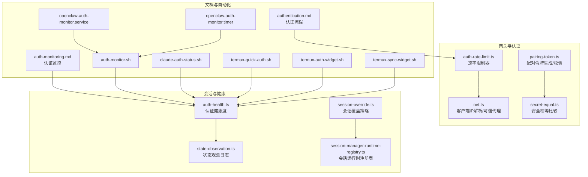
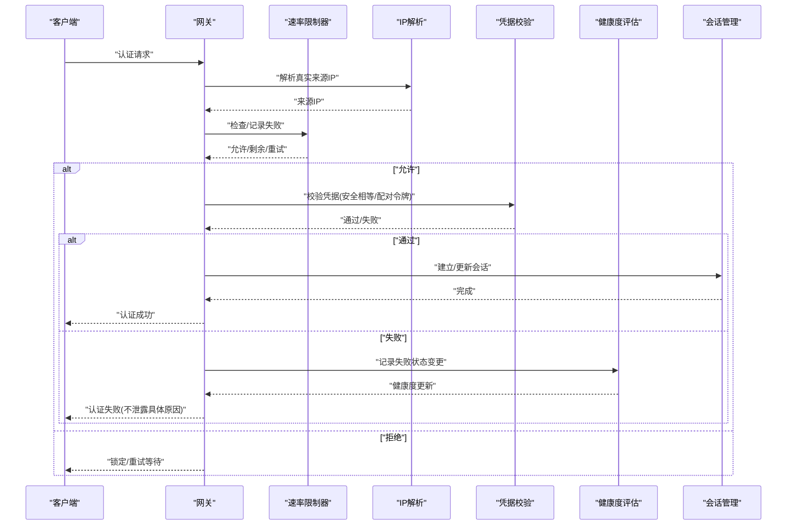
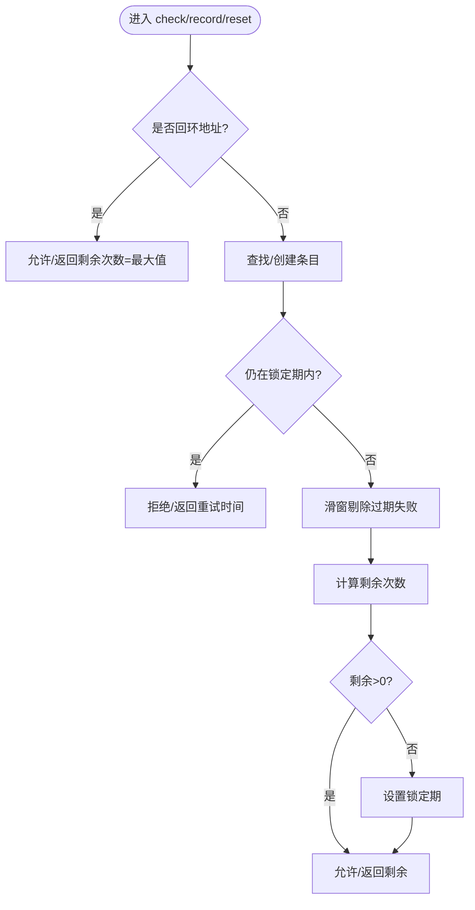
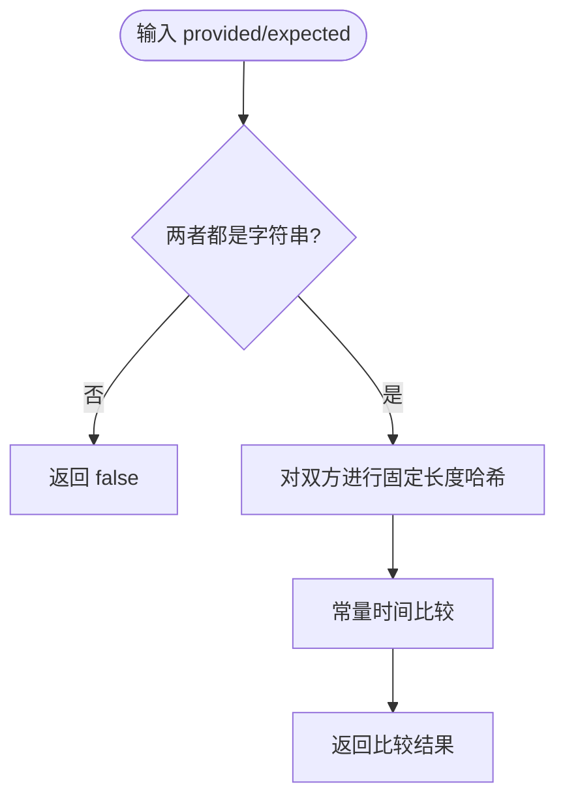
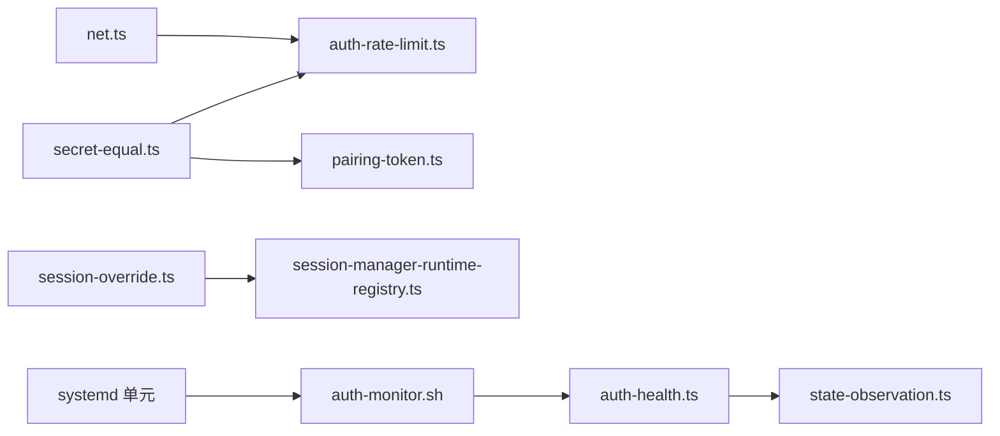

# 认证安全机制

<cite>
**本文引用的文件**
- [src/gateway/auth-rate-limit.ts](file://src/gateway/auth-rate-limit.ts)
- [src/security/secret-equal.ts](file://src/security/secret-equal.ts)
- [src/infra/pairing-token.ts](file://src/infra/pairing-token.ts)
- [src/gateway/net.ts](file://src/gateway/net.ts)
- [docs/gateway/authentication.md](file://docs/gateway/authentication.md)
- [docs/automation/auth-monitoring.md](file://docs/automation/auth-monitoring.md)
- [src/agents/auth-health.ts](file://src/agents/auth-health.ts)
- [src/agents/auth-profiles/state-observation.ts](file://src/agents/auth-profiles/state-observation.ts)
- [src/agents/auth-profiles/session-override.ts](file://src/agents/auth-profiles/session-override.ts)
- [src/agents/pi-extensions/session-manager-runtime-registry.ts](file://src/agents/pi-extensions/session-manager-runtime-registry.ts)
- [docs/security/CONTRIBUTING-THREAT-MODEL.md](file://docs/security/CONTRIBUTING-THREAT-MODEL.md)
- [docs/security/THREAT-MODEL-ATLAS.md](file://docs/security/THREAT-MODEL-ATLAS.md)
- [scripts/systemd/openclaw-auth-monitor.service](file://scripts/systemd/openclaw-auth-monitor.service)
- [scripts/systemd/openclaw-auth-monitor.timer](file://scripts/systemd/openclaw-auth-monitor.timer)
- [scripts/auth-monitor.sh](file://scripts/auth-monitor.sh)
- [scripts/claude-auth-status.sh](file://scripts/claude-auth-status.sh)
- [scripts/termux-quick-auth.sh](file://scripts/termux-quick-auth.sh)
- [scripts/termux-auth-widget.sh](file://scripts/termux-auth-widget.sh)
- [scripts/termux-sync-widget.sh](file://scripts/termux-sync-widget.sh)
</cite>

## 目录
1. [简介](#简介)
2. [项目结构](#项目结构)
3. [核心组件](#核心组件)
4. [架构总览](#架构总览)
5. [详细组件分析](#详细组件分析)
6. [依赖分析](#依赖分析)
7. [性能考量](#性能考量)
8. [故障排查指南](#故障排查指南)
9. [结论](#结论)
10. [附录](#附录)

## 简介
本文件面向 OpenClaw 的认证安全机制，系统性阐述认证过程中的安全防护（时序攻击防护、速率限制）、安全相等比较函数的实现与安全性保证、认证失败处理与错误信息设计、认证会话的安全管理与生命周期控制、威胁模型与防护策略、审计与监控方法，以及与其他安全组件的协作关系，并提供漏洞扫描与渗透测试建议。

## 项目结构
围绕认证安全的关键代码与文档分布如下：
- 网关侧认证速率限制：src/gateway/auth-rate-limit.ts
- 安全相等比较：src/security/secret-equal.ts
- 设备配对令牌生成与校验：src/infra/pairing-token.ts
- 客户端 IP 解析与可信代理处理：src/gateway/net.ts
- 文档：认证流程与最佳实践（docs/gateway/authentication.md），认证监控（docs/automation/auth-monitoring.md）
- 认证健康度与告警：src/agents/auth-health.ts、src/agents/auth-profiles/state-observation.ts
- 会话与覆盖策略：src/agents/auth-profiles/session-override.ts、src/agents/pi-extensions/session-manager-runtime-registry.ts
- 威胁模型与贡献指南：docs/security/THREAT-MODEL-ATLAS.md、docs/security/CONTRIBUTING-THREAT-MODEL.md
- 自动化脚本与 systemd 单元：scripts/systemd/*、scripts/auth-monitor.sh、scripts/claude-auth-status.sh、scripts/termux-* 等

图表来源
- [src/gateway/auth-rate-limit.ts:1-233](file://src/gateway/auth-rate-limit.ts#L1-L233)
- [src/gateway/net.ts:1-457](file://src/gateway/net.ts#L1-L457)
- [src/security/secret-equal.ts:1-13](file://src/security/secret-equal.ts#L1-L13)
- [src/infra/pairing-token.ts:1-13](file://src/infra/pairing-token.ts#L1-L13)
- [src/agents/auth-health.ts:48-197](file://src/agents/auth-health.ts#L48-L197)
- [src/agents/auth-profiles/state-observation.ts:1-35](file://src/agents/auth-profiles/state-observation.ts#L1-L35)
- [src/agents/auth-profiles/session-override.ts:130-151](file://src/agents/auth-profiles/session-override.ts#L130-L151)
- [src/agents/pi-extensions/session-manager-runtime-registry.ts:1-29](file://src/agents/pi-extensions/session-manager-runtime-registry.ts#L1-L29)
- [docs/gateway/authentication.md:1-180](file://docs/gateway/authentication.md#L1-L180)
- [docs/automation/auth-monitoring.md:1-45](file://docs/automation/auth-monitoring.md#L1-L45)

章节来源
- [src/gateway/auth-rate-limit.ts:1-233](file://src/gateway/auth-rate-limit.ts#L1-L233)
- [src/security/secret-equal.ts:1-13](file://src/security/secret-equal.ts#L1-L13)
- [src/infra/pairing-token.ts:1-13](file://src/infra/pairing-token.ts#L1-L13)
- [src/gateway/net.ts:1-457](file://src/gateway/net.ts#L1-L457)
- [docs/gateway/authentication.md:1-180](file://docs/gateway/authentication.md#L1-L180)
- [docs/automation/auth-monitoring.md:1-45](file://docs/automation/auth-monitoring.md#L1-L45)
- [src/agents/auth-health.ts:48-197](file://src/agents/auth-health.ts#L48-L197)
- [src/agents/auth-profiles/state-observation.ts:1-35](file://src/agents/auth-profiles/state-observation.ts#L1-L35)
- [src/agents/auth-profiles/session-override.ts:130-151](file://src/agents/auth-profiles/session-override.ts#L130-L151)
- [src/agents/pi-extensions/session-manager-runtime-registry.ts:1-29](file://src/agents/pi-extensions/session-manager-runtime-registry.ts#L1-L29)

## 核心组件
- 速率限制器：基于滑动窗口的内存计数器，按作用域（如共享密钥、设备令牌）独立统计失败次数，支持锁定期与周期清理，避免本地回环地址被限流。
- 安全相等比较：使用固定长度哈希与常量时间比较，抵御时序侧信道攻击。
- 配对令牌：使用安全随机源生成，验证采用安全相等比较。
- 客户端 IP 解析：在可信代理链中解析真实来源 IP，严格模式下未识别到可信代理时不回退至代理 IP，防止误判。
- 认证健康度与观测：对 OAuth 等凭据状态进行健康评估与冷却/禁用窗口管理；记录失败状态变更用于审计。
- 会话管理：会话级运行时注册表与覆盖策略，确保会话内凭据选择与持久化的一致性。

章节来源
- [src/gateway/auth-rate-limit.ts:25-72](file://src/gateway/auth-rate-limit.ts#L25-L72)
- [src/security/secret-equal.ts:3-12](file://src/security/secret-equal.ts#L3-L12)
- [src/infra/pairing-token.ts:6-12](file://src/infra/pairing-token.ts#L6-L12)
- [src/gateway/net.ts:156-185](file://src/gateway/net.ts#L156-L185)
- [src/agents/auth-health.ts:80-197](file://src/agents/auth-health.ts#L80-L197)
- [src/agents/auth-profiles/state-observation.ts:8-35](file://src/agents/auth-profiles/state-observation.ts#L8-L35)
- [src/agents/auth-profiles/session-override.ts:130-151](file://src/agents/auth-profiles/session-override.ts#L130-L151)
- [src/agents/pi-extensions/session-manager-runtime-registry.ts:1-29](file://src/agents/pi-extensions/session-manager-runtime-registry.ts#L1-L29)

## 架构总览
认证安全由“输入解析—速率限制—凭据校验—健康评估—会话管理—监控告警”构成闭环。外部请求进入网关后，先通过可信代理解析真实来源 IP 并应用速率限制；随后进行凭据校验（含安全相等比较与配对令牌校验）；成功则重置计数并进入会话；失败则记录失败并可能触发冷却/禁用窗口；同时健康度模块持续评估凭据状态，自动化脚本与 systemd 定时任务负责监控与告警。

图表来源
- [src/gateway/net.ts:156-185](file://src/gateway/net.ts#L156-L185)
- [src/gateway/auth-rate-limit.ts:141-172](file://src/gateway/auth-rate-limit.ts#L141-L172)
- [src/security/secret-equal.ts:3-12](file://src/security/secret-equal.ts#L3-L12)
- [src/infra/pairing-token.ts:10-12](file://src/infra/pairing-token.ts#L10-L12)
- [src/agents/auth-health.ts:80-197](file://src/agents/auth-health.ts#L80-L197)
- [src/agents/auth-profiles/state-observation.ts:8-35](file://src/agents/auth-profiles/state-observation.ts#L8-L35)

## 详细组件分析

### 组件A：认证速率限制器
- 设计要点
  - 滑动窗口：按毫秒时间戳维护最近失败尝试，窗口外自动剔除。
  - 锁定机制：超过阈值后进入锁定期，期间直接拒绝请求。
  - 作用域隔离：支持多作用域（默认、共享密钥、设备令牌、钩子认证）独立计数。
  - 本地豁免：默认豁免回环地址，避免本地调试被锁。
  - 清理策略：定时清理过期条目，避免内存膨胀。
- 复杂度
  - 检查/记录/重置均为摊销 O(1)，清理时遍历 Map，最坏 O(n)。
- 安全性
  - 仅内存态，无持久化，避免被绕过或预测。
  - 通过标准化客户端 IP 表示，统一计数维度，减少绕过可能。

图表来源
- [src/gateway/auth-rate-limit.ts:141-204](file://src/gateway/auth-rate-limit.ts#L141-L204)

章节来源
- [src/gateway/auth-rate-limit.ts:1-233](file://src/gateway/auth-rate-limit.ts#L1-L233)

### 组件B：安全相等比较函数
- 实现原理
  - 对输入字符串分别进行固定长度哈希，再使用常量时间比较函数进行对比。
  - 非字符串输入直接判定不匹配，避免类型混淆。
- 安全性保证
  - 抵御时序侧信道攻击，使比较耗时与输入差异无关。
  - 通过哈希消除长度泄漏风险。
- 使用场景
  - 配对令牌校验、共享密钥比对、敏感字符串比较。

图表来源
- [src/security/secret-equal.ts:3-12](file://src/security/secret-equal.ts#L3-L12)

章节来源
- [src/security/secret-equal.ts:1-13](file://src/security/secret-equal.ts#L1-L13)

### 组件C：配对令牌生成与校验
- 生成
  - 使用安全随机源生成指定字节数的令牌，编码为 URL 安全字符串。
- 校验
  - 采用安全相等比较，避免时序泄漏。
- 安全性
  - 令牌长度与熵满足强随机要求，校验阶段不暴露中间值。

章节来源
- [src/infra/pairing-token.ts:1-13](file://src/infra/pairing-token.ts#L1-L13)
- [src/security/secret-equal.ts:3-12](file://src/security/secret-equal.ts#L3-L12)

### 组件D：客户端 IP 解析与可信代理
- 功能
  - 在存在可信代理链时，从头部解析真实来源 IP；若未配置可信代理或头部不可信，则直接使用远端地址。
  - 严格模式下不回退至代理自身 IP，避免误判本地请求。
- 安全性
  - 防止通过伪造头部绕过速率限制与访问控制。
  - 支持 IPv4/IPv6、带方括号的 IPv6 字面量与可选端口剥离。

章节来源
- [src/gateway/net.ts:156-185](file://src/gateway/net.ts#L156-L185)

### 组件E：认证健康度与失败观测
- 健康度
  - 对 OAuth 凭据按到期时间与宽限期计算状态（缺失/已过期/即将过期/正常）。
  - 若具备刷新令牌且处于将过期/已过期状态，首次调用即自动续期，不再提示即将过期。
- 观测与日志
  - 记录失败原因、前/后状态、冷却/禁用窗口是否复用等，便于审计与定位。
- 会话覆盖
  - 自动覆盖策略仅在必要时持久化，避免频繁写入。

章节来源
- [src/agents/auth-health.ts:80-197](file://src/agents/auth-health.ts#L80-L197)
- [src/agents/auth-profiles/state-observation.ts:8-35](file://src/agents/auth-profiles/state-observation.ts#L8-L35)
- [src/agents/auth-profiles/session-override.ts:130-151](file://src/agents/auth-profiles/session-override.ts#L130-L151)

### 组件F：会话管理与运行时注册表
- 运行时注册表
  - 基于对象身份的弱映射，确保同一会话管理实例在 set/get 间保持稳定。
- 会话覆盖
  - 自动覆盖策略与持久化写入解耦，仅在必要时更新存储。

章节来源
- [src/agents/pi-extensions/session-manager-runtime-registry.ts:1-29](file://src/agents/pi-extensions/session-manager-runtime-registry.ts#L1-L29)
- [src/agents/auth-profiles/session-override.ts:130-151](file://src/agents/auth-profiles/session-override.ts#L130-L151)

## 依赖分析
- 组件耦合
  - 速率限制器与 IP 解析紧密耦合，前者依赖后者提供的标准化来源 IP。
  - 安全相等比较被配对令牌与多种凭据校验路径复用，形成统一的安全基元。
  - 健康度与观测模块依赖会话状态与凭据存储，形成闭环反馈。
- 外部依赖
  - Node.js crypto 模块（哈希与常量时间比较）。
  - systemd 与 shell 脚本用于自动化监控与告警。

图表来源
- [src/gateway/net.ts:156-185](file://src/gateway/net.ts#L156-L185)
- [src/gateway/auth-rate-limit.ts:141-172](file://src/gateway/auth-rate-limit.ts#L141-L172)
- [src/security/secret-equal.ts:3-12](file://src/security/secret-equal.ts#L3-L12)
- [src/infra/pairing-token.ts:10-12](file://src/infra/pairing-token.ts#L10-L12)
- [src/agents/auth-health.ts:80-197](file://src/agents/auth-health.ts#L80-L197)
- [src/agents/auth-profiles/state-observation.ts:8-35](file://src/agents/auth-profiles/state-observation.ts#L8-L35)
- [src/agents/auth-profiles/session-override.ts:130-151](file://src/agents/auth-profiles/session-override.ts#L130-L151)
- [src/agents/pi-extensions/session-manager-runtime-registry.ts:1-29](file://src/agents/pi-extensions/session-manager-runtime-registry.ts#L1-L29)

## 性能考量
- 速率限制器
  - 内存 Map 存储，检查/记录摊销 O(1)，清理 O(n)；默认每分钟清理一次，适合单进程网关。
  - 滑窗剔除成本低，但极端高并发下需关注清理频率与内存占用。
- 安全相等比较
  - 双次哈希与常量时间比较带来固定开销，但避免了时序泄漏，适合认证关键路径。
- 健康度评估
  - 基于内存状态与简单时间计算，复杂度低；建议批量输出与缓存结果以减少 I/O。

## 故障排查指南
- 认证失败
  - 检查速率限制：确认是否被锁定或接近上限；查看剩余次数与重试时间。
  - 检查来源 IP：在可信代理环境下确认头部是否正确传递，避免误判。
  - 检查凭据：核对令牌/密钥格式与有效期；使用健康度命令查看状态。
- 监控与告警
  - 使用 systemd 定时任务与脚本定期检查 OAuth 状态，异常时发送通知。
  - 通过 CLI 退出码快速判断凭据状态（0 正常、1 缺失/过期、2 即将过期）。

章节来源
- [src/gateway/auth-rate-limit.ts:141-172](file://src/gateway/auth-rate-limit.ts#L141-L172)
- [src/gateway/net.ts:156-185](file://src/gateway/net.ts#L156-L185)
- [docs/automation/auth-monitoring.md:20-26](file://docs/automation/auth-monitoring.md#L20-L26)
- [scripts/systemd/openclaw-auth-monitor.timer](file://scripts/systemd/openclaw-auth-monitor.timer)
- [scripts/auth-monitor.sh](file://scripts/auth-monitor.sh)

## 结论
OpenClaw 的认证安全机制通过“常量时间比较 + 滑动窗口速率限制 + 可信代理解析 + 健康度与观测 + 会话管理 + 自动化监控”的组合，有效缓解时序攻击与暴力破解风险，并提供可观测、可恢复的认证体验。建议在生产环境启用可信代理与严格的绑定策略，配合自动化监控与定期审计，持续提升整体安全态势。

## 附录

### 威胁模型与防护策略
- 威胁来源
  - 暴力破解与字典攻击（可通过速率限制与锁定缓解）。
  - 时序侧信道（通过常量时间比较缓解）。
  - 代理链伪造（通过可信代理解析与严格模式缓解）。
  - 凭据泄露与滥用（通过健康度评估与自动化轮换缓解）。
- 防护策略
  - 强制速率限制与锁定窗口。
  - 统一使用安全相等比较。
  - 严格可信代理链与来源 IP 解析。
  - 健康度评估与冷却/禁用窗口。
  - 自动化监控与告警。

章节来源
- [docs/security/THREAT-MODEL-ATLAS.md:154-435](file://docs/security/THREAT-MODEL-ATLAS.md#L154-L435)
- [docs/security/CONTRIBUTING-THREAT-MODEL.md:1-91](file://docs/security/CONTRIBUTING-THREAT-MODEL.md#L1-L91)

### 审计与监控方法
- CLI 健康检查
  - 使用健康度命令与退出码快速定位问题。
- 自动化脚本
  - systemd 定时任务执行监控脚本，发送通知或触发重认证。
- 日志与观测
  - 失败状态变更日志包含原因、前后状态与窗口复用情况，便于审计。

章节来源
- [docs/automation/auth-monitoring.md:14-45](file://docs/automation/auth-monitoring.md#L14-L45)
- [scripts/systemd/openclaw-auth-monitor.service](file://scripts/systemd/openclaw-auth-monitor.service)
- [scripts/systemd/openclaw-auth-monitor.timer](file://scripts/systemd/openclaw-auth-monitor.timer)
- [scripts/auth-monitor.sh](file://scripts/auth-monitor.sh)
- [scripts/claude-auth-status.sh](file://scripts/claude-auth-status.sh)
- [scripts/termux-quick-auth.sh](file://scripts/termux-quick-auth.sh)
- [scripts/termux-auth-widget.sh](file://scripts/termux-auth-widget.sh)
- [scripts/termux-sync-widget.sh](file://scripts/termux-sync-widget.sh)
- [src/agents/auth-profiles/state-observation.ts:8-35](file://src/agents/auth-profiles/state-observation.ts#L8-L35)

### 与系统其他安全组件的协作
- 与网络层协作：IP 解析与可信代理确保来源可信，为速率限制提供准确依据。
- 与凭据存储协作：健康度评估与自动轮换降低凭据泄露影响面。
- 与会话层协作：会话覆盖与运行时注册表保障会话内一致性与最小持久化。

章节来源
- [src/gateway/net.ts:156-185](file://src/gateway/net.ts#L156-L185)
- [src/agents/auth-health.ts:80-197](file://src/agents/auth-health.ts#L80-L197)
- [src/agents/auth-profiles/session-override.ts:130-151](file://src/agents/auth-profiles/session-override.ts#L130-L151)
- [src/agents/pi-extensions/session-manager-runtime-registry.ts:1-29](file://src/agents/pi-extensions/session-manager-runtime-registry.ts#L1-L29)

### 漏洞扫描与渗透测试指南
- 扫描范围
  - 认证接口（速率限制边界、锁定绕过、来源 IP 伪造）。
  - 凭据校验（时序侧信道、长度泄漏、类型混淆）。
  - 会话与健康度（状态持久化、覆盖策略、冷却/禁用窗口）。
- 测试建议
  - 使用代理链模拟不同来源 IP，验证速率限制与访问控制。
  - 针对安全相等比较进行时序测试，确保常量时间行为。
  - 验证健康度评估在刷新令牌场景下的自动续期逻辑。
- 工具与脚本
  - 结合 CLI 与自动化脚本进行端到端回归测试。

章节来源
- [src/gateway/auth-rate-limit.ts:141-204](file://src/gateway/auth-rate-limit.ts#L141-L204)
- [src/security/secret-equal.ts:3-12](file://src/security/secret-equal.ts#L3-L12)
- [src/agents/auth-health.ts:80-197](file://src/agents/auth-health.ts#L80-L197)
- [docs/automation/auth-monitoring.md:14-45](file://docs/automation/auth-monitoring.md#L14-L45)