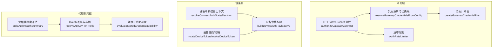
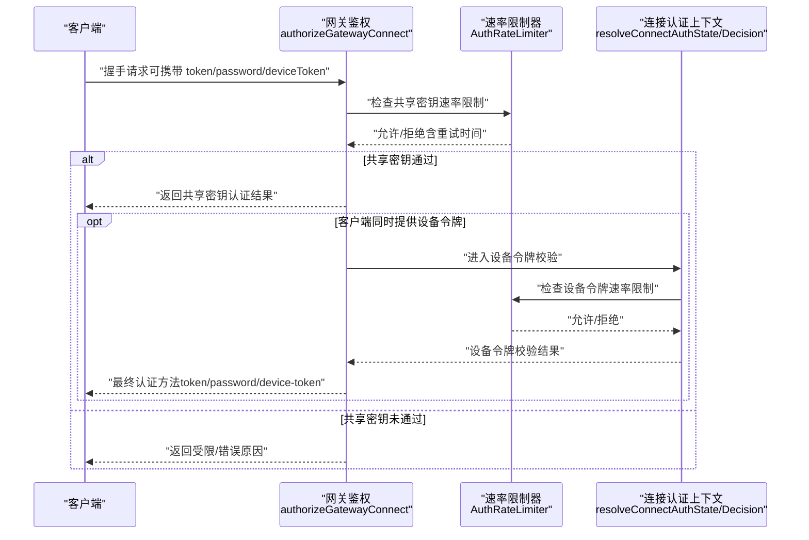
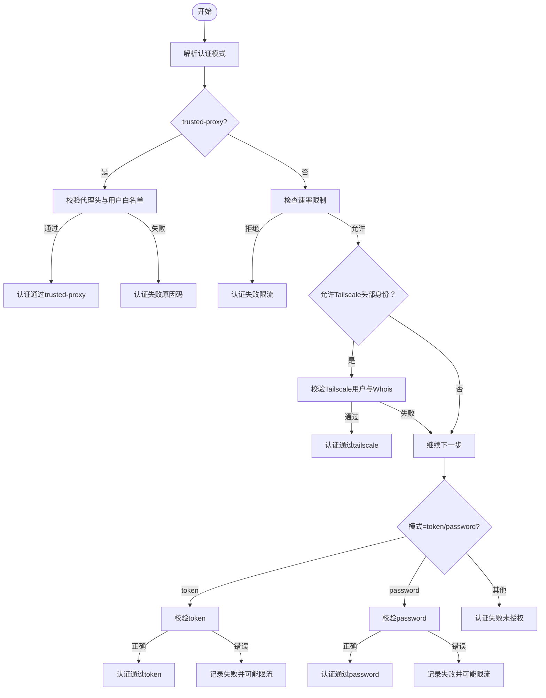
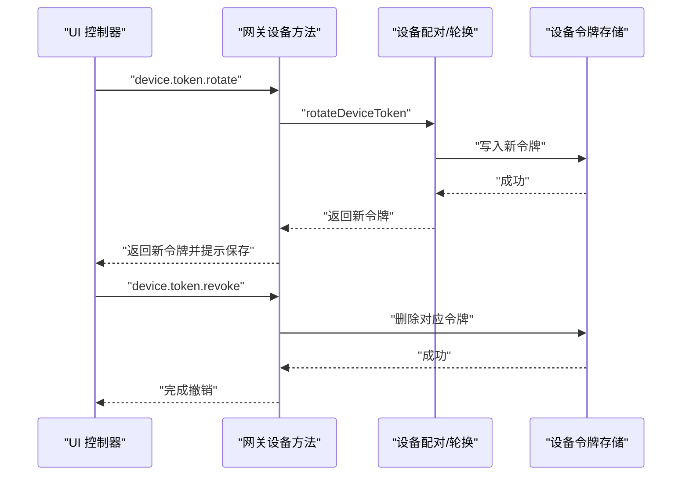
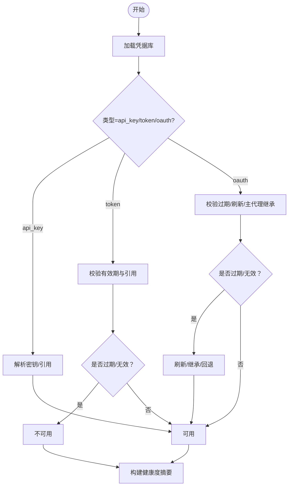
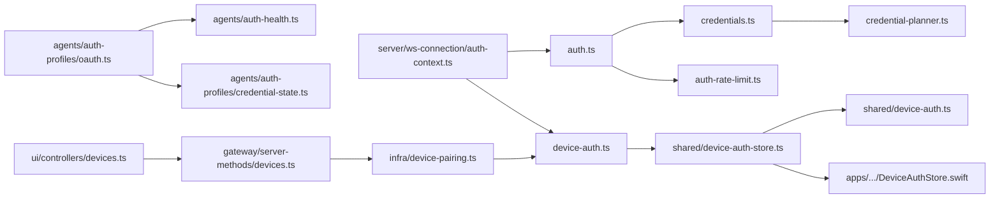

# 认证系统

<cite>
**本文引用的文件**
- [src/gateway/auth.ts](file://src/gateway/auth.ts)
- [src/gateway/credentials.ts](file://src/gateway/credentials.ts)
- [src/gateway/credential-planner.ts](file://src/gateway/credential-planner.ts)
- [src/gateway/auth-rate-limit.ts](file://src/gateway/auth-rate-limit.ts)
- [src/gateway/server/ws-connection/auth-context.ts](file://src/gateway/server/ws-connection/auth-context.ts)
- [src/gateway/device-auth.ts](file://src/gateway/device-auth.ts)
- [src/shared/device-auth.ts](file://src/shared/device-auth.ts)
- [src/shared/device-auth-store.ts](file://src/shared/device-auth-store.ts)
- [apps/shared/OpenClawKit/Sources/OpenClawKit/DeviceAuthStore.swift](file://apps/shared/OpenClawKit/Sources/OpenClawKit/DeviceAuthStore.swift)
- [src/agents/auth-health.ts](file://src/agents/auth-health.ts)
- [src/agents/auth-profiles/oauth.ts](file://src/agents/auth-profiles/oauth.ts)
- [src/agents/auth-profiles/credential-state.ts](file://src/agents/auth-profiles/credential-state.ts)
- [src/infra/device-pairing.ts](file://src/infra/device-pairing.ts)
- [src/gateway/server-methods/devices.ts](file://src/gateway/server-methods/devices.ts)
- [ui/src/ui/controllers/devices.ts](file://ui/src/ui/controllers/devices.ts)
- [docs/concepts/oauth.md](file://docs/concepts/oauth.md)
- [docs/reference/secretref-credential-surface.md](file://docs/reference/secretref-credential-surface.md)
</cite>

## 目录
1. [简介](#简介)
2. [项目结构](#项目结构)
3. [核心组件](#核心组件)
4. [架构总览](#架构总览)
5. [详细组件分析](#详细组件分析)
6. [依赖关系分析](#依赖关系分析)
7. [性能考量](#性能考量)
8. [故障排查指南](#故障排查指南)
9. [结论](#结论)
10. [附录](#附录)

## 简介
本文件面向 OpenClaw 的认证系统，系统性阐述多类认证方式与实现：API 密钥认证、OAuth 流程（含刷新）、设备令牌与会话认证；详解令牌生成、验证与轮换机制；总结凭据管理策略（存储、加密与安全传输）；解释连接认证的握手协议、认证上下文与会话生命周期；给出认证失败处理与重试策略；并覆盖不同渠道的认证差异与适配方案，最后提供配置示例与故障排除指引。

## 项目结构
OpenClaw 的认证体系由“网关层认证”“设备侧认证”“代理侧凭据管理”三部分协同构成：
- 网关层认证：负责 HTTP/WebSocket 连接鉴权、共享密钥（token/password）与可信代理/隧道身份映射。
- 设备侧认证：负责设备身份与设备令牌的生成、校验与轮换。
- 代理侧凭据管理：负责 OAuth/Token/API Key 的存储、有效期判定与自动刷新。

**图表来源**
- [src/gateway/auth.ts:378-503](file://src/gateway/auth.ts#L378-L503)
- [src/gateway/credentials.ts:253-351](file://src/gateway/credentials.ts#L253-L351)
- [src/gateway/credential-planner.ts:137-217](file://src/gateway/credential-planner.ts#L137-L217)
- [src/gateway/auth-rate-limit.ts:95-233](file://src/gateway/auth-rate-limit.ts#L95-L233)
- [src/gateway/server/ws-connection/auth-context.ts:75-218](file://src/gateway/server/ws-connection/auth-context.ts#L75-L218)
- [src/gateway/device-auth.ts:20-54](file://src/gateway/device-auth.ts#L20-L54)
- [src/infra/device-pairing.ts:572-612](file://src/infra/device-pairing.ts#L572-L612)
- [src/agents/auth-profiles/oauth.ts:305-487](file://src/agents/auth-profiles/oauth.ts#L305-L487)
- [src/agents/auth-health.ts:187-283](file://src/agents/auth-health.ts#L187-L283)
- [src/agents/auth-profiles/credential-state.ts:34-75](file://src/agents/auth-profiles/credential-state.ts#L34-L75)

**章节来源**
- [src/gateway/auth.ts:1-504](file://src/gateway/auth.ts#L1-L504)
- [src/gateway/credentials.ts:1-351](file://src/gateway/credentials.ts#L1-L351)
- [src/gateway/credential-planner.ts:1-217](file://src/gateway/credential-planner.ts#L1-L217)
- [src/gateway/auth-rate-limit.ts:1-233](file://src/gateway/auth-rate-limit.ts#L1-L233)
- [src/gateway/server/ws-connection/auth-context.ts:1-219](file://src/gateway/server/ws-connection/auth-context.ts#L1-L219)
- [src/gateway/device-auth.ts:1-55](file://src/gateway/device-auth.ts#L1-L55)
- [src/shared/device-auth.ts:1-31](file://src/shared/device-auth.ts#L1-L31)
- [src/shared/device-auth-store.ts:1-79](file://src/shared/device-auth-store.ts#L1-L79)
- [apps/shared/OpenClawKit/Sources/OpenClawKit/DeviceAuthStore.swift:1-30](file://apps/shared/OpenClawKit/Sources/OpenClawKit/DeviceAuthStore.swift#L1-L30)
- [src/agents/auth-health.ts:1-284](file://src/agents/auth-health.ts#L1-L284)
- [src/agents/auth-profiles/oauth.ts:1-488](file://src/agents/auth-profiles/oauth.ts#L1-L488)
- [src/agents/auth-profiles/credential-state.ts:1-75](file://src/agents/auth-profiles/credential-state.ts#L1-L75)
- [src/infra/device-pairing.ts:572-612](file://src/infra/device-pairing.ts#L572-L612)
- [src/gateway/server-methods/devices.ts:179-224](file://src/gateway/server-methods/devices.ts#L179-L224)
- [ui/src/ui/controllers/devices.ts:105-159](file://ui/src/ui/controllers/devices.ts#L105-L159)
- [docs/concepts/oauth.md:1-159](file://docs/concepts/oauth.md#L1-L159)
- [docs/reference/secretref-credential-surface.md:1-130](file://docs/reference/secretref-credential-surface.md#L1-L130)

## 核心组件
- 网关连接认证
  - 支持模式：无认证、共享密钥（token/password）、可信代理、Tailscale 隧道身份映射。
  - 通过速率限制器控制暴力破解风险，并对本地直连请求豁免限流。
- 设备令牌认证
  - 构建设备认证载荷（含版本化字段），支持显式设备令牌与共享令牌回退。
  - 提供设备令牌轮换与撤销接口，配合速率限制与访问范围校验。
- 凭据管理与健康度
  - OAuth/Token/API Key 存储于代理侧，支持自动刷新与有效期判定。
  - 健康度评估汇总各提供商状态，支持按过期时间预警与自动续期提示。

**章节来源**
- [src/gateway/auth.ts:217-292](file://src/gateway/auth.ts#L217-L292)
- [src/gateway/auth-rate-limit.ts:38-42](file://src/gateway/auth-rate-limit.ts#L38-L42)
- [src/gateway/server/ws-connection/auth-context.ts:75-154](file://src/gateway/server/ws-connection/auth-context.ts#L75-L154)
- [src/gateway/device-auth.ts:20-54](file://src/gateway/device-auth.ts#L20-L54)
- [src/agents/auth-profiles/oauth.ts:305-487](file://src/agents/auth-profiles/oauth.ts#L305-L487)
- [src/agents/auth-health.ts:187-283](file://src/agents/auth-health.ts#L187-L283)

## 架构总览
下图展示从客户端发起连接到认证决策的关键流程，以及设备令牌与共享密钥的协同验证路径。

**图表来源**
- [src/gateway/auth.ts:378-503](file://src/gateway/auth.ts#L378-L503)
- [src/gateway/auth-rate-limit.ts:141-172](file://src/gateway/auth-rate-limit.ts#L141-L172)
- [src/gateway/server/ws-connection/auth-context.ts:75-218](file://src/gateway/server/ws-connection/auth-context.ts#L75-L218)

## 详细组件分析

### 网关连接认证与速率限制
- 模式解析
  - 依据配置与环境变量解析认证模式（token/password/trusted-proxy/tailscale），并支持覆盖与默认值。
  - 对于 password 模式，要求明文或已解析的字符串；对于 token 模式，支持密钥引用对象在启动前解析。
- 可信代理与隧道身份
  - 可配置受信代理列表与用户头字段，校验通过后直接放行。
  - 在特定表面（WS 控制 UI）允许 Tailscale 头部身份映射，结合 Whois 校验登录名一致性。
- 速率限制
  - 使用滑动窗口计数器记录失败尝试，超过阈值进入锁定冷却；默认对本地回环豁免。
  - 支持多作用域（共享密钥、设备令牌、Hook 认证等）独立计数。

**图表来源**
- [src/gateway/auth.ts:217-292](file://src/gateway/auth.ts#L217-L292)
- [src/gateway/auth.ts:378-503](file://src/gateway/auth.ts#L378-L503)
- [src/gateway/auth-rate-limit.ts:141-204](file://src/gateway/auth-rate-limit.ts#L141-L204)

**章节来源**
- [src/gateway/auth.ts:217-292](file://src/gateway/auth.ts#L217-L292)
- [src/gateway/auth.ts:378-503](file://src/gateway/auth.ts#L378-L503)
- [src/gateway/auth-rate-limit.ts:95-233](file://src/gateway/auth-rate-limit.ts#L95-L233)

### 设备令牌生成、验证与轮换
- 令牌生成
  - 构建设备认证载荷（v2/v3），包含设备 ID、客户端标识、角色、作用域、签名时间、可选令牌与随机数，v3 还包含平台与设备家族元数据规范化。
- 令牌验证
  - 连接阶段先进行共享密钥认证，若通过且客户端提供设备令牌，则进入设备令牌校验。
  - 校验通过后更新速率限制状态，否则记录失败并可能触发限流。
- 轮换与撤销
  - 支持按设备与角色轮换令牌，服务端生成新令牌并持久化；撤销时清理对应条目。
  - UI 提供轮换与撤销操作入口，轮换后提示复制保存新令牌。

**图表来源**
- [src/gateway/device-auth.ts:20-54](file://src/gateway/device-auth.ts#L20-L54)
- [src/gateway/server/ws-connection/auth-context.ts:156-218](file://src/gateway/server/ws-connection/auth-context.ts#L156-L218)
- [src/infra/device-pairing.ts:572-612](file://src/infra/device-pairing.ts#L572-L612)
- [src/gateway/server-methods/devices.ts:179-224](file://src/gateway/server-methods/devices.ts#L179-L224)
- [ui/src/ui/controllers/devices.ts:105-159](file://ui/src/ui/controllers/devices.ts#L105-L159)

**章节来源**
- [src/gateway/device-auth.ts:1-55](file://src/gateway/device-auth.ts#L1-L55)
- [src/gateway/server/ws-connection/auth-context.ts:75-218](file://src/gateway/server/ws-connection/auth-context.ts#L75-L218)
- [src/infra/device-pairing.ts:572-612](file://src/infra/device-pairing.ts#L572-L612)
- [src/gateway/server-methods/devices.ts:179-224](file://src/gateway/server-methods/devices.ts#L179-L224)
- [ui/src/ui/controllers/devices.ts:105-159](file://ui/src/ui/controllers/devices.ts#L105-L159)

### 凭据管理策略：存储、加密与安全传输
- 存储位置
  - OAuth/Token/API Key 存储于代理侧目录（每个 agent 一份），兼容历史导入文件。
- 加密与引用
  - 支持 SecretRef 引用与内联引用，运行时解析；仅对用户提供的静态密钥开放 SecretRef 管理面。
  - 不支持对运行时轮换/会话类凭据进行 SecretRef 管理。
- 安全传输
  - 网关层通过受信代理头与隧道身份映射降低明文泄露风险；速率限制降低暴力破解风险。
  - 设备令牌在握手阶段以明文传递，建议配合 TLS 与受信网络使用。

**章节来源**
- [docs/concepts/oauth.md:41-56](file://docs/concepts/oauth.md#L41-L56)
- [docs/reference/secretref-credential-surface.md:19-96](file://docs/reference/secretref-credential-surface.md#L19-L96)
- [docs/reference/secretref-credential-surface.md:109-129](file://docs/reference/secretref-credential-surface.md#L109-L129)

### OAuth 流程、刷新与健康度
- 令牌交换与存储
  - 支持 PKCE 登录与刷新，将 access/refresh/expires/accountId 等信息写入代理侧凭据库。
- 自动刷新
  - 运行时检测过期时间，在锁保护下执行刷新并覆盖存储；支持多提供商特定刷新逻辑。
- 健康度评估
  - 统计各提供商下 profile 的状态（ok/expiring/expired/missing/static），并按剩余时间预警。

**图表来源**
- [src/agents/auth-profiles/oauth.ts:305-487](file://src/agents/auth-profiles/oauth.ts#L305-L487)
- [src/agents/auth-profiles/credential-state.ts:34-75](file://src/agents/auth-profiles/credential-state.ts#L34-L75)
- [src/agents/auth-health.ts:187-283](file://src/agents/auth-health.ts#L187-L283)

**章节来源**
- [src/agents/auth-profiles/oauth.ts:1-488](file://src/agents/auth-profiles/oauth.ts#L1-L488)
- [src/agents/auth-profiles/credential-state.ts:1-75](file://src/agents/auth-profiles/credential-state.ts#L1-L75)
- [src/agents/auth-health.ts:1-284](file://src/agents/auth-health.ts#L1-L284)
- [docs/concepts/oauth.md:83-122](file://docs/concepts/oauth.md#L83-L122)

### 连接认证上下文与会话生命周期
- 上下文解析
  - 将握手参数与已解析网关认证合并，决定共享密钥与设备令牌候选来源。
- 决策流程
  - 先共享密钥认证，再根据设备令牌候选进行设备令牌校验；速率限制贯穿其中。
- 会话生命周期
  - 认证通过后建立会话；设备令牌轮换/撤销影响后续握手阶段的设备令牌有效性。

**章节来源**
- [src/gateway/server/ws-connection/auth-context.ts:75-218](file://src/gateway/server/ws-connection/auth-context.ts#L75-L218)

### 不同渠道的认证差异与适配
- 渠道差异
  - 各通道插件可自定义认证（如 Telegram/Discord/Slack 等），OpenClaw 通过 SecretRef 管理其静态密钥。
- 适配方案
  - 使用受信代理头或隧道身份映射，减少明文传输需求。
  - 对于需要交互式登录的渠道，采用 PKCE/OAuth 流程并在代理侧存储与刷新。

**章节来源**
- [docs/reference/secretref-credential-surface.md:19-96](file://docs/reference/secretref-credential-surface.md#L19-L96)

## 依赖关系分析

**图表来源**
- [src/gateway/auth.ts:1-504](file://src/gateway/auth.ts#L1-L504)
- [src/gateway/credentials.ts:1-351](file://src/gateway/credentials.ts#L1-L351)
- [src/gateway/credential-planner.ts:1-217](file://src/gateway/credential-planner.ts#L1-L217)
- [src/gateway/auth-rate-limit.ts:1-233](file://src/gateway/auth-rate-limit.ts#L1-L233)
- [src/gateway/server/ws-connection/auth-context.ts:1-219](file://src/gateway/server/ws-connection/auth-context.ts#L1-L219)
- [src/gateway/device-auth.ts:1-55](file://src/gateway/device-auth.ts#L1-L55)
- [src/shared/device-auth-store.ts:1-79](file://src/shared/device-auth-store.ts#L1-L79)
- [src/shared/device-auth.ts:1-31](file://src/shared/device-auth.ts#L1-L31)
- [apps/shared/OpenClawKit/Sources/OpenClawKit/DeviceAuthStore.swift:1-30](file://apps/shared/OpenClawKit/Sources/OpenClawKit/DeviceAuthStore.swift#L1-L30)
- [src/agents/auth-profiles/oauth.ts:1-488](file://src/agents/auth-profiles/oauth.ts#L1-L488)
- [src/agents/auth-health.ts:1-284](file://src/agents/auth-health.ts#L1-L284)
- [src/agents/auth-profiles/credential-state.ts:1-75](file://src/agents/auth-profiles/credential-state.ts#L1-L75)
- [src/infra/device-pairing.ts:572-612](file://src/infra/device-pairing.ts#L572-L612)
- [src/gateway/server-methods/devices.ts:179-224](file://src/gateway/server-methods/devices.ts#L179-L224)
- [ui/src/ui/controllers/devices.ts:105-159](file://ui/src/ui/controllers/devices.ts#L105-L159)

**章节来源**
- [src/gateway/auth.ts:1-504](file://src/gateway/auth.ts#L1-L504)
- [src/gateway/credentials.ts:1-351](file://src/gateway/credentials.ts#L1-L351)
- [src/gateway/credential-planner.ts:1-217](file://src/gateway/credential-planner.ts#L1-L217)
- [src/gateway/auth-rate-limit.ts:1-233](file://src/gateway/auth-rate-limit.ts#L1-L233)
- [src/gateway/server/ws-connection/auth-context.ts:1-219](file://src/gateway/server/ws-connection/auth-context.ts#L1-L219)
- [src/gateway/device-auth.ts:1-55](file://src/gateway/device-auth.ts#L1-L55)
- [src/shared/device-auth-store.ts:1-79](file://src/shared/device-auth-store.ts#L1-L79)
- [src/shared/device-auth.ts:1-31](file://src/shared/device-auth.ts#L1-L31)
- [apps/shared/OpenClawKit/Sources/OpenClawKit/DeviceAuthStore.swift:1-30](file://apps/shared/OpenClawKit/Sources/OpenClawKit/DeviceAuthStore.swift#L1-L30)
- [src/agents/auth-profiles/oauth.ts:1-488](file://src/agents/auth-profiles/oauth.ts#L1-L488)
- [src/agents/auth-health.ts:1-284](file://src/agents/auth-health.ts#L1-L284)
- [src/agents/auth-profiles/credential-state.ts:1-75](file://src/agents/auth-profiles/credential-state.ts#L1-L75)
- [src/infra/device-pairing.ts:572-612](file://src/infra/device-pairing.ts#L572-L612)
- [src/gateway/server-methods/devices.ts:179-224](file://src/gateway/server-methods/devices.ts#L179-L224)
- [ui/src/ui/controllers/devices.ts:105-159](file://ui/src/ui/controllers/devices.ts#L105-L159)

## 性能考量
- 速率限制
  - 默认每分钟最多 10 次失败尝试，超过后锁定 5 分钟；对本地回环豁免，避免开发调试被误锁。
- 内存占用
  - 速率限制器基于内存 Map，定期清理过期条目，避免无限增长。
- 并发与锁
  - OAuth 刷新在文件锁保护下进行，避免并发写冲突；设备令牌轮换亦采用锁保护。

**章节来源**
- [src/gateway/auth-rate-limit.ts:78-81](file://src/gateway/auth-rate-limit.ts#L78-L81)
- [src/gateway/auth-rate-limit.ts:206-218](file://src/gateway/auth-rate-limit.ts#L206-L218)
- [src/agents/auth-profiles/oauth.ts:154-211](file://src/agents/auth-profiles/oauth.ts#L154-L211)
- [src/infra/device-pairing.ts:572-612](file://src/infra/device-pairing.ts#L572-L612)

## 故障排查指南
- 常见错误与原因码
  - 共享密钥：缺少凭据、凭据不匹配、被限流。
  - 设备令牌：不匹配、被限流。
  - 受信代理：代理来源不受信、缺失必要头、用户不在白名单。
  - Tailscale：缺少/不匹配用户头、Whois 查询失败。
- 重试策略
  - 限流时遵循返回的重试时间；共享密钥与设备令牌分别计数，避免相互干扰。
- 建议步骤
  - 检查网关认证模式与凭据来源（环境变量/配置/SecretRef）。
  - 确认受信代理配置与请求头是否完整。
  - 对于 OAuth，确认凭据库中是否存在有效 access/refresh，必要时重新登录。
  - 设备令牌问题：确认设备配对状态与作用域，必要时轮换或撤销。

**章节来源**
- [src/gateway/auth.ts:40-49](file://src/gateway/auth.ts#L40-L49)
- [src/gateway/auth.ts:378-503](file://src/gateway/auth.ts#L378-L503)
- [src/gateway/server/ws-connection/auth-context.ts:156-218](file://src/gateway/server/ws-connection/auth-context.ts#L156-L218)
- [src/gateway/auth-rate-limit.ts:141-172](file://src/gateway/auth-rate-limit.ts#L141-L172)

## 结论
OpenClaw 的认证体系通过“网关层统一鉴权 + 设备侧令牌 + 代理侧凭据管理”的分层设计，实现了对多种认证方式的支持与安全控制。共享密钥与设备令牌的协同、速率限制与健康度评估共同提升了系统的可用性与安全性。针对不同渠道，系统提供了灵活的适配方案与 SecretRef 管理边界，确保用户可控、系统可审计。

## 附录

### 配置示例与要点
- 网关认证模式与凭据来源
  - 通过配置项与环境变量设置 token/password；支持 SecretRef 引用与内联引用。
  - 可启用受信代理与 Tailscale 身份映射，减少明文传输风险。
- 设备令牌
  - 在握手阶段提供 deviceToken 或回退到共享 token；轮换后需在 UI 中保存新令牌。
- OAuth
  - 支持 PKCE 登录与自动刷新；凭据存储于代理侧，可通过命令查看健康度与状态。

**章节来源**
- [src/gateway/credentials.ts:253-351](file://src/gateway/credentials.ts#L253-L351)
- [src/gateway/credential-planner.ts:137-217](file://src/gateway/credential-planner.ts#L137-L217)
- [src/gateway/server-methods/devices.ts:179-224](file://src/gateway/server-methods/devices.ts#L179-L224)
- [docs/concepts/oauth.md:83-122](file://docs/concepts/oauth.md#L83-L122)