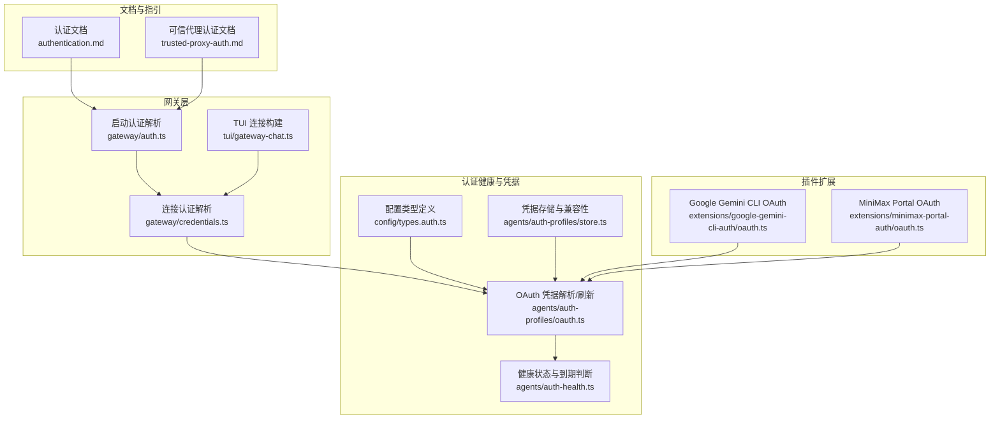
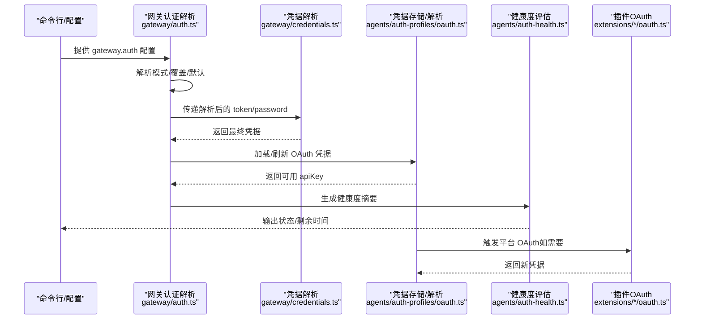
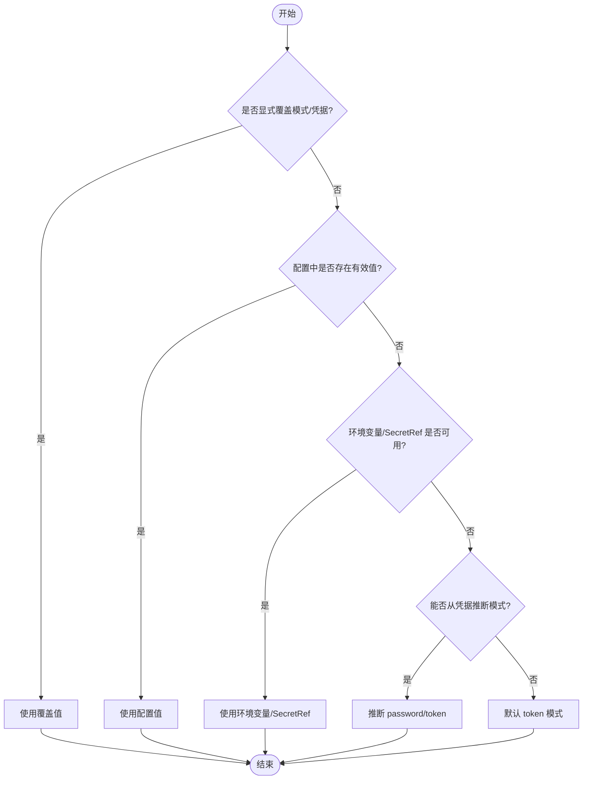
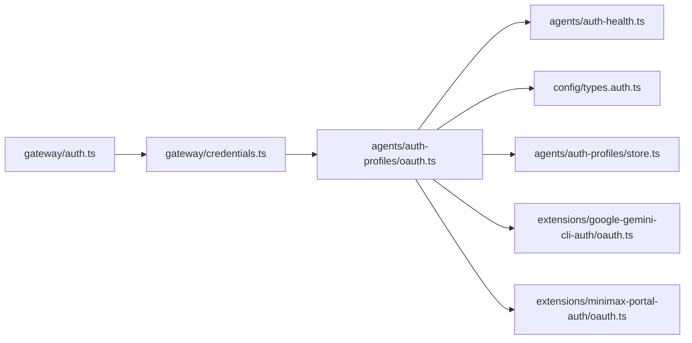

# 认证配置管理

<cite>
**本文引用的文件**
- [authentication.md](file://docs/gateway/authentication.md)
- [trusted-proxy-auth.md](file://docs/gateway/trusted-proxy-auth.md)
- [auth-health.ts](file://src/agents/auth-health.ts)
- [oauth.ts](file://src/agents/auth-profiles/oauth.ts)
- [gateway-auth.test.ts](file://src/gateway/startup-auth.test.ts)
- [auth.ts](file://src/gateway/auth.ts)
- [credentials.ts](file://src/gateway/credentials.ts)
- [gateway-chat.ts](file://src/tui/gateway-chat.ts)
- [types.auth.ts](file://src/config/types.auth.ts)
- [store.ts](file://src/agents/auth-profiles/store.ts)
- [configuration.md](file://docs/zh-CN/gateway/configuration.md)
- [oauth.ts](file://extensions/google-gemini-cli-auth/oauth.ts)
- [oauth.ts](file://extensions/minimax-portal-auth/oauth.ts)
</cite>

## 目录
1. [简介](#简介)
2. [项目结构](#项目结构)
3. [核心组件](#核心组件)
4. [架构总览](#架构总览)
5. [详细组件分析](#详细组件分析)
6. [依赖分析](#依赖分析)
7. [性能考虑](#性能考虑)
8. [故障排除指南](#故障排除指南)
9. [结论](#结论)
10. [附录](#附录)

## 简介
本文件系统化阐述 OpenClaw 的认证配置管理，覆盖四种认证模式（none、token、password、trusted-proxy）的选择与配置、优先级与覆盖机制、环境变量与配置文件格式、动态更新与热重载、部署最佳实践、验证与测试方法、与其他网关功能的集成关系，以及故障排除与调试要点。目标是帮助开发者与运维人员在不同环境下正确、安全地配置与维护认证。

## 项目结构
认证相关能力横跨“文档指引”“网关启动与连接”“认证健康度与凭据解析”“插件扩展 OAuth”等多个模块，并通过配置类型与存储文件实现持久化与一致性。

图示来源
- [auth.ts:249-292](file://src/gateway/auth.ts#L249-L292)
- [credentials.ts:253-287](file://src/gateway/credentials.ts#L253-L287)
- [gateway-chat.ts:293-431](file://src/tui/gateway-chat.ts#L293-L431)
- [auth-health.ts:1-284](file://src/agents/auth-health.ts#L1-L284)
- [oauth.ts:1-488](file://src/agents/auth-profiles/oauth.ts#L1-L488)
- [store.ts:87-121](file://src/agents/auth-profiles/store.ts#L87-L121)
- [types.auth.ts:1-29](file://src/config/types.auth.ts#L1-L29)
- [oauth.ts:1-735](file://extensions/google-gemini-cli-auth/oauth.ts#L1-L735)
- [oauth.ts:1-245](file://extensions/minimax-portal-auth/oauth.ts#L1-L245)

章节来源
- [auth.ts:249-292](file://src/gateway/auth.ts#L249-L292)
- [credentials.ts:253-287](file://src/gateway/credentials.ts#L253-L287)
- [gateway-chat.ts:293-431](file://src/tui/gateway-chat.ts#L293-L431)
- [auth-health.ts:1-284](file://src/agents/auth-health.ts#L1-L284)
- [oauth.ts:1-488](file://src/agents/auth-profiles/oauth.ts#L1-L488)
- [store.ts:87-121](file://src/agents/auth-profiles/store.ts#L87-L121)
- [types.auth.ts:1-29](file://src/config/types.auth.ts#L1-L29)
- [oauth.ts:1-735](file://extensions/google-gemini-cli-auth/oauth.ts#L1-L735)
- [oauth.ts:1-245](file://extensions/minimax-portal-auth/oauth.ts#L1-L245)

## 核心组件
- 认证模式与配置
  - 支持模式：none、token、password、trusted-proxy
  - 配置入口：网关配置对象中的 gateway.auth 字段
  - 可选参数：token/password 值、trustedProxy 用户头、允许用户列表、必需头等
- 凭据解析与优先级
  - 启动阶段：从配置、环境变量、覆盖参数综合解析
  - 运行阶段：按模式选择 token 或 password；trusted-proxy 由代理注入身份
- 健康度与到期判断
  - 统计 OAuth/API Key 的过期状态，支持“即将过期/已过期/缺失/静态”等状态
- 存储与兼容
  - 认证配置文件：auth-profiles.json（每个 Agent 目录）
  - 类型与字段：支持 mode/type、email、key/token/access 等
- 插件扩展 OAuth
  - 提供 Google Gemini CLI、MiniMax 等平台的 OAuth 流程封装

章节来源
- [authentication.md:1-180](file://docs/gateway/authentication.md#L1-L180)
- [trusted-proxy-auth.md:1-330](file://docs/gateway/trusted-proxy-auth.md#L1-L330)
- [auth.ts:249-292](file://src/gateway/auth.ts#L249-L292)
- [credentials.ts:253-287](file://src/gateway/credentials.ts#L253-L287)
- [auth-health.ts:1-284](file://src/agents/auth-health.ts#L1-L284)
- [types.auth.ts:1-29](file://src/config/types.auth.ts#L1-L29)
- [store.ts:87-121](file://src/agents/auth-profiles/store.ts#L87-L121)

## 架构总览
下图展示认证配置在启动与运行阶段的关键交互路径，包括模式解析、凭据来源、健康度评估与插件 OAuth。

图示来源
- [auth.ts:249-292](file://src/gateway/auth.ts#L249-L292)
- [credentials.ts:253-287](file://src/gateway/credentials.ts#L253-L287)
- [oauth.ts:1-488](file://src/agents/auth-profiles/oauth.ts#L1-L488)
- [auth-health.ts:1-284](file://src/agents/auth-health.ts#L1-L284)
- [oauth.ts:1-735](file://extensions/google-gemini-cli-auth/oauth.ts#L1-L735)
- [oauth.ts:1-245](file://extensions/minimax-portal-auth/oauth.ts#L1-L245)

## 详细组件分析

### 认证模式与配置
- none
  - 场景：无需认证（例如本地开发或受控网络）
  - 行为：不强制 token/password；TUI/远程连接需显式提供凭据或走代理
- token
  - 场景：静态令牌认证（适合长期运行网关）
  - 配置：gateway.auth.token 或环境变量
- password
  - 场景：HTTP 基本认证或密码认证
  - 配置：gateway.auth.password 或环境变量
- trusted-proxy
  - 场景：由可信反向代理完成认证，网关仅校验来源与用户头
  - 配置：gateway.auth.mode="trusted-proxy"，并设置 trustedProxy.userHeader、trustedProxies、allowUsers 等

章节来源
- [auth.ts:249-292](file://src/gateway/auth.ts#L249-L292)
- [trusted-proxy-auth.md:1-330](file://docs/gateway/trusted-proxy-auth.md#L1-L330)

### 认证优先级与覆盖机制
- 模式优先级（启动阶段）
  - 显式覆盖 > 配置值 > 从凭据推断（password/token） > 默认 token
- 凭据优先级（运行阶段）
  - 显式参数 > URL 覆盖来源 > 配置值 > 环境变量（含 SecretRef 解析）
- 具体行为
  - 启动时若显式指定模式/凭据则直接采用
  - 若未指定且存在配置/环境变量，则按“配置优先”或“环境优先”策略解析
  - 对于远程连接，优先解析远端配置中的凭据，再回退到本地配置/环境

图示来源
- [auth.ts:249-292](file://src/gateway/auth.ts#L249-L292)
- [credentials.ts:253-287](file://src/gateway/credentials.ts#L253-L287)
- [gateway-chat.ts:293-431](file://src/tui/gateway-chat.ts#L293-L431)

章节来源
- [auth.ts:249-292](file://src/gateway/auth.ts#L249-L292)
- [credentials.ts:253-287](file://src/gateway/credentials.ts#L253-L287)
- [gateway-chat.ts:293-431](file://src/tui/gateway-chat.ts#L293-L431)

### 环境变量与配置文件格式
- 环境变量
  - 网关：OPENCLAW_GATEWAY_TOKEN、OPENCLAW_GATEWAY_PASSWORD
  - 模型凭据：各 Provider 的 API_KEY/KEYS 系列变量（支持单值、列表、通配）
  - 反向代理：根据部署选择在代理层注入用户头
- 配置文件
  - 网关认证：gateway.auth（mode/token/password/trustedProxy）
  - 认证配置文件：auth-profiles.json（每个 Agent 目录），包含 profiles 与 order
  - 类型字段：mode/type、provider、email、key/token/access/refresh/expires 等
- 文件位置
  - auth-profiles.json：默认位于 <agentDir>/agent/auth-profiles.json
  - 文档还提及历史位置与覆盖变量（如 OPENCLAW_OAUTH_DIR、OPENCLAW_AGENT_DIR）

章节来源
- [authentication.md:1-180](file://docs/gateway/authentication.md#L1-L180)
- [trusted-proxy-auth.md:1-330](file://docs/gateway/trusted-proxy-auth.md#L1-L330)
- [types.auth.ts:1-29](file://src/config/types.auth.ts#L1-L29)
- [store.ts:87-121](file://src/agents/auth-profiles/store.ts#L87-L121)
- [configuration.md:348-405](file://docs/zh-CN/gateway/configuration.md#L348-L405)

### 动态更新与热重载
- 网关启动时的认证配置
  - 支持在启动前通过配置/环境变量注入认证信息
  - 测试用例验证：当配置为 none/trusted-proxy 时不生成 token；token 模式下以配置为准
- 运行时凭据变更
  - 对于 token/password：可通过重新加载配置或重启进程生效
  - 对于 OAuth：内部具备刷新逻辑与锁保护，避免并发冲突
- 建议
  - 使用配置管理工具或容器编排在滚动更新时注入新环境变量
  - 对于 OAuth，建议在变更后执行健康检查命令确认可用性

章节来源
- [gateway-auth.test.ts:308-360](file://src/gateway/startup-auth.test.ts#L308-L360)
- [oauth.ts:154-211](file://src/agents/auth-profiles/oauth.ts#L154-L211)

### 不同部署场景的最佳实践
- 个人/单机
  - 使用 token 模式，配合环境变量或 .env 文件管理
  - 控制台访问建议绑定 loopback 并启用 TLS
- 多用户/企业
  - 推荐 trusted-proxy 模式，由反向代理统一认证（Pomerium/Caddy/Nginx+OAuth）
  - 严格限制 trustedProxies 列表，启用 allowUsers 白名单
  - 仅允许代理终止 TLS，避免网关直连暴露
- 远程/容器化
  - 将认证交由代理处理，网关监听 loopback 并通过代理转发
  - 为 WebSocket 升级保留用户头，确保连接成功
- 开发/测试
  - 使用 none 或 token 模式快速启动
  - 通过 SecretRef 管理敏感信息，避免硬编码

章节来源
- [trusted-proxy-auth.md:1-330](file://docs/gateway/trusted-proxy-auth.md#L1-L330)
- [authentication.md:1-180](file://docs/gateway/authentication.md#L1-L180)

### 验证与测试方法
- 健康检查
  - 使用 models status/doctor 命令查看认证状态与剩余有效期
  - 对 OAuth：关注“即将过期/已过期/缺失”状态；对 API Key：标记为静态
- 自动化探测
  - 使用 --check 参数在 CI 中检测凭据有效性（缺失/即将过期返回特定退出码）
- 单元测试参考
  - 启动阶段对 none/trusted-proxy 的行为有明确断言
  - 连接阶段对 SecretRef 解析优先级有覆盖测试

章节来源
- [auth-health.ts:1-284](file://src/agents/auth-health.ts#L1-L284)
- [authentication.md:1-180](file://docs/gateway/authentication.md#L1-L180)
- [gateway-auth.test.ts:308-360](file://src/gateway/startup-auth.test.ts#L308-L360)
- [gateway-chat.ts:293-431](file://src/tui/gateway-chat.ts#L293-L431)

### 与网关其他功能的集成关系
- 与模型选择/切换
  - 支持按会话/代理级别指定认证配置顺序与首选项
- 与远程访问
  - 远程模式下，凭据解析优先远端配置，再回退本地配置/环境变量
- 与控制 UI
  - trusted-proxy 模式下，控制 UI WebSocket 可在代理认证通过后免配对连接
- 与安全审计
  - trusted-proxy 模式会被安全审计标记为高风险，需严格审查配置

章节来源
- [auth.ts:249-292](file://src/gateway/auth.ts#L249-L292)
- [gateway-chat.ts:293-431](file://src/tui/gateway-chat.ts#L293-L431)
- [trusted-proxy-auth.md:1-330](file://docs/gateway/trusted-proxy-auth.md#L1-L330)

## 依赖分析
- 组件耦合
  - 网关认证解析依赖凭据解析与配置类型
  - OAuth 解析依赖存储与插件扩展
  - 健康度评估依赖 OAuth 解析结果
- 关键依赖链
  - gateway/auth.ts → gateway/credentials.ts → agents/auth-profiles/oauth.ts
  - agents/auth-profiles/oauth.ts → agents/auth-health.ts
  - 插件 OAuth → agents/auth-profiles/oauth.ts

图示来源
- [auth.ts:249-292](file://src/gateway/auth.ts#L249-L292)
- [credentials.ts:253-287](file://src/gateway/credentials.ts#L253-L287)
- [oauth.ts:1-488](file://src/agents/auth-profiles/oauth.ts#L1-L488)
- [auth-health.ts:1-284](file://src/agents/auth-health.ts#L1-L284)
- [types.auth.ts:1-29](file://src/config/types.auth.ts#L1-L29)
- [store.ts:87-121](file://src/agents/auth-profiles/store.ts#L87-L121)
- [oauth.ts:1-735](file://extensions/google-gemini-cli-auth/oauth.ts#L1-L735)
- [oauth.ts:1-245](file://extensions/minimax-portal-auth/oauth.ts#L1-L245)

章节来源
- [auth.ts:249-292](file://src/gateway/auth.ts#L249-L292)
- [credentials.ts:253-287](file://src/gateway/credentials.ts#L253-L287)
- [oauth.ts:1-488](file://src/agents/auth-profiles/oauth.ts#L1-L488)
- [auth-health.ts:1-284](file://src/agents/auth-health.ts#L1-L284)
- [types.auth.ts:1-29](file://src/config/types.auth.ts#L1-L29)
- [store.ts:87-121](file://src/agents/auth-profiles/store.ts#L87-L121)
- [oauth.ts:1-735](file://extensions/google-gemini-cli-auth/oauth.ts#L1-L735)
- [oauth.ts:1-245](file://extensions/minimax-portal-auth/oauth.ts#L1-L245)

## 性能考虑
- OAuth 刷新加锁
  - 使用文件锁避免并发刷新导致的数据竞争
- 健康度计算
  - 仅遍历有效配置与可用凭据，避免全量扫描
- 远程连接解析
  - 优先远端配置，减少本地 IO 与解析成本

章节来源
- [oauth.ts:154-211](file://src/agents/auth-profiles/oauth.ts#L154-L211)
- [auth-health.ts:187-284](file://src/agents/auth-health.ts#L187-L284)

## 故障排除指南
- 常见错误与定位
  - 无凭据：检查配置/环境变量/SecretRef 是否正确解析
  - 即将过期/已过期：使用 models status 查看剩余时间，必要时重新授权或更换
  - 反向代理不可信/用户头缺失：核对 trustedProxies、userHeader、requiredHeaders、allowUsers
  - WebSocket 1008：确认代理正确传递用户头并支持升级
- 安全审计
  - trusted-proxy 模式会被标记为高风险，需核查配置完整性与最小权限原则

章节来源
- [auth-health.ts:1-284](file://src/agents/auth-health.ts#L1-L284)
- [trusted-proxy-auth.md:276-330](file://docs/gateway/trusted-proxy-auth.md#L276-L330)

## 结论
OpenClaw 的认证配置管理以“模式可选、来源灵活、健康可见、安全可控”为核心设计。通过清晰的优先级与覆盖机制、完善的 SecretRef 支持、可信代理集成与健康度评估，可在不同部署场景下实现稳定、可观测且易于维护的认证体系。建议在生产环境中优先采用 trusted-proxy 模式并严格遵循安全清单，在开发与测试中使用 token 模式提升效率。

## 附录
- 相关命令与文档
  - models status/doctor：查看认证状态与健康度
  - openclaw onboard/models auth：配置与导入凭据
  - 安全审计：openclaw security audit
- 参考配置片段与字段说明
  - 网关认证：gateway.auth.mode/token/password/trustedProxy
  - 认证配置文件：auth-profiles.json 的 profiles 与 order
  - 反向代理：trustedProxies、userHeader、requiredHeaders、allowUsers

章节来源
- [authentication.md:1-180](file://docs/gateway/authentication.md#L1-L180)
- [trusted-proxy-auth.md:1-330](file://docs/gateway/trusted-proxy-auth.md#L1-L330)
- [configuration.md:348-405](file://docs/zh-CN/gateway/configuration.md#L348-L405)