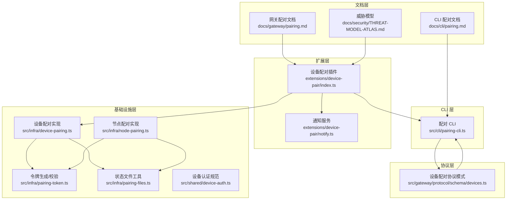
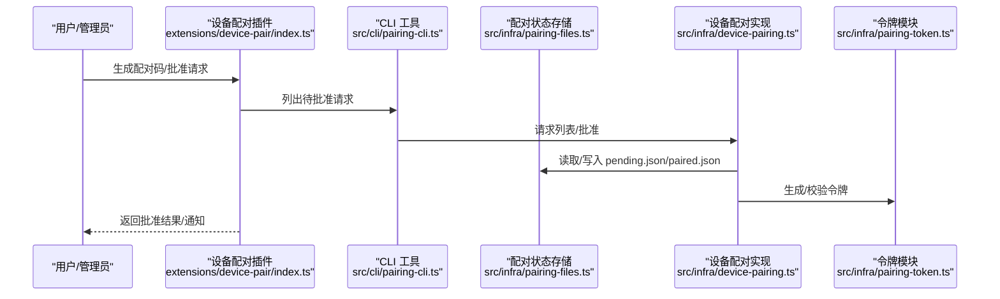
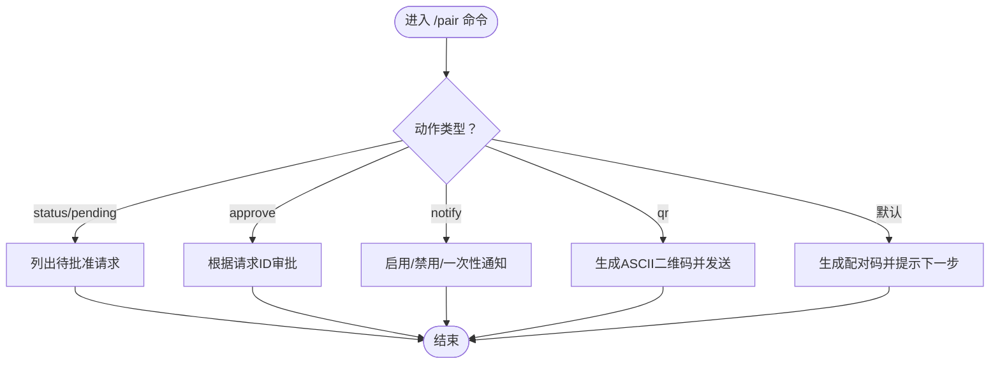
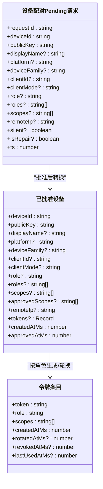
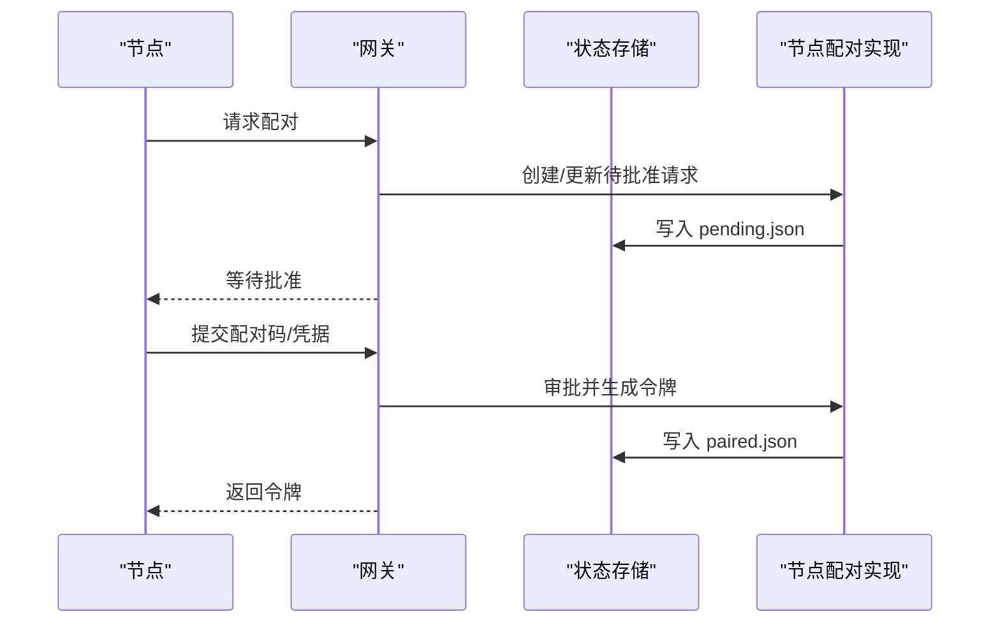
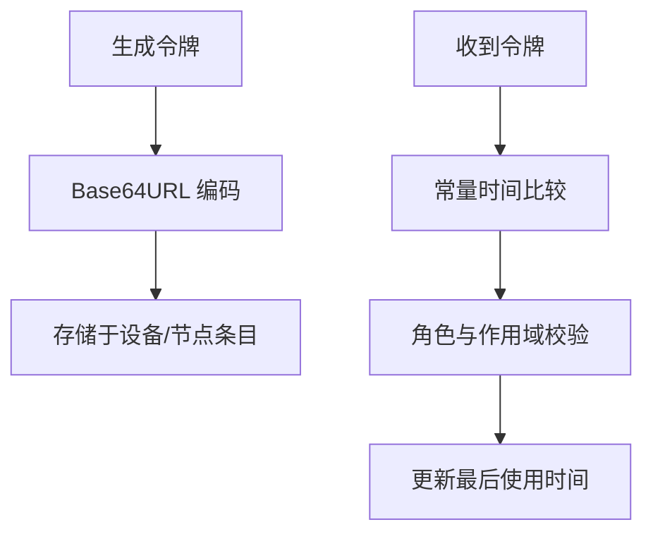
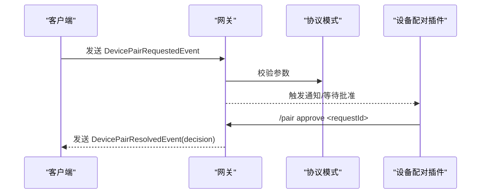
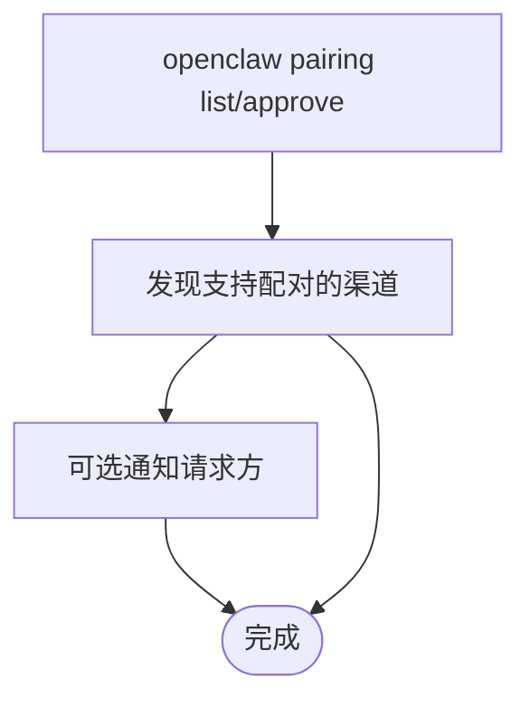
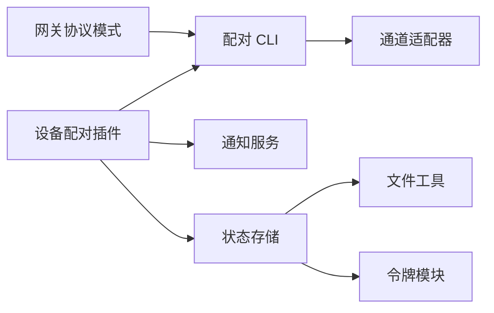

# 设备配对机制

<cite>
**本文档引用的文件**
- [extensions/device-pair/index.ts](file://extensions/device-pair/index.ts)
- [extensions/device-pair/notify.ts](file://extensions/device-pair/notify.ts)
- [src/infra/device-pairing.ts](file://src/infra/device-pairing.ts)
- [src/infra/node-pairing.ts](file://src/infra/node-pairing.ts)
- [src/infra/pairing-token.ts](file://src/infra/pairing-token.ts)
- [src/infra/pairing-files.ts](file://src/infra/pairing-files.ts)
- [src/gateway/protocol/schema/devices.ts](file://src/gateway/protocol/schema/devices.ts)
- [src/channels/plugins/pairing.ts](file://src/channels/plugins/pairing.ts)
- [src/cli/pairing-cli.ts](file://src/cli/pairing-cli.ts)
- [docs/gateway/pairing.md](file://docs/gateway/pairing.md)
- [docs/cli/pairing.md](file://docs/cli/pairing.md)
- [docs/security/THREAT-MODEL-ATLAS.md](file://docs/security/THREAT-MODEL-ATLAS.md)
- [src/shared/device-auth.ts](file://src/shared/device-auth.ts)
</cite>

## 目录
1. [简介](#简介)
2. [项目结构](#项目结构)
3. [核心组件](#核心组件)
4. [架构总览](#架构总览)
5. [详细组件分析](#详细组件分析)
6. [依赖关系分析](#依赖关系分析)
7. [性能考虑](#性能考虑)
8. [故障排除指南](#故障排除指南)
9. [结论](#结论)
10. [附录](#附录)

## 简介
本文件系统性阐述 OpenClaw 的设备配对机制，覆盖安全配对流程设计（邀请、信任建立、权限授予）、配对密钥生成与验证、信任关系维护（信任级别、期限、撤销）、多设备环境下的角色分工、配对状态监控与管理、威胁模型与防护、以及与权限系统的集成。文档同时提供故障排除与恢复建议，帮助开发者与运维人员在不同平台与渠道中稳定地部署与使用配对能力。

## 项目结构
OpenClaw 将“设备配对”拆分为多个层次：
- 扩展层：设备配对插件负责生成配对码、处理批准命令、通知请求者，并与渠道适配器交互。
- 基础设施层：设备/节点配对的状态存储、令牌生成与校验、过期清理等。
- 协议层：WebSocket 网关协议中的配对事件与方法定义。
- CLI 层：命令行工具用于列出、批准、通知等操作。
- 文档层：提供网关自有配对与 CLI 配对的使用说明与安全注意事项。

**图表来源**
- [extensions/device-pair/index.ts:326-549](file://extensions/device-pair/index.ts#L326-L549)
- [extensions/device-pair/notify.ts:427-461](file://extensions/device-pair/notify.ts#L427-L461)
- [src/infra/device-pairing.ts:1-654](file://src/infra/device-pairing.ts#L1-L654)
- [src/infra/node-pairing.ts:1-274](file://src/infra/node-pairing.ts#L1-L274)
- [src/infra/pairing-token.ts:1-13](file://src/infra/pairing-token.ts#L1-L13)
- [src/infra/pairing-files.ts:1-51](file://src/infra/pairing-files.ts#L1-L51)
- [src/gateway/protocol/schema/devices.ts:1-68](file://src/gateway/protocol/schema/devices.ts#L1-L68)
- [src/cli/pairing-cli.ts:52-174](file://src/cli/pairing-cli.ts#L52-L174)
- [docs/gateway/pairing.md:1-100](file://docs/gateway/pairing.md#L1-L100)
- [docs/cli/pairing.md:1-33](file://docs/cli/pairing.md#L1-L33)
- [docs/security/THREAT-MODEL-ATLAS.md:168-180](file://docs/security/THREAT-MODEL-ATLAS.md#L168-L180)

**章节来源**
- [extensions/device-pair/index.ts:326-549](file://extensions/device-pair/index.ts#L326-L549)
- [src/infra/device-pairing.ts:1-654](file://src/infra/device-pairing.ts#L1-L654)
- [src/infra/node-pairing.ts:1-274](file://src/infra/node-pairing.ts#L1-L274)
- [src/gateway/protocol/schema/devices.ts:1-68](file://src/gateway/protocol/schema/devices.ts#L1-L68)
- [src/cli/pairing-cli.ts:52-174](file://src/cli/pairing-cli.ts#L52-L174)
- [docs/gateway/pairing.md:1-100](file://docs/gateway/pairing.md#L1-L100)
- [docs/cli/pairing.md:1-33](file://docs/cli/pairing.md#L1-L33)
- [docs/security/THREAT-MODEL-ATLAS.md:168-180](file://docs/security/THREAT-MODEL-ATLAS.md#L168-L180)

## 核心组件
- 设备配对插件：负责生成配对码、解析渠道参数、触发批准流程、发送通知、支持一次性通知订阅。
- 设备配对实现：管理待批准请求、已批准设备、令牌生成与校验、作用域与角色合并、过期清理。
- 节点配对实现：面向网关侧节点的配对流程，与设备配对共享状态文件与令牌机制。
- 令牌生成与校验：使用安全随机数生成固定长度令牌，采用常量时间比较防止时序攻击。
- 协议模式：定义设备配对请求事件、批准/拒绝事件及参数结构，确保跨组件一致性。
- CLI 工具：列出待批准请求、批准配对码、可选通知请求方。
- 文档与威胁模型：提供使用指南、安全注意事项与风险评估。

**章节来源**
- [extensions/device-pair/index.ts:326-549](file://extensions/device-pair/index.ts#L326-L549)
- [src/infra/device-pairing.ts:14-77](file://src/infra/device-pairing.ts#L14-L77)
- [src/infra/node-pairing.ts:28-51](file://src/infra/node-pairing.ts#L28-L51)
- [src/infra/pairing-token.ts:6-12](file://src/infra/pairing-token.ts#L6-L12)
- [src/gateway/protocol/schema/devices.ts:38-67](file://src/gateway/protocol/schema/devices.ts#L38-L67)
- [src/cli/pairing-cli.ts:52-174](file://src/cli/pairing-cli.ts#L52-L174)
- [docs/gateway/pairing.md:1-100](file://docs/gateway/pairing.md#L1-L100)
- [docs/security/THREAT-MODEL-ATLAS.md:168-180](file://docs/security/THREAT-MODEL-ATLAS.md#L168-L180)

## 架构总览
下图展示从渠道到网关再到存储的端到端配对流程，强调安全令牌与状态持久化。

**图表来源**
- [extensions/device-pair/index.ts:326-549](file://extensions/device-pair/index.ts#L326-L549)
- [src/cli/pairing-cli.ts:52-174](file://src/cli/pairing-cli.ts#L52-L174)
- [src/infra/device-pairing.ts:255-403](file://src/infra/device-pairing.ts#L255-L403)
- [src/infra/pairing-files.ts:6-14](file://src/infra/pairing-files.ts#L6-L14)
- [src/infra/pairing-token.ts:6-12](file://src/infra/pairing-token.ts#L6-L12)

## 详细组件分析

### 设备配对插件（扩展）
- 功能要点
  - 生成配对码：将网关地址、认证方式编码为安全字符串，支持二维码渲染。
  - 处理批准命令：根据请求 ID 审批设备配对，返回批准后的设备信息。
  - 渠道通知：在 Telegram 等渠道上自动通知新请求或一次性订阅通知。
  - URL 解析与认证：根据配置选择 ws/wss、本地绑定、远程地址或 Tailscale 主机。
- 关键路径
  - 命令注册与分发：/pair status/pending、/pair approve、/pair notify、/pair qr。
  - 通知服务：轮询待批准请求，按订阅模式发送消息。
  - 二维码渲染：将配对码转为 ASCII 码以便在多种渠道显示。

**图表来源**
- [extensions/device-pair/index.ts:329-548](file://extensions/device-pair/index.ts#L329-L548)
- [extensions/device-pair/notify.ts:313-425](file://extensions/device-pair/notify.ts#L313-L425)

**章节来源**
- [extensions/device-pair/index.ts:326-549](file://extensions/device-pair/index.ts#L326-L549)
- [extensions/device-pair/notify.ts:427-461](file://extensions/device-pair/notify.ts#L427-L461)

### 设备配对实现（基础设施）
- 数据模型
  - 待批准请求：包含设备标识、公钥、显示名、平台、角色、作用域、远端 IP、静默标记、修复标记与时间戳。
  - 已批准设备：包含设备标识、公钥、元数据、角色/作用域、令牌集合、创建与批准时间。
  - 令牌条目：包含角色、作用域、创建/轮换/撤销/最后使用时间。
- 核心流程
  - 请求设备配对：去重合并、设置修复标记、写入待批准。
  - 批准设备配对：合并角色与作用域、生成新令牌、移除待批准、写入已批准。
  - 拒绝设备配对：删除待批准请求。
  - 移除已批准设备：从存储中删除。
  - 更新元数据：合并角色与作用域后持久化。
  - 令牌校验：基于角色与作用域检查，更新最后使用时间。
  - 令牌轮换/撤销：按角色生成新令牌或标记撤销。
- 安全与一致性
  - 使用原子写入与异步锁保证并发安全。
  - 过期清理：待批准请求 TTL 为 5 分钟。
  - 作用域展开：内置作用域蕴含规则，避免遗漏授权。

**图表来源**
- [src/infra/device-pairing.ts:14-77](file://src/infra/device-pairing.ts#L14-L77)
- [src/infra/device-pairing.ts:226-270](file://src/infra/device-pairing.ts#L226-L270)
- [src/infra/device-pairing.ts:237-253](file://src/infra/device-pairing.ts#L237-L253)

**章节来源**
- [src/infra/device-pairing.ts:14-77](file://src/infra/device-pairing.ts#L14-L77)
- [src/infra/device-pairing.ts:272-403](file://src/infra/device-pairing.ts#L272-L403)
- [src/infra/device-pairing.ts:470-547](file://src/infra/device-pairing.ts#L470-L547)

### 节点配对实现（基础设施）
- 面向网关侧节点的配对流程，与设备配对共享状态文件与令牌机制。
- 数据模型差异：节点侧不区分角色，统一发放令牌；支持能力与命令列表等元数据。
- 核心流程：请求、批准（发放新令牌）、拒绝、校验、元数据更新、重命名。

**图表来源**
- [src/infra/node-pairing.ts:104-182](file://src/infra/node-pairing.ts#L104-L182)
- [src/infra/pairing-files.ts:6-14](file://src/infra/pairing-files.ts#L6-L14)

**章节来源**
- [src/infra/node-pairing.ts:13-51](file://src/infra/node-pairing.ts#L13-L51)
- [src/infra/node-pairing.ts:104-182](file://src/infra/node-pairing.ts#L104-L182)

### 令牌生成与校验
- 令牌长度与生成：固定字节数的安全随机数，Base64URL 编码。
- 校验策略：常量时间比较，避免时序侧信道泄露。
- 与配对流程结合：批准时生成新令牌；校验时验证角色与作用域并记录最后使用时间。

**图表来源**
- [src/infra/pairing-token.ts:6-12](file://src/infra/pairing-token.ts#L6-L12)
- [src/infra/device-pairing.ts:470-508](file://src/infra/device-pairing.ts#L470-L508)
- [src/infra/node-pairing.ts:203-215](file://src/infra/node-pairing.ts#L203-L215)

**章节来源**
- [src/infra/pairing-token.ts:1-13](file://src/infra/pairing-token.ts#L1-L13)
- [src/infra/device-pairing.ts:470-508](file://src/infra/device-pairing.ts#L470-L508)
- [src/infra/node-pairing.ts:203-215](file://src/infra/node-pairing.ts#L203-L215)

### 协议模式与事件
- 设备配对事件与方法
  - 请求事件：携带设备标识、公钥、显示名、平台、设备族、客户端信息、角色/作用域、远端 IP、静默标记、修复标记与时间戳。
  - 结果事件：包含请求 ID、设备 ID、决策与时间戳。
  - 方法参数：批准/拒绝/移除/令牌轮换/撤销等均以结构化参数形式定义。
- 与 CLI/插件的对接：CLI 通过通道适配器调用批准接口，插件负责渲染与通知。

**图表来源**
- [src/gateway/protocol/schema/devices.ts:38-67](file://src/gateway/protocol/schema/devices.ts#L38-L67)
- [src/channels/plugins/pairing.ts:51-69](file://src/channels/plugins/pairing.ts#L51-L69)
- [extensions/device-pair/index.ts:357-394](file://extensions/device-pair/index.ts#L357-L394)

**章节来源**
- [src/gateway/protocol/schema/devices.ts:1-68](file://src/gateway/protocol/schema/devices.ts#L1-L68)
- [src/channels/plugins/pairing.ts:1-70](file://src/channels/plugins/pairing.ts#L1-L70)

### CLI 与渠道适配
- CLI 命令
  - 列表：列出指定渠道的待批准请求，支持账户过滤与 JSON 输出。
  - 批准：通过配对码或请求 ID 完成批准，可选通知请求方。
- 渠道适配
  - 仅支持声明了 pairing 的渠道插件。
  - 可直接传入适配器以绕过模块隔离。

**图表来源**
- [src/cli/pairing-cli.ts:64-172](file://src/cli/pairing-cli.ts#L64-L172)
- [src/channels/plugins/pairing.ts:11-29](file://src/channels/plugins/pairing.ts#L11-L29)

**章节来源**
- [src/cli/pairing-cli.ts:52-174](file://src/cli/pairing-cli.ts#L52-L174)
- [src/channels/plugins/pairing.ts:1-70](file://src/channels/plugins/pairing.ts#L1-L70)

## 依赖关系分析
- 组件耦合
  - 插件依赖 CLI 与通知服务，CLI 依赖通道适配器与配对存储。
  - 设备/节点配对实现共享状态文件与令牌模块，降低重复逻辑。
- 外部依赖
  - Node.js 标准库（crypto、fs、path）用于安全随机数与文件操作。
  - Sinric TypeBox 用于协议参数的结构化校验。
- 潜在循环依赖
  - 通过模块职责划分避免循环导入：插件只做编排，实现层专注状态与校验。

**图表来源**
- [extensions/device-pair/index.ts:326-549](file://extensions/device-pair/index.ts#L326-L549)
- [src/cli/pairing-cli.ts:52-174](file://src/cli/pairing-cli.ts#L52-L174)
- [src/channels/plugins/pairing.ts:1-70](file://src/channels/plugins/pairing.ts#L1-L70)
- [src/infra/pairing-files.ts:1-51](file://src/infra/pairing-files.ts#L1-L51)
- [src/infra/pairing-token.ts:1-13](file://src/infra/pairing-token.ts#L1-L13)
- [src/gateway/protocol/schema/devices.ts:1-68](file://src/gateway/protocol/schema/devices.ts#L1-L68)

**章节来源**
- [extensions/device-pair/index.ts:326-549](file://extensions/device-pair/index.ts#L326-L549)
- [src/cli/pairing-cli.ts:52-174](file://src/cli/pairing-cli.ts#L52-L174)
- [src/channels/plugins/pairing.ts:1-70](file://src/channels/plugins/pairing.ts#L1-L70)
- [src/infra/pairing-files.ts:1-51](file://src/infra/pairing-files.ts#L1-L51)
- [src/infra/pairing-token.ts:1-13](file://src/infra/pairing-token.ts#L1-L13)
- [src/gateway/protocol/schema/devices.ts:1-68](file://src/gateway/protocol/schema/devices.ts#L1-L68)

## 性能考虑
- 并发控制：使用异步锁包裹状态读写，避免竞态条件。
- 文件 I/O：采用原子写入与批量写入，减少磁盘抖动。
- 过期清理：定期修剪过期待批准请求，保持内存占用稳定。
- 通知轮询：固定间隔轮询，避免高频查询；一次性订阅在送达后自动取消，降低无效通知。

[本节为通用指导，无需特定文件引用]

## 故障排除指南
- 无法生成配对码
  - 检查网关 URL 解析：确认 publicUrl、bind、remote.url 或 Tailscale 配置有效。
  - 检查认证配置：确保 token/password 已正确设置且与网关模式匹配。
- 无待批准请求
  - 确认客户端是否已发送 DevicePairRequestedEvent。
  - 检查 CLI 渠道参数与账户过滤是否正确。
- 批准失败
  - 确认请求 ID 正确且未过期（TTL 5 分钟）。
  - 检查角色与作用域是否匹配已批准范围。
- 通知未送达
  - 确认 Telegram 渠道可用且目标聊天可识别。
  - 使用 /pair notify on/once/status 检查订阅状态。
- 令牌校验失败
  - 确认设备已批准且令牌未撤销。
  - 检查角色与作用域是否在已批准范围内。

**章节来源**
- [extensions/device-pair/index.ts:244-291](file://extensions/device-pair/index.ts#L244-L291)
- [src/cli/pairing-cli.ts:70-112](file://src/cli/pairing-cli.ts#L70-L112)
- [src/infra/device-pairing.ts:386-403](file://src/infra/device-pairing.ts#L386-L403)
- [extensions/device-pair/notify.ts:347-425](file://extensions/device-pair/notify.ts#L347-L425)

## 结论
OpenClaw 的设备配对机制通过“插件编排 + 基础设施实现 + 协议约束 + CLI/渠道适配”的分层设计，在保证安全性的同时提供了灵活的多平台支持。令牌生成与校验采用安全实践，状态持久化具备过期清理与并发保护；通知与 CLI 使配对流程在无 UI 场景下也能高效完成。结合威胁模型与防护建议，可在实际部署中进一步降低风险。

[本节为总结，无需特定文件引用]

## 附录

### 安全配对流程设计要点
- 邀请阶段：客户端发起配对请求，网关记录待批准请求并触发通知。
- 信任建立：管理员在 CLI/渠道界面批准，网关生成新令牌并移除待批准。
- 权限授予：按角色与作用域合并策略授予最小必要权限，支持后续轮换与撤销。
- 密钥管理：令牌长度固定、常量时间比较、过期与撤销机制。
- 信任维护：记录最后使用时间，支持轮换与撤销；过期清理保障资源回收。

**章节来源**
- [src/infra/device-pairing.ts:195-220](file://src/infra/device-pairing.ts#L195-L220)
- [src/infra/device-pairing.ts:470-547](file://src/infra/device-pairing.ts#L470-L547)
- [docs/security/THREAT-MODEL-ATLAS.md:168-180](file://docs/security/THREAT-MODEL-ATLAS.md#L168-L180)

### 多设备环境与角色分工
- 主设备（网关）：作为信任根，负责状态存储、令牌发放与权限裁决。
- 从设备（客户端）：发起请求、接收通知、提交批准、使用令牌进行认证。
- 节点侧：网关自有节点同样遵循配对流程，但不区分角色，统一发放令牌。

**章节来源**
- [docs/gateway/pairing.md:10-26](file://docs/gateway/pairing.md#L10-L26)
- [src/infra/node-pairing.ts:104-182](file://src/infra/node-pairing.ts#L104-L182)

### 配对状态监控与管理
- 列表与状态：CLI 支持列出待批准与已批准设备，查看元数据与令牌摘要。
- 通知：Telegram 订阅支持一次性与持久订阅，自动轮询推送。
- 操作：批准、拒绝、移除、轮换与撤销令牌，支持按角色细化权限。

**章节来源**
- [src/cli/pairing-cli.ts:64-112](file://src/cli/pairing-cli.ts#L64-L112)
- [extensions/device-pair/notify.ts:250-311](file://extensions/device-pair/notify.ts#L250-L311)
- [src/infra/device-pairing.ts:572-640](file://src/infra/device-pairing.ts#L572-L640)

### 配对安全威胁模型与防护
- 威胁：配对码拦截（30 秒宽限期）、网络嗅探、社会工程。
- 防护：缩短宽限期、通过现有渠道发送配对码、常量时间比较、过期清理。
- 建议：减少宽限期、增加二次确认步骤。

**章节来源**
- [docs/security/THREAT-MODEL-ATLAS.md:168-180](file://docs/security/THREAT-MODEL-ATLAS.md#L168-L180)