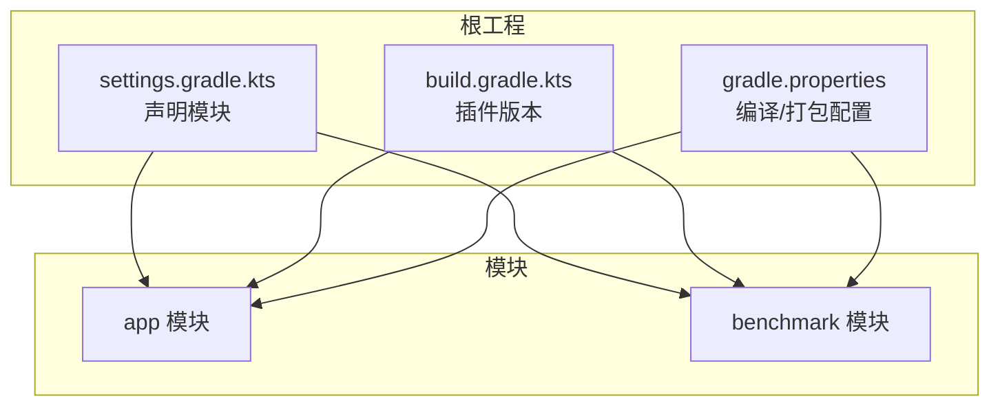
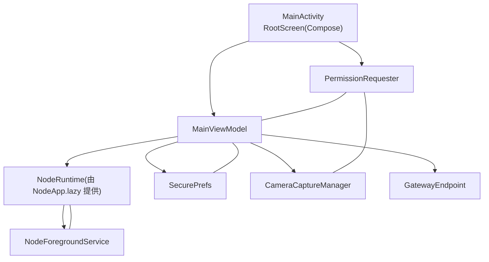
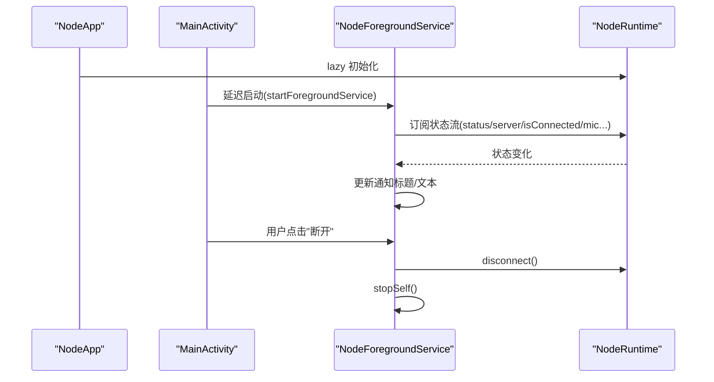
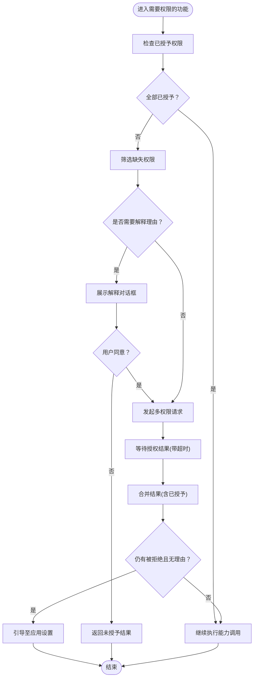
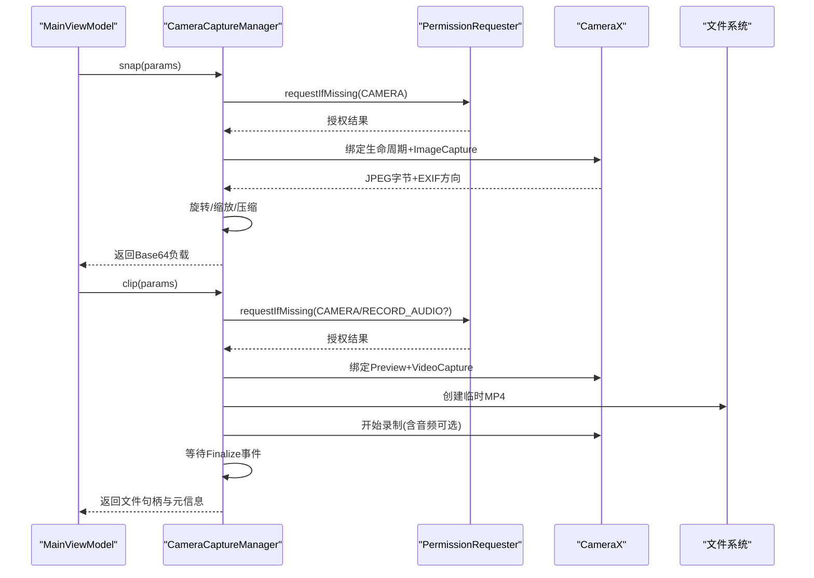
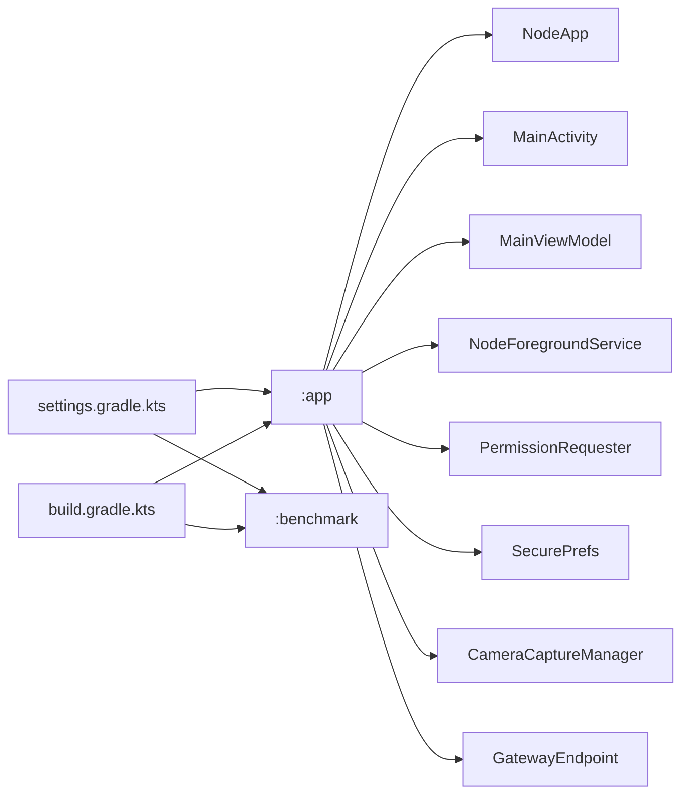

# Android 移动应用

<cite>
**本文引用的文件**
- [apps/android/README.md](file://apps/android/README.md)
- [apps/android/build.gradle.kts](file://apps/android/build.gradle.kts)
- [apps/android/settings.gradle.kts](file://apps/android/settings.gradle.kts)
- [apps/android/gradle.properties](file://apps/android/gradle.properties)
- [apps/android/app/src/main/java/ai/openclaw/app/NodeApp.kt](file://apps/android/app/src/main/java/ai/openclaw/app/NodeApp.kt)
- [apps/android/app/src/main/java/ai/openclaw/app/MainActivity.kt](file://apps/android/app/src/main/java/ai/openclaw/app/MainActivity.kt)
- [apps/android/app/src/main/java/ai/openclaw/app/MainViewModel.kt](file://apps/android/app/src/main/java/ai/openclaw/app/MainViewModel.kt)
- [apps/android/app/src/main/java/ai/openclaw/app/NodeForegroundService.kt](file://apps/android/app/src/main/java/ai/openclaw/app/NodeForegroundService.kt)
- [apps/android/app/src/main/java/ai/openclaw/app/PermissionRequester.kt](file://apps/android/app/src/main/java/ai/openclaw/app/PermissionRequester.kt)
- [apps/android/app/src/main/java/ai/openclaw/app/SecurePrefs.kt](file://apps/android/app/src/main/java/ai/openclaw/app/SecurePrefs.kt)
- [apps/android/app/src/main/java/ai/openclaw/app/ui/RootScreen.kt](file://apps/android/app/src/main/java/ai/openclaw/app/ui/RootScreen.kt)
- [apps/android/app/src/main/java/ai/openclaw/app/node/CameraCaptureManager.kt](file://apps/android/app/src/main/java/ai/openclaw/app/node/CameraCaptureManager.kt)
- [apps/android/app/src/main/java/ai/openclaw/app/gateway/GatewayEndpoint.kt](file://apps/android/app/src/main/java/ai/openclaw/app/gateway/GatewayEndpoint.kt)
- [apps/android/app/src/main/res/values/strings.xml](file://apps/android/app/src/main/res/values/strings.xml)
</cite>

## 目录
1. [简介](#简介)
2. [项目结构](#项目结构)
3. [核心组件](#核心组件)
4. [架构总览](#架构总览)
5. [组件详解](#组件详解)
6. [依赖关系分析](#依赖关系分析)
7. [性能考量](#性能考量)
8. [故障排查指南](#故障排查指南)
9. [结论](#结论)
10. [附录](#附录)

## 简介
本文件面向 OpenClaw Android 移动应用，提供从架构到实现细节的系统化技术文档。内容覆盖主应用、基准测试模块与构建脚本系统；阐述 Android 权限管理与安全模型（含后台/前台服务、系统级权限）；解释移动节点在 Android 环境下的能力实现（相机、麦克风、存储访问等）；介绍构建流程、Gradle 配置与多模块管理；给出 Android 特有用户体验设计（Material Design 与手势交互）；说明与网关服务器的通信协议适配与网络连接管理；并包含应用分发、签名与更新机制的说明。

## 项目结构
Android 子工程位于 apps/android，采用多模块结构：
- app：主应用模块，包含 UI、节点能力、网关通信、前台服务与权限请求器等。
- benchmark：宏基准测试模块，用于启动时延与帧时序测量。
- 根级构建脚本：settings.gradle.kts 声明模块；build.gradle.kts 定义插件版本；gradle.properties 控制编译与打包策略。

图表来源
- [apps/android/settings.gradle.kts:1-20](file://apps/android/settings.gradle.kts#L1-L20)
- [apps/android/build.gradle.kts:1-8](file://apps/android/build.gradle.kts#L1-L8)
- [apps/android/gradle.properties:1-10](file://apps/android/gradle.properties#L1-L10)

章节来源
- [apps/android/README.md:26-56](file://apps/android/README.md#L26-L56)
- [apps/android/settings.gradle.kts:1-20](file://apps/android/settings.gradle.kts#L1-L20)
- [apps/android/build.gradle.kts:1-8](file://apps/android/build.gradle.kts#L1-L8)
- [apps/android/gradle.properties:1-10](file://apps/android/gradle.properties#L1-L10)

## 核心组件
- 应用入口与运行时
  - Application：NodeApp 在 onCreate 中启用严格模式（调试），并延迟初始化 NodeRuntime。
  - MainActivity：设置 Decor Fit System Windows、注册 PermissionRequester、绑定 ViewModel、控制屏幕常亮、启动前台服务。
  - MainViewModel：聚合 NodeRuntime 的状态流与操作，作为 Compose UI 的数据源。
- 前台服务
  - NodeForegroundService：以 FOREGROUND_SERVICE_TYPE_DATA_SYNC 启动，动态更新通知标题与文本，支持停止动作。
- 权限管理
  - PermissionRequester：统一申请相机、录音、短信等权限，处理拒绝与引导至系统设置。
- 安全存储
  - SecurePrefs：使用 EncryptedSharedPreferences 保护敏感配置（如网关令牌/密码），同时维护明文偏好键值。
- 节点能力
  - CameraCaptureManager：基于 CameraX 的拍照与视频录制，含 EXIF 方向旋转、尺寸压缩与 5MB 上限限制。
- 网关端点
  - GatewayEndpoint：描述网关连接参数（主机、端口、TLS、指纹等）。
- UI 入口
  - RootScreen：根据 onboardingCompleted 决定显示引导流程或主标签页。

章节来源
- [apps/android/app/src/main/java/ai/openclaw/app/NodeApp.kt:1-27](file://apps/android/app/src/main/java/ai/openclaw/app/NodeApp.kt#L1-L27)
- [apps/android/app/src/main/java/ai/openclaw/app/MainActivity.kt:1-64](file://apps/android/app/src/main/java/ai/openclaw/app/MainActivity.kt#L1-L64)
- [apps/android/app/src/main/java/ai/openclaw/app/MainViewModel.kt:1-203](file://apps/android/app/src/main/java/ai/openclaw/app/MainViewModel.kt#L1-L203)
- [apps/android/app/src/main/java/ai/openclaw/app/NodeForegroundService.kt:1-159](file://apps/android/app/src/main/java/ai/openclaw/app/NodeForegroundService.kt#L1-L159)
- [apps/android/app/src/main/java/ai/openclaw/app/PermissionRequester.kt:1-134](file://apps/android/app/src/main/java/ai/openclaw/app/PermissionRequester.kt#L1-L134)
- [apps/android/app/src/main/java/ai/openclaw/app/SecurePrefs.kt:1-322](file://apps/android/app/src/main/java/ai/openclaw/app/SecurePrefs.kt#L1-L322)
- [apps/android/app/src/main/java/ai/openclaw/app/node/CameraCaptureManager.kt:1-420](file://apps/android/app/src/main/java/ai/openclaw/app/node/CameraCaptureManager.kt#L1-L420)
- [apps/android/app/src/main/java/ai/openclaw/app/gateway/GatewayEndpoint.kt:1-27](file://apps/android/app/src/main/java/ai/openclaw/app/gateway/GatewayEndpoint.kt#L1-L27)
- [apps/android/app/src/main/java/ai/openclaw/app/ui/RootScreen.kt:1-21](file://apps/android/app/src/main/java/ai/openclaw/app/ui/RootScreen.kt#L1-L21)

## 架构总览
应用采用 MVVM + 前台服务 + 权限请求器 + 加密偏好存储的组合式架构。Jetpack Compose 提供 UI 层，NodeRuntime 作为状态与行为中枢，通过 MainViewModel 对外暴露状态流与命令；前台服务负责长连接与系统可见性；权限请求器贯穿相机、录音、短信等能力调用前的授权流程；SecurePrefs 将敏感信息加密持久化。

图表来源
- [apps/android/app/src/main/java/ai/openclaw/app/MainActivity.kt:18-64](file://apps/android/app/src/main/java/ai/openclaw/app/MainActivity.kt#L18-L64)
- [apps/android/app/src/main/java/ai/openclaw/app/MainViewModel.kt:13-203](file://apps/android/app/src/main/java/ai/openclaw/app/MainViewModel.kt#L13-L203)
- [apps/android/app/src/main/java/ai/openclaw/app/NodeApp.kt:6-26](file://apps/android/app/src/main/java/ai/openclaw/app/NodeApp.kt#L6-L26)
- [apps/android/app/src/main/java/ai/openclaw/app/NodeForegroundService.kt:20-78](file://apps/android/app/src/main/java/ai/openclaw/app/NodeForegroundService.kt#L20-L78)
- [apps/android/app/src/main/java/ai/openclaw/app/PermissionRequester.kt:22-85](file://apps/android/app/src/main/java/ai/openclaw/app/PermissionRequester.kt#L22-L85)
- [apps/android/app/src/main/java/ai/openclaw/app/SecurePrefs.kt:18-322](file://apps/android/app/src/main/java/ai/openclaw/app/SecurePrefs.kt#L18-L322)
- [apps/android/app/src/main/java/ai/openclaw/app/node/CameraCaptureManager.kt:44-83](file://apps/android/app/src/main/java/ai/openclaw/app/node/CameraCaptureManager.kt#L44-L83)
- [apps/android/app/src/main/java/ai/openclaw/app/gateway/GatewayEndpoint.kt:3-26](file://apps/android/app/src/main/java/ai/openclaw/app/gateway/GatewayEndpoint.kt#L3-L26)

## 组件详解

### 应用生命周期与前台服务
- 启动路径
  - Application 初始化 NodeRuntime。
  - MainActivity 在窗口布局完成后延迟启动 NodeForegroundService，避免阻塞首帧。
  - 前台服务订阅 NodeRuntime 的状态流，动态更新通知标题/文本与动作按钮。
- 生命周期与前台服务类型
  - 使用 FOREGROUND_SERVICE_TYPE_DATA_SYNC，确保在后台仍可维持连接与状态同步。
  - 支持“断开”动作，点击后触发 NodeRuntime 断开并停止服务。

图表来源
- [apps/android/app/src/main/java/ai/openclaw/app/NodeApp.kt:6-26](file://apps/android/app/src/main/java/ai/openclaw/app/NodeApp.kt#L6-L26)
- [apps/android/app/src/main/java/ai/openclaw/app/MainActivity.kt:50-52](file://apps/android/app/src/main/java/ai/openclaw/app/MainActivity.kt#L50-L52)
- [apps/android/app/src/main/java/ai/openclaw/app/NodeForegroundService.kt:25-57](file://apps/android/app/src/main/java/ai/openclaw/app/NodeForegroundService.kt#L25-L57)
- [apps/android/app/src/main/java/ai/openclaw/app/NodeForegroundService.kt:146-155](file://apps/android/app/src/main/java/ai/openclaw/app/NodeForegroundService.kt#L146-L155)

章节来源
- [apps/android/app/src/main/java/ai/openclaw/app/NodeApp.kt:1-27](file://apps/android/app/src/main/java/ai/openclaw/app/NodeApp.kt#L1-L27)
- [apps/android/app/src/main/java/ai/openclaw/app/MainActivity.kt:1-64](file://apps/android/app/src/main/java/ai/openclaw/app/MainActivity.kt#L1-L64)
- [apps/android/app/src/main/java/ai/openclaw/app/NodeForegroundService.kt:1-159](file://apps/android/app/src/main/java/ai/openclaw/app/NodeForegroundService.kt#L1-L159)

### 权限管理与安全模型
- 权限申请流程
  - PermissionRequester 注册多权限请求回调，过滤已授予与需要解释的权限。
  - 对于被拒绝且无理由弹窗的情况，引导用户前往应用设置开启。
  - 支持超时控制与合并结果（若部分权限在请求中遗漏但仍已授予）。
- Android 13+ 权限要点
  - 附近设备发现：NEARBY_WIFI_DEVICES（Android 13+）
  - 通知：POST_NOTIFICATIONS（Android 13+）
  - 相机与录音：CAMERA、RECORD_AUDIO（用于 camera.snap 与 camera.clip）
- 安全存储
  - SecurePrefs 使用 EncryptedSharedPreferences 保护敏感数据（如网关令牌/密码），并维护明文偏好键值（如手动连接开关、主机、端口、TLS 等）。

图表来源
- [apps/android/app/src/main/java/ai/openclaw/app/PermissionRequester.kt:33-85](file://apps/android/app/src/main/java/ai/openclaw/app/PermissionRequester.kt#L33-L85)
- [apps/android/app/src/main/java/ai/openclaw/app/SecurePrefs.kt:28-37](file://apps/android/app/src/main/java/ai/openclaw/app/SecurePrefs.kt#L28-L37)

章节来源
- [apps/android/app/src/main/java/ai/openclaw/app/PermissionRequester.kt:1-134](file://apps/android/app/src/main/java/ai/openclaw/app/PermissionRequester.kt#L1-L134)
- [apps/android/app/src/main/java/ai/openclaw/app/SecurePrefs.kt:1-322](file://apps/android/app/src/main/java/ai/openclaw/app/SecurePrefs.kt#L1-L322)
- [apps/android/README.md:165-174](file://apps/android/README.md#L165-L174)

### 移动节点能力实现（相机、麦克风、存储）
- 相机拍照（camera.snap）
  - 通过 CameraX ImageCapture 拍照，读取 EXIF 方向并旋转位图，按最大宽度缩放，使用 JpegSizeLimiter 控制编码质量与大小（上限约 5MB）。
  - 支持指定前置/后置摄像头、设备 ID、质量与最大宽度。
- 录制视频（camera.clip）
  - 使用 VideoCapture + Recorder，最低质量以减小文件体积；预览用 Dummy SurfaceTexture 激活管线；录制结束后等待 Finalize 事件并校验错误。
  - 可选包含音频（RECORD_AUDIO 权限）。
- 存储访问
  - 临时文件写入与删除由 CameraCaptureManager 管理；JPEG 编码输出与 EXIF 清理在捕获后完成。
- 错误处理
  - 超时与失败场景均抛出明确异常，便于上层 UI 或网关协议层识别与提示。

图表来源
- [apps/android/app/src/main/java/ai/openclaw/app/MainViewModel.kt:21-22](file://apps/android/app/src/main/java/ai/openclaw/app/MainViewModel.kt#L21-L22)
- [apps/android/app/src/main/java/ai/openclaw/app/node/CameraCaptureManager.kt:97-160](file://apps/android/app/src/main/java/ai/openclaw/app/node/CameraCaptureManager.kt#L97-L160)
- [apps/android/app/src/main/java/ai/openclaw/app/node/CameraCaptureManager.kt:163-266](file://apps/android/app/src/main/java/ai/openclaw/app/node/CameraCaptureManager.kt#L163-L266)
- [apps/android/app/src/main/java/ai/openclaw/app/PermissionRequester.kt:76-85](file://apps/android/app/src/main/java/ai/openclaw/app/PermissionRequester.kt#L76-L85)

章节来源
- [apps/android/app/src/main/java/ai/openclaw/app/node/CameraCaptureManager.kt:1-420](file://apps/android/app/src/main/java/ai/openclaw/app/node/CameraCaptureManager.kt#L1-L420)
- [apps/android/app/src/main/java/ai/openclaw/app/MainViewModel.kt:1-203](file://apps/android/app/src/main/java/ai/openclaw/app/MainViewModel.kt#L1-L203)

### UI 与用户体验（Material Design 与手势）
- Compose 主屏
  - RootScreen 根据 onboardingCompleted 决定显示引导流程或主标签页。
  - 使用 Material 3 主题与 Surface 包裹，保持一致的视觉风格。
- 屏幕常亮
  - 通过 WindowManager.LayoutParams.FLAG_KEEP_SCREEN_ON 控制，由 MainViewModel 的 preventSleep 流驱动。
- 手势与交互
  - Live Edit 与 Apply Changes 支持快速迭代（调试构建）；Canvas Web 内容可通过网关 __openclaw__/canvas/ 实现热重载（需保持 Screen 标签激活）。

章节来源
- [apps/android/app/src/main/java/ai/openclaw/app/ui/RootScreen.kt:1-21](file://apps/android/app/src/main/java/ai/openclaw/app/ui/RootScreen.kt#L1-L21)
- [apps/android/app/src/main/java/ai/openclaw/app/MainActivity.kt:30-40](file://apps/android/app/src/main/java/ai/openclaw/app/MainActivity.kt#L30-L40)
- [apps/android/README.md:134-142](file://apps/android/README.md#L134-L142)

### 网关通信与连接管理
- 端点定义
  - GatewayEndpoint 描述主机、端口、TLS 开关与指纹等连接参数，并提供 manual 工厂方法。
- 连接与信任提示
  - MainViewModel 暴露 connect/disconnect/refresh 等方法；pendingGatewayTrust 状态用于处理首次连接的信任提示。
- 连接状态与通知
  - NodeForegroundService 订阅 isConnected、serverName、statusText、micEnabled、micIsListening 等，动态更新通知。

章节来源
- [apps/android/app/src/main/java/ai/openclaw/app/gateway/GatewayEndpoint.kt:1-27](file://apps/android/app/src/main/java/ai/openclaw/app/gateway/GatewayEndpoint.kt#L1-L27)
- [apps/android/app/src/main/java/ai/openclaw/app/MainViewModel.kt:147-157](file://apps/android/app/src/main/java/ai/openclaw/app/MainViewModel.kt#L147-L157)
- [apps/android/app/src/main/java/ai/openclaw/app/NodeForegroundService.kt:32-56](file://apps/android/app/src/main/java/ai/openclaw/app/NodeForegroundService.kt#L32-L56)

### 构建流程、Gradle 配置与多模块管理
- 多模块
  - settings.gradle.kts 声明 :app 与 :benchmark。
- 插件与版本
  - build.gradle.kts 引入 Android Application/Test 插件、Kotlin Compose 插件、Serialization 插件与 ktlint 插件。
- 编译与打包
  - gradle.properties 启用 AndroidX、R8 全量模式、非传递 R 类等，提升兼容性与包体优化。
- 基准测试
  - benchmark 模块提供 StartupMacrobenchmark，支持 connectedDebugAndroidTest 生成报告；脚本 perf-startup-benchmark.sh 与 perf-startup-hotspots.sh 提供低噪声的启动测量与热点提取。

章节来源
- [apps/android/settings.gradle.kts:17-20](file://apps/android/settings.gradle.kts#L17-L20)
- [apps/android/build.gradle.kts:1-8](file://apps/android/build.gradle.kts#L1-L8)
- [apps/android/gradle.properties:1-10](file://apps/android/gradle.properties#L1-L10)
- [apps/android/README.md:59-92](file://apps/android/README.md#L59-L92)

### 分发、签名与更新机制
- 分发与安装
  - 提供 Gradle 任务与脚本进行 Debug 构建、安装与单元测试；支持 adb reverse 本地 USB 测试。
- 签名与更新
  - 当前仓库未包含签名配置与自动更新逻辑；建议在正式发布时引入 Android App Bundle/Play 配置与自动更新方案（例如 Play Feature Delivery/Instant）。
- 文档参考
  - 项目内包含 iOS 平台的签名与分发相关文件（如 Signing.xcconfig），但 Android 平台的签名与更新策略需另行配置。

章节来源
- [apps/android/README.md:26-56](file://apps/android/README.md#L26-L56)
- [apps/android/README.md:112-133](file://apps/android/README.md#L112-L133)

## 依赖关系分析
- 模块依赖
  - settings.gradle.kts 显式 include :app 与 :benchmark。
- 插件依赖
  - build.gradle.kts 统一声明 Android 插件、Kotlin Compose/Serialization 插件与 ktlint 插件。
- 运行时依赖
  - NodeApp.lazy 提供 NodeRuntime；MainActivity/Service/ViewModel/PermissionRequester/SecurePrefs/CameraCaptureManager 均依赖 NodeRuntime 或其子组件。

图表来源
- [apps/android/settings.gradle.kts:17-20](file://apps/android/settings.gradle.kts#L17-L20)
- [apps/android/build.gradle.kts:1-8](file://apps/android/build.gradle.kts#L1-L8)

章节来源
- [apps/android/settings.gradle.kts:1-20](file://apps/android/settings.gradle.kts#L1-L20)
- [apps/android/build.gradle.kts:1-8](file://apps/android/build.gradle.kts#L1-L8)

## 性能考量
- 启动与帧时序
  - 使用 Macrobenchmark 与 connectedDebugAndroidTest 评估冷启动与帧时序；脚本 perf-startup-benchmark.sh 输出中位数/最小/最大/变异系数，并对比本地快照。
- 启动路径优化
  - MainActivity 在首帧后才启动前台服务，减少启动路径负担。
- 录制与编码
  - 视频录制采用最低质量策略与 Dummy Preview Surface，降低首帧延迟与资源占用。
- UI 与交互
  - Live Edit/Apply Changes 支持物理设备上的快速迭代，适合 UI 与交互调试。

章节来源
- [apps/android/README.md:59-92](file://apps/android/README.md#L59-L92)
- [apps/android/README.md:134-142](file://apps/android/README.md#L134-L142)
- [apps/android/app/src/main/java/ai/openclaw/app/MainActivity.kt:50-52](file://apps/android/app/src/main/java/ai/openclaw/app/MainActivity.kt#L50-L52)
- [apps/android/app/src/main/java/ai/openclaw/app/node/CameraCaptureManager.kt:179-200](file://apps/android/app/src/main/java/ai/openclaw/app/node/CameraCaptureManager.kt#L179-L200)

## 故障排查指南
- 权限相关
  - 若出现 CAMERA_PERMISSION_REQUIRED/MIC_PERMISSION_REQUIRED，确认已在引导或设置流程中授予相应权限；必要时通过 PermissionRequester 引导至系统设置。
- 相机/录制失败
  - clip 录制 finalize 超时或失败时会清理临时文件并抛出异常；检查设备相机权限、录音权限（含 includeAudio）、以及是否有其他应用占用相机。
- 网关连接
  - 若提示 pairing required，请在网关侧批准最新设备配对请求；确保 GatewayEndpoint 参数正确（主机、端口、TLS、指纹）。
- Canvas/A2UI 不可用
  - 确保保持应用前台并停留在 Screen 标签；首次 A2UI 不可达时会自动刷新一次 Canvas 能力；若仍失败，重新连接并重试。
- 通知与前台服务
  - Android 13+ 需要 POST_NOTIFICATIONS 权限；若通知不显示，检查权限与通知渠道创建。

章节来源
- [apps/android/app/src/main/java/ai/openclaw/app/PermissionRequester.kt:76-85](file://apps/android/app/src/main/java/ai/openclaw/app/PermissionRequester.kt#L76-L85)
- [apps/android/app/src/main/java/ai/openclaw/app/node/CameraCaptureManager.kt:241-258](file://apps/android/app/src/main/java/ai/openclaw/app/node/CameraCaptureManager.kt#L241-L258)
- [apps/android/README.md:196-224](file://apps/android/README.md#L196-L224)
- [apps/android/app/src/main/java/ai/openclaw/app/NodeForegroundService.kt:79-91](file://apps/android/app/src/main/java/ai/openclaw/app/NodeForegroundService.kt#L79-L91)

## 结论
OpenClaw Android 应用采用清晰的模块化与 MVVM 架构，结合前台服务、权限请求器与加密偏好存储，实现了稳定的后台连接与安全的数据持久化。相机与录制能力通过 CameraX 与严格的错误处理保障可用性；UI 采用 Jetpack Compose 与 Material 3 设计语言，辅以 Live Edit/Apply Changes 提升迭代效率。后续可在正式发布阶段完善签名与自动更新策略，并持续优化启动与录制性能。

## 附录
- 应用名称
  - 应用资源字符串定义了应用名为 OpenClaw Node。

章节来源
- [apps/android/app/src/main/res/values/strings.xml:1-4](file://apps/android/app/src/main/res/values/strings.xml#L1-L4)