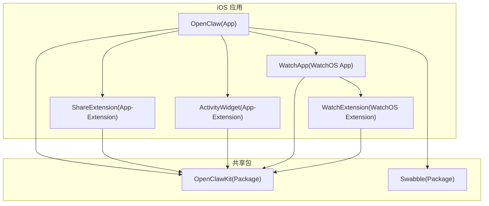
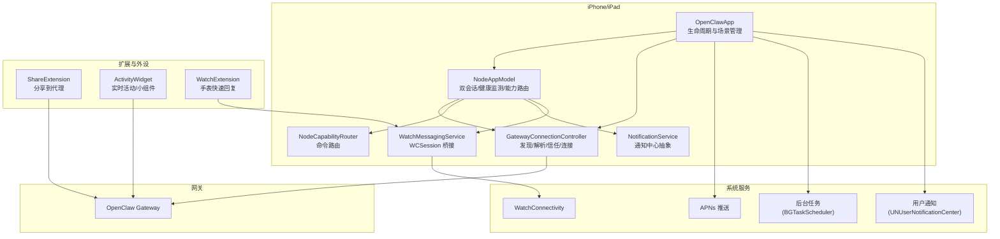
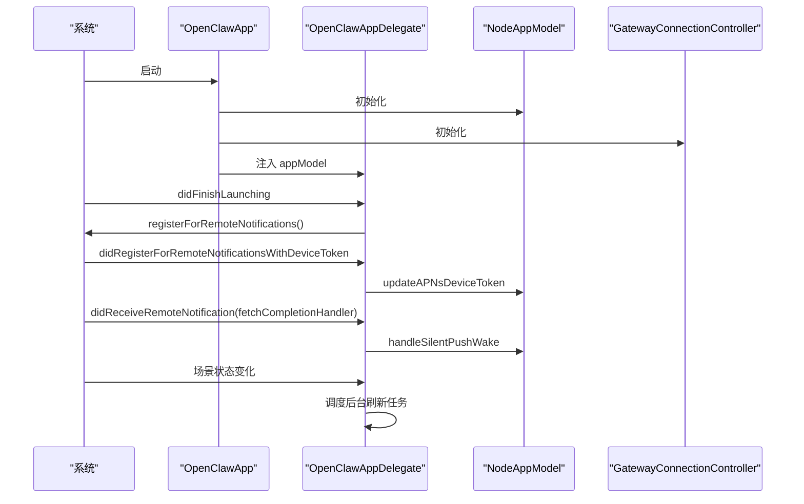
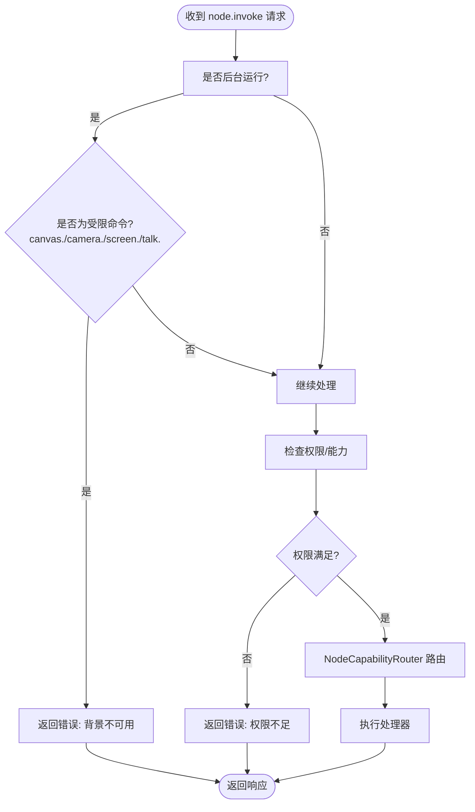
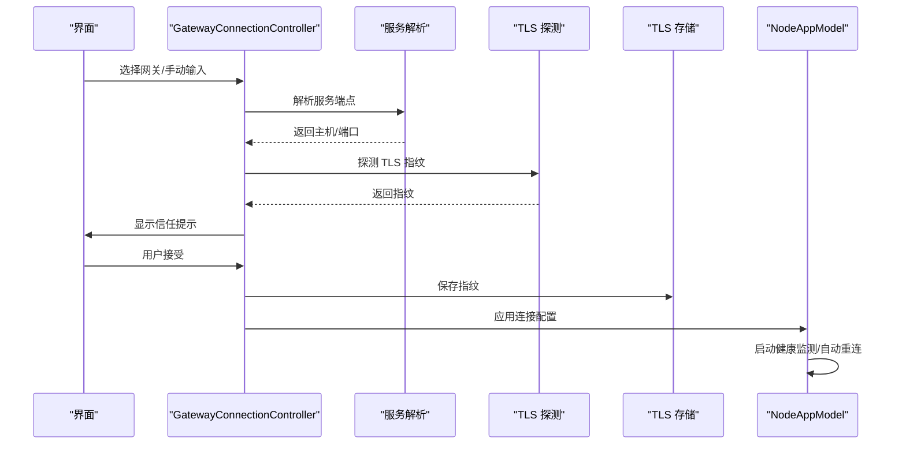
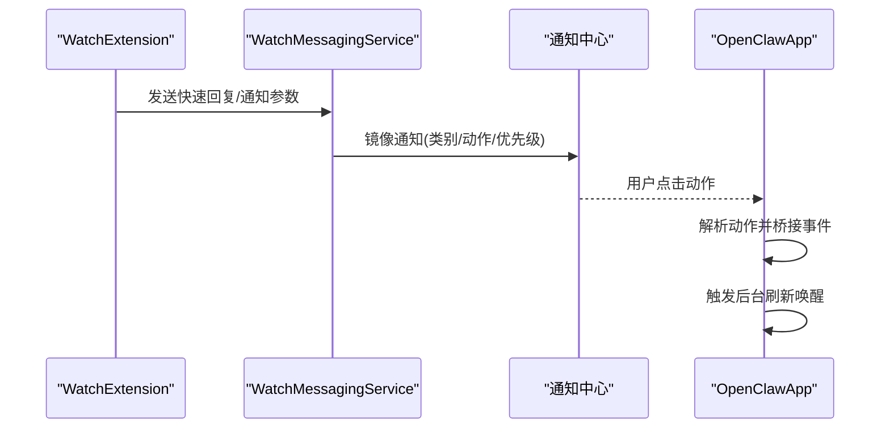
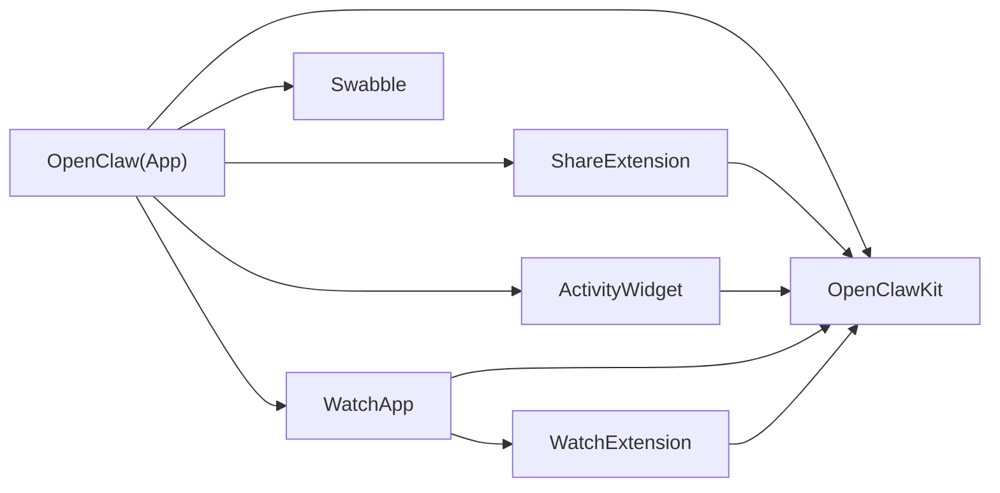

# iOS 移动应用

<cite>
**本文引用的文件**
- [apps/ios/README.md](file://apps/ios/README.md)
- [apps/ios/project.yml](file://apps/ios/project.yml)
- [apps/ios/Sources/OpenClawApp.swift](file://apps/ios/Sources/OpenClawApp.swift)
- [apps/ios/Sources/RootView.swift](file://apps/ios/Sources/RootView.swift)
- [apps/ios/Sources/Model/NodeAppModel.swift](file://apps/ios/Sources/Model/NodeAppModel.swift)
- [apps/ios/Sources/Gateway/GatewayConnectionController.swift](file://apps/ios/Sources/Gateway/GatewayConnectionController.swift)
- [apps/ios/Sources/Capabilities/NodeCapabilityRouter.swift](file://apps/ios/Sources/Capabilities/NodeCapabilityRouter.swift)
- [apps/ios/Sources/Services/NotificationService.swift](file://apps/ios/Sources/Services/NotificationService.swift)
- [apps/ios/Sources/Services/WatchMessagingService.swift](file://apps/ios/Sources/Services/WatchMessagingService.swift)
- [apps/ios/WatchExtension/Sources/OpenClawWatchApp.swift](file://apps/ios/WatchExtension/Sources/OpenClawWatchApp.swift)
- [apps/ios/ActivityWidget/OpenClawActivityWidgetBundle.swift](file://apps/ios/ActivityWidget/OpenClawActivityWidgetBundle.swift)
- [apps/ios/ActivityWidget/OpenClawLiveActivity.swift](file://apps/ios/ActivityWidget/OpenClawLiveActivity.swift)
- [apps/ios/ShareExtension/ShareViewController.swift](file://apps/ios/ShareExtension/ShareViewController.swift)
</cite>

## 目录
1. [简介](#简介)
2. [项目结构](#项目结构)
3. [核心组件](#核心组件)
4. [架构总览](#架构总览)
5. [详细组件分析](#详细组件分析)
6. [依赖关系分析](#依赖关系分析)
7. [性能考虑](#性能考虑)
8. [故障排查指南](#故障排查指南)
9. [结论](#结论)
10. [附录](#附录)

## 简介
本文件面向 OpenClaw iOS 移动应用（iPhone/iPad）的技术文档，覆盖主应用、Activity Widget、Share Extension 以及 Watch 应用的协同机制；详述设备配对流程、节点发现与连接建立；解释 iOS 权限模型与安全限制（后台任务、推送通知、快捷指令集成）；介绍移动节点能力边界（相机、位置、系统工具等）；并提供构建配置、签名与发布流程、与 macOS 差异及跨平台一致性保障，以及 iOS 专属的用户体验与交互模式。

## 项目结构
iOS 应用位于 apps/ios，采用多目标（App、Share Extension、Activity Widget、Watch App/Extension）与 Swift 包（OpenClawKit、Swabble）组合的工程组织方式。XcodeGen 配置文件 project.yml 定义了目标、依赖、信息属性列表与构建设置，确保统一的版本与签名策略。

图表来源
- [apps/ios/project.yml:38-325](file://apps/ios/project.yml#L38-L325)

章节来源
- [apps/ios/project.yml:1-325](file://apps/ios/project.yml#L1-L325)
- [apps/ios/README.md:1-178](file://apps/ios/README.md#L1-L178)

## 核心组件
- 主应用与生命周期：OpenClawApp 负责初始化 NodeAppModel、GatewayConnectionController，并在 AppDelegate 中处理 APNs 注册、静默唤醒与后台刷新任务调度。
- 连接控制器：GatewayConnectionController 负责网关发现、服务解析、信任提示、自动重连与连接参数生成。
- 节点模型：NodeAppModel 维护两个会话（node/operator）、健康监测、后台节流、权限协调与能力路由。
- 能力路由：NodeCapabilityRouter 将 node.invoke 命令分派到具体处理器，按背景态限制执行。
- 通知与 Watch：NotificationService 抽象通知中心；WatchMessagingService 管理 WatchConnectivity 会话与快速回复事件桥接。
- 扩展与 Widget：ShareExtension 实现分享到代理的深链；ActivityWidget 提供实时活动与小组件；WatchExtension 处理手表端快速回复。

章节来源
- [apps/ios/Sources/OpenClawApp.swift:492-542](file://apps/ios/Sources/OpenClawApp.swift#L492-L542)
- [apps/ios/Sources/Model/NodeAppModel.swift:50-221](file://apps/ios/Sources/Model/NodeAppModel.swift#L50-L221)
- [apps/ios/Sources/Gateway/GatewayConnectionController.swift:20-80](file://apps/ios/Sources/Gateway/GatewayConnectionController.swift#L20-L80)
- [apps/ios/Sources/Capabilities/NodeCapabilityRouter.swift:4-26](file://apps/ios/Sources/Capabilities/NodeCapabilityRouter.swift#L4-L26)
- [apps/ios/Sources/Services/NotificationService.swift:12-59](file://apps/ios/Sources/Services/NotificationService.swift#L12-L59)
- [apps/ios/Sources/Services/WatchMessagingService.swift:23-75](file://apps/ios/Sources/Services/WatchMessagingService.swift#L23-L75)

## 架构总览
下图展示 iOS 应用与网关、扩展与 Watch 的交互关系，以及后台任务与推送通知的协同。

图表来源
- [apps/ios/Sources/OpenClawApp.swift:16-263](file://apps/ios/Sources/OpenClawApp.swift#L16-L263)
- [apps/ios/Sources/Model/NodeAppModel.swift:99-120](file://apps/ios/Sources/Model/NodeAppModel.swift#L99-L120)
- [apps/ios/Sources/Gateway/GatewayConnectionController.swift:20-80](file://apps/ios/Sources/Gateway/GatewayConnectionController.swift#L20-L80)
- [apps/ios/Sources/Services/WatchMessagingService.swift:23-75](file://apps/ios/Sources/Services/WatchMessagingService.swift#L23-L75)
- [apps/ios/ShareExtension/ShareViewController.swift](file://apps/ios/ShareExtension/ShareViewController.swift)
- [apps/ios/ActivityWidget/OpenClawActivityWidgetBundle.swift](file://apps/ios/ActivityWidget/OpenClawActivityWidgetBundle.swift)
- [apps/ios/ActivityWidget/OpenClawLiveActivity.swift](file://apps/ios/ActivityWidget/OpenClawLiveActivity.swift)
- [apps/ios/WatchExtension/Sources/OpenClawWatchApp.swift:1-29](file://apps/ios/WatchExtension/Sources/OpenClawWatchApp.swift#L1-L29)

## 详细组件分析

### 主应用与生命周期（OpenClawApp）
- AppDelegate 负责注册远程通知、处理静默推送、调度后台刷新任务；在场景状态变化时触发后台唤醒与恢复逻辑。
- OpenClawApp 初始化 NodeAppModel 与 GatewayConnectionController，注入环境变量并在 URL 打开时处理深链。
- 异常捕获安装，便于定位 SwiftUI/WebKit 内部异常。

图表来源
- [apps/ios/Sources/OpenClawApp.swift:50-156](file://apps/ios/Sources/OpenClawApp.swift#L50-L156)
- [apps/ios/Sources/OpenClawApp.swift:158-263](file://apps/ios/Sources/OpenClawApp.swift#L158-L263)

章节来源
- [apps/ios/Sources/OpenClawApp.swift:16-263](file://apps/ios/Sources/OpenClawApp.swift#L16-L263)
- [apps/ios/Sources/RootView.swift:1-8](file://apps/ios/Sources/RootView.swift#L1-L8)

### 节点模型与能力路由（NodeAppModel / NodeCapabilityRouter）
- NodeAppModel 维护两个 GatewayNodeSession（node/operator），负责健康检查、后台节流、权限协调、Canvas/A2UI 动作、语音唤醒与 Talk 模式同步。
- NodeCapabilityRouter 将 node.invoke 命令映射到具体处理器；在后台或禁用权限时返回明确错误码，避免后台滥用。
- 背景受限命令：canvas.*, camera.*, screen.*, talk.* 在后台被拒绝。

图表来源
- [apps/ios/Sources/Model/NodeAppModel.swift:732-783](file://apps/ios/Sources/Model/NodeAppModel.swift#L732-L783)
- [apps/ios/Sources/Capabilities/NodeCapabilityRouter.swift:19-25](file://apps/ios/Sources/Capabilities/NodeCapabilityRouter.swift#L19-L25)

章节来源
- [apps/ios/Sources/Model/NodeAppModel.swift:50-221](file://apps/ios/Sources/Model/NodeAppModel.swift#L50-L221)
- [apps/ios/Sources/Model/NodeAppModel.swift:732-800](file://apps/ios/Sources/Model/NodeAppModel.swift#L732-L800)
- [apps/ios/Sources/Capabilities/NodeCapabilityRouter.swift:4-26](file://apps/ios/Sources/Capabilities/NodeCapabilityRouter.swift#L4-L26)

### 网关连接与发现（GatewayConnectionController）
- 发现与解析：基于 Bonjour 服务解析主机与端口，支持 SRV/A/AAAA 记录；可从 TXT 解析但不用于认证。
- 信任与 TLS：首次连接探测指纹，弹出信任提示；后续仅允许已存储指纹的连接，防止明文连接。
- 自动重连：根据用户偏好与上次连接记录进行自动连接；前台恢复时主动握手以修复“已连接但死”的状态。
- 连接参数：动态生成客户端显示名、clientId、能力与命令集，随设置变化即时生效。

图表来源
- [apps/ios/Sources/Gateway/GatewayConnectionController.swift:95-156](file://apps/ios/Sources/Gateway/GatewayConnectionController.swift#L95-L156)
- [apps/ios/Sources/Gateway/GatewayConnectionController.swift:242-278](file://apps/ios/Sources/Gateway/GatewayConnectionController.swift#L242-L278)
- [apps/ios/Sources/Gateway/GatewayConnectionController.swift:446-470](file://apps/ios/Sources/Gateway/GatewayConnectionController.swift#L446-L470)

章节来源
- [apps/ios/Sources/Gateway/GatewayConnectionController.swift:20-80](file://apps/ios/Sources/Gateway/GatewayConnectionController.swift#L20-L80)
- [apps/ios/Sources/Gateway/GatewayConnectionController.swift:421-429](file://apps/ios/Sources/Gateway/GatewayConnectionController.swift#L421-L429)
- [apps/ios/Sources/Gateway/GatewayConnectionController.swift:732-806](file://apps/ios/Sources/Gateway/GatewayConnectionController.swift#L732-L806)

### 通知与 Watch 消息（NotificationService / WatchMessagingService）
- 通知中心抽象：封装授权查询、请求与投递，屏蔽 UNUserNotificationCenter 差异。
- WatchConnectivity：封装 WCSession 激活、消息发送与快速回复事件接收；支持可达时 sendMessage 与不可达时 transferUserInfo；提供状态快照。
- 通知镜像：从 Watch 到 iPhone 的通知镜像与动作路由，支持前台/后台处理与优先级控制。

图表来源
- [apps/ios/Sources/Services/WatchMessagingService.swift:77-146](file://apps/ios/Sources/Services/WatchMessagingService.swift#L77-L146)
- [apps/ios/Sources/Services/NotificationService.swift:18-58](file://apps/ios/Sources/Services/NotificationService.swift#L18-L58)
- [apps/ios/Sources/OpenClawApp.swift:265-463](file://apps/ios/Sources/OpenClawApp.swift#L265-L463)

章节来源
- [apps/ios/Sources/Services/WatchMessagingService.swift:23-75](file://apps/ios/Sources/Services/WatchMessagingService.swift#L23-L75)
- [apps/ios/Sources/Services/NotificationService.swift:12-59](file://apps/ios/Sources/Services/NotificationService.swift#L12-L59)
- [apps/ios/WatchExtension/Sources/OpenClawWatchApp.swift:1-29](file://apps/ios/WatchExtension/Sources/OpenClawWatchApp.swift#L1-L29)

### 扩展与 Widget
- ShareExtension：通过 NSExtensionActivationRule 支持文本、网页 URL、图片/视频，转发到网关会话。
- ActivityWidget：支持实时活动与小组件，使用 WidgetKit 与 ActivityKit；声明支持 Live Activities。
- WatchExtension：处理来自手表的快速回复，激活后接收消息并通过 WCSession 回传。

章节来源
- [apps/ios/project.yml:145-182](file://apps/ios/project.yml#L145-L182)
- [apps/ios/project.yml:183-213](file://apps/ios/project.yml#L183-L213)
- [apps/ios/ShareExtension/ShareViewController.swift](file://apps/ios/ShareExtension/ShareViewController.swift)
- [apps/ios/ActivityWidget/OpenClawActivityWidgetBundle.swift](file://apps/ios/ActivityWidget/OpenClawActivityWidgetBundle.swift)
- [apps/ios/ActivityWidget/OpenClawLiveActivity.swift](file://apps/ios/ActivityWidget/OpenClawLiveActivity.swift)
- [apps/ios/WatchExtension/Sources/OpenClawWatchApp.swift:1-29](file://apps/ios/WatchExtension/Sources/OpenClawWatchApp.swift#L1-L29)

## 依赖关系分析
- 目标依赖：App 依赖 ShareExtension、ActivityWidget、WatchApp；WatchApp 依赖 WatchExtension。
- 包依赖：App 使用 OpenClawKit（聊天 UI、协议、节点会话）、Swabble（语言/工具）。
- 系统框架：AppIntents、WidgetKit、ActivityKit、WatchConnectivity、UserNotifications、BackgroundTasks 等。
- 信息属性：Info.plist 设置 URL Scheme、后台模式、网络权限、Live Activities、权限描述等。

图表来源
- [apps/ios/project.yml:39-60](file://apps/ios/project.yml#L39-L60)
- [apps/ios/project.yml:214-266](file://apps/ios/project.yml#L214-L266)

章节来源
- [apps/ios/project.yml:1-325](file://apps/ios/project.yml#L1-L325)

## 性能考虑
- 后台节流：后台运行时限制 canvas/camera/screen/talk 命令，避免资源滥用与电池消耗。
- 健康监测：定期健康检查失败时断开并重连，减少“已连接但不可用”状态。
- 背景任务：使用 BGTaskScheduler 定期唤醒，结合静默推送与位置事件，降低长时挂起风险。
- 连接复用：前台恢复时优先健康检查，必要时重启连接，避免长时间后台悬挂导致的死连接。

章节来源
- [apps/ios/Sources/Model/NodeAppModel.swift:732-783](file://apps/ios/Sources/Model/NodeAppModel.swift#L732-L783)
- [apps/ios/Sources/Model/NodeAppModel.swift:688-730](file://apps/ios/Sources/Model/NodeAppModel.swift#L688-L730)
- [apps/ios/Sources/OpenClawApp.swift:104-156](file://apps/ios/Sources/OpenClawApp.swift#L104-L156)

## 故障排查指南
- 构建与签名基线：重新生成项目、确认团队与 Bundle ID；本地签名使用 LocalSigning.xcconfig 示例。
- 网关状态核验：在设置中查看状态、服务器与远端地址；若显示配对/鉴权阻塞，先在 Telegram 执行配对批准再重连。
- 发现调试：开启“发现调试日志”，查看设置中的日志输出；网络路径不清时切换手动主机/端口与 TLS。
- APNs：确认推送能力与配置文件匹配；开发/生产环境区分；若注册失败，检查 Xcode 日志。
- 背景行为：先在前台复现，再验证后台切回后的重连与恢复；关注热耗与续航。

章节来源
- [apps/ios/README.md:18-87](file://apps/ios/README.md#L18-L87)
- [apps/ios/README.md:89-178](file://apps/ios/README.md#L89-L178)

## 结论
该 iOS 应用通过清晰的目标划分与包依赖，实现了主应用、扩展与 Watch 的协同工作；以能力路由与后台节流保障安全与性能；以健康监测与自动重连提升可靠性；以通知与 Watch 桥接增强交互体验。配合严格的 TLS 信任与权限模型，满足 iOS 平台的安全与隐私要求。

## 附录

### iOS 权限模型与安全限制
- 推送通知：启动即注册；APNs 环境随构建类型自动选择；需正确配置推送能力与配置文件。
- 后台任务：使用 BGTaskScheduler 定期刷新；静默推送用于唤醒；后台连接受系统限制。
- 快捷指令：通过 AppIntents 框架集成（目标中启用相关设置）。
- 权限描述：在 Info.plist 中声明相机、麦克风、位置、相册、运动等用途描述。

章节来源
- [apps/ios/project.yml:101-144](file://apps/ios/project.yml#L101-L144)
- [apps/ios/Sources/OpenClawApp.swift:50-96](file://apps/ios/Sources/OpenClawApp.swift#L50-L96)

### 移动节点能力范围
- Canvas：A2UI 动作、按钮点击、上下文传递。
- 相机：拍照/短视频录制（需相机权限）。
- 屏幕：屏幕录制（需屏幕录制权限）。
- 位置：位置授权与显著位置事件（Always 需要时才后台）。
- 通讯录/日历/提醒事项/照片/运动：系统服务集成。
- 语音：语音唤醒与 Talk 模式（二者互斥占用麦克风）。

章节来源
- [apps/ios/Sources/Model/NodeAppModel.swift:223-298](file://apps/ios/Sources/Model/NodeAppModel.swift#L223-L298)
- [apps/ios/Sources/Gateway/GatewayConnectionController.swift:787-806](file://apps/ios/Sources/Gateway/GatewayConnectionController.swift#L787-L806)

### 构建配置、签名与发布
- 开发：XcodeGen 生成项目；本地签名使用 LocalSigning.xcconfig 示例；pnpm ios:open 快速打开。
- Beta：Fastlane 集成；App Store Connect API Key 配置；版本号来源于根版本；支持归档与上传 TestFlight。
- 签名：通过 Signing.xcconfig 与环境变量注入；支持开发/发布两种配置文件。

章节来源
- [apps/ios/README.md:18-87](file://apps/ios/README.md#L18-L87)
- [apps/ios/project.yml:42-45](file://apps/ios/project.yml#L42-L45)

### 与 macOS 的差异与跨平台一致性
- 目标差异：iOS 使用 App/Extension/Widget/WatchOS；macOS 使用 App/IPC 测试与独立包。
- 一致接口：通过 OpenClawKit 提供的协议与服务抽象，保持节点会话、能力路由与通知桥接的一致性。
- 体验差异：iOS 更强调后台节流与权限最小化；macOS 可能具备更宽松的后台能力。

章节来源
- [apps/ios/project.yml:13-18](file://apps/ios/project.yml#L13-L18)
- [apps/ios/Sources/Model/NodeAppModel.swift:99-120](file://apps/ios/Sources/Model/NodeAppModel.swift#L99-L120)