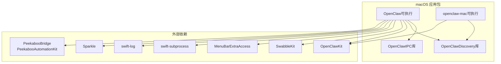
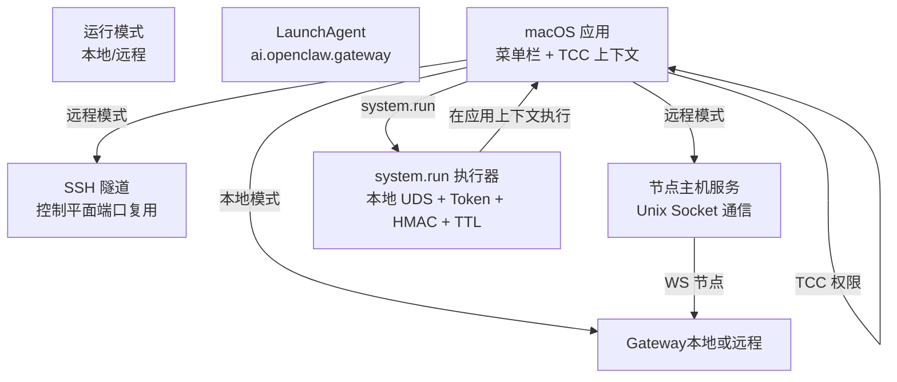
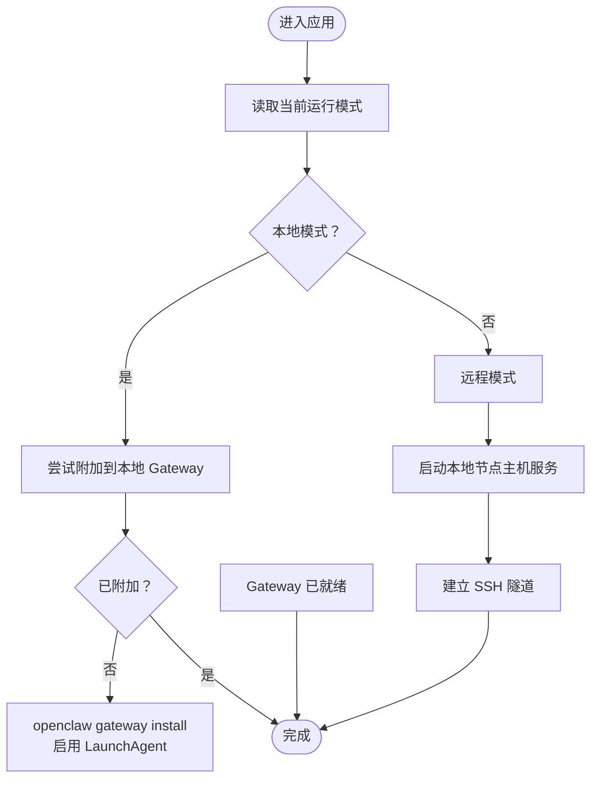
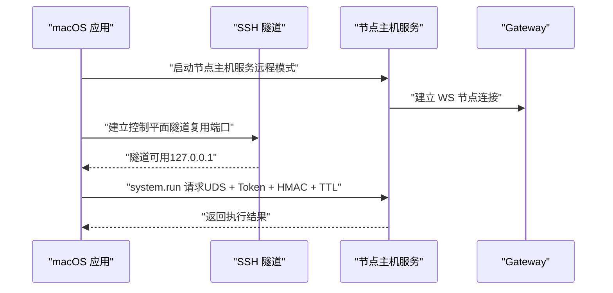
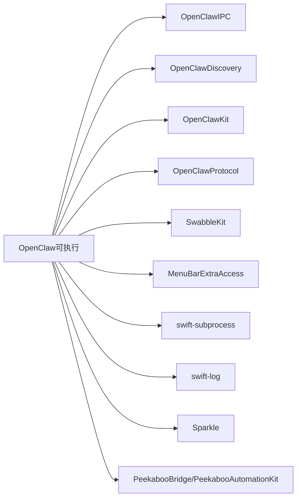

# macOS 桌面应用

<cite>
**本文引用的文件**
- [apps/macos/README.md](file://apps/macos/README.md)
- [docs/platforms/macos.md](file://docs/platforms/macos.md)
- [apps/macos/Package.swift](file://apps/macos/Package.swift)
- [scripts/restart-mac.sh](file://scripts/restart-mac.sh)
- [scripts/package-mac-app.sh](file://scripts/package-mac-app.sh)
- [scripts/codesign-mac-app.sh](file://scripts/codesign-mac-app.sh)
- [scripts/notarize-mac-artifact.sh](file://scripts/notarize-mac-artifact.sh)
- [scripts/create-dmg.sh](file://scripts/create-dmg.sh)
- [docs/gateway/configuration.md](file://docs/gateway/configuration.md)
- [docs/gateway/protocol.md](file://docs/gateway/protocol.md)
- [docs/tools/exec-approvals.md](file://docs/tools/exec-approvals.md)
- [docs/platforms/macos/canvas.md](file://docs/platforms/macos/canvas.md)
- [docs/platforms/macos/permissions.md](file://docs/platforms/macos/permissions.md)
- [docs/platforms/macos/remote.md](file://docs/platforms/macos/remote.md)
- [docs/cli/gateway.md](file://docs/cli/gateway.md)
- [docs/cli/system.md](file://docs/cli/system.md)
</cite>

## 目录
1. [简介](#简介)
2. [项目结构](#项目结构)
3. [核心组件](#核心组件)
4. [架构总览](#架构总览)
5. [详细组件分析](#详细组件分析)
6. [依赖关系分析](#依赖关系分析)
7. [性能考虑](#性能考虑)
8. [故障排除指南](#故障排除指南)
9. [结论](#结论)
10. [附录](#附录)

## 简介
本文件面向 OpenClaw 的 macOS 桌面应用（菜单栏伴侣），系统性阐述其核心能力与实现：权限管理（TCC）、通知系统、网关生命周期管理；本地与远程模式的差异与切换机制（含 launchd 服务管理、SSH 隧道与节点主机服务）；macOS 特有节点能力（Canvas、Camera、Screen Recording、system.run 等）；执行审批系统（Exec approvals）的安全机制与配置；深链接协议的使用方法与参数；以及构建流程、开发工作流与调试工具。

## 项目结构
OpenClaw 的 macOS 应用位于 apps/macos，采用 Swift Package Manager 组织多目标产物：菜单栏主应用、命令行工具、IPC 库与发现库。应用通过 Sparkle 进行更新，集成 Peekaboo 用于 UI 自动化桥接，并提供 OpenClawKit 作为跨平台能力与协议支持。

图表来源
- [apps/macos/Package.swift:26-92](file://apps/macos/Package.swift#L26-L92)

章节来源
- [apps/macos/Package.swift:1-93](file://apps/macos/Package.swift#L1-L93)

## 核心组件
- 菜单栏伴侣与通知系统：负责在菜单栏展示状态、触发原生通知、处理用户交互。
- 权限管理（TCC）：集中处理通知、辅助功能、屏幕录制、麦克风、语音识别、自动化/AppleScript 等权限提示与状态。
- 网关生命周期管理：本地模式下通过 launchd 控制 Gateway；远程模式下通过 SSH 隧道连接远端 Gateway。
- 节点主机服务：在远程模式下启动本地节点主机服务以允许远端 Gateway 访问本机能力；在本地模式下停止该服务。
- 执行审批系统（Exec approvals）：对 system.run 命令进行安全控制，支持默认策略、询问策略与白名单。
- 深链接协议：注册 openclaw:// 方案，支持从浏览器或脚本触发 Agent 请求。
- 构建与签名：提供打包、签名、公证与 DMG 制作脚本，支持多种签名与审计选项。

章节来源
- [docs/platforms/macos.md:11-25](file://docs/platforms/macos.md#L11-L25)
- [docs/platforms/macos.md:26-34](file://docs/platforms/macos.md#L26-L34)
- [docs/platforms/macos.md:50-74](file://docs/platforms/macos.md#L50-L74)
- [docs/platforms/macos.md:75-111](file://docs/platforms/macos.md#L75-L111)
- [docs/platforms/macos.md:112-138](file://docs/platforms/macos.md#L112-L138)

## 架构总览
下图展示了 macOS 应用与 Gateway、节点主机服务及系统权限之间的交互关系：

图表来源
- [docs/platforms/macos.md:26-34](file://docs/platforms/macos.md#L26-L34)
- [docs/platforms/macos.md:66-74](file://docs/platforms/macos.md#L66-L74)
- [docs/platforms/macos.md:200-219](file://docs/platforms/macos.md#L200-L219)

## 详细组件分析

### 权限管理（TCC）
- 角色：集中发起并管理 TCC 提示，避免分散在各工具中导致用户体验不一致。
- 能力范围：通知、辅助功能（Accessibility）、屏幕录制、麦克风、语音识别、自动化/AppleScript。
- 交互：首次运行时引导完成权限清单；后续通过菜单栏入口查看/重置权限状态。

章节来源
- [docs/platforms/macos.md:17-21](file://docs/platforms/macos.md#L17-L21)
- [docs/platforms/macos/permissions.md](file://docs/platforms/macos/permissions.md)

### 通知系统
- 原生通知：在菜单栏显示状态与事件通知，支持点击交互。
- 与 Gateway 状态联动：根据网关健康检查与心跳结果更新通知内容。

章节来源
- [docs/platforms/macos.md:17](file://docs/platforms/macos.md#L17)

### 网关生命周期管理
- 本地模式：优先附加到已运行的本地 Gateway；若未运行，则通过 openclaw gateway install 启用 LaunchAgent 并由 launchd 启动。
- 远程模式：不直接启动本地 Gateway；而是启动本地节点主机服务，使远端 Gateway 可达本机；同时建立 SSH 隧道以承载控制平面通信。

章节来源
- [docs/platforms/macos.md:26-34](file://docs/platforms/macos.md#L26-L34)
- [docs/platforms/macos.md:35-49](file://docs/platforms/macos.md#L35-L49)

### 本地 vs 远程模式与切换机制
- 切换依据：用户在应用设置中选择模式；应用据此决定是否启用 launchd、启动节点主机服务与建立 SSH 隧道。
- 本地模式行为：attach 到现有 Gateway 或安装并启动 LaunchAgent。
- 远程模式行为：启动节点主机服务（WS 节点），建立稳定 SSH 隧道（控制端口复用），不启动本地 Gateway 子进程。

图表来源
- [docs/platforms/macos.md:26-34](file://docs/platforms/macos.md#L26-L34)
- [docs/platforms/macos.md:200-219](file://docs/platforms/macos.md#L200-L219)

章节来源
- [docs/platforms/macos.md:26-34](file://docs/platforms/macos.md#L26-L34)
- [docs/platforms/macos.md:200-219](file://docs/platforms/macos.md#L200-L219)

### launchd 服务管理
- 标签：ai.openclaw.gateway（或带 profile 的 ai.openclaw.<profile>）；兼容旧标签 com.openclaw.* 的卸载。
- 控制命令：kickstart -k 与 bootout 用于重启与卸载；openclaw gateway install 安装服务。
- 作用：在本地模式下确保 Gateway 常驻运行。

章节来源
- [docs/platforms/macos.md:35-49](file://docs/platforms/macos.md#L35-L49)
- [docs/cli/gateway.md](file://docs/cli/gateway.md)

### SSH 隧道与节点主机服务
- SSH 隧道（控制平面）：复用 Gateway 控制端口，保持稳定本地端口；使用批处理与退出即停等参数；隧道内使用回环地址，节点 IP 显示为 127.0.0.1。
- 节点主机服务：在远程模式下通过 launchd 启动，作为 WS 节点连接 Gateway；在本地模式下停止该服务。
- 通信路径：节点主机服务通过 Unix Socket 与应用通信，携带令牌、HMAC 与 TTL，确保本地 IPC 安全。

图表来源
- [docs/platforms/macos.md:66-74](file://docs/platforms/macos.md#L66-L74)
- [docs/platforms/macos.md:200-219](file://docs/platforms/macos.md#L200-L219)

章节来源
- [docs/platforms/macos.md:66-74](file://docs/platforms/macos.md#L66-L74)
- [docs/platforms/macos.md:200-219](file://docs/platforms/macos.md#L200-L219)

### macOS 特有节点能力
- Canvas：画布呈现、导航、脚本执行、截图、A2UI 工具集。
- Camera：拍照、拍摄片段。
- Screen：屏幕录制。
- System：system.run、system.notify。
- 权限报告：节点上报 permissions 映射，供代理决策。

章节来源
- [docs/platforms/macos.md:50-65](file://docs/platforms/macos.md#L50-L65)
- [docs/platforms/macos/canvas.md](file://docs/platforms/macos/canvas.md)

### 执行审批系统（Exec approvals）
- 存储位置：~/.openclaw/exec-approvals.json。
- 策略：
  - 默认策略：deny 或 ask（on-miss）。
  - 代理级策略：可覆盖默认策略与白名单。
  - 白名单：基于解析后的二进制路径的通配模式。
- 行为：
  - 包含 shell 控制语法的原始命令文本按未命中处理，需显式批准或允许 shell 二进制。
  - 在确认界面选择“始终允许”会写入白名单。
  - 对环境变量进行过滤后合并，shell 包装器仅保留有限白名单键。
  - 允许“总是”决策时，对常见调度包装器进行安全解包以持久化内部可执行路径。

章节来源
- [docs/platforms/macos.md:75-111](file://docs/platforms/macos.md#L75-L111)
- [docs/tools/exec-approvals.md](file://docs/tools/exec-approvals.md)

### 深链接协议
- 协议：openclaw://。
- 场景：触发 Gateway 的 agent 请求。
- 参数：
  - message（必填）
  - sessionKey（可选）
  - thinking（可选）
  - deliver/to/channel（可选）
  - timeoutSeconds（可选）
  - key（可选，无 key 时需要确认且限制消息长度并忽略投递参数）
- 安全：带 key 时为无人值守模式，适合个人自动化。

章节来源
- [docs/platforms/macos.md:112-138](file://docs/platforms/macos.md#L112-L138)

### 与网关服务器的通信协议与状态同步
- 协议：遵循 Gateway 协议规范，支持 WS 节点连接、控制平面调用与状态同步。
- 状态同步：通过心跳、健康检查与发现机制维持状态一致性；远程模式下通过隧道复用控制端口。
- 发现：macOS 应用使用 NWBrowser 与 tailnet DNS-SD 回退；CLI 使用 dns-sd 发现，二者可能在过滤逻辑上存在差异。

章节来源
- [docs/gateway/protocol.md](file://docs/gateway/protocol.md)
- [docs/platforms/macos.md:171-198](file://docs/platforms/macos.md#L171-L198)

## 依赖关系分析
- 内部依赖：OpenClawIPC、OpenClawDiscovery、OpenClawKit、OpenClawProtocol、SwabbleKit。
- 外部依赖：MenuBarExtraAccess（菜单栏）、Subprocess（子进程）、Logging（日志）、Sparkle（更新）、Peekaboo（UI 自动化）。
- 目标产物：OpenClaw（菜单栏应用）、openclaw-mac（调试 CLI）、OpenClawIPC（库）、OpenClawDiscovery（库）。

图表来源
- [apps/macos/Package.swift:42-57](file://apps/macos/Package.swift#L42-L57)

章节来源
- [apps/macos/Package.swift:17-57](file://apps/macos/Package.swift#L17-L57)

## 性能考虑
- 本地模式：优先 attach 已运行实例，减少冷启动开销；必要时通过 launchd 启动以降低首次延迟。
- 远程模式：复用 SSH 隧道端口，避免频繁重建；节点主机服务仅在远程模式启用，降低本地资源占用。
- IPC 安全：system.run 通过 UDS + Token + HMAC + TTL 的本地通道执行，避免网络暴露带来的额外延迟与风险。
- 更新与诊断：使用 Sparkle 进行增量更新；提供 openclaw-mac 调试 CLI 以验证发现与握手逻辑，便于快速定位问题。

## 故障排除指南
- 开发运行与签名
  - 快速开发：使用 scripts/restart-mac.sh；--no-sign 为临时签名，TCC 权限不会持久；--sign 强制代码签名（需证书）。
  - 打包：scripts/package-mac-app.sh 创建 dist/OpenClaw.app 并签名。
  - 团队 ID 审计：签名后校验 Mach-O 内嵌二进制团队 ID 是否一致，不一致则失败；可通过 SKIP_TEAM_ID_CHECK=1 跳过。
  - 开发专用绕过：DISABLE_LIBRARY_VALIDATION=1 临时允许库验证（仅本地开发）。
- 构建与打包
  - 构建：cd apps/macos && swift build；运行：swift run OpenClaw 或 Xcode。
  - DMG 制作：scripts/create-dmg.sh。
- 远程连接
  - SSH 隧道：控制端口复用，使用批处理与退出即停参数；隧道内 IP 为 127.0.0.1。
  - 发现差异：macOS 应用与 CLI 的发现管线可能不同，建议对比输出以定位差异。
- system.run 审批
  - 若被拦截，检查 ~/.openclaw/exec-approvals.json 的默认策略、代理策略与白名单条目；确认是否包含 shell 控制语法导致按未命中处理。

章节来源
- [apps/macos/README.md:3-65](file://apps/macos/README.md#L3-L65)
- [docs/platforms/macos.md:165-198](file://docs/platforms/macos.md#L165-L198)
- [docs/platforms/macos.md:200-219](file://docs/platforms/macos.md#L200-L219)
- [docs/platforms/macos.md:75-111](file://docs/platforms/macos.md#L75-L111)

## 结论
OpenClaw 的 macOS 桌面应用以菜单栏为核心入口，统一管理 TCC 权限、通知与网关生命周期；通过本地/远程模式灵活适配不同部署场景；借助 Sparkle 实现安全更新，借助 Exec approvals 保障 system.run 的安全可控；通过 SSH 隧道与节点主机服务实现远程可达与本地能力暴露。整体设计兼顾易用性、安全性与可维护性。

## 附录
- 构建与发布
  - 构建：swift build；运行：swift run OpenClaw；Xcode 启动。
  - 打包：scripts/package-mac-app.sh；签名：scripts/codesign-mac-app.sh；公证：scripts/notarize-mac-artifact.sh；DMG：scripts/create-dmg.sh。
- 配置参考
  - Gateway 配置：docs/gateway/configuration.md
  - 协议规范：docs/gateway/protocol.md
  - macOS 远程访问：docs/platforms/macos/remote.md
- CLI 参考
  - gateway：docs/cli/gateway.md
  - system：docs/cli/system.md