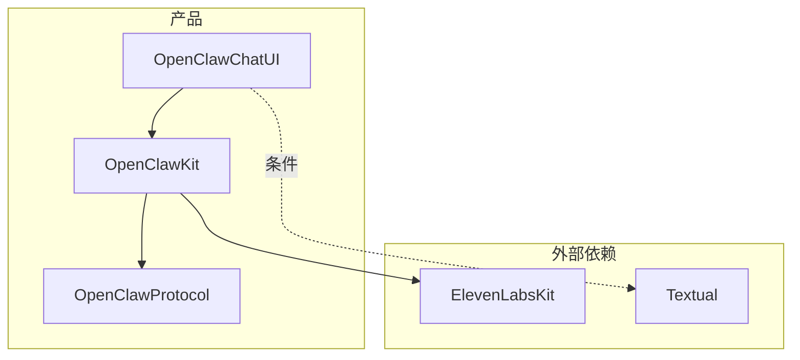
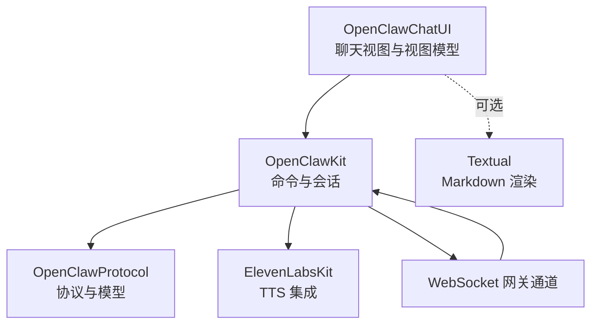
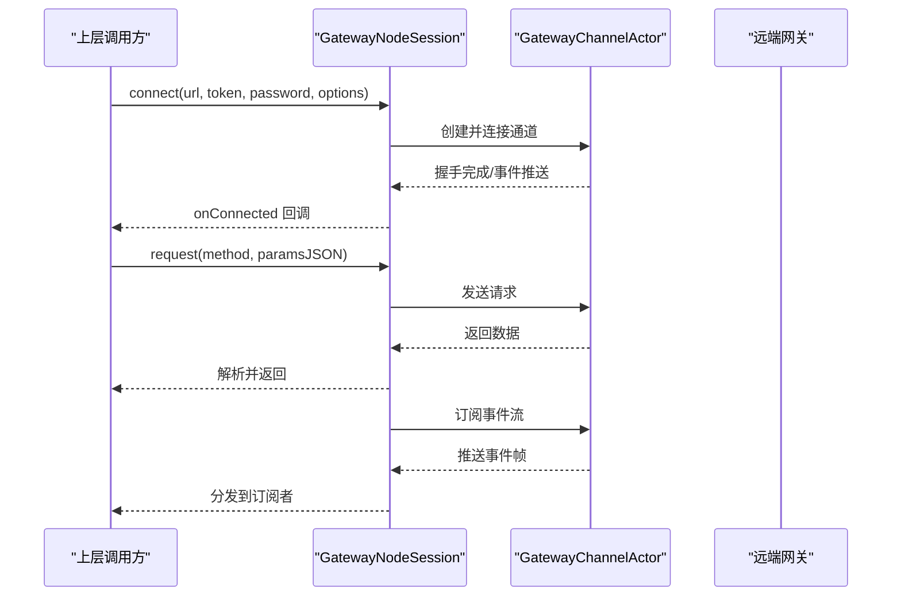
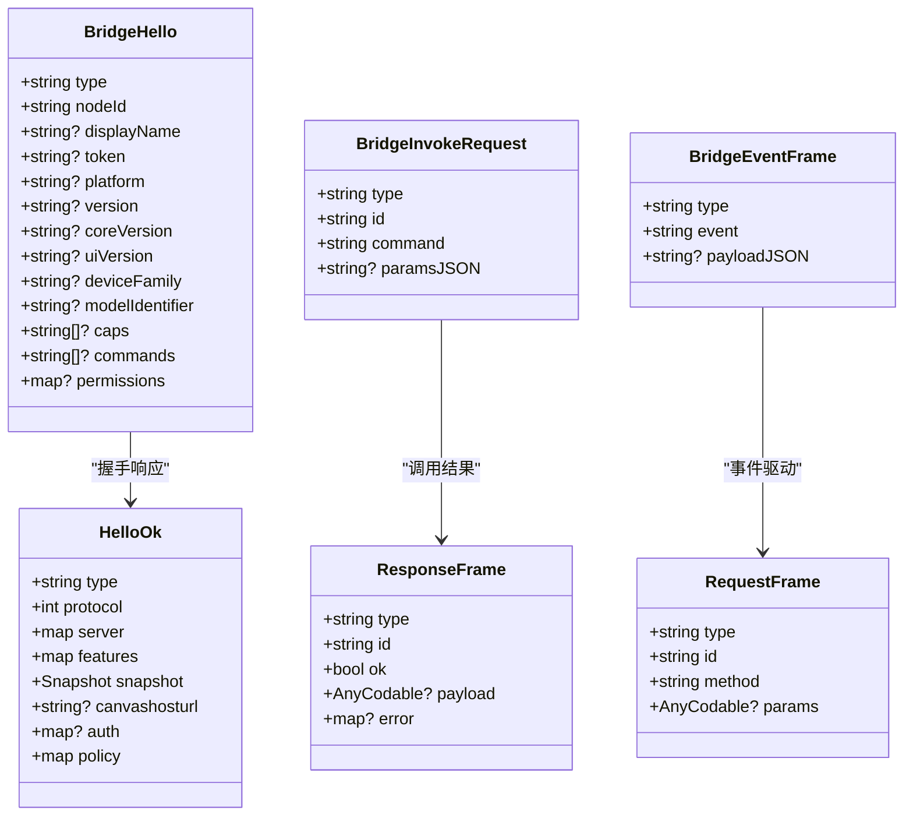
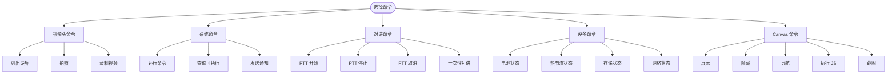
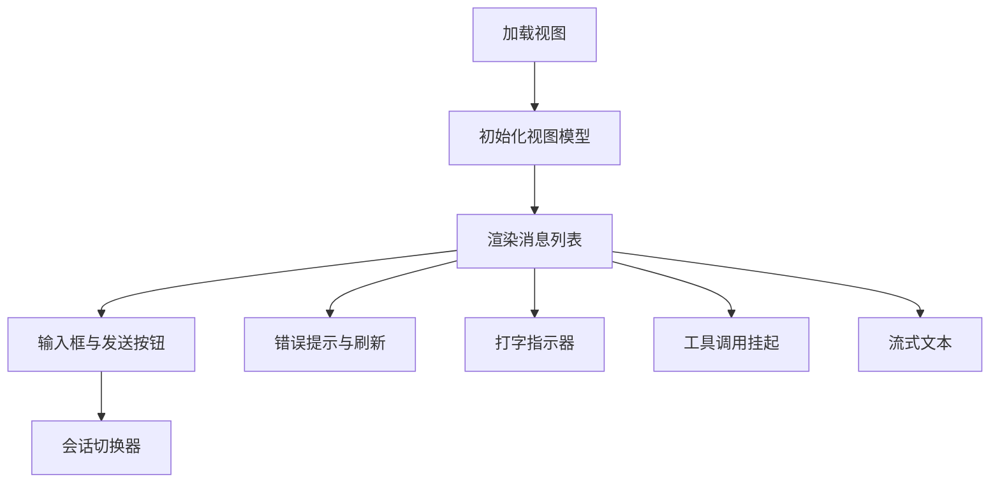
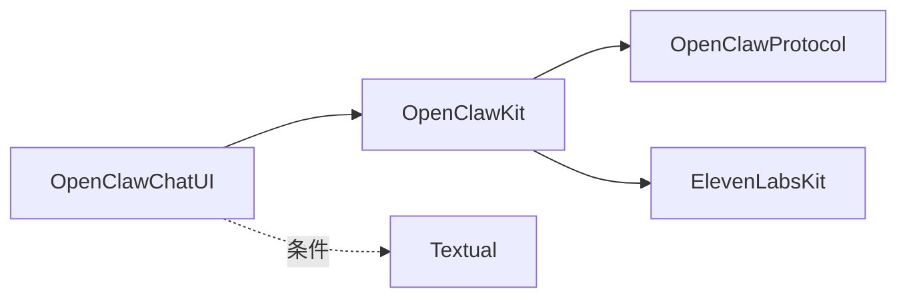

# 共享代码库

<cite>
**本文引用的文件**
- [Package.swift](file://apps/shared/OpenClawKit/Package.swift)
- [GatewayModels.swift](file://apps/shared/OpenClawKit/Sources/OpenClawProtocol/GatewayModels.swift)
- [WizardHelpers.swift](file://apps/shared/OpenClawKit/Sources/OpenClawProtocol/WizardHelpers.swift)
- [BridgeFrames.swift](file://apps/shared/OpenClawKit/Sources/OpenClawKit/BridgeFrames.swift)
- [GatewayNodeSession.swift](file://apps/shared/OpenClawKit/Sources/OpenClawKit/GatewayNodeSession.swift)
- [ChatView.swift](file://apps/shared/OpenClawKit/Sources/OpenClawChatUI/ChatView.swift)
- [CameraCommands.swift](file://apps/shared/OpenClawKit/Sources/OpenClawKit/CameraCommands.swift)
- [SystemCommands.swift](file://apps/shared/OpenClawKit/Sources/OpenClawKit/SystemCommands.swift)
- [TalkCommands.swift](file://apps/shared/OpenClawKit/Sources/OpenClawKit/TalkCommands.swift)
- [DeviceCommands.swift](file://apps/shared/OpenClawKit/Sources/OpenClawKit/DeviceCommands.swift)
- [CanvasCommands.swift](file://apps/shared/OpenClawKit/Sources/OpenClawKit/CanvasCommands.swift)
- [AnyCodable.swift](file://apps/shared/OpenClawKit/Sources/OpenClawKit/AnyCodable.swift)
- [AsyncTimeout.swift](file://apps/shared/OpenClawKit/Sources/OpenClawKit/AsyncTimeout.swift)
- [ThrowingContinuationSupport.swift](file://apps/shared/OpenClawKit/Sources/OpenClawKit/ThrowingContinuationSupport.swift)
- [ChatViewModelTests.swift](file://apps/shared/OpenClawKit/Tests/OpenClawKitTests/ChatViewModelTests.swift)
</cite>

## 目录
1. [简介](#简介)
2. [项目结构](#项目结构)
3. [核心组件](#核心组件)
4. [架构总览](#架构总览)
5. [详细组件分析](#详细组件分析)
6. [依赖关系分析](#依赖关系分析)
7. [性能考量](#性能考量)
8. [故障排查指南](#故障排查指南)
9. [结论](#结论)
10. [附录](#附录)

## 简介
本文件面向 OpenClaw 共享代码库（OpenClawKit）的技术文档，系统阐述跨平台共享代码的设计理念、架构模式与模块划分，重点覆盖：
- 平台抽象层与通用功能模块组织
- Swift Package Manager 使用与依赖管理策略
- 协议与泛型在跨平台兼容中的应用
- 模块化边界与接口契约
- 开发指南（编码规范、测试策略、版本管理）
- 性能优化与内存管理最佳实践

## 项目结构
OpenClawKit 采用 Swift Package 结构，按“协议层-核心库-UI 层”三层组织，目标平台为 iOS 18+ 与 macOS 15+。包内产品包括：
- OpenClawProtocol：跨设备网关通信协议与通用数据模型
- OpenClawKit：核心能力与平台适配（命令、会话、资源等）
- OpenClawChatUI：基于 SwiftUI 的聊天界面与视图模型

图表来源
- [Package.swift:11-19](file://apps/shared/OpenClawKit/Package.swift#L11-L19)
- [Package.swift:20-52](file://apps/shared/OpenClawKit/Package.swift#L20-L52)

章节来源
- [Package.swift:1-62](file://apps/shared/OpenClawKit/Package.swift#L1-L62)

## 核心组件
- 协议与模型（OpenClawProtocol）
  - 定义网关连接参数、握手帧、请求/响应帧、事件帧、状态快照、错误形状等
  - 提供向后兼容的协议版本常量与通用 AnyCodable 类型别名
- 网关节点会话（OpenClawKit）
  - 封装 WebSocket 连接、握手、事件订阅、超时控制与调用转发
  - 提供 Canvas Host URL 规范化、能力刷新、远程地址解析等能力
- 聊天 UI（OpenClawChatUI）
  - 基于 SwiftUI 的消息列表、输入框、会话切换、Markdown 渲染与主题
  - 支持 macOS/iOS 差异化布局与交互

章节来源
- [GatewayModels.swift:1-800](file://apps/shared/OpenClawKit/Sources/OpenClawProtocol/GatewayModels.swift#L1-L800)
- [AnyCodable.swift:1-5](file://apps/shared/OpenClawKit/Sources/OpenClawKit/AnyCodable.swift#L1-L5)
- [GatewayNodeSession.swift:1-530](file://apps/shared/OpenClawKit/Sources/OpenClawKit/GatewayNodeSession.swift#L1-L530)
- [ChatView.swift:1-593](file://apps/shared/OpenClawKit/Sources/OpenClawChatUI/ChatView.swift#L1-L593)

## 架构总览
OpenClawKit 通过“协议层-核心库-UI 层”的分层设计实现跨平台抽象：
- 协议层：定义稳定的数据结构与帧格式，确保与远端网关的解耦与可演进
- 核心库：封装命令、会话、网络、资源与平台特性（如相机、系统执行、TTS 等），并以严格并发设置保障线程安全
- UI 层：提供一致的聊天体验，并通过条件编译适配不同平台

图表来源
- [Package.swift:16-19](file://apps/shared/OpenClawKit/Package.swift#L16-L19)
- [Package.swift:40-47](file://apps/shared/OpenClawKit/Package.swift#L40-L47)
- [GatewayNodeSession.swift:1-530](file://apps/shared/OpenClawKit/Sources/OpenClawKit/GatewayNodeSession.swift#L1-L530)
- [ChatView.swift:1-593](file://apps/shared/OpenClawKit/Sources/OpenClawChatUI/ChatView.swift#L1-L593)

## 详细组件分析

### 组件一：网关节点会话（GatewayNodeSession）
职责与流程
- 负责与远端网关建立连接、维护握手与事件流
- 处理“节点调用请求”，将远端请求转交上层处理，并返回结果或错误
- 提供 Canvas Host URL 规范化与能力刷新，支持动态替换能力标识
- 提供超时控制与等待快照机制，保证会话初始化的稳定性

图表来源
- [GatewayNodeSession.swift:194-253](file://apps/shared/OpenClawKit/Sources/OpenClawKit/GatewayNodeSession.swift#L194-L253)
- [GatewayNodeSession.swift:333-345](file://apps/shared/OpenClawKit/Sources/OpenClawKit/GatewayNodeSession.swift#L333-L345)
- [GatewayNodeSession.swift:347-356](file://apps/shared/OpenClawKit/Sources/OpenClawKit/GatewayNodeSession.swift#L347-L356)

章节来源
- [GatewayNodeSession.swift:1-530](file://apps/shared/OpenClawKit/Sources/OpenClawKit/GatewayNodeSession.swift#L1-L530)

### 组件二：桥接帧与协议模型（BridgeFrames / GatewayModels）
- BridgeFrames：定义节点侧与网关侧之间的桥接帧类型（hello、pair、invoke、event、rpc 等），统一消息格式
- GatewayModels：定义网关侧的握手、请求/响应、事件、状态快照与错误等模型，提供协议版本常量与通用 AnyCodable

图表来源
- [BridgeFrames.swift:59-122](file://apps/shared/OpenClawKit/Sources/OpenClawKit/BridgeFrames.swift#L59-L122)
- [BridgeFrames.swift:11-57](file://apps/shared/OpenClawKit/Sources/OpenClawKit/BridgeFrames.swift#L11-L57)
- [GatewayModels.swift:77-117](file://apps/shared/OpenClawKit/Sources/OpenClawProtocol/GatewayModels.swift#L77-L117)
- [GatewayModels.swift:119-173](file://apps/shared/OpenClawKit/Sources/OpenClawProtocol/GatewayModels.swift#L119-L173)

章节来源
- [BridgeFrames.swift:1-262](file://apps/shared/OpenClawKit/Sources/OpenClawKit/BridgeFrames.swift#L1-L262)
- [GatewayModels.swift:1-800](file://apps/shared/OpenClawKit/Sources/OpenClawProtocol/GatewayModels.swift#L1-L800)

### 组件三：命令与平台能力（Camera/System/Talk/Device/Canvas）
- 摄像头命令：列出设备、拍照、录制视频，支持方向、尺寸、质量、格式与设备 ID
- 系统命令：运行任意命令、查询可执行文件、发送通知，支持权限与审批
- 对讲命令：PTT 开始/停止/取消与一次性对讲
- 设备命令：电池、热节流、存储、网络与运行时长等状态
- Canvas 命令：展示、隐藏、导航、执行 JS、截图

图表来源
- [CameraCommands.swift:1-69](file://apps/shared/OpenClawKit/Sources/OpenClawKit/CameraCommands.swift#L1-L69)
- [SystemCommands.swift:1-89](file://apps/shared/OpenClawKit/Sources/OpenClawKit/SystemCommands.swift#L1-L89)
- [TalkCommands.swift:1-29](file://apps/shared/OpenClawKit/Sources/OpenClawKit/TalkCommands.swift#L1-L29)
- [DeviceCommands.swift:1-135](file://apps/shared/OpenClawKit/Sources/OpenClawKit/DeviceCommands.swift#L1-L135)
- [CanvasCommands.swift:1-10](file://apps/shared/OpenClawKit/Sources/OpenClawKit/CanvasCommands.swift#L1-L10)

章节来源
- [CameraCommands.swift:1-69](file://apps/shared/OpenClawKit/Sources/OpenClawKit/CameraCommands.swift#L1-L69)
- [SystemCommands.swift:1-89](file://apps/shared/OpenClawKit/Sources/OpenClawKit/SystemCommands.swift#L1-L89)
- [TalkCommands.swift:1-29](file://apps/shared/OpenClawKit/Sources/OpenClawKit/TalkCommands.swift#L1-L29)
- [DeviceCommands.swift:1-135](file://apps/shared/OpenClawKit/Sources/OpenClawKit/DeviceCommands.swift#L1-L135)
- [CanvasCommands.swift:1-10](file://apps/shared/OpenClawKit/Sources/OpenClawKit/CanvasCommands.swift#L1-L10)

### 组件四：聊天 UI（OpenClawChatUI）
- 支持标准与引导样式，消息列表自动滚动、空态提示、错误横幅/卡片
- Markdown 渲染与主题配置，支持 macOS/iOS 差异化布局
- 会话切换器、打字指示器、工具调用挂起与流式文本显示

图表来源
- [ChatView.swift:64-187](file://apps/shared/OpenClawKit/Sources/OpenClawChatUI/ChatView.swift#L64-L187)
- [ChatView.swift:189-326](file://apps/shared/OpenClawKit/Sources/OpenClawChatUI/ChatView.swift#L189-L326)
- [ChatView.swift:327-494](file://apps/shared/OpenClawKit/Sources/OpenClawChatUI/ChatView.swift#L327-L494)

章节来源
- [ChatView.swift:1-593](file://apps/shared/OpenClawKit/Sources/OpenClawChatUI/ChatView.swift#L1-L593)

### 组件五：工具函数与并发支持
- AnyCodable 别名：统一协议层 AnyCodable 使用
- 异步超时：withTimeout/withTimeoutMs，基于任务组实现竞速与取消
- 抛出续体支持：统一 resume(void/error) 逻辑，简化回调处理

章节来源
- [AnyCodable.swift:1-5](file://apps/shared/OpenClawKit/Sources/OpenClawKit/AnyCodable.swift#L1-L5)
- [AsyncTimeout.swift:1-37](file://apps/shared/OpenClawKit/Sources/OpenClawKit/AsyncTimeout.swift#L1-L37)
- [ThrowingContinuationSupport.swift:1-12](file://apps/shared/OpenClawKit/Sources/OpenClawKit/ThrowingContinuationSupport.swift#L1-L12)

## 依赖关系分析
- 产品依赖
  - OpenClawKit 依赖 OpenClawProtocol；OpenClawChatUI 依赖 OpenClawKit
  - OpenClawChatUI 在 macOS/iOS 上可选依赖 Textual；OpenClawKit 在 iOS 上依赖 ElevenLabsKit
- 平台条件
  - Textual 仅在 macOS/iOS 平台启用
  - Swift 并发严格模式（StrictConcurrency）已启用，确保 Actor/并发安全

图表来源
- [Package.swift:20-52](file://apps/shared/OpenClawKit/Package.swift#L20-L52)

章节来源
- [Package.swift:1-62](file://apps/shared/OpenClawKit/Package.swift#L1-L62)

## 性能考量
- 并发与调度
  - 使用 Actor 与严格并发设置，避免共享可变状态引发的数据竞争
  - 通过任务组与竞速机制实现超时控制，避免阻塞导致的 UI 卡顿
- 网络与序列化
  - 事件流采用异步流缓冲最新条目，减少内存占用
  - 参数 JSON 解析与 AnyCodable 编解码需注意大对象的内存峰值
- UI 渲染
  - 消息列表使用惰性布局与固定间距，避免不必要的重组
  - 流式文本与打字指示器采用动画过渡，提升交互感知

[本节为通用指导，不直接分析具体文件]

## 故障排查指南
- 连接与握手
  - 若出现“未连接/握手失败”，检查连接参数与 Token，确认 Canvas Host URL 规范化逻辑是否正确
- 调用超时
  - 使用 withTimeout/withTimeoutMs 包裹耗时操作，定位超时阈值与异常路径
- 事件丢失
  - 关注快照等待与 seqGap 处理，确保在重连后重新拉取历史并清理挂起运行
- UI 错误提示
  - ChatView 提供断开、超时与一般错误的可视化提示，优先检查底层错误字符串匹配逻辑

章节来源
- [GatewayNodeSession.swift:395-421](file://apps/shared/OpenClawKit/Sources/OpenClawKit/GatewayNodeSession.swift#L395-L421)
- [AsyncTimeout.swift:1-37](file://apps/shared/OpenClawKit/Sources/OpenClawKit/AsyncTimeout.swift#L1-L37)
- [ChatView.swift:337-346](file://apps/shared/OpenClawKit/Sources/OpenClawChatUI/ChatView.swift#L337-L346)

## 结论
OpenClawKit 通过清晰的分层与严格的并发设计，在 iOS 与 macOS 平台上提供了统一的网关通信、命令执行与聊天 UI 能力。协议层的稳定性与 UI 层的可扩展性，使得跨平台共享代码具备良好的演进空间与维护性。

[本节为总结，不直接分析具体文件]

## 附录

### 开发指南与最佳实践
- 编码规范
  - 使用严格并发设置，Actor 内部字段尽量不可变或受控访问
  - 所有跨线程传递的数据类型遵循 Sendable 约束
- 测试策略
  - 使用 Swift Testing 框架编写单元与集成测试，覆盖关键流程（如会话连接、事件分发、超时控制）
  - 使用测试替身（Mock/Stub）模拟网络与外部服务，隔离不确定性因素
- 版本管理
  - 协议版本常量集中管理，升级时保持向后兼容或提供迁移路径
  - 通过包版本锁定与依赖更新策略，确保第三方库的稳定性

章节来源
- [ChatViewModelTests.swift:1-800](file://apps/shared/OpenClawKit/Tests/OpenClawKitTests/ChatViewModelTests.swift#L1-L800)
- [Package.swift:24-59](file://apps/shared/OpenClawKit/Package.swift#L24-L59)