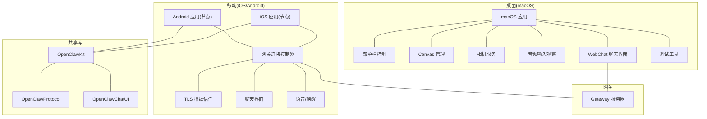
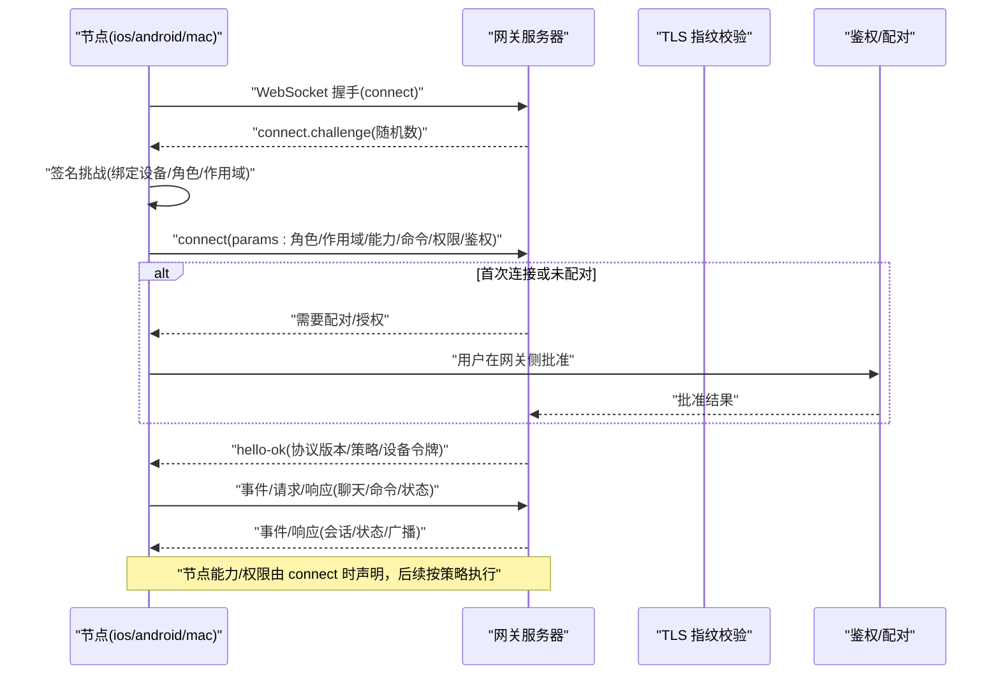
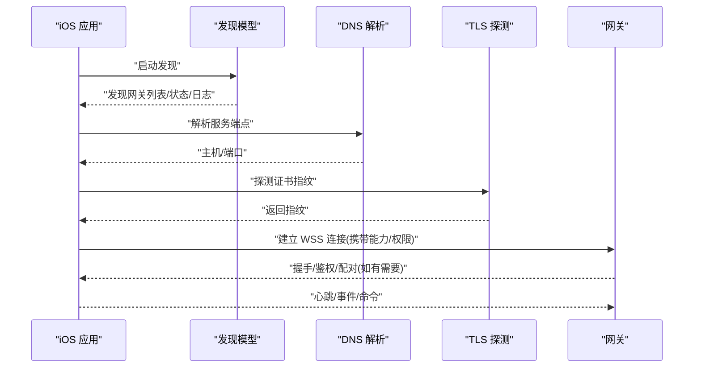
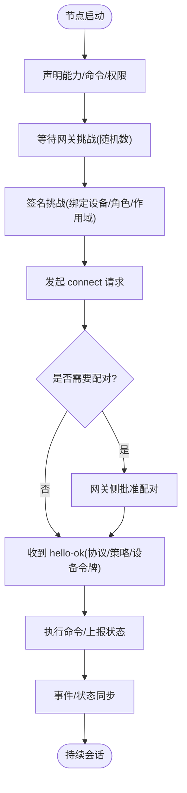
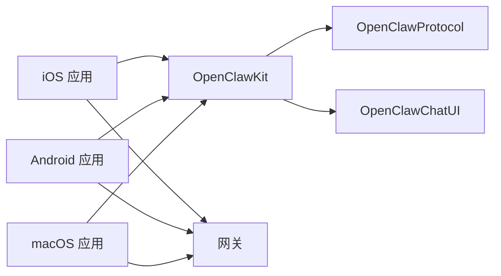

# 客户端应用

<cite>
**本文引用的文件**
- [apps/macos/README.md](file://apps/macos/README.md)
- [apps/ios/README.md](file://apps/ios/README.md)
- [apps/android/README.md](file://apps/android/README.md)
- [Swabble/README.md](file://Swabble/README.md)
- [Swabble/docs/spec.md](file://Swabble/docs/spec.md)
- [apps/shared/OpenClawKit/Package.swift](file://apps/shared/OpenClawKit/Package.swift)
- [docs/gateway/protocol.md](file://docs/gateway/protocol.md)
- [docs/nodes/index.md](file://docs/nodes/index.md)
- [docs/web/webchat.md](file://docs/web/webchat.md)
- [docs/help/debugging.md](file://docs/help/debugging.md)
- [apps/ios/Sources/Gateway/GatewayConnectionController.swift](file://apps/ios/Sources/Gateway/GatewayConnectionController.swift)
</cite>

## 目录
1. [简介](#简介)
2. [项目结构](#项目结构)
3. [核心组件](#核心组件)
4. [架构总览](#架构总览)
5. [详细组件分析](#详细组件分析)
6. [依赖关系分析](#依赖关系分析)
7. [性能考虑](#性能考虑)
8. [故障排除指南](#故障排除指南)
9. [结论](#结论)
10. [附录](#附录)

## 简介
本文件面向 OpenClaw 客户端应用，覆盖以下目标：
- 桌面应用（macOS）：菜单栏控制、语音唤醒（基于 Swabble）、WebChat 聊天界面、调试工具链。
- 移动应用（iOS/Android）：节点配对、设备控制、本地动作执行、后台行为限制与恢复策略。
- 跨平台共享代码库（OpenClawKit）：平台抽象层与通用功能模块（协议、聊天 UI、资源等）。
- 节点系统工作原理：设备配对、能力通告、权限管理与命令调用。
- 平台开发指南：构建配置、签名要求、发布流程。
- 客户端与网关服务器通信协议：WebSocket 连接、握手、消息格式、状态同步与鉴权。
- 故障排除与性能优化建议。

## 项目结构
OpenClaw 采用多工程组织方式：
- apps/macos：macOS 桌面应用，包含菜单栏控制、Canvas 管理、相机、音频输入观察、WebChat 集成等。
- apps/ios：iOS 应用，作为“节点”连接到网关，支持发现/手动连接、TLS 指纹信任、聊天与语音等功能。
- apps/android：Android 应用，作为“节点”连接到网关，支持配对、权限请求、Canvas/A2UI、屏幕录制等。
- apps/shared/OpenClawKit：Swift 包，提供 OpenClawProtocol、OpenClawKit、OpenClawChatUI 等产品，供 macOS/iOS 共享。
- Swabble：独立的 macOS 语音唤醒守护进程与 Swift 库，提供本地唤醒词检测与钩子执行。
- 文档目录 docs：包含网关协议、节点系统、WebChat、调试等主题文档。

**图表来源**
- [apps/macos/README.md:1-65](file://apps/macos/README.md#L1-L65)
- [apps/ios/README.md:1-178](file://apps/ios/README.md#L1-L178)
- [apps/android/README.md:1-229](file://apps/android/README.md#L1-L229)
- [apps/shared/OpenClawKit/Package.swift:1-62](file://apps/shared/OpenClawKit/Package.swift#L1-L62)
- [docs/gateway/protocol.md:10-268](file://docs/gateway/protocol.md#L10-L268)

**章节来源**
- [apps/macos/README.md:1-65](file://apps/macos/README.md#L1-L65)
- [apps/ios/README.md:1-178](file://apps/ios/README.md#L1-L178)
- [apps/android/README.md:1-229](file://apps/android/README.md#L1-L229)
- [apps/shared/OpenClawKit/Package.swift:1-62](file://apps/shared/OpenClawKit/Package.swift#L1-L62)
- [docs/gateway/protocol.md:10-268](file://docs/gateway/protocol.md#L10-L268)

## 核心组件
- 网关 WebSocket 协议：统一的控制平面与节点传输通道，定义握手、帧格式、角色/作用域、能力/命令/权限声明、鉴权与 TLS 指纹信任等。
- 节点系统：设备配对、能力通告、权限管理、命令调用与状态同步；支持远程节点主机与执行审批。
- OpenClawKit：跨平台共享库，提供协议、聊天 UI、资源处理与并发严格设置。
- Swabble：macOS 语音唤醒守护进程与库，提供本地唤醒词检测、钩子执行与配置。
- WebChat：通过网关 WebSocket 提供聊天 UI，支持历史、注入与远程使用。
- 调试工具：原始流日志、Watch 模式、开发者配置隔离与重置流程。

**章节来源**
- [docs/gateway/protocol.md:10-268](file://docs/gateway/protocol.md#L10-L268)
- [docs/nodes/index.md:10-385](file://docs/nodes/index.md#L10-L385)
- [apps/shared/OpenClawKit/Package.swift:1-62](file://apps/shared/OpenClawKit/Package.swift#L1-L62)
- [Swabble/README.md:1-112](file://Swabble/README.md#L1-L112)
- [docs/web/webchat.md:8-62](file://docs/web/webchat.md#L8-L62)
- [docs/help/debugging.md:10-163](file://docs/help/debugging.md#L10-L163)

## 架构总览
OpenClaw 客户端以“节点”或“操作者”角色接入网关 WebSocket，遵循统一协议进行握手、鉴权、能力通告与消息编解码。iOS/Android 作为节点，暴露本地能力（如相机、屏幕、位置、通知、系统运行等），macOS 既可作为操作者 UI，也可在菜单栏模式下作为节点上报本地 Canvas/相机等能力。

**图表来源**
- [docs/gateway/protocol.md:22-125](file://docs/gateway/protocol.md#L22-L125)
- [docs/gateway/protocol.md:200-230](file://docs/gateway/protocol.md#L200-L230)
- [docs/nodes/index.md:24-44](file://docs/nodes/index.md#L24-L44)

**章节来源**
- [docs/gateway/protocol.md:22-125](file://docs/gateway/protocol.md#L22-L125)
- [docs/gateway/protocol.md:200-230](file://docs/gateway/protocol.md#L200-L230)
- [docs/nodes/index.md:24-44](file://docs/nodes/index.md#L24-L44)

## 详细组件分析

### macOS 桌面应用
- 功能特性
  - 菜单栏控制：提供快速入口与状态指示，支持重启应用脚本与打包签名流程。
  - 语音唤醒：通过 Swabble 实现本地唤醒词检测与钩子执行，支持配置、日志与健康检查。
  - WebChat：直接连接网关 WebSocket，提供聊天历史、发送与注入能力，支持远程隧道使用。
  - 调试工具：提供打包签名、Sparkle 团队 ID 审计、库验证绕过等开发辅助选项。
- 关键实现要点
  - 打包与签名：自动选择证书身份，支持跳过团队 ID 审核与库验证绕过（仅限开发）。
  - Canvas 管理：包含 Canvas 窗口、方案处理器、文件监听与 A2UI 行动消息处理等模块。
  - 音频/相机：提供音频输入设备观察与相机捕获服务，用于本地媒体能力。
- 开发与发布
  - 快速运行：提供一键重启脚本；打包生成签名后的 .app 并进行团队 ID 审核。
  - 环境变量：支持签名身份、Ad-hoc 签名、时间戳关闭、库验证绕过、跳过团队 ID 审核等。

**章节来源**
- [apps/macos/README.md:1-65](file://apps/macos/README.md#L1-L65)
- [Swabble/README.md:1-112](file://Swabble/README.md#L1-L112)
- [Swabble/docs/spec.md:1-34](file://Swabble/docs/spec.md#L1-L34)
- [docs/web/webchat.md:8-62](file://docs/web/webchat.md#L8-L62)
- [docs/help/debugging.md:10-163](file://docs/help/debugging.md#L10-L163)

### iOS 移动应用
- 架构设计
  - 节点角色：以“节点”连接网关，声明能力（Canvas、Camera、Screen、Location、VoiceWake 等）与命令清单及权限映射。
  - 连接与信任：支持 Bonjour 发现与手动连接，强制 TLS（除非本地回环），首次连接需校验并存储证书指纹。
  - 前后台行为：前台优先，后台命令受限（如 canvas/screen/talk），位置自动化需“始终”权限。
  - 分发与签名：本地部署、TestFlight 内测，支持独特的本地 Bundle ID 与 Canonical Bundle ID 的 Beta 流程。
- 关键实现要点
  - 连接控制器：负责发现、解析服务端点、TLS 指纹探测、信任提示与自动重连协调。
  - 能力与权限：根据用户设置动态组合能力列表与权限映射，并在连接时一并声明。
  - 调试与排障：提供发现调试日志、网关状态查看、APNs 注册失败排查与前台/后台行为验证流程。

**图表来源**
- [apps/ios/Sources/Gateway/GatewayConnectionController.swift:95-156](file://apps/ios/Sources/Gateway/GatewayConnectionController.swift#L95-L156)
- [apps/ios/Sources/Gateway/GatewayConnectionController.swift:162-207](file://apps/ios/Sources/Gateway/GatewayConnectionController.swift#L162-L207)
- [apps/ios/Sources/Gateway/GatewayConnectionController.swift:446-470](file://apps/ios/Sources/Gateway/GatewayConnectionController.swift#L446-L470)

**章节来源**
- [apps/ios/README.md:1-178](file://apps/ios/README.md#L1-L178)
- [apps/ios/Sources/Gateway/GatewayConnectionController.swift:95-156](file://apps/ios/Sources/Gateway/GatewayConnectionController.swift#L95-L156)
- [apps/ios/Sources/Gateway/GatewayConnectionController.swift:162-207](file://apps/ios/Sources/Gateway/GatewayConnectionController.swift#L162-L207)
- [apps/ios/Sources/Gateway/GatewayConnectionController.swift:446-470](file://apps/ios/Sources/Gateway/GatewayConnectionController.swift#L446-L470)

### Android 移动应用
- 架构设计
  - 节点角色：与 iOS 类似，作为“节点”连接网关，声明能力与命令清单，受权限映射约束。
  - 连接与配对：支持“设置码”与“手动”两种连接模式；需要在网关侧批准设备配对。
  - 权限体系：针对相机、录音、位置、通知等能力进行运行时权限申请。
  - 性能与基准：提供宏基准测试、低噪声启动测量与热点提取脚本。
- 关键实现要点
  - 连接流程：USB 本地联调可通过 adb reverse 将本机端口转发至设备，便于无局域网环境测试。
  - 集成能力测试：预置前提条件后运行集成测试套件，覆盖非交互命令与 A2UI 可达性刷新逻辑。
  - 常见失败修复：配对失败需在网关侧批准最新请求；A2UI 主机不可达需确保 Canvas Host 正常且保持前台。

**章节来源**
- [apps/android/README.md:1-229](file://apps/android/README.md#L1-L229)
- [docs/nodes/index.md:24-44](file://docs/nodes/index.md#L24-L44)

### 跨平台共享库 OpenClawKit
- 组件构成
  - OpenClawProtocol：协议定义与类型。
  - OpenClawKit：核心功能模块，依赖 ElevenLabsKit，启用严格并发设置。
  - OpenClawChatUI：聊天 UI，依赖 Textual（macOS/iOS），启用严格并发设置。
- 平台与依赖
  - 支持 iOS 18+、macOS 15+。
  - 依赖 ElevenLabsKit 与 Textual，资源处理通过 Swift 包资源机制。
- 使用场景
  - iOS/Android 应用通过 OpenClawKit 获取统一的协议与 UI 能力，减少重复实现。

**章节来源**
- [apps/shared/OpenClawKit/Package.swift:1-62](file://apps/shared/OpenClawKit/Package.swift#L1-L62)

### 节点系统工作原理
- 设备配对
  - 节点在握手时携带设备身份信息，网关创建设备配对请求，需在网关侧批准后方可建立持久连接。
- 能力通告与权限
  - 节点在 connect 时声明 caps（能力类别）、commands（命令白名单）与 permissions（细粒度开关）。
  - 网关基于服务器端允许列表与策略进行二次校验。
- 命令执行与状态同步
  - 节点通过 node.invoke 或网关提供的工具接口执行命令，事件与状态通过 WebSocket 广播到 UI。
- 远程节点主机
  - 支持将执行路由到远端节点主机，执行审批在节点主机侧进行，安全策略可配置。

**图表来源**
- [docs/gateway/protocol.md:22-125](file://docs/gateway/protocol.md#L22-L125)
- [docs/nodes/index.md:24-44](file://docs/nodes/index.md#L24-L44)

**章节来源**
- [docs/gateway/protocol.md:22-125](file://docs/gateway/protocol.md#L22-L125)
- [docs/nodes/index.md:24-44](file://docs/nodes/index.md#L24-L44)

### 客户端与网关通信协议
- 传输与帧格式
  - WebSocket 文本帧，JSON 负载；首个帧必须为 connect 请求。
- 握手与鉴权
  - 网关先下发 connect.challenge，节点签名挑战并携带设备身份与角色/作用域/能力/命令/权限/鉴权信息。
  - 设备令牌由网关签发，可用于后续连接的自动认证。
- 角色与作用域
  - operator：控制平面客户端；node：能力宿主。
  - operator 作用域示例：read、write、admin、approvals、pairing。
  - node 能力/命令/权限在 connect 时声明，网关侧允许列表生效。
- 版本与兼容
  - 客户端发送 minProtocol/maxProtocol，不匹配则拒绝。
  - 协议模型由 TypeBox 定义生成，支持多语言生成与一致性检查。
- TLS 与信任
  - 支持 WSS；可选证书指纹固定，避免中间人风险。

**章节来源**
- [docs/gateway/protocol.md:10-268](file://docs/gateway/protocol.md#L10-L268)

### WebChat 与调试工具
- WebChat
  - 通过网关 WebSocket 提供聊天 UI，支持历史、注入与远程隧道使用。
  - 历史受稳定性约束，长文本可能被截断或替换。
- 调试工具
  - Watch 模式：文件监视重启网关，便于迭代开发。
  - 原始流日志：记录助手输出原始流，便于分析推理泄漏。
  - 开发配置隔离：提供 dev 配置文件与重置流程，避免污染生产状态。

**章节来源**
- [docs/web/webchat.md:8-62](file://docs/web/webchat.md#L8-L62)
- [docs/help/debugging.md:32-163](file://docs/help/debugging.md#L32-L163)

## 依赖关系分析
- 平台与模块耦合
  - iOS/Android 通过 OpenClawKit 共享协议与 UI，降低重复实现与维护成本。
  - macOS 作为操作者 UI 与节点模式并存，依赖 Canvas/相机/音频等本地服务。
- 外部依赖
  - iOS：Foundation、UIKit、Speech、AVFoundation、CryptoKit、Photos、ReplayKit、EventKit、CoreLocation、CoreMotion、Network 等。
  - Android：Kotlin/Jetpack Compose、权限框架、ADB 转发、Benchmark 工具链。
  - 共享：ElevenLabsKit、Textual。
- 协议与生成
  - 网关协议模型由 TypeBox 定义，支持生成与一致性检查，保障多端契约一致。

**图表来源**
- [apps/shared/OpenClawKit/Package.swift:1-62](file://apps/shared/OpenClawKit/Package.swift#L1-L62)
- [apps/ios/Sources/Gateway/GatewayConnectionController.swift:1-18](file://apps/ios/Sources/Gateway/GatewayConnectionController.swift#L1-L18)

**章节来源**
- [apps/shared/OpenClawKit/Package.swift:1-62](file://apps/shared/OpenClawKit/Package.swift#L1-L62)
- [apps/ios/Sources/Gateway/GatewayConnectionController.swift:1-18](file://apps/ios/Sources/Gateway/GatewayConnectionController.swift#L1-L18)

## 性能考虑
- 启动与热区
  - Android 提供冷启动宏基准与热点提取脚本，便于定位性能瓶颈。
  - iOS/Android 在前台优先时具备更稳定的命令执行与媒体访问能力。
- 资源占用
  - 位置自动化应避免持续高负载，建议仅在显著移动或地理围栏触发时使用。
  - 屏幕录制与相机抓拍存在时长上限与负载上限，避免产生超大载荷。
- 网络与连接
  - 优先使用 WSS 并固定证书指纹，减少握手与中间人风险。
  - 自动重连需谨慎，避免在瞬断时频繁重建连接导致资源抖动。

[本节为通用指导，无需特定文件来源]

## 故障排除指南
- iOS
  - APNs 注册失败：确认签名/配置档支持推送，检查 entitlement 的 aps-environment，查看 Xcode 日志中的相关错误。
  - 前后台行为异常：前台优先，后台命令受限；验证前台运行与自动重连逻辑。
  - 发现/连接不稳定：开启发现调试日志，检查网关状态与 TLS 指纹存储。
- Android
  - 配对失败：在网关侧批准最新设备配对请求；确保网关 Canvas Host 可达且应用保持前台。
  - A2UI 不可达：确保 Canvas Host 正常，应用在 Screen 标签页保持活跃，必要时触发一次 A2UI 能力刷新。
  - USB 联调：使用 adb reverse 将本机端口转发到设备，避免局域网依赖。
- macOS
  - 打包签名问题：检查证书身份与团队 ID 审核；开发阶段可启用库验证绕过，但发布前需关闭。
  - WebChat 只读：当网关不可达时 UI 退化为只读，检查连接状态与鉴权配置。
- 通用
  - 原始流日志：开启 raw-stream 记录，定位推理泄漏或输出异常。
  - Watch 模式：使用文件监视重启网关，便于快速迭代与回归。

**章节来源**
- [apps/ios/README.md:89-178](file://apps/ios/README.md#L89-L178)
- [apps/android/README.md:112-229](file://apps/android/README.md#L112-L229)
- [apps/macos/README.md:25-65](file://apps/macos/README.md#L25-L65)
- [docs/help/debugging.md:107-163](file://docs/help/debugging.md#L107-L163)

## 结论
OpenClaw 客户端应用通过统一的网关 WebSocket 协议实现跨平台节点与操作者协同，结合 OpenClawKit 提升共享能力与一致性。iOS/Android 作为节点提供丰富的本地能力，macOS 既可作为操作者 UI 也可作为节点参与。Swabble 为 macOS 提供本地语音唤醒能力，WebChat 与调试工具完善了开发与运维体验。遵循本文档的开发指南、通信协议与故障排除建议，可有效提升稳定性与用户体验。

[本节为总结，无需特定文件来源]

## 附录
- 平台开发指南摘要
  - macOS：快速运行脚本、打包签名、团队 ID 审核、库验证绕过（开发专用）。
  - iOS：Xcode 手动部署、Fastlane Beta 发布、APNs 期望与调试清单。
  - Android：Gradle 构建、Lint/Format、宏基准与性能脚本、USB 联调与集成测试。

**章节来源**
- [apps/macos/README.md:1-65](file://apps/macos/README.md#L1-L65)
- [apps/ios/README.md:18-88](file://apps/ios/README.md#L18-L88)
- [apps/android/README.md:26-229](file://apps/android/README.md#L26-L229)