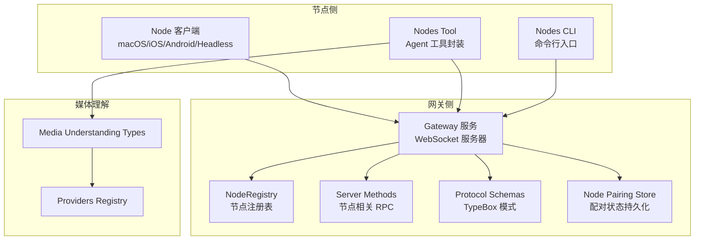
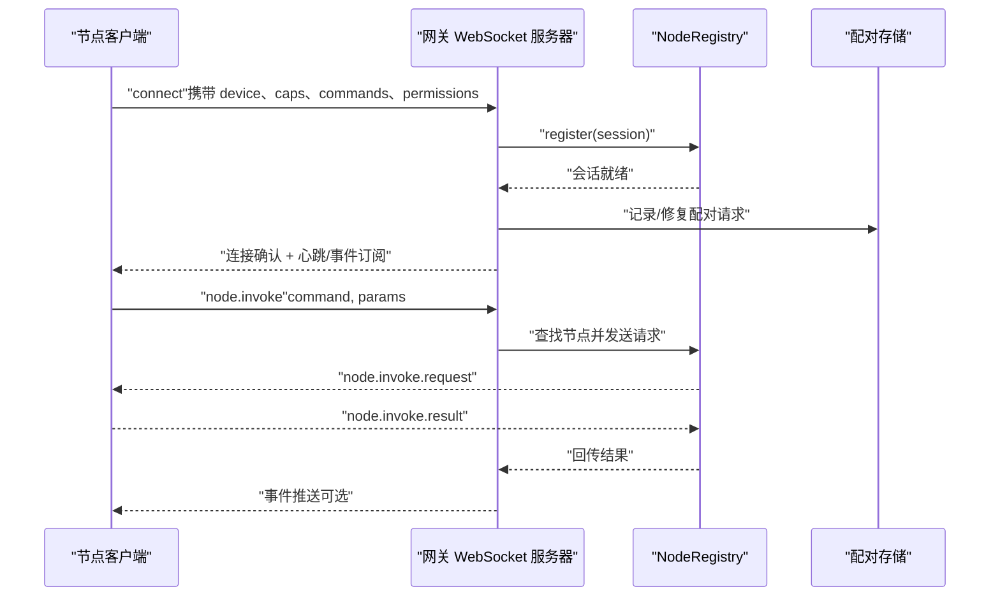
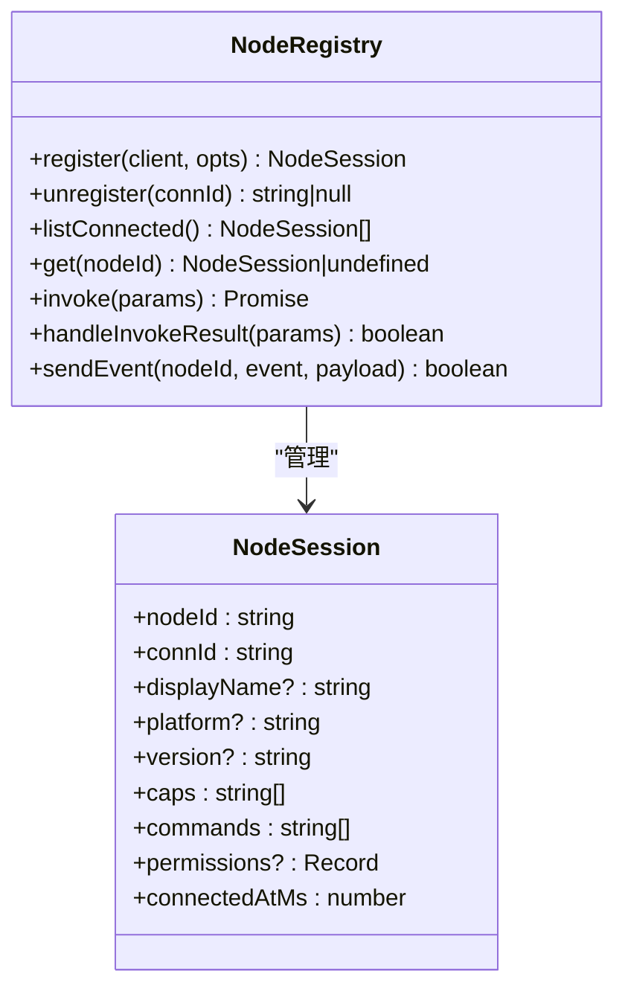
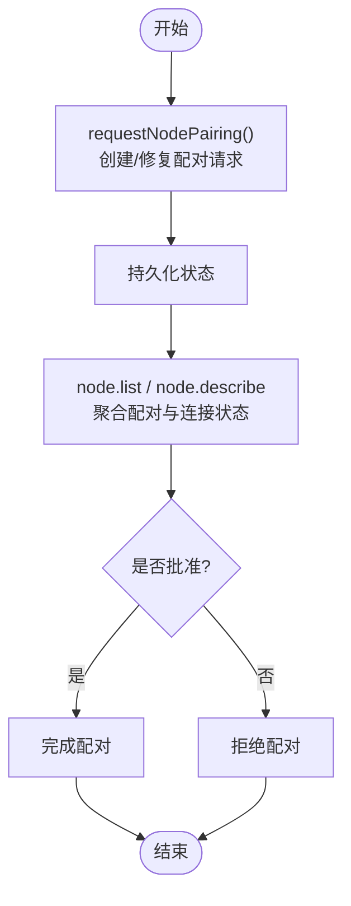
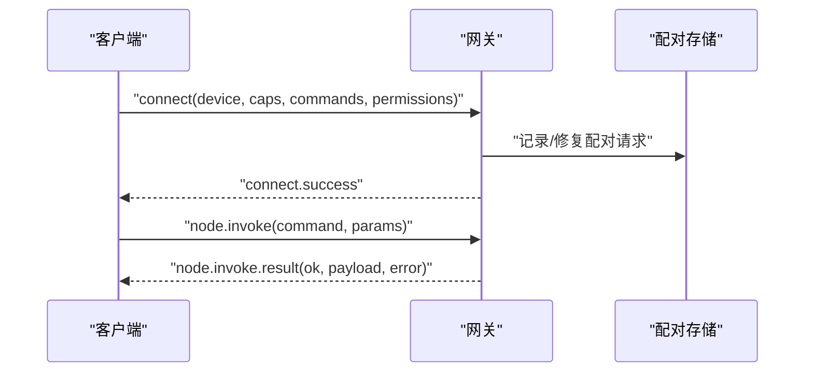
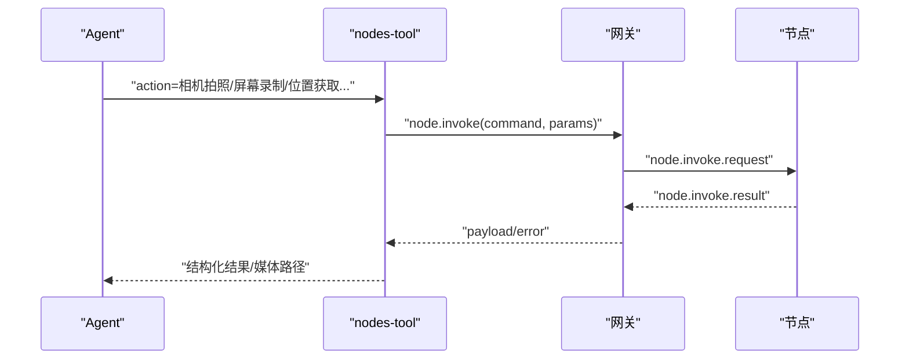
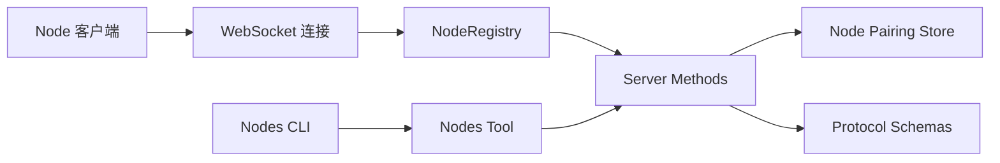

# 节点系统

<cite>
**本文引用的文件**
- [src/gateway/node-registry.ts](file://src/gateway/node-registry.ts)
- [src/gateway/server-methods/nodes.ts](file://src/gateway/server-methods/nodes.ts)
- [src/gateway/protocol/schema/nodes.ts](file://src/gateway/protocol/schema/nodes.ts)
- [src/infra/node-pairing.ts](file://src/infra/node-pairing.ts)
- [src/agents/tools/nodes-tool.ts](file://src/agents/tools/nodes-tool.ts)
- [src/cli/nodes-cli.ts](file://src/cli/nodes-cli.ts)
- [docs/nodes/index.md](file://docs/nodes/index.md)
- [docs/nodes/camera.md](file://docs/nodes/camera.md)
- [docs/gateway/protocol.md](file://docs/gateway/protocol.md)
- [apps/macos/Sources/OpenClaw/PermissionsSettings.swift](file://apps/macos/Sources/OpenClaw/PermissionsSettings.swift)
- [src/cli/nodes-camera.ts](file://src/cli/nodes-camera.ts)
- [src/cli/nodes-screen.ts](file://src/cli/nodes-screen.ts)
- [src/media-understanding/types.ts](file://src/media-understanding/types.ts)
- [src/media-understanding/providers/index.ts](file://src/media-understanding/providers/index.ts)
- [src/auto-reply/media-note.ts](file://src/auto-reply/media-note.ts)
- [src/cli/nodes-cli/format.ts](file://src/cli/nodes-cli/format.ts)
- [apps/android/app/src/test/java/ai/openclaw/app/node/CameraHandlerTest.kt](file://apps/android/app/src/test/java/ai/openclaw/app/node/CameraHandlerTest.kt)
- [docs/zh-CN/nodes/troubleshooting.md](file://docs/zh-CN/nodes/troubleshooting.md)
</cite>

## 目录
1. [简介](#简介)
2. [项目结构](#项目结构)
3. [核心组件](#核心组件)
4. [架构总览](#架构总览)
5. [详细组件分析](#详细组件分析)
6. [依赖关系分析](#依赖关系分析)
7. [性能考量](#性能考量)
8. [故障排除指南](#故障排除指南)
9. [结论](#结论)
10. [附录](#附录)

## 简介
本文件系统化阐述 OpenClaw 节点系统的设计与实现，覆盖节点发现、配对流程、能力通告、与网关的 WebSocket 通信协议、消息格式与状态同步、权限管理、生命周期管理、开发与集成指南以及故障排除与性能监控方法。目标读者既包括需要快速上手的使用者，也包括希望深入理解实现细节的开发者。

## 项目结构
节点系统围绕“网关（Gateway）+ 节点（Node）”双端协作展开：
- 网关侧负责节点注册、命令分发、状态同步、配对审批与权限校验。
- 节点侧通过 WebSocket 连接网关，声明能力与命令集，执行并返回结果。
- 工具链与文档提供 CLI、自动化脚本、示例与最佳实践。

图表来源
- [src/gateway/node-registry.ts:38-209](file://src/gateway/node-registry.ts#L38-L209)
- [src/gateway/server-methods/nodes.ts:547-616](file://src/gateway/server-methods/nodes.ts#L547-L616)
- [src/gateway/protocol/schema/nodes.ts:12-166](file://src/gateway/protocol/schema/nodes.ts#L12-L166)
- [src/infra/node-pairing.ts:96-144](file://src/infra/node-pairing.ts#L96-L144)
- [src/agents/tools/nodes-tool.ts:155-800](file://src/agents/tools/nodes-tool.ts#L155-L800)
- [src/cli/nodes-cli.ts:1-2](file://src/cli/nodes-cli.ts#L1-L2)
- [src/media-understanding/types.ts:1-49](file://src/media-understanding/types.ts#L1-L49)
- [src/media-understanding/providers/index.ts:34-63](file://src/media-understanding/providers/index.ts#L34-L63)

章节来源
- [src/gateway/node-registry.ts:38-209](file://src/gateway/node-registry.ts#L38-L209)
- [src/gateway/server-methods/nodes.ts:547-616](file://src/gateway/server-methods/nodes.ts#L547-L616)
- [src/gateway/protocol/schema/nodes.ts:12-166](file://src/gateway/protocol/schema/nodes.ts#L12-L166)
- [src/infra/node-pairing.ts:96-144](file://src/infra/node-pairing.ts#L96-L144)
- [src/agents/tools/nodes-tool.ts:155-800](file://src/agents/tools/nodes-tool.ts#L155-L800)
- [src/cli/nodes-cli.ts:1-2](file://src/cli/nodes-cli.ts#L1-L2)
- [docs/nodes/index.md:1-385](file://docs/nodes/index.md#L1-L385)

## 核心组件
- 节点注册表（NodeRegistry）：维护已连接节点的会话信息、命令与能力集合、待处理调用队列与超时控制，并负责向节点发送事件与接收结果回调。
- 节点服务方法（Server Methods）：提供节点列表、描述、配对、命令调用等 RPC 接口，聚合配对状态与连接状态，输出统一的节点视图。
- 协议模式（Protocol Schemas）：以 TypeBox 定义节点相关参数与事件的输入输出结构，确保消息一致性与可验证性。
- 节点配对存储（Node Pairing Store）：持久化节点配对请求与状态，支持修复配对与静默配对等场景。
- 节点工具（Nodes Tool）：面向 Agent 的工具封装，屏蔽底层 RPC 细节，提供相机、屏幕录制、位置、通知、系统运行等高级操作。
- 文档与 CLI：提供节点功能清单、配对与使用说明，以及命令行工具入口。

章节来源
- [src/gateway/node-registry.ts:38-209](file://src/gateway/node-registry.ts#L38-L209)
- [src/gateway/server-methods/nodes.ts:547-644](file://src/gateway/server-methods/nodes.ts#L547-L644)
- [src/gateway/protocol/schema/nodes.ts:12-166](file://src/gateway/protocol/schema/nodes.ts#L12-L166)
- [src/infra/node-pairing.ts:96-144](file://src/infra/node-pairing.ts#L96-L144)
- [src/agents/tools/nodes-tool.ts:155-800](file://src/agents/tools/nodes-tool.ts#L155-L800)
- [docs/nodes/index.md:1-385](file://docs/nodes/index.md#L1-L385)

## 架构总览
节点系统采用“网关为中心”的拓扑：多台节点通过 WebSocket 连接同一网关，网关统一调度与鉴权。节点在握手阶段声明能力（caps）、命令（commands）与权限（permissions），网关据此进行配对与授权。

图表来源
- [src/gateway/node-registry.ts:43-79](file://src/gateway/node-registry.ts#L43-L79)
- [src/gateway/server-methods/nodes.ts:547-616](file://src/gateway/server-methods/nodes.ts#L547-L616)
- [src/infra/node-pairing.ts:104-144](file://src/infra/node-pairing.ts#L104-L144)
- [docs/gateway/protocol.md:199-221](file://docs/gateway/protocol.md#L199-L221)

章节来源
- [src/gateway/node-registry.ts:43-79](file://src/gateway/node-registry.ts#L43-L79)
- [src/gateway/server-methods/nodes.ts:547-616](file://src/gateway/server-methods/nodes.ts#L547-L616)
- [src/infra/node-pairing.ts:104-144](file://src/infra/node-pairing.ts#L104-L144)
- [docs/gateway/protocol.md:199-221](file://docs/gateway/protocol.md#L199-L221)

## 详细组件分析

### 节点注册与生命周期
- 注册：在握手后，网关根据连接参数构建会话对象，填充节点标识、显示名、平台、版本、远程 IP、能力与命令集，并登记到注册表。
- 取消：断开连接时清理会话与未完成的调用，触发超时回调。
- 列表：提供已连接节点的聚合视图，排序与去重。
- 调用：构造请求 ID，发送 node.invoke.request，等待 node.invoke.result，按超时与错误码处理。

图表来源
- [src/gateway/node-registry.ts:38-209](file://src/gateway/node-registry.ts#L38-L209)

章节来源
- [src/gateway/node-registry.ts:38-209](file://src/gateway/node-registry.ts#L38-L209)

### 节点发现、配对与能力通告
- 节点发现：通过 node.list 返回已配对且在线的节点列表，合并配对状态与连接状态，排序展示。
- 能力与命令：节点在握手时声明 caps 与 commands，网关在 node.describe 中汇总当前已连接节点的能力与命令集合。
- 配对流程：requestNodePairing 创建/修复配对请求，持久化状态；网关侧提供 node.pair.list/approve/reject 供审批与管理。

图表来源
- [src/infra/node-pairing.ts:104-144](file://src/infra/node-pairing.ts#L104-L144)
- [src/gateway/server-methods/nodes.ts:547-644](file://src/gateway/server-methods/nodes.ts#L547-L644)

章节来源
- [src/infra/node-pairing.ts:96-144](file://src/infra/node-pairing.ts#L96-L144)
- [src/gateway/server-methods/nodes.ts:547-644](file://src/gateway/server-methods/nodes.ts#L547-L644)

### 与网关的 WebSocket 通信协议与消息格式
- 身份与配对：节点需在 connect 时携带设备身份；非本地连接需签名挑战；网关颁发令牌并记录配对。
- TLS 与固定：支持 WS TLS，客户端可固定证书指纹。
- 范围：协议暴露完整网关 API（status、channels、models、chat、agent、sessions、nodes、approvals 等），具体接口由 TypeBox 模式定义。
- 节点相关消息：NodePairRequestParamsSchema、NodeInvokeParamsSchema、NodeInvokeResultParamsSchema、NodeEventParamsSchema 等。

图表来源
- [docs/gateway/protocol.md:199-221](file://docs/gateway/protocol.md#L199-L221)
- [docs/gateway/protocol.md:257-268](file://docs/gateway/protocol.md#L257-L268)
- [src/gateway/protocol/schema/nodes.ts:12-166](file://src/gateway/protocol/schema/nodes.ts#L12-L166)

章节来源
- [docs/gateway/protocol.md:199-221](file://docs/gateway/protocol.md#L199-L221)
- [docs/gateway/protocol.md:257-268](file://docs/gateway/protocol.md#L257-L268)
- [src/gateway/protocol/schema/nodes.ts:12-166](file://src/gateway/protocol/schema/nodes.ts#L12-L166)

### 权限管理与安全策略
- 节点权限映射：节点可在连接时提供 permissions 映射（如 screenRecording、accessibility），网关在 node.describe 中聚合展示。
- macOS 权限 UI：macOS 端提供权限行视图，展示能力状态与待定状态，支持切换。
- CLI 权限格式化：CLI 提供权限键值对格式化输出，便于调试与展示。
- 安全策略：TLS 可选固定证书指纹；节点命令调用前需配对并通过权限检查；系统运行命令受执行审批策略约束。

章节来源
- [apps/macos/Sources/OpenClaw/PermissionsSettings.swift:154-173](file://apps/macos/Sources/OpenClaw/PermissionsSettings.swift#L154-L173)
- [src/cli/nodes-cli/format.ts:3-16](file://src/cli/nodes-cli/format.ts#L3-L16)
- [docs/gateway/protocol.md:199-221](file://docs/gateway/protocol.md#L199-L221)

### 不同类型节点的功能特性
- 摄像头节点（iOS/Android/macOS）：支持相机列表、拍照（jpg）、短时视频录制（mp4，可选音频），并受前台状态与权限限制。
- 屏幕录制节点：支持屏幕录制（mp4），可配置帧率、屏幕索引与音频开关。
- 位置节点：支持获取位置信息，可设置精度、最大年龄与超时。
- 媒体理解节点：支持图像/音频/视频的理解输出，结合媒体附件决策与提供者注册表选择模型。
- 系统运行节点：macOS 节点与无头节点支持 system.run/system.which，受执行审批策略约束。

章节来源
- [docs/nodes/camera.md:1-163](file://docs/nodes/camera.md#L1-L163)
- [docs/nodes/index.md:1-385](file://docs/nodes/index.md#L1-L385)
- [src/media-understanding/types.ts:1-49](file://src/media-understanding/types.ts#L1-L49)
- [src/media-understanding/providers/index.ts:34-63](file://src/media-understanding/providers/index.ts#L34-L63)

### 节点与网关的命令调用流程
- Agent 工具封装：nodes-tool 将底层 node.invoke 调用封装为高层动作（如 camera_snap、screen_record、location_get、run、invoke 等），并处理配对提示与权限错误。
- CLI 入口：nodes-cli 暴露命令行入口，配合工具封装实现端到端的节点操作。

图表来源
- [src/agents/tools/nodes-tool.ts:155-800](file://src/agents/tools/nodes-tool.ts#L155-L800)
- [src/cli/nodes-cli.ts:1-2](file://src/cli/nodes-cli.ts#L1-L2)

章节来源
- [src/agents/tools/nodes-tool.ts:155-800](file://src/agents/tools/nodes-tool.ts#L155-L800)
- [src/cli/nodes-cli.ts:1-2](file://src/cli/nodes-cli.ts#L1-L2)

### 节点生命周期管理
- 启动：节点通过 openclaw node run 或安装为服务启动，连接网关并完成配对。
- 运行：节点保持长连接，上报能力与命令，响应网关调用。
- 暂停/停止：节点断开连接或被网关移除；注册表清理会话与待处理调用。
- 重启：在进程内重启场景下，心跳与任务队列状态需正确复位，避免遗留计数阻塞新任务。

章节来源
- [docs/nodes/index.md:66-106](file://docs/nodes/index.md#L66-L106)
- [src/agents/tools/nodes-tool.ts:607-746](file://src/agents/tools/nodes-tool.ts#L607-L746)

### 开发与集成指南
- 自定义节点：在握手阶段声明 caps 与 commands，实现 node.invoke 请求处理逻辑，返回标准化结果。
- 注册与集成：通过 node.list/node.describe 暴露节点信息；使用 nodes-tool 与 CLI 进行测试与集成。
- 媒体理解：基于媒体理解类型与提供者注册表扩展图像/音频/视频处理能力。

章节来源
- [src/gateway/protocol/schema/nodes.ts:12-166](file://src/gateway/protocol/schema/nodes.ts#L12-L166)
- [src/media-understanding/types.ts:1-49](file://src/media-understanding/types.ts#L1-L49)
- [src/media-understanding/providers/index.ts:34-63](file://src/media-understanding/providers/index.ts#L34-L63)

## 依赖关系分析
- 节点注册表依赖 WebSocket 客户端类型与连接上下文，提供统一的节点会话管理。
- 服务方法依赖注册表与配对存储，聚合节点状态并对外提供 RPC。
- 协议模式为消息契约提供强类型保障，降低耦合度。
- 工具与 CLI 依赖网关 RPC，抽象出用户友好的操作界面。

图表来源
- [src/gateway/node-registry.ts:38-209](file://src/gateway/node-registry.ts#L38-L209)
- [src/gateway/server-methods/nodes.ts:547-616](file://src/gateway/server-methods/nodes.ts#L547-L616)
- [src/gateway/protocol/schema/nodes.ts:12-166](file://src/gateway/protocol/schema/nodes.ts#L12-L166)
- [src/infra/node-pairing.ts:96-144](file://src/infra/node-pairing.ts#L96-L144)
- [src/agents/tools/nodes-tool.ts:155-800](file://src/agents/tools/nodes-tool.ts#L155-L800)
- [src/cli/nodes-cli.ts:1-2](file://src/cli/nodes-cli.ts#L1-L2)

章节来源
- [src/gateway/node-registry.ts:38-209](file://src/gateway/node-registry.ts#L38-L209)
- [src/gateway/server-methods/nodes.ts:547-616](file://src/gateway/server-methods/nodes.ts#L547-L616)
- [src/gateway/protocol/schema/nodes.ts:12-166](file://src/gateway/protocol/schema/nodes.ts#L12-L166)
- [src/infra/node-pairing.ts:96-144](file://src/infra/node-pairing.ts#L96-L144)
- [src/agents/tools/nodes-tool.ts:155-800](file://src/agents/tools/nodes-tool.ts#L155-L800)
- [src/cli/nodes-cli.ts:1-2](file://src/cli/nodes-cli.ts#L1-L2)

## 性能考量
- 媒体负载控制：相机照片与视频片段大小受控，避免超大 base64 负载导致消息上限问题。
- 调用超时与幂等：节点调用支持超时与幂等键，防止长时间阻塞与重复执行。
- 心跳与唤醒：心跳唤醒机制在进程重启后清理旧状态，避免过期定时器影响新生命周期的任务调度。

章节来源
- [docs/nodes/camera.md:147-151](file://docs/nodes/camera.md#L147-L151)
- [src/gateway/node-registry.ts:107-155](file://src/gateway/node-registry.ts#L107-L155)
- [src/infra/heartbeat-wake.ts:196-236](file://src/infra/heartbeat-wake.ts#L196-L236)

## 故障排除指南
- 配对相关：若出现“需要配对”提示，检查 pending 列表并批准；必要时修复配对。
- 前台限制：相机与画布相关命令在后台不可用，需确保节点处于前台。
- 权限缺失：Android 节点需授予 CAMERA/RECORD_AUDIO 权限；缺失时返回权限相关错误。
- 媒体负载过大：注意相机与屏幕录制的时长与分辨率限制，避免超出 payload 上限。
- 文档参考：中文节点故障排除文档提供系统化排查步骤。

章节来源
- [src/agents/tools/nodes-tool.ts:91-103](file://src/agents/tools/nodes-tool.ts#L91-L103)
- [docs/nodes/camera.md:60-101](file://docs/nodes/camera.md#L60-L101)
- [apps/android/app/src/test/java/ai/openclaw/app/node/CameraHandlerTest.kt:1-25](file://apps/android/app/src/test/java/ai/openclaw/app/node/CameraHandlerTest.kt#L1-L25)
- [docs/zh-CN/nodes/troubleshooting.md:1-9](file://docs/zh-CN/nodes/troubleshooting.md#L1-L9)

## 结论
OpenClaw 节点系统以强类型协议与严格的生命周期管理为基础，结合灵活的权限与配对机制，实现了跨平台节点的统一接入与高效协作。通过工具与 CLI 的封装，用户与 Agent 可以便捷地发现、控制与扩展节点能力；同时完善的媒体理解与安全策略为复杂场景提供了可靠支撑。

## 附录
- 媒体理解类型与提供者注册：用于扩展图像/音频/视频理解能力，支持多提供者合并与覆盖。
- 自动回复媒体注记：在自动回复中抑制已理解媒体的重复展示，提升消息简洁性。
- CLI 权限格式化：将权限映射格式化为可读字符串，辅助调试与运维。

章节来源
- [src/media-understanding/types.ts:1-49](file://src/media-understanding/types.ts#L1-L49)
- [src/media-understanding/providers/index.ts:34-63](file://src/media-understanding/providers/index.ts#L34-L63)
- [src/auto-reply/media-note.ts:49-85](file://src/auto-reply/media-note.ts#L49-L85)
- [src/cli/nodes-cli/format.ts:3-16](file://src/cli/nodes-cli/format.ts#L3-L16)