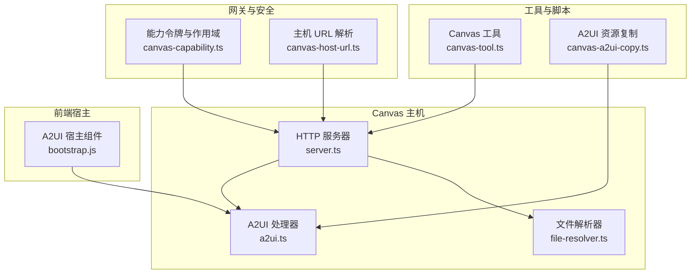
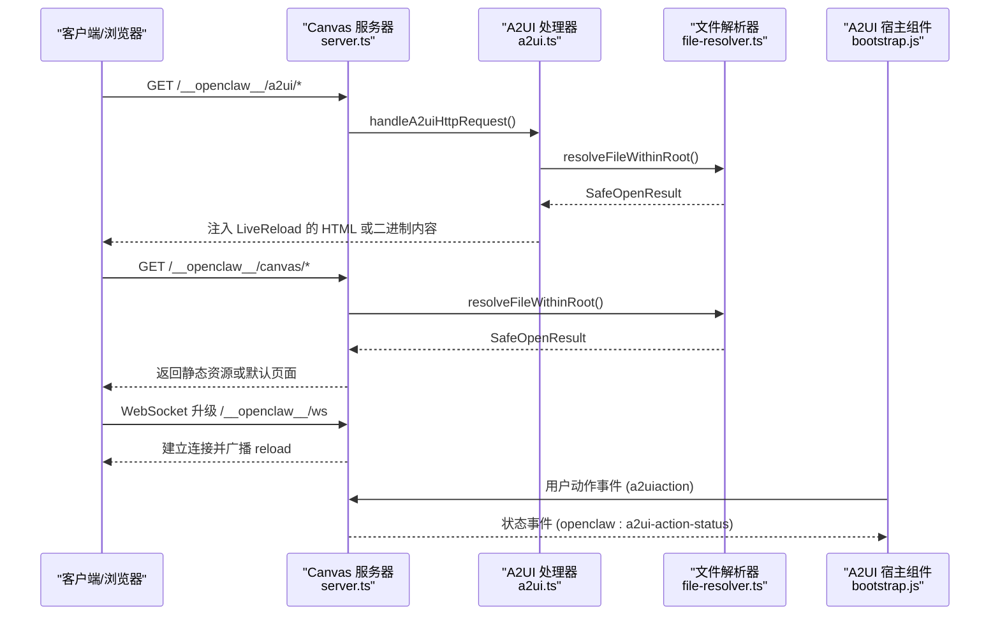
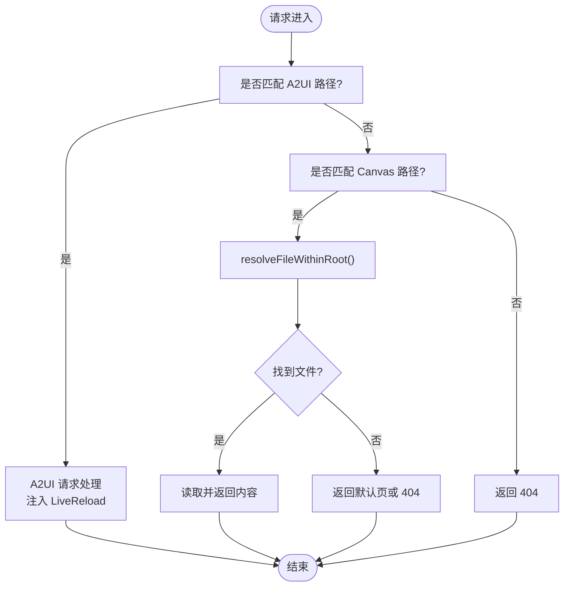
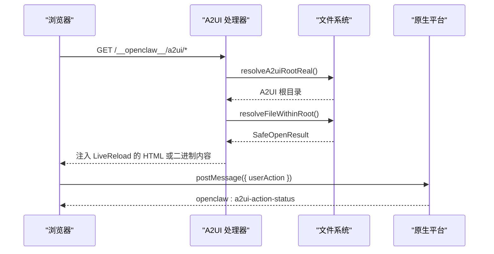
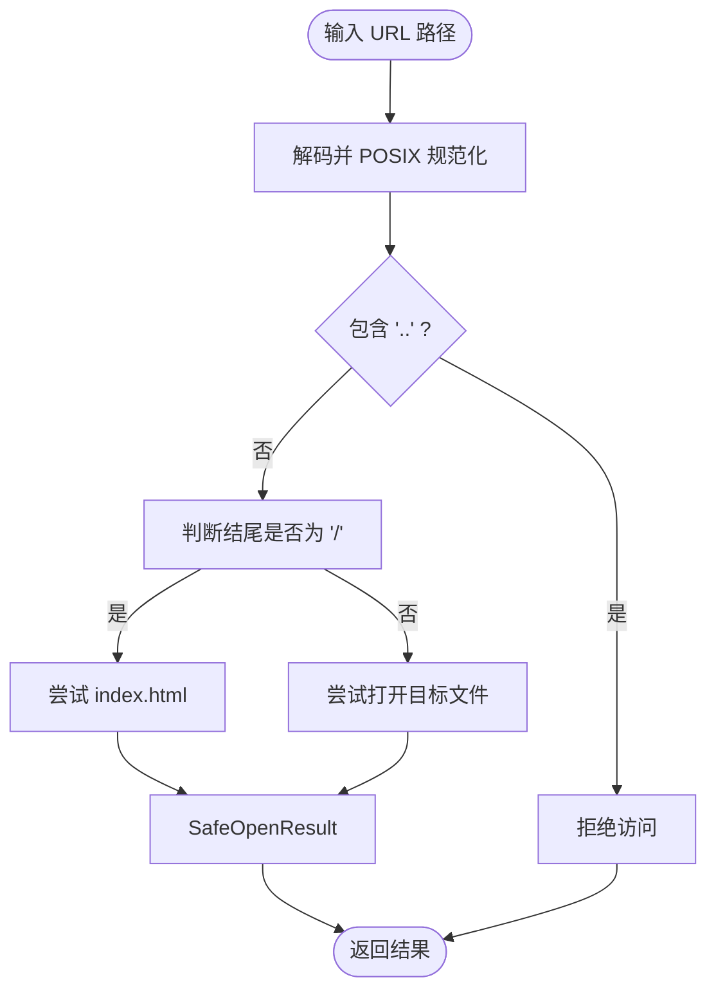
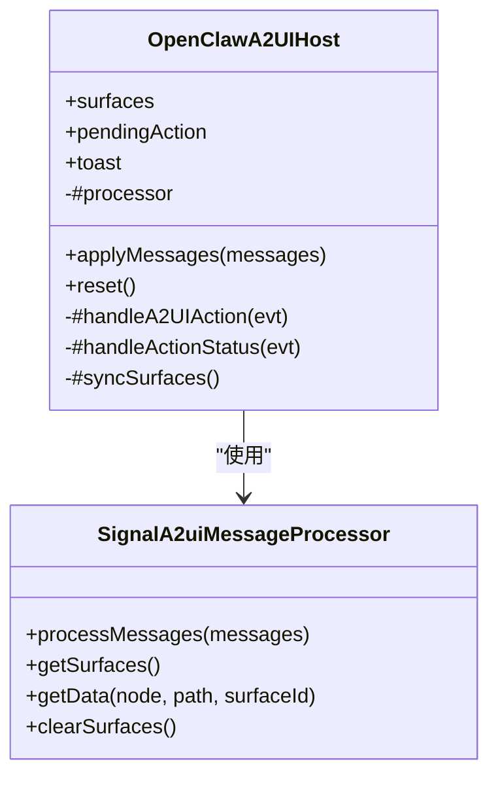
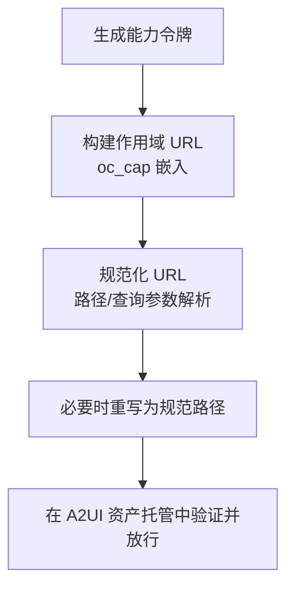
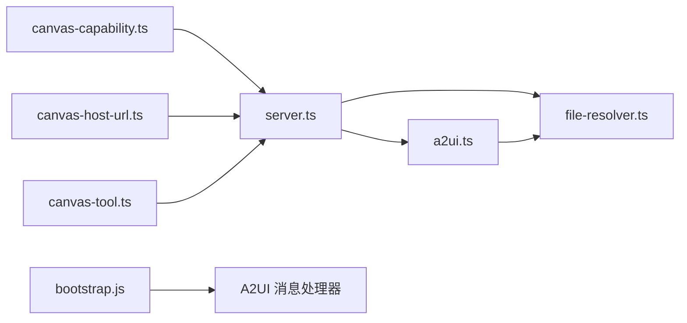

# Canvas 主机系统

<cite>
**本文档引用的文件**
- [a2ui.ts](file://src/canvas-host/a2ui.ts)
- [file-resolver.ts](file://src/canvas-host/file-resolver.ts)
- [server.ts](file://src/canvas-host/server.ts)
- [canvas-tool.ts](file://src/agents/tools/canvas-tool.ts)
- [canvas-capability.ts](file://src/gateway/canvas-capability.ts)
- [canvas-host-url.ts](file://src/infra/canvas-host-url.ts)
- [bootstrap.js](file://apps/shared/OpenClawKit/Tools/CanvasA2UI/bootstrap.js)
- [canvas.md](file://docs/platforms/mac/canvas.md)
- [canvas-a2ui-copy.ts](file://scripts/canvas-a2ui-copy.ts)
</cite>

## 目录
1. [简介](#简介)
2. [项目结构](#项目结构)
3. [核心组件](#核心组件)
4. [架构总览](#架构总览)
5. [详细组件分析](#详细组件分析)
6. [依赖关系分析](#依赖关系分析)
7. [性能考虑](#性能考虑)
8. [故障排查指南](#故障排查指南)
9. [结论](#结论)
10. [附录](#附录)

## 简介
本文件面向 OpenClaw 的 Canvas 主机系统，提供从架构到实现的全景式技术文档。重点覆盖以下方面：
- Canvas 工作区的架构设计与实现原理
- A2UI（AI-2-UI）集成机制：可视化元素渲染与用户交互处理
- 文件解析器：资源定位、安全限制与动态加载
- 实时渲染管道：数据流处理、状态同步与性能优化
- 安全模型与访问控制：能力令牌、作用域路径与跨平台桥接
- 开发指南：组件创建、样式定制与事件处理
- 性能监控与调试工具使用
- 完整 API 参考与集成示例

## 项目结构
Canvas 主机系统由 Node.js HTTP 服务器、A2UI 前端宿主、文件解析器与网关能力模块组成，并通过代理脚本完成静态资源打包与分发。

**图表来源**
- [server.ts:1-479](file://src/canvas-host/server.ts#L1-L479)
- [a2ui.ts:1-210](file://src/canvas-host/a2ui.ts#L1-L210)
- [file-resolver.ts:1-51](file://src/canvas-host/file-resolver.ts#L1-L51)
- [bootstrap.js:1-550](file://apps/shared/OpenClawKit/Tools/CanvasA2UI/bootstrap.js#L1-L550)
- [canvas-capability.ts:1-88](file://src/gateway/canvas-capability.ts#L1-L88)
- [canvas-host-url.ts:1-94](file://src/infra/canvas-host-url.ts#L1-L94)
- [canvas-tool.ts:1-216](file://src/agents/tools/canvas-tool.ts#L1-L216)
- [canvas-a2ui-copy.ts:1-41](file://scripts/canvas-a2ui-copy.ts#L1-L41)

**章节来源**
- [server.ts:1-479](file://src/canvas-host/server.ts#L1-L479)
- [a2ui.ts:1-210](file://src/canvas-host/a2ui.ts#L1-L210)
- [file-resolver.ts:1-51](file://src/canvas-host/file-resolver.ts#L1-L51)
- [bootstrap.js:1-550](file://apps/shared/OpenClawKit/Tools/CanvasA2UI/bootstrap.js#L1-L550)
- [canvas-capability.ts:1-88](file://src/gateway/canvas-capability.ts#L1-L88)
- [canvas-host-url.ts:1-94](file://src/infra/canvas-host-url.ts#L1-L94)
- [canvas-tool.ts:1-216](file://src/agents/tools/canvas-tool.ts#L1-L216)
- [canvas-a2ui-copy.ts:1-41](file://scripts/canvas-a2ui-copy.ts#L1-L41)

## 核心组件
- HTTP 服务器与处理器：提供 Canvas 工作区的静态文件服务、WebSocket 实时刷新与请求路由。
- A2UI 处理器：负责 A2UI 资产发现、注入 Live Reload 脚本、处理 A2UI 请求与 WebSocket 升级。
- 文件解析器：安全地解析 URL 路径，限定在根目录内，避免目录穿越并支持自动 index.html 回退。
- A2UI 宿主组件：基于 Lit 的自定义元素，承载 A2UI 消息处理器、主题上下文与用户动作桥接。
- 能力令牌与作用域：生成能力令牌、规范化作用域 URL，构建受控访问路径。
- 主机 URL 解析：根据环境与代理头解析对外暴露的 Canvas 主机地址。
- Canvas 工具：为代理提供统一的节点 Canvas 控制 API（present/hide/navigate/eval/snapshot/a2ui_push/a2ui_reset）。
- A2UI 资源复制脚本：确保 A2UI 静态资产被正确复制到分发目录。

**章节来源**
- [server.ts:205-397](file://src/canvas-host/server.ts#L205-L397)
- [a2ui.ts:14-210](file://src/canvas-host/a2ui.ts#L14-L210)
- [file-resolver.ts:5-51](file://src/canvas-host/file-resolver.ts#L5-L51)
- [bootstrap.js:214-550](file://apps/shared/OpenClawKit/Tools/CanvasA2UI/bootstrap.js#L214-L550)
- [canvas-capability.ts:15-87](file://src/gateway/canvas-capability.ts#L15-L87)
- [canvas-host-url.ts:57-93](file://src/infra/canvas-host-url.ts#L57-L93)
- [canvas-tool.ts:80-216](file://src/agents/tools/canvas-tool.ts#L80-L216)
- [canvas-a2ui-copy.ts:7-41](file://scripts/canvas-a2ui-copy.ts#L7-L41)

## 架构总览
Canvas 主机系统采用“轻量 HTTP 服务器 + A2UI 前端宿主”的双层架构：
- 服务器层：提供静态文件服务、WebSocket 实时刷新、A2UI 资产托管与安全路径解析。
- 前端层：A2UI 宿主组件将服务端消息转换为可视界面，同时桥接用户动作到原生平台。

**图表来源**
- [server.ts:416-442](file://src/canvas-host/server.ts#L416-L442)
- [a2ui.ts:142-210](file://src/canvas-host/a2ui.ts#L142-L210)
- [file-resolver.ts:11-51](file://src/canvas-host/file-resolver.ts#L11-L51)
- [bootstrap.js:336-482](file://apps/shared/OpenClawKit/Tools/CanvasA2UI/bootstrap.js#L336-L482)

**章节来源**
- [server.ts:399-479](file://src/canvas-host/server.ts#L399-L479)
- [a2ui.ts:142-210](file://src/canvas-host/a2ui.ts#L142-L210)
- [file-resolver.ts:11-51](file://src/canvas-host/file-resolver.ts#L11-L51)
- [bootstrap.js:336-482](file://apps/shared/OpenClawKit/Tools/CanvasA2UI/bootstrap.js#L336-L482)

## 详细组件分析

### 组件一：Canvas 服务器与处理器
- 功能职责
  - 创建 HTTP 服务器，拦截 A2UI 请求与 Canvas 请求，分别交由 A2UI 处理器与通用处理器。
  - 提供 WebSocket 升级，用于 Live Reload 广播。
  - 支持基础路径前缀、禁用条件（环境变量/测试模式）、默认索引页生成。
- 关键流程
  - 请求进入后优先尝试 A2UI 资产路由；若未命中则走 Canvas 根目录解析。
  - 对 HTML 文档注入 Live Reload 脚本，非 HTML 设置对应 MIME 类型。
  - 监听文件系统变更，按阈值去抖后广播 reload。
- 安全与健壮性
  - 禁用条件：环境变量、测试环境、显式禁用标志。
  - 错误处理：捕获请求异常，返回 500 并记录日志。
  - 文件系统错误：关闭监听并记录警告，避免继续监听。

**图表来源**
- [server.ts:416-442](file://src/canvas-host/server.ts#L416-L442)
- [a2ui.ts:142-210](file://src/canvas-host/a2ui.ts#L142-L210)
- [file-resolver.ts:11-51](file://src/canvas-host/file-resolver.ts#L11-L51)

**章节来源**
- [server.ts:205-397](file://src/canvas-host/server.ts#L205-L397)

### 组件二：A2UI 处理器与资产托管
- 功能职责
  - 自动探测 A2UI 资产根目录（多候选路径），保证跨运行方式的一致性。
  - 将用户动作桥接到原生平台（iOS/Android WebView 消息通道）。
  - 注入 Live Reload 脚本，支持跨平台动作桥接辅助函数。
- 关键流程
  - 解析 URL 路径，定位 A2UI 资产；对 HTML 进行 LiveReload 注入。
  - 对非 HTML 资产直接返回二进制内容并设置合适的 Content-Type。
  - 当资产缺失时返回 503，提示 A2UI 资产未找到。
- 安全与兼容性
  - 严格检查路径合法性，避免目录穿越。
  - 兼容 iOS 与 Android 的消息通道差异。

**图表来源**
- [a2ui.ts:19-210](file://src/canvas-host/a2ui.ts#L19-L210)
- [file-resolver.ts:11-51](file://src/canvas-host/file-resolver.ts#L11-L51)
- [bootstrap.js:462-482](file://apps/shared/OpenClawKit/Tools/CanvasA2UI/bootstrap.js#L462-L482)

**章节来源**
- [a2ui.ts:14-210](file://src/canvas-host/a2ui.ts#L14-L210)

### 组件三：文件解析器与安全策略
- 功能职责
  - 规范化 URL 路径，去除多余斜杠与解码。
  - 限定在指定根目录内，禁止父目录引用与符号链接。
  - 对目录回退到 index.html，支持自动索引。
- 复杂度与性能
  - 时间复杂度 O(1) 路径规范化；I/O 成本取决于文件系统访问。
  - 通过 lstat 判断避免符号链接风险，提升安全性。

**图表来源**
- [file-resolver.ts:5-51](file://src/canvas-host/file-resolver.ts#L5-L51)

**章节来源**
- [file-resolver.ts:1-51](file://src/canvas-host/file-resolver.ts#L1-L51)

### 组件四：A2UI 宿主组件（前端）
- 功能职责
  - 承载 A2UI v0.8 消息处理器，管理 surfaces、pendingAction 与 toast。
  - 订阅 a2uiaction 事件，收集上下文并桥接至原生平台。
  - 提供 applyMessages/reset 接口，驱动 UI 更新。
- 交互与状态
  - pendingAction 管理发送阶段、成功与失败状态，toast 展示反馈。
  - 主题上下文通过 ContextProvider 注入，支持样式扩展。

**图表来源**
- [bootstrap.js:214-550](file://apps/shared/OpenClawKit/Tools/CanvasA2UI/bootstrap.js#L214-L550)

**章节来源**
- [bootstrap.js:214-550](file://apps/shared/OpenClawKit/Tools/CanvasA2UI/bootstrap.js#L214-L550)

### 组件五：能力令牌与作用域 URL
- 功能职责
  - 生成能力令牌，构建受控作用域 URL，将 oc_cap 参数嵌入路径或查询参数。
  - 规范化作用域 URL，支持重写与校验。
- 安全模型
  - 通过 capability 限定访问范围，避免直接暴露真实路径。
  - 支持 malformedScopedPath 校验，防止构造攻击。

**图表来源**
- [canvas-capability.ts:20-87](file://src/gateway/canvas-capability.ts#L20-L87)

**章节来源**
- [canvas-capability.ts:1-88](file://src/gateway/canvas-capability.ts#L1-L88)

### 组件六：主机 URL 解析
- 功能职责
  - 根据 hostOverride、requestHost、forwardedProto 与本地地址计算对外暴露的 Canvas 主机 URL。
  - 在代理场景下（如 HTTPS 代理），将内部端口映射为公共端口（80/443）。
- 使用场景
  - 网关向客户端暴露 Canvas 主机地址，确保跨网络访问一致性。

**章节来源**
- [canvas-host-url.ts:57-93](file://src/infra/canvas-host-url.ts#L57-L93)

### 组件七：Canvas 工具（代理 API）
- 功能职责
  - 统一的节点 Canvas 控制接口：present/hide/navigate/eval/snapshot/a2ui_push/a2ui_reset。
  - 支持从文件路径读取 JSONL 内容，进行 A2UI 消息推送。
  - 对输出格式、尺寸与质量等参数进行校验与转换。
- 安全与合规
  - 限制 JSONL 路径必须在允许的本地根目录范围内，防止越权访问。
  - 对快照输出进行图像格式与尺寸限制，结合代理图片净化策略。

**章节来源**
- [canvas-tool.ts:18-216](file://src/agents/tools/canvas-tool.ts#L18-L216)

### 组件八：A2UI 资源复制脚本
- 功能职责
  - 校验 A2UI 资产是否存在，确保 index.html 与打包产物齐全。
  - 将资产从源目录复制到分发目录，支持跳过缺失（调试用途）。
- 集成建议
  - 在构建流水线中调用该脚本，确保分发包包含最新 A2UI 资产。

**章节来源**
- [canvas-a2ui-copy.ts:13-41](file://scripts/canvas-a2ui-copy.ts#L13-L41)

## 依赖关系分析
- 服务器依赖文件解析器进行安全路径解析；依赖 A2UI 处理器处理 A2UI 资产与 LiveReload。
- A2UI 宿主组件依赖 A2UI 消息处理器与主题上下文，通过原生桥接发送用户动作。
- 能力令牌模块为作用域 URL 提供令牌与规范化逻辑，服务于安全访问控制。
- 主机 URL 解析模块为网关暴露 Canvas 主机地址提供统一入口。
- Canvas 工具通过网关调用节点命令，间接驱动 Canvas 与 A2UI 的行为。

**图表来源**
- [server.ts:1-479](file://src/canvas-host/server.ts#L1-L479)
- [a2ui.ts:1-210](file://src/canvas-host/a2ui.ts#L1-L210)
- [file-resolver.ts:1-51](file://src/canvas-host/file-resolver.ts#L1-L51)
- [bootstrap.js:1-550](file://apps/shared/OpenClawKit/Tools/CanvasA2UI/bootstrap.js#L1-L550)
- [canvas-capability.ts:1-88](file://src/gateway/canvas-capability.ts#L1-L88)
- [canvas-host-url.ts:1-94](file://src/infra/canvas-host-url.ts#L1-L94)
- [canvas-tool.ts:1-216](file://src/agents/tools/canvas-tool.ts#L1-L216)

**章节来源**
- [server.ts:1-479](file://src/canvas-host/server.ts#L1-L479)
- [a2ui.ts:1-210](file://src/canvas-host/a2ui.ts#L1-L210)
- [file-resolver.ts:1-51](file://src/canvas-host/file-resolver.ts#L1-L51)
- [bootstrap.js:1-550](file://apps/shared/OpenClawKit/Tools/CanvasA2UI/bootstrap.js#L1-L550)
- [canvas-capability.ts:1-88](file://src/gateway/canvas-capability.ts#L1-L88)
- [canvas-host-url.ts:1-94](file://src/infra/canvas-host-url.ts#L1-L94)
- [canvas-tool.ts:1-216](file://src/agents/tools/canvas-tool.ts#L1-L216)

## 性能考虑
- 文件系统监控
  - 使用 chokidar 监听 Canvas 根目录，开启 awaitWriteFinish 以减少写入抖动引发的多次广播。
  - 测试模式下使用轮询与更短阈值，提高稳定性但增加 CPU 占用。
- WebSocket 广播
  - 采用去抖策略合并频繁变更，降低广播频率与带宽占用。
- 静态资源
  - HTML 注入 LiveReload 脚本仅在启用 liveReload 时生效，避免生产环境额外开销。
- 安全与性能平衡
  - 文件解析器严格限制路径，避免无效 I/O 与潜在攻击路径。
  - A2UI 资产根目录缓存与异步解析，减少重复扫描成本。

**章节来源**
- [server.ts:261-286](file://src/canvas-host/server.ts#L261-L286)
- [server.ts:249-258](file://src/canvas-host/server.ts#L249-L258)
- [a2ui.ts:61-79](file://src/canvas-host/a2ui.ts#L61-L79)

## 故障排查指南
- A2UI 资产未找到
  - 现象：返回 503，提示 A2UI 资产未找到。
  - 排查：确认 A2UI 资产目录存在 index.html 与打包产物；检查复制脚本执行情况。
  - 参考：[a2ui.ts:165-171](file://src/canvas-host/a2ui.ts#L165-L171)，[canvas-a2ui-copy.ts:13-28](file://scripts/canvas-a2ui-copy.ts#L13-L28)
- 路径越权或 404
  - 现象：返回 404 或被拒绝。
  - 排查：确认 URL 不包含 “..”，且位于允许的根目录内；目录访问回退到 index.html。
  - 参考：[file-resolver.ts:17-19](file://src/canvas-host/file-resolver.ts#L17-L19)，[file-resolver.ts:32-47](file://src/canvas-host/file-resolver.ts#L32-L47)
- Live Reload 无响应
  - 现象：修改文件后页面未刷新。
  - 排查：检查 WebSocket 升级路径与连接状态；确认 liveReload 开启与去抖策略正常。
  - 参考：[server.ts:287-299](file://src/canvas-host/server.ts#L287-L299)，[server.ts:249-258](file://src/canvas-host/server.ts#L249-L258)
- 用户动作未到达原生平台
  - 现象：UI 显示发送中但无后续状态。
  - 排查：确认原生桥接对象存在；检查 postMessage 是否抛出异常；核对 A2UI 宿主事件监听。
  - 参考：[bootstrap.js:462-482](file://apps/shared/OpenClawKit/Tools/CanvasA2UI/bootstrap.js#L462-L482)，[bootstrap.js:378-391](file://apps/shared/OpenClawKit/Tools/CanvasA2UI/bootstrap.js#L378-L391)
- 代理场景下的主机地址不正确
  - 现象：外部无法访问 Canvas 主机。
  - 排查：检查 forwardedProto、hostOverride 与 requestHost；确认端口映射（80/443）。
  - 参考：[canvas-host-url.ts:57-93](file://src/infra/canvas-host-url.ts#L57-L93)

**章节来源**
- [a2ui.ts:165-171](file://src/canvas-host/a2ui.ts#L165-L171)
- [file-resolver.ts:17-19](file://src/canvas-host/file-resolver.ts#L17-L19)
- [file-resolver.ts:32-47](file://src/canvas-host/file-resolver.ts#L32-L47)
- [server.ts:287-299](file://src/canvas-host/server.ts#L287-L299)
- [server.ts:249-258](file://src/canvas-host/server.ts#L249-L258)
- [bootstrap.js:462-482](file://apps/shared/OpenClawKit/Tools/CanvasA2UI/bootstrap.js#L462-L482)
- [bootstrap.js:378-391](file://apps/shared/OpenClawKit/Tools/CanvasA2UI/bootstrap.js#L378-L391)
- [canvas-host-url.ts:57-93](file://src/infra/canvas-host-url.ts#L57-L93)

## 结论
Canvas 主机系统通过“安全的文件解析 + 可靠的资产托管 + 实时的前端渲染”实现了可扩展、可观测且易维护的可视化工作区。A2UI 集成提供了强大的声明式 UI 渲染与用户交互桥接，配合能力令牌与作用域 URL，满足跨平台与代理场景下的安全访问需求。建议在生产环境中启用严格的路径限制与最小权限原则，并结合 Live Reload 与日志监控持续优化开发体验。

## 附录

### 开发指南：组件创建、样式定制与事件处理
- 组件创建
  - 使用 A2UI v0.8 消息协议推送 surfaceUpdate 与 beginRendering，确保 root 组件存在。
  - 参考：[canvas.md:79-89](file://docs/platforms/mac/canvas.md#L79-L89)
- 样式定制
  - 通过主题上下文注入自定义样式，扩展 Card/Button/Text 等组件样式。
  - 参考：[bootstrap.js:104-212](file://apps/shared/OpenClawKit/Tools/CanvasA2UI/bootstrap.js#L104-L212)
- 事件处理
  - 监听 a2uiaction 事件，收集上下文并调用原生桥接发送用户动作。
  - 参考：[bootstrap.js:393-482](file://apps/shared/OpenClawKit/Tools/CanvasA2UI/bootstrap.js#L393-L482)

**章节来源**
- [canvas.md:79-89](file://docs/platforms/mac/canvas.md#L79-L89)
- [bootstrap.js:104-212](file://apps/shared/OpenClawKit/Tools/CanvasA2UI/bootstrap.js#L104-L212)
- [bootstrap.js:393-482](file://apps/shared/OpenClawKit/Tools/CanvasA2UI/bootstrap.js#L393-L482)

### 安全模型与访问控制
- 能力令牌
  - 生成随机能力令牌，构建受控作用域 URL，避免直接暴露真实路径。
  - 参考：[canvas-capability.ts:20-40](file://src/gateway/canvas-capability.ts#L20-L40)
- 作用域 URL 规范化
  - 支持路径与查询参数两种形式，必要时重写为规范路径。
  - 参考：[canvas-capability.ts:42-87](file://src/gateway/canvas-capability.ts#L42-L87)
- 文件访问限制
  - 严格禁止父目录引用与符号链接，确保只在根目录内访问。
  - 参考：[file-resolver.ts:17-19](file://src/canvas-host/file-resolver.ts#L17-L19)，[file-resolver.ts:39-41](file://src/canvas-host/file-resolver.ts#L39-L41)

**章节来源**
- [canvas-capability.ts:20-40](file://src/gateway/canvas-capability.ts#L20-L40)
- [canvas-capability.ts:42-87](file://src/gateway/canvas-capability.ts#L42-L87)
- [file-resolver.ts:17-19](file://src/canvas-host/file-resolver.ts#L17-L19)
- [file-resolver.ts:39-41](file://src/canvas-host/file-resolver.ts#L39-L41)

### API 参考与集成示例
- Canvas 工具（代理）
  - 支持的动作：present/hide/navigate/eval/snapshot/a2ui_push/a2ui_reset。
  - 示例：通过节点命令触发 Canvas 行为，或推送 A2UI 消息。
  - 参考：[canvas-tool.ts:80-216](file://src/agents/tools/canvas-tool.ts#L80-L216)，[canvas.md:54-60](file://docs/platforms/mac/canvas.md#L54-L60)
- A2UI 消息协议
  - 支持 surfaceUpdate/beginRendering/dataModelUpdate/deleteSurface 等消息。
  - 参考：[canvas.md:79-89](file://docs/platforms/mac/canvas.md#L79-L89)
- 主机 URL 解析
  - 根据代理头与覆盖参数生成对外可访问的 Canvas 主机地址。
  - 参考：[canvas-host-url.ts:57-93](file://src/infra/canvas-host-url.ts#L57-L93)

**章节来源**
- [canvas-tool.ts:80-216](file://src/agents/tools/canvas-tool.ts#L80-L216)
- [canvas.md:54-60](file://docs/platforms/mac/canvas.md#L54-L60)
- [canvas.md:79-89](file://docs/platforms/mac/canvas.md#L79-L89)
- [canvas-host-url.ts:57-93](file://src/infra/canvas-host-url.ts#L57-L93)