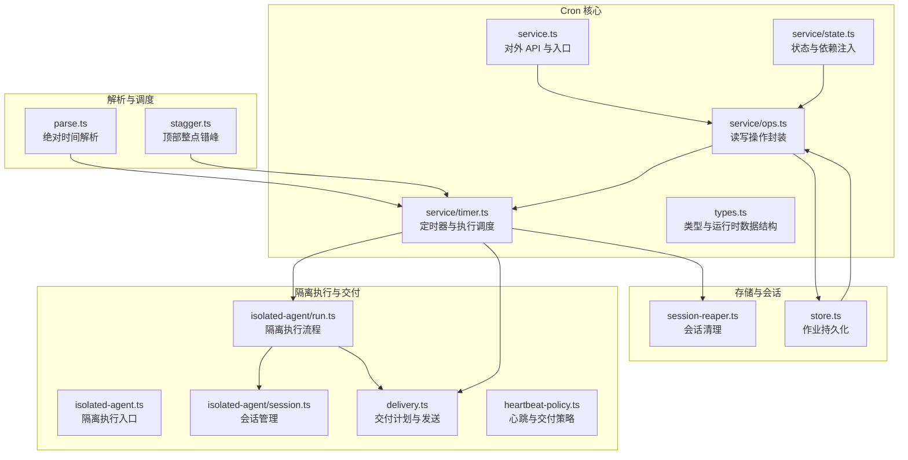
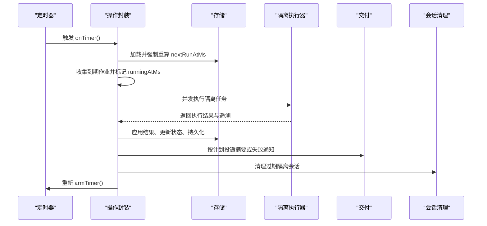
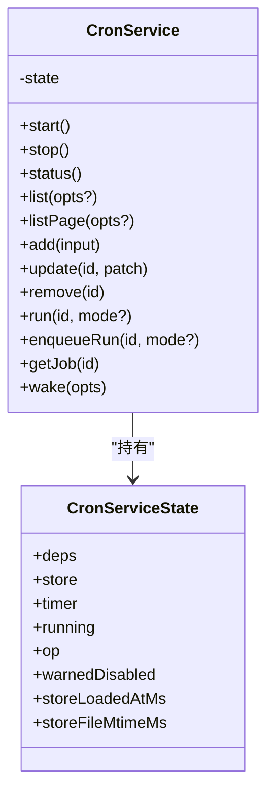
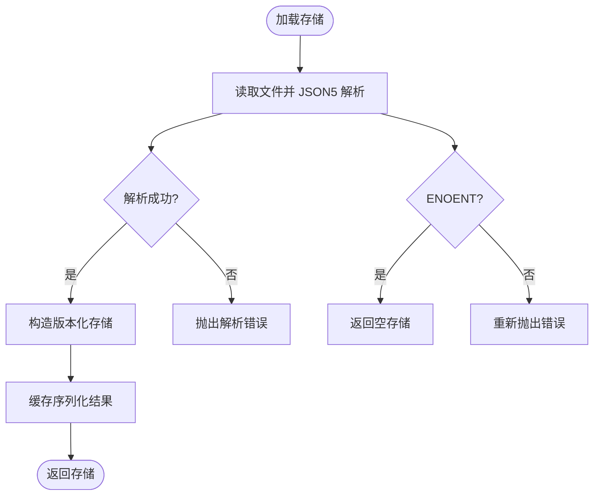
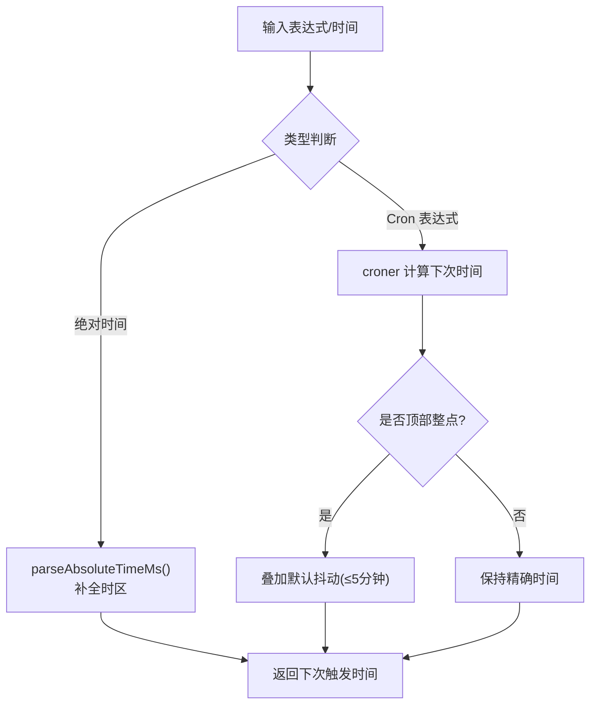
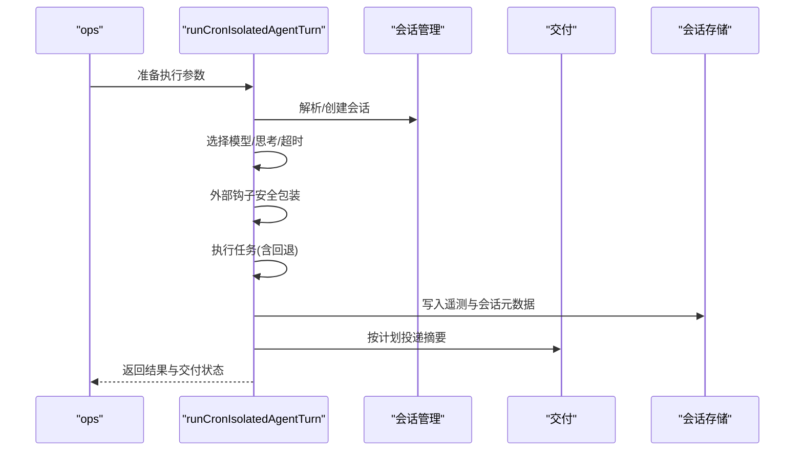
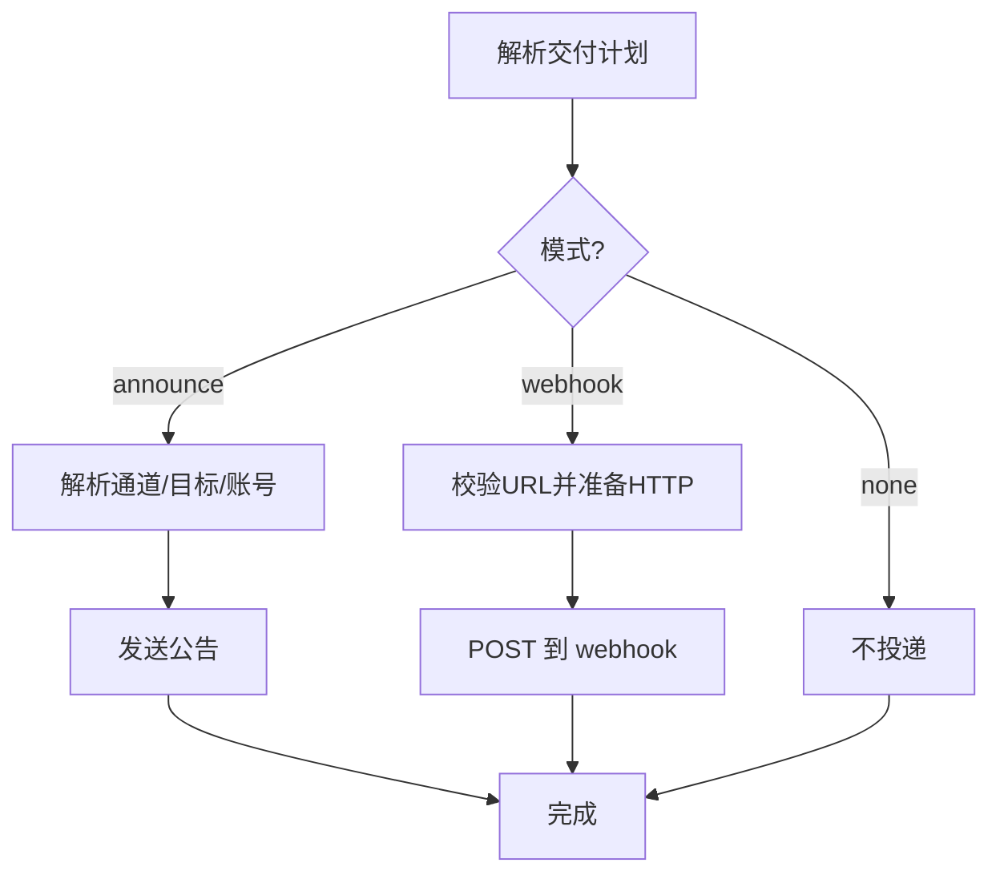
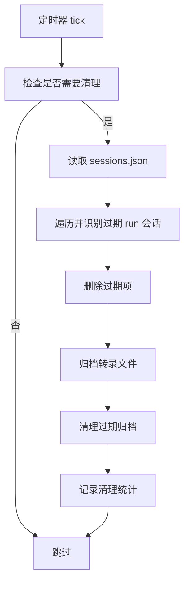
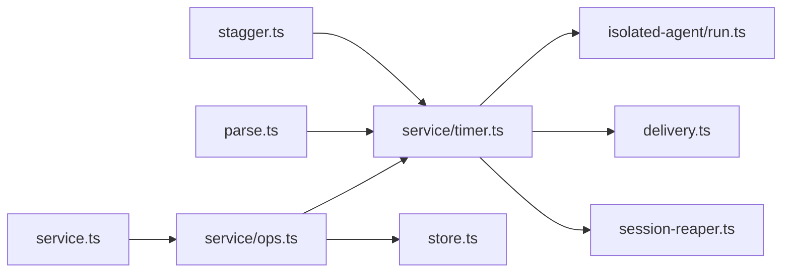

# Cron 作业系统

<cite>
**本文引用的文件**
- [src/cron/service.ts](file://src/cron/service.ts)
- [src/cron/service/state.ts](file://src/cron/service/state.ts)
- [src/cron/service/ops.ts](file://src/cron/service/ops.ts)
- [src/cron/service/timer.ts](file://src/cron/service/timer.ts)
- [src/cron/types.ts](file://src/cron/types.ts)
- [src/cron/parse.ts](file://src/cron/parse.ts)
- [src/cron/stagger.ts](file://src/cron/stagger.ts)
- [src/cron/store.ts](file://src/cron/store.ts)
- [src/cron/isolated-agent.ts](file://src/cron/isolated-agent.ts)
- [src/cron/isolated-agent/run.ts](file://src/cron/isolated-agent/run.ts)
- [src/cron/isolated-agent/session.ts](file://src/cron/isolated-agent/session.ts)
- [src/cron/delivery.ts](file://src/cron/delivery.ts)
- [src/cron/session-reaper.ts](file://src/cron/session-reaper.ts)
- [src/cron/heartbeat-policy.ts](file://src/cron/heartbeat-policy.ts)
- [docs/automation/cron-jobs.md](file://docs/automation/cron-jobs.md)
- [docs/automation/cron-vs-heartbeat.md](file://docs/automation/cron-vs-heartbeat.md)
</cite>

## 目录
1. [简介](#简介)
2. [项目结构](#项目结构)
3. [核心组件](#核心组件)
4. [架构总览](#架构总览)
5. [详细组件分析](#详细组件分析)
6. [依赖关系分析](#依赖关系分析)
7. [性能考量](#性能考量)
8. [故障排除指南](#故障排除指南)
9. [结论](#结论)
10. [附录](#附录)

## 简介
本技术文档面向 OpenClaw 的 Cron 作业系统，系统性阐述定时任务调度引擎的架构与实现原理，覆盖以下主题：
- Cron 表达式解析与调度：语法支持、时区处理、边界条件与负载分散
- 隔离代理机制：任务执行环境、资源管理与安全隔离
- 作业存储系统：持久化策略、状态跟踪与恢复机制
- 心跳监控与健康检查：失败告警、超时与回退策略
- 作业配置最佳实践：并发控制、重试策略、错误处理
- 性能优化与监控指标：限流、会话清理、日志裁剪
- 完整配置示例与故障排除

## 项目结构
OpenClaw 的 Cron 子系统位于 src/cron 目录，采用模块化设计，按职责划分为服务层、调度器、隔离执行、交付与会话清理等子模块，并通过统一的类型定义与状态机协同工作。

图表来源
- [src/cron/service.ts:1-60](file://src/cron/service.ts#L1-L60)
- [src/cron/service/ops.ts:1-120](file://src/cron/service/ops.ts#L1-L120)
- [src/cron/service/timer.ts:1-120](file://src/cron/service/timer.ts#L1-L120)
- [src/cron/store.ts:24-75](file://src/cron/store.ts#L24-L75)
- [src/cron/isolated-agent/run.ts:1-120](file://src/cron/isolated-agent/run.ts#L1-L120)
- [src/cron/delivery.ts:1-120](file://src/cron/delivery.ts#L1-L120)
- [src/cron/session-reaper.ts:1-80](file://src/cron/session-reaper.ts#L1-L80)

章节来源
- [src/cron/service.ts:1-60](file://src/cron/service.ts#L1-L60)
- [src/cron/service/state.ts:1-170](file://src/cron/service/state.ts#L1-L170)
- [src/cron/service/ops.ts:1-120](file://src/cron/service/ops.ts#L1-L120)
- [src/cron/store.ts:24-75](file://src/cron/store.ts#L24-L75)

## 核心组件
- CronService：对外暴露的主类，封装启动、停止、查询、增删改、手动运行、唤醒等能力；内部委托 service/ops 实现具体逻辑。
- CronServiceDeps/State：依赖注入与全局状态，包括日志、存储路径、心跳回调、隔离执行器、配置等。
- Ops（service/ops）：对 store 的读写、作业列表与分页、手动运行排队、事件发布等。
- Timer（service/timer）：基于 setTimeout 的调度器，负责计算下次唤醒时间、并发执行、超时控制、失败回退与会话清理。
- Types（types.ts）：定义作业、计划、交付、运行结果、遥测等核心类型。
- Parse/Stagger：解析绝对时间与时区、解析 Cron 表达式并应用默认错峰策略。
- Store：加载/保存作业存储文件，带权限设置与缓存。
- Isolated Agent：隔离执行器，构建会话、模型选择、思考层级、安全包装、工具策略与交付。
- Delivery：解析交付计划、失败通知目标、公告/网页钩子发送。
- Session Reaper：按保留期清理隔离执行产生的临时会话与转录文件。

章节来源
- [src/cron/service.ts:1-60](file://src/cron/service.ts#L1-L60)
- [src/cron/service/state.ts:1-170](file://src/cron/service/state.ts#L1-L170)
- [src/cron/service/ops.ts:1-120](file://src/cron/service/ops.ts#L1-L120)
- [src/cron/service/timer.ts:1-120](file://src/cron/service/timer.ts#L1-L120)
- [src/cron/types.ts:1-160](file://src/cron/types.ts#L1-L160)
- [src/cron/parse.ts:1-32](file://src/cron/parse.ts#L1-L32)
- [src/cron/stagger.ts:1-48](file://src/cron/stagger.ts#L1-L48)
- [src/cron/store.ts:24-75](file://src/cron/store.ts#L24-L75)
- [src/cron/isolated-agent.ts:1-2](file://src/cron/isolated-agent.ts#L1-L2)
- [src/cron/isolated-agent/run.ts:1-120](file://src/cron/isolated-agent/run.ts#L1-L120)
- [src/cron/delivery.ts:1-120](file://src/cron/delivery.ts#L1-L120)
- [src/cron/session-reaper.ts:1-80](file://src/cron/session-reaper.ts#L1-L80)

## 架构总览
Cron 调度器以“定时器 + 并发执行 + 状态机”的方式运行。其关键流程如下：
- 启动阶段：加载作业存储、清理异常运行标记、补跑错过任务、重新计算下次唤醒时间并上锁持久化。
- 周期触发：定时器到期后，收集到期作业，打上运行中标记，批量并发执行，完成后应用结果（状态、下一次运行时间、回退策略），并进行会话清理。
- 手动运行：通过队列保证非阻塞，准备阶段在锁内完成，实际执行在锁外进行，避免阻塞读操作。
- 隔离执行：为每个 Cron 作业创建独立会话，可选模型/思考层级覆盖，安全包装外部钩子内容，按交付计划投递或记录摘要。

图表来源
- [src/cron/service/timer.ts:572-731](file://src/cron/service/timer.ts#L572-L731)
- [src/cron/service/ops.ts:518-562](file://src/cron/service/ops.ts#L518-L562)
- [src/cron/isolated-agent/run.ts:201-240](file://src/cron/isolated-agent/run.ts#L201-L240)
- [src/cron/delivery.ts:1-120](file://src/cron/delivery.ts#L1-L120)
- [src/cron/session-reaper.ts:57-147](file://src/cron/session-reaper.ts#L57-L147)

## 详细组件分析

### CronService 类与对外 API
- 提供 start/stop/status/list/listPage/add/update/remove/run/enqueueRun/getJob/wake 等方法。
- 内部通过 createCronServiceState 初始化状态，委托 service/ops 执行具体逻辑。
- 事件发布：通过 onEvent 回调对外广播作业生命周期事件。

图表来源
- [src/cron/service.ts:1-60](file://src/cron/service.ts#L1-L60)
- [src/cron/service/state.ts:121-143](file://src/cron/service/state.ts#L121-L143)

章节来源
- [src/cron/service.ts:1-60](file://src/cron/service.ts#L1-L60)
- [src/cron/service/state.ts:1-170](file://src/cron/service/state.ts#L1-L170)

### 作业存储与状态跟踪
- 存储文件 jobs.json：版本化结构，jobs 数组保存所有作业。
- 加载策略：JSON5 解析，兼容旧格式；ENOENT 时返回空存储；缓存序列化结果避免重复写入。
- 权限保护：确保目录与文件权限为 0700/0600。
- 状态字段：nextRunAtMs/runningAtMs/lastRunAtMs/lastRunStatus/lastError/consecutiveErrors/lastFailureAlertAtMs/lastDeliveryStatus 等。
- 恢复机制：启动时清理异常运行标记，补跑错过任务，维护一致性。

图表来源
- [src/cron/store.ts:24-75](file://src/cron/store.ts#L24-L75)

章节来源
- [src/cron/store.ts:24-75](file://src/cron/store.ts#L24-L75)
- [src/cron/service/ops.ts:92-131](file://src/cron/service/ops.ts#L92-L131)

### Cron 表达式解析与调度
- 绝对时间解析：支持 ISO 8601、日期、日期时间与纯数字毫秒；自动补全时区。
- Cron 表达式：使用 croner，支持 5 字段与 6 字段（含秒），可指定 IANA 时区。
- 默认错峰：顶部整点（如 0 * * * * 或 0 0 * * *）自动加 0–5 分钟随机抖动，避免多网关同时触发。
- 手动覆盖：可通过 staggerMs 显式设置窗口或禁用（0）。

图表来源
- [src/cron/parse.ts:1-32](file://src/cron/parse.ts#L1-L32)
- [src/cron/stagger.ts:1-48](file://src/cron/stagger.ts#L1-L48)
- [src/cron/service/timer.ts:457-470](file://src/cron/service/timer.ts#L457-L470)

章节来源
- [src/cron/parse.ts:1-32](file://src/cron/parse.ts#L1-L32)
- [src/cron/stagger.ts:1-48](file://src/cron/stagger.ts#L1-L48)
- [src/cron/service/timer.ts:457-470](file://src/cron/service/timer.ts#L457-L470)

### 隔离代理机制：执行环境、资源与安全
- 会话管理：为每个 Cron 作业生成独立会话键，强制新会话以避免上下文污染；清理上次交付路由状态，防止线程回复错位。
- 模型与思考：优先级 job.payload.model > hooks.gmail.model > agent 默认；思考层级规范化，不支持 xhigh 的模型降级。
- 安全包装：外部钩子内容进行安全边界包裹与可疑模式检测；允许危险配置时可放宽限制。
- 工具策略：当请求了交付时，禁用消息工具以避免重复投递；仅在 Cron 自有交付路径生效。
- 超时与回退：按作业超时配置执行，支持模型回退链路；CLI 提供专用会话 ID 管理，避免恢复误判。
- 遥测：记录输入/输出/总 token、缓存读写、模型与提供商信息，写入会话存储。

图表来源
- [src/cron/isolated-agent/run.ts:201-240](file://src/cron/isolated-agent/run.ts#L201-L240)
- [src/cron/isolated-agent/session.ts:12-90](file://src/cron/isolated-agent/session.ts#L12-L90)
- [src/cron/delivery.ts:1-120](file://src/cron/delivery.ts#L1-L120)

章节来源
- [src/cron/isolated-agent/run.ts:1-200](file://src/cron/isolated-agent/run.ts#L1-L200)
- [src/cron/isolated-agent/session.ts:1-90](file://src/cron/isolated-agent/session.ts#L1-L90)
- [src/cron/delivery.ts:1-120](file://src/cron/delivery.ts#L1-L120)

### 交付与失败告警
- 交付计划：优先从 job.delivery 解析，其次从 payload 兼容字段；支持 announce/webhook/none；默认 announce。
- 失败告警：可配置 after/cooldown/channel/to/mode/accountId；支持与交付目标去重；失败通知支持超时与 Abort 控制。
- 心跳策略：当仅心跳响应且无媒体时，根据 ack 最大长度决定是否跳过交付；主会话摘要投递受 wakeMode 控制。

图表来源
- [src/cron/delivery.ts:50-120](file://src/cron/delivery.ts#L50-L120)
- [src/cron/heartbeat-policy.ts:1-49](file://src/cron/heartbeat-policy.ts#L1-L49)

章节来源
- [src/cron/delivery.ts:1-200](file://src/cron/delivery.ts#L1-L200)
- [src/cron/heartbeat-policy.ts:1-49](file://src/cron/heartbeat-policy.ts#L1-L49)

### 会话清理与运行日志
- 会话清理：按配置的 sessionRetention（默认 24 小时）清理以 cron:<jobId>:run:<uuid> 结尾的临时会话；每 5 分钟节流一次；删除后归档并清理过期归档。
- 运行日志：每个作业的 runs/<jobId>.jsonl 文件，支持按大小与行数裁剪；默认最大 2MB、保留最近 2000 行。

图表来源
- [src/cron/session-reaper.ts:57-147](file://src/cron/session-reaper.ts#L57-L147)

章节来源
- [src/cron/session-reaper.ts:1-153](file://src/cron/session-reaper.ts#L1-L153)

### 重试策略与错误处理
- 一次性作业（at）：瞬态错误最多重试 3 次，指数回退（30s→1m→5m）；永久错误立即禁用。
- 循环作业（cron/every）：每次错误应用指数回退（30s→1m→5m→15m→60m），成功后回退计数清零。
- 错误分类：基于错误字符串匹配 rate_limit/overloaded/network/timeout/server_error 等关键词。
- 失败告警：超过阈值后按 cooldown 发送失败通知（公告或 webhook），避免重复告警。

章节来源
- [src/cron/service/timer.ts:114-162](file://src/cron/service/timer.ts#L114-L162)
- [src/cron/service/timer.ts:295-474](file://src/cron/service/timer.ts#L295-L474)

## 依赖关系分析
- 低耦合高内聚：service/ops 作为门面，屏蔽 store/timer 的复杂性；隔离执行器与交付模块可独立演进。
- 关键依赖链：
  - service.ts → service/ops.ts → service/timer.ts → isolated-agent/run.ts → delivery.ts
  - service/ops.ts → store.ts
  - service/timer.ts → session-reaper.ts
  - parse.ts/stagger.ts 为调度侧提供时间与错峰支持
- 事件驱动：onEvent 回调贯穿 add/update/remove/start/finish 生命周期，便于外部观察与审计。

图表来源
- [src/cron/service.ts:1-60](file://src/cron/service.ts#L1-L60)
- [src/cron/service/ops.ts:1-120](file://src/cron/service/ops.ts#L1-L120)
- [src/cron/service/timer.ts:1-120](file://src/cron/service/timer.ts#L1-L120)
- [src/cron/store.ts:24-75](file://src/cron/store.ts#L24-L75)
- [src/cron/isolated-agent/run.ts:1-120](file://src/cron/isolated-agent/run.ts#L1-L120)
- [src/cron/delivery.ts:1-120](file://src/cron/delivery.ts#L1-L120)
- [src/cron/session-reaper.ts:1-80](file://src/cron/session-reaper.ts#L1-L80)
- [src/cron/parse.ts:1-32](file://src/cron/parse.ts#L1-L32)
- [src/cron/stagger.ts:1-48](file://src/cron/stagger.ts#L1-L48)

章节来源
- [src/cron/service.ts:1-60](file://src/cron/service.ts#L1-L60)
- [src/cron/service/ops.ts:1-120](file://src/cron/service/ops.ts#L1-L120)
- [src/cron/service/timer.ts:1-120](file://src/cron/service/timer.ts#L1-L120)

## 性能考量
- 并发控制：通过 cronConfig.maxConcurrentRuns 限制同时执行的任务数量，默认 1。
- 超时与回退：为隔离执行设置合理超时，避免长时间占用；启用模型回退链路提升成功率。
- 负载分散：顶部整点默认抖动减少峰值压力；手动 staggerMs 可进一步细化。
- I/O 优化：会话清理 5 分钟节流；运行日志按大小与行数裁剪；存储变更去重缓存。
- 日志裁剪：runLog.maxBytes 与 keepLines 控制运行日志体积，避免磁盘膨胀。

章节来源
- [src/cron/service/timer.ts:93-120](file://src/cron/service/timer.ts#L93-L120)
- [src/cron/service/timer.ts:507-570](file://src/cron/service/timer.ts#L507-L570)
- [src/cron/session-reaper.ts:22-40](file://src/cron/session-reaper.ts#L22-L40)
- [docs/automation/cron-jobs.md:426-431](file://docs/automation/cron-jobs.md#L426-L431)

## 故障排除指南
- 无任务运行：确认 cron.enabled 与环境变量 OPENCLAW_SKIP_CRON；检查主机时区与表达式时区；确认 Gateway 进程持续运行。
- 重复延迟：循环任务在连续错误后应用指数回退；成功后自动重置。一次性任务瞬态错误最多重试 3 次。
- Telegram 投递位置错误：明确使用 -100…:topic:<id>；避免歧义前缀导致解析问题。
- 子代理公告重试：若主会话繁忙，系统会最多重试 3 次并强制过期超过 5 分钟的条目，避免死循环。
- 运行日志过大：调整 cron.runLog.maxBytes 与 keepLines；定期使用 openclaw cron runs 查看历史并优化保留策略。

章节来源
- [docs/automation/cron-jobs.md:660-687](file://docs/automation/cron-jobs.md#L660-L687)
- [src/cron/service/timer.ts:114-162](file://src/cron/service/timer.ts#L114-L162)

## 结论
OpenClaw 的 Cron 作业系统以“可配置、可扩展、可观测”为目标，结合严格的存储与状态机、安全的隔离执行与交付策略、以及完善的失败告警与清理机制，为自动化场景提供了稳定可靠的调度能力。通过合理的并发、超时与错峰策略，可在高负载环境下保持系统稳定性与可维护性。

## 附录

### 作业配置最佳实践
- 并发控制：默认 1，高吞吐场景按资源评估适度提升。
- 重试策略：一次性任务建议保留默认 3 次重试；循环任务利用内置回退，必要时自定义 retry 配置。
- 错误处理：区分瞬态与永久错误；为关键任务开启失败告警并设置合理 cooldown。
- 交付策略：隔离任务默认 announce，避免主会话刷屏；必要时使用 webhook。
- 资源管理：启用会话清理与运行日志裁剪；合理设置 sessionRetention 与 runLog 参数。

章节来源
- [docs/automation/cron-jobs.md:401-445](file://docs/automation/cron-jobs.md#L401-L445)
- [docs/automation/cron-jobs.md:446-524](file://docs/automation/cron-jobs.md#L446-L524)

### Cron vs 心跳决策参考
- 心跳适合批量检查、上下文感知与低开销监控；Cron 适合精确时间、隔离执行与外部触发。
- 参考决策流程图与示例，结合成本与效果选择合适机制。

章节来源
- [docs/automation/cron-vs-heartbeat.md:133-156](file://docs/automation/cron-vs-heartbeat.md#L133-L156)
- [docs/automation/cron-vs-heartbeat.md:157-217](file://docs/automation/cron-vs-heartbeat.md#L157-L217)