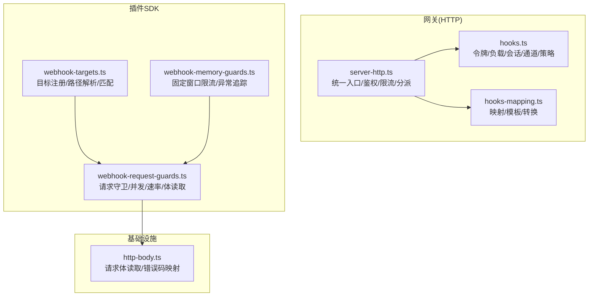
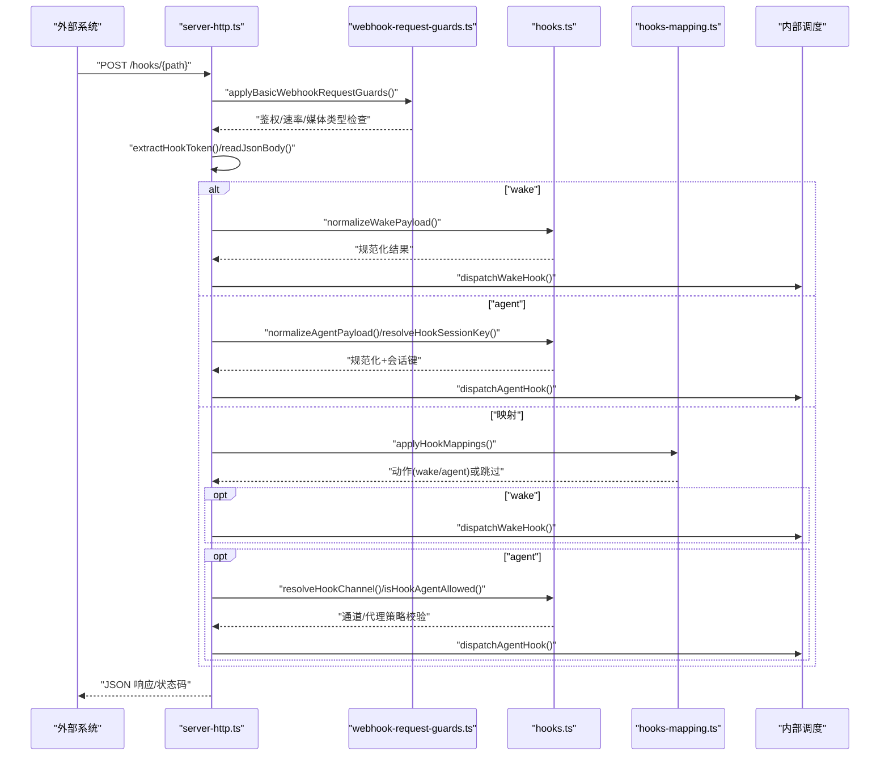
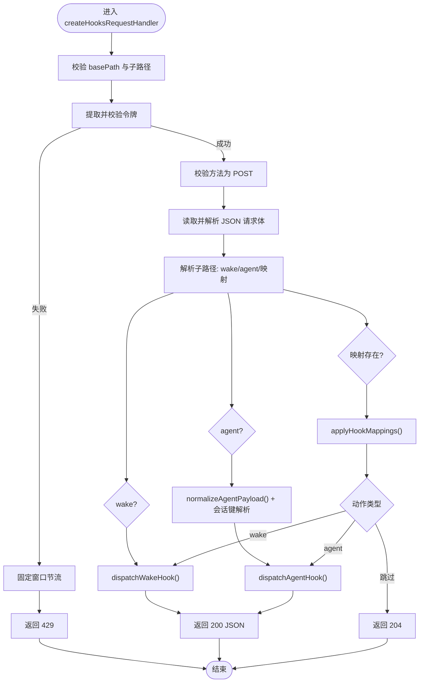
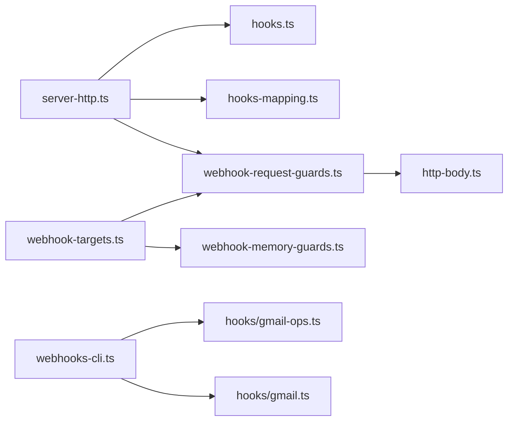

# Webhook 集成

<cite>
**本文引用的文件**
- [src/gateway/server-http.ts](file://src/gateway/server-http.ts)
- [src/gateway/hooks.ts](file://src/gateway/hooks.ts)
- [src/gateway/hooks-mapping.ts](file://src/gateway/hooks-mapping.ts)
- [src/plugin-sdk/webhook-targets.ts](file://src/plugin-sdk/webhook-targets.ts)
- [src/plugin-sdk/webhook-request-guards.ts](file://src/plugin-sdk/webhook-request-guards.ts)
- [src/plugin-sdk/webhook-memory-guards.ts](file://src/plugin-sdk/webhook-memory-guards.ts)
- [src/infra/http-body.ts](file://src/infra/http-body.ts)
- [docs/automation/webhook.md](file://docs/automation/webhook.md)
- [docs/cli/webhooks.md](file://docs/cli/webhooks.md)
- [src/cli/webhooks-cli.ts](file://src/cli/webhooks-cli.ts)
- [extensions/voice-call/src/webhook-security.ts](file://extensions/voice-call/src/webhook-security.ts)
- [extensions/nextcloud-talk/src/monitor.ts](file://extensions/nextcloud-talk/src/monitor.ts)
- [extensions/synology-chat/src/webhook-handler.test.ts](file://extensions/synology-chat/src/webhook-handler.test.ts)
- [src/gateway/server-http.hooks-request-timeout.test.ts](file://src/gateway/server-http.hooks-request-timeout.test.ts)
- [src/gateway/server-cron.ts](file://src/gateway/server-cron.ts)
</cite>

## 目录
1. [简介](#简介)
2. [项目结构](#项目结构)
3. [核心组件](#核心组件)
4. [架构总览](#架构总览)
5. [详细组件分析](#详细组件分析)
6. [依赖关系分析](#依赖关系分析)
7. [性能考量](#性能考量)
8. [故障排查指南](#故障排查指南)
9. [结论](#结论)
10. [附录](#附录)

## 简介
本文件面向 OpenClaw 的 Webhook 集成系统，提供从事件捕获、路由与分发、HTTP 钩子系统（请求验证、负载解析、响应处理）、配置管理（端点注册、认证、超时）、事件过滤与转换（内容匹配、数据映射、格式转换），到重试策略与错误处理（指数退避、最大重试次数、死信队列）的完整技术文档。同时给出安全最佳实践（签名验证、TLS 加密、访问控制）以及集成示例与调试工具使用指南。

## 项目结构
OpenClaw 的 Webhook 能力由“网关 HTTP 服务 + 钩子处理器 + 映射与转换 + 插件 SDK”共同构成：
- 网关层：统一 HTTP 入口，负责鉴权、限流、请求体读取、路径分派与响应。
- 钩子层：标准化钩子配置、令牌提取、负载规范化、会话键策略与通道解析。
- 映射层：基于预设或自定义规则进行内容匹配、模板渲染与动作合并。
- 插件 SDK：提供目标注册、路径解析、并发与速率限制、请求守卫等通用能力。
- CLI：提供 Gmail Pub/Sub 集成辅助命令。

图示来源
- [src/gateway/server-http.ts:348-564](file://src/gateway/server-http.ts#L348-L564)
- [src/gateway/hooks.ts:36-94](file://src/gateway/hooks.ts#L36-L94)
- [src/gateway/hooks-mapping.ts:106-145](file://src/gateway/hooks-mapping.ts#L106-L145)
- [src/plugin-sdk/webhook-targets.ts:57-100](file://src/plugin-sdk/webhook-targets.ts#L57-L100)
- [src/plugin-sdk/webhook-request-guards.ts:139-227](file://src/plugin-sdk/webhook-request-guards.ts#L139-L227)
- [src/plugin-sdk/webhook-memory-guards.ts:51-105](file://src/plugin-sdk/webhook-memory-guards.ts#L51-L105)
- [src/infra/http-body.ts:1-44](file://src/infra/http-body.ts#L1-L44)

章节来源
- [src/gateway/server-http.ts:348-564](file://src/gateway/server-http.ts#L348-L564)
- [src/gateway/hooks.ts:36-94](file://src/gateway/hooks.ts#L36-L94)
- [src/gateway/hooks-mapping.ts:106-145](file://src/gateway/hooks-mapping.ts#L106-L145)
- [src/plugin-sdk/webhook-targets.ts:57-100](file://src/plugin-sdk/webhook-targets.ts#L57-L100)
- [src/plugin-sdk/webhook-request-guards.ts:139-227](file://src/plugin-sdk/webhook-request-guards.ts#L139-L227)
- [src/plugin-sdk/webhook-memory-guards.ts:51-105](file://src/plugin-sdk/webhook-memory-guards.ts#L51-L105)
- [src/infra/http-body.ts:1-44](file://src/infra/http-body.ts#L1-L44)

## 核心组件
- 网关 HTTP 请求处理器：负责鉴权、方法校验、查询参数拒绝、请求体读取、路径分派至 wake/agent 或映射动作，并返回标准 JSON 响应。
- 钩子配置与策略：解析 hooks 配置、令牌提取、负载规范化、会话键策略（默认值、前缀白名单、是否允许请求覆盖）、通道解析与多代理路由限制。
- 映射与转换：支持预设（如 Gmail）与自定义映射，通过模板渲染与可选的 TS/JS 转换模块实现内容匹配与动作合并。
- 插件 SDK：提供目标注册（按路径聚合）、路径解析与规范化、请求守卫（方法/速率/并发/媒体类型）、请求体读取（带超时与大小限制）。
- 内存守卫：固定窗口速率限制器、异常计数器与追踪器，用于识别与缓解异常模式。
- CLI 工具：Gmail Pub/Sub 集成的 setup/run 辅助命令，简化外部系统接入。

章节来源
- [src/gateway/server-http.ts:348-564](file://src/gateway/server-http.ts#L348-L564)
- [src/gateway/hooks.ts:36-94](file://src/gateway/hooks.ts#L36-L94)
- [src/gateway/hooks-mapping.ts:106-145](file://src/gateway/hooks-mapping.ts#L106-L145)
- [src/plugin-sdk/webhook-targets.ts:57-100](file://src/plugin-sdk/webhook-targets.ts#L57-L100)
- [src/plugin-sdk/webhook-request-guards.ts:139-227](file://src/plugin-sdk/webhook-request-guards.ts#L139-L227)
- [src/plugin-sdk/webhook-memory-guards.ts:51-105](file://src/plugin-sdk/webhook-memory-guards.ts#L51-L105)
- [src/cli/webhooks-cli.ts:23-104](file://src/cli/webhooks-cli.ts#L23-L104)

## 架构总览
下图展示从客户端到内部调度的整体流程：HTTP 入口 → 鉴权与守卫 → 路径解析 → 映射/负载规范化 → 会话键与目标代理解析 → 分发到心跳或隔离 Agent 运行。

图示来源
- [src/gateway/server-http.ts:348-564](file://src/gateway/server-http.ts#L348-L564)
- [src/plugin-sdk/webhook-request-guards.ts:139-227](file://src/plugin-sdk/webhook-request-guards.ts#L139-L227)
- [src/gateway/hooks.ts:209-409](file://src/gateway/hooks.ts#L209-L409)
- [src/gateway/hooks-mapping.ts:147-183](file://src/gateway/hooks-mapping.ts#L147-L183)

## 详细组件分析

### 组件一：HTTP 钩子系统（server-http.ts）
- 功能要点
  - 仅接受 POST 方法；拒绝查询参数中的 token；拒绝非 POST 返回 405。
  - 提取 Authorization 头或自定义头中的令牌，执行安全相等比较；失败则记录并按固定窗口节流。
  - 读取 JSON 请求体，支持超大/超时/连接关闭错误映射。
  - 路径分派：/hooks/wake → 触发心跳；/hooks/agent → 触发隔离 Agent 运行；否则尝试映射。
  - 映射命中后根据动作类型分派，支持 wake/agent 两种行为。
- 错误处理
  - 400/408/413/401/429 等状态码与消息标准化。
  - 映射失败返回 500 并记录日志。
- 安全与可观测性
  - 速率限制与节流；鉴权失败记录；幂等性保证（映射跳过返回 204）。

图示来源
- [src/gateway/server-http.ts:348-564](file://src/gateway/server-http.ts#L348-L564)
- [src/gateway/hooks.ts:209-409](file://src/gateway/hooks.ts#L209-L409)
- [src/gateway/hooks-mapping.ts:147-183](file://src/gateway/hooks-mapping.ts#L147-L183)

章节来源
- [src/gateway/server-http.ts:348-564](file://src/gateway/server-http.ts#L348-L564)

### 组件二：钩子配置与策略（hooks.ts）
- 配置解析
  - basePath、token、maxBodyBytes、mappings、agentPolicy、sessionPolicy。
  - basePath 不允许为根路径；默认最大体大小；会话键前缀白名单必须与默认值一致。
- 令牌提取
  - 支持 Authorization: Bearer 与自定义头；拒绝查询参数 token。
- 负载规范化
  - wake：text 必填，mode 默认 now。
  - agent：message 必填，channel 支持 last 与已启用插件；可选 deliver、模型、思考级别、超时。
- 会话键策略
  - 支持默认值、请求覆盖开关、前缀白名单；不合法前缀直接拒绝。
- 代理路由策略
  - allowedAgentIds 支持通配符与集合；未知 ID 回退到默认代理。

章节来源
- [src/gateway/hooks.ts:36-94](file://src/gateway/hooks.ts#L36-L94)
- [src/gateway/hooks.ts:158-195](file://src/gateway/hooks.ts#L158-L195)
- [src/gateway/hooks.ts:209-409](file://src/gateway/hooks.ts#L209-L409)

### 组件三：映射与转换（hooks-mapping.ts）
- 映射类型
  - 匹配条件：path/source；动作：wake/agent；可选字段：name、agentId、sessionKey、message/text 模板、deliver、通道、收件人、模型、思考级别、超时、是否允许不安全外部内容。
- 预设映射
  - Gmail 预设：自动填充消息模板与会话键占位。
- 模板渲染
  - 支持 payload.*、headers.*、query.*、path、now 等表达式；阻断原型链与构造相关路径。
- 自定义转换
  - 可加载本地 TS/JS 模块，导出函数作为转换器；模块路径受安全约束，禁止越界。
- 合并策略
  - 将映射基础动作与转换结果合并，优先使用转换结果。

章节来源
- [src/gateway/hooks-mapping.ts:67-80](file://src/gateway/hooks-mapping.ts#L67-L80)
- [src/gateway/hooks-mapping.ts:147-183](file://src/gateway/hooks-mapping.ts#L147-L183)
- [src/gateway/hooks-mapping.ts:224-237](file://src/gateway/hooks-mapping.ts#L224-L237)
- [src/gateway/hooks-mapping.ts:239-273](file://src/gateway/hooks-mapping.ts#L239-L273)
- [src/gateway/hooks-mapping.ts:275-313](file://src/gateway/hooks-mapping.ts#L275-L313)
- [src/gateway/hooks-mapping.ts:328-350](file://src/gateway/hooks-mapping.ts#L328-L350)
- [src/gateway/hooks-mapping.ts:387-423](file://src/gateway/hooks-mapping.ts#L387-L423)
- [src/gateway/hooks-mapping.ts:444-461](file://src/gateway/hooks-mapping.ts#L444-L461)
- [src/gateway/hooks-mapping.ts:485-527](file://src/gateway/hooks-mapping.ts#L485-L527)

### 组件四：插件 SDK（webhook-targets.ts）
- 目标注册
  - 将同一路径的目标聚合为数组；首次出现时注册插件 HTTP 路由；最后移除时清理路由。
- 路径解析与匹配
  - 规范化路径；解析单目标匹配；支持同步/异步匹配；歧义与未授权分别返回不同状态码。
- 请求管道
  - withResolvedWebhookRequestPipeline：解析目标 → 应用守卫 → 执行回调 → 释放并发锁。

章节来源
- [src/plugin-sdk/webhook-targets.ts:57-100](file://src/plugin-sdk/webhook-targets.ts#L57-L100)
- [src/plugin-sdk/webhook-targets.ts:102-113](file://src/plugin-sdk/webhook-targets.ts#L102-L113)
- [src/plugin-sdk/webhook-targets.ts:115-162](file://src/plugin-sdk/webhook-targets.ts#L115-L162)
- [src/plugin-sdk/webhook-targets.ts:186-220](file://src/plugin-sdk/webhook-targets.ts#L186-L220)
- [src/plugin-sdk/webhook-targets.ts:222-271](file://src/plugin-sdk/webhook-targets.ts#L222-L271)

### 组件五：请求守卫与内存守卫（webhook-request-guards.ts, webhook-memory-guards.ts）
- 请求守卫
  - 方法白名单、速率限制、JSON 媒体类型校验、并发限制（每键最大并发、键池大小裁剪）。
  - 请求体读取：支持预认证与认证后两类读取配置（大小与超时）。
- 内存守卫
  - 固定窗口速率限制器：窗口大小、最大请求数、键池大小与裁剪间隔。
  - 异常追踪器：对 400/401/408/413/415/429 状态码计数，周期性日志输出。

章节来源
- [src/plugin-sdk/webhook-request-guards.ts:139-227](file://src/plugin-sdk/webhook-request-guards.ts#L139-L227)
- [src/plugin-sdk/webhook-request-guards.ts:229-290](file://src/plugin-sdk/webhook-request-guards.ts#L229-L290)
- [src/plugin-sdk/webhook-memory-guards.ts:51-105](file://src/plugin-sdk/webhook-memory-guards.ts#L51-L105)
- [src/plugin-sdk/webhook-memory-guards.ts:164-196](file://src/plugin-sdk/webhook-memory-guards.ts#L164-L196)

### 组件六：基础设施（http-body.ts）
- 请求体读取与错误映射：统一错误码（超大/超时/连接关闭）与默认响应消息。
- 默认限制：最大字节数与超时毫秒数。

章节来源
- [src/infra/http-body.ts:1-44](file://src/infra/http-body.ts#L1-L44)

### 组件七：CLI 集成（webhooks-cli.ts）
- 子命令：webhooks gmail setup/run，封装 Gmail Pub/Sub watch 与推送服务配置与运行。
- 参数解析：账户、项目、主题/订阅、标签、钩子 URL/令牌、推送令牌、绑定地址/端口/路径、是否包含正文、最大字节、轮询周期、Tailscale 暴露模式与目标。

章节来源
- [src/cli/webhooks-cli.ts:23-104](file://src/cli/webhooks-cli.ts#L23-L104)

## 依赖关系分析
- server-http.ts 依赖 hooks.ts（令牌/负载/会话/通道）、hooks-mapping.ts（映射应用）、webhook-request-guards.ts（守卫）、infra/http-body.ts（请求体读取）。
- webhook-targets.ts 依赖 webhook-request-guards.ts（守卫与并发）、webhook-memory-guards.ts（速率/异常）。
- CLI 依赖 hooks/gmail-ops 与 hooks/gmail 实现 Gmail 集成。

图示来源
- [src/gateway/server-http.ts:348-564](file://src/gateway/server-http.ts#L348-L564)
- [src/gateway/hooks.ts:36-94](file://src/gateway/hooks.ts#L36-L94)
- [src/gateway/hooks-mapping.ts:106-145](file://src/gateway/hooks-mapping.ts#L106-L145)
- [src/plugin-sdk/webhook-targets.ts:57-100](file://src/plugin-sdk/webhook-targets.ts#L57-L100)
- [src/plugin-sdk/webhook-request-guards.ts:139-227](file://src/plugin-sdk/webhook-request-guards.ts#L139-L227)
- [src/plugin-sdk/webhook-memory-guards.ts:51-105](file://src/plugin-sdk/webhook-memory-guards.ts#L51-L105)
- [src/infra/http-body.ts:1-44](file://src/infra/http-body.ts#L1-L44)
- [src/cli/webhooks-cli.ts:23-104](file://src/cli/webhooks-cli.ts#L23-L104)

章节来源
- [src/gateway/server-http.ts:348-564](file://src/gateway/server-http.ts#L348-L564)
- [src/plugin-sdk/webhook-targets.ts:57-100](file://src/plugin-sdk/webhook-targets.ts#L57-L100)
- [src/plugin-sdk/webhook-request-guards.ts:139-227](file://src/plugin-sdk/webhook-request-guards.ts#L139-L227)
- [src/plugin-sdk/webhook-memory-guards.ts:51-105](file://src/plugin-sdk/webhook-memory-guards.ts#L51-L105)
- [src/infra/http-body.ts:1-44](file://src/infra/http-body.ts#L1-L44)
- [src/cli/webhooks-cli.ts:23-104](file://src/cli/webhooks-cli.ts#L23-L104)

## 性能考量
- 速率限制：固定窗口限流器在窗口内统计请求，超过阈值即节流；建议按客户端 IP 或来源键区分。
- 并发控制：每键最大并发限制，避免热点路径拥塞；键池大小裁剪防止内存膨胀。
- 请求体读取：区分预认证与认证后读取，降低恶意请求对资源消耗；超时与大小限制保护 CPU/内存。
- 映射与模板：模板渲染与转换模块需注意复杂度；建议缓存转换函数与限制模板复杂度。
- 日志与异常追踪：异常计数器周期性日志有助于快速定位异常模式。

## 故障排查指南
- 认证失败与节流
  - 现象：401/429；节流后返回 Retry-After。
  - 排查：确认 Authorization 头或自定义头携带正确令牌；检查客户端 IP 是否被节流。
- 查询参数 token
  - 现象：400；提示令牌必须通过头部传递。
  - 排查：确保使用 Authorization: Bearer 或自定义头，不要使用查询参数。
- 方法不被允许
  - 现象：405；Allow: POST。
  - 排查：仅支持 POST 方法。
- 请求体过大/超时/连接关闭
  - 现象：413/408/400。
  - 排查：调整 maxBodyBytes 与超时；检查网络稳定性。
- 通道/代理策略错误
  - 现象：400；通道无效或代理不允许。
  - 排查：确认通道列表与 allowedAgentIds 配置。
- 映射失败
  - 现象：500；日志记录映射失败。
  - 排查：检查映射规则、模板语法与转换模块导出。
- CLI 集成问题
  - 现象：Gmail Pub/Sub 配置/运行失败。
  - 排查：核对账户、主题/订阅、推送令牌、绑定地址/端口/路径与 Tailscale 配置。

章节来源
- [src/gateway/server-http.ts:383-398](file://src/gateway/server-http.ts#L383-L398)
- [src/gateway/server-http.ts:392-398](file://src/gateway/server-http.ts#L392-L398)
- [src/gateway/server-http.ts:429-439](file://src/gateway/server-http.ts#L429-L439)
- [src/gateway/hooks.ts:248-260](file://src/gateway/hooks.ts#L248-L260)
- [src/gateway/hooks.ts:281-296](file://src/gateway/hooks.ts#L281-L296)
- [src/gateway/server-http.ts:552-556](file://src/gateway/server-http.ts#L552-L556)
- [src/cli/webhooks-cli.ts:107-171](file://src/cli/webhooks-cli.ts#L107-L171)

## 结论
OpenClaw 的 Webhook 集成以“网关统一入口 + 钩子策略 + 映射转换 + 插件 SDK 守卫”为核心，具备完善的鉴权、限流、并发控制、请求体读取与错误处理能力。通过 CLI 工具可快速对接 Gmail Pub/Sub 等外部系统。建议在生产环境遵循安全最佳实践，合理配置会话键前缀与代理路由白名单，并结合异常追踪与日志监控持续优化性能与稳定性。

## 附录

### 配置管理与安全最佳实践
- 配置项
  - hooks.enabled/token/path/allowedAgentIds/defaultSessionKey/allowRequestSessionKey/allowedSessionKeyPrefixes/maxBodyBytes/presets/mappings/transformsDir。
- 安全建议
  - 使用专用钩子令牌，避免复用网关令牌；保持 hooks.allowRequestSessionKey=false；严格限定 allowedSessionKeyPrefixes；启用 allowedAgentIds 白名单；避免在日志中记录敏感原始负载；必要时在映射中禁用外部内容安全包装（危险）。
- TLS 与访问控制
  - 在反向代理或网关层启用 TLS；结合可信代理与主机头白名单；对公网暴露的钩子端点实施最小权限访问控制。

章节来源
- [docs/automation/webhook.md:15-216](file://docs/automation/webhook.md#L15-L216)
- [src/gateway/hooks.ts:36-94](file://src/gateway/hooks.ts#L36-L94)
- [extensions/voice-call/src/webhook-security.ts:138-165](file://extensions/voice-call/src/webhook-security.ts#L138-L165)

### 重试策略与错误处理
- 固定窗口限流：窗口大小与最大请求数可调；键池裁剪避免内存增长。
- 异常追踪：对特定状态码计数并周期性日志输出，便于识别异常模式。
- 死信队列：当前代码未见内置死信队列实现；可通过外部系统或扩展实现。

章节来源
- [src/plugin-sdk/webhook-memory-guards.ts:51-105](file://src/plugin-sdk/webhook-memory-guards.ts#L51-L105)
- [src/plugin-sdk/webhook-memory-guards.ts:164-196](file://src/plugin-sdk/webhook-memory-guards.ts#L164-L196)

### 集成示例与调试工具
- 示例
  - curl 调用 /hooks/wake 与 /hooks/agent；使用 Authorization 头或自定义头传递令牌；根据需要指定模型、思考级别与超时。
- 调试
  - 使用 CLI 命令 openclaw webhooks gmail setup/run 快速完成 Gmail Pub/Sub 配置与运行；结合测试用例验证非 POST/缺失令牌/超时/429 等场景。

章节来源
- [docs/automation/webhook.md:168-203](file://docs/automation/webhook.md#L168-L203)
- [docs/cli/webhooks.md:18-26](file://docs/cli/webhooks.md#L18-L26)
- [src/cli/webhooks-cli.ts:23-104](file://src/cli/webhooks-cli.ts#L23-L104)
- [extensions/synology-chat/src/webhook-handler.test.ts:142-191](file://extensions/synology-chat/src/webhook-handler.test.ts#L142-L191)
- [src/gateway/server-http.hooks-request-timeout.test.ts:18-49](file://src/gateway/server-http.hooks-request-timeout.test.ts#L18-L49)

### 签名验证与安全加固
- 签名验证
  - 针对特定平台（如 Nextcloud Talk）提供签名头校验与随机数/签名组合验证。
- 主机重建安全
  - 通过 allowedHosts/trustForwardingHeaders/trustedProxyIPs/remoteIP 等选项防止 Host 注入攻击。
- 平台差异
  - 不同插件可能采用不同的签名算法与头部约定，需按平台文档配置。

章节来源
- [extensions/nextcloud-talk/src/monitor.ts:94-130](file://extensions/nextcloud-talk/src/monitor.ts#L94-L130)
- [extensions/voice-call/src/webhook-security.ts:138-165](file://extensions/voice-call/src/webhook-security.ts#L138-L165)

### 与其他系统联动
- Cron 通知
  - Cron 任务完成后通过 HTTP Webhook 发送通知，携带 Authorization 令牌与 JSON 负载。
- 平台适配
  - 不同聊天平台（如 MSTeams）对 Webhook 超时有特殊要求，可在服务器层设置相应超时参数。

章节来源
- [src/gateway/server-cron.ts:63-92](file://src/gateway/server-cron.ts#L63-L92)